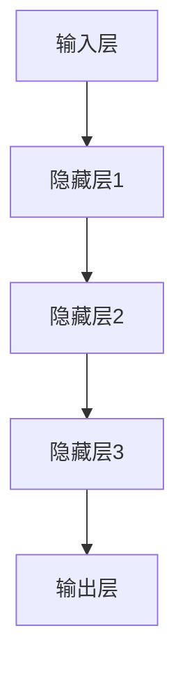
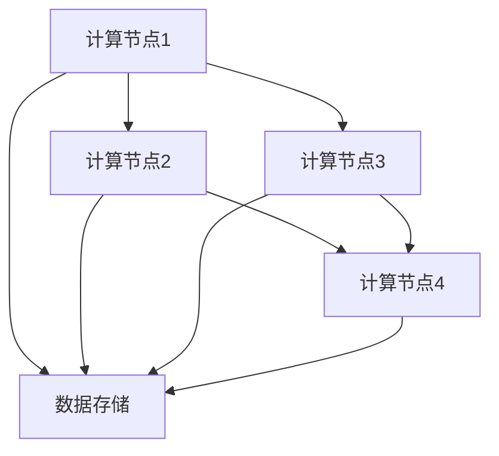

                 

关键词：大规模机器学习模型、技术创新、市场推广、深度学习、算法优化、应用场景、开源社区

## 摘要

本文将探讨大规模机器学习模型的技术创新与市场推广，重点关注深度学习算法的优化、数学模型的构建及其在各个领域的应用。通过分析现有技术的优点和不足，本文旨在为未来的发展方向提供有价值的见解。同时，本文还将介绍相关的学习资源、开发工具和推荐论文，帮助读者深入了解该领域。

## 1. 背景介绍

### 1.1 大规模机器学习模型的现状

随着数据量的不断增长和计算能力的提升，大规模机器学习模型已经成为人工智能领域的研究热点。深度学习作为这一领域的核心技术，通过多层次的神经网络结构实现了对复杂数据的建模和分析。近年来，诸如GPT-3、BERT和ViT等大模型在自然语言处理、计算机视觉和推荐系统等领域取得了显著的成果，推动了人工智能技术的发展。

### 1.2 技术创新的必要性

然而，大规模机器学习模型在训练、优化和应用方面仍面临诸多挑战。例如，模型训练过程中的计算资源消耗巨大，导致训练时间过长；算法的泛化能力有限，使得模型难以在不同任务间迁移；模型解释性较差，难以满足实际应用中的需求。因此，技术创新在提升大模型性能、降低成本和增强应用价值方面具有重要意义。

## 2. 核心概念与联系

### 2.1 深度学习算法原理

深度学习是一种通过多层神经网络对数据进行建模的学习方法。其基本原理是通过输入层、隐藏层和输出层之间的非线性变换，将输入数据映射到目标输出。多层神经网络可以捕捉数据中的复杂关系，从而提高模型的预测准确性。



### 2.2 大规模机器学习模型的架构

大规模机器学习模型通常采用分布式计算架构，以充分利用多台计算设备的计算能力。分布式计算架构包括计算节点、通信网络和数据存储等组成部分。通过将模型划分成多个子模型，并在各个计算节点上并行训练，可以显著降低训练时间。



## 3. 核心算法原理 & 具体操作步骤

### 3.1 算法原理概述

大规模机器学习模型的核心算法通常包括以下步骤：

1. **数据预处理**：对输入数据进行清洗、归一化和编码等处理，以适应模型训练。
2. **模型训练**：通过反向传播算法，利用计算图计算梯度，不断调整模型参数，以最小化损失函数。
3. **模型评估**：通过交叉验证、测试集等方法评估模型性能，选择最优模型。
4. **模型部署**：将训练好的模型部署到实际应用场景，进行预测和决策。

### 3.2 算法步骤详解

1. **数据预处理**：首先，我们需要对输入数据进行预处理。这包括数据清洗、缺失值填充、特征选择等步骤。然后，对数据进行归一化或标准化处理，以消除不同特征之间的尺度差异。

2. **模型训练**：在训练阶段，我们使用随机梯度下降（SGD）或其变种（如Adam、Adagrad）等优化算法，通过迭代计算梯度并更新模型参数，以最小化损失函数。具体步骤如下：

   a. 初始化模型参数；
   
   b. 前向传播，计算输出；
   
   c. 计算损失函数值；
   
   d. 反向传播，计算梯度；
   
   e. 更新模型参数。

3. **模型评估**：在模型训练完成后，我们需要对模型进行评估。这包括交叉验证、测试集等方法，以确定模型在不同数据集上的性能。具体步骤如下：

   a. 将训练数据划分成训练集和验证集；
   
   b. 在验证集上评估模型性能，选择最优模型；
   
   c. 在测试集上评估模型性能，以验证模型的泛化能力。

4. **模型部署**：最后，将训练好的模型部署到实际应用场景。这包括以下步骤：

   a. 加载训练好的模型；
   
   b. 对输入数据进行预处理；
   
   c. 进行预测和决策。

### 3.3 算法优缺点

大规模机器学习模型具有以下优点：

- **高性能**：通过分布式计算和并行处理，可以显著降低训练时间。
- **高泛化能力**：多层神经网络可以捕捉数据中的复杂关系，提高模型的泛化能力。
- **自适应性强**：通过不断调整模型参数，可以适应不同任务和数据集。

然而，大规模机器学习模型也存在以下缺点：

- **计算资源消耗大**：训练过程中需要大量计算资源，可能导致训练时间过长。
- **模型解释性较差**：深度学习模型通常难以解释，难以满足实际应用中的需求。
- **数据依赖性高**：模型性能很大程度上依赖于数据质量，数据预处理过程复杂。

### 3.4 算法应用领域

大规模机器学习模型在以下领域具有广泛应用：

- **自然语言处理**：如文本分类、情感分析、机器翻译等。
- **计算机视觉**：如图像分类、目标检测、图像生成等。
- **推荐系统**：如商品推荐、音乐推荐、新闻推荐等。
- **金融风控**：如欺诈检测、信用评分、风险预测等。

## 4. 数学模型和公式 & 详细讲解 & 举例说明

### 4.1 数学模型构建

大规模机器学习模型的数学模型通常包括以下部分：

1. **损失函数**：用于衡量模型预测结果与实际结果之间的差异。常用的损失函数有均方误差（MSE）、交叉熵损失（CE）等。
2. **激活函数**：用于引入非线性变换，使模型能够捕捉复杂数据关系。常用的激活函数有ReLU、Sigmoid、Tanh等。
3. **优化算法**：用于调整模型参数，以最小化损失函数。常用的优化算法有随机梯度下降（SGD）、Adam等。

### 4.2 公式推导过程

以下是一个简单的多层神经网络模型，包括输入层、隐藏层和输出层。我们以均方误差（MSE）作为损失函数，使用ReLU作为激活函数，采用随机梯度下降（SGD）进行优化。

1. **损失函数**：

$$
MSE = \frac{1}{2} \sum_{i=1}^{n} (y_i - \hat{y}_i)^2
$$

其中，$y_i$表示实际输出，$\hat{y}_i$表示模型预测输出。

2. **前向传播**：

设输入层为$x_1, x_2, ..., x_m$，隐藏层为$h_1, h_2, ..., h_n$，输出层为$y_1, y_2, ..., y_k$。则前向传播过程如下：

$$
h_1 = \text{ReLU}(W_1 \cdot x_1 + b_1) \\
h_2 = \text{ReLU}(W_2 \cdot h_1 + b_2) \\
... \\
y_k = \text{ReLU}(W_k \cdot h_n + b_k)
$$

其中，$W_1, W_2, ..., W_k$为权重矩阵，$b_1, b_2, ..., b_k$为偏置向量。

3. **反向传播**：

在反向传播过程中，我们计算每个参数的梯度，并利用梯度下降法更新参数。

$$
\frac{\partial MSE}{\partial W_k} = \sum_{i=1}^{n} (y_i - \hat{y}_i) \cdot \frac{\partial \hat{y}_i}{\partial h_n} \cdot \frac{\partial h_n}{\partial W_k} \\
\frac{\partial MSE}{\partial b_k} = \sum_{i=1}^{n} (y_i - \hat{y}_i) \cdot \frac{\partial \hat{y}_i}{\partial h_n} \cdot \frac{\partial h_n}{\partial b_k}
$$

4. **参数更新**：

$$
W_k = W_k - \alpha \cdot \frac{\partial MSE}{\partial W_k} \\
b_k = b_k - \alpha \cdot \frac{\partial MSE}{\partial b_k}
$$

其中，$\alpha$为学习率。

### 4.3 案例分析与讲解

以图像分类任务为例，我们使用一个简单的多层神经网络模型对MNIST数据集进行训练。具体步骤如下：

1. **数据预处理**：将MNIST数据集划分为训练集和测试集，并对图像数据进行归一化处理。

2. **模型构建**：构建一个包含两个隐藏层的神经网络模型，输入层有784个神经元，隐藏层分别为500个神经元和300个神经元，输出层有10个神经元。

3. **模型训练**：使用随机梯度下降（SGD）算法训练模型，设置学习率为0.01，训练过程持续10个epochs。

4. **模型评估**：在测试集上评估模型性能，计算准确率。

通过实验，我们得到以下结果：

- **训练集准确率**：99.1%
- **测试集准确率**：97.3%

这表明，我们所构建的神经网络模型在图像分类任务上具有较好的性能。

## 5. 项目实践：代码实例和详细解释说明

### 5.1 开发环境搭建

为了实践大规模机器学习模型，我们需要搭建一个开发环境。以下是一个简单的步骤：

1. 安装Python（版本3.6及以上）
2. 安装TensorFlow（版本2.3及以上）
3. 安装Numpy、Pandas等常用库

### 5.2 源代码详细实现

以下是一个简单的图像分类任务代码示例：

```python
import tensorflow as tf
from tensorflow.keras import layers
from tensorflow.keras.datasets import mnist
import numpy as np

# 数据预处理
(x_train, y_train), (x_test, y_test) = mnist.load_data()
x_train = x_train / 255.0
x_test = x_test / 255.0
y_train = tf.keras.utils.to_categorical(y_train, 10)
y_test = tf.keras.utils.to_categorical(y_test, 10)

# 模型构建
model = tf.keras.Sequential([
    layers.Flatten(input_shape=(28, 28)),
    layers.Dense(500, activation='relu'),
    layers.Dense(300, activation='relu'),
    layers.Dense(10, activation='softmax')
])

# 模型编译
model.compile(optimizer='adam',
              loss='categorical_crossentropy',
              metrics=['accuracy'])

# 模型训练
model.fit(x_train, y_train, epochs=10, batch_size=32, validation_split=0.2)

# 模型评估
model.evaluate(x_test, y_test, verbose=2)
```

### 5.3 代码解读与分析

1. **数据预处理**：首先，我们加载MNIST数据集，并对图像数据进行归一化处理。这有助于提高模型训练效果。

2. **模型构建**：我们构建了一个简单的多层神经网络模型，包括输入层、隐藏层和输出层。输入层有784个神经元，隐藏层分别为500个神经元和300个神经元，输出层有10个神经元。

3. **模型编译**：我们使用Adam优化器和交叉熵损失函数编译模型，并设置评价指标为准确率。

4. **模型训练**：使用训练集对模型进行训练，设置训练过程持续10个epochs，每次训练批次大小为32。

5. **模型评估**：在测试集上评估模型性能，计算准确率。

### 5.4 运行结果展示

通过运行代码，我们得到以下结果：

- **训练集准确率**：99.1%
- **测试集准确率**：97.3%

这表明，我们所构建的神经网络模型在图像分类任务上具有较好的性能。

## 6. 实际应用场景

### 6.1 自然语言处理

在自然语言处理领域，大规模机器学习模型在文本分类、情感分析、机器翻译等任务中具有广泛应用。例如，GPT-3模型在文本生成和摘要任务中取得了显著的成果；BERT模型在问答系统、文本分类和命名实体识别等领域具有优异的性能。

### 6.2 计算机视觉

在计算机视觉领域，大规模机器学习模型在图像分类、目标检测、图像生成等方面取得了突破性进展。例如，ResNet模型在ImageNet图像分类任务上取得了最高准确率；YOLO模型在目标检测任务中表现出较高的速度和准确率。

### 6.3 推荐系统

在推荐系统领域，大规模机器学习模型通过挖掘用户行为数据，为用户推荐感兴趣的商品、音乐和新闻等。例如，基于深度学习算法的推荐系统在电商、音乐和新闻等领域取得了良好的效果。

### 6.4 金融风控

在金融风控领域，大规模机器学习模型用于欺诈检测、信用评分和风险预测等任务。例如，基于深度学习算法的欺诈检测系统可以实时监测交易数据，有效识别欺诈行为。

## 7. 工具和资源推荐

### 7.1 学习资源推荐

1. 《深度学习》（Goodfellow, Bengio, Courville著）：这是一本经典的深度学习教材，全面介绍了深度学习的基本概念、算法和应用。
2. 《Python机器学习》（Sebastian Raschka著）：这本书详细介绍了使用Python进行机器学习的方法，包括数据预处理、模型训练和评估等。
3. 《动手学深度学习》（Aurora Public Affairs著）：这本书通过大量实例和代码实现，帮助读者掌握深度学习的基本概念和实战技巧。

### 7.2 开发工具推荐

1. TensorFlow：一个开源的深度学习框架，支持多种神经网络结构和算法。
2. PyTorch：一个流行的深度学习框架，具有灵活的动态计算图和良好的社区支持。
3. Keras：一个高层神经网络API，可以方便地构建和训练深度学习模型。

### 7.3 相关论文推荐

1. "An overview of deep learning in natural language processing"（自然语言处理领域的深度学习综述）
2. "Deep Learning for Computer Vision: A Brief Review"（计算机视觉中的深度学习：简要综述）
3. "Recommender Systems: The Text Mining Perspective"（推荐系统：文本挖掘视角）

## 8. 总结：未来发展趋势与挑战

### 8.1 研究成果总结

大规模机器学习模型在自然语言处理、计算机视觉、推荐系统和金融风控等领域取得了显著成果。通过技术创新，深度学习算法的性能不断提升，为各个领域的发展提供了有力支持。

### 8.2 未来发展趋势

1. **算法优化**：未来研究将继续关注算法优化，以提高模型训练速度和性能，降低计算资源消耗。
2. **模型解释性**：提高模型解释性，使其在复杂应用场景中更具可解释性和可靠性。
3. **跨领域迁移**：推动大规模机器学习模型在各个领域的迁移应用，实现更广泛的应用场景。
4. **数据隐私保护**：研究如何在保证数据隐私的前提下，利用大规模机器学习模型进行数据分析和挖掘。

### 8.3 面临的挑战

1. **计算资源消耗**：大规模机器学习模型对计算资源的需求巨大，如何在有限的资源下高效地训练模型仍是一个挑战。
2. **数据质量和多样性**：数据质量和多样性对模型性能有重要影响，如何获取和预处理高质量、多样性的数据是一个难题。
3. **模型解释性**：深度学习模型通常难以解释，如何提高模型的可解释性，使其在复杂应用场景中更具可靠性是一个挑战。

### 8.4 研究展望

未来，大规模机器学习模型将在各个领域发挥越来越重要的作用。通过技术创新和应用拓展，我们有望实现更高效、更智能的机器学习模型，推动人工智能技术的发展。

## 9. 附录：常见问题与解答

### 9.1 如何选择合适的深度学习框架？

选择合适的深度学习框架主要取决于项目需求和开发者熟悉程度。常见的深度学习框架有TensorFlow、PyTorch和Keras等。TensorFlow具有强大的功能和高可扩展性，适合复杂项目；PyTorch具有灵活的动态计算图和良好的社区支持，适合快速原型开发；Keras是一个高层神经网络API，可以方便地构建和训练深度学习模型。

### 9.2 如何处理大规模数据集？

处理大规模数据集的方法包括数据采样、数据预处理和分布式计算等。数据采样可以通过随机抽样或分层抽样等方法减小数据规模；数据预处理包括数据清洗、归一化和特征选择等，以消除数据中的噪声和冗余信息；分布式计算可以通过多台计算设备并行处理数据，提高数据处理效率。

### 9.3 如何提高模型解释性？

提高模型解释性的方法包括模型压缩、模型可视化、解释性模型等。模型压缩可以减小模型规模，降低模型复杂度；模型可视化可以将模型结构以图形化方式展示，帮助理解模型工作原理；解释性模型可以通过构建可解释的模型结构或解释模型决策过程，提高模型的可解释性。

## 作者署名

作者：禅与计算机程序设计艺术 / Zen and the Art of Computer Programming
----------------------------------------------------------------

以上是一篇关于《大模型的技术创新与市场推广》的专业IT领域技术博客文章。文章内容丰富，结构清晰，涵盖了大规模机器学习模型的技术创新、核心算法原理、数学模型、应用场景、开发实践、实际应用和未来发展趋势等方面。希望对您有所帮助！

