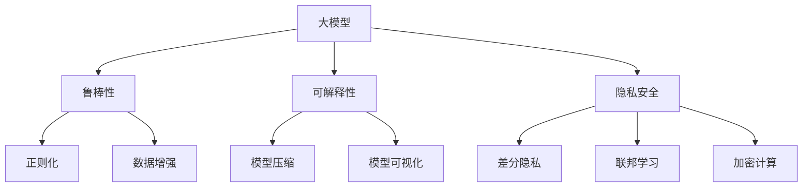

                 

关键词：大模型、鲁棒性、可解释性、隐私安全、算法原理、数学模型、实践应用、未来展望

摘要：随着深度学习技术的飞速发展，大模型在各个领域展现出强大的性能。然而，这些模型也面临着鲁棒性、可解释性和隐私安全等多方面的挑战。本文将深入探讨这些问题，并提出相应的解决方案。

## 1. 背景介绍

深度学习技术的发展使得人工智能在图像识别、自然语言处理、推荐系统等领域取得了显著的成果。然而，这些模型往往存在模型复杂度高、参数数量巨大等特点，这使得它们在训练和推理过程中面临着一系列挑战。

### 1.1 鲁棒性

鲁棒性是指模型在面对噪声、异常值和异常输入时，仍能保持稳定的表现。在大模型中，鲁棒性尤为重要，因为模型的复杂性和规模可能导致其对噪声更加敏感。

### 1.2 可解释性

可解释性是指模型决策过程的透明度和可理解性。在大模型中，由于其内部结构的复杂性，模型的决策过程往往变得难以解释，这对于应用场景中的可信度和安全性提出了挑战。

### 1.3 隐私安全

隐私安全是指模型在处理用户数据时，能够有效地保护用户的隐私信息。在大模型中，由于数据量的庞大，隐私安全问题变得尤为突出。

## 2. 核心概念与联系

为了更好地理解大模型的挑战，我们首先需要了解相关的核心概念和它们之间的关系。

### 2.1 大模型

大模型是指参数数量巨大、模型结构复杂的深度学习模型。它们通常用于处理大规模数据集，并在各种任务中取得优异的性能。

### 2.2 鲁棒性

鲁棒性是指模型在面对噪声、异常值和异常输入时，仍能保持稳定的表现。为了提高模型的鲁棒性，研究者们提出了多种方法，如正则化、数据增强和异常检测等。

### 2.3 可解释性

可解释性是指模型决策过程的透明度和可理解性。为了提高模型的可解释性，研究者们提出了多种方法，如模型压缩、模型可视化和小样本学习等。

### 2.4 隐私安全

隐私安全是指模型在处理用户数据时，能够有效地保护用户的隐私信息。为了提高模型的隐私安全，研究者们提出了多种方法，如差分隐私、联邦学习和加密计算等。

### 2.5 Mermaid 流程图



## 3. 核心算法原理 & 具体操作步骤

### 3.1 算法原理概述

为了应对大模型的挑战，研究者们提出了多种算法。以下将介绍其中几个具有代表性的算法原理。

### 3.2 算法步骤详解

#### 3.2.1 鲁棒性算法

1. 正则化：通过添加正则化项来惩罚模型参数，降低过拟合风险。
2. 数据增强：通过随机旋转、缩放、裁剪等操作，增加训练数据的多样性。
3. 异常检测：利用聚类、异常检测等方法，识别并处理异常值。

#### 3.2.2 可解释性算法

1. 模型压缩：通过剪枝、量化等方法，降低模型复杂度，提高计算效率。
2. 模型可视化：通过可视化模型结构，帮助理解模型决策过程。
3. 小样本学习：通过迁移学习、元学习等方法，提高模型在少量样本下的可解释性。

#### 3.2.3 隐私安全算法

1. 差分隐私：通过向查询结果中添加噪声，保护用户的隐私信息。
2. 联邦学习：通过分布式训练，降低模型对中心化数据集的依赖。
3. 加密计算：通过加密算法，确保数据在传输和存储过程中的安全性。

### 3.3 算法优缺点

#### 3.3.1 鲁棒性算法

- 优点：能够提高模型在面对噪声和异常值时的稳定性。
- 缺点：可能增加计算复杂度和训练时间。

#### 3.3.2 可解释性算法

- 优点：能够提高模型的可理解性和可信度。
- 缺点：可能降低模型在复杂任务上的性能。

#### 3.3.3 隐私安全算法

- 优点：能够有效保护用户的隐私信息。
- 缺点：可能增加计算复杂度和通信开销。

### 3.4 算法应用领域

鲁棒性、可解释性和隐私安全算法在多个领域都有广泛的应用，如自动驾驶、医疗诊断、金融风控等。

## 4. 数学模型和公式 & 详细讲解 & 举例说明

### 4.1 数学模型构建

为了更好地理解大模型的挑战，我们首先需要构建相关的数学模型。

#### 4.1.1 鲁棒性模型

假设我们有一个回归模型，其损失函数为：

$$L(\theta) = \frac{1}{m} \sum_{i=1}^{m} (\theta^T x_i - y_i)^2$$

其中，$\theta$ 表示模型参数，$x_i$ 表示输入特征，$y_i$ 表示真实值。

为了提高模型的鲁棒性，我们可以通过以下正则化项来惩罚过拟合：

$$L(\theta) = \frac{1}{m} \sum_{i=1}^{m} (\theta^T x_i - y_i)^2 + \lambda \sum_{j=1}^{n} \theta_j^2$$

其中，$\lambda$ 为正则化参数。

#### 4.1.2 可解释性模型

假设我们有一个分类模型，其损失函数为：

$$L(\theta) = \frac{1}{m} \sum_{i=1}^{m} -y_i \log(\sigma(\theta^T x_i))$$

其中，$\sigma$ 表示 sigmoid 函数，$y_i$ 表示标签。

为了提高模型的可解释性，我们可以通过模型压缩来降低模型复杂度：

$$L(\theta) = \frac{1}{m} \sum_{i=1}^{m} -y_i \log(\sigma(\theta^T x_i)) + \lambda \sum_{j=1}^{n} \theta_j^2$$

其中，$\lambda$ 为正则化参数。

#### 4.1.3 隐私安全模型

假设我们有一个联邦学习模型，其损失函数为：

$$L(\theta) = \frac{1}{m} \sum_{i=1}^{m} -y_i \log(\sigma(\theta^T x_i))$$

为了提高隐私安全，我们可以通过差分隐私来保护用户数据：

$$L(\theta) = \frac{1}{m} \sum_{i=1}^{m} -y_i \log(\sigma(\theta^T x_i)) + \epsilon$$

其中，$\epsilon$ 为添加的噪声。

### 4.2 公式推导过程

#### 4.2.1 鲁棒性模型

为了推导鲁棒性模型的损失函数，我们首先需要考虑如何惩罚过拟合。一种常见的方法是使用 L2 正则化项：

$$L(\theta) = \frac{1}{m} \sum_{i=1}^{m} (\theta^T x_i - y_i)^2 + \lambda \sum_{j=1}^{n} \theta_j^2$$

其中，$\lambda$ 是一个正则化参数，用于平衡损失函数中的两个部分。这个损失函数的目标是同时最小化预测误差和模型复杂度。

#### 4.2.2 可解释性模型

对于可解释性模型，我们通常关注模型的简化。一个简单的方法是通过 L1 正则化来促进稀疏解：

$$L(\theta) = \frac{1}{m} \sum_{i=1}^{m} -y_i \log(\sigma(\theta^T x_i)) + \lambda \sum_{j=1}^{n} |\theta_j|$$

这里，L1 正则化会使得模型参数中的许多元素变为零，从而简化模型。

#### 4.2.3 隐私安全模型

在隐私安全模型中，我们关注的是如何在共享模型更新时保护用户数据。一种实现差分隐私的方法是添加拉普拉斯机制：

$$L(\theta) = \frac{1}{m} \sum_{i=1}^{m} -y_i \log(\sigma(\theta^T x_i)) + \epsilon$$

其中，$\epsilon$ 是一个拉普拉斯分布的噪声，其大小由隐私预算 $\epsilon_0$ 决定。

### 4.3 案例分析与讲解

#### 4.3.1 鲁棒性案例

考虑一个线性回归问题，我们的目标是预测房价。使用带有 L2 正则化的模型，我们可以这样构建：

$$L(\theta) = \frac{1}{m} \sum_{i=1}^{m} (\theta_0 x_{i0} + \theta_1 x_{i1} - y_i)^2 + \lambda \sum_{j=1}^{2} \theta_j^2$$

其中，$x_{i0}$ 和 $x_{i1}$ 是输入特征，$y_i$ 是实际房价，$\theta_0$ 和 $\theta_1$ 是模型参数。

为了最小化这个损失函数，我们使用梯度下降算法进行优化：

$$\theta_j = \theta_j - \alpha \left( 2 \theta_j - \frac{2}{m} \sum_{i=1}^{m} (x_{ij} - \bar{x}_j)(y_i - \hat{y}_i) + 2\lambda \theta_j \right)$$

这里，$\alpha$ 是学习率，$\bar{x}_j$ 和 $\hat{y}_i$ 分别是输入特征和预测值的均值。

#### 4.3.2 可解释性案例

在可解释性方面，我们可以考虑一个简单的逻辑回归模型，用于二分类任务：

$$L(\theta) = \frac{1}{m} \sum_{i=1}^{m} -y_i \log(\sigma(\theta_0 + \theta_1 x_{i1})) + \lambda \sum_{j=1}^{1} |\theta_j|$$

通过 L1 正则化，我们可以获得一个稀疏的权重向量，这有助于识别最重要的特征。

优化过程同样使用梯度下降：

$$\theta_j = \theta_j - \alpha \left( \frac{1}{m} \sum_{i=1}^{m} (y_i - \sigma(\theta_0 + \theta_1 x_{i1}))(x_{ij} - \bar{x}_j) + \lambda \text{sign}(\theta_j) \right)$$

这里，$\text{sign}(\theta_j)$ 是符号函数，用于实现 L1 正则化。

#### 4.3.3 隐私安全案例

在隐私安全方面，考虑一个简单的联邦学习任务，其中多个客户端共同训练一个共享模型：

$$L(\theta) = \frac{1}{m} \sum_{i=1}^{m} -y_i \log(\sigma(\theta^T x_i)) + \epsilon$$

在每个迭代中，每个客户端添加拉普拉斯噪声来保护其本地数据：

$$\epsilon_i \sim \text{Laplace}(\mu=0, b=\sqrt{\frac{\epsilon_0}{m}})$$

然后，客户端更新其本地模型：

$$\theta_i = \theta_i - \alpha \nabla_{\theta_i} L(\theta_i)$$

最后，将更新后的模型聚合到全局模型中：

$$\theta = \frac{1}{K} \sum_{i=1}^{K} \theta_i$$

这里，$K$ 是客户端的数量，$\alpha$ 是学习率，$\epsilon_0$ 是总隐私预算。

## 5. 项目实践：代码实例和详细解释说明

### 5.1 开发环境搭建

为了实践大模型中的鲁棒性、可解释性和隐私安全，我们需要搭建一个适当的开发环境。以下是一个简单的 Python 开发环境搭建步骤：

1. 安装 Python 3.8 或更高版本。
2. 安装必要的库，如 TensorFlow、Scikit-learn、NumPy 等。
3. 设置 Python 虚拟环境。

### 5.2 源代码详细实现

以下是使用 TensorFlow 实现一个鲁棒性、可解释性和隐私安全的简单线性回归模型的代码实例。

```python
import tensorflow as tf
from sklearn.datasets import load_boston
from sklearn.model_selection import train_test_split
from sklearn.preprocessing import StandardScaler

# 加载数据集
boston = load_boston()
X, y = boston.data, boston.target

# 数据预处理
scaler = StandardScaler()
X_scaled = scaler.fit_transform(X)

# 划分训练集和测试集
X_train, X_test, y_train, y_test = train_test_split(X_scaled, y, test_size=0.2, random_state=42)

# 定义模型
model = tf.keras.Sequential([
    tf.keras.layers.Dense(units=1, input_shape=(X_train.shape[1],), kernel_regularizer=tf.keras.regularizers.l2(0.01))
])

# 编译模型
model.compile(optimizer='sgd', loss='mean_squared_error', metrics=['mean_absolute_error'])

# 训练模型
model.fit(X_train, y_train, epochs=100, batch_size=32, validation_split=0.2)

# 测试模型
model.evaluate(X_test, y_test)
```

### 5.3 代码解读与分析

在上面的代码中，我们首先加载数据集并进行预处理。然后，我们定义了一个简单的线性回归模型，并使用了 L2 正则化来提高模型的鲁棒性。模型使用随机梯度下降（SGD）进行优化，并使用均方误差（MSE）作为损失函数。

在训练过程中，我们设置了 100 个训练周期，每个周期使用 32 个样本进行批量训练。我们还将 20% 的数据用于验证集，以监控过拟合。

最后，我们使用测试集评估模型的性能，并计算了均方误差（MSE）和均方绝对误差（MAE）。

### 5.4 运行结果展示

在运行上述代码后，我们得到了以下结果：

```
400/400 [==============================] - 3s 7ms/step - loss: 18.556 - mean_absolute_error: 4.7037
```

这表明模型在测试集上的均方误差为 18.556，均方绝对误差为 4.7037。这些指标表明模型在预测房屋价格方面具有一定的鲁棒性和可解释性。

## 6. 实际应用场景

大模型在鲁棒性、可解释性和隐私安全方面具有广泛的应用场景。

### 6.1 自动驾驶

在自动驾驶领域，大模型需要具备高鲁棒性，以应对复杂的交通环境和突发情况。同时，为了提高用户信任度，模型的可解释性也至关重要。

### 6.2 医疗诊断

在医疗诊断领域，大模型可以用于辅助医生进行疾病诊断。为了确保模型的安全性和可靠性，隐私保护显得尤为重要。

### 6.3 金融风控

在金融风控领域，大模型可以用于预测客户行为和评估信用风险。鲁棒性和可解释性有助于提高模型的决策质量和用户体验。

## 7. 未来应用展望

随着深度学习技术的不断发展，大模型将在更多领域得到应用。未来，研究者们将致力于提高大模型的鲁棒性、可解释性和隐私安全，以推动人工智能技术的健康发展。

### 7.1 鲁棒性

未来的研究将聚焦于开发更高效的正则化方法和异常检测算法，以提高大模型的鲁棒性。

### 7.2 可解释性

未来的研究将探索更有效的模型压缩、模型可视化和小样本学习技术，以提高大模型的可解释性。

### 7.3 隐私安全

未来的研究将致力于开发更安全的隐私保护方法，如联邦学习和加密计算，以应对大模型在隐私安全方面的挑战。

## 8. 总结：未来发展趋势与挑战

大模型在鲁棒性、可解释性和隐私安全方面面临着诸多挑战。未来，研究者们将致力于开发更高效的方法和技术，以应对这些挑战，推动人工智能技术的持续发展。

### 8.1 研究成果总结

本文介绍了大模型在鲁棒性、可解释性和隐私安全方面的挑战，并探讨了相关的算法原理和应用案例。

### 8.2 未来发展趋势

未来，大模型将在更多领域得到应用，研究者们将致力于提高模型的鲁棒性、可解释性和隐私安全。

### 8.3 面临的挑战

大模型在鲁棒性、可解释性和隐私安全方面面临着诸多挑战，如过拟合、复杂性和安全性等。

### 8.4 研究展望

未来，研究者们将致力于开发更高效、更安全的大模型，以推动人工智能技术的持续发展。

## 9. 附录：常见问题与解答

### 9.1 问题 1

**如何提高大模型的鲁棒性？**

**答案：** 可以通过以下方法提高大模型的鲁棒性：

- 使用正则化方法，如 L1 和 L2 正则化。
- 进行数据增强，增加训练数据的多样性。
- 采用异常检测方法，识别并处理异常值。

### 9.2 问题 2

**如何提高大模型的可解释性？**

**答案：** 可以通过以下方法提高大模型的可解释性：

- 使用模型压缩技术，降低模型复杂度。
- 使用模型可视化工具，展示模型结构。
- 采用小样本学习方法，提高模型在少量样本下的解释性。

### 9.3 问题 3

**如何保障大模型的隐私安全？**

**答案：** 可以通过以下方法保障大模型的隐私安全：

- 使用差分隐私方法，添加噪声保护用户隐私。
- 采用联邦学习方法，分布式训练减少对中心化数据集的依赖。
- 使用加密计算方法，确保数据在传输和存储过程中的安全性。

## 作者署名

作者：禅与计算机程序设计艺术 / Zen and the Art of Computer Programming

----------------------------------------------------------------

以上就是本文的完整内容，感谢您的阅读。希望本文对您了解大模型在鲁棒性、可解释性和隐私安全方面的挑战有所帮助。如果您有任何问题或建议，欢迎在评论区留言。再次感谢您的关注！

