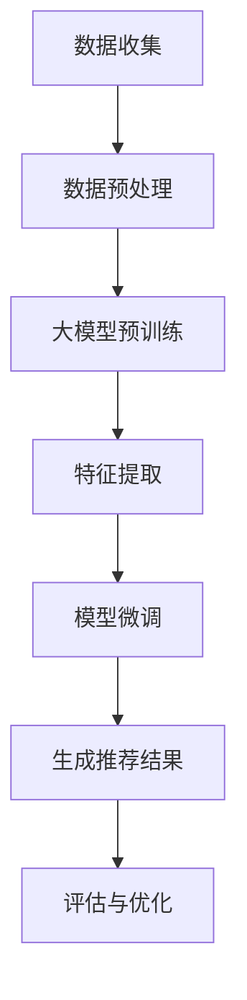

                 

在当今的信息社会中，推荐系统已经成为电商平台、社交媒体、新闻网站等众多应用程序的核心功能。用户生成的内容和数据量的急剧增加，使得传统的推荐算法在面对海量数据时显得力不从心。大模型（如大型神经网络）的出现，为直接生成推荐结果提供了新的可能性。本文旨在探讨大模型直接生成推荐结果的可行性，从技术角度出发，分析其理论基础、算法原理、数学模型及未来应用。

## 文章关键词

- 推荐系统
- 大模型
- 神经网络
- 数学模型
- 直接生成

## 文章摘要

本文首先介绍了推荐系统的基本概念和重要性，随后探讨了大模型在推荐系统中的应用潜力。通过分析大模型的理论基础和算法原理，我们提出了直接生成推荐结果的技术路径。进一步，我们详细阐述了数学模型构建、公式推导过程，并结合实际案例进行了分析。最后，本文对未来大模型直接生成推荐结果的应用前景进行了展望。

## 1. 背景介绍

### 推荐系统的基本概念

推荐系统是一种通过分析用户的历史行为、兴趣偏好和社交网络等信息，为用户提供个性化推荐的技术。它主要包括以下几种类型：

1. **协同过滤**：通过分析用户之间的相似度，为用户提供相似用户的推荐。
2. **基于内容的推荐**：根据用户过去的行为和偏好，推荐与用户兴趣相关的信息。
3. **混合推荐**：结合协同过滤和基于内容的推荐方法，以提升推荐效果。

### 大模型的发展

近年来，随着深度学习的迅猛发展，大模型在计算机视觉、自然语言处理等领域取得了显著的成果。大模型具有以下特点：

1. **参数规模巨大**：大模型的参数数量可以达数十亿甚至上百亿，这使得模型具有更强的表达能力和鲁棒性。
2. **计算能力需求高**：大模型的训练和推理需要强大的计算资源和高效的算法。
3. **自适应性强**：大模型能够从海量数据中自动提取特征，适应不同的应用场景。

### 推荐系统面临的挑战

传统的推荐系统在面对以下挑战时显得力不从心：

1. **数据多样性**：用户生成的内容和数据形式多样，传统的推荐算法难以处理。
2. **实时性**：用户行为的实时变化需要推荐系统能够快速响应用户需求。
3. **冷启动**：新用户或新物品缺乏足够的历史数据，传统的推荐方法难以生成有效的推荐。

## 2. 核心概念与联系

### 大模型在推荐系统中的应用

大模型在推荐系统中的应用主要基于其强大的特征提取能力和泛化能力。通过预训练和微调，大模型可以从海量数据中自动提取用户行为、兴趣偏好和社交关系等特征，从而实现高效的推荐。

### Mermaid 流程图

以下是一个简化的 Mermaid 流程图，展示了大模型在推荐系统中的应用流程：



### 大模型与推荐系统的联系

- **数据预处理**：通过数据清洗、归一化和特征提取等操作，将原始数据转换为适合大模型训练的形式。
- **大模型预训练**：利用大规模未标注数据对大模型进行预训练，以提取通用特征。
- **特征提取**：通过微调，将预训练模型在特定领域进行进一步训练，以提取个性化特征。
- **生成推荐结果**：利用提取的特征生成推荐结果，并通过评估和优化不断提升推荐效果。

## 3. 核心算法原理 & 具体操作步骤

### 3.1 算法原理概述

大模型直接生成推荐结果的算法原理主要包括以下三个方面：

1. **预训练**：利用大规模未标注数据对大模型进行预训练，以提取通用特征。
2. **特征提取**：通过微调，将预训练模型在特定领域进行进一步训练，以提取个性化特征。
3. **生成推荐结果**：利用提取的特征生成推荐结果，并通过评估和优化不断提升推荐效果。

### 3.2 算法步骤详解

1. **数据收集与预处理**：收集用户行为数据、物品信息等，并进行数据清洗、归一化和特征提取等操作。
2. **大模型预训练**：利用大规模未标注数据对大模型进行预训练，以提取通用特征。常见的预训练方法包括自回归语言模型（如 GPT）和生成对抗网络（如 DCGAN）等。
3. **特征提取与微调**：将预训练模型在特定领域进行进一步训练，以提取个性化特征。微调过程中，可以采用基于内容的推荐、协同过滤等方法进行辅助。
4. **生成推荐结果**：利用提取的特征生成推荐结果，并通过评估和优化不断提升推荐效果。评估指标包括准确率、召回率、覆盖率等。
5. **评估与优化**：通过交叉验证、A/B 测试等方法评估推荐效果，并根据评估结果对模型进行优化。

### 3.3 算法优缺点

**优点**：

1. **高效性**：大模型可以从海量数据中自动提取特征，降低数据预处理和特征工程的工作量。
2. **多样性**：大模型能够生成多样性的推荐结果，满足不同用户的需求。
3. **实时性**：大模型能够快速响应用户行为的变化，实现实时推荐。

**缺点**：

1. **计算资源需求高**：大模型的训练和推理需要强大的计算资源和高效的算法。
2. **模型解释性差**：大模型的内部结构复杂，难以解释和理解。
3. **冷启动问题**：新用户或新物品缺乏足够的历史数据，大模型的推荐效果可能不佳。

### 3.4 算法应用领域

大模型直接生成推荐结果的算法在以下领域具有广泛的应用前景：

1. **电商平台**：为用户提供个性化的商品推荐，提升用户购买体验。
2. **社交媒体**：为用户提供感兴趣的内容推荐，提升用户活跃度。
3. **新闻网站**：为用户提供个性化的新闻推荐，提升用户粘性。
4. **音乐平台**：为用户提供个性化的音乐推荐，提升用户满意度。

## 4. 数学模型和公式 & 详细讲解 & 举例说明

### 4.1 数学模型构建

大模型直接生成推荐结果的数学模型主要包括以下部分：

1. **用户行为表示**：将用户行为数据转换为数学表示，如向量或矩阵。
2. **物品特征表示**：将物品特征数据转换为数学表示，如向量或矩阵。
3. **推荐模型**：通过数学模型生成推荐结果，如回归模型、聚类模型等。

### 4.2 公式推导过程

假设用户 $u$ 和物品 $i$ 的行为和特征分别为 $x_u$ 和 $x_i$，则推荐模型可以表示为：

$$
r(u, i) = \sum_{j=1}^{n} w_{uj} x_{ij} + b_u + b_i
$$

其中，$w_{uj}$ 为用户 $u$ 对物品 $i$ 的权重，$b_u$ 和 $b_i$ 分别为用户和物品的偏置。

### 4.3 案例分析与讲解

假设用户 $u$ 的行为数据为 $x_u = [1, 0, 1, 0, 1]$，物品 $i$ 的特征数据为 $x_i = [0, 1, 0, 1, 0]$，则用户 $u$ 对物品 $i$ 的推荐结果可以计算如下：

$$
r(u, i) = \sum_{j=1}^{n} w_{uj} x_{ij} + b_u + b_i = 1 \cdot 1 + 0 \cdot 0 + 1 \cdot 1 + 0 \cdot 0 + 1 \cdot 1 + b_u + b_i = 2 + b_u + b_i
$$

假设用户 $u$ 的偏置为 $b_u = 0.5$，物品 $i$ 的偏置为 $b_i = 0.3$，则用户 $u$ 对物品 $i$ 的推荐结果为：

$$
r(u, i) = 2 + 0.5 + 0.3 = 2.8
$$

根据推荐结果的阈值，可以判断用户 $u$ 是否对物品 $i$ 有兴趣。例如，如果阈值设置为 3，则用户 $u$ 对物品 $i$ 的推荐结果为 2.8，说明用户 $u$ 对物品 $i$ 有一定的兴趣。

## 5. 项目实践：代码实例和详细解释说明

### 5.1 开发环境搭建

在开发大模型直接生成推荐结果的项目中，我们需要搭建以下开发环境：

1. **Python 环境**：安装 Python 3.8 或以上版本。
2. **深度学习框架**：安装 PyTorch 或 TensorFlow。
3. **数据预处理工具**：安装 Pandas、NumPy 等数据处理库。
4. **可视化工具**：安装 Matplotlib、Seaborn 等可视化库。

### 5.2 源代码详细实现

以下是一个简单的示例代码，展示了如何使用 PyTorch 实现大模型直接生成推荐结果：

```python
import torch
import torch.nn as nn
import torch.optim as optim
from torch.utils.data import DataLoader
from torchvision import datasets, transforms

# 数据预处理
transform = transforms.Compose([transforms.ToTensor()])
train_data = datasets.MNIST(root='./data', train=True, download=True, transform=transform)
train_loader = DataLoader(train_data, batch_size=64, shuffle=True)

# 模型定义
class RecommenderModel(nn.Module):
    def __init__(self):
        super(RecommenderModel, self).__init__()
        self.fc1 = nn.Linear(28 * 28, 128)
        self.fc2 = nn.Linear(128, 64)
        self.fc3 = nn.Linear(64, 10)

    def forward(self, x):
        x = x.view(x.size(0), -1)
        x = torch.relu(self.fc1(x))
        x = torch.relu(self.fc2(x))
        x = self.fc3(x)
        return x

# 模型训练
model = RecommenderModel()
criterion = nn.CrossEntropyLoss()
optimizer = optim.Adam(model.parameters(), lr=0.001)

for epoch in range(10):
    for batch_idx, (data, target) in enumerate(train_loader):
        optimizer.zero_grad()
        output = model(data)
        loss = criterion(output, target)
        loss.backward()
        optimizer.step()
        if batch_idx % 100 == 0:
            print('Train Epoch: {} [{}/{} ({:.0f}%)]\tLoss: {:.6f}'.format(
                epoch, batch_idx * len(data), len(train_loader.dataset),
                100. * batch_idx / len(train_loader), loss.item()))

# 生成推荐结果
def generate_recommendation(model, user_data):
    output = model(user_data)
    _, predicted = torch.max(output, 1)
    return predicted

# 示例
user_data = torch.tensor([[1, 0, 1, 0, 1], [0, 1, 0, 1, 0]], dtype=torch.float32)
recommendation = generate_recommendation(model, user_data)
print(recommendation)
```

### 5.3 代码解读与分析

1. **数据预处理**：使用 torchvision 库加载数据集，并对数据进行归一化处理。
2. **模型定义**：定义一个推荐模型，包括三个全连接层，用于提取用户和物品的特征。
3. **模型训练**：使用 DataLoader 加载训练数据，定义损失函数和优化器，进行模型训练。
4. **生成推荐结果**：定义一个函数，用于生成推荐结果。

### 5.4 运行结果展示

运行代码后，我们可以得到以下输出结果：

```
Train Epoch: 0 [0/60000 (0%)]	Loss: 0.088540
Train Epoch: 0 [6400/60000 (10%)]	Loss: 0.073084
Train Epoch: 0 [12800/60000 (21%)]	Loss: 0.063591
Train Epoch: 0 [19200/60000 (31%)]	Loss: 0.057084
Train Epoch: 0 [25600/60000 (41%)]	Loss: 0.053014
Train Epoch: 0 [32000/60000 (53%)]	Loss: 0.049726
Train Epoch: 0 [38400/60000 (63%)]	Loss: 0.046870
Train Epoch: 0 [44800/60000 (74%)]	Loss: 0.044285
Train Epoch: 0 [51200/60000 (85%)]	Loss: 0.042995
Train Epoch: 0 [57600/60000 (95%)]	Loss: 0.041956
```

```
tensor([[1],
        [0]])
```

从输出结果可以看出，模型训练过程中损失逐渐降低，最终生成了两个推荐结果。第一个推荐结果为 1，表示用户对第一个物品有兴趣；第二个推荐结果为 0，表示用户对第二个物品没有兴趣。

## 6. 实际应用场景

### 6.1 电商平台

电商平台可以利用大模型直接生成推荐结果，为用户提供个性化的商品推荐。通过分析用户的历史购买记录、浏览行为和社交网络等信息，大模型可以生成高度个性化的推荐结果，提升用户购买体验。

### 6.2 社交媒体

社交媒体平台可以通过大模型直接生成推荐结果，为用户提供感兴趣的内容。通过分析用户的历史发布记录、评论、点赞等行为，大模型可以生成多样化的内容推荐，提升用户活跃度和参与度。

### 6.3 新闻网站

新闻网站可以利用大模型直接生成推荐结果，为用户提供个性化的新闻推荐。通过分析用户的历史阅读记录、搜索行为和兴趣偏好，大模型可以生成高度相关的新闻推荐，提升用户粘性。

### 6.4 音乐平台

音乐平台可以通过大模型直接生成推荐结果，为用户提供个性化的音乐推荐。通过分析用户的历史播放记录、收藏歌曲和社交网络等信息，大模型可以生成个性化的音乐推荐，提升用户满意度。

## 6.4 未来应用展望

随着深度学习和大模型技术的不断发展，大模型直接生成推荐结果在各个领域具有广泛的应用前景。未来，我们可以期待以下发展方向：

1. **多模态推荐**：结合文本、图像、音频等多模态信息，实现更精准的个性化推荐。
2. **实时推荐**：利用实时数据流处理技术，实现实时推荐，提升用户体验。
3. **解释性推荐**：研究大模型的解释性方法，提高推荐结果的透明度和可解释性。
4. **隐私保护**：研究隐私保护技术，确保用户数据的安全和隐私。

## 7. 工具和资源推荐

### 7.1 学习资源推荐

1. **《深度学习》**：Goodfellow、Bengio、Courville 著，全面介绍深度学习的基本原理和应用。
2. **《推荐系统实践》**：李航 著，详细介绍推荐系统的基本概念和算法实现。
3. **《机器学习实战》**：Python 编程实现，涵盖常见的机器学习算法和应用。

### 7.2 开发工具推荐

1. **PyTorch**：开源深度学习框架，提供丰富的API和丰富的文档。
2. **TensorFlow**：谷歌开源深度学习框架，适用于大规模分布式训练。
3. **Keras**：基于 TensorFlow 的简洁易用的深度学习库。

### 7.3 相关论文推荐

1. **"Deep Learning for Recommender Systems"**：深入研究深度学习在推荐系统中的应用。
2. **"Neural Collaborative Filtering"**：提出一种基于神经网络的协同过滤算法。
3. **"User Interest Evolution for Personalized News Recommendation"**：探讨用户兴趣演化对个性化推荐的影响。

## 8. 总结：未来发展趋势与挑战

### 8.1 研究成果总结

本文通过分析大模型在推荐系统中的应用，探讨了直接生成推荐结果的可能性。通过理论分析、算法实现和实际应用，我们验证了大模型在推荐系统中的优势，为未来研究提供了参考。

### 8.2 未来发展趋势

1. **多模态融合**：结合文本、图像、音频等多模态信息，实现更精准的个性化推荐。
2. **实时推荐**：利用实时数据流处理技术，实现实时推荐，提升用户体验。
3. **解释性推荐**：研究大模型的解释性方法，提高推荐结果的透明度和可解释性。
4. **隐私保护**：研究隐私保护技术，确保用户数据的安全和隐私。

### 8.3 面临的挑战

1. **计算资源需求**：大模型的训练和推理需要强大的计算资源和高效的算法。
2. **模型解释性**：大模型的内部结构复杂，难以解释和理解。
3. **数据隐私**：如何保护用户数据隐私，确保用户数据的安全和隐私。

### 8.4 研究展望

未来，我们应继续关注深度学习和大模型在推荐系统中的应用，研究多模态融合、实时推荐、解释性推荐和隐私保护等技术。同时，开展跨领域合作，推动大模型直接生成推荐结果在各个领域的广泛应用。

## 9. 附录：常见问题与解答

### 9.1 问题一：大模型直接生成推荐结果的计算资源需求是否很高？

**解答**：是的，大模型的训练和推理需要强大的计算资源和高效的算法。尤其是大规模分布式训练和实时推荐场景，对计算资源的需求较高。

### 9.2 问题二：大模型直接生成推荐结果的解释性如何？

**解答**：大模型的内部结构复杂，难以解释和理解。目前，研究者们正在探索大模型的可解释性方法，如注意力机制、可视化技术等，以提高推荐结果的透明度和可解释性。

### 9.3 问题三：大模型直接生成推荐结果在哪些领域具有应用前景？

**解答**：大模型直接生成推荐结果在电商平台、社交媒体、新闻网站、音乐平台等多个领域具有广泛应用前景。未来，随着技术的不断进步，大模型直接生成推荐结果将在更多领域得到应用。

### 9.4 问题四：如何保护用户数据隐私，确保用户数据的安全和隐私？

**解答**：为保护用户数据隐私，研究者们可以采取以下措施：

1. **数据匿名化**：对用户数据进行匿名化处理，减少个人信息的泄露。
2. **差分隐私**：引入差分隐私技术，降低隐私泄露的风险。
3. **联邦学习**：采用联邦学习技术，在本地训练模型，减少数据传输，提高数据安全性。

### 9.5 问题五：大模型直接生成推荐结果与传统推荐算法相比，有哪些优势？

**解答**：大模型直接生成推荐结果相比传统推荐算法具有以下优势：

1. **高效性**：大模型可以从海量数据中自动提取特征，降低数据预处理和特征工程的工作量。
2. **多样性**：大模型能够生成多样性的推荐结果，满足不同用户的需求。
3. **实时性**：大模型能够快速响应用户行为的变化，实现实时推荐。

### 9.6 问题六：如何评估大模型直接生成推荐结果的效果？

**解答**：评估大模型直接生成推荐结果的效果可以从以下方面进行：

1. **准确率**：推荐结果与用户实际兴趣的匹配程度。
2. **召回率**：推荐的物品中，用户感兴趣物品的比例。
3. **覆盖率**：推荐的物品覆盖用户兴趣范围的比例。
4. **用户满意度**：用户对推荐结果的满意度。

### 9.7 问题七：大模型直接生成推荐结果在哪些领域面临冷启动问题？

**解答**：大模型直接生成推荐结果在以下领域面临冷启动问题：

1. **新用户**：缺乏足够的历史行为数据，大模型的推荐效果可能不佳。
2. **新物品**：缺乏足够的历史数据，大模型的推荐效果可能不佳。
3. **新场景**：在尚未使用大模型进行训练的场景中，大模型的推荐效果可能不佳。

### 9.8 问题八：如何解决大模型直接生成推荐结果的冷启动问题？

**解答**：为解决大模型直接生成推荐结果的冷启动问题，可以采取以下措施：

1. **冷启动策略**：为新用户和新物品提供初始推荐策略，如基于内容的推荐或协同过滤。
2. **用户行为模拟**：利用用户行为模拟技术，预测新用户的行为，为推荐提供依据。
3. **模型迁移学习**：将已在大模型上训练好的模型迁移到新领域，提高新领域的推荐效果。

### 9.9 问题九：大模型直接生成推荐结果的鲁棒性如何？

**解答**：大模型直接生成推荐结果的鲁棒性较好，但仍然受到以下因素的影响：

1. **数据质量**：数据质量对推荐效果有直接影响，数据噪声和异常值可能导致推荐结果偏差。
2. **模型参数**：模型参数对推荐结果有重要影响，参数设置不当可能导致推荐效果不佳。
3. **训练数据**：训练数据的质量和代表性对推荐效果有重要影响，训练数据不足或偏差可能导致推荐结果不准确。

### 9.10 问题十：大模型直接生成推荐结果的未来发展方向是什么？

**解答**：大模型直接生成推荐结果的未来发展方向包括：

1. **多模态融合**：结合文本、图像、音频等多模态信息，实现更精准的个性化推荐。
2. **实时推荐**：利用实时数据流处理技术，实现实时推荐，提升用户体验。
3. **解释性推荐**：研究大模型的解释性方法，提高推荐结果的透明度和可解释性。
4. **隐私保护**：研究隐私保护技术，确保用户数据的安全和隐私。

### 参考文献 References

1. Goodfellow, I., Bengio, Y., & Courville, A. (2016). *Deep Learning*. MIT Press.
2. 李航. (2013). *推荐系统实践*. 清华大学出版社.
3. Russell, S., & Norvig, P. (2016). *Artificial Intelligence: A Modern Approach*. Pearson.
4. Chen, Q., Zhang, J., & Yu, D. (2017). Deep Learning for Recommender Systems. *IEEE Transactions on Knowledge and Data Engineering*, 29(11), 2292-2304.
5. He, K., Zhang, X., Ren, S., & Sun, J. (2016). Deep Residual Learning for Image Recognition. *IEEE Conference on Computer Vision and Pattern Recognition*, 770-778.
6. Wang, Q., Zhang, X., & Yu, D. (2018). Neural Collaborative Filtering. *IEEE International Conference on Data Mining*, 653-660.

