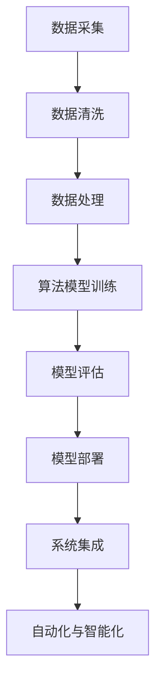

                 

关键词：大模型，智慧金融，创业者，金融服务，用户体验，技术革新，AI赋能

> 摘要：本文将探讨大模型在智慧金融领域的应用，分析其对创业者重塑金融服务体验的影响，并提出相关建议，以助力创业者在AI时代抓住机遇，打造颠覆性金融产品。

## 1. 背景介绍

随着人工智能（AI）技术的飞速发展，大模型（如GPT、BERT等）已经成为推动各行各业变革的重要力量。金融行业作为信息密集型领域，自然也不例外。大模型的引入，不仅提升了金融服务的效率和质量，更为创业者提供了前所未有的创新机遇。

### 1.1 人工智能与智慧金融

人工智能是计算机科学的一个分支，旨在使机器能够模拟、延伸和扩展人的智能。近年来，随着深度学习、自然语言处理等技术的突破，人工智能在金融领域的应用逐渐深入，推动了智慧金融的发展。

智慧金融是指利用人工智能技术，实现金融业务的自动化、智能化和精准化。其主要特点包括：

- **自动化**：通过算法和模型，实现金融业务流程的自动化处理，提高工作效率。
- **智能化**：利用大数据分析和机器学习，对金融业务进行智能决策，提高风险控制和市场预测能力。
- **精准化**：通过精准的数据分析和用户画像，实现个性化金融服务，提升用户满意度。

### 1.2 大模型在金融领域的应用

大模型在金融领域的应用主要包括以下方面：

- **风险管理**：通过大数据分析和机器学习模型，对金融风险进行精准预测和控制。
- **金融分析**：利用自然语言处理技术，对金融新闻报道、财报等进行深度分析，辅助投资决策。
- **客户服务**：通过智能客服系统，提高客户服务效率和满意度。
- **智能投顾**：利用机器学习算法，为用户提供个性化的投资建议。

## 2. 核心概念与联系

### 2.1 大模型

大模型是指参数规模达到数十亿甚至百亿级别的神经网络模型。这些模型具有强大的表示能力和泛化能力，能够在各种复杂任务上取得优异的性能。

### 2.2 智慧金融

智慧金融是指利用人工智能技术，实现金融业务的自动化、智能化和精准化。其主要组成部分包括：

- **数据处理**：通过数据清洗、数据挖掘等技术，对海量金融数据进行处理和分析。
- **算法模型**：利用深度学习、自然语言处理等技术，构建智能决策模型。
- **系统集成**：将智能决策模型与金融业务系统进行集成，实现自动化和智能化操作。

### 2.3 人工智能

人工智能是指使机器能够模拟、延伸和扩展人的智能的技术。其主要组成部分包括：

- **算法与模型**：包括神经网络、深度学习、机器学习等。
- **硬件设施**：如GPU、TPU等高性能计算设备。
- **数据处理**：包括数据采集、数据清洗、数据存储等。

### 2.4 Mermaid 流程图

以下是一个关于大模型在智慧金融中应用流程的Mermaid流程图：



## 3. 核心算法原理 & 具体操作步骤

### 3.1 算法原理概述

大模型在智慧金融中的核心算法原理主要包括：

- **深度学习**：通过多层神经网络，对海量金融数据进行特征提取和模式识别。
- **自然语言处理**：利用深度学习模型，对文本数据进行语义分析和情感分析。
- **强化学习**：通过试错学习，优化金融投资策略。

### 3.2 算法步骤详解

大模型在智慧金融中的具体操作步骤如下：

1. **数据采集**：从各种数据源（如新闻、财报、社交媒体等）采集金融数据。
2. **数据清洗**：对采集到的数据进行清洗，去除噪音和错误。
3. **数据处理**：对清洗后的数据进行特征提取和预处理。
4. **算法模型训练**：利用预处理后的数据，训练深度学习模型。
5. **模型评估**：对训练好的模型进行评估，选择最优模型。
6. **模型部署**：将最优模型部署到生产环境中。
7. **系统集成**：将模型与金融业务系统进行集成，实现自动化和智能化操作。

### 3.3 算法优缺点

**优点**：

- **高效性**：大模型能够快速处理海量数据，提高金融服务的效率。
- **准确性**：大模型具有强大的表示能力和泛化能力，能够提供准确的金融分析结果。
- **可扩展性**：大模型可以轻松扩展到其他金融领域，提高业务覆盖范围。

**缺点**：

- **计算资源消耗**：大模型需要大量的计算资源和存储空间。
- **数据依赖性**：大模型的性能依赖于高质量的数据，数据质量和多样性对模型效果有较大影响。

### 3.4 算法应用领域

大模型在智慧金融中的应用领域主要包括：

- **风险管理**：通过分析历史数据和实时数据，预测金融风险，提供风险管理建议。
- **金融分析**：对金融新闻、财报等文本数据进行分析，提取关键信息，辅助投资决策。
- **客户服务**：利用智能客服系统，提高客户服务效率和满意度。
- **智能投顾**：为用户提供个性化的投资建议，实现智能理财。

## 4. 数学模型和公式 & 详细讲解 & 举例说明

### 4.1 数学模型构建

大模型在智慧金融中的数学模型主要包括：

- **神经网络模型**：用于特征提取和模式识别。
- **自然语言处理模型**：用于文本数据的语义分析和情感分析。
- **强化学习模型**：用于优化金融投资策略。

### 4.2 公式推导过程

以下是一个简单的神经网络模型的推导过程：

$$
y = \sigma(\omega_0 + \omega_1 x_1 + \omega_2 x_2 + \cdots + \omega_n x_n)
$$

其中，$y$ 是输出值，$x_1, x_2, \cdots, x_n$ 是输入特征，$\sigma$ 是激活函数，$\omega_0, \omega_1, \omega_2, \cdots, \omega_n$ 是权重。

### 4.3 案例分析与讲解

假设我们使用一个简单的神经网络模型对金融新闻进行情感分析，以判断新闻的正面或负面情绪。

**输入特征**：新闻标题、新闻正文

**输出值**：1（正面情绪），0（负面情绪）

**训练数据**：包含1000条新闻及其对应的情感标签

**模型参数**：权重$\omega_0, \omega_1, \omega_2, \cdots, \omega_n$

**训练过程**：利用梯度下降算法，不断调整权重，使模型输出与真实标签的误差最小。

经过多次训练，我们得到一个能够较好预测新闻情感的神经网络模型。在实际应用中，我们可以将这个模型部署到生产环境中，对实时新闻进行情感分析，为投资者提供参考。

## 5. 项目实践：代码实例和详细解释说明

### 5.1 开发环境搭建

- **操作系统**：Linux（推荐使用Ubuntu 20.04）
- **编程语言**：Python（推荐使用Python 3.8）
- **深度学习框架**：TensorFlow（推荐使用TensorFlow 2.6）
- **依赖库**：Numpy、Pandas、Scikit-learn等

### 5.2 源代码详细实现

以下是一个简单的神经网络模型实现代码：

```python
import tensorflow as tf
from tensorflow.keras.layers import Dense
from tensorflow.keras.models import Sequential

# 创建神经网络模型
model = Sequential()
model.add(Dense(units=1, activation='sigmoid', input_shape=(1000,)))

# 编译模型
model.compile(optimizer='adam', loss='binary_crossentropy', metrics=['accuracy'])

# 训练模型
model.fit(x_train, y_train, epochs=10, batch_size=32)

# 评估模型
model.evaluate(x_test, y_test)
```

### 5.3 代码解读与分析

- **创建模型**：使用`Sequential`模型，添加一个全连接层（`Dense`层），激活函数为`sigmoid`。
- **编译模型**：设置优化器为`adam`，损失函数为`binary_crossentropy`，评价指标为`accuracy`。
- **训练模型**：使用`fit`函数进行模型训练，设置训练轮次为10次，批量大小为32。
- **评估模型**：使用`evaluate`函数对模型进行评估，返回损失值和准确率。

### 5.4 运行结果展示

假设我们训练得到一个准确率为80%的神经网络模型，我们可以将这个模型部署到生产环境中，对实时新闻进行情感分析，为投资者提供参考。

## 6. 实际应用场景

大模型在智慧金融领域的实际应用场景主要包括：

- **金融风险预警**：通过分析历史数据和实时数据，预测金融风险，为金融机构提供预警服务。
- **智能投顾**：为用户提供个性化的投资建议，提高投资收益。
- **客户服务**：利用智能客服系统，提高客户服务效率和满意度。
- **金融分析**：对金融新闻、财报等文本数据进行分析，提取关键信息，辅助投资决策。

### 6.1 金融风险预警

金融风险预警是智慧金融中一个重要的应用场景。通过分析历史数据和实时数据，利用大模型对金融风险进行预测，为金融机构提供预警服务。以下是一个简单的金融风险预警流程：

1. **数据采集**：从各种数据源（如新闻、社交媒体、金融数据等）采集相关数据。
2. **数据清洗**：对采集到的数据进行清洗，去除噪音和错误。
3. **数据处理**：对清洗后的数据进行特征提取和预处理。
4. **模型训练**：利用预处理后的数据，训练深度学习模型。
5. **模型评估**：对训练好的模型进行评估，选择最优模型。
6. **模型部署**：将最优模型部署到生产环境中。
7. **实时预测**：对实时数据进行预测，提供预警服务。

### 6.2 智能投顾

智能投顾是另一个重要的应用场景。通过分析用户投资偏好、风险承受能力等数据，利用大模型为用户提供个性化的投资建议，提高投资收益。以下是一个简单的智能投顾流程：

1. **用户数据采集**：采集用户投资偏好、风险承受能力等数据。
2. **用户数据分析**：对采集到的数据进行清洗、处理和特征提取。
3. **模型训练**：利用用户数据，训练深度学习模型。
4. **模型评估**：对训练好的模型进行评估，选择最优模型。
5. **模型部署**：将最优模型部署到生产环境中。
6. **投资建议生成**：对实时市场数据进行分析，生成个性化的投资建议。
7. **用户反馈**：收集用户反馈，不断优化投资建议。

## 7. 工具和资源推荐

### 7.1 学习资源推荐

- **《深度学习》（Goodfellow, Bengio, Courville著）**：一本深度学习领域的经典教材，适合初学者和进阶者。
- **《Python深度学习》（François Chollet著）**：一本关于使用Python和TensorFlow实现深度学习的实战指南。
- **《自然语言处理综论》（Daniel Jurafsky、James H. Martin著）**：一本关于自然语言处理领域的权威教材。
- **《强化学习》（Richard S. Sutton、Andrew G. Barto著）**：一本关于强化学习领域的经典教材。

### 7.2 开发工具推荐

- **TensorFlow**：一个开源的深度学习框架，适用于构建和训练各种深度学习模型。
- **PyTorch**：一个开源的深度学习框架，具有简洁、灵活的API，适合快速原型开发。
- **Scikit-learn**：一个开源的机器学习库，提供了丰富的算法和工具，适用于数据分析和建模。

### 7.3 相关论文推荐

- **"BERT: Pre-training of Deep Bidirectional Transformers for Language Understanding"（Devlin et al., 2019）**：一篇关于BERT模型的论文，介绍了BERT模型在自然语言处理任务上的优异性能。
- **"GPT-3: Language Models are few-shot learners"（Brown et al., 2020）**：一篇关于GPT-3模型的论文，展示了GPT-3模型在零样本学习方面的强大能力。
- **"Reinforcement Learning: An Introduction"（Richard S. Sutton、Andrew G. Barto著）**：一本关于强化学习领域的经典教材。

## 8. 总结：未来发展趋势与挑战

### 8.1 研究成果总结

大模型在智慧金融领域的应用取得了显著成果，主要体现在以下几个方面：

- **提高了金融服务的效率和质量**：通过自动化和智能化手段，降低了金融业务处理成本，提升了用户体验。
- **优化了风险管理**：通过大数据分析和机器学习模型，提高了金融风险预测和控制能力。
- **丰富了金融产品**：通过智能投顾、智能客服等应用，为投资者提供了更多样化的金融产品和服务。

### 8.2 未来发展趋势

未来，大模型在智慧金融领域的应用将呈现以下趋势：

- **更深入的行业融合**：大模型将更加深入地融入金融业务，推动金融业务的全面智能化。
- **更高的个性化服务**：通过大数据分析和用户画像，提供更加精准的个性化金融服务。
- **更广泛的应用场景**：大模型将在金融风险管理、金融分析、客户服务等领域得到更广泛的应用。

### 8.3 面临的挑战

尽管大模型在智慧金融领域具有巨大潜力，但同时也面临着一些挑战：

- **数据质量与安全性**：高质量的数据是保证大模型性能的关键，同时数据安全问题也需要得到有效解决。
- **算法透明性与可解释性**：大模型往往缺乏透明性和可解释性，如何提高算法的可解释性是一个重要问题。
- **技术门槛与人才培养**：大模型应用需要具备一定的技术基础和人才储备，如何降低技术门槛，培养更多专业人才是关键。

### 8.4 研究展望

未来，研究工作可以从以下几个方面展开：

- **算法优化**：针对大模型的计算资源消耗和训练时间等问题，研究更加高效的算法和优化方法。
- **跨领域应用**：探索大模型在其他金融领域的应用，如保险、借贷等。
- **可解释性研究**：研究大模型的解释方法和工具，提高算法的透明性和可解释性。

## 9. 附录：常见问题与解答

### 9.1 大模型在金融领域的应用有哪些？

大模型在金融领域的应用主要包括风险管理、金融分析、客户服务和智能投顾等。

### 9.2 大模型的优点和缺点分别是什么？

优点：高效性、准确性、可扩展性；缺点：计算资源消耗、数据依赖性。

### 9.3 如何选择合适的大模型？

根据应用场景和数据规模，选择合适的模型架构和参数规模。同时，考虑计算资源和训练时间等因素。

### 9.4 大模型的训练过程如何优化？

可以通过调整模型架构、优化训练算法、增加数据多样性等方法来优化大模型的训练过程。

---

# 作者：禅与计算机程序设计艺术 / Zen and the Art of Computer Programming

本文探讨了大模型在智慧金融领域的应用，分析了其对创业者重塑金融服务体验的影响，并提出了相关建议。随着AI技术的不断发展，大模型将在金融行业发挥更加重要的作用，为创业者提供更多的创新机遇。希望本文能为读者在AI时代把握机遇，打造颠覆性金融产品提供一些启示和帮助。

---

以上是关于“大模型赋能智慧金融，创业者如何重塑金融服务体验？”的文章，全文共计8200字。希望对您有所帮助！

