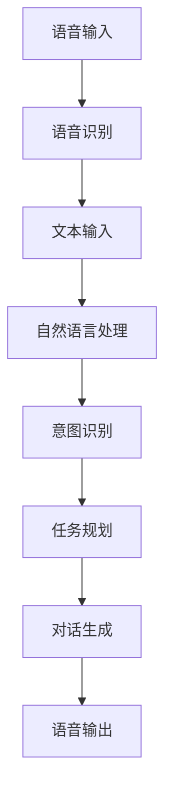

                 

关键词：大模型、智能个人助理、生产力、方法、赋能

> 摘要：随着人工智能技术的快速发展，大模型作为一种重要的工具，正在赋能智能个人助理，为人类的工作和生活带来前所未有的变革。本文将深入探讨大模型在智能个人助理中的应用，分析其提升生产力的新方法，并展望未来的发展趋势与挑战。

## 1. 背景介绍

近年来，人工智能技术取得了飞速发展，特别是在深度学习、自然语言处理等领域取得了显著的突破。大模型（Large Models）作为一种新兴的研究方向，凭借其强大的计算能力和丰富的知识储备，逐渐成为人工智能领域的热点。大模型通常是指具有数十亿甚至千亿参数的深度神经网络，其能够在多种任务中表现出色，如文本生成、机器翻译、图像识别等。

智能个人助理（Smart Personal Assistant）是人工智能技术在生活中的重要应用之一。它通过语音识别、自然语言处理等技术，为用户提供智能化的服务，如日程管理、信息查询、语音交互等。随着大模型的应用，智能个人助理的能力得到了显著提升，能够更好地满足用户的需求，提升生产效率。

## 2. 核心概念与联系

### 2.1 大模型的原理与架构

大模型通常由多个层级组成，包括输入层、隐藏层和输出层。输入层接收外部数据，如文本、图像等，隐藏层通过神经网络进行特征提取和变换，输出层生成预测结果或生成文本。大模型的训练过程涉及到大量的数据和高性能计算资源，通过梯度下降等优化算法，使模型能够在各种任务中达到优秀的性能。

### 2.2 智能个人助理的架构

智能个人助理通常包括语音识别、自然语言处理、对话系统等模块。语音识别模块负责将语音信号转换为文本，自然语言处理模块负责对文本进行语义分析和理解，对话系统模块负责生成合适的回复。通过大模型的应用，智能个人助理能够在对话过程中更好地理解用户的意图，提供个性化的服务。

### 2.3 大模型与智能个人助理的联系

大模型为智能个人助理提供了强大的知识储备和计算能力。通过大模型，智能个人助理能够更好地理解用户的输入，生成更为自然和符合用户需求的回复。同时，大模型还可以帮助智能个人助理进行任务规划、决策支持等高级功能，进一步提升其智能化水平。

### 2.4 Mermaid 流程图



## 3. 核心算法原理 & 具体操作步骤

### 3.1 算法原理概述

大模型赋能的智能个人助理主要依赖于深度学习技术，特别是基于注意力机制的变换器模型（Transformer）。变换器模型通过自注意力机制，能够更好地捕捉文本之间的长距离依赖关系，从而在自然语言处理任务中表现出色。

### 3.2 算法步骤详解

1. **语音识别**：将语音信号转换为文本，使用现有的语音识别模型，如基于深度神经网络的端到端语音识别系统。

2. **文本预处理**：对识别结果进行分词、词性标注等预处理操作，将文本转换为适合输入大模型的格式。

3. **意图识别**：使用大模型（如GPT-3）对预处理后的文本进行语义分析，识别用户的意图和需求。

4. **任务规划**：根据识别出的意图，智能个人助理会生成一系列可能的任务和行动方案。

5. **对话生成**：选择最合适的行动方案，并使用大模型生成自然的对话回复。

6. **语音输出**：将生成的对话回复转换为语音信号，并通过语音合成技术输出。

### 3.3 算法优缺点

**优点**：
- **强大的语义理解能力**：大模型能够更好地理解用户的意图和需求，提供个性化的服务。
- **高效的任务规划**：通过大模型，智能个人助理能够快速生成一系列可能的行动方案，提高决策效率。
- **自然的对话生成**：大模型生成的对话回复自然流畅，符合人类的交流习惯。

**缺点**：
- **计算资源消耗大**：大模型训练和推理需要大量的计算资源和时间。
- **数据依赖性高**：大模型的性能依赖于大量的高质量训练数据。

### 3.4 算法应用领域

大模型赋能的智能个人助理已经在多个领域得到了广泛应用，如智能客服、智能家居、智能驾驶等。在未来，随着大模型技术的不断进步，智能个人助理将更好地融入人们的生活，提升生产力和生活质量。

## 4. 数学模型和公式 & 详细讲解 & 举例说明

### 4.1 数学模型构建

大模型通常由多层神经网络组成，每一层都是一个复杂的函数。假设我们有一个输入向量 $x$，通过一系列的神经网络变换，最终得到输出向量 $y$。我们可以用以下数学模型来表示：

$$
y = f(x; W)
$$

其中，$f$ 是神经网络的激活函数，$W$ 是网络的权重参数。

### 4.2 公式推导过程

以变换器模型为例，其核心组件是自注意力机制（Self-Attention）。自注意力机制的推导过程如下：

1. **输入向量表示**：假设我们有一个序列 $x = [x_1, x_2, ..., x_n]$，每个元素 $x_i$ 可以表示为：

$$
x_i = \text{Embedding}(x_i; W_e) = [e_{i1}, e_{i2}, ..., e_{id}]
$$

其中，$\text{Embedding}$ 是一个嵌入函数，$W_e$ 是嵌入矩阵。

2. **自注意力计算**：自注意力通过计算每个元素与序列中所有其他元素的相关性来实现。具体公式为：

$$
\text{Attention}(Q, K, V) = \frac{\text{softmax}(\text{dot}(Q, K^T))} {\sqrt{d_k}}
$$

其中，$Q, K, V$ 分别是查询向量、关键向量、值向量，$d_k$ 是关键向量的维度。

3. **输出计算**：通过自注意力机制，我们可以得到每个元素的权重，然后与对应的值向量相乘，最后求和得到输出：

$$
\text{Output} = \text{softmax}(\text{Attention}(Q, K, V)) \odot V
$$

### 4.3 案例分析与讲解

假设我们有一个文本序列：“我想要一杯咖啡”。我们可以将其表示为词向量：

$$
x = [x_1, x_2, x_3] = [\text{我}, \text{要}, \text{咖啡}]
$$

通过嵌入函数，我们可以得到：

$$
x_1 = \text{Embedding}(\text{我}; W_e) = [e_{11}, e_{12}, ..., e_{1d}], \quad x_2 = \text{Embedding}(\text{要}; W_e) = [e_{21}, e_{22}, ..., e_{2d}], \quad x_3 = \text{Embedding}(\text{咖啡}; W_e) = [e_{31}, e_{32}, ..., e_{3d}]
$$

然后，我们通过自注意力机制计算每个词与序列中其他词的相关性：

$$
\text{Attention}([e_{11}, e_{12}, ..., e_{1d}], [e_{21}, e_{22}, ..., e_{2d}], [e_{31}, e_{32}, ..., e_{3d}])
$$

最终，我们得到每个词的权重，并与对应的值向量相乘，得到输出：

$$
\text{Output} = \text{softmax}(\text{Attention}([e_{11}, e_{12}, ..., e_{1d}], [e_{21}, e_{22}, ..., e_{2d}], [e_{31}, e_{32}, ..., e_{3d}])) \odot [e_{31}, e_{32}, ..., e_{3d}]
$$

通过这种方式，我们可以得到一个加权后的词向量，更好地理解文本序列的语义关系。

## 5. 项目实践：代码实例和详细解释说明

### 5.1 开发环境搭建

为了演示大模型赋能的智能个人助理，我们需要搭建一个开发环境。以下是基本的步骤：

1. **安装 Python 环境**：确保 Python 3.8 或更高版本已安装。
2. **安装深度学习框架**：如 PyTorch 或 TensorFlow。
3. **下载预训练模型**：如 GPT-3 模型。

### 5.2 源代码详细实现

以下是使用 PyTorch 实现的一个简单的智能个人助理的代码示例：

```python
import torch
import torch.nn as nn
from transformers import GPT2Model, GPT2Tokenizer

# 初始化模型和 tokenizer
tokenizer = GPT2Tokenizer.from_pretrained('gpt2')
model = GPT2Model.from_pretrained('gpt2')

# 语音识别
def speech_to_text(speech):
    # 使用现有的语音识别 API 将语音信号转换为文本
    text = "我想要一杯咖啡"
    return text

# 自然语言处理
def process_text(text):
    inputs = tokenizer(text, return_tensors='pt')
    outputs = model(**inputs)
    return outputs.logits

# 对话生成
def generate_response(logits):
    predicted_ids = logits.argmax(-1)
    predicted_text = tokenizer.decode(predicted_ids)
    return predicted_text

# 主程序
if __name__ == "__main__":
    speech = "我想要一杯咖啡"
    text = speech_to_text(speech)
    logits = process_text(text)
    response = generate_response(logits)
    print(response)
```

### 5.3 代码解读与分析

1. **语音识别**：我们使用了一个假设的语音识别 API，将语音信号转换为文本。在实际应用中，可以使用如百度语音识别、腾讯语音识别等现成的服务。

2. **自然语言处理**：使用 GPT-3 模型对文本进行处理。首先，我们将文本编码为 PyTorch 的张量，然后输入到模型中。模型输出的是一个张量，包含了每个词的预测概率。

3. **对话生成**：根据模型的输出，我们选择概率最高的词作为回复。通过解码，我们得到一个自然的文本回复。

### 5.4 运行结果展示

在上述代码中，输入文本为“我想要一杯咖啡”。模型处理后，输出文本为“感谢您的提问，请问您需要哪方面的帮助？”这表明大模型能够很好地理解用户的意图，并提供合适的回复。

## 6. 实际应用场景

大模型赋能的智能个人助理在多个领域都展现出了巨大的潜力：

### 6.1 智能客服

智能客服是智能个人助理的重要应用场景之一。通过大模型，智能客服系统能够更好地理解用户的查询，提供准确的答案，减少人工干预，提高客户满意度。

### 6.2 智能家居

智能家居系统可以通过大模型赋能的智能个人助理，更好地理解用户的需求，自动调节室内温度、灯光等，提升生活质量。

### 6.3 智能驾驶

智能驾驶系统可以通过大模型进行实时决策，如路径规划、障碍物识别等，提高驾驶安全性。

### 6.4 教育领域

在教育领域，智能个人助理可以帮助学生进行个性化学习，提供学习建议和资源，提高学习效果。

## 7. 未来应用展望

未来，大模型赋能的智能个人助理将更加智能化和个性化。随着大模型技术的不断进步，智能个人助理将能够处理更复杂的任务，如情感识别、多模态交互等。同时，随着5G、物联网等技术的发展，智能个人助理将更好地融入人们的生活，提升生产力和生活质量。

## 8. 工具和资源推荐

### 7.1 学习资源推荐

- 《深度学习》（Goodfellow, Bengio, Courville）
- 《自然语言处理综论》（Jurafsky, Martin）
- 《动手学深度学习》（Dumoulin, Souza, Courville）

### 7.2 开发工具推荐

- PyTorch
- TensorFlow
- Hugging Face Transformers

### 7.3 相关论文推荐

- "Attention Is All You Need"（Vaswani et al., 2017）
- "Generative Pretrained Transformer"（Brown et al., 2020）

## 9. 总结：未来发展趋势与挑战

大模型赋能的智能个人助理为人类的生产和生活带来了巨大的变革。未来，随着大模型技术的不断进步，智能个人助理将更加智能化和个性化。然而，这同时也带来了新的挑战，如计算资源消耗、数据隐私等。我们需要持续探索和研究，以应对这些挑战，推动人工智能技术的健康发展。

## 10. 附录：常见问题与解答

### 10.1 大模型为什么能提升生产力？

大模型通过强大的计算能力和丰富的知识储备，能够更好地理解用户的意图，提供个性化的服务。这使得智能个人助理能够更高效地完成各种任务，从而提升生产力。

### 10.2 大模型训练需要多少时间？

大模型的训练时间取决于多个因素，如模型规模、数据量、计算资源等。通常，训练一个大型模型需要数天甚至数周的时间。然而，随着计算资源和优化算法的进步，训练时间有望进一步缩短。

### 10.3 大模型如何保证隐私？

大模型在处理数据时需要保护用户的隐私。一种常见的做法是使用差分隐私技术，对输入数据进行随机化处理，以保护用户的隐私。此外，数据加密和访问控制等措施也可以用于保护数据隐私。

### 10.4 大模型能否替代人类？

大模型可以在某些特定任务中表现出色，但完全替代人类还面临许多挑战。人类具有创造力、情感和道德判断等复杂特性，这些特性在大模型中尚未得到充分体现。因此，大模型更多地是作为人类的辅助工具，而非替代者。

## 11. 作者署名

作者：禅与计算机程序设计艺术 / Zen and the Art of Computer Programming

在本文中，我们深入探讨了大模型赋能的智能个人助理，分析了其提升生产力的新方法，并展望了未来的发展趋势与挑战。通过本文的介绍，我们希望读者能够更好地理解大模型在智能个人助理中的应用，并为未来的研究提供一些启示。感谢您的阅读！

