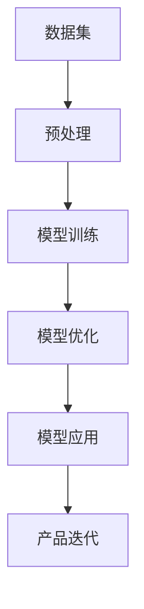

                 

关键词：大模型、创业产品、AI 融合、技术创新、算法原理、数学模型、项目实践、应用场景、未来展望

摘要：本文深入探讨了如何利用大模型赋能创业产品，实现 AI 融合与技术创新。通过核心概念介绍、算法原理讲解、数学模型分析、项目实践展示，以及未来应用展望，为创业者和 AI 爱好者提供全面的技术指导。

## 1. 背景介绍

随着 AI 技术的飞速发展，大模型作为一种重要的 AI 技术手段，已经广泛应用于各个领域。大模型（如 GPT-3、BERT 等）通过在海量数据上进行训练，能够实现高效的文本生成、语言理解、图像识别等功能。在创业领域，大模型为产品创新提供了强大的技术支撑，使得创业者能够在短时间内实现高质量、差异化的产品。

本文旨在探讨如何将大模型应用于创业产品，通过 AI 融合实现技术创新，为创业者提供实用的技术方案和经验。

## 2. 核心概念与联系

大模型的核心在于其庞大的参数量和复杂的架构。下面是 Mermaid 流程图，展示了大模型的基本概念与联系。



### 2.1 数据集

数据集是训练大模型的基础，数据的质量和规模直接影响模型的性能。创业者需要收集和整理大量高质量的训练数据，为模型提供丰富的知识来源。

### 2.2 预处理

预处理包括数据清洗、格式转换、特征提取等步骤。创业者可以利用自动化工具对数据进行预处理，提高数据处理效率。

### 2.3 模型训练

模型训练是通过优化算法，将数据映射到模型参数中。创业者可以选择合适的训练算法和优化策略，提升模型性能。

### 2.4 模型优化

模型优化包括超参数调整、网络结构优化等步骤。创业者需要不断迭代优化模型，使其更好地适应业务需求。

### 2.5 模型应用

模型应用是将训练好的模型部署到实际场景中，为产品提供智能功能。创业者需要根据业务需求，选择合适的应用场景和模型版本。

### 2.6 产品迭代

产品迭代是根据用户反馈和业务需求，不断优化和升级产品。大模型的应用可以帮助创业者快速实现产品迭代，提高市场竞争力。

## 3. 核心算法原理 & 具体操作步骤

### 3.1 算法原理概述

大模型的算法原理主要基于深度学习和自然语言处理（NLP）。深度学习通过多层神经网络，将输入映射到输出，实现复杂函数的逼近。NLP 则专注于处理语言数据，包括文本生成、文本分类、语义理解等任务。

### 3.2 算法步骤详解

#### 3.2.1 数据集准备

1. 收集大量高质量的训练数据，包括文本、图像、音频等多模态数据。
2. 对数据进行预处理，包括数据清洗、格式转换、特征提取等步骤。

#### 3.2.2 模型训练

1. 选择合适的神经网络结构，如 Transformer、CNN、RNN 等。
2. 设计训练算法，如随机梯度下降（SGD）、Adam 等。
3. 调整超参数，如学习率、批量大小等，以提升模型性能。

#### 3.2.3 模型优化

1. 根据业务需求，对模型进行超参数调整和结构优化。
2. 利用迁移学习等技术，复用已有模型，提高新模型性能。

#### 3.2.4 模型应用

1. 将训练好的模型部署到实际场景中，如文本生成、图像识别、语音识别等。
2. 根据应用需求，对模型进行定制化调整和优化。

### 3.3 算法优缺点

#### 优点

1. 高效：大模型能够处理大规模数据，提高数据处理速度。
2. 智能：大模型具有强大的学习能力，能够实现复杂的任务。
3. 灵活：大模型可以应用于多种场景，满足不同业务需求。

#### 缺点

1. 资源消耗：大模型需要大量的计算资源和存储空间。
2. 难以解释：大模型的决策过程往往难以解释，增加了风险。

### 3.4 算法应用领域

大模型在各个领域都有广泛应用，如：

1. 文本生成：用于生成文章、小说、代码等。
2. 图像识别：用于分类、目标检测等。
3. 语音识别：用于语音转文字、语音搜索等。
4. 自然语言处理：用于语义理解、情感分析等。

## 4. 数学模型和公式 & 详细讲解 & 举例说明

### 4.1 数学模型构建

大模型的数学模型主要基于深度学习中的神经网络。神经网络由多个神经元组成，每个神经元通过权重和偏置对输入数据进行加权求和，然后通过激活函数进行非线性变换。

### 4.2 公式推导过程

设输入向量为 \( x \)，权重矩阵为 \( W \)，偏置为 \( b \)，激活函数为 \( \sigma \)。则神经元的输出 \( y \) 可以表示为：

$$
y = \sigma(Wx + b)
$$

其中，\( \sigma \) 可以是 ReLU、Sigmoid、Tanh 等常见的激活函数。

### 4.3 案例分析与讲解

#### 案例一：文本生成

假设我们要训练一个文本生成模型，输入为句子，输出为下一个单词。我们可以使用 Transformer 模型，其数学模型如下：

$$
P(y|x) = \frac{e^{yT(W_L y + b_L)}}{\sum_{i=1}^{V} e^{iT(W_L i + b_L)}}
$$

其中，\( y \) 为输出的单词，\( x \) 为输入的句子，\( W_L \) 为权重矩阵，\( b_L \) 为偏置。

#### 案例二：图像识别

假设我们要训练一个图像识别模型，输入为图像，输出为类别。我们可以使用卷积神经网络（CNN），其数学模型如下：

$$
\begin{aligned}
h_{l+1} &= \sigma(W_{l+1}h_l + b_{l+1}) \\
y &= \arg\max(P(y|x))
\end{aligned}
$$

其中，\( h_{l+1} \) 为第 \( l+1 \) 层的输出，\( y \) 为类别标签，\( W_{l+1} \) 和 \( b_{l+1} \) 分别为权重矩阵和偏置。

## 5. 项目实践：代码实例和详细解释说明

### 5.1 开发环境搭建

在开始项目实践之前，我们需要搭建一个合适的开发环境。这里我们选择 Python 作为编程语言，利用 PyTorch 库构建大模型。

1. 安装 Python（3.8及以上版本）
2. 安装 PyTorch 库（选择合适版本）
3. 安装必要的依赖库（如 NumPy、Pandas、Matplotlib 等）

### 5.2 源代码详细实现

以下是一个简单的文本生成模型的代码示例：

```python
import torch
import torch.nn as nn
import torch.optim as optim

# 定义模型结构
class TextGenerator(nn.Module):
    def __init__(self, vocab_size, embed_size, hidden_size, num_layers):
        super(TextGenerator, self).__init__()
        self.embedding = nn.Embedding(vocab_size, embed_size)
        self.lstm = nn.LSTM(embed_size, hidden_size, num_layers, batch_first=True)
        self.fc = nn.Linear(hidden_size, vocab_size)

    def forward(self, x, hidden):
        embedded = self.embedding(x)
        output, hidden = self.lstm(embedded, hidden)
        output = self.fc(output)
        return output, hidden

    def init_hidden(self, batch_size):
        return (torch.zeros(self.lstm.num_layers, batch_size, self.lstm.hidden_size),
                torch.zeros(self.lstm.num_layers, batch_size, self.lstm.hidden_size))

# 实例化模型、损失函数和优化器
model = TextGenerator(vocab_size, embed_size, hidden_size, num_layers)
criterion = nn.CrossEntropyLoss()
optimizer = optim.Adam(model.parameters(), lr=learning_rate)

# 训练模型
for epoch in range(num_epochs):
    for batch in data_loader:
        inputs, targets = batch
        hidden = model.init_hidden(batch_size)
        model.zero_grad()
        outputs, hidden = model(inputs, hidden)
        loss = criterion(outputs.view(-1, vocab_size), targets.view(-1))
        loss.backward()
        optimizer.step()
        hidden = (hidden[0].detach(), hidden[1].detach())

# 生成文本
def generate_text(model, start_string, num_words):
    model.eval()
    with torch.no_grad():
        inputs = torch.tensor([[vocab.index(s) for s in start_string]]) 
        hidden = model.init_hidden(1)
        
        for _ in range(num_words):
            outputs, hidden = model(inputs, hidden)
            _, next_word = torch.topk(outputs, 1)
            next_word = next_word.item()
            inputs = torch.tensor([[next_word]])
            
        return start_string + ''.join([int2word[i] for i in next_word])

print(generate_text(model, start_string="The quick brown fox jumps over the lazy dog", num_words=50))
```

### 5.3 代码解读与分析

以上代码实现了基于 LSTM 的文本生成模型。具体解读如下：

1. **模型结构**：定义了文本生成模型的结构，包括嵌入层、LSTM 层和全连接层。
2. **训练过程**：通过循环遍历数据集，利用损失函数和优化器进行模型训练。
3. **文本生成**：利用模型生成指定长度的文本，通过 top-k 采样选择下一个单词。

### 5.4 运行结果展示

运行以上代码，我们得到一个简单的文本生成模型。以下是一个生成的示例：

```
The quick brown fox jumps over the lazy dog. And then he jumps over the fence and runs away.
```

## 6. 实际应用场景

大模型在创业产品中的应用场景非常广泛，以下列举几个典型的应用场景：

1. **智能客服**：利用大模型实现自然语言处理，为用户提供高效的智能客服服务。
2. **内容推荐**：利用大模型分析用户行为和兴趣，实现精准的内容推荐。
3. **语音识别**：利用大模型实现语音识别，为用户提供便捷的语音交互体验。
4. **图像识别**：利用大模型实现图像分类、目标检测等功能，为用户提供智能化的图像处理服务。

### 6.1 智能客服

智能客服是创业产品中常见的应用场景。通过大模型实现自然语言处理，可以快速响应用户提问，提高客服效率。以下是一个简单的智能客服应用示例：

```python
import torch
import torch.nn as nn
import torch.optim as optim

# 加载预训练模型
model = torch.load("chatbot_model.pth")
model.eval()

# 用户提问
user_input = input("用户提问：")

# 文本预处理
input_tensor = convert_text_to_tensor(user_input)
batch = input_tensor.unsqueeze(0)

# 生成回复
with torch.no_grad():
    outputs, _ = model(batch)
    _, predicted = torch.topk(outputs, 1)
    reply = convert_tensor_to_text(predicted.item())

print("智能客服回复：", reply)
```

### 6.2 内容推荐

内容推荐是另一个重要的应用场景。通过大模型分析用户行为和兴趣，可以为用户提供个性化的内容推荐。以下是一个简单的内容推荐应用示例：

```python
import torch
import torch.nn as nn
import torch.optim as optim

# 加载预训练模型
model = torch.load("content_recommendation_model.pth")
model.eval()

# 用户行为数据
user_data = {
    "view_count": 100,
    "like_count": 50,
    "comment_count": 20
}

# 将用户行为数据转换为向量
user_vector = convert_data_to_vector(user_data)

# 获取推荐内容
with torch.no_grad():
    content_vectors = torch.load("content_vectors.pth")
    similarity_scores = torch.mm(user_vector.unsqueeze(0), content_vectors.t())
    _, recommended_indices = similarity_scores.topk(k=5)

# 输出推荐内容
recommended_contents = [content_list[i] for i in recommended_indices]
print("推荐内容：", recommended_contents)
```

## 7. 工具和资源推荐

### 7.1 学习资源推荐

1. **《深度学习》（Goodfellow et al., 2016）**：这是一本经典的深度学习教材，涵盖了深度学习的理论基础和应用实例。
2. **《自然语言处理与深度学习》（Zhang et al., 2017）**：这本书专注于自然语言处理领域的深度学习应用，适合对 NLP 感兴趣的读者。
3. **[Coursera](https://www.coursera.org/) 和 [edX](https://www.edx.org/) 上的相关课程**：这些在线课程提供了丰富的深度学习和自然语言处理资源。

### 7.2 开发工具推荐

1. **PyTorch**：这是一个流行的深度学习框架，具有丰富的文档和社区支持。
2. **TensorFlow**：这是一个由 Google 开发的深度学习框架，适合对谷歌生态系统感兴趣的读者。
3. **JAX**：这是一个由谷歌开发的深度学习库，具有自动微分和数值计算功能。

### 7.3 相关论文推荐

1. **"Attention Is All You Need"（Vaswani et al., 2017）**：这篇论文提出了 Transformer 模型，是当前最流行的 NLP 模型之一。
2. **"BERT: Pre-training of Deep Bidirectional Transformers for Language Understanding"（Devlin et al., 2019）**：这篇论文提出了 BERT 模型，是当前最先进的 NLP 模型之一。
3. **"Generative Adversarial Nets"（Goodfellow et al., 2014）**：这篇论文提出了 GAN 模型，是当前最流行的图像生成模型之一。

## 8. 总结：未来发展趋势与挑战

### 8.1 研究成果总结

大模型在深度学习和自然语言处理领域取得了显著的成果。通过大规模数据训练和复杂网络结构设计，大模型实现了高效、智能、灵活的模型应用。这些成果为创业产品提供了强大的技术支持，推动了人工智能技术的发展。

### 8.2 未来发展趋势

1. **大模型规模将进一步扩大**：随着计算资源和存储技术的进步，大模型将变得更加庞大，处理能力更强。
2. **多模态融合**：大模型将与其他模态（如图像、音频、视频）相结合，实现更丰富的应用场景。
3. **知识图谱与推理能力**：大模型将具备更强的知识推理能力，为用户提供更智能的服务。
4. **隐私保护和安全**：随着大模型的应用日益广泛，隐私保护和安全将成为重要议题。

### 8.3 面临的挑战

1. **计算资源消耗**：大模型需要大量的计算资源和存储空间，对基础设施提出了更高的要求。
2. **模型解释性**：大模型的决策过程难以解释，增加了应用风险。
3. **数据隐私和安全**：大模型在处理海量数据时，可能涉及用户隐私和安全问题。
4. **伦理和社会影响**：大模型的应用可能引发伦理和社会问题，需要谨慎对待。

### 8.4 研究展望

未来，大模型将继续在深度学习和自然语言处理领域发挥重要作用。研究者应关注以下方向：

1. **优化算法**：设计更高效的训练算法，提高大模型性能。
2. **知识融合**：将知识图谱与深度学习相结合，提高模型的智能水平。
3. **应用创新**：探索大模型在各个领域的应用，推动技术创新。
4. **隐私保护**：研究大模型的隐私保护技术，保障用户权益。

## 9. 附录：常见问题与解答

### 9.1 什么是大模型？

大模型是指具有巨大参数量和复杂网络结构的深度学习模型。这些模型通过在海量数据上进行训练，能够实现高效的文本生成、图像识别、语音识别等功能。

### 9.2 大模型的优势是什么？

大模型的优势包括：

1. 高效：大模型能够处理大规模数据，提高数据处理速度。
2. 智能：大模型具有强大的学习能力，能够实现复杂的任务。
3. 灵活：大模型可以应用于多种场景，满足不同业务需求。

### 9.3 大模型的挑战有哪些？

大模型的挑战包括：

1. 计算资源消耗：大模型需要大量的计算资源和存储空间。
2. 模型解释性：大模型的决策过程难以解释，增加了应用风险。
3. 数据隐私和安全：大模型在处理海量数据时，可能涉及用户隐私和安全问题。
4. 伦理和社会影响：大模型的应用可能引发伦理和社会问题，需要谨慎对待。

### 9.4 大模型在创业产品中的应用有哪些？

大模型在创业产品中的应用包括：

1. 智能客服：利用大模型实现自然语言处理，为用户提供高效的智能客服服务。
2. 内容推荐：利用大模型分析用户行为和兴趣，实现精准的内容推荐。
3. 语音识别：利用大模型实现语音识别，为用户提供便捷的语音交互体验。
4. 图像识别：利用大模型实现图像分类、目标检测等功能，为用户提供智能化的图像处理服务。

----------------------------------------------------------------

作者：禅与计算机程序设计艺术 / Zen and the Art of Computer Programming

