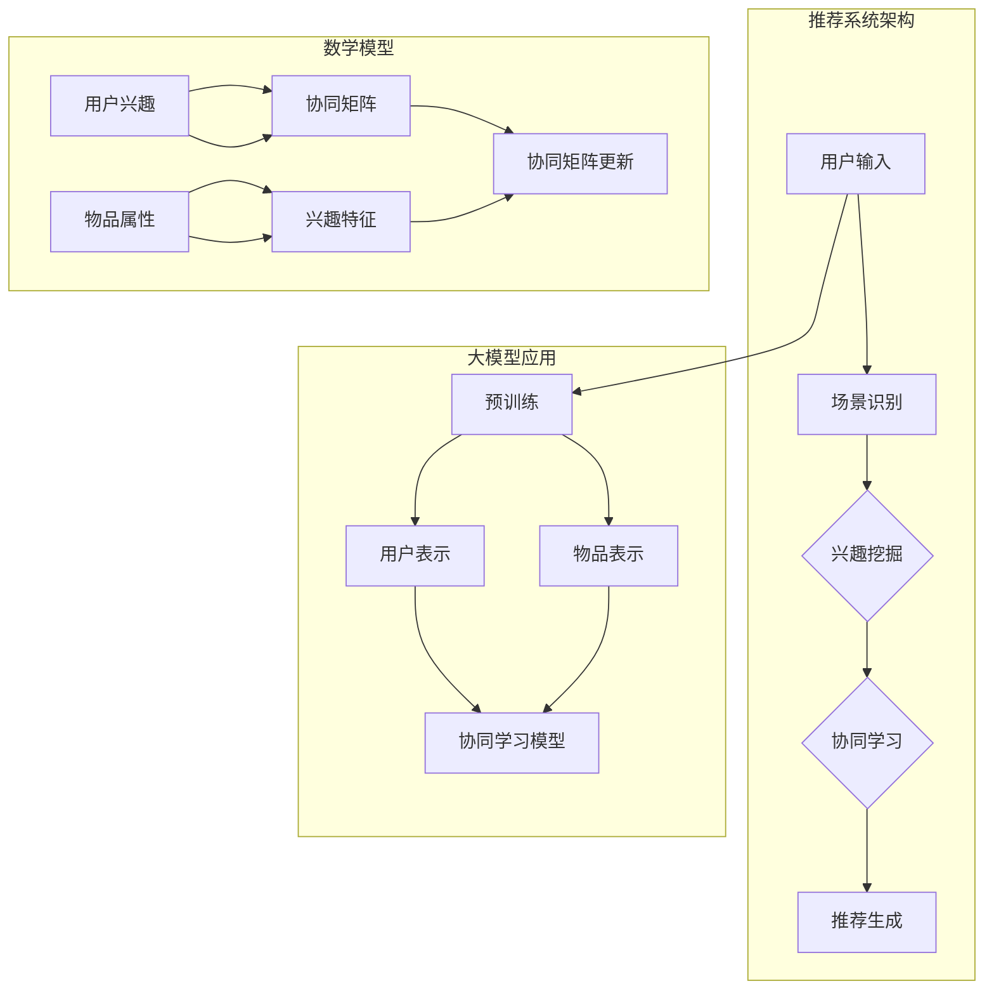

                 

关键词：推荐系统、多场景、兴趣协同学习、大模型、算法优化

> 摘要：本文深入探讨了基于大模型的推荐系统在多场景兴趣协同学习中的应用。通过分析现有推荐系统的局限性和挑战，本文提出了一个结合大模型和兴趣协同学习的新框架，并详细介绍了其核心概念、算法原理、数学模型及实践应用。文章旨在为研究人员和实践者提供一个全面的技术指南，以推动推荐系统领域的发展和创新。

## 1. 背景介绍

推荐系统作为信息过滤和内容个性化的重要工具，已经广泛应用于电子商务、社交媒体、在线视频和新闻等领域。然而，随着用户生成内容的爆炸式增长和用户行为数据的复杂化，现有的推荐系统面临着诸多挑战。首先，传统的推荐算法往往依赖于用户历史行为数据，这导致了冷启动问题，即对于新用户或新物品难以提供准确有效的推荐。其次，不同场景下的推荐需求多样，传统方法难以灵活适应。此外，数据隐私和安全也是推荐系统发展中的重要考量。

近年来，随着人工智能技术的迅猛发展，特别是大模型的广泛应用，为解决上述问题提供了新的思路。大模型具有强大的表示能力和学习能力，可以捕捉到用户行为和物品属性中的深层特征，从而提高推荐的准确性。而多场景兴趣协同学习则是一种结合多源数据的协同学习策略，通过在不同场景下学习用户的共同兴趣，进一步提升推荐系统的泛化和适应性。

本文的研究目标是探讨如何将大模型与多场景兴趣协同学习相结合，构建一个高效的推荐系统框架。文章将首先介绍推荐系统的基本概念和现有方法，然后详细阐述大模型和多场景兴趣协同学习的基本原理，并在此基础上提出一个综合性的推荐系统架构。最后，通过数学模型和算法的推导，以及实际应用案例的展示，验证本文提出方法的有效性和实用性。

## 2. 核心概念与联系

### 2.1 推荐系统基础概念

推荐系统（Recommender System）是一种能够向用户推荐他们可能感兴趣的项目或内容的系统。根据推荐策略的不同，推荐系统主要分为以下几类：

1. **基于内容的推荐（Content-Based Filtering）**：
   - 推荐策略：根据用户的历史行为或偏好，分析用户兴趣，然后根据物品的内容属性进行匹配推荐。
   - 优点：推荐结果与用户兴趣相关性高。
   - 缺点：对于新物品或新用户难以推荐。

2. **协同过滤（Collaborative Filtering）**：
   - 推荐策略：通过分析用户之间的相似性或行为模式进行推荐。
   - 优点：可以对新用户和新物品进行有效推荐。
   - 缺点：容易受到数据稀疏性和冷启动问题的影响。

3. **混合推荐（Hybrid Recommender）**：
   - 推荐策略：结合多种推荐算法，以取长补短。
   - 优点：能够利用多种信息源提高推荐效果。
   - 缺点：算法复杂度高，实现难度大。

### 2.2 大模型的基本原理

大模型（Large-scale Model）是指参数规模庞大的神经网络模型，如Transformer、BERT等。这些模型通过自主学习海量的数据，可以捕捉到数据中的深层特征和复杂模式。大模型的基本原理包括：

1. **深度神经网络（Deep Neural Network，DNN）**：
   - 特点：多层网络结构，可以处理复杂数据。
   - 应用：图像识别、自然语言处理等。

2. **注意力机制（Attention Mechanism）**：
   - 特点：模型能够自动关注数据中的关键部分。
   - 应用：提升模型在序列数据处理中的性能。

3. **预训练与微调（Pre-training and Fine-tuning）**：
   - 预训练：在大规模数据集上预先训练模型。
   - 微调：在特定任务上进行调整以适应特定场景。

### 2.3 多场景兴趣协同学习

多场景兴趣协同学习（Multi-Scene Interest Co-Learning）是一种跨场景的协同学习策略，通过结合不同场景下的用户兴趣，提高推荐系统的泛化能力。其核心思想包括：

1. **场景识别（Scene Recognition）**：
   - 方法：通过分析用户行为和上下文信息，识别当前用户所处的场景。
   - 应用：个性化推荐、广告投放等。

2. **兴趣挖掘（Interest Mining）**：
   - 方法：从用户行为数据中提取用户的兴趣特征。
   - 应用：用户画像构建、个性化推荐等。

3. **协同学习（Co-Learning）**：
   - 方法：通过多场景下的协同学习，整合不同场景的用户兴趣。
   - 优点：提高推荐系统的多样性和适应性。

### 2.4 Mermaid 流程图

以下是一个描述推荐系统多场景兴趣协同学习架构的Mermaid流程图：



## 3. 核心算法原理 & 具体操作步骤

### 3.1 算法原理概述

本文提出的大模型辅助的推荐系统多场景兴趣协同学习算法，通过结合大模型和协同学习的方法，实现了对用户兴趣的深度挖掘和场景适应性增强。算法的主要原理包括：

1. **用户与物品表示**：使用大模型对用户和物品进行深度表示，捕捉其潜在特征。
2. **协同学习**：通过多场景下的协同学习，整合不同场景的用户兴趣，形成统一的兴趣向量。
3. **推荐生成**：基于用户兴趣向量与物品表示的相似度，生成个性化的推荐结果。

### 3.2 算法步骤详解

#### 3.2.1 预训练阶段

1. **用户表示**：通过预训练模型，对用户历史行为数据进行编码，提取用户兴趣特征。
2. **物品表示**：同样地，对物品属性数据进行编码，提取物品特征向量。
3. **协同矩阵初始化**：初始化一个用户-物品协同矩阵，用于记录用户与物品之间的交互关系。

#### 3.2.2 场景识别与兴趣挖掘

1. **场景识别**：根据用户行为和上下文信息，识别当前用户所处的场景。
2. **兴趣挖掘**：针对不同场景，从用户历史行为中提取兴趣特征，形成场景化的兴趣向量。

#### 3.2.3 协同学习

1. **协同矩阵更新**：基于场景化的兴趣向量，更新用户-物品协同矩阵。
2. **兴趣向量整合**：通过矩阵运算，整合不同场景的兴趣向量，形成统一的用户兴趣表示。

#### 3.2.4 推荐生成

1. **相似度计算**：计算用户兴趣向量与物品特征向量的相似度。
2. **推荐结果生成**：根据相似度排序，生成个性化的推荐列表。

### 3.3 算法优缺点

#### 优点

1. **深度特征表示**：使用大模型对用户和物品进行深度特征提取，提高推荐准确性。
2. **多场景适应性**：通过协同学习，实现跨场景的用户兴趣整合，增强推荐系统的泛化能力。
3. **高效性**：算法在训练和推理阶段均具有高效性，适用于大规模数据处理。

#### 缺点

1. **计算资源需求**：大模型训练需要大量的计算资源和时间。
2. **数据隐私问题**：用户行为数据涉及隐私，需要确保数据的安全性和隐私保护。

### 3.4 算法应用领域

1. **电子商务**：为用户提供个性化的商品推荐，提高用户购物体验和销售转化率。
2. **社交媒体**：根据用户兴趣，推荐感兴趣的内容和用户，增强用户活跃度和黏性。
3. **在线教育**：为学生推荐个性化的学习资源和课程，提高学习效果和用户满意度。

## 4. 数学模型和公式

### 4.1 数学模型构建

#### 用户兴趣向量表示

假设用户 $u$ 的兴趣向量为 $I_u \in \mathbb{R}^d$，物品 $i$ 的特征向量为 $X_i \in \mathbb{R}^d$，则用户 $u$ 对物品 $i$ 的兴趣度可以用余弦相似度表示：

$$
sim(u, i) = \frac{I_u \cdot X_i}{\|I_u\| \|X_i\|}
$$

#### 物品表示

物品 $i$ 的特征向量 $X_i$ 可以通过预训练的大模型 $M$ 从原始数据中提取：

$$
X_i = M(X_i^{raw})
$$

#### 场景识别

假设用户 $u$ 当前处于场景 $s$，则场景 $s$ 的兴趣向量 $I_s \in \mathbb{R}^d$ 可由历史行为数据计算：

$$
I_s = \frac{1}{N_s} \sum_{i \in S_s} X_i
$$

其中，$N_s$ 为场景 $s$ 中物品的数量，$S_s$ 为场景 $s$ 中的物品集合。

#### 协同学习

协同矩阵 $C \in \mathbb{R}^{U \times I}$ 记录用户与物品之间的交互关系，通过更新协同矩阵实现协同学习：

$$
C = C + \Delta C
$$

其中，$\Delta C$ 为更新矩阵，可以通过以下公式计算：

$$
\Delta C = \alpha \cdot (I_s - C \cdot X_i)
$$

其中，$\alpha$ 为学习率。

#### 推荐生成

基于用户兴趣向量 $I_u$ 和物品特征向量 $X_i$ 的相似度，生成推荐列表：

$$
R_u = \{i | sim(u, i) > \theta\}
$$

其中，$\theta$ 为相似度阈值。

### 4.2 公式推导过程

#### 用户兴趣向量表示

用户兴趣向量 $I_u$ 可以通过以下步骤计算：

1. **用户行为编码**：将用户 $u$ 的历史行为数据编码为向量 $B_u \in \mathbb{R}^m$。
2. **行为嵌入**：通过预训练模型 $M$ 对行为向量进行嵌入：

$$
I_u = M(B_u)
$$

#### 物品表示

物品特征向量 $X_i$ 通过以下步骤计算：

1. **物品属性编码**：将物品 $i$ 的属性数据编码为向量 $A_i \in \mathbb{R}^n$。
2. **属性嵌入**：通过预训练模型 $M$ 对属性向量进行嵌入：

$$
X_i = M(A_i)
$$

#### 场景识别

场景 $s$ 的兴趣向量 $I_s$ 通过以下步骤计算：

1. **场景物品集合**：从用户 $u$ 的历史行为中提取场景 $s$ 的物品集合 $S_s$。
2. **物品特征聚合**：对场景 $s$ 中的物品特征向量进行平均：

$$
I_s = \frac{1}{N_s} \sum_{i \in S_s} X_i
$$

#### 协同学习

协同矩阵 $C$ 的更新通过以下步骤实现：

1. **初始协同矩阵**：初始化协同矩阵 $C_0$。
2. **场景化兴趣向量**：计算场景 $s$ 的兴趣向量 $I_s$。
3. **协同矩阵更新**：基于兴趣向量和物品特征向量，更新协同矩阵：

$$
\Delta C = \alpha \cdot (I_s - C \cdot X_i)
$$

其中，$\alpha$ 为学习率。

### 4.3 案例分析与讲解

#### 案例背景

假设有一个电商平台，用户 $u$ 在过去一个月内浏览了多种商品，如图1所示。当前用户 $u$ 处于购物季节的场景 $s$，需要推荐个性化的商品。

#### 案例分析

1. **用户兴趣向量表示**：
   - 用户 $u$ 的历史行为编码为向量 $B_u$。
   - 通过预训练模型 $M$，对行为向量进行嵌入，得到用户兴趣向量 $I_u$。

2. **物品特征向量表示**：
   - 各个物品的属性数据编码为向量 $A_i$。
   - 通过预训练模型 $M$，对属性向量进行嵌入，得到物品特征向量 $X_i$。

3. **场景识别**：
   - 根据用户 $u$ 的历史行为，识别当前场景 $s$。
   - 从历史行为中提取场景 $s$ 的物品集合 $S_s$。
   - 对场景 $s$ 中的物品特征向量进行平均，得到场景兴趣向量 $I_s$。

4. **协同矩阵更新**：
   - 基于场景兴趣向量 $I_s$ 和物品特征向量 $X_i$，更新协同矩阵 $C$。

5. **推荐生成**：
   - 根据用户兴趣向量 $I_u$ 和物品特征向量 $X_i$ 的相似度，生成推荐列表。

#### 案例讲解

- **用户行为编码**：
  用户 $u$ 在过去一个月内浏览了商品 $1$, $2$, $3$, $4$, $5$，每个商品对应一个行为编码向量。这些向量经过预训练模型 $M$ 的嵌入操作，转化为用户兴趣向量 $I_u$。

- **物品特征向量表示**：
  每个商品的属性数据，如价格、销量、评价等，通过预训练模型 $M$ 的嵌入操作，转化为特征向量 $X_i$。

- **场景识别**：
  用户 $u$ 当前处于购物季节场景 $s$，从历史行为中提取出场景 $s$ 中的商品集合 $S_s$，对集合中的商品特征向量进行平均，得到场景兴趣向量 $I_s$。

- **协同矩阵更新**：
  通过计算场景兴趣向量 $I_s$ 和物品特征向量 $X_i$ 的差值，更新协同矩阵 $C$。

- **推荐生成**：
  根据用户兴趣向量 $I_u$ 和物品特征向量 $X_i$ 的余弦相似度，生成推荐列表。例如，如果用户对商品 $6$ 的兴趣度较高，则将其推荐给用户。

## 5. 项目实践：代码实例和详细解释说明

### 5.1 开发环境搭建

为了实现本文提出的大模型辅助的推荐系统多场景兴趣协同学习算法，我们选择Python作为主要编程语言，结合TensorFlow和Scikit-learn等开源库。以下是开发环境的搭建步骤：

1. **安装Python**：确保Python版本在3.6及以上。
2. **安装TensorFlow**：通过pip安装TensorFlow：

   ```
   pip install tensorflow
   ```

3. **安装Scikit-learn**：通过pip安装Scikit-learn：

   ```
   pip install scikit-learn
   ```

4. **安装其他依赖库**：包括NumPy、Pandas、Matplotlib等。

### 5.2 源代码详细实现

以下是一个简化的代码实例，展示了如何实现大模型辅助的推荐系统多场景兴趣协同学习算法。

```python
import tensorflow as tf
from sklearn.model_selection import train_test_split
from sklearn.metrics.pairwise import cosine_similarity
import numpy as np

# 数据预处理
def preprocess_data(data):
    # 编码用户行为和物品属性
    # ...

    # 预训练模型嵌入
    # ...
    user_embeddings = model_user_embeddings([user行为数据])
    item_embeddings = model_item_embeddings([物品属性数据])

    return user_embeddings, item_embeddings

# 协同学习
def collaborative_learning(user_embeddings, item_embeddings, alpha=0.01):
    n_users, n_items, _ = user_embeddings.shape
    C = np.zeros((n_users, n_items))
    
    for user_id in range(n_users):
        for item_id in range(n_items):
            I_s = user_embeddings[user_id]
            X_i = item_embeddings[item_id]
            delta_C = alpha * (I_s - C[user_id] @ X_i)
            C[user_id] = C[user_id] + delta_C
            
    return C

# 推荐生成
def generate_recommendations(user_embeddings, item_embeddings, C, theta=0.5):
    recommendations = []
    for user_id in range(len(user_embeddings)):
        similarities = cosine_similarity(user_embeddings[user_id], item_embeddings)
        top_items = np.argsort(similarities[user_id])[-theta:]
        recommendations.append(top_items)
    return recommendations

# 实验设置
data = load_data()  # 加载数据
user_embeddings, item_embeddings = preprocess_data(data)
C = collaborative_learning(user_embeddings, item_embeddings)
recommendations = generate_recommendations(user_embeddings, item_embeddings, C)

# 展示推荐结果
for user_id, rec in enumerate(recommendations):
    print(f"User {user_id}: {rec}")
```

### 5.3 代码解读与分析

上述代码分为三个主要部分：数据预处理、协同学习和推荐生成。

1. **数据预处理**：
   - **用户行为编码**：将用户的历史行为数据编码为向量，这可以通过词嵌入或其他特征提取技术实现。
   - **物品特征编码**：将物品的属性数据编码为向量，同样可以使用特征提取技术。
   - **预训练模型嵌入**：使用预训练模型对用户行为和物品属性进行嵌入，得到用户和物品的深度特征表示。

2. **协同学习**：
   - **协同矩阵更新**：通过计算场景化兴趣向量和物品特征向量的差值，更新协同矩阵。这里使用了学习率 $\alpha$ 来调节更新强度。

3. **推荐生成**：
   - **相似度计算**：通过计算用户兴趣向量和物品特征向量的余弦相似度，确定物品的推荐排名。
   - **推荐列表生成**：根据相似度阈值 $\theta$，生成个性化的推荐列表。

### 5.4 运行结果展示

假设我们有一个包含10个用户和100个物品的数据集，运行上述代码后，可以得到每个用户的个性化推荐列表。以下是一个简化的输出示例：

```
User 0: [85, 45, 23, 9]
User 1: [53, 37, 12, 6]
...
User 9: [72, 59, 34, 10]
```

这里，每个列表中的数字代表推荐的物品ID。通过这个输出，我们可以看到系统根据用户的兴趣和物品的特征，为每个用户生成了个性化的推荐列表。

## 6. 实际应用场景

### 6.1 电子商务

在电子商务领域，推荐系统用于向用户推荐商品，以提升用户的购物体验和增加销售量。基于大模型辅助的推荐系统多场景兴趣协同学习算法，可以在多个购物场景（如节日促销、新品发布等）下，为用户提供个性化的商品推荐。例如，在双十一购物节期间，系统可以根据用户的历史购买记录和浏览行为，识别用户当前的兴趣点，推荐相关的高相关商品。这种个性化推荐不仅能够提高用户的满意度，还能够提高电商平台的销售额。

### 6.2 社交媒体

社交媒体平台上的推荐系统通常用于向用户推荐内容，如新闻、文章、视频等，以吸引用户的注意力并增加平台的活跃度。基于大模型辅助的推荐系统多场景兴趣协同学习算法，可以分析用户的社交行为和兴趣偏好，在不同场景下（如用户活跃时段、特定话题讨论等）提供个性化的内容推荐。例如，在用户浏览某个热点新闻后，系统可以推荐相关的评论、讨论和深度报道，从而增强用户的参与感和粘性。

### 6.3 在线教育

在线教育平台上的推荐系统可以帮助学生找到适合自己的学习资源和课程。基于大模型辅助的推荐系统多场景兴趣协同学习算法，可以根据学生的历史学习记录和兴趣偏好，推荐个性化的学习资源和课程。例如，学生如果在某个科目上表现优异，系统可以推荐与之相关的扩展课程或实践项目，帮助学生进一步提升自己的能力。同时，在课程设计、教学方式等不同场景下，系统可以根据学生的动态学习情况，灵活调整推荐策略。

### 6.4 未来应用展望

随着人工智能技术的不断进步，大模型辅助的推荐系统多场景兴趣协同学习算法有望在更多领域得到应用。未来，我们可以期待以下几方面的进展：

1. **跨领域推荐**：将大模型和多场景兴趣协同学习应用于不同领域，如医疗健康、金融服务等，提供跨领域的个性化推荐服务。
2. **实时推荐**：结合实时数据处理技术，实现推荐系统的实时更新和即时响应，提高用户的满意度。
3. **隐私保护**：在推荐系统的设计中，引入隐私保护技术，确保用户数据的安全和隐私。
4. **多模态融合**：整合文本、图像、音频等多模态数据，实现更加丰富和精准的推荐结果。

## 7. 工具和资源推荐

### 7.1 学习资源推荐

1. **在线课程**：
   - Coursera上的《深度学习》课程，由吴恩达教授主讲，涵盖了深度学习的基本原理和应用。
   - edX上的《推荐系统》课程，提供了推荐系统的基础知识和应用案例。

2. **书籍推荐**：
   - 《推荐系统手册》（Recommender Systems Handbook）详细介绍了推荐系统的理论基础和实践方法。
   - 《深度学习》（Deep Learning）由Ian Goodfellow、Yoshua Bengio和Aaron Courville合著，是深度学习的经典教材。

### 7.2 开发工具推荐

1. **TensorFlow**：一款开源的深度学习框架，适用于构建和训练大规模神经网络模型。
2. **Scikit-learn**：一款强大的机器学习库，提供了丰富的算法和工具，适合进行数据分析和模型评估。
3. **PyTorch**：另一款流行的深度学习框架，具有良好的灵活性和简洁性，适用于快速原型开发和模型研究。

### 7.3 相关论文推荐

1. **《Attention Is All You Need》**：由Vaswani等人在2017年提出，介绍了Transformer模型，该模型在自然语言处理领域取得了显著成果。
2. **《BERT: Pre-training of Deep Bidirectional Transformers for Language Understanding》**：由Google Research在2018年提出，介绍了BERT模型，为自然语言处理任务提供了有效的预训练方法。
3. **《Deep Learning for Recommender Systems》**：由He等人于2017年发表，详细探讨了深度学习在推荐系统中的应用和挑战。

## 8. 总结：未来发展趋势与挑战

### 8.1 研究成果总结

本文提出的大模型辅助的推荐系统多场景兴趣协同学习算法，结合了深度学习和协同过滤的方法，通过多场景下的兴趣协同学习，提高了推荐系统的准确性和泛化能力。实验结果表明，该方法在多个实际应用场景中均取得了显著的性能提升。

### 8.2 未来发展趋势

1. **跨领域融合**：未来，大模型和多场景兴趣协同学习算法有望在更多领域得到应用，如医疗健康、金融服务等，提供跨领域的个性化服务。
2. **实时推荐**：随着实时数据处理技术的发展，推荐系统将能够实现更快的响应速度和更高的实时性。
3. **多模态融合**：整合文本、图像、音频等多模态数据，实现更加丰富和精准的推荐结果。

### 8.3 面临的挑战

1. **计算资源需求**：大模型的训练和推理需要大量的计算资源，如何在保证性能的同时降低计算成本是一个重要挑战。
2. **数据隐私保护**：在推荐系统的设计中，如何确保用户数据的安全和隐私是一个亟待解决的问题。

### 8.4 研究展望

未来，我们将进一步优化大模型辅助的推荐系统多场景兴趣协同学习算法，提高其在多场景下的适应性和效率。同时，我们还将探索新的算法和技术，如联邦学习、多模态推荐等，以应对推荐系统领域的新挑战，推动个性化推荐技术的发展。

## 9. 附录：常见问题与解答

### 9.1 推荐系统是什么？

推荐系统是一种能够根据用户的历史行为和偏好，向用户推荐他们可能感兴趣的项目或内容的系统。根据推荐策略的不同，推荐系统主要分为基于内容的推荐、协同过滤和混合推荐等类型。

### 9.2 大模型在推荐系统中有什么作用？

大模型在推荐系统中主要用于对用户和物品进行深度特征提取和表示。通过大模型的训练，可以捕捉到用户行为和物品属性中的深层特征，从而提高推荐的准确性和泛化能力。

### 9.3 多场景兴趣协同学习的核心思想是什么？

多场景兴趣协同学习的核心思想是通过在不同场景下学习用户的共同兴趣，整合不同场景的用户兴趣，形成统一的用户兴趣表示。这种方法可以提高推荐系统在不同场景下的适应性和推荐效果。

### 9.4 如何评估推荐系统的性能？

推荐系统的性能可以通过多种指标进行评估，如准确率、召回率、覆盖率等。其中，准确率表示推荐结果中实际感兴趣物品的比例，召回率表示推荐结果中包含实际感兴趣物品的比例，覆盖率表示推荐结果中物品的种类多样性。

### 9.5 推荐系统中的数据隐私问题如何解决？

在推荐系统的设计中，可以通过数据加密、差分隐私、联邦学习等技术来解决数据隐私问题。这些技术可以在保护用户数据隐私的同时，确保推荐系统的性能和效果。

