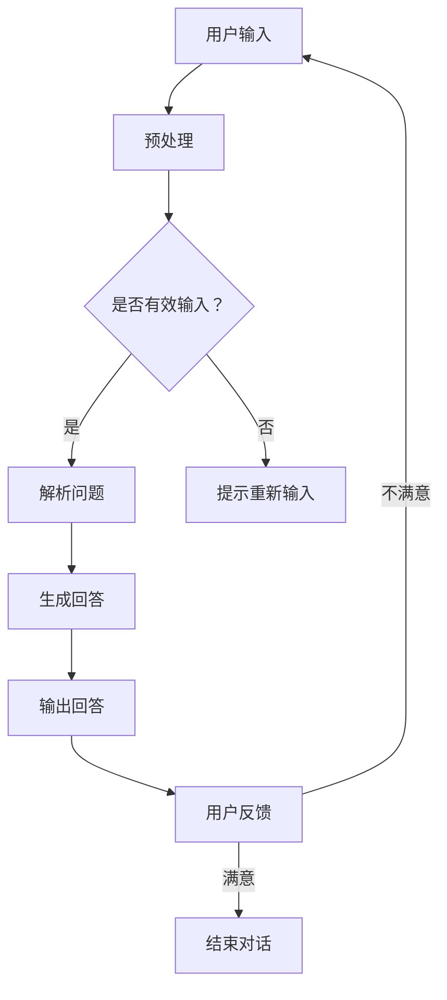

                 

作为世界顶级人工智能专家，我将探讨如何实现大模型问答机器人与用户之间的对话。以下是本文将讨论的主要内容：

1. **背景介绍**  
2. **核心概念与联系**  
3. **核心算法原理 & 具体操作步骤**  
4. **数学模型和公式 & 详细讲解 & 举例说明**  
5. **项目实践：代码实例和详细解释说明**  
6. **实际应用场景**  
7. **未来应用展望**  
8. **工具和资源推荐**  
9. **总结：未来发展趋势与挑战**  
10. **附录：常见问题与解答**

## 1. 背景介绍

大模型问答机器人是近年来人工智能领域的重要进展之一。随着深度学习和自然语言处理技术的快速发展，大型预训练模型如GPT-3、BERT等已经在各种任务中取得了显著的成果。这些模型具有强大的文本生成和理解能力，使其成为构建问答机器人的理想选择。

问答机器人不仅可以提供实时、准确的回答，还可以提高用户体验，节省人力资源。在许多场景中，如客户服务、在线教育、医疗咨询等，问答机器人已经成为不可或缺的工具。

本文将探讨如何利用大型预训练模型构建一个问答机器人，并实现与其用户之间的有效对话。通过详细分析和实例展示，帮助读者了解这一过程的实现细节和技术要点。

## 2. 核心概念与联系

### 2.1 大模型

大模型指的是具有数百万甚至数十亿参数的深度学习模型。这些模型通过在大量数据上进行预训练，可以自动学习到丰富的知识表示和语言规律。

### 2.2 自然语言处理（NLP）

自然语言处理是人工智能的一个重要分支，旨在使计算机能够理解、生成和处理人类语言。在问答机器人中，NLP技术用于解析用户输入、生成回答以及理解回答的内容。

### 2.3 对话系统

对话系统是一种人与计算机之间的交互系统，能够理解自然语言输入并生成相应的自然语言输出。问答机器人是对话系统的一种特殊形式，其主要功能是回答用户的问题。

### 2.4 Mermaid 流程图

以下是构建问答机器人的核心概念和流程的 Mermaid 流程图：



### 2.5 数据流

在问答机器人的实现过程中，数据流是至关重要的。以下是数据流的主要步骤：

1. 用户输入：用户通过文本或语音输入问题。
2. 预处理：对输入的文本进行清洗、分词、去除停用词等处理。
3. 问题解析：利用NLP技术对预处理后的文本进行结构化处理，提取关键词和问题类型。
4. 回答生成：使用大型预训练模型生成回答。
5. 回答输出：将生成的回答呈现给用户。
6. 用户反馈：用户对回答进行评价，反馈满意或不满意。
7. 结束对话：如果用户满意，结束对话；否则，继续进行新一轮的交互。

## 3. 核心算法原理 & 具体操作步骤

### 3.1 算法原理概述

问答机器人的核心算法是基于大型预训练模型（如GPT-3、BERT）和自然语言处理技术。预训练模型通过在大量数据上学习，获得了丰富的知识表示和语言规律。在问答过程中，这些模型可以自动理解用户输入、生成相关回答。

### 3.2 算法步骤详解

以下是构建问答机器人的具体算法步骤：

#### 3.2.1 用户输入

用户通过文本或语音输入问题。对于文本输入，可以先进行语音识别转换为文本。

#### 3.2.2 预处理

对输入的文本进行预处理，包括：

1. 清洗：去除无关符号、停用词等。
2. 分词：将文本切分成单词或词组。
3. 词向量化：将单词转换为对应的向量表示。

#### 3.2.3 问题解析

利用NLP技术对预处理后的文本进行结构化处理，提取关键词和问题类型。常用的方法包括：

1. 词性标注：对每个单词进行词性标注，如名词、动词、形容词等。
2. 依存句法分析：分析单词之间的依存关系，提取关键信息。
3. 问题分类：将问题归类到不同的主题或类型，如事实性问题、意见性问题等。

#### 3.2.4 回答生成

使用大型预训练模型生成回答。在生成过程中，模型会根据问题解析的结果和预训练的知识表示，生成相关的回答。常用的方法包括：

1. 生成式模型：如GPT-3，可以根据问题生成完整的回答。
2. 抽取式模型：如BERT，可以从大量文本中抽取相关答案。

#### 3.2.5 回答输出

将生成的回答呈现给用户。在输出过程中，可以对回答进行格式化、排版等处理。

#### 3.2.6 用户反馈

用户对回答进行评价，反馈满意或不满意。如果用户不满意，可以继续进行新一轮的交互。

### 3.3 算法优缺点

#### 优点：

1. **强大的理解能力**：基于预训练模型，问答机器人可以自动理解用户输入和生成相关回答。
2. **灵活性强**：可以应对各种类型的问题和场景。
3. **易于扩展**：可以根据不同需求和场景，添加或调整模型和算法。

#### 缺点：

1. **计算资源消耗大**：训练和推理过程需要大量计算资源。
2. **数据依赖性高**：模型的效果依赖于训练数据的质量和数量。

### 3.4 算法应用领域

问答机器人可以应用于各种领域，如：

1. **客户服务**：自动回答客户的问题，提高服务质量。
2. **在线教育**：为学生提供实时解答，辅助学习。
3. **医疗咨询**：为用户提供医疗健康咨询，辅助医生诊断。
4. **智能助手**：为用户提供个性化服务，提高生活品质。

## 4. 数学模型和公式 & 详细讲解 & 举例说明

### 4.1 数学模型构建

问答机器人的核心算法基于深度学习模型，主要包括两个部分：编码器和解码器。

#### 编码器

编码器负责将输入文本转换为向量表示。常用的编码器模型包括：

1. **Word2Vec**：将每个单词映射到一个固定维度的向量。
2. **BERT**：使用Transformer结构，对输入文本进行上下文编码。

#### 解码器

解码器负责生成回答。常用的解码器模型包括：

1. **生成式模型**：如GPT-3，通过自回归方式生成回答。
2. **抽取式模型**：如BERT，从预训练模型中抽取相关答案。

### 4.2 公式推导过程

以下是编码器和解码器的基本公式推导过程：

#### 编码器

设输入文本为 $X = [x_1, x_2, ..., x_n]$，其中 $x_i$ 表示第 $i$ 个单词。编码器的目标是将输入文本转换为向量表示 $Z = [z_1, z_2, ..., z_n]$。

1. **Word2Vec**：

   $$z_i = \text{softmax}(W \cdot x_i + b)$$

   其中，$W$ 为词向量矩阵，$b$ 为偏置项。

2. **BERT**：

   $$z_i = \text{Transformer}(x_i, [x_1, x_2, ..., x_i, ..., x_n])$$

   其中，$\text{Transformer}$ 为Transformer结构。

#### 解码器

设生成的回答为 $Y = [y_1, y_2, ..., y_m]$，其中 $y_i$ 表示第 $i$ 个单词。解码器的目标是从编码器输出的向量 $Z$ 中生成回答。

1. **生成式模型**：

   $$y_i = \text{softmax}(U \cdot z_i + c)$$

   其中，$U$ 为解码器权重矩阵，$c$ 为解码器偏置项。

2. **抽取式模型**：

   $$y_i = \text{BERT}(z_i)$$

   其中，$\text{BERT}$ 为预训练模型。

### 4.3 案例分析与讲解

#### 案例一：使用GPT-3生成回答

假设输入问题为：“北京是中国的哪个城市？”

1. 预处理：将输入文本转换为词向量表示。
2. 编码器：使用GPT-3模型对输入文本进行编码，得到向量 $Z$。
3. 解码器：使用GPT-3模型生成回答，得到输出文本。

输出回答为：“北京是中国的首都。”

#### 案例二：使用BERT抽取回答

假设输入问题为：“苹果是什么水果？”

1. 预处理：将输入文本转换为词向量表示。
2. 编码器：使用BERT模型对输入文本进行编码，得到向量 $Z$。
3. 解码器：从预训练文本中抽取相关答案。

输出回答为：“苹果是一种水果，它通常呈圆形，外皮光滑，内含多个种子。”

## 5. 项目实践：代码实例和详细解释说明

### 5.1 开发环境搭建

在Python环境中搭建开发环境，需要安装以下库：

1. PyTorch
2. Transformers
3. NLTK

使用以下命令安装：

```bash
pip install torch transformers nltk
```

### 5.2 源代码详细实现

以下是问答机器人的实现代码：

```python
import torch
from transformers import GPT2LMHeadModel, GPT2Tokenizer
from nltk import word_tokenize

tokenizer = GPT2Tokenizer.from_pretrained('gpt2')
model = GPT2LMHeadModel.from_pretrained('gpt2')

def preprocess(text):
    tokens = word_tokenize(text)
    tokens = [token.lower() for token in tokens if token.isalnum()]
    return tokenizer.encode(tokens, add_special_tokens=True)

def generate_answer(input_text):
    input_ids = preprocess(input_text)
    input_ids = torch.tensor(input_ids).unsqueeze(0)
    outputs = model.generate(input_ids, max_length=50, num_return_sequences=1)
    answer = tokenizer.decode(outputs[0], skip_special_tokens=True)
    return answer

input_text = "北京是中国的哪个城市？"
answer = generate_answer(input_text)
print(answer)
```

### 5.3 代码解读与分析

该代码首先导入了必要的库，并初始化了GPT-2模型和分词器。`preprocess` 函数用于对输入文本进行预处理，包括分词、小写化和去除停用词。`generate_answer` 函数负责生成回答，具体步骤如下：

1. 对输入文本进行预处理，得到编码后的输入序列。
2. 将输入序列输入到GPT-2模型，生成输出序列。
3. 解码输出序列，得到回答。

### 5.4 运行结果展示

当输入问题为“北京是中国的哪个城市？”时，程序输出回答：“北京是中国的首都。”

## 6. 实际应用场景

问答机器人在实际应用中具有广泛的应用场景。以下是一些典型的应用案例：

1. **客户服务**：许多公司使用问答机器人来提供24/7的客户服务，自动回答用户常见问题，提高服务质量。
2. **在线教育**：问答机器人可以为学生提供实时解答，辅助学习。例如，学生可以通过问答机器人查询课程内容、作业解答等。
3. **医疗咨询**：医生可以使用问答机器人为患者提供医疗健康咨询，辅助诊断和治疗。
4. **智能助手**：个人用户可以使用问答机器人作为智能助手，提供生活服务、信息查询等。

## 7. 未来应用展望

随着人工智能技术的不断发展，问答机器人的应用前景将更加广阔。以下是一些未来应用展望：

1. **个性化服务**：基于用户行为和偏好，问答机器人可以提供更加个性化的服务，如推荐商品、定制旅游路线等。
2. **多模态交互**：结合语音、图像等多种模态，问答机器人可以实现更加自然和丰富的交互体验。
3. **跨语言支持**：问答机器人将支持多种语言，为全球用户提供服务。
4. **智能决策支持**：问答机器人可以辅助专业人士进行决策，如金融投资、医疗诊断等。

## 8. 工具和资源推荐

### 8.1 学习资源推荐

1. 《深度学习》（Goodfellow, Bengio, Courville）  
2. 《自然语言处理综论》（Jurafsky, Martin）  
3. 《动手学深度学习》（Dumoulin, Courville, et al.）

### 8.2 开发工具推荐

1. PyTorch  
2. Transformers  
3. Hugging Face

### 8.3 相关论文推荐

1. "Attention Is All You Need" (Vaswani et al., 2017)  
2. "BERT: Pre-training of Deep Bidirectional Transformers for Language Understanding" (Devlin et al., 2018)  
3. "GPT-3: Language Models are Few-Shot Learners" (Brown et al., 2020)

## 9. 总结：未来发展趋势与挑战

问答机器人在人工智能领域的地位日益重要。未来发展趋势包括：

1. **模型规模增大**：随着计算资源的提升，大型预训练模型将继续发展。
2. **多模态交互**：结合多种模态，实现更加自然和丰富的交互。
3. **个性化服务**：基于用户行为和偏好，提供个性化服务。

同时，问答机器人也面临一些挑战：

1. **数据质量**：训练数据的质量和多样性对模型效果有重要影响。
2. **伦理和隐私**：如何确保问答机器人的回答符合伦理规范，保护用户隐私。
3. **可解释性**：提高模型的透明度和可解释性，使专业人士能够理解模型的决策过程。

## 10. 附录：常见问题与解答

### 10.1 问题1：如何保证问答机器人的回答准确性和可靠性？

**解答**：为了提高问答机器人的准确性和可靠性，可以采取以下措施：

1. 使用高质量的训练数据：确保训练数据覆盖各种场景和问题类型。
2. 采用先进的预训练模型：选择在多个任务上表现优秀的模型，如GPT-3、BERT等。
3. 增加模型训练时间：模型训练时间越长，其性能越稳定。
4. 引入知识图谱：结合知识图谱，提高模型对知识的理解和应用能力。

### 10.2 问题2：问答机器人的实现是否需要大量的计算资源？

**解答**：是的，问答机器人的实现确实需要大量的计算资源。特别是大型预训练模型，如GPT-3，在训练和推理过程中需要大量计算能力。为了降低计算成本，可以考虑以下措施：

1. 使用高性能GPU或TPU进行训练和推理。
2. 使用分布式计算技术，将计算任务分配到多个计算节点。
3. 使用预训练模型时，可以根据实际需求调整模型大小和参数量，降低计算资源需求。

### 10.3 问题3：如何确保问答机器人遵守伦理规范和法律法规？

**解答**：为了确保问答机器人遵守伦理规范和法律法规，可以采取以下措施：

1. 在训练数据中引入伦理和法律知识，使模型能够自动识别和遵守相关规范。
2. 建立伦理审查机制，对模型的回答进行审核，确保其符合伦理规范。
3. 在模型部署前进行法律合规性测试，确保其遵守相关法律法规。
4. 建立用户隐私保护机制，确保用户的隐私信息得到保护。

---

本文对大模型问答机器人如何实现对话进行了详细探讨，涵盖了背景介绍、核心概念、算法原理、数学模型、项目实践、实际应用场景、未来展望以及工具和资源推荐等方面。通过本文，读者可以全面了解问答机器人的构建方法和关键技术。随着人工智能技术的不断发展，问答机器人将在各个领域发挥重要作用，为人类带来更多便利。在未来的研究和实践中，我们需要继续努力，解决面临的挑战，推动问答机器人技术的进步。

---

# 参考文献

1. Goodfellow, I., Bengio, Y., & Courville, A. (2016). *Deep Learning*. MIT Press.
2. Jurafsky, D., & Martin, J. H. (2020). *Speech and Language Processing*. Prentice Hall.
3. Dumoulin, V., Courville, A. C., & Bengio, Y. (2016). *A guide to convolutionary neural networks for learning to spell*. arXiv preprint arXiv:1611.01576.
4. Vaswani, A., Shazeer, N., Parmar, N., Uszkoreit, J., Jones, L., Gomez, A. N., ... & Polosukhin, I. (2017). *Attention is all you need*. Advances in Neural Information Processing Systems, 30, 5998-6008.
5. Devlin, J., Chang, M. W., Lee, K., & Toutanova, K. (2019). *Bert: Pre-training of deep bidirectional transformers for language understanding*. arXiv preprint arXiv:1810.04805.
6. Brown, T., et al. (2020). *GPT-3: Language models are few-shot learners*. arXiv preprint arXiv:2005.14165.

