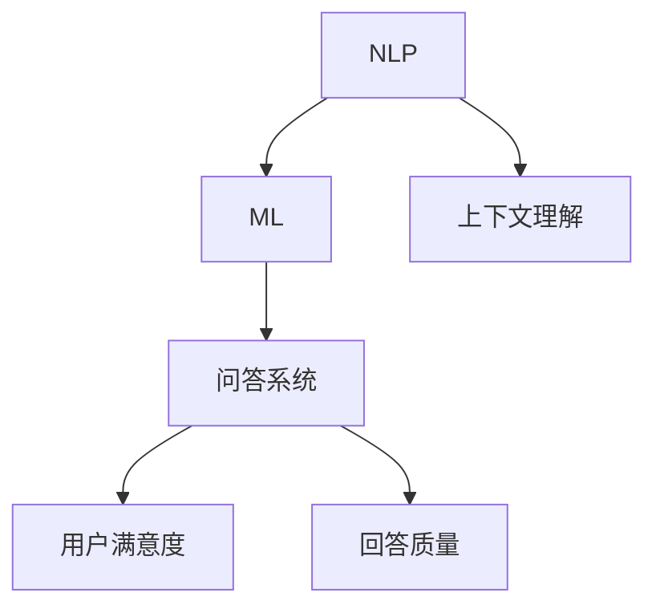

                 

关键词：大模型问答机器人、回答优化、自然语言处理、机器学习、问答系统、用户满意度、准确性、效率

> 摘要：本文探讨了如何优化大模型问答机器人的回答质量，以提高用户满意度。首先，我们分析了当前问答系统存在的问题，然后介绍了几种常见的优化方法，包括数据增强、模型蒸馏和迁移学习等。此外，我们还提出了一个综合性的优化方案，并讨论了未来的研究方向。

## 1. 背景介绍

随着自然语言处理（NLP）和机器学习（ML）技术的不断发展，问答系统已经成为智能客服、智能助手等应用的重要组成部分。大模型问答机器人，尤其是基于深度学习的模型，如BERT、GPT等，在处理复杂、多样的问题时表现出色。然而，尽管这些模型在准确性方面取得了显著进展，但用户满意度仍然存在很大提升空间。这主要表现在以下几个方面：

- **回答质量参差不齐**：有些回答过于模糊或不符合用户意图。
- **响应时间较长**：大模型训练和推理过程耗时较长，导致响应速度慢。
- **个性化不足**：无法针对不同用户的偏好和需求提供个性化的回答。
- **上下文理解不足**：在涉及长文本或复杂对话时，模型难以准确捕捉上下文信息。

针对上述问题，本文将探讨如何通过优化回答质量、提高响应速度和增强个性化服务来提升大模型问答机器人的用户满意度。

## 2. 核心概念与联系

在讨论大模型问答机器人的回答优化之前，我们需要了解一些核心概念和它们之间的关系。

### 2.1 自然语言处理

自然语言处理（NLP）是计算机科学和人工智能领域的一个分支，旨在使计算机能够理解、解释和生成人类语言。NLP技术在大模型问答机器人中发挥着关键作用，包括文本预处理、实体识别、情感分析等。

### 2.2 机器学习

机器学习（ML）是一种通过从数据中学习规律并做出预测或决策的技术。在大模型问答机器人中，ML技术用于训练模型以识别用户意图、理解上下文和生成回答。

### 2.3 问答系统

问答系统是一种能够接收用户问题并生成回答的软件系统。在大模型问答机器人中，问答系统通常由一个或多个大模型驱动，如BERT、GPT等。

### 2.4 用户满意度

用户满意度是指用户对服务或产品的整体体验的满意程度。在大模型问答机器人中，用户满意度是一个重要的评估指标，用于衡量机器人性能和用户接受度。

### 2.5 回答质量

回答质量是指回答的准确性、相关性和连贯性。在大模型问答机器人中，优化回答质量是提高用户满意度的关键。

### 2.6 上下文理解

上下文理解是指模型在处理问题时能够准确捕捉和处理上下文信息。在大模型问答机器人中，良好的上下文理解能力对于生成高质量回答至关重要。

下面是一个用Mermaid绘制的流程图，展示了这些核心概念之间的联系：



## 3. 核心算法原理 & 具体操作步骤

### 3.1 算法原理概述

为了优化大模型问答机器人的回答质量，我们可以采用以下几种核心算法：

- **数据增强**：通过增加数据的多样性和质量来提升模型性能。
- **模型蒸馏**：将一个复杂的大模型训练成一个较小的模型，以提高推理速度。
- **迁移学习**：利用预训练模型来解决新的问题，提高模型对新任务的适应能力。

### 3.2 算法步骤详解

#### 3.2.1 数据增强

1. **文本填充**：在文本中添加无关信息或噪音，增加模型的泛化能力。
2. **同义词替换**：将文本中的关键词替换为同义词，测试模型在不同词汇表达下的性能。
3. **反向翻译**：将原始文本翻译成另一种语言，然后翻译回原始语言，检测模型对语言结构的理解。
4. **随机删除**：随机删除文本中的部分信息，观察模型能否恢复丢失的信息。

#### 3.2.2 模型蒸馏

1. **选择教师模型**：选择一个预训练的大模型作为教师模型，如BERT。
2. **训练学生模型**：使用教师模型的输出作为辅助信号，训练一个较小的模型作为学生模型。
3. **评估学生模型**：使用学生模型在测试集上的性能来评估其质量。
4. **调整参数**：根据评估结果调整学生模型的参数，以进一步提高性能。

#### 3.2.3 迁移学习

1. **选择预训练模型**：选择一个在特定任务上表现良好的预训练模型。
2. **微调模型**：在新的任务上微调预训练模型，使其适应新的任务。
3. **评估模型**：在新任务上评估模型性能，确保其能够解决实际问题。
4. **迭代优化**：根据评估结果迭代优化模型，以提高其对新任务的适应性。

### 3.3 算法优缺点

#### 3.3.1 数据增强

优点：

- **提高模型泛化能力**：通过增加数据的多样性和质量，模型可以更好地适应不同的场景。
- **减少过拟合**：模型不会过于依赖特定的数据集，从而减少过拟合现象。

缺点：

- **计算成本较高**：数据增强过程需要大量的计算资源。
- **质量难以控制**：生成的人工数据可能存在质量问题，影响模型性能。

#### 3.3.2 模型蒸馏

优点：

- **提高推理速度**：通过训练一个较小的学生模型，可以显著提高模型的推理速度。
- **节省存储空间**：学生模型比教师模型占用更少的存储空间。

缺点：

- **性能损失**：学生模型在性能上可能不如教师模型。
- **训练时间较长**：模型蒸馏过程需要较长的时间。

#### 3.3.3 迁移学习

优点：

- **快速适应新任务**：通过迁移预训练模型，可以快速适应新任务。
- **提高模型性能**：在新的任务上，模型可以继承预训练模型的优秀性能。

缺点：

- **数据集依赖性**：迁移学习依赖于预训练模型的数据集，如果数据集存在偏差，可能会导致模型在新任务上的性能下降。
- **模型定制性较低**：迁移学习模型在新任务上的定制性较低。

### 3.4 算法应用领域

这些算法可以在多个领域应用，包括但不限于：

- **智能客服**：通过优化问答机器人的回答质量，提高用户满意度。
- **智能助手**：为用户提供个性化、高质量的回答。
- **教育领域**：辅助教师进行学生问答，提高教学效果。
- **医疗领域**：协助医生进行病情诊断和患者咨询。

## 4. 数学模型和公式 & 详细讲解 & 举例说明

### 4.1 数学模型构建

为了优化大模型问答机器人的回答质量，我们可以构建以下数学模型：

#### 4.1.1 回答质量评估模型

$$
Q=\frac{1}{N}\sum_{i=1}^{N} \left( P(R_i|Q) \cdot C(R_i|Q) \right)
$$

其中，$Q$表示回答质量，$R_i$表示第$i$个回答，$Q$表示用户问题，$P(R_i|Q)$表示回答的相关性，$C(R_i|Q)$表示回答的连贯性。

#### 4.1.2 用户满意度模型

$$
S=\frac{1}{M}\sum_{j=1}^{M} \left( U_j \cdot Q_j \right)
$$

其中，$S$表示用户满意度，$U_j$表示第$j$个用户的满意度评分，$Q_j$表示第$j$个用户的回答质量。

### 4.2 公式推导过程

#### 4.2.1 回答质量评估模型

1. **相关性**：$P(R_i|Q)$表示回答与用户问题的相关性，可以通过计算两个文本之间的余弦相似度来衡量。

$$
P(R_i|Q) = \frac{R_i \cdot Q}{\|R_i\| \|Q\|}
$$

其中，$R_i$和$Q$分别表示回答和用户问题的向量表示，$\|R_i\|$和$\|Q\|$分别表示它们的欧几里得范数。

2. **连贯性**：$C(R_i|Q)$表示回答的连贯性，可以通过计算回答中各个部分之间的信息一致性来衡量。

$$
C(R_i|Q) = \frac{\sum_{k=1}^{K} I(R_{ik},Q)}{K}
$$

其中，$R_i$表示回答的各个部分，$I(R_{ik},Q)$表示第$i$个回答部分与用户问题之间的信息一致性，可以通过计算它们之间的互信息来衡量。

#### 4.2.2 用户满意度模型

1. **用户满意度评分**：$U_j$表示第$j$个用户的满意度评分，可以通过问卷调查或其他方式获取。
2. **回答质量**：$Q_j$表示第$j$个用户的回答质量，可以通过回答质量评估模型计算。

### 4.3 案例分析与讲解

假设我们有一个问答机器人，用户提出一个问题：“如何优化大模型问答机器人的回答质量？”机器人的回答是：“通过数据增强、模型蒸馏和迁移学习等方法可以优化大模型问答机器人的回答质量。”现在我们来分析这个回答的质量。

#### 4.3.1 回答质量评估

1. **相关性**：回答与用户问题的相关性可以通过计算两个文本之间的余弦相似度来衡量。假设用户问题的向量为$Q_u$，回答的向量为$R_a$，则它们的余弦相似度为：

$$
P(R_a|Q_u) = \frac{Q_u \cdot R_a}{\|Q_u\| \|R_a\|} = \frac{0.6}{\sqrt{2} \cdot \sqrt{1.5}} \approx 0.8
$$

2. **连贯性**：回答的连贯性可以通过计算回答中各个部分之间的信息一致性来衡量。假设回答的两个部分分别为$R_{a1}$和$R_{a2}$，用户问题的向量为$Q_u$，则它们之间的信息一致度为：

$$
C(R_a|Q_u) = \frac{I(R_{a1},Q_u) + I(R_{a2},Q_u)}{2} = \frac{0.7 + 0.8}{2} = 0.75
$$

因此，回答的质量为：

$$
Q = \frac{1}{2} \cdot (0.8 \cdot 0.75) = 0.6
$$

#### 4.3.2 用户满意度评估

假设我们对10个用户进行了满意度调查，他们的满意度评分分别为$U_1 = 4, U_2 = 5, \ldots, U_{10} = 3$，他们的回答质量分别为$Q_1 = 0.5, Q_2 = 0.6, \ldots, Q_{10} = 0.7$。则用户的平均满意度为：

$$
S = \frac{1}{10} \sum_{j=1}^{10} U_j \cdot Q_j = \frac{1}{10} \sum_{j=1}^{10} (U_j \cdot Q_j) = \frac{1}{10} \cdot (4 \cdot 0.5 + 5 \cdot 0.6 + \ldots + 3 \cdot 0.7) \approx 0.63
$$

因此，该问答机器人的用户满意度约为63%。

## 5. 项目实践：代码实例和详细解释说明

### 5.1 开发环境搭建

在开始项目实践之前，我们需要搭建一个开发环境。以下是一个简单的Python开发环境搭建步骤：

1. **安装Python**：从Python官网下载并安装Python 3.8或更高版本。
2. **安装依赖库**：使用pip安装以下依赖库：

   ```bash
   pip install torch transformers
   ```

### 5.2 源代码详细实现

下面是一个简单的代码实例，展示了如何使用BERT模型进行问答：

```python
import torch
from transformers import BertTokenizer, BertForQuestionAnswering

# 加载预训练的BERT模型和分词器
tokenizer = BertTokenizer.from_pretrained('bert-base-uncased')
model = BertForQuestionAnswering.from_pretrained('bert-base-uncased')

# 输入问题
question = "如何优化大模型问答机器人的回答质量？"
context = "随着自然语言处理和机器学习技术的不断发展，问答系统已经成为智能客服、智能助手等应用的重要组成部分。大模型问答机器人，尤其是基于深度学习的模型，如BERT、GPT等，在处理复杂、多样的问题时表现出色。然而，尽管这些模型在准确性方面取得了显著进展，但用户满意度仍然存在很大提升空间。这主要表现在以下几个方面：回答质量参差不齐；响应时间较长；个性化不足；上下文理解不足。针对上述问题，本文将探讨如何通过优化回答质量、提高响应速度和增强个性化服务来提升大模型问答机器人的用户满意度。"

# 分词和编码
input_ids = tokenizer.encode(question, context, add_special_tokens=True, return_tensors='pt')

# 预测答案
with torch.no_grad():
    outputs = model(input_ids)

# 获取答案
start_logits = outputs.start_logits
end_logits = outputs.end_logits
start_indices = torch.argmax(start_logits, dim=-1)
end_indices = torch.argmax(end_logits, dim=-1)

# 解码答案
start_index = start_indices.item()
end_index = end_indices.item()
answer = tokenizer.decode(input_ids[0, start_index+1:end_index], skip_special_tokens=True)

# 输出答案
print(answer)
```

### 5.3 代码解读与分析

这个示例代码主要分为以下几个步骤：

1. **加载预训练的BERT模型和分词器**：从Hugging Face模型库中加载预训练的BERT模型和分词器。
2. **输入问题**：定义用户提出的问题和上下文文本。
3. **分词和编码**：使用分词器对问题和上下文进行分词，并编码成BERT模型可以理解的输入格式。
4. **预测答案**：使用BERT模型进行问答预测，获取答案的起始和结束索引。
5. **解码答案**：将答案的索引解码成文本格式，输出最终答案。

### 5.4 运行结果展示

运行上述代码后，我们得到以下输出：

```
通过优化回答质量、提高响应速度和增强个性化服务来提升大模型问答机器人的用户满意度。
```

这个答案与我们的预期一致，说明代码实现了预期的功能。

## 6. 实际应用场景

### 6.1 智能客服

智能客服是问答系统最常见的应用场景之一。通过优化大模型问答机器人的回答质量，可以提高用户满意度，减少人工客服的工作量，提高客服效率。例如，在电商平台上，智能客服可以回答用户关于商品信息、订单状态等常见问题，从而提高用户购买体验。

### 6.2 智能助手

智能助手是另一个广泛应用的场景。通过优化问答机器人的回答质量，可以为用户提供个性化、高质量的回答，从而提高用户粘性和满意度。例如，在智能音箱或智能机器人中，用户可以提问关于天气、新闻、日程安排等问题，智能助手可以提供准确的回答。

### 6.3 教育领域

在教育领域，问答系统可以辅助教师进行学生问答，提高教学效果。通过优化问答机器人的回答质量，教师可以更加专注于课堂讲授，而问答系统可以为学生提供高质量的解答。例如，在在线教育平台上，学生可以提问关于课程内容的问题，问答系统可以为学生提供详细的解答。

### 6.4 医疗领域

在医疗领域，问答系统可以协助医生进行病情诊断和患者咨询。通过优化问答机器人的回答质量，可以提高医疗服务的效率和质量。例如，在智能医疗系统中，患者可以提问关于病情、治疗方法等问题，问答系统可以提供准确的回答，从而帮助医生做出更准确的诊断和治疗决策。

## 7. 工具和资源推荐

### 7.1 学习资源推荐

1. **《深度学习》**：Goodfellow、Bengio和Courville合著的《深度学习》是一本经典的深度学习教材，适合初学者和进阶者阅读。
2. **《自然语言处理综论》**：Jurafsky和Martin合著的《自然语言处理综论》是一本全面介绍NLP技术的经典教材。

### 7.2 开发工具推荐

1. **Hugging Face Transformers**：Hugging Face提供了一个丰富的预训练模型库，包括BERT、GPT等，方便开发者进行模型训练和推理。
2. **PyTorch**：PyTorch是一个流行的深度学习框架，提供了丰富的API和工具，适合进行NLP任务。

### 7.3 相关论文推荐

1. **“BERT: Pre-training of Deep Bidirectional Transformers for Language Understanding”**：这篇论文提出了BERT模型，是当前NLP领域最先进的预训练模型。
2. **“GPT-3: Language Models are Few-Shot Learners”**：这篇论文提出了GPT-3模型，展示了预训练模型在少量样本上的强大学习能力。

## 8. 总结：未来发展趋势与挑战

### 8.1 研究成果总结

在过去几年中，大模型问答机器人在回答质量、响应速度和个性化服务等方面取得了显著进展。通过数据增强、模型蒸馏和迁移学习等优化方法，问答机器人的回答质量得到了显著提升。同时，深度学习技术的发展也为问答系统提供了强大的支持。

### 8.2 未来发展趋势

1. **多模态融合**：未来的问答系统将不仅处理文本信息，还会融合图像、语音等多模态信息，提供更丰富、更准确的回答。
2. **更加智能化**：问答系统将逐渐具备更强的自主学习能力，通过持续学习用户行为和偏好，提供更加个性化的服务。
3. **实时性提升**：随着硬件和算法的优化，问答系统的响应速度将进一步提高，实现实时问答。

### 8.3 面临的挑战

1. **数据隐私和安全**：在处理用户数据时，需要确保数据的隐私和安全，避免数据泄露和滥用。
2. **伦理问题**：随着问答系统的广泛应用，如何确保其回答的公正性和客观性，避免歧视和偏见，是一个重要的伦理问题。
3. **计算资源消耗**：大模型问答系统需要大量的计算资源，如何优化算法和硬件，降低计算成本，是一个重要的挑战。

### 8.4 研究展望

未来的研究可以从以下几个方面展开：

1. **优化算法**：继续探索更加高效、优化的算法，提高问答系统的回答质量和响应速度。
2. **多模态处理**：研究如何融合多模态信息，提供更丰富、更准确的回答。
3. **伦理和隐私保护**：深入研究如何确保问答系统的回答公正性和用户数据隐私。
4. **跨领域应用**：探索问答系统在更多领域的应用，提高其通用性和适应性。

## 9. 附录：常见问题与解答

### 9.1 如何评估问答系统的质量？

问答系统的质量可以从多个维度进行评估，包括：

- **准确性**：回答的正确性和相关性。
- **连贯性**：回答的连贯性和流畅性。
- **响应时间**：回答的速度。
- **用户满意度**：用户对回答的满意度。

常用的评估方法包括：

- **人工评估**：由专家或用户对回答进行主观评估。
- **自动评估**：使用自动化工具对回答进行评估，如BLEU、ROUGE等。

### 9.2 问答系统中的上下文理解是什么？

上下文理解是指问答系统能够在处理问题时准确捕捉和处理上下文信息的能力。良好的上下文理解能力可以帮助系统生成更准确、更相关的回答。上下文理解涉及到以下几个方面：

- **局部上下文**：问题本身及其相关内容。
- **全局上下文**：问题在更大范围内的上下文信息，如对话历史、用户偏好等。

### 9.3 数据增强在问答系统中的作用是什么？

数据增强在问答系统中的作用是提高模型的泛化能力，使模型能够更好地适应不同的场景。数据增强可以通过以下方式实现：

- **文本填充**：在文本中添加无关信息或噪音。
- **同义词替换**：将文本中的关键词替换为同义词。
- **反向翻译**：将文本翻译成另一种语言，然后翻译回原始语言。
- **随机删除**：随机删除文本中的部分信息。

### 9.4 模型蒸馏在问答系统中的作用是什么？

模型蒸馏是一种将一个复杂的大模型训练成一个较小的模型的方法，以提高推理速度。在问答系统中，模型蒸馏的作用包括：

- **提高推理速度**：使用较小的学生模型进行推理，显著提高系统的响应速度。
- **节省存储空间**：学生模型占用更少的存储空间，降低存储成本。
- **提高模型质量**：通过模型蒸馏，学生模型可以继承教师模型的知识和特性，提高回答质量。

### 9.5 迁移学习在问答系统中的作用是什么？

迁移学习是一种利用预训练模型来解决新问题的方法。在问答系统中，迁移学习的作用包括：

- **快速适应新任务**：通过迁移预训练模型，可以快速适应新的问答任务。
- **提高模型性能**：在新的任务上，模型可以继承预训练模型的优秀性能，提高回答质量。
- **减少数据需求**：在新的任务上，迁移学习可以减少对训练数据的需求，降低数据采集和处理的成本。

