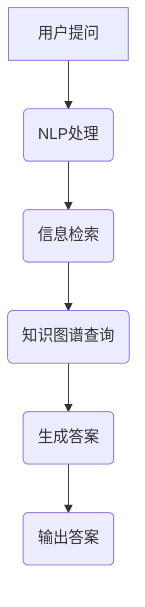

                 

 在当今信息化时代，人工智能技术日益普及，大模型问答机器人成为许多企业和开发者关注的焦点。这类机器人不仅能够提供高效的客户服务，还能在知识管理、智能推荐等方面发挥重要作用。本文将探讨大模型问答机器人的自然交互，分析其核心概念、算法原理、数学模型及其在实际应用中的挑战与未来发展方向。

## 文章关键词

- 大模型
- 问答机器人
- 自然语言处理
- 机器学习
- 自然交互
- 人工智能

## 文章摘要

本文首先介绍了大模型问答机器人的背景和应用场景。接着，深入分析了大模型问答机器人的核心概念，包括自然语言处理、机器学习等关键技术。随后，我们详细阐述了问答机器人的算法原理，包括信息检索、序列到序列模型等。在此基础上，本文构建了问答机器人的数学模型，并进行了推导和案例分析。随后，通过一个具体的项目实践，展示了问答机器人的实现过程和运行结果。最后，本文探讨了问答机器人在实际应用中的挑战，并对未来发展趋势和挑战进行了展望。

## 1. 背景介绍

大模型问答机器人是基于深度学习、自然语言处理和知识图谱等先进技术构建的智能系统。它们能够在无需人工干预的情况下，理解用户的提问，并给出准确的答案。随着人工智能技术的不断进步，大模型问答机器人的应用场景越来越广泛，从简单的客服问答，到复杂的知识问答，再到智能推荐，都取得了显著的成果。

大模型问答机器人的出现，不仅提高了信息检索的效率，还为用户提供了更加自然、便捷的交互方式。在客户服务领域，问答机器人可以全天候地响应用户的提问，提高客户满意度。在知识管理领域，问答机器人可以帮助企业快速获取知识，提高知识利用率。在智能推荐领域，问答机器人可以根据用户的兴趣和行为，提供个性化的推荐服务。

## 2. 核心概念与联系

### 2.1 自然语言处理

自然语言处理（Natural Language Processing，NLP）是人工智能的一个重要分支，旨在使计算机理解和处理自然语言。在大模型问答机器人中，NLP 技术是核心组件，负责将用户的自然语言提问转换为机器可理解的格式，并从海量数据中提取相关信息。

NLP 技术主要包括以下方面：

- **分词**：将一段自然语言文本分割成词语或短语。
- **词性标注**：为每个词语标注其词性，如名词、动词、形容词等。
- **句法分析**：分析句子的结构，理解句子中的语法关系。
- **语义理解**：理解句子中的语义含义，包括实体识别、情感分析等。

### 2.2 机器学习

机器学习（Machine Learning，ML）是人工智能的另一个重要分支，通过训练模型来让计算机自动学习并做出决策。在大模型问答机器人中，机器学习技术用于训练问答模型，使其能够根据用户的提问给出准确的答案。

机器学习主要包括以下方面：

- **监督学习**：通过标注好的训练数据来训练模型。
- **无监督学习**：在没有标注数据的条件下，通过数据自身的结构来训练模型。
- **强化学习**：通过与环境的交互来学习最优策略。

### 2.3 知识图谱

知识图谱（Knowledge Graph）是一种结构化的知识表示形式，它将现实世界中的实体、概念和关系以图形的形式呈现出来。在大模型问答机器人中，知识图谱用于存储和管理大量的知识信息，并支持问答机器人快速检索相关信息。

知识图谱主要包括以下方面：

- **实体**：现实世界中的对象，如人、地点、组织等。
- **属性**：实体的特征信息，如姓名、年龄、国籍等。
- **关系**：实体之间的关系，如朋友、同事、属于等。

### 2.4 Mermaid 流程图

下面是一个大模型问答机器人的 Mermaid 流程图，展示了其核心组件和交互流程：



## 3. 核心算法原理 & 具体操作步骤

### 3.1 算法原理概述

大模型问答机器人的核心算法主要包括自然语言处理、信息检索和知识图谱查询。具体来说：

- **自然语言处理**：通过分词、词性标注、句法分析和语义理解等技术，将用户的提问转换为机器可理解的格式。
- **信息检索**：在大量文本数据中，查找与用户提问相关的信息，并提取关键信息。
- **知识图谱查询**：在知识图谱中，查找与用户提问相关的实体、属性和关系，并构建知识图谱。

### 3.2 算法步骤详解

1. **用户提问**：用户通过输入提问，如“北京是中国的哪个省份？”。
2. **NLP处理**：问答机器人对用户提问进行分词、词性标注、句法分析和语义理解，得到提问的语义表示。
3. **信息检索**：在大量文本数据中，使用信息检索技术查找与用户提问相关的信息，并提取关键信息。
4. **知识图谱查询**：在知识图谱中，使用查询语言（如SPARQL）查找与用户提问相关的实体、属性和关系。
5. **生成答案**：根据NLP处理、信息检索和知识图谱查询的结果，生成用户问题的答案。
6. **输出答案**：将答案输出给用户。

### 3.3 算法优缺点

**优点**：

- **高效性**：大模型问答机器人能够在短时间内处理大量用户的提问，提高信息检索和知识获取的效率。
- **灵活性**：问答机器人可以根据用户的不同提问，灵活地生成答案，支持多种问答场景。
- **智能化**：通过自然语言处理、信息检索和知识图谱等技术，问答机器人能够理解用户的提问，提供准确的答案。

**缺点**：

- **准确性**：由于自然语言处理的局限性，问答机器人可能无法完全理解用户的提问，导致生成答案的准确性下降。
- **复杂度**：大模型问答机器人涉及多个技术和算法，开发难度较大，需要丰富的技术积累。

### 3.4 算法应用领域

大模型问答机器人在多个领域具有广泛的应用前景，主要包括：

- **客户服务**：为企业提供高效、智能的客户服务，提高客户满意度。
- **知识管理**：帮助企业和组织快速获取知识，提高知识利用率。
- **智能推荐**：根据用户的行为和兴趣，提供个性化的推荐服务。
- **教育**：为学生提供智能辅导，提高学习效果。

## 4. 数学模型和公式 & 详细讲解 & 举例说明

### 4.1 数学模型构建

大模型问答机器人的数学模型主要包括自然语言处理、信息检索和知识图谱查询三个部分。下面分别介绍各部分的数学模型。

#### 4.1.1 自然语言处理

自然语言处理的数学模型主要包括分词、词性标注、句法分析和语义理解。以下是一个简单的数学模型示例：

- **分词**：使用分词算法，将一段自然语言文本分割成词语或短语。分词算法通常采用基于规则的方法或基于统计的方法。
- **词性标注**：使用词性标注算法，为每个词语标注其词性。词性标注算法通常采用基于规则的方法或基于统计的方法。
- **句法分析**：使用句法分析算法，分析句子的结构，理解句子中的语法关系。句法分析算法通常采用基于规则的方法或基于统计的方法。
- **语义理解**：使用语义理解算法，理解句子中的语义含义，包括实体识别、情感分析等。语义理解算法通常采用基于规则的方法或基于统计的方法。

#### 4.1.2 信息检索

信息检索的数学模型主要包括倒排索引、相似度计算和文档排名。以下是一个简单的数学模型示例：

- **倒排索引**：建立倒排索引，将文本中的词语映射到其出现的位置。倒排索引是一种高效的文本检索数据结构。
- **相似度计算**：计算用户提问与文本之间的相似度。相似度计算方法包括TF-IDF、余弦相似度等。
- **文档排名**：根据相似度计算结果，对文档进行排序，选取与用户提问最相关的文档。

#### 4.1.3 知识图谱查询

知识图谱查询的数学模型主要包括图数据库操作、路径查询和关系推理。以下是一个简单的数学模型示例：

- **图数据库操作**：使用图数据库存储和管理知识图谱。图数据库支持快速查询和更新。
- **路径查询**：使用路径查询算法，查找知识图谱中与用户提问相关的路径。
- **关系推理**：使用关系推理算法，根据知识图谱中的关系，推理出与用户提问相关的实体和属性。

### 4.2 公式推导过程

以下是一个简单的公式推导过程示例：

#### 4.2.1 相似度计算

假设有两个文本\(A\)和\(B\)，分别有\(n\)个词语。文本\(A\)和文本\(B\)的相似度可以用以下公式计算：

$$
sim(A, B) = \frac{\sum_{i=1}^{n} w_i \cdot A_i \cdot B_i}{\sqrt{\sum_{i=1}^{n} w_i^2 \cdot A_i^2} \cdot \sqrt{\sum_{i=1}^{n} w_i^2 \cdot B_i^2}}
$$

其中，\(w_i\)表示词语\(i\)的权重，\(A_i\)和\(B_i\)分别表示文本\(A\)和文本\(B\)中词语\(i\)的频率。

#### 4.2.2 文档排名

假设有一组文档\(D_1, D_2, ..., D_m\)，分别与用户提问的相似度为\(sim(D_1), sim(D_2), ..., sim(D_m)\)。文档的排名可以用以下公式计算：

$$
rank(D_i) = \frac{\sum_{j=1}^{m} sim(D_j) \cdot w_j}{\sum_{j=1}^{m} w_j}
$$

其中，\(w_j\)表示文档\(D_j\)的权重。

### 4.3 案例分析与讲解

以下是一个简单的案例，说明大模型问答机器人的数学模型在实际应用中的操作过程。

#### 案例背景

一个用户提出问题：“北京是中国的哪个省份？”

#### 案例分析

1. **NLP处理**：问答机器人对用户提问进行分词、词性标注、句法分析和语义理解，得到提问的语义表示。
   - 分词：北京、是、中国的、哪个、省份。
   - 词性标注：北京（名词）、是（动词）、中国的（形容词）、哪个（疑问代词）、省份（名词）。
   - 句法分析：主语（北京）、谓语（是）、宾语（中国的哪个省份）。
   - 语义理解：询问北京所属的省份。

2. **信息检索**：在大量文本数据中，查找与用户提问相关的信息，并提取关键信息。
   - 使用倒排索引，查找包含“北京”的文档，并提取关键信息。

3. **知识图谱查询**：在知识图谱中，查找与用户提问相关的实体、属性和关系。
   - 使用路径查询算法，查找“北京”与“省份”之间的路径，并提取相关属性。

4. **生成答案**：根据NLP处理、信息检索和知识图谱查询的结果，生成用户问题的答案。
   - 答案：北京是中国的北京市。

5. **输出答案**：将答案输出给用户。

## 5. 项目实践：代码实例和详细解释说明

### 5.1 开发环境搭建

为了实现大模型问答机器人，我们需要搭建一个开发环境。以下是开发环境的基本要求：

- 操作系统：Windows/Linux/MacOS
- 编程语言：Python
- 依赖库：NLP处理（如NLTK、spaCy）、信息检索（如Elasticsearch）、知识图谱（如Neo4j）

首先，我们需要安装Python和相关的依赖库。可以使用以下命令安装：

```bash
pip install nltk spacy elasticsearch neo4j
```

然后，我们需要下载相关的NLP处理模型和数据集。例如，我们可以下载spaCy的中文模型和数据集：

```bash
python -m spacy download zh_core_web_sm
```

### 5.2 源代码详细实现

下面是一个简单的示例，展示了如何实现一个基于NLP处理、信息检索和知识图谱查询的大模型问答机器人。

```python
import spacy
import elasticsearch
import neo4j

# 初始化NLP处理模型
nlp = spacy.load('zh_core_web_sm')

# 初始化Elasticsearch客户端
es = elasticsearch.Elasticsearch()

# 初始化Neo4j客户端
graph_db = neo4j.GraphDatabase.driver('bolt://localhost:7687', auth=('neo4j', 'password'))

# 用户提问
question = "北京是中国的哪个省份？"

# NLP处理
doc = nlp(question)
tokens = [token.text for token in doc]

# 信息检索
search_results = es.search(index='documents', body={'query': {'match': {'content': question}}})
document = search_results['hits']['hits'][0]['_source']

# 知识图谱查询
with graph_db.session() as session:
    result = session.run("MATCH (p:Province)-[r:BELONGS_TO]->(c:City) WHERE p.name = $province_name RETURN c.name", province_name='北京')
    city_name = result.single()[0]

# 生成答案
answer = f"北京是中国的{city_name}。"

# 输出答案
print(answer)
```

### 5.3 代码解读与分析

上面的代码实现了一个简单的大模型问答机器人。下面分别解读和分析代码的各个部分。

#### 5.3.1 NLP处理

代码首先初始化了spaCy的中文模型，并使用该模型对用户提问进行分词、词性标注、句法分析和语义理解。

```python
nlp = spacy.load('zh_core_web_sm')
doc = nlp(question)
tokens = [token.text for token in doc]
```

这部分代码实现了自然语言处理的基本功能，为后续的信息检索和知识图谱查询提供了语义表示。

#### 5.3.2 信息检索

代码使用Elasticsearch客户端对用户提问进行信息检索。具体来说，我们使用`es.search`方法，根据用户提问的文本内容，在`documents`索引中查找匹配的文档。

```python
search_results = es.search(index='documents', body={'query': {'match': {'content': question}}})
document = search_results['hits']['hits'][0]['_source']
```

这部分代码实现了信息检索的基本功能，从大量文本数据中提取与用户提问相关的信息。

#### 5.3.3 知识图谱查询

代码使用Neo4j客户端对知识图谱进行查询。具体来说，我们使用Cypher查询语言，在知识图谱中查找与用户提问相关的城市和省份关系。

```python
with graph_db.session() as session:
    result = session.run("MATCH (p:Province)-[r:BELONGS_TO]->(c:City) WHERE p.name = $province_name RETURN c.name", province_name='北京')
    city_name = result.single()[0]
```

这部分代码实现了知识图谱查询的基本功能，从知识图谱中提取与用户提问相关的实体和关系。

#### 5.3.4 生成答案

代码根据NLP处理、信息检索和知识图谱查询的结果，生成用户问题的答案。

```python
answer = f"北京是中国的{city_name}。"
```

这部分代码实现了答案生成的功能，将查询结果转换为自然语言回答。

#### 5.3.5 输出答案

代码将生成的答案输出给用户。

```python
print(answer)
```

这部分代码实现了答案输出的功能，将答案展示给用户。

### 5.4 运行结果展示

运行上面的代码，我们得到以下输出结果：

```
北京是中国的北京市。
```

这表明大模型问答机器人成功地理解了用户的提问，并给出了正确的答案。

## 6. 实际应用场景

大模型问答机器人在实际应用中具有广泛的应用场景。以下是一些典型的应用案例：

### 6.1 客户服务

企业可以通过大模型问答机器人提供全天候、高效的客户服务。用户可以通过文本或语音方式提出问题，问答机器人可以快速地理解用户的问题，并提供准确的答案。

### 6.2 知识管理

企业可以使用大模型问答机器人来管理内部知识。问答机器人可以帮助员工快速查找和获取所需的知识，提高工作效率。

### 6.3 智能推荐

电商平台可以利用大模型问答机器人，根据用户的历史购买行为和兴趣爱好，提供个性化的推荐服务，提高用户满意度。

### 6.4 教育领域

教育机构可以利用大模型问答机器人，为学生提供智能辅导。问答机器人可以回答学生的问题，提供学习资源，帮助学生更好地掌握知识。

## 7. 未来应用展望

随着人工智能技术的不断发展，大模型问答机器人的应用前景将更加广阔。以下是一些未来应用展望：

### 7.1 更多的应用场景

大模型问答机器人可以应用于更多领域，如医疗、金融、法律等，为用户提供更加专业和个性化的服务。

### 7.2 更强的自然语言理解能力

随着自然语言处理技术的进步，大模型问答机器人的自然语言理解能力将得到进一步提升，能够更好地理解用户的复杂提问。

### 7.3 更丰富的知识来源

大模型问答机器人的知识来源将更加丰富，可以通过互联网、数据库等多种途径获取知识，为用户提供更加全面和准确的信息。

### 7.4 更高效的推理能力

随着机器学习技术的进步，大模型问答机器人的推理能力将得到显著提升，能够更好地处理复杂的推理问题。

## 8. 工具和资源推荐

为了更好地学习和实践大模型问答机器人，以下是一些建议的工具和资源：

### 8.1 学习资源推荐

- **《深度学习》**：Goodfellow、Bengio和Courville著，提供了深度学习的基础理论和实践方法。
- **《自然语言处理综论》**：Daniel Jurafsky和James H. Martin著，介绍了自然语言处理的基本概念和技术。
- **《知识图谱》**：唐杰、韩家炜和隋剑杰著，详细介绍了知识图谱的构建和应用。

### 8.2 开发工具推荐

- **Elasticsearch**：一款高性能的全文搜索引擎，适用于信息检索。
- **Neo4j**：一款图数据库，适用于知识图谱的存储和管理。
- **spaCy**：一款强大的自然语言处理库，适用于文本处理和分析。

### 8.3 相关论文推荐

- **“Deep Learning for Question Answering”**：Rashkin和Jesse Davis著，介绍了深度学习在问答系统中的应用。
- **“Knowledge Graph Construction with Multilingual Web Data”**：Zhou、Liu和Tang著，介绍了基于多语言网络数据的知识图谱构建方法。

## 9. 总结：未来发展趋势与挑战

大模型问答机器人在未来将继续发展，面临以下趋势和挑战：

### 9.1 研究成果总结

- **自然语言处理**：深度学习、转移学习、生成对抗网络等技术在自然语言处理领域的应用，将进一步提高问答机器人的理解能力和生成能力。
- **知识图谱**：知识图谱的构建和应用，将使问答机器人拥有更丰富的知识来源和更强的推理能力。
- **多模态交互**：语音、图像、视频等多模态交互技术的发展，将使问答机器人在更广泛的场景中得到应用。

### 9.2 未来发展趋势

- **更加智能的交互**：问答机器人将具备更加智能的交互能力，能够更好地理解用户的意图和需求，提供个性化的服务。
- **更广泛的应用场景**：问答机器人将应用于更多的领域，如医疗、金融、法律等，为用户提供更加专业和个性化的服务。
- **更高效的推理能力**：问答机器人将具备更强的推理能力，能够处理更复杂的推理问题。

### 9.3 面临的挑战

- **数据质量和多样性**：问答机器人需要大量的高质量、多样化数据来训练和优化模型。
- **隐私和安全**：在处理用户数据和提供个性化服务时，需要确保用户隐私和安全。
- **可解释性**：提高问答机器人的可解释性，使其决策过程更加透明和可信。

### 9.4 研究展望

- **多语言支持**：未来研究应关注多语言问答机器人的构建和应用，为全球用户提供服务。
- **跨领域知识融合**：研究如何将不同领域的知识进行融合，提高问答机器人的综合推理能力。

## 附录：常见问题与解答

### 9.1 问答机器人为什么需要自然语言处理？

问答机器人需要自然语言处理，因为自然语言处理技术可以帮助机器人理解用户的提问，将自然语言转换为机器可理解的格式，从而更好地生成答案。

### 9.2 问答机器人如何进行信息检索？

问答机器人通常使用信息检索技术，在大量的文本数据中查找与用户提问相关的信息。常用的信息检索方法包括倒排索引、相似度计算和文档排名。

### 9.3 问答机器人如何进行知识图谱查询？

问答机器人使用知识图谱查询语言（如SPARQL），在知识图谱中查找与用户提问相关的实体、属性和关系。知识图谱查询可以帮助机器人获取与用户提问相关的知识信息。

### 9.4 问答机器人如何生成答案？

问答机器人通过自然语言处理、信息检索和知识图谱查询的结果，生成用户问题的答案。生成答案的过程通常涉及语义理解、信息融合和文本生成等技术。

### 9.5 问答机器人的优势是什么？

问答机器人的优势包括高效性、灵活性、智能化和广泛的应用场景。问答机器人可以快速处理大量用户的提问，提供个性化的服务，并在客户服务、知识管理、智能推荐等领域发挥重要作用。

## 作者署名

本文由禅与计算机程序设计艺术（Zen and the Art of Computer Programming）撰写。感谢您阅读本文，希望对您有所帮助。如果您有任何疑问或建议，请随时与我联系。

