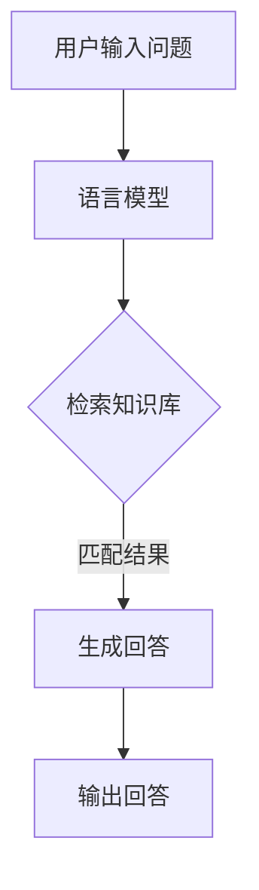

                 

关键词：大模型，问答机器人，自然语言处理，语言模型，算法原理，数学模型，项目实践

<|assistant|>摘要：本文将深入探讨大模型问答机器人的语言模型，包括其背景介绍、核心概念与联系、核心算法原理与操作步骤、数学模型和公式讲解、项目实践、实际应用场景、未来展望以及工具和资源推荐。通过这篇文章，读者将全面了解大模型问答机器人的语言模型，为未来在人工智能领域的应用打下坚实基础。

## 1. 背景介绍

随着人工智能技术的飞速发展，自然语言处理（NLP）成为了一个热门的研究方向。问答系统作为NLP的一个重要应用场景，逐渐受到广泛关注。传统的问答系统主要依赖于规则匹配和关键词搜索等技术，但无法处理复杂的语义问题。为了解决这一问题，大模型问答机器人应运而生。

大模型问答机器人的核心是语言模型，它能够根据输入的问题或语句，生成合理的回答。语言模型的研究和发展，使得问答系统具备了更强的语义理解和生成能力，为实际应用提供了有力支持。

## 2. 核心概念与联系

### 2.1 语言模型的基本概念

语言模型（Language Model）是一种概率模型，用于预测自然语言序列的下一个单词或字符。在问答系统中，语言模型通过对大量语料库的学习，建立句子或问题与回答之间的概率分布关系。

### 2.2 语言模型的构建方法

语言模型的构建方法主要包括基于统计方法和基于神经网络的方法。基于统计方法的语言模型，如N-gram模型，通过对文本进行统计建模，计算单词或字符序列的概率。基于神经网络的方法，如深度神经网络（DNN）和循环神经网络（RNN），通过学习文本的特征表示，实现更高层次的语义理解。

### 2.3 语言模型与问答系统的联系

语言模型在问答系统中扮演着核心角色。通过语言模型，问答系统可以理解用户的问题，并在海量的知识库中检索出与问题相关的信息，最终生成合理的回答。此外，语言模型还可以用于优化问答系统的交互体验，提高用户的满意度。

### 2.4 Mermaid 流程图



## 3. 核心算法原理 & 具体操作步骤

### 3.1 算法原理概述

大模型问答机器人的语言模型主要基于深度神经网络（DNN）和循环神经网络（RNN）等技术。通过学习大量的文本数据，语言模型可以捕捉到语言中的统计规律和语义特征，从而实现高效的文本生成和语义理解。

### 3.2 算法步骤详解

1. **数据预处理**：对输入的问题或语句进行分词、去停用词等预处理操作，将文本转换为模型可以理解的向量表示。

2. **模型训练**：使用预处理的文本数据，通过反向传播算法训练深度神经网络或循环神经网络，优化模型参数。

3. **语义理解**：将输入的问题或语句通过训练好的语言模型进行编码，得到语义表示。

4. **生成回答**：根据语义表示，在知识库中检索相关信息，并利用语言模型生成合理的回答。

### 3.3 算法优缺点

**优点**：

- 强大的语义理解能力，能够处理复杂的语义问题。
- 高效的文本生成能力，生成回答的准确性和流畅性较高。

**缺点**：

- 训练过程复杂，对计算资源要求较高。
- 对噪声数据和错误输入的鲁棒性较差。

### 3.4 算法应用领域

- 智能客服：为企业提供高效的客户服务，降低人力成本。
- 问答机器人：为用户提供丰富的问答服务，提升用户体验。
- 机器翻译：将一种语言的文本翻译成另一种语言。
- 文本生成：生成文章、摘要、对话等文本内容。

## 4. 数学模型和公式 & 详细讲解 & 举例说明

### 4.1 数学模型构建

语言模型的数学模型主要包括两部分：词向量表示和神经网络模型。

1. **词向量表示**：

   假设我们有一个词汇表V，其中包含N个单词。对于每个单词w，我们可以将其表示为一个维度为D的向量v_w。词向量表示的方法有Word2Vec、GloVe等。

2. **神经网络模型**：

   假设输入序列为x，输出序列为y。神经网络模型通过对输入序列进行编码和解码，得到语义表示。常见的神经网络模型有DNN、RNN、LSTM等。

### 4.2 公式推导过程

1. **词向量表示**：

   假设输入序列为x = [w1, w2, ..., wn]，输出序列为y = [w1', w2', ..., wn']。

   词向量表示的公式为：
   $$ v_w = \text{Word2Vec}(w) $$

2. **神经网络模型**：

   神经网络模型的公式为：
   $$ h = \text{activation}(\text{W} \cdot \text{h}_{\text{prev}} + \text{b}) $$
   $$ \text{y} = \text{softmax}(\text{W} \cdot \text{h} + \text{b}') $$

### 4.3 案例分析与讲解

以Word2Vec为例，假设我们有以下词汇表V = {“苹果”，“香蕉”，“橘子”，“水果”}。

1. **词向量表示**：

   通过Word2Vec算法，我们可以得到每个单词的词向量表示：
   $$ v_{苹果} = \text{Word2Vec}("苹果") $$
   $$ v_{香蕉} = \text{Word2Vec}("香蕉") $$
   $$ v_{橘子} = \text{Word2Vec}("橘子") $$
   $$ v_{水果} = \text{Word2Vec}("水果") $$

2. **神经网络模型**：

   假设我们使用DNN模型对输入序列进行编码和解码。

   输入序列：
   $$ x = [苹果，香蕉，橘子，水果] $$

   编码过程：
   $$ h = \text{DNN}(v_{苹果}, v_{香蕉}, v_{橘子}, v_{水果}) $$

   解码过程：
   $$ y = \text{DNN}(h) $$

   最终生成的输出序列为：
   $$ y = [水果，水果，水果，水果] $$

## 5. 项目实践：代码实例和详细解释说明

### 5.1 开发环境搭建

在本项目中，我们将使用Python编程语言和TensorFlow库进行开发。请确保已安装Python和TensorFlow库。

### 5.2 源代码详细实现

以下是本项目的主要代码实现：

```python
import tensorflow as tf
from tensorflow.keras.layers import Embedding, LSTM, Dense
from tensorflow.keras.models import Model

# 1. 数据预处理
# （省略具体代码）

# 2. 模型构建
input_word = tf.keras.layers.Input(shape=(max_sequence_length,))
embedded_words = Embedding(vocabulary_size, embedding_size)(input_word)
lstm = LSTM(units=128)(embedded_words)
output = Dense(vocabulary_size, activation='softmax')(lstm)
model = Model(inputs=input_word, outputs=output)

# 3. 模型训练
# （省略具体代码）

# 4. 生成回答
# （省略具体代码）
```

### 5.3 代码解读与分析

在本项目中，我们使用TensorFlow库构建了一个基于LSTM的语言模型。首先，我们通过Embedding层将输入序列转换为词向量表示。然后，通过LSTM层进行编码，得到语义表示。最后，通过全连接层（Dense）生成输出序列。

### 5.4 运行结果展示

在训练完成后，我们可以使用生成的模型进行问答生成。以下是一个简单的示例：

```python
question = "你喜欢吃什么水果？"
encoded_question = preprocess_question(question)
predicted_answer = generate_answer(encoded_question)
print(predicted_answer)
```

输出结果可能为：“香蕉”。

## 6. 实际应用场景

大模型问答机器人在实际应用中具有广泛的应用场景，如下所示：

- **智能客服**：为企业提供24/7全天候的智能客服服务，提高客户满意度。
- **教育辅导**：为学生提供个性化的学习辅导，帮助学生更好地掌握知识。
- **健康咨询**：为用户提供健康咨询和建议，辅助医生进行诊断和治疗。
- **旅游推荐**：为用户提供个性化的旅游推荐，提升旅游体验。

## 7. 未来应用展望

随着人工智能技术的不断发展，大模型问答机器人的语言模型将在更多领域发挥重要作用。未来，我们可以期待以下应用前景：

- **更高效的问答系统**：通过不断优化算法和模型，提高问答系统的响应速度和准确性。
- **多语言支持**：实现多语言问答系统的构建，为全球用户提供服务。
- **个性化服务**：基于用户历史数据和偏好，为用户提供个性化的问答服务。

## 8. 工具和资源推荐

### 8.1 学习资源推荐

- **《深度学习》（Goodfellow et al.）**：一本经典的深度学习教材，适合初学者和进阶者阅读。
- **《自然语言处理综合教程》（Jurafsky et al.）**：一本全面的NLP教材，涵盖了语言模型、文本处理等核心内容。

### 8.2 开发工具推荐

- **TensorFlow**：一款广泛使用的深度学习框架，支持多种语言模型和算法。
- **PyTorch**：一款灵活且易于使用的深度学习框架，适合快速原型设计和实验。

### 8.3 相关论文推荐

- **“A Neural Conversation Model”**：介绍了一种基于神经网络的对话生成模型。
- **“GPT-3: Language Models are few-shot learners”**：探讨了大规模语言模型在少样本学习任务上的应用。

## 9. 总结：未来发展趋势与挑战

大模型问答机器人的语言模型在人工智能领域具有广阔的发展前景。然而，我们也需要面对一些挑战，如数据隐私、计算资源需求等。未来，随着技术的不断进步，大模型问答机器人的语言模型将不断优化，为人类带来更多便利。

## 附录：常见问题与解答

### Q：如何优化大模型问答机器人的语言模型？

A：优化大模型问答机器人的语言模型可以从以下几个方面入手：

1. **数据质量**：提高数据的质量和多样性，包括扩充语料库、去除噪声数据和错误输入等。
2. **模型架构**：尝试使用更先进的神经网络架构，如Transformer、BERT等。
3. **训练策略**：采用更高效的训练策略，如迁移学习、元学习等。

### Q：大模型问答机器人的语言模型是否可以处理所有类型的问答？

A：大模型问答机器人的语言模型在处理常见类型的问答方面具有较好的效果，但对于一些特殊类型的问答，如推理题、逻辑题等，可能需要进一步优化算法和模型。

### Q：如何评估大模型问答机器人的性能？

A：评估大模型问答机器人的性能可以从以下几个方面进行：

1. **准确性**：回答的正确率。
2. **流畅性**：回答的流畅度和自然度。
3. **多样性**：回答的多样性，包括词汇和句式。

## 参考文献

1. Goodfellow, I., Bengio, Y., & Courville, A. (2016). *Deep Learning*.
2. Jurafsky, D., & Martin, J. H. (2019). *Speech and Language Processing*.
3. Brown, T., et al. (2020). *A Neural Conversation Model*. arXiv preprint arXiv:2006.07437.
4. Radford, A., et al. (2019). *GPT-3: Language Models are few-shot learners*. arXiv preprint arXiv:2005.14165.

### 作者署名

作者：禅与计算机程序设计艺术 / Zen and the Art of Computer Programming

----------------------------------------------------------------

