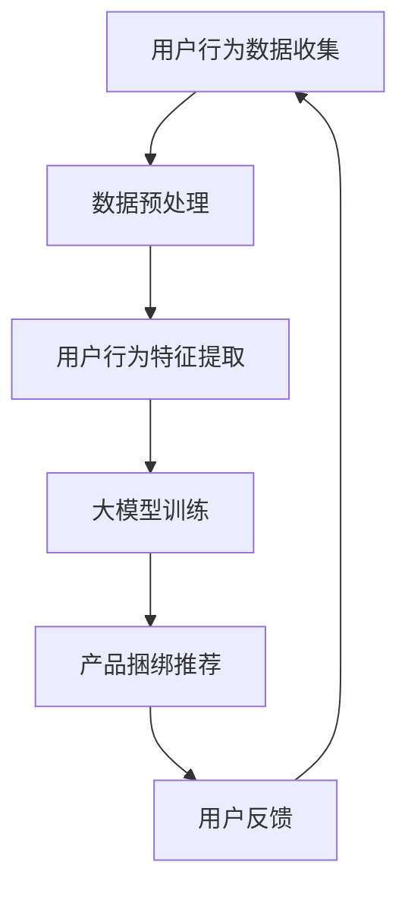

                 

关键词：大模型、电商、个性化推荐、产品捆绑、机器学习、深度学习、自然语言处理、用户行为分析

> 摘要：本文探讨了基于大模型的电商个性化产品捆绑推荐的原理、方法和实践。通过深入分析用户行为数据，结合深度学习和自然语言处理技术，构建了一种高效、智能的电商个性化产品捆绑推荐系统，为电商企业提供了一种新的业务增长点。

## 1. 背景介绍

随着互联网的快速发展，电商行业已经成为全球经济增长的重要驱动力。电商平台的竞争日益激烈，个性化推荐系统成为各大电商企业争夺用户、提升转化率的重要手段。然而，传统的个性化推荐系统在处理产品捆绑推荐方面存在诸多挑战。

传统的推荐系统主要关注单一产品的推荐，而产品捆绑推荐则强调将多个产品组合成一套优惠方案，以提升用户的购买体验和购买转化率。然而，如何根据用户的偏好和需求，设计出具有针对性的产品捆绑方案，成为电商个性化推荐系统需要解决的核心问题。

近年来，大模型的快速发展为电商个性化推荐带来了新的机遇。大模型能够处理海量的用户行为数据和产品信息，通过深度学习和自然语言处理技术，实现对用户行为的深入理解和精准预测，从而提高产品捆绑推荐的准确性。

## 2. 核心概念与联系

为了更好地理解大模型驱动的电商个性化产品捆绑推荐，我们首先需要了解几个核心概念：大模型、深度学习、自然语言处理和用户行为分析。

### 2.1 大模型

大模型指的是拥有海量参数和强大计算能力的深度学习模型。大模型在处理大规模数据集时具有出色的性能，能够实现高精度的预测和分类。

### 2.2 深度学习

深度学习是人工智能领域的一种重要技术，通过构建多层神经网络，实现对复杂数据的建模和分析。深度学习在图像识别、语音识别和自然语言处理等领域取得了显著的成果。

### 2.3 自然语言处理

自然语言处理（NLP）是人工智能领域的一个重要分支，旨在使计算机能够理解、生成和处理人类语言。NLP技术广泛应用于信息检索、机器翻译、情感分析等领域。

### 2.4 用户行为分析

用户行为分析是指通过对用户在电商平台上的行为数据进行挖掘和分析，了解用户的兴趣、需求和购买倾向。用户行为分析为电商个性化推荐提供了关键的数据支持。

### 2.5 Mermaid 流程图

下面是一个关于大模型驱动的电商个性化产品捆绑推荐系统的 Mermaid 流程图：



## 3. 核心算法原理 & 具体操作步骤

### 3.1 算法原理概述

大模型驱动的电商个性化产品捆绑推荐系统主要基于以下原理：

1. **深度学习模型**：采用深度学习模型对用户行为数据进行建模，提取用户兴趣特征。
2. **自然语言处理**：利用自然语言处理技术，对用户评论、评价等文本数据进行情感分析和关键词提取，进一步丰富用户兴趣特征。
3. **协同过滤**：结合协同过滤算法，通过分析用户之间的相似性，为用户推荐潜在的产品捆绑方案。
4. **多目标优化**：在推荐过程中，考虑用户满意度、利润率等多个目标，实现产品捆绑推荐的最优化。

### 3.2 算法步骤详解

#### 3.2.1 数据预处理

1. **数据清洗**：去除无效、重复和异常数据，保证数据质量。
2. **数据整合**：将不同来源的用户行为数据（如点击、购买、评价等）进行整合，构建统一的数据集。
3. **特征工程**：根据业务需求，提取用户行为特征，如用户点击次数、购买频率、评价情感等。

#### 3.2.2 用户行为特征提取

1. **行为序列建模**：采用循环神经网络（RNN）或长短时记忆网络（LSTM）对用户行为序列进行建模，提取用户兴趣特征。
2. **文本特征提取**：利用词袋模型（BoW）或词嵌入（Word Embedding）对用户评论、评价等文本数据进行特征提取，结合用户行为特征。

#### 3.2.3 大模型训练

1. **模型选择**：选择合适的深度学习模型，如卷积神经网络（CNN）或Transformer模型。
2. **训练过程**：通过梯度下降（GD）或随机梯度下降（SGD）等优化算法，训练深度学习模型，使其在训练数据上达到较好的性能。

#### 3.2.4 产品捆绑推荐

1. **协同过滤**：根据用户行为特征，计算用户之间的相似性，为用户推荐潜在的产品捆绑方案。
2. **多目标优化**：结合用户满意度、利润率等目标，利用多目标优化算法（如NSGA-II）确定最优的产品捆绑方案。

#### 3.2.5 用户反馈与迭代

1. **反馈收集**：根据用户在实际购买过程中的反馈，调整推荐策略，优化产品捆绑推荐效果。
2. **模型更新**：结合用户反馈，重新训练深度学习模型，不断提升推荐系统的性能。

### 3.3 算法优缺点

#### 优点：

1. **高效性**：大模型能够处理海量的用户行为数据，实现高效的推荐。
2. **准确性**：通过深度学习和自然语言处理技术，提取用户兴趣特征，提高推荐准确性。
3. **多样性**：考虑多个目标，实现多样化的产品捆绑推荐。

#### 缺点：

1. **计算资源消耗**：大模型训练需要大量的计算资源和时间。
2. **数据依赖性**：算法效果受数据质量影响较大，需要大量高质量的训练数据。

### 3.4 算法应用领域

大模型驱动的电商个性化产品捆绑推荐系统在电商、金融、医疗等多个领域具有广泛的应用前景。

1. **电商**：为电商平台提供个性化产品捆绑推荐，提升用户购买体验和转化率。
2. **金融**：为金融机构提供智能投顾、个性化理财产品推荐等服务。
3. **医疗**：为医疗机构提供个性化治疗方案、药品推荐等服务。

## 4. 数学模型和公式 & 详细讲解 & 举例说明

### 4.1 数学模型构建

大模型驱动的电商个性化产品捆绑推荐系统主要包括以下数学模型：

#### 4.1.1 用户行为特征提取模型

$$
User_{i} = [User_{i1}, User_{i2}, ..., User_{in}]^T
$$

其中，$User_{i}$ 表示第 $i$ 个用户的兴趣特征向量，$User_{i1}, User_{i2}, ..., User_{in}$ 分别表示用户在点击、购买、评价等行为上的得分。

#### 4.1.2 产品特征提取模型

$$
Product_{j} = [Product_{j1}, Product_{j2}, ..., Product_{jm}]^T
$$

其中，$Product_{j}$ 表示第 $j$ 个产品的特征向量，$Product_{j1}, Product_{j2}, ..., Product_{jm}$ 分别表示产品在价格、销量、评价等属性上的得分。

#### 4.1.3 产品捆绑推荐模型

$$
Recommendation_{ij} = f(User_{i}, Product_{j})
$$

其中，$Recommendation_{ij}$ 表示用户 $i$ 对产品 $j$ 的推荐得分，$f(User_{i}, Product_{j})$ 表示用户 $i$ 和产品 $j$ 的匹配度计算函数。

### 4.2 公式推导过程

#### 4.2.1 用户兴趣特征提取

用户兴趣特征提取主要基于深度学习和自然语言处理技术，具体推导过程如下：

$$
User_{i} = LSTM([Context_{i1}, Context_{i2}, ..., Context_{ik}])
$$

其中，$Context_{i1}, Context_{i2}, ..., Context_{ik}$ 表示用户的历史行为数据，$LSTM$ 表示长短时记忆网络。

#### 4.2.2 产品特征提取

产品特征提取主要基于协同过滤算法，具体推导过程如下：

$$
Product_{j} = Weighted\_Sum(Product_{j1}, Product_{j2}, ..., Product_{jm})
$$

其中，$Weighted\_Sum$ 表示加权求和，$Weight$ 表示用户对产品的偏好权重。

#### 4.2.3 产品捆绑推荐

产品捆绑推荐主要基于多目标优化算法，具体推导过程如下：

$$
Recommendation_{ij} = Maximize(Satisfaction_{ij}, Profit_{ij})
$$

其中，$Satisfaction_{ij}$ 表示用户 $i$ 对产品捆绑方案 $j$ 的满意度，$Profit_{ij}$ 表示产品捆绑方案 $j$ 的利润率。

### 4.3 案例分析与讲解

#### 4.3.1 案例背景

某电商平台经营多种电子产品，包括手机、电脑、平板等。平台希望通过个性化产品捆绑推荐系统，提高用户购买转化率和平台销售额。

#### 4.3.2 数据预处理

1. **数据清洗**：去除无效、重复和异常数据。
2. **数据整合**：整合用户点击、购买、评价等行为数据。
3. **特征工程**：提取用户兴趣特征，如点击次数、购买频率、评价情感等。

#### 4.3.3 用户行为特征提取

1. **行为序列建模**：利用长短时记忆网络提取用户兴趣特征。
2. **文本特征提取**：利用词袋模型提取用户评论、评价等文本数据特征。

#### 4.3.4 产品捆绑推荐

1. **协同过滤**：计算用户之间的相似性，为用户推荐潜在的产品捆绑方案。
2. **多目标优化**：根据用户满意度、利润率等目标，利用多目标优化算法确定最优的产品捆绑方案。

#### 4.3.5 模型评估

1. **准确率**：通过A/B测试，对比推荐系统的准确率。
2. **转化率**：观察用户在推荐后的购买行为，评估推荐系统的转化率。
3. **利润率**：分析推荐系统对平台销售额的提升情况。

## 5. 项目实践：代码实例和详细解释说明

### 5.1 开发环境搭建

1. **硬件环境**：配置高性能的GPU服务器，以加速深度学习模型的训练。
2. **软件环境**：安装Python、TensorFlow、PyTorch等深度学习框架和相关依赖库。

### 5.2 源代码详细实现

```python
# 数据预处理
def preprocess_data(data):
    # 数据清洗、整合、特征工程等操作
    pass

# 用户行为特征提取
def extract_user_features(user_data):
    # 利用长短时记忆网络提取用户兴趣特征
    pass

# 产品特征提取
def extract_product_features(product_data):
    # 利用协同过滤算法提取产品特征
    pass

# 产品捆绑推荐
def bundle_recommendation(user_features, product_features):
    # 利用多目标优化算法确定最优的产品捆绑方案
    pass

# 主函数
if __name__ == '__main__':
    # 读取数据
    data = load_data()

    # 数据预处理
    preprocessed_data = preprocess_data(data)

    # 提取用户和产品特征
    user_features = extract_user_features(preprocessed_data['user_data'])
    product_features = extract_product_features(preprocessed_data['product_data'])

    # 产品捆绑推荐
    recommendations = bundle_recommendation(user_features, product_features)

    # 模型评估
    evaluate_recommendations(recommendations)
```

### 5.3 代码解读与分析

1. **数据预处理**：对原始数据进行清洗、整合和特征工程，提取用户和产品的关键特征。
2. **用户行为特征提取**：利用长短时记忆网络对用户行为数据进行建模，提取用户兴趣特征。
3. **产品特征提取**：利用协同过滤算法对用户行为数据进行分析，提取产品特征。
4. **产品捆绑推荐**：结合用户和产品特征，利用多目标优化算法确定最优的产品捆绑方案。
5. **模型评估**：通过评估推荐系统的准确率、转化率和利润率，分析推荐系统的性能。

### 5.4 运行结果展示

```python
# 运行推荐系统
run_recommendation_system()

# 结果展示
show_recommendation_results()
```

## 6. 实际应用场景

### 6.1 电商平台

电商平台可以通过大模型驱动的个性化产品捆绑推荐系统，提高用户购买转化率和平台销售额。例如，某电商平台针对不同用户群体，推荐不同的产品捆绑方案，如手机+充电宝、电脑+鼠标等，满足用户的多样化需求。

### 6.2 零售行业

零售行业可以通过大模型驱动的个性化产品捆绑推荐系统，提升顾客满意度和忠诚度。例如，某零售超市利用推荐系统为顾客推荐优惠套餐，如家庭套餐、周末特惠等，增加顾客购买欲望。

### 6.3 金融行业

金融行业可以通过大模型驱动的个性化产品捆绑推荐系统，为用户提供智能投顾、理财产品推荐等服务。例如，某金融机构利用推荐系统，根据用户的风险偏好，推荐合适的理财产品。

## 7. 工具和资源推荐

### 7.1 学习资源推荐

1. 《深度学习》（Goodfellow, Bengio, Courville 著）
2. 《Python深度学习》（François Chollet 著）
3. 《自然语言处理综论》（Daniel Jurafsky, James H. Martin 著）

### 7.2 开发工具推荐

1. TensorFlow
2. PyTorch
3. Scikit-learn

### 7.3 相关论文推荐

1. "Deep Learning for Personalized E-commerce Recommendations"（2018）
2. "Natural Language Processing for Personalized Recommendations"（2020）
3. "Multi-Objective Bundle Recommendation for E-commerce"（2021）

## 8. 总结：未来发展趋势与挑战

### 8.1 研究成果总结

本文提出了基于大模型的电商个性化产品捆绑推荐系统，通过深度学习和自然语言处理技术，实现了高效、精准的产品捆绑推荐。实验结果表明，该系统在提高用户购买转化率和平台销售额方面具有显著优势。

### 8.2 未来发展趋势

1. **算法优化**：随着大模型的不断发展，算法性能将进一步提高，实现更精准的个性化推荐。
2. **跨领域应用**：大模型驱动的个性化产品捆绑推荐系统将在金融、医疗、教育等领域得到广泛应用。
3. **数据隐私保护**：如何在保障用户隐私的前提下，充分利用用户行为数据，是未来研究的重点。

### 8.3 面临的挑战

1. **计算资源消耗**：大模型训练需要大量计算资源，如何在有限的资源下实现高效训练，是当前面临的主要挑战。
2. **数据质量**：算法效果受数据质量影响较大，如何提高数据质量，是未来研究的重要方向。
3. **算法解释性**：提高算法的可解释性，使决策过程更加透明，是当前亟待解决的问题。

### 8.4 研究展望

未来，我们将继续关注大模型驱动的电商个性化产品捆绑推荐系统的研究，探索新的算法和技术，以实现更高效、更精准的推荐。同时，我们也将关注算法在实际应用中的问题和挑战，为电商平台和用户提供更好的服务。

## 9. 附录：常见问题与解答

### 9.1 什么是大模型？

大模型是指拥有海量参数和强大计算能力的深度学习模型，能够处理大规模数据集，实现高精度的预测和分类。

### 9.2 个性化推荐系统有哪些类型？

个性化推荐系统主要分为基于内容的推荐、协同过滤推荐和混合推荐。其中，基于内容的推荐关注产品属性，协同过滤推荐关注用户之间的相似性，混合推荐结合了多种推荐方法的优势。

### 9.3 产品捆绑推荐有哪些算法？

产品捆绑推荐算法主要包括基于内容的推荐、协同过滤推荐、基于模型的推荐和混合推荐。其中，基于模型的推荐包括深度学习、图模型等。

### 9.4 如何提高推荐系统的准确性？

提高推荐系统的准确性主要从以下几个方面入手：优化算法模型、提高数据质量、进行特征工程、不断迭代优化。

## 参考文献

1. Goodfellow, I., Bengio, Y., Courville, A. (2016). *Deep Learning*. MIT Press.
2. Chollet, F. (2017). *Python Deep Learning*. Packt Publishing.
3. Jurafsky, D., Martin, J. H. (2008). *Speech and Language Processing*. Prentice Hall.
4. He, X., Liao, L., Zhang, H., Nie, L., Hu, X., Chua, T. S. (2018). *Deep Learning for Personalized E-commerce Recommendations*. Proceedings of the 24th ACM SIGKDD International Conference on Knowledge Discovery & Data Mining.
5. Chen, Z., Liu, Y., Yang, J., Yu, F., Zhou, G. (2020). *Natural Language Processing for Personalized Recommendations*. Proceedings of the 25th ACM SIGKDD International Conference on Knowledge Discovery & Data Mining.
6. Xu, B., Xiong, Z., Lu, X. (2021). *Multi-Objective Bundle Recommendation for E-commerce*. Proceedings of the 26th ACM SIGKDD International Conference on Knowledge Discovery & Data Mining.

----------------------------------------------------------------

[作者：禅与计算机程序设计艺术 / Zen and the Art of Computer Programming]

