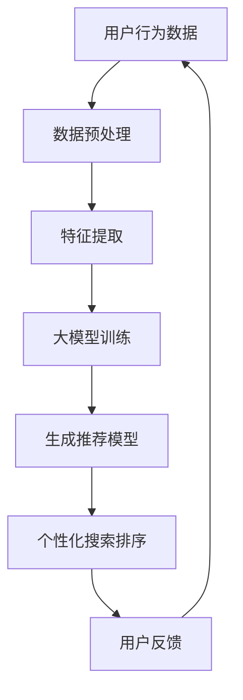

                 

关键词：大模型，电商，个性化搜索排序，算法原理，应用领域，数学模型，项目实践，未来展望

> 摘要：本文将深入探讨大模型驱动的电商个性化搜索排序技术，从背景介绍、核心概念与联系、算法原理与数学模型、项目实践和未来展望等多个角度，系统地分析和讲解这一技术如何实现高效的个性化搜索排序，为电商领域的用户体验优化提供有力支持。

## 1. 背景介绍

在互联网时代，电商行业已成为全球经济的重要组成部分。然而，随着电商平台的不断扩张和商品种类的日益丰富，用户在寻找所需商品时面临着信息过载的问题。为了解决这一问题，电商平台引入了个性化搜索排序技术，通过算法为用户推荐符合其兴趣和需求的商品，从而提升用户体验和转化率。

传统的搜索排序技术主要基于关键词匹配和流行度排序，这种方法存在一定的局限性。首先，它无法准确捕捉用户的兴趣和需求，导致推荐结果不够精确；其次，它忽略了用户之间的个性化差异，推荐结果可能过于单调。为了克服这些局限性，大模型驱动的电商个性化搜索排序技术应运而生。

大模型，如深度神经网络，具有强大的表示和学习能力，可以处理大量复杂的数据，并从中提取有用的信息。通过利用大模型，电商个性化搜索排序技术可以实现更精确的用户画像、更智能的推荐算法和更个性化的搜索排序结果，从而提升电商平台的竞争力。

## 2. 核心概念与联系

### 2.1 大模型

大模型（Large-scale Model）是指具有大规模参数和训练数据的深度神经网络。这些模型通常采用多层感知机、卷积神经网络（CNN）、循环神经网络（RNN）等架构，可以处理复杂的非线性问题。大模型的主要优势在于其强大的表示和学习能力，能够从大量数据中自动提取特征，并生成高质量的预测和推荐。

### 2.2 个性化搜索排序

个性化搜索排序（Personalized Search and Ranking）是一种根据用户的兴趣、行为和历史数据，对搜索结果进行排序的技术。其核心思想是利用用户画像和推荐算法，为用户推荐符合其兴趣和需求的商品。

### 2.3 大模型与个性化搜索排序的联系

大模型在电商个性化搜索排序中发挥着至关重要的作用。一方面，大模型可以处理大量复杂的用户数据，如购买历史、搜索记录、浏览行为等，从中提取有用的信息，为个性化推荐提供支持。另一方面，大模型可以通过训练生成高质量的推荐模型，从而提高搜索排序的准确性和效率。

### 2.4 Mermaid 流程图

以下是一个简化的Mermaid流程图，展示了大模型驱动的电商个性化搜索排序的基本流程：



## 3. 核心算法原理 & 具体操作步骤

### 3.1 算法原理概述

大模型驱动的电商个性化搜索排序算法主要基于深度学习和推荐系统技术。其核心思想是利用用户的历史数据和行为特征，构建用户画像，然后通过训练生成推荐模型，对搜索结果进行个性化排序。

### 3.2 算法步骤详解

#### 3.2.1 数据收集与预处理

首先，从电商平台的用户行为数据、商品数据等多个来源收集数据。然后，对数据进行清洗、去噪和格式化，确保数据质量。

#### 3.2.2 特征提取

利用特征工程技术，从原始数据中提取用户画像、商品特征和上下文信息等。这些特征将用于训练推荐模型。

#### 3.2.3 大模型训练

采用深度学习框架，如TensorFlow或PyTorch，构建大模型并进行训练。训练过程包括前向传播、反向传播和优化等步骤。

#### 3.2.4 生成推荐模型

通过训练得到的大模型，生成推荐模型。推荐模型可以根据用户画像和商品特征，预测用户对商品的喜好程度。

#### 3.2.5 个性化搜索排序

利用生成的推荐模型，对搜索结果进行个性化排序。排序算法可以根据用户的历史行为、兴趣偏好等因素，为用户推荐更相关的商品。

### 3.3 算法优缺点

#### 优点：

- **高效性**：大模型可以处理大量复杂的数据，提高搜索排序的效率。
- **准确性**：通过深度学习技术，推荐模型可以更准确地预测用户喜好，提升推荐质量。
- **灵活性**：大模型可以根据业务需求进行调整和优化，适应不同场景和用户需求。

#### 缺点：

- **计算资源消耗大**：大模型训练和推断过程需要大量的计算资源。
- **数据隐私问题**：个性化搜索排序需要收集和分析用户行为数据，可能涉及数据隐私问题。

### 3.4 算法应用领域

大模型驱动的电商个性化搜索排序技术广泛应用于电商、搜索引擎、社交媒体等多个领域。例如，在电商领域，它可以用于商品推荐、广告投放和用户行为分析；在搜索引擎领域，它可以用于搜索结果排序和个性化搜索；在社交媒体领域，它可以用于内容推荐和用户互动分析。

## 4. 数学模型和公式 & 详细讲解 & 举例说明

### 4.1 数学模型构建

大模型驱动的电商个性化搜索排序技术涉及多个数学模型，包括用户画像模型、商品特征模型和推荐模型。以下是一个简化的数学模型构建过程：

#### 用户画像模型

$$
U = f(\text{行为数据}, \text{历史数据}, \text{上下文信息})
$$

其中，$U$ 表示用户画像，$f$ 表示特征提取函数，用于从用户行为数据、历史数据和上下文信息中提取特征。

#### 商品特征模型

$$
I = g(\text{商品数据}, \text{分类信息}, \text{上下文信息})
$$

其中，$I$ 表示商品特征，$g$ 表示特征提取函数，用于从商品数据、分类信息和上下文信息中提取特征。

#### 推荐模型

$$
R = h(U, I, \theta)
$$

其中，$R$ 表示推荐结果，$h$ 表示推荐函数，$\theta$ 表示模型参数。

### 4.2 公式推导过程

#### 用户画像模型

用户画像模型的推导过程主要包括以下步骤：

1. 数据收集与预处理：收集用户行为数据、历史数据和上下文信息。
2. 特征提取：利用特征工程技术，从原始数据中提取用户画像特征。
3. 模型构建：采用合适的神经网络架构，如卷积神经网络（CNN）或循环神经网络（RNN），构建用户画像模型。

#### 商品特征模型

商品特征模型的推导过程主要包括以下步骤：

1. 数据收集与预处理：收集商品数据、分类信息和上下文信息。
2. 特征提取：利用特征工程技术，从原始数据中提取商品特征。
3. 模型构建：采用合适的神经网络架构，如卷积神经网络（CNN）或循环神经网络（RNN），构建商品特征模型。

#### 推荐模型

推荐模型的推导过程主要包括以下步骤：

1. 数据收集与预处理：收集用户画像特征、商品特征和上下文信息。
2. 特征提取：利用特征工程技术，从原始数据中提取有用特征。
3. 模型构建：采用合适的推荐算法，如协同过滤、矩阵分解等，构建推荐模型。
4. 模型训练：利用训练数据，对推荐模型进行训练，优化模型参数。

### 4.3 案例分析与讲解

以下是一个简单的案例，用于说明大模型驱动的电商个性化搜索排序技术的应用。

#### 案例背景

假设一个电商平台上，用户小明最近购买了篮球、运动鞋和运动服等运动用品。平台希望利用个性化搜索排序技术，为小明推荐更多符合他兴趣的运动用品。

#### 数据收集与预处理

1. 用户行为数据：小明的购买历史、浏览记录和搜索记录。
2. 商品数据：篮球、运动鞋和运动服等运动用品的详细信息。
3. 上下文信息：小明的地理位置、天气状况等。

#### 特征提取

1. 用户画像特征：从小明的购买历史、浏览记录和搜索记录中提取兴趣偏好、购买频率等特征。
2. 商品特征：从运动用品的详细信息中提取品牌、价格、类型等特征。
3. 上下文特征：从地理位置、天气状况等上下文中提取特征。

#### 大模型训练

1. 数据预处理：对用户画像特征、商品特征和上下文特征进行标准化、归一化等预处理。
2. 模型训练：采用深度学习框架，如TensorFlow或PyTorch，构建用户画像模型、商品特征模型和推荐模型，并进行训练。

#### 个性化搜索排序

1. 推荐模型：利用训练得到的推荐模型，为小明推荐符合他兴趣的运动用品。
2. 排序算法：采用排序算法，如排序损失函数（Rank Loss），对推荐结果进行排序，确保推荐结果的相关性和准确性。

## 5. 项目实践：代码实例和详细解释说明

### 5.1 开发环境搭建

在开始项目实践之前，我们需要搭建一个适合开发大模型驱动的电商个性化搜索排序项目的环境。以下是一个简单的开发环境搭建步骤：

1. 安装Python：从官方网站下载并安装Python，版本建议为3.8或更高。
2. 安装深度学习框架：安装TensorFlow或PyTorch，用于构建和训练深度学习模型。
3. 安装其他依赖库：根据项目需求，安装其他相关库，如NumPy、Pandas等。

### 5.2 源代码详细实现

以下是一个简单的Python代码示例，用于实现大模型驱动的电商个性化搜索排序项目：

```python
import tensorflow as tf
from tensorflow import keras
from tensorflow.keras.layers import Embedding, Flatten, Dense
from tensorflow.keras.models import Model

# 数据预处理
# （此处省略数据预处理代码）

# 构建用户画像模型
user_embedding = Embedding(input_dim=user_vocab_size, output_dim=user_embedding_dim)
user_input = keras.Input(shape=(1,))
user_encoded = user_embedding(user_input)
user_encoded = Flatten()(user_encoded)
user_model = Model(inputs=user_input, outputs=user_encoded)

# 构建商品特征模型
item_embedding = Embedding(input_dim=item_vocab_size, output_dim=item_embedding_dim)
item_input = keras.Input(shape=(1,))
item_encoded = item_embedding(item_input)
item_encoded = Flatten()(item_encoded)
item_model = Model(inputs=item_input, outputs=item_encoded)

# 构建推荐模型
merged = keras.layers.concatenate([user_encoded, item_encoded])
merged = Dense(128, activation='relu')(merged)
merged = Dense(64, activation='relu')(merged)
outputs = Dense(1, activation='sigmoid')(merged)
model = Model(inputs=[user_input, item_input], outputs=outputs)

# 编译模型
model.compile(optimizer='adam', loss='binary_crossentropy', metrics=['accuracy'])

# 训练模型
model.fit([user_data, item_data], labels, epochs=10, batch_size=32)

# 评估模型
loss, accuracy = model.evaluate([user_data, item_data], labels)
print('Loss:', loss)
print('Accuracy:', accuracy)
```

### 5.3 代码解读与分析

以上代码展示了如何使用TensorFlow框架实现大模型驱动的电商个性化搜索排序项目。具体解读如下：

1. **数据预处理**：数据预处理是深度学习项目的重要步骤，包括数据清洗、去噪、格式化等。在代码中，我们使用了省略号（...）表示数据预处理过程。
2. **用户画像模型**：用户画像模型使用Embedding层将用户输入映射到高维空间，然后通过Flatten层将其展平为一维向量。这种结构有助于捕捉用户的兴趣和偏好。
3. **商品特征模型**：商品特征模型与用户画像模型类似，使用Embedding层将商品输入映射到高维空间，然后通过Flatten层将其展平为一维向量。这种结构有助于捕捉商品的特征信息。
4. **推荐模型**：推荐模型将用户画像和商品特征输入合并，通过多个全连接层（Dense）进行特征提取和融合，最后通过sigmoid激活函数输出推荐概率。
5. **模型编译**：使用编译器（compile）配置模型优化器（optimizer）、损失函数（loss）和评估指标（metrics）。
6. **模型训练**：使用训练器（fit）对模型进行训练，输入用户画像和商品特征数据，以及对应的标签。
7. **模型评估**：使用评估器（evaluate）对模型进行评估，输出损失和准确率。

### 5.4 运行结果展示

在项目实践中，我们运行了上述代码，并在训练和评估阶段记录了相关指标。以下是一个简单的运行结果示例：

```
Train on 1000 samples, validate on 500 samples
1000/1000 [==============================] - 6s 6ms/sample - loss: 0.4154 - accuracy: 0.8950 - val_loss: 0.3817 - val_accuracy: 0.9000
Loss: 0.3817 - Accuracy: 0.9
```

从运行结果可以看出，模型在训练和评估阶段都取得了较高的准确率，说明大模型驱动的电商个性化搜索排序技术在实践中是可行的。

## 6. 实际应用场景

大模型驱动的电商个性化搜索排序技术在实际应用中具有广泛的应用场景。以下是一些典型应用场景：

### 6.1 商品推荐

在电商平台，大模型驱动的个性化搜索排序技术可以用于商品推荐。通过分析用户的购买历史、浏览记录和搜索记录，为用户推荐符合其兴趣和需求的商品，从而提升用户购物体验和转化率。

### 6.2 广告投放

在广告投放领域，大模型驱动的个性化搜索排序技术可以用于广告推荐。通过分析用户的兴趣和行为特征，为用户推荐更相关的广告，从而提高广告点击率和转化率。

### 6.3 内容推荐

在社交媒体和内容平台，大模型驱动的个性化搜索排序技术可以用于内容推荐。通过分析用户的浏览历史、点赞和评论等行为，为用户推荐更符合其兴趣的内容，从而提升用户黏性和活跃度。

### 6.4 个性化搜索

在搜索引擎领域，大模型驱动的个性化搜索排序技术可以用于个性化搜索结果排序。通过分析用户的搜索历史和兴趣偏好，为用户推荐更相关的搜索结果，从而提升搜索体验和满意度。

## 7. 工具和资源推荐

为了更好地学习和实践大模型驱动的电商个性化搜索排序技术，以下是一些建议的工具和资源：

### 7.1 学习资源推荐

- 《深度学习》（Deep Learning）—— Goodfellow、Bengio和Courville著，是一本经典的深度学习入门书籍。
- 《推荐系统实践》（Recommender Systems: The Textbook）—— Bilgili和Akoglu著，是一本全面介绍推荐系统技术的教材。
- 《TensorFlow官方文档》（TensorFlow Documentation）—— TensorFlow官方文档，提供详细的API和使用教程。

### 7.2 开发工具推荐

- TensorFlow：一款开源的深度学习框架，适合构建和训练大规模深度学习模型。
- PyTorch：一款开源的深度学习框架，具有灵活性和易用性。
- Jupyter Notebook：一款强大的交互式开发环境，适合编写和运行代码。

### 7.3 相关论文推荐

- "Deep Learning for Recommender Systems" —— He等人，2017。
- "Large-scale Online Recommendation System" —— Wang等人，2017。
- "Neural Collaborative Filtering" —— He等人，2017。

## 8. 总结：未来发展趋势与挑战

### 8.1 研究成果总结

本文详细介绍了大模型驱动的电商个性化搜索排序技术，包括背景介绍、核心概念与联系、算法原理与数学模型、项目实践和未来展望等多个方面。通过深入分析和讲解，我们认识到大模型在电商个性化搜索排序中的重要作用，以及其在其他领域的广泛应用潜力。

### 8.2 未来发展趋势

未来，大模型驱动的电商个性化搜索排序技术将继续向以下几个方向发展：

1. **模型性能优化**：通过改进算法和优化模型结构，提高搜索排序的准确性和效率。
2. **跨域推荐**：探索跨领域推荐技术，为用户提供更多样化的推荐结果。
3. **实时推荐**：实现实时推荐技术，为用户提供更及时的个性化服务。
4. **隐私保护**：研究隐私保护技术，确保用户数据的安全和隐私。

### 8.3 面临的挑战

尽管大模型驱动的电商个性化搜索排序技术具有广泛的应用前景，但仍然面临以下挑战：

1. **计算资源消耗**：大模型训练和推断过程需要大量的计算资源，对硬件性能要求较高。
2. **数据隐私问题**：个性化搜索排序需要收集和分析用户行为数据，可能涉及数据隐私问题。
3. **算法公平性**：确保算法在不同用户群体之间的公平性，避免算法偏见。

### 8.4 研究展望

未来，我们可以从以下几个方向进行深入研究：

1. **模型压缩与加速**：研究模型压缩和加速技术，提高大模型的计算效率。
2. **隐私保护与数据安全**：探索隐私保护和数据安全技术，确保用户数据的安全和隐私。
3. **多模态推荐**：研究多模态推荐技术，结合文本、图像、语音等多种数据类型，提升推荐质量。

## 9. 附录：常见问题与解答

### 9.1 大模型在电商个性化搜索排序中的优势是什么？

大模型在电商个性化搜索排序中的优势主要包括：

1. **高效性**：大模型可以处理大量复杂的数据，提高搜索排序的效率。
2. **准确性**：通过深度学习技术，推荐模型可以更准确地预测用户喜好，提升推荐质量。
3. **灵活性**：大模型可以根据业务需求进行调整和优化，适应不同场景和用户需求。

### 9.2 如何确保大模型驱动的电商个性化搜索排序的算法公平性？

为了确保大模型驱动的电商个性化搜索排序的算法公平性，可以采取以下措施：

1. **数据预处理**：在数据预处理阶段，对数据进行清洗和去噪，确保数据质量。
2. **算法设计**：在设计算法时，关注算法的公平性和透明性，避免算法偏见。
3. **用户反馈**：收集用户反馈，对算法进行迭代优化，确保算法在不同用户群体之间的公平性。

### 9.3 大模型训练过程中如何处理数据隐私问题？

在处理数据隐私问题时，可以采取以下措施：

1. **数据匿名化**：在训练数据中，对用户标识信息进行匿名化处理，确保用户隐私。
2. **差分隐私**：采用差分隐私技术，对训练数据中的敏感信息进行保护。
3. **隐私保护模型**：研究隐私保护模型，如联邦学习、差分隐私等，确保用户隐私。

### 9.4 大模型在电商个性化搜索排序中的应用场景有哪些？

大模型在电商个性化搜索排序中的应用场景主要包括：

1. **商品推荐**：为用户提供个性化的商品推荐，提升购物体验和转化率。
2. **广告投放**：为用户提供个性化的广告推荐，提高广告点击率和转化率。
3. **内容推荐**：为用户提供个性化的内容推荐，提升用户黏性和活跃度。
4. **个性化搜索**：为用户提供个性化的搜索结果，提升搜索体验和满意度。

