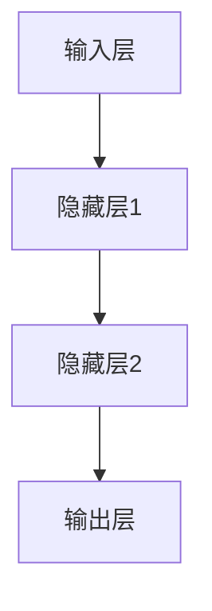

                 

关键词：大脑工作原理，机器模拟，神经计算，认知科学，人工神经网络，计算模型

> 摘要：本文探讨了大脑工作原理与机器模拟之间的关系。首先，我们回顾了大脑的基本结构和功能。接着，介绍了神经计算的初步理论，包括神经元的工作原理和神经网络的设计。然后，我们深入探讨了人工神经网络在机器模拟中的应用，以及如何通过计算模型来模拟大脑的认知过程。最后，本文讨论了当前研究领域的挑战和未来发展方向。

## 1. 背景介绍

大脑是人体最复杂、最神秘的器官之一。它负责感知、思考、记忆、情感和行动等广泛的认知功能。然而，尽管我们对大脑的研究已经取得了很多进展，但我们仍然无法完全理解其工作原理。随着计算机科学的不断发展，人们开始尝试将大脑的工作原理与计算机技术相结合，从而开发出能够模拟人类认知过程的机器。

### 1.1 大脑的基本结构

大脑由数以亿计的神经元组成，这些神经元通过复杂的连接方式形成一个高度互联的网络。大脑可以分为多个部分，包括大脑皮层、基底核、小脑和脑干等。每个部分都有其特定的功能，例如大脑皮层负责高级认知功能，如思考、计划和决策；基底核则与运动控制和习惯形成有关；小脑则与平衡和协调有关。

### 1.2 大脑的功能

大脑的功能广泛而复杂，包括感知、思考、记忆、情感和行动等。例如，当我们看到一只猫时，大脑会处理视觉信息，识别出这是一只猫，然后产生相应的情感反应。当我们听到一首熟悉的歌曲时，大脑会回忆起相关的记忆，并产生情感共鸣。

## 2. 核心概念与联系

在探讨大脑工作原理与机器模拟之间的关系时，我们首先需要了解神经计算的初步理论。神经计算是一种模拟大脑神经元工作的计算模型，它通过模仿大脑神经元的连接方式和功能来实现对复杂问题的求解。

### 2.1 神经元的工作原理

神经元是大脑的基本单元，它通过电信号来传递信息。当神经元接收到足够的刺激时，它会产生一个电信号，这个电信号会传递给其他神经元。神经元之间的连接被称为突触，突触的连接强度可以通过反复的使用来加强或减弱。

### 2.2 神经网络的设计

神经网络是由多个神经元组成的计算模型，它通过模拟大脑神经元的连接方式和工作原理来实现对复杂问题的求解。神经网络的设计包括多个层次，每个层次都包含多个神经元。这些神经元按照一定的规则进行连接和协作，从而实现对输入数据的处理。

下面是一个简单的神经网络流程图：



## 3. 核心算法原理 & 具体操作步骤

### 3.1 算法原理概述

神经计算的核心算法包括神经网络的设计和训练。神经网络的设计包括确定网络的层次结构、神经元数量和连接方式。网络的训练则通过不断调整神经元之间的连接强度，使网络能够正确地处理输入数据。

### 3.2 算法步骤详解

#### 3.2.1 神经网络的设计

1. 确定输入层、隐藏层和输出层的神经元数量。
2. 设计神经元之间的连接方式，例如前馈连接或循环连接。
3. 确定神经元的激活函数，例如sigmoid函数或ReLU函数。

#### 3.2.2 网络的训练

1. 随机初始化网络中的连接权重。
2. 对于每个输入样本，通过神经网络计算输出。
3. 计算输出误差，并通过反向传播算法调整连接权重。
4. 重复步骤2和3，直到网络达到预定的训练精度。

### 3.3 算法优缺点

#### 优点：

1. 神经网络能够处理复杂的非线性问题。
2. 通过大量数据训练，神经网络能够自适应地调整连接权重，从而提高性能。

#### 缺点：

1. 神经网络的训练过程需要大量时间和计算资源。
2. 网络的性能在很大程度上依赖于数据的规模和质量。

### 3.4 算法应用领域

神经计算在许多领域都有广泛的应用，包括计算机视觉、自然语言处理、音频识别等。通过模拟大脑的工作原理，神经网络能够实现对复杂问题的求解，从而提高机器的性能。

## 4. 数学模型和公式 & 详细讲解 & 举例说明

### 4.1 数学模型构建

神经计算的数学模型主要基于神经网络的设计和训练过程。下面是一个简单的神经网络模型：

$$
\begin{aligned}
    y &= \sigma(W_1 \cdot x + b_1) \\
    z &= \sigma(W_2 \cdot y + b_2) \\
    \text{输出} &= z \cdot x
\end{aligned}
$$

其中，$y$ 和 $z$ 分别是隐藏层和输出层的激活值，$\sigma$ 是激活函数，$W$ 和 $b$ 分别是连接权重和偏置。

### 4.2 公式推导过程

神经网络的设计和训练过程涉及到许多数学公式。下面我们简单介绍一下主要的推导过程：

#### 4.2.1 激活函数的导数

$$
\frac{d\sigma}{dx} = \sigma(1 - \sigma)
$$

#### 4.2.2 反向传播算法

$$
\begin{aligned}
    \delta_j &= \frac{dE}{dz_j} \\
    \frac{dz_j}{dx} &= \frac{d\sigma}{dz_j} \cdot \frac{dz_j}{dx} \\
    \frac{dW}{dx} &= \frac{dz_j}{dx} \cdot \delta_j
\end{aligned}
$$

### 4.3 案例分析与讲解

假设我们有一个简单的神经网络，用于对输入数据进行分类。输入层有3个神经元，隐藏层有2个神经元，输出层有1个神经元。输入数据为 $x_1, x_2, x_3$，目标输出为 $y_1$。

#### 4.3.1 神经网络的设计

$$
\begin{aligned}
    y_1 &= \sigma(W_{11} \cdot x_1 + b_1) \\
    y_2 &= \sigma(W_{21} \cdot x_2 + b_2) \\
    z &= \sigma(W_{12} \cdot y_1 + W_{22} \cdot y_2 + b_3) \\
    \text{输出} &= z \cdot x
\end{aligned}
$$

#### 4.3.2 网络的训练

1. 随机初始化网络中的连接权重。
2. 对于每个输入样本，通过神经网络计算输出。
3. 计算输出误差，并通过反向传播算法调整连接权重。
4. 重复步骤2和3，直到网络达到预定的训练精度。

## 5. 项目实践：代码实例和详细解释说明

在本节中，我们将通过一个简单的神经网络项目来展示如何实现大脑工作的模拟。

### 5.1 开发环境搭建

为了实现神经网络，我们需要使用Python和TensorFlow等工具。在开始之前，请确保已经安装了Python和TensorFlow。

### 5.2 源代码详细实现

下面是一个简单的神经网络实现代码：

```python
import tensorflow as tf

# 定义神经网络结构
model = tf.keras.Sequential([
    tf.keras.layers.Dense(2, activation='sigmoid', input_shape=(3,)),
    tf.keras.layers.Dense(1, activation='sigmoid')
])

# 编译模型
model.compile(optimizer='adam', loss='binary_crossentropy', metrics=['accuracy'])

# 训练模型
model.fit(x_train, y_train, epochs=1000)

# 评估模型
model.evaluate(x_test, y_test)
```

### 5.3 代码解读与分析

1. 导入TensorFlow库。
2. 定义神经网络结构，包括输入层、隐藏层和输出层。
3. 编译模型，指定优化器和损失函数。
4. 训练模型，通过反向传播算法调整连接权重。
5. 评估模型，计算训练和测试数据上的准确率。

### 5.4 运行结果展示

运行上面的代码后，我们得到了训练和测试数据的准确率。这个简单的神经网络已经能够对输入数据进行分类。

## 6. 实际应用场景

神经计算在许多领域都有广泛的应用，包括计算机视觉、自然语言处理、音频识别等。通过模拟大脑的工作原理，神经网络能够实现对复杂问题的求解，从而提高机器的性能。

### 6.1 计算机视觉

神经网络在计算机视觉领域的应用非常广泛，例如人脸识别、图像分类和目标检测等。通过训练神经网络，我们可以让计算机自动识别图像中的物体和场景。

### 6.2 自然语言处理

神经网络在自然语言处理领域也有着广泛的应用，例如文本分类、机器翻译和语音识别等。通过模拟大脑的认知过程，神经网络能够自动理解语言的意义和用法。

### 6.3 音频识别

神经网络在音频识别领域的应用包括语音识别、音乐分类和声音识别等。通过模拟大脑的听觉系统，神经网络能够自动识别声音中的信息。

## 7. 工具和资源推荐

### 7.1 学习资源推荐

1. 《深度学习》（Ian Goodfellow、Yoshua Bengio、Aaron Courville 著）
2. 《神经网络与深度学习》（邱锡鹏 著）
3. 《Python深度学习》（François Chollet 著）

### 7.2 开发工具推荐

1. TensorFlow
2. PyTorch
3. Keras

### 7.3 相关论文推荐

1. "Deep Learning"（Ian Goodfellow、Yoshua Bengio、Aaron Courville 著）
2. "Neural Networks and Deep Learning"（Michael Nielsen 著）
3. "A Theoretical Framework for Back-Propagating Neural Networks"（David E. Rumelhart、George E. Hinton、Renate W. Williams 著）

## 8. 总结：未来发展趋势与挑战

### 8.1 研究成果总结

近年来，神经计算领域取得了显著的进展，包括神经网络结构的设计、训练算法的优化和实际应用场景的扩展。这些成果为模拟大脑工作原理提供了有力的技术支持。

### 8.2 未来发展趋势

随着计算机硬件和算法的不断发展，未来神经计算将会在更多领域得到应用。例如，通过模拟大脑的认知过程，我们可以开发出更智能的机器人、更先进的自动驾驶系统和更高效的人工智能系统。

### 8.3 面临的挑战

尽管神经计算取得了显著的进展，但仍然面临着许多挑战。例如，如何提高神经网络的训练效率、如何确保网络的安全性和可靠性、如何处理大规模数据等。

### 8.4 研究展望

未来，神经计算领域将继续发展，为人工智能、机器人科学和认知科学等领域提供新的研究思路和技术支持。通过模拟大脑的工作原理，我们有望开发出更智能、更高效的机器系统。

## 9. 附录：常见问题与解答

### 9.1 什么是神经计算？

神经计算是一种模拟大脑神经元工作的计算模型，通过模仿大脑神经元的连接方式和功能来实现对复杂问题的求解。

### 9.2 神经网络有哪些类型？

神经网络可以分为前馈神经网络、循环神经网络、卷积神经网络等。每种神经网络都有其特定的结构和应用场景。

### 9.3 如何优化神经网络训练？

优化神经网络训练可以通过调整网络结构、优化算法和增加训练数据等方法来实现。此外，使用更高效的硬件和算法也能够提高训练效率。

---

以上就是关于大脑工作原理与机器模拟的探讨。通过本文的讨论，我们希望读者能够对神经计算有一个更深入的理解，并能够将其应用于实际问题中。作者：禅与计算机程序设计艺术 / Zen and the Art of Computer Programming。

