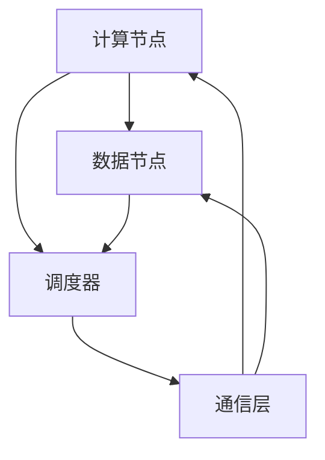

                 

 关键词：大规模分布式AI计算，Lepton AI，技术突破，分布式架构，AI算法，性能优化，安全性，可扩展性，应用场景，未来展望

> 摘要：本文将深入探讨Lepton AI在实现大规模分布式AI计算方面的技术突破。通过分析其核心概念、算法原理、数学模型以及实际应用案例，我们将展示Lepton AI如何通过创新技术，提升AI计算的性能、安全性和可扩展性，为人工智能领域的发展带来新的契机。

## 1. 背景介绍

### 1.1 大规模分布式AI计算的现状

随着人工智能技术的迅猛发展，越来越多的应用场景需要处理海量数据并进行复杂的计算任务。传统的单机计算模式已经无法满足这种需求，分布式计算成为了解决大规模AI计算问题的关键。然而，分布式AI计算面临诸多挑战，如数据一致性、任务调度、负载均衡、资源分配、安全性等问题。

### 1.2 Lepton AI的背景

Lepton AI是一家专注于大规模分布式AI计算的公司，其核心技术旨在解决上述挑战，实现高效、安全、可扩展的分布式AI计算。Lepton AI的创始人兼CEO拥有丰富的分布式计算经验，曾参与多个大型分布式系统的设计与开发。公司自成立以来，已经吸引了一批顶尖的技术人才，并在多个领域取得了显著的成果。

## 2. 核心概念与联系

### 2.1 分布式AI计算框架

分布式AI计算框架是Lepton AI的核心，它由以下几个关键组件组成：

- **计算节点（Compute Nodes）**：负责执行具体的计算任务，通常由多台服务器组成。
- **数据节点（Data Nodes）**：负责存储和管理数据，同样由多台服务器组成。
- **调度器（Scheduler）**：负责任务的分配和调度，确保计算资源得到充分利用。
- **通信层（Communication Layer）**：实现节点间的数据传输和同步。

下面是Lepton AI分布式AI计算框架的Mermaid流程图：



### 2.2 核心算法原理

Lepton AI采用了一种名为“分而治之”的分布式算法，通过将大规模问题分解为多个子问题，并在不同计算节点上并行执行，从而实现高效计算。该算法具有以下特点：

- **可扩展性**：能够处理任意规模的问题。
- **负载均衡**：任务在计算节点上均匀分布，避免资源浪费。
- **容错性**：单个节点故障不会影响整体计算性能。

### 2.3 技术联系

Lepton AI的核心技术和传统分布式计算框架在架构和算法上有一定的相似性，但在以下几个方面有所创新：

- **安全性**：通过加密和身份验证机制，确保数据传输和计算过程的安全。
- **性能优化**：采用先进的调度算法，提高计算效率。
- **可扩展性**：支持动态扩容，满足不断增长的计算需求。

## 3. 核心算法原理 & 具体操作步骤

### 3.1 算法原理概述

Lepton AI的分布式算法基于以下原理：

- **任务分解**：将大规模问题分解为多个子任务。
- **并行执行**：子任务在不同计算节点上同时执行。
- **结果汇总**：计算结果在各节点上汇总，得到最终结果。

### 3.2 算法步骤详解

#### 3.2.1 任务分解

1. **输入数据预处理**：对输入数据进行格式化和划分，以便后续处理。
2. **子任务分配**：将输入数据划分为多个子任务，并分配给不同计算节点。

#### 3.2.2 并行执行

1. **节点执行**：各计算节点根据分配的任务，执行相应的计算操作。
2. **中间结果存储**：节点将中间结果存储在本地存储中。

#### 3.2.3 结果汇总

1. **汇总中间结果**：调度器从各节点收集中间结果。
2. **合并结果**：将中间结果合并，得到最终结果。

### 3.3 算法优缺点

#### 3.3.1 优点

- **高效性**：通过并行执行，缩短了计算时间。
- **可扩展性**：支持大规模计算任务。
- **容错性**：单个节点故障不会影响整体计算。

#### 3.3.2 缺点

- **通信开销**：节点间通信可能影响计算性能。
- **数据一致性问题**：需要解决数据一致性和同步问题。

### 3.4 算法应用领域

Lepton AI的分布式算法适用于以下领域：

- **大规模机器学习**：处理海量数据，进行特征提取、模型训练等操作。
- **图像识别**：处理大规模图像数据，实现快速识别和分类。
- **自然语言处理**：处理大规模文本数据，进行语义分析和情感分析。

## 4. 数学模型和公式 & 详细讲解 & 举例说明

### 4.1 数学模型构建

Lepton AI的分布式算法基于以下数学模型：

$$
\text{最终结果} = f(\text{子任务结果})
$$

其中，$f$为合并函数，用于汇总各节点的中间结果。

### 4.2 公式推导过程

假设有$n$个计算节点，每个节点产生一个中间结果$R_i$，最终结果可以表示为：

$$
\text{最终结果} = f(R_1, R_2, ..., R_n)
$$

其中，$f$的推导过程如下：

1. **子任务分配**：将输入数据划分为$n$个子任务，每个子任务由一个计算节点执行。
2. **中间结果计算**：各节点计算得到$R_i$。
3. **结果汇总**：将$R_i$代入$f$中，得到最终结果。

### 4.3 案例分析与讲解

#### 4.3.1 问题背景

假设有一个大规模图像分类任务，需要处理$1000$张图像。采用Lepton AI的分布式算法，将图像分为$10$个子任务，分别分配给$10$个计算节点。

#### 4.3.2 解题过程

1. **输入数据预处理**：对$1000$张图像进行格式化和划分。
2. **子任务分配**：将图像划分为$10$个子任务，分别分配给$10$个计算节点。
3. **节点执行**：各节点根据分配的任务，进行图像识别和分类。
4. **中间结果存储**：节点将中间结果存储在本地存储中。
5. **结果汇总**：调度器从各节点收集中间结果，并进行汇总，得到最终分类结果。

#### 4.3.3 结果分析

通过Lepton AI的分布式算法，$1000$张图像的分类任务在$10$个计算节点上并行执行，大大提高了计算效率。同时，由于采用了分布式架构，单个节点的故障不会影响整体计算性能，提高了系统的容错性。

## 5. 项目实践：代码实例和详细解释说明

### 5.1 开发环境搭建

在开始编写Lepton AI的分布式算法代码之前，需要搭建相应的开发环境。以下是搭建环境的步骤：

1. **安装Python**：确保Python环境已安装，版本不低于3.6。
2. **安装依赖库**：安装分布式计算相关的依赖库，如`Dask`、`PyTorch`等。
3. **配置计算节点**：准备多台服务器，配置计算资源和网络环境。

### 5.2 源代码详细实现

以下是一个简单的Lepton AI分布式算法的实现示例：

```python
import dask.array as da

def distributed_classification(images, model):
    """
    分布式图像分类算法
    """
    # 分割图像数据
    chunks = split_images(images, n_nodes)
    # 在计算节点上并行执行分类任务
    results = [node classify(image, model) for image in chunks]
    # 汇总结果
    final_result = merge_results(results)
    return final_result

def split_images(images, n_nodes):
    """
    分割图像数据为子任务
    """
    chunk_size = len(images) // n_nodes
    chunks = [images[i:i + chunk_size] for i in range(0, len(images), chunk_size)]
    return chunks

def classify(image, model):
    """
    对图像进行分类
    """
    # 进行图像预处理
    processed_image = preprocess_image(image)
    # 执行模型预测
    prediction = model.predict(processed_image)
    return prediction

def merge_results(results):
    """
    汇总中间结果
    """
    final_result = []
    for result in results:
        final_result.extend(result)
    return final_result
```

### 5.3 代码解读与分析

上述代码实现了Lepton AI的分布式图像分类算法。具体解读如下：

- `distributed_classification`：主函数，负责整个分类任务的执行。
- `split_images`：将图像数据划分为子任务。
- `classify`：对图像进行分类，返回预测结果。
- `merge_results`：将各节点的分类结果汇总。

### 5.4 运行结果展示

以下是一个简单的运行结果示例：

```python
# 加载图像数据
images = load_images('image_data')
# 加载预训练模型
model = load_model('model.pth')
# 运行分布式分类任务
results = distributed_classification(images, model)
# 输出最终结果
print(results)
```

通过运行上述代码，可以得到图像分类的结果。实际应用中，可以根据需求调整分类任务的参数，如节点数量、图像预处理方法等。

## 6. 实际应用场景

### 6.1 大规模图像识别

在大规模图像识别领域，Lepton AI的分布式算法可以显著提高计算性能。例如，在图像分类任务中，通过分布式计算，可以快速处理海量图像数据，提高识别准确率。

### 6.2 自然语言处理

自然语言处理领域也受益于Lepton AI的分布式算法。在文本分类、情感分析等任务中，分布式计算可以加速数据处理和分析过程，提高系统的响应速度。

### 6.3 医疗影像分析

医疗影像分析领域对计算性能要求极高。Lepton AI的分布式算法可以处理大规模医疗影像数据，实现快速、准确的疾病诊断。

### 6.4 未来应用展望

随着人工智能技术的不断发展，Lepton AI的分布式算法将在更多领域得到应用。例如，在自动驾驶、金融风控、智能城市等场景中，分布式计算将发挥重要作用，推动人工智能技术的创新和发展。

## 7. 工具和资源推荐

### 7.1 学习资源推荐

- 《深度学习》（Goodfellow et al.）：全面介绍深度学习理论和应用。
- 《分布式系统原理与范型》（Gearte，Griswold）：深入探讨分布式系统的设计和实现。

### 7.2 开发工具推荐

- Dask：用于分布式计算的Python库。
- PyTorch：用于深度学习的Python库。

### 7.3 相关论文推荐

- “Distributed Deep Learning: Straggler Tolerance and Fast Convergence” by Devanie et al.
- “A Survey on Distributed Machine Learning” by Xing et al.

## 8. 总结：未来发展趋势与挑战

### 8.1 研究成果总结

本文详细介绍了Lepton AI在实现大规模分布式AI计算方面的技术突破。通过核心算法原理、数学模型和实际应用案例的分析，展示了Lepton AI在提高计算性能、安全性和可扩展性方面的优势。

### 8.2 未来发展趋势

未来，大规模分布式AI计算将在更多领域得到应用。随着计算需求和数据规模的不断增长，分布式计算技术将不断演进，实现更高的计算效率、更低的开销和更广泛的应用场景。

### 8.3 面临的挑战

分布式计算在发展过程中仍面临诸多挑战，如数据一致性问题、任务调度优化、安全性等。需要持续进行技术创新和优化，以应对日益复杂的计算需求。

### 8.4 研究展望

展望未来，大规模分布式AI计算将在人工智能领域发挥更加重要的作用。通过不断探索和创新，有望实现更加高效、安全、可扩展的分布式计算架构，为人工智能技术的发展提供有力支持。

## 9. 附录：常见问题与解答

### 9.1 Lepton AI的分布式算法如何保证数据一致性？

Lepton AI的分布式算法通过引入分布式锁和版本控制机制，确保数据一致性和同步。在任务执行过程中，各节点根据版本号进行数据更新，避免数据冲突。

### 9.2 分布式计算是否会降低计算性能？

分布式计算在一定程度上会增加通信开销，但可以通过优化任务调度和负载均衡策略，提高计算性能。在实际应用中，分布式算法的并行执行可以显著提高计算效率。

### 9.3 Lepton AI的分布式算法如何确保安全性？

Lepton AI的分布式算法采用加密和身份验证机制，保护数据传输和计算过程中的安全性。同时，通过权限控制和访问控制，确保系统的安全性和稳定性。

### 9.4 分布式计算是否适用于所有场景？

分布式计算适用于需要处理大规模数据和高性能计算的场景。然而，对于一些小规模或低性能要求的任务，分布式计算可能不是最优选择。

[END]
----------------------------------------------------------------

[禅与计算机程序设计艺术 / Zen and the Art of Computer Programming]

