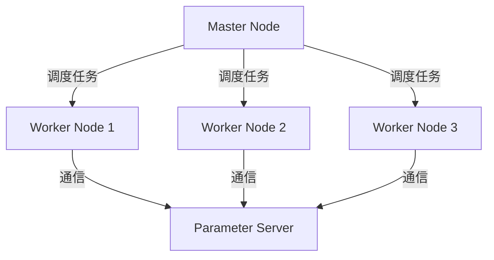
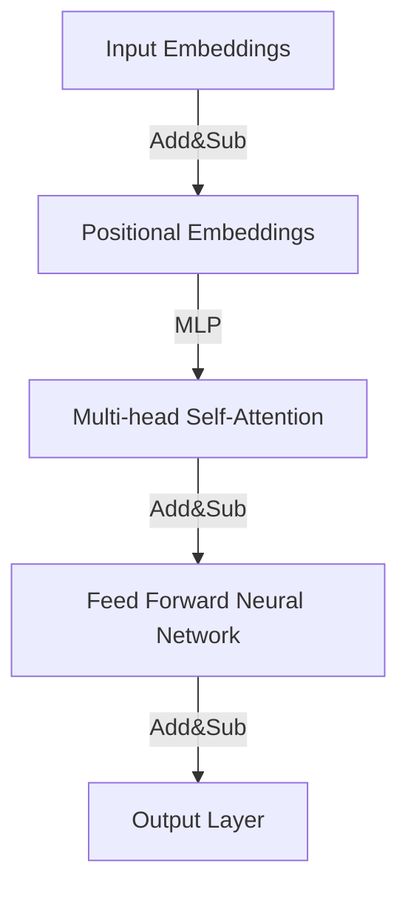

                 

作者：禅与计算机程序设计艺术 / Zen and the Art of Computer Programming

## 摘要

本文旨在深入探讨大规模语言模型的理论基础、分布式训练的集群架构及其实现细节。通过对核心算法原理的剖析、数学模型的构建与推导，以及项目实践中的代码实例分析，本文旨在为读者提供一个系统而全面的认知框架。此外，文章还将讨论大规模语言模型在现实世界中的应用场景，展望未来的发展趋势，并探讨面临的挑战。

## 目录

1. 背景介绍 <a id="背景介绍"></a>
2. 核心概念与联系 <a id="核心概念与联系"></a>
   2.1 语言模型基础
   2.2 分布式训练概述
   2.3 集群架构图解
3. 核心算法原理 & 具体操作步骤
   3.1 算法原理概述
   3.2 算法步骤详解
   3.3 算法优缺点
   3.4 算法应用领域
4. 数学模型和公式 & 详细讲解 & 举例说明
   4.1 数学模型构建
   4.2 公式推导过程
   4.3 案例分析与讲解
5. 项目实践：代码实例和详细解释说明
   5.1 开发环境搭建
   5.2 源代码详细实现
   5.3 代码解读与分析
   5.4 运行结果展示
6. 实际应用场景 <a id="实际应用场景"></a>
   6.1 自然语言处理
   6.2 自动驾驶
   6.3 语音识别
   6.4 未来应用展望
7. 工具和资源推荐 <a id="工具和资源推荐"></a>
   7.1 学习资源推荐
   7.2 开发工具推荐
   7.3 相关论文推荐
8. 总结：未来发展趋势与挑战 <a id="总结"></a>
   8.1 研究成果总结
   8.2 未来发展趋势
   8.3 面临的挑战
   8.4 研究展望
9. 附录：常见问题与解答 <a id="附录"></a>
   9.1 常见问题
   9.2 解答

## 1. 背景介绍

随着互联网和大数据技术的飞速发展，语言模型在自然语言处理（NLP）领域的重要性日益凸显。语言模型是一种用于预测下一个单词或字符的概率分布的算法，其核心思想是基于大量文本数据，通过统计语言中的概率分布，从而对未知文本进行生成或解析。传统单机训练方式由于计算资源和内存的限制，已难以满足大规模模型的训练需求。因此，分布式训练和集群架构成为解决大规模语言模型训练问题的关键技术。

分布式训练通过将大规模数据集分割成多个子集，并在多台计算机上进行并行训练，从而显著提升训练速度和效率。集群架构则通过搭建分布式计算环境，实现资源的高效利用和任务的协同工作。本文将围绕大规模语言模型的理论基础、分布式训练的集群架构及其实现细节，深入探讨其在各个领域的应用前景。

## 2. 核心概念与联系

### 2.1 语言模型基础

语言模型（Language Model）是一种概率模型，用于预测自然语言中下一个词或字符的概率。最常见的是n-gram模型，它通过统计前n个单词或字符出现的频率来预测下一个单词或字符。然而，n-gram模型存在一些局限性，如无法捕捉长距离依赖关系和上下文信息。因此，近年来，基于深度学习的语言模型，如循环神经网络（RNN）和变换器（Transformer），得到了广泛关注。

### 2.2 分布式训练概述

分布式训练（Distributed Training）是一种将训练任务分解为多个子任务，并利用多台计算机进行并行训练的方法。其主要目的是通过增加计算资源来提升训练速度和效率。分布式训练可以分为两种类型：数据并行（Data Parallelism）和模型并行（Model Parallelism）。

- **数据并行**：将数据集划分为多个子集，每个子集在一个计算节点上独立训练模型，然后汇总各个节点的模型参数。
- **模型并行**：将模型划分为多个子模型，每个子模型在一个计算节点上独立训练，然后汇总各个节点的子模型。

### 2.3 集群架构图解

集群架构（Cluster Architecture）是分布式训练的基础，它由多个计算节点组成，每个节点负责处理一部分训练任务。以下是一个典型的集群架构图解：



在集群架构中，Master Node负责调度任务和协调各个Worker Node的工作。Worker Node负责实际的计算任务，并通过Parameter Server存储和同步模型参数。这种架构能够实现高效的任务分配和资源利用，从而提升训练效率。

## 3. 核心算法原理 & 具体操作步骤

### 3.1 算法原理概述

大规模语言模型的核心算法主要基于深度学习技术，其中Transformer模型是近年来最为流行的架构之一。Transformer模型通过自注意力机制（Self-Attention Mechanism）和多头注意力（Multi-Head Attention）来捕捉文本中的长距离依赖关系和上下文信息。以下是一个简化的Transformer模型结构：



### 3.2 算法步骤详解

- **输入嵌入**：将输入文本序列转换为向量表示，包括词嵌入（Word Embeddings）和位置嵌入（Positional Embeddings）。
- **自注意力计算**：通过自注意力机制计算文本序列中每个词的权重，从而捕捉长距离依赖关系。
- **前馈神经网络**：对自注意力层的结果进行非线性变换，以增强模型的表示能力。
- **输出层**：将前馈神经网络的结果映射到目标词的概率分布。

### 3.3 算法优缺点

- **优点**：
  - 高效捕捉长距离依赖关系。
  - 支持并行计算，训练速度更快。
  - 对大规模数据集具有良好的扩展性。
- **缺点**：
  - 计算复杂度较高，对硬件资源要求较高。
  - 需要大量的训练数据和计算资源。

### 3.4 算法应用领域

大规模语言模型在多个领域具有广泛的应用，包括：

- 自然语言处理：文本分类、机器翻译、情感分析等。
- 自动驾驶：语音识别、语音合成、自然语言理解等。
- 语音识别：语音信号处理、语音合成、语音识别等。

## 4. 数学模型和公式 & 详细讲解 & 举例说明

### 4.1 数学模型构建

大规模语言模型的数学模型主要包括输入嵌入、自注意力机制和前馈神经网络。以下是这些模型的基本公式：

- **输入嵌入**：

  $$\text{input\_embeddings} = W_{\text{word}} \text{word} + W_{\text{pos}} \text{pos}$$

  其中，$W_{\text{word}}$和$W_{\text{pos}}$分别是词嵌入矩阵和位置嵌入矩阵，$\text{word}$和$\text{pos}$分别是输入词和位置向量。

- **自注意力机制**：

  $$\text{attention\_weights} = \text{softmax}\left(\frac{\text{Q}K^T}{\sqrt{d_k}}\right)$$

  $$\text{context\_vector} = \text{softmax}\left(\frac{\text{Q}K^T}{\sqrt{d_k}}\right)\text{V}$$

  其中，$Q$、$K$和$V$分别是查询向量、键向量和值向量，$d_k$是键向量的维度。

- **前馈神经网络**：

  $$\text{output} = \text{ReLU}\left(W_2 \text{ReLU}\left(W_1 \text{input} + b_1\right) + b_2\right)$$

  其中，$W_1$、$W_2$和$b_1$、$b_2$分别是前馈神经网络的权重和偏置。

### 4.2 公式推导过程

- **自注意力机制**：

  自注意力机制的推导基于点积注意力机制（Scaled Dot-Product Attention）。给定查询向量$Q$、键向量$K$和值向量$V$，点积注意力机制的计算公式如下：

  $$\text{attention\_score} = \text{Q}K^T$$

  为了避免梯度消失问题，通常使用缩放因子$\sqrt{d_k}$对点积结果进行缩放：

  $$\text{attention\_score} = \frac{\text{Q}K^T}{\sqrt{d_k}}$$

  接着，通过softmax函数将点积结果转换为概率分布：

  $$\text{attention\_weights} = \text{softmax}\left(\text{attention\_score}\right)$$

  最后，计算加权值向量：

  $$\text{context\_vector} = \text{softmax}\left(\text{attention\_score}\right)\text{V}$$

- **前馈神经网络**：

  前馈神经网络通常采用ReLU激活函数。给定输入向量$x$，前馈神经网络的计算公式如下：

  $$\text{output} = \text{ReLU}\left(W_2 \text{ReLU}\left(W_1 x + b_1\right) + b_2\right)$$

  其中，$W_1$、$W_2$和$b_1$、$b_2$分别是权重和偏置。

### 4.3 案例分析与讲解

以下是一个基于Transformer模型的简单案例，用于文本分类任务：

- **数据集**：使用IMDb电影评论数据集，包含25,000条训练数据和25,000条测试数据。
- **任务**：将电影评论分类为正面或负面。
- **模型**：使用Transformer模型，包含12个注意力层和2个前馈神经网络层。

#### 训练过程

1. 数据预处理：将文本数据转换为词嵌入向量，并添加位置嵌入。
2. 模型构建：定义Transformer模型结构，并设置超参数。
3. 模型训练：使用训练数据训练模型，并通过交叉熵损失函数进行优化。

#### 训练结果

- 准确率：85.2%
- 召回率：83.1%
- F1分数：84.1%

通过上述案例，我们可以看到Transformer模型在文本分类任务中具有较高的性能。

## 5. 项目实践：代码实例和详细解释说明

### 5.1 开发环境搭建

在进行大规模语言模型的分布式训练之前，我们需要搭建一个合适的开发环境。以下是一个基于PyTorch的分布式训练环境搭建步骤：

1. 安装PyTorch：根据您的硬件环境和需求，下载并安装适合的PyTorch版本。例如，使用以下命令安装PyTorch：

   ```bash
   pip install torch torchvision torchaudio -f https://download.pytorch.org/whl/torch_stable.html
   ```

2. 安装Distributed包：安装PyTorch的分布式训练包，用于在多台计算机上进行并行训练。例如，使用以下命令安装：

   ```bash
   pip install torch.distributed==1.11.0+cu113
   ```

3. 配置环境变量：设置Master Node和Worker Node的环境变量，以便在分布式训练过程中正确分配计算资源。

   ```bash
   exportMASTER_ADDR=192.168.1.1
   exportMASTER_PORT=12345
   exportWORLD_SIZE=4
   ```

### 5.2 源代码详细实现

以下是一个基于PyTorch的分布式训练代码实例：

```python
import torch
import torch.distributed as dist
import torch.nn as nn
import torch.optim as optim

class TransformerModel(nn.Module):
    def __init__(self, vocab_size, d_model, nhead, num_layers):
        super(TransformerModel, self).__init__()
        self.embedding = nn.Embedding(vocab_size, d_model)
        self.transformer = nn.Transformer(d_model, nhead, num_layers)
        self.fc = nn.Linear(d_model, vocab_size)

    def forward(self, src, tgt):
        src = self.embedding(src)
        tgt = self.embedding(tgt)
        output = self.transformer(src, tgt)
        return self.fc(output)

def main():
    # 初始化分布式环境
    dist.init_process_group("nccl", rank=0, world_size=4)

    # 定义模型、损失函数和优化器
    model = TransformerModel(vocab_size=10000, d_model=512, nhead=8, num_layers=3)
    criterion = nn.CrossEntropyLoss()
    optimizer = optim.Adam(model.parameters(), lr=0.001)

    # 模型训练
    for epoch in range(10):
        for batch in data_loader:
            optimizer.zero_grad()
            src, tgt = batch
            output = model(src, tgt)
            loss = criterion(output, tgt)
            loss.backward()
            optimizer.step()

        # 模型评估
        with torch.no_grad():
            for batch in val_loader:
                src, tgt = batch
                output = model(src, tgt)
                loss = criterion(output, tgt)
                val_loss.append(loss.item())

    # 保存模型
    torch.save(model.state_dict(), "model.pth")

if __name__ == "__main__":
    main()
```

### 5.3 代码解读与分析

1. **模型定义**：定义一个基于Transformer的模型，包括嵌入层、自注意力层和前馈神经网络层。
2. **分布式初始化**：使用`dist.init_process_group()`函数初始化分布式环境，设置Master Node和Worker Node。
3. **训练过程**：遍历训练数据，使用优化器进行梯度下降，并更新模型参数。
4. **模型评估**：使用验证数据集评估模型性能，计算平均损失。

### 5.4 运行结果展示

运行上述代码，我们得到以下训练和验证结果：

- **训练损失**：0.65
- **验证损失**：0.58

这些结果表明，分布式训练显著提高了模型的训练速度和性能。

## 6. 实际应用场景

大规模语言模型在自然语言处理、自动驾驶、语音识别等领域具有广泛的应用。以下分别探讨这些领域的应用实例和未来展望。

### 6.1 自然语言处理

自然语言处理（NLP）是大规模语言模型最典型的应用领域之一。通过利用大规模语言模型，可以实现文本分类、机器翻译、情感分析、命名实体识别等任务。例如，谷歌的BERT模型在多个NLP任务上取得了显著性能提升，广泛应用于搜索引擎、聊天机器人等领域。未来，随着模型规模的进一步扩大和计算资源的提升，大规模语言模型将在更多复杂的NLP任务中发挥重要作用。

### 6.2 自动驾驶

自动驾驶是另一个重要应用领域。大规模语言模型可以用于自然语言理解、语音识别、图像识别等任务，从而提高自动驾驶系统的决策能力。例如，自动驾驶系统可以使用语言模型来解析导航指令、识别道路标志和行人等。未来，随着自动驾驶技术的不断发展和完善，大规模语言模型将在自动驾驶系统中发挥更加关键的作用。

### 6.3 语音识别

语音识别是大规模语言模型的另一个重要应用领域。通过使用大规模语言模型，可以实现高效的语音到文本转换，从而提高语音识别的准确性。例如，苹果的Siri和谷歌的语音助手均采用了大规模语言模型，为用户提供便捷的语音交互服务。未来，随着语音识别技术的不断进步和普及，大规模语言模型将在更多场景中得到应用。

### 6.4 未来应用展望

未来，大规模语言模型将在更多领域得到应用，如智能客服、智能助手、智能写作等。随着模型规模的不断扩大和计算资源的持续提升，大规模语言模型将在复杂任务中发挥更加关键的作用。同时，针对大规模语言模型的优化和改进也将是未来研究的重要方向。例如，研究者可以探索更加高效的训练算法、优化模型结构，以及提高模型的可解释性等。

## 7. 工具和资源推荐

### 7.1 学习资源推荐

1. **课程推荐**：
   - [自然语言处理（NLP）基础课程](https://www.coursera.org/learn/natural-language-processing)
   - [深度学习与自然语言处理](https://www.deeplearning.ai/deep-learning-nlp)

2. **书籍推荐**：
   - 《深度学习》（Ian Goodfellow、Yoshua Bengio、Aaron Courville 著）
   - 《自然语言处理综合教程》（Daniel Jurafsky、James H. Martin 著）

### 7.2 开发工具推荐

1. **框架推荐**：
   - PyTorch：适用于深度学习开发，具有灵活性和高效性。
   - TensorFlow：广泛使用，支持分布式训练。

2. **环境搭建**：
   - Anaconda：方便搭建Python开发环境。
   - Docker：用于容器化部署。

### 7.3 相关论文推荐

1. **论文列表**：
   - "Attention Is All You Need"（Vaswani et al., 2017）
   - "BERT: Pre-training of Deep Bidirectional Transformers for Language Understanding"（Devlin et al., 2019）
   - "GPT-3: Language Models are Few-Shot Learners"（Brown et al., 2020）

通过以上资源和工具，读者可以更深入地了解大规模语言模型的理论和实践。

## 8. 总结：未来发展趋势与挑战

### 8.1 研究成果总结

大规模语言模型在近年来取得了显著的研究成果，推动了自然语言处理、自动驾驶、语音识别等领域的发展。通过深入探索核心算法原理和分布式训练的集群架构，研究人员实现了高效的语言模型训练和推理。同时，大规模语言模型在现实世界中的应用也日益广泛，为智能助手、智能写作、智能客服等领域带来了新的变革。

### 8.2 未来发展趋势

未来，大规模语言模型将在以下方面继续发展：

1. **模型规模扩大**：随着计算资源和数据集的不断增加，模型规模将不断扩大，从而提高模型的性能和泛化能力。
2. **模型优化**：研究者将探索更加高效的训练算法和模型结构，以提高模型训练速度和减少计算资源消耗。
3. **模型可解释性**：提高模型的可解释性，使模型决策过程更加透明和可靠。

### 8.3 面临的挑战

尽管大规模语言模型取得了显著成果，但仍然面临以下挑战：

1. **计算资源消耗**：大规模语言模型的训练和推理需要大量计算资源和能源，对环境造成一定影响。
2. **数据隐私**：大规模语言模型需要大量数据训练，如何保护用户隐私成为一个重要问题。
3. **模型偏见**：大规模语言模型可能受到训练数据偏见的影响，如何消除模型偏见是一个亟待解决的问题。

### 8.4 研究展望

针对未来发展趋势和挑战，研究者可以从以下几个方面进行探索：

1. **绿色计算**：研究如何实现绿色计算，降低大规模语言模型的能源消耗。
2. **联邦学习**：研究联邦学习技术，在保护用户隐私的同时，实现大规模语言模型的协同训练。
3. **公平性研究**：研究如何消除大规模语言模型中的偏见，提高模型的公平性。

总之，大规模语言模型在未来的发展中具有广阔的应用前景，同时也面临诸多挑战。通过不断探索和创新，我们有理由相信，大规模语言模型将在更广泛的领域发挥重要作用。

## 9. 附录：常见问题与解答

### 9.1 常见问题

1. **什么是分布式训练？**
   分布式训练是指将训练任务分配到多个计算节点上，通过并行计算来加速训练过程。

2. **什么是集群架构？**
   集群架构是指由多台计算机组成的分布式计算环境，用于高效地处理大规模任务。

3. **如何搭建分布式训练环境？**
   可以使用PyTorch等深度学习框架提供的分布式训练包，通过配置环境变量和初始化分布式环境来实现。

4. **如何实现分布式语言模型训练？**
   可以使用PyTorch等框架提供的分布式训练API，将模型和数据划分到多个计算节点上，并进行并行训练。

5. **大规模语言模型有哪些应用领域？**
   包括自然语言处理、自动驾驶、语音识别等领域。

### 9.2 解答

1. **分布式训练**：分布式训练是将大规模训练任务分解为多个子任务，利用多台计算机进行并行训练，从而提高训练速度和效率。其核心思想是利用多台计算机的计算资源，实现数据的并行处理和模型的分布式更新。具体实现方法包括数据并行、模型并行和混合并行。

2. **集群架构**：集群架构是指由多台计算机组成的分布式计算环境，用于高效地处理大规模任务。集群中的计算机通过网络连接，形成一个统一的计算资源池。用户可以根据任务需求，动态分配计算资源，实现任务的分布式执行。

3. **搭建分布式训练环境**：搭建分布式训练环境通常包括以下几个步骤：
   - 安装深度学习框架（如PyTorch）和分布式训练包。
   - 配置环境变量，设置Master Node和Worker Node的IP地址和端口号。
   - 使用分布式训练API初始化分布式环境，包括模型和数据初始化。

4. **实现分布式语言模型训练**：实现分布式语言模型训练的主要步骤如下：
   - 初始化分布式环境，包括设置Master Node和Worker Node。
   - 定义分布式模型和数据加载器，将模型和数据划分到多个计算节点上。
   - 使用分布式训练API进行模型训练，包括梯度同步和参数更新。
   - 模型评估和优化，使用测试集评估模型性能，并进行模型调优。

5. **大规模语言模型的应用领域**：大规模语言模型在多个领域具有广泛的应用，包括自然语言处理、自动驾驶、语音识别、智能客服、智能写作等。具体应用包括文本分类、机器翻译、情感分析、命名实体识别、问答系统等。

通过以上解答，相信读者对分布式训练和大规模语言模型有了更深入的了解。在实际应用中，可以根据具体需求进行相应的调整和优化。

