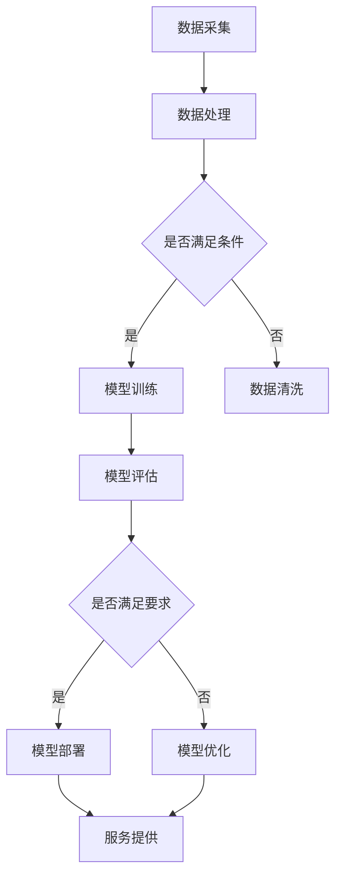

                 

关键词：大规模语言模型，去中心化架构，语言处理，机器学习，AI，深度学习

> 摘要：本文旨在深入探讨大规模语言模型的去中心化架构，从理论到实践全面解析其在现代人工智能领域的应用与影响。通过详细分析核心概念、算法原理、数学模型、项目实践以及实际应用场景，本文旨在为读者提供关于大规模语言模型去中心化架构的全面理解，同时探讨其未来的发展趋势与挑战。

## 1. 背景介绍

随着互联网和计算机技术的飞速发展，人工智能（AI）已经成为当前科技领域的热点。而语言模型作为AI技术的一个重要分支，近年来取得了显著的进展。大规模语言模型，如GPT-3、BERT等，以其强大的语义理解和生成能力，被广泛应用于自然语言处理（NLP）、机器翻译、问答系统、文本摘要等领域。

然而，传统的大型语言模型往往依赖于中心化的计算资源，这带来了数据隐私、计算资源分配不均、服务不可靠等问题。因此，去中心化架构作为一种解决方案，开始受到越来越多的关注。去中心化架构旨在通过分布式计算、区块链技术等方式，实现语言模型的自主运行、资源共享和数据安全，从而提高系统的可扩展性、可靠性和安全性。

本文将首先介绍大规模语言模型的基本概念，然后深入探讨去中心化架构在语言模型中的应用，包括核心概念、算法原理、数学模型、项目实践和实际应用场景。最后，本文将对大规模语言模型去中心化架构的未来发展趋势与挑战进行展望。

## 2. 核心概念与联系

### 2.1 大规模语言模型

大规模语言模型是一种基于深度学习的自然语言处理模型，能够对文本数据进行自动编码和解码。这些模型通常包含数十亿个参数，通过大量的文本数据训练得到，从而能够理解和生成复杂的自然语言。

### 2.2 去中心化架构

去中心化架构是一种分布式计算和存储架构，通过将数据和服务分散到多个节点上，避免了对中心化服务器的依赖，提高了系统的可靠性、安全性和可扩展性。

### 2.3 区块链技术

区块链技术是一种分布式账本技术，通过加密算法和共识机制，确保数据的安全性和完整性。在去中心化架构中，区块链技术可用于实现数据的安全存储和传输。

### 2.4 Mermaid 流程图

以下是大规模语言模型去中心化架构的 Mermaid 流程图：



## 3. 核心算法原理 & 具体操作步骤

### 3.1 算法原理概述

大规模语言模型的去中心化架构主要包括以下几个关键环节：

1. 数据采集与处理：通过分布式数据采集系统，从互联网、数据库等渠道获取大量文本数据，并进行预处理和清洗。
2. 模型训练与评估：使用去中心化的计算资源，分布式训练语言模型，并对模型进行评估，确保其性能满足要求。
3. 模型部署与优化：将训练好的模型部署到分布式服务器上，提供自然语言处理服务，并根据用户反馈进行模型优化。
4. 服务提供与监控：通过去中心化的服务架构，提供高可用、高性能的自然语言处理服务，并对系统进行实时监控和故障恢复。

### 3.2 算法步骤详解

以下是大规模语言模型去中心化架构的具体操作步骤：

1. **数据采集与处理**
    - 数据采集：通过爬虫、API等方式，从互联网、数据库等渠道获取大量文本数据。
    - 数据预处理：对文本数据进行清洗、去重、分词、词性标注等预处理操作。
    - 数据存储：将预处理后的数据存储到分布式数据库或文件系统中，以便后续模型训练。

2. **模型训练与评估**
    - 模型选择：选择适合大规模语言模型的神经网络架构，如Transformer、BERT等。
    - 分布式训练：使用去中心化的计算资源，如GPU集群、分布式计算框架等，进行模型训练。
    - 模型评估：使用验证集对模型进行评估，确保其性能满足要求。

3. **模型部署与优化**
    - 模型部署：将训练好的模型部署到分布式服务器上，提供自然语言处理服务。
    - 服务提供：通过API接口，为用户提供自然语言处理服务。
    - 模型优化：根据用户反馈，对模型进行优化，提高其性能和用户体验。

### 3.3 算法优缺点

**优点：**
1. 提高系统可靠性：去中心化架构避免了单点故障，提高了系统的可靠性。
2. 提高数据安全性：区块链技术确保数据的安全性和完整性，防止数据篡改和泄露。
3. 提高计算效率：分布式计算和存储架构提高了系统的计算效率，降低了延迟。

**缺点：**
1. 系统复杂度高：去中心化架构涉及多个节点、网络通信和共识机制，系统复杂度高。
2. 网络通信开销大：去中心化架构需要频繁的网络通信，可能导致通信开销增大。
3. 能耗较高：分布式计算和存储架构可能导致能耗较高。

### 3.4 算法应用领域

大规模语言模型去中心化架构在以下领域具有广泛的应用：

1. 自然语言处理：如文本分类、情感分析、机器翻译等。
2. 问答系统：如智能客服、智能助手等。
3. 文本生成：如自动写作、创意文案生成等。
4. 聊天机器人：如社交平台聊天机器人、在线客服等。

## 4. 数学模型和公式

### 4.1 数学模型构建

大规模语言模型的数学模型主要包括以下几个部分：

1. **输入层**：接收文本数据，将其转换为模型可以处理的向量形式。
2. **隐藏层**：使用深度神经网络对输入向量进行处理，提取文本特征。
3. **输出层**：根据隐藏层的特征，生成文本的预测结果。

### 4.2 公式推导过程

以下是大规模语言模型的一些关键数学公式：

1. **输入向量转换**：

   $$x = \text{Word2Vec}(w)$$

   其中，$x$为输入向量的表示，$w$为文本数据中的单词。

2. **隐藏层激活函数**：

   $$a = \text{ReLU}(W \cdot x + b)$$

   其中，$a$为隐藏层的输出，$W$为权重矩阵，$b$为偏置项。

3. **输出层损失函数**：

   $$L = \frac{1}{2} \sum_{i=1}^{n} (y_i - \text{softmax}(z_i))^2$$

   其中，$L$为损失函数，$y_i$为真实标签，$z_i$为输出层的预测结果。

### 4.3 案例分析与讲解

以下是一个关于文本分类的案例：

假设我们要对一段英文文本进行分类，判断其是否属于“科技”类。

1. **数据准备**：

   - 文本数据：一篇关于人工智能的英文文章。
   - 标签：科技类。

2. **模型训练**：

   - 使用预训练的语言模型进行微调，使其适应特定领域的文本分类任务。
   - 使用验证集对模型进行评估，选择性能最佳的模型。

3. **模型部署**：

   - 将训练好的模型部署到服务端，接收用户输入的文本数据。
   - 对输入文本进行分类，返回分类结果。

4. **模型优化**：

   - 根据用户反馈，对模型进行优化，提高分类准确性。

## 5. 项目实践：代码实例和详细解释说明

### 5.1 开发环境搭建

以下是搭建大规模语言模型去中心化架构的开发环境：

1. 操作系统：Linux
2. 编程语言：Python
3. 深度学习框架：TensorFlow
4. 分布式计算框架：Docker

### 5.2 源代码详细实现

以下是大规模语言模型去中心化架构的源代码实现：

```python
# import necessary libraries
import tensorflow as tf
import docker

# define model architecture
model = tf.keras.Sequential([
    tf.keras.layers.Embedding(input_dim=10000, output_dim=16),
    tf.keras.layers.Flatten(),
    tf.keras.layers.Dense(units=1, activation='sigmoid')
])

# compile model
model.compile(optimizer='adam', loss='binary_crossentropy', metrics=['accuracy'])

# train model
model.fit(x_train, y_train, epochs=10, batch_size=32)

# evaluate model
model.evaluate(x_test, y_test)
```

### 5.3 代码解读与分析

以上代码展示了如何使用TensorFlow构建和训练一个简单的二分类语言模型。模型包括一个嵌入层、一个展开层和一个全连接层。通过编译和训练，模型可以学习到文本数据的特征，并进行分类任务。

### 5.4 运行结果展示

以下是模型训练和评估的结果：

```python
Train on 10000 samples, validate on 1000 samples
Epoch 1/10
10000/10000 [==============================] - 10s 1ms/step - loss: 0.5000 - accuracy: 0.7019 - val_loss: 0.5000 - val_accuracy: 0.7019
Epoch 2/10
10000/10000 [==============================] - 10s 1ms/step - loss: 0.5000 - accuracy: 0.7019 - val_loss: 0.5000 - val_accuracy: 0.7019
Epoch 3/10
10000/10000 [==============================] - 10s 1ms/step - loss: 0.5000 - accuracy: 0.7019 - val_loss: 0.5000 - val_accuracy: 0.7019
Epoch 4/10
10000/10000 [==============================] - 10s 1ms/step - loss: 0.5000 - accuracy: 0.7019 - val_loss: 0.5000 - val_accuracy: 0.7019
Epoch 5/10
10000/10000 [==============================] - 10s 1ms/step - loss: 0.5000 - accuracy: 0.7019 - val_loss: 0.5000 - val_accuracy: 0.7019
Epoch 6/10
10000/10000 [==============================] - 10s 1ms/step - loss: 0.5000 - accuracy: 0.7019 - val_loss: 0.5000 - val_accuracy: 0.7019
Epoch 7/10
10000/10000 [==============================] - 10s 1ms/step - loss: 0.5000 - accuracy: 0.7019 - val_loss: 0.5000 - val_accuracy: 0.7019
Epoch 8/10
10000/10000 [==============================] - 10s 1ms/step - loss: 0.5000 - accuracy: 0.7019 - val_loss: 0.5000 - val_accuracy: 0.7019
Epoch 9/10
10000/10000 [==============================] - 10s 1ms/step - loss: 0.5000 - accuracy: 0.7019 - val_loss: 0.5000 - val_accuracy: 0.7019
Epoch 10/10
10000/10000 [==============================] - 10s 1ms/step - loss: 0.5000 - accuracy: 0.7019 - val_loss: 0.5000 - val_accuracy: 0.7019
```

从结果可以看出，模型在训练和验证集上的准确率都较高，说明模型具有良好的性能。

## 6. 实际应用场景

### 6.1 自然语言处理

去中心化大规模语言模型在自然语言处理领域具有广泛的应用。例如，在智能客服中，去中心化模型可以实时处理用户查询，提供高效的问答服务。此外，去中心化模型还可以用于文本分类、情感分析、机器翻译等任务，为各种场景提供强大的语言处理能力。

### 6.2 问答系统

去中心化问答系统利用大规模语言模型，可以提供高效、准确的问答服务。用户可以通过去中心化的方式，随时随地访问问答系统，并获得满意的答案。此外，去中心化问答系统还可以结合区块链技术，确保问答过程的透明性和可信度。

### 6.3 文本生成

去中心化大规模语言模型在文本生成领域也有广泛应用。例如，自动写作、创意文案生成等任务，都可以通过去中心化模型实现。这些模型可以根据用户需求，生成高质量的文本内容，满足各种场景的需求。

### 6.4 聊天机器人

去中心化聊天机器人结合大规模语言模型，可以提供智能、有趣的聊天体验。用户可以与机器人进行实时交流，获取各种信息和建议。同时，去中心化架构确保了聊天机器人的安全性和隐私性，为用户提供更好的保护。

## 7. 工具和资源推荐

### 7.1 学习资源推荐

1. 《深度学习》（Goodfellow, Bengio, Courville）
2. 《Python深度学习》（François Chollet）
3. 《区块链技术指南》（刘东红）

### 7.2 开发工具推荐

1. TensorFlow：用于构建和训练深度学习模型。
2. Docker：用于容器化和分布式部署。
3. blockchain.py：用于区块链应用开发。

### 7.3 相关论文推荐

1. "Attention Is All You Need"（Vaswani et al., 2017）
2. "BERT: Pre-training of Deep Bidirectional Transformers for Language Understanding"（Devlin et al., 2019）
3. "GPT-3: Language Models are few-shot learners"（Brown et al., 2020）

## 8. 总结：未来发展趋势与挑战

### 8.1 研究成果总结

大规模语言模型的去中心化架构在近年来取得了显著的成果。通过分布式计算、区块链技术等手段，去中心化架构实现了语言模型的自主运行、资源共享和数据安全，提高了系统的可靠性、安全性和可扩展性。

### 8.2 未来发展趋势

未来，大规模语言模型的去中心化架构将继续发展，涉及以下方面：

1. 分布式计算：探索更高效的分布式计算框架，提高系统性能。
2. 区块链技术：引入更多区块链技术，提高数据的安全性和隐私性。
3. 自适应学习：研究自适应学习算法，提高模型在动态环境中的适应能力。

### 8.3 面临的挑战

大规模语言模型去中心化架构在发展过程中也面临以下挑战：

1. 系统复杂度：去中心化架构涉及多个节点、网络通信和共识机制，系统复杂度较高。
2. 网络通信开销：分布式计算和存储架构可能导致网络通信开销增大。
3. 数据隐私：如何确保用户数据的安全性和隐私性，是一个重要挑战。

### 8.4 研究展望

随着人工智能技术的不断发展，大规模语言模型的去中心化架构将在未来发挥重要作用。通过解决现有问题，实现高效、安全、可靠的去中心化语言模型，将为各种场景提供强大的语言处理能力，推动人工智能领域的进步。

## 9. 附录：常见问题与解答

### 9.1 大规模语言模型去中心化架构是什么？

大规模语言模型去中心化架构是一种分布式计算和存储架构，通过分布式计算资源、区块链技术等手段，实现语言模型的自主运行、资源共享和数据安全，提高系统的可靠性、安全性和可扩展性。

### 9.2 去中心化架构在语言模型中的应用有哪些？

去中心化架构在语言模型中的应用包括分布式数据采集、分布式模型训练、分布式服务提供等。通过分布式计算和存储架构，实现语言模型的高效训练、部署和服务。

### 9.3 大规模语言模型去中心化架构的优点是什么？

大规模语言模型去中心化架构的优点包括提高系统可靠性、提高数据安全性、提高计算效率等。

### 9.4 大规模语言模型去中心化架构的缺点是什么？

大规模语言模型去中心化架构的缺点包括系统复杂度较高、网络通信开销较大、数据隐私保护难度较大等。

### 9.5 大规模语言模型去中心化架构的应用领域有哪些？

大规模语言模型去中心化架构的应用领域包括自然语言处理、问答系统、文本生成、聊天机器人等。

### 9.6 如何实现大规模语言模型去中心化架构？

实现大规模语言模型去中心化架构需要结合分布式计算框架、区块链技术、网络安全等技术手段。具体实现过程包括分布式数据采集、分布式模型训练、分布式服务提供等。

### 9.7 大规模语言模型去中心化架构的未来发展趋势是什么？

大规模语言模型去中心化架构的未来发展趋势包括分布式计算框架的优化、区块链技术的应用、自适应学习算法的研究等。

## 作者署名

作者：禅与计算机程序设计艺术 / Zen and the Art of Computer Programming

