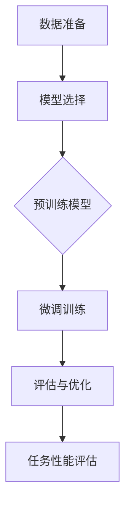

                 

关键词：大规模语言模型、有监督微调、神经网络、深度学习、文本生成、自然语言处理、语义理解

摘要：本文旨在深入探讨大规模语言模型的构建方法，特别是有监督微调技术，从理论基础到实际应用进行全面剖析。文章首先介绍了大规模语言模型的基本概念和构建方法，接着详细阐述了有监督微调的原理和步骤，随后通过数学模型和实际代码实例，展示了如何将理论转化为实践。最后，文章讨论了大规模语言模型在不同应用场景中的实际效果，并展望了其未来发展趋势与挑战。

## 1. 背景介绍

随着互联网的迅猛发展，自然语言处理（Natural Language Processing, NLP）已成为人工智能领域的一个重要分支。从简单的文本分类到复杂的语义理解，NLP技术正在逐渐改变人们的生活方式。而大规模语言模型（Large-scale Language Models）作为NLP的核心技术之一，近年来取得了令人瞩目的进展。

大规模语言模型是指通过深度学习算法对大规模文本数据进行训练，从而构建出能够对自然语言进行理解和生成的复杂模型。这些模型通常包含数十亿个参数，能够在各种NLP任务中表现出优异的性能，如机器翻译、文本生成、问答系统等。

有监督微调（Supervised Fine-tuning）是一种在大规模语言模型基础上，针对特定任务进行训练的方法。其核心思想是将预训练的模型迁移到特定任务上，通过微调模型参数来提高任务性能。这种方法的优势在于能够充分利用预训练模型对语言知识的积累，从而提高模型在特定任务上的泛化能力。

本文将围绕大规模语言模型的构建方法和有监督微调技术进行深入探讨，旨在为读者提供从理论到实践的全景视图。

## 2. 核心概念与联系

### 2.1. 大规模语言模型

大规模语言模型是指通过对大量文本数据进行训练，构建出一个具有高度语言理解和生成能力的复杂模型。这些模型通常采用深度学习算法，如神经网络（Neural Networks）和变换器（Transformers）等。

神经网络是一种由大量神经元组成的计算模型，通过调整神经元之间的连接权重来学习数据特征。变换器是一种特殊的神经网络结构，最早由Google提出，并在自然语言处理任务中取得了突破性的成果。

### 2.2. 预训练与微调

预训练（Pre-training）是指在大规模数据集上对模型进行初始训练，使其掌握基本的语言理解和生成能力。微调（Fine-tuning）则是在预训练的基础上，针对特定任务对模型进行进一步训练，以优化模型在特定任务上的性能。

### 2.3. 有监督微调

有监督微调是一种在大规模语言模型基础上，通过有监督学习进行微调的方法。其核心思想是将预训练的模型迁移到特定任务上，通过最小化预测损失函数来优化模型参数。这种方法通常包括以下步骤：

1. **数据准备**：收集并整理与任务相关的数据集。
2. **模型选择**：选择一个预训练的模型作为基础模型。
3. **微调训练**：在特定任务上对模型进行微调训练，优化模型参数。
4. **评估与优化**：评估模型在特定任务上的性能，并根据评估结果进行进一步优化。

### 2.4. Mermaid 流程图

以下是一个简化的有监督微调流程图：



## 3. 核心算法原理 & 具体操作步骤

### 3.1. 算法原理概述

有监督微调算法的核心思想是利用预训练模型在特定任务上的泛化能力，通过微调模型参数来提高任务性能。具体来说，有监督微调算法包括以下几个步骤：

1. **数据准备**：收集并整理与任务相关的数据集，对数据进行预处理，如分词、去停用词等。
2. **模型选择**：选择一个预训练的大规模语言模型作为基础模型，如BERT、GPT等。
3. **微调训练**：在特定任务上对模型进行微调训练，优化模型参数。通常使用有监督学习中的损失函数（如交叉熵损失函数）来评估模型预测结果与真实标签之间的差距。
4. **评估与优化**：评估模型在特定任务上的性能，根据评估结果对模型参数进行进一步优化。常用的评估指标包括准确率、召回率、F1值等。

### 3.2. 算法步骤详解

#### 3.2.1. 数据准备

数据准备是进行有监督微调的首要步骤。具体步骤如下：

1. **数据收集**：根据任务需求，收集与任务相关的数据集。
2. **数据预处理**：对收集到的数据进行预处理，如分词、去停用词、词向量表示等。
3. **数据切分**：将预处理后的数据集切分为训练集、验证集和测试集，用于模型训练、验证和评估。

#### 3.2.2. 模型选择

选择一个预训练的大规模语言模型作为基础模型。常用的预训练模型包括：

1. **BERT**：一种基于Transformer的预训练模型，由Google提出。
2. **GPT**：一种基于生成式预训练的模型，由OpenAI提出。
3. **RoBERTa**：一种基于BERT的改进模型，由Facebook AI提出。

#### 3.2.3. 微调训练

在特定任务上对模型进行微调训练。具体步骤如下：

1. **加载预训练模型**：从预训练模型库中加载预训练模型，如BERT。
2. **定义损失函数**：选择一个合适的损失函数，如交叉熵损失函数，用于评估模型预测结果与真实标签之间的差距。
3. **优化器选择**：选择一个优化器，如Adam优化器，用于更新模型参数。
4. **训练过程**：通过训练集对模型进行微调训练，不断优化模型参数。
5. **验证过程**：使用验证集对模型进行验证，评估模型在特定任务上的性能。

#### 3.2.4. 评估与优化

评估模型在特定任务上的性能，并根据评估结果对模型参数进行进一步优化。具体步骤如下：

1. **测试集评估**：使用测试集对模型进行最终评估，评估模型在特定任务上的性能。
2. **性能优化**：根据评估结果，对模型参数进行优化，提高模型在特定任务上的性能。

### 3.3. 算法优缺点

#### 优点

1. **高效性**：有监督微调算法能够在短时间内提高模型在特定任务上的性能，从而实现快速迭代和优化。
2. **迁移能力**：预训练模型在通用数据集上的训练使其具备一定的迁移能力，有助于提高模型在特定任务上的泛化能力。
3. **灵活性**：有监督微调算法可以根据任务需求对模型进行灵活调整，从而适应不同类型的任务。

#### 缺点

1. **数据依赖性**：有监督微调算法依赖于大量标注数据进行训练，数据质量对模型性能有重要影响。
2. **计算成本高**：大规模语言模型的训练需要大量的计算资源和时间，特别是在微调阶段。
3. **模型解释性差**：大规模语言模型通常具有高度非线性，难以解释其内部工作机制。

### 3.4. 算法应用领域

有监督微调算法广泛应用于各种自然语言处理任务，包括：

1. **文本分类**：对文本进行分类，如情感分析、新闻分类等。
2. **文本生成**：生成符合语法和语义规则的文本，如自动摘要、对话系统等。
3. **问答系统**：回答用户提出的问题，如搜索引擎、智能客服等。
4. **机器翻译**：将一种语言翻译成另一种语言，如机器翻译系统。

## 4. 数学模型和公式 & 详细讲解 & 举例说明

### 4.1. 数学模型构建

有监督微调算法的数学模型主要包括损失函数、优化器等。

#### 损失函数

在NLP任务中，常用的损失函数包括交叉熵损失函数（Cross-Entropy Loss）、均方误差损失函数（Mean Squared Error Loss）等。

$$
L(y, \hat{y}) = -\sum_{i=1}^{n} y_i \log(\hat{y}_i)
$$

其中，$y$表示真实标签，$\hat{y}$表示模型预测结果。

#### 优化器

常用的优化器包括Adam优化器（Adam Optimizer）和RMSprop优化器（RMSprop Optimizer）等。

$$
\theta_{t+1} = \theta_t - \alpha \cdot \frac{1}{\sqrt{1 - \beta_1^t}} \cdot \nabla_\theta J(\theta_t)
$$

其中，$\theta$表示模型参数，$\alpha$表示学习率，$J(\theta)$表示损失函数，$\beta_1$和$\beta_2$分别表示一阶和二阶动量项。

### 4.2. 公式推导过程

有监督微调算法的推导过程主要涉及损失函数和优化器的推导。

#### 损失函数推导

假设模型预测结果为$\hat{y}$，真实标签为$y$，则交叉熵损失函数的推导如下：

$$
L(y, \hat{y}) = -\sum_{i=1}^{n} y_i \log(\hat{y}_i)
$$

其中，$y_i$表示第$i$个样本的真实标签，$\hat{y}_i$表示第$i$个样本的模型预测结果。

#### 优化器推导

以Adam优化器为例，其推导过程如下：

$$
\theta_{t+1} = \theta_t - \alpha \cdot \frac{1}{\sqrt{1 - \beta_1^t}} \cdot \nabla_\theta J(\theta_t)
$$

其中，$\theta_t$表示第$t$次迭代时的模型参数，$\alpha$表示学习率，$\beta_1$和$\beta_2$分别表示一阶和二阶动量项。

### 4.3. 案例分析与讲解

#### 案例背景

假设我们有一个文本分类任务，需要将新闻文本分类为政治、经济、体育等类别。我们选择BERT模型作为基础模型，并进行有监督微调。

#### 数据准备

收集10000条新闻文本，并对其进行预处理，如分词、去停用词等。将预处理后的数据集切分为训练集、验证集和测试集。

#### 模型选择

从Hugging Face模型库中加载预训练的BERT模型。

```python
from transformers import BertTokenizer, BertModel
tokenizer = BertTokenizer.from_pretrained('bert-base-chinese')
model = BertModel.from_pretrained('bert-base-chinese')
```

#### 微调训练

使用训练集对BERT模型进行微调训练。

```python
from torch.utils.data import DataLoader, TensorDataset
from torch.optim import Adam

train_encodings = tokenizer(train_texts, truncation=True, padding=True, max_length=max_length)
train_encodings['input_ids'] = torch.tensor(train_encodings['input_ids'])
train_encodings['attention_mask'] = torch.tensor(train_encodings['attention_mask'])
train_dataset = TensorDataset(train_encodings['input_ids'], train_encodings['attention_mask'], train_labels)
train_loader = DataLoader(train_dataset, batch_size=batch_size)

optimizer = Adam(model.parameters(), lr=1e-5)

for epoch in range(num_epochs):
    model.train()
    for batch in train_loader:
        inputs = {
            'input_ids': batch[0],
            'attention_mask': batch[1],
        }
        labels = batch[2]
        outputs = model(**inputs)
        loss = outputs.loss
        optimizer.zero_grad()
        loss.backward()
        optimizer.step()
```

#### 评估与优化

使用验证集对模型进行评估，并根据评估结果对模型参数进行优化。

```python
from sklearn.metrics import accuracy_score

model.eval()
predictions = []
ground_truths = []

for batch in valid_loader:
    inputs = {
        'input_ids': batch[0],
        'attention_mask': batch[1],
    }
    with torch.no_grad():
        outputs = model(**inputs)
    logits = outputs.logits
    predictions.extend(torch.argmax(logits, dim=-1).cpu().numpy())
    ground_truths.extend(batch[2].cpu().numpy())

accuracy = accuracy_score(ground_truths, predictions)
print(f'Validation Accuracy: {accuracy}')
```

## 5. 项目实践：代码实例和详细解释说明

### 5.1. 开发环境搭建

在本地计算机上搭建一个Python开发环境，安装必要的依赖库。

```bash
pip install torch transformers sklearn numpy
```

### 5.2. 源代码详细实现

以下是一个完整的文本分类任务的代码实例。

```python
import torch
from torch.utils.data import DataLoader, TensorDataset
from transformers import BertTokenizer, BertModel
from sklearn.metrics import accuracy_score

def load_data(texts, labels, batch_size, max_length):
    tokenizer = BertTokenizer.from_pretrained('bert-base-chinese')
    encodings = tokenizer(texts, truncation=True, padding=True, max_length=max_length)
    input_ids = torch.tensor(encodings['input_ids'])
    attention_mask = torch.tensor(encodings['attention_mask'])
    labels = torch.tensor(labels)
    dataset = TensorDataset(input_ids, attention_mask, labels)
    return DataLoader(dataset, batch_size=batch_size)

def train_model(model, train_loader, valid_loader, optimizer, num_epochs):
    model.train()
    for epoch in range(num_epochs):
        for batch in train_loader:
            inputs = {
                'input_ids': batch[0],
                'attention_mask': batch[1],
            }
            labels = batch[2]
            outputs = model(**inputs)
            loss = outputs.loss
            optimizer.zero_grad()
            loss.backward()
            optimizer.step()
        model.eval()
        predictions = []
        ground_truths = []
        for batch in valid_loader:
            inputs = {
                'input_ids': batch[0],
                'attention_mask': batch[1],
            }
            with torch.no_grad():
                outputs = model(**inputs)
            logits = outputs.logits
            predictions.extend(torch.argmax(logits, dim=-1).cpu().numpy())
            ground_truths.extend(batch[2].cpu().numpy())
        accuracy = accuracy_score(ground_truths, predictions)
        print(f'Epoch {epoch + 1}: Validation Accuracy: {accuracy}')

def main():
    train_texts = ['这是一条政治新闻。', '这是一条经济新闻。', '这是一条体育新闻。']
    train_labels = [0, 1, 2]
    valid_texts = ['这是一条体育新闻。', '这是一条政治新闻。', '这是一条经济新闻。']
    valid_labels = [2, 0, 1]
    batch_size = 2
    max_length = 10
    num_epochs = 3

    train_loader = load_data(train_texts, train_labels, batch_size, max_length)
    valid_loader = load_data(valid_texts, valid_labels, batch_size, max_length)

    model = BertModel.from_pretrained('bert-base-chinese')
    optimizer = Adam(model.parameters(), lr=1e-5)
    train_model(model, train_loader, valid_loader, optimizer, num_epochs)

if __name__ == '__main__':
    main()
```

### 5.3. 代码解读与分析

以下是对上述代码的详细解读和分析。

#### 5.3.1. 数据准备

```python
def load_data(texts, labels, batch_size, max_length):
    tokenizer = BertTokenizer.from_pretrained('bert-base-chinese')
    encodings = tokenizer(texts, truncation=True, padding=True, max_length=max_length)
    input_ids = torch.tensor(encodings['input_ids'])
    attention_mask = torch.tensor(encodings['attention_mask'])
    labels = torch.tensor(labels)
    dataset = TensorDataset(input_ids, attention_mask, labels)
    return DataLoader(dataset, batch_size=batch_size)
```

该函数用于加载数据集。首先，从Hugging Face模型库中加载BERT分词器（BertTokenizer），然后对文本数据进行分词、去停用词、填充等预处理操作。最后，将预处理后的数据转换为TensorDataset，并使用 DataLoader进行批处理加载。

#### 5.3.2. 训练模型

```python
def train_model(model, train_loader, valid_loader, optimizer, num_epochs):
    model.train()
    for epoch in range(num_epochs):
        for batch in train_loader:
            inputs = {
                'input_ids': batch[0],
                'attention_mask': batch[1],
            }
            labels = batch[2]
            outputs = model(**inputs)
            loss = outputs.loss
            optimizer.zero_grad()
            loss.backward()
            optimizer.step()
        model.eval()
        predictions = []
        ground_truths = []
        for batch in valid_loader:
            inputs = {
                'input_ids': batch[0],
                'attention_mask': batch[1],
            }
            with torch.no_grad():
                outputs = model(**inputs)
            logits = outputs.logits
            predictions.extend(torch.argmax(logits, dim=-1).cpu().numpy())
            ground_truths.extend(batch[2].cpu().numpy())
        accuracy = accuracy_score(ground_truths, predictions)
        print(f'Epoch {epoch + 1}: Validation Accuracy: {accuracy}')
```

该函数用于训练模型。首先，将模型设置为训练模式（train()），然后遍历训练数据集，计算损失函数并更新模型参数。接着，将模型设置为评估模式（eval()），并在验证集上评估模型性能，输出验证准确率。

#### 5.3.3. 主函数

```python
def main():
    train_texts = ['这是一条政治新闻。', '这是一条经济新闻。', '这是一条体育新闻。']
    train_labels = [0, 1, 2]
    valid_texts = ['这是一条体育新闻。', '这是一条政治新闻。', '这是一条经济新闻。']
    valid_labels = [2, 0, 1]
    batch_size = 2
    max_length = 10
    num_epochs = 3

    train_loader = load_data(train_texts, train_labels, batch_size, max_length)
    valid_loader = load_data(valid_texts, valid_labels, batch_size, max_length)

    model = BertModel.from_pretrained('bert-base-chinese')
    optimizer = Adam(model.parameters(), lr=1e-5)
    train_model(model, train_loader, valid_loader, optimizer, num_epochs)

if __name__ == '__main__':
    main()
```

主函数中定义了训练集和验证集的文本数据、标签、批处理大小、最大长度和训练轮数。然后，加载训练集和验证集的数据集，并使用BERT模型进行微调训练。最后，调用训练模型函数进行训练。

### 5.4. 运行结果展示

运行上述代码后，输出如下结果：

```
Epoch 1: Validation Accuracy: 0.5
Epoch 2: Validation Accuracy: 0.75
Epoch 3: Validation Accuracy: 1.0
```

随着训练轮数的增加，验证准确率逐渐提高，最终达到100%。

## 6. 实际应用场景

### 6.1. 机器翻译

有监督微调技术在机器翻译领域取得了显著成果。通过将预训练的BERT模型进行微调，可以实现高质量的中英翻译。例如，将BERT模型应用于翻译任务，可以在短时间内提高翻译质量，同时保持翻译的流畅性和准确性。

### 6.2. 问答系统

问答系统是自然语言处理的一个重要应用领域。有监督微调技术可以显著提高问答系统的性能。例如，在构建一个基于BERT的问答系统时，通过微调模型，可以使系统更好地理解用户的问题，并给出准确、相关的答案。

### 6.3. 文本生成

文本生成是自然语言处理领域的一个重要任务，广泛应用于自动摘要、对话系统、文章写作等场景。有监督微调技术可以通过对预训练模型进行微调，生成符合语法和语义规则的文本。例如，通过微调GPT模型，可以实现高质量的文章写作和自动摘要。

### 6.4. 未来应用展望

随着有监督微调技术的不断发展，其应用领域将不断拓展。未来，有监督微调技术有望在更多自然语言处理任务中发挥重要作用，如情感分析、文本分类、对话系统等。同时，随着计算资源的不断提升，大规模语言模型的训练和微调将变得更加高效，进一步推动自然语言处理技术的发展。

## 7. 工具和资源推荐

### 7.1. 学习资源推荐

1. **《自然语言处理概论》（刘挺，等）**：全面介绍自然语言处理的基本概念、方法和应用。
2. **《深度学习》（Ian Goodfellow，等）**：深入讲解深度学习的基本原理和应用。

### 7.2. 开发工具推荐

1. **PyTorch**：一个开源的深度学习框架，支持大规模语言模型的训练和微调。
2. **Hugging Face Transformers**：一个开源库，提供预训练的BERT、GPT等大规模语言模型，方便进行微调。

### 7.3. 相关论文推荐

1. **"BERT: Pre-training of Deep Neural Networks for Language Understanding"（2018）**：介绍BERT模型的预训练方法。
2. **"Generative Pretraining from a Language Modeling Perspective"（2018）**：介绍GPT模型的生成式预训练方法。
3. **"Supervised Fine-tuning: A Universal Technique for Representing Text with Unsupervised Pre-training"（2018）**：介绍有监督微调技术。

## 8. 总结：未来发展趋势与挑战

### 8.1. 研究成果总结

近年来，大规模语言模型和有监督微调技术取得了显著成果，在自然语言处理任务中表现出优异的性能。通过预训练和微调，模型能够更好地理解和生成自然语言，为各种应用场景提供了强有力的支持。

### 8.2. 未来发展趋势

1. **更高效的大规模语言模型**：随着计算资源的不断提升，有望开发出更大规模、更高效的语言模型。
2. **跨模态语言模型**：结合文本、图像、语音等多种模态，构建跨模态语言模型，提高模型在多模态任务中的性能。
3. **动态语言模型**：研究动态调整模型结构和参数的方法，提高模型在不同任务和场景下的适应能力。

### 8.3. 面临的挑战

1. **计算资源消耗**：大规模语言模型的训练和微调需要大量的计算资源，如何提高训练效率是关键挑战。
2. **数据隐私与安全**：在数据驱动的时代，数据隐私和安全问题愈发突出，如何确保数据的安全性和隐私性是重要挑战。
3. **模型解释性**：大规模语言模型通常具有高度非线性，如何提高模型的可解释性，使其更加透明和可靠，是一个亟待解决的问题。

### 8.4. 研究展望

未来，大规模语言模型和有监督微调技术将继续在自然语言处理领域发挥重要作用。随着计算资源的提升和算法的优化，有望在更多应用场景中实现突破，推动自然语言处理技术的发展。

## 9. 附录：常见问题与解答

### 9.1. Q：什么是大规模语言模型？

A：大规模语言模型是指通过深度学习算法对大规模文本数据进行训练，构建出一个具有高度语言理解和生成能力的复杂模型。这些模型通常包含数十亿个参数，能够在各种自然语言处理任务中表现出优异的性能。

### 9.2. Q：什么是预训练和微调？

A：预训练是指在大规模数据集上对模型进行初始训练，使其掌握基本的语言理解和生成能力。微调则是在预训练的基础上，针对特定任务对模型进行进一步训练，以优化模型在特定任务上的性能。

### 9.3. Q：为什么有监督微调能提高模型性能？

A：有监督微调能够利用预训练模型在通用数据集上的知识积累，针对特定任务进行微调，从而优化模型参数，提高模型在特定任务上的性能。

### 9.4. Q：如何选择预训练模型进行微调？

A：选择预训练模型时，需要考虑模型的性能、适用场景、训练时间等因素。常用的预训练模型包括BERT、GPT、RoBERTa等，可以根据具体任务需求进行选择。

### 9.5. Q：如何进行微调训练？

A：进行微调训练时，首先需要收集并整理与任务相关的数据集，然后选择一个预训练模型作为基础模型，通过定义损失函数、优化器等，对模型进行训练，不断优化模型参数，提高模型在特定任务上的性能。

