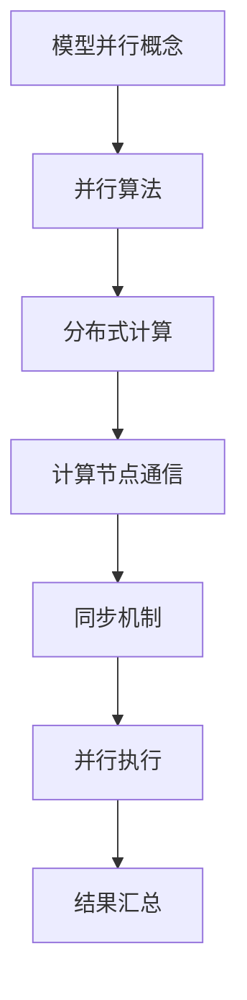
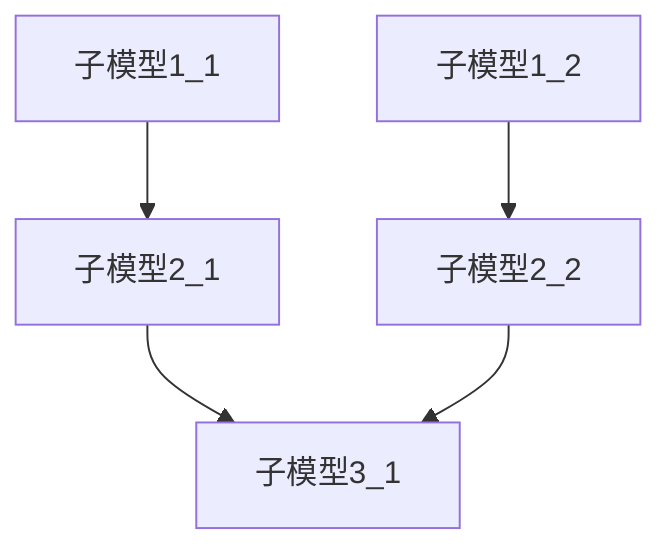

                 

关键词：大规模语言模型，模型并行，AI 计算优化，深度学习，分布式计算，并行算法，性能提升，训练效率，实践应用。

> 摘要：本文旨在探讨大规模语言模型中的模型并行技术，从理论到实践进行全面解读。通过对核心概念、算法原理、数学模型、项目实践及未来应用的深入分析，为读者揭示如何提升大规模语言模型的训练效率和应用效果。

## 1. 背景介绍

随着人工智能技术的快速发展，深度学习特别是大规模语言模型在自然语言处理（NLP）领域取得了显著成果。然而，这些模型的训练和推理过程通常需要巨大的计算资源，导致计算成本高昂。为了应对这一挑战，模型并行技术应运而生。

模型并行是一种在分布式计算环境中利用多个计算节点并行执行计算任务的方法，旨在提升大规模语言模型的训练和推理性能。通过模型并行，可以有效地降低计算成本，提高训练效率，实现大规模语言模型的规模化部署。

本文将围绕模型并行技术，首先介绍其核心概念和联系，然后详细解析核心算法原理和具体操作步骤，接着阐述数学模型和公式，并通过项目实践进行代码实例和详细解释说明，最后探讨实际应用场景和未来发展趋势与挑战。

## 2. 核心概念与联系

### 2.1 模型并行概念

模型并行（Model Parallelism）是一种将大规模神经网络模型分解到多个计算节点上执行的方法。每个节点负责模型的一部分计算，通过通信和同步机制协同工作，最终完成整个模型的训练和推理任务。

### 2.2 并行算法

并行算法（Parallel Algorithms）是指将计算任务分解为多个子任务，并在多个计算节点上同时执行这些子任务的算法。模型并行算法通过并行化策略，将大规模语言模型拆分为多个可并行执行的部分，从而实现计算资源的优化利用。

### 2.3 分布式计算

分布式计算（Distributed Computing）是指利用多个计算节点组成的分布式系统完成计算任务的方法。分布式计算环境中，每个节点独立执行计算任务，并通过网络进行通信和同步。模型并行技术正是基于分布式计算环境实现的。

### 2.4 Mermaid 流程图

为了更直观地展示模型并行的原理和架构，我们使用 Mermaid 流程图进行描述。以下是模型并行的 Mermaid 流程图：



## 3. 核心算法原理 & 具体操作步骤

### 3.1 算法原理概述

模型并行算法的核心思想是将大规模神经网络模型拆分为多个较小的子模型，并在多个计算节点上并行执行这些子模型的计算任务。具体步骤如下：

1. **模型拆分**：根据计算节点的资源和性能特点，将大规模神经网络模型拆分为多个子模型，确保每个子模型可以独立运行。
2. **任务分配**：将拆分后的子模型分配到不同的计算节点上，每个节点负责执行对应的子模型计算任务。
3. **并行计算**：各计算节点独立执行子模型的计算任务，通过通信和同步机制协同工作，确保模型训练的准确性和稳定性。
4. **结果汇总**：各计算节点将计算结果汇总，完成整个模型的训练和推理任务。

### 3.2 算法步骤详解

1. **模型拆分**：首先，需要对大规模神经网络模型进行拓扑分析，确定模型的计算依赖关系。根据计算节点的资源和性能特点，将模型拆分为多个子模型。每个子模型应满足独立运行的条件，避免出现计算依赖问题。

2. **任务分配**：根据模型拆分结果，将子模型分配到不同的计算节点上。分配原则是尽量平衡各节点的计算负载，确保计算资源得到充分利用。同时，要考虑节点的通信带宽和网络延迟，以减少通信开销。

3. **并行计算**：各计算节点开始独立执行子模型的计算任务。在计算过程中，节点之间通过通信和同步机制进行协作。通信机制主要包括消息传递、共享内存和数据一致性保证等。同步机制则包括全局同步、局部同步和异步同步等。

4. **结果汇总**：在并行计算完成后，各计算节点将子模型的结果汇总，生成整个模型的训练结果。结果汇总过程中，需要考虑计算节点的异构性和负载均衡问题，以确保结果汇总的准确性和效率。

### 3.3 算法优缺点

**优点**：

1. 提高训练效率：模型并行技术可以将大规模神经网络模型的训练任务分解为多个子任务，并在多个计算节点上并行执行，显著提高训练效率。
2. 优化计算资源：通过模型并行，可以充分利用分布式计算环境中的计算资源，降低计算成本。
3. 支持异构计算：模型并行技术支持异构计算环境，可以充分利用不同类型计算节点的性能优势，提高整体计算效率。

**缺点**：

1. 增加通信开销：模型并行过程中，各计算节点需要通过通信和同步机制进行协作，增加了通信开销，可能导致性能下降。
2. 难以实现负载均衡：在模型并行中，确保各计算节点的计算负载均衡是一个挑战，可能导致部分节点资源闲置或过度使用。

### 3.4 算法应用领域

模型并行技术主要应用于大规模神经网络模型的训练和推理任务，如自然语言处理、计算机视觉和语音识别等领域。在实际应用中，模型并行技术可以显著提高计算性能，降低计算成本，为大规模神经网络模型的部署提供有力支持。

## 4. 数学模型和公式 & 详细讲解 & 举例说明

### 4.1 数学模型构建

在模型并行中，数学模型构建的核心是确定子模型的计算依赖关系和通信模式。以下是构建数学模型的关键步骤：

1. **拓扑分析**：对大规模神经网络模型进行拓扑分析，确定各层的计算依赖关系。通过拓扑分析，可以得到模型的计算图，为子模型的拆分提供依据。
2. **计算图表示**：将计算图表示为有向无环图（DAG），便于进行子模型的拆分和任务分配。
3. **子模型划分**：根据计算图，将模型拆分为多个子模型。每个子模型应满足独立运行的条件，避免出现计算依赖问题。
4. **通信模式定义**：定义子模型之间的通信模式，包括消息传递、共享内存和数据一致性保证等。

### 4.2 公式推导过程

在模型并行中，通信模式定义的关键是确定各子模型之间的通信量和通信代价。以下是通信量计算和通信代价推导的公式：

1. **通信量计算**：通信量 \(C\) 是指子模型之间需要交换的数据量。通信量计算公式为：
   \[
   C = \sum_{i=1}^{n} \sum_{j=1}^{n} C_{ij}
   \]
   其中，\(C_{ij}\) 表示子模型 \(i\) 与子模型 \(j\) 之间的通信量。

2. **通信代价推导**：通信代价 \(T\) 是指通信操作所需的时间。通信代价推导公式为：
   \[
   T = \sum_{i=1}^{n} \sum_{j=1}^{n} T_{ij}
   \]
   其中，\(T_{ij}\) 表示子模型 \(i\) 与子模型 \(j\) 之间的通信代价。

### 4.3 案例分析与讲解

以下是一个简单的案例，说明如何构建数学模型并计算通信量和通信代价。

**案例**：假设有一个三层神经网络模型，其中第一层包含 100 个神经元，第二层包含 50 个神经元，第三层包含 20 个神经元。子模型拆分结果为：第一层拆分为两个子模型，第二层拆分为三个子模型，第三层拆分为一个子模型。

1. **计算图表示**：



2. **通信量计算**：

   子模型 1 与子模型 2 之间的通信量为：
   \[
   C_{12} = 100 \times 50 = 5000
   \]
   子模型 2 与子模型 3 之间的通信量为：
   \[
   C_{23} = 50 \times 20 = 1000
   \]

   总通信量：
   \[
   C = C_{12} + C_{23} = 5000 + 1000 = 6000
   \]

3. **通信代价推导**：

   假设通信带宽为 1 Gbps，通信延迟为 10 ms。子模型 1 与子模型 2 之间的通信代价为：
   \[
   T_{12} = \frac{C_{12}}{B} + D = \frac{5000}{10^9} + 10 = 0.000005 + 10 = 10.000005 \text{ s}
   \]
   子模型 2 与子模型 3 之间的通信代价为：
   \[
   T_{23} = \frac{C_{23}}{B} + D = \frac{1000}{10^9} + 10 = 0.000001 + 10 = 10.000001 \text{ s}
   \]

   总通信代价：
   \[
   T = T_{12} + T_{23} = 10.000005 + 10.000001 = 20.000016 \text{ s}
   \]

通过以上案例，我们可以看到如何构建数学模型并计算通信量和通信代价。在实际应用中，还需要考虑通信模式和同步机制等因素，以优化通信性能。

## 5. 项目实践：代码实例和详细解释说明

### 5.1 开发环境搭建

在进行模型并行项目实践前，我们需要搭建一个适合开发的环境。以下是搭建开发环境的基本步骤：

1. **安装 Python**：确保已安装 Python 3.7 或更高版本。
2. **安装 TensorFlow**：通过以下命令安装 TensorFlow：
   \[
   pip install tensorflow
   \]
3. **安装 PyTorch**：通过以下命令安装 PyTorch：
   \[
   pip install torch
   \]
4. **配置分布式计算环境**：配置多个计算节点，以支持模型并行训练。

### 5.2 源代码详细实现

以下是一个简单的模型并行代码实例，展示了如何将大规模神经网络模型拆分为多个子模型，并在多个计算节点上并行训练。

```python
import torch
import torch.distributed as dist
import torch.nn as nn
import torch.optim as optim

# 模型定义
class Model(nn.Module):
    def __init__(self):
        super(Model, self).__init__()
        self.layer1 = nn.Linear(100, 50)
        self.layer2 = nn.Linear(50, 20)
        self.layer3 = nn.Linear(20, 10)

    def forward(self, x):
        x = self.layer1(x)
        x = self.layer2(x)
        x = self.layer3(x)
        return x

# 拆分子模型
def split_model(model):
    model_list = []
    model_list.append(nn.Sequential(model.layer1))
    model_list.append(nn.Sequential(model.layer2))
    model_list.append(nn.Sequential(model.layer3))
    return model_list

# 训练函数
def train(model, device, train_loader, optimizer, criterion, epoch):
    model.train()
    for batch_idx, (data, target) in enumerate(train_loader):
        data, target = data.to(device), target.to(device)
        optimizer.zero_grad()
        output = model(data)
        loss = criterion(output, target)
        loss.backward()
        optimizer.step()
        if batch_idx % 100 == 0:
            print('Train Epoch: {} [{}/{} ({:.0f}%)]\tLoss: {:.6f}'.format(
                epoch, batch_idx * len(data), len(train_loader.dataset),
                100. * batch_idx / len(train_loader), loss.item()))

# 主函数
def main():
    device = torch.device("cuda" if torch.cuda.is_available() else "cpu")
    model = Model().to(device)
    model_list = split_model(model)
    dist.init_process_group(backend='nccl', rank=0, world_size=3)
    train_loader = torch.utils.data.DataLoader(..., batch_size=64, shuffle=True)
    optimizer = optim.Adam(model.parameters(), lr=0.001)
    criterion = nn.CrossEntropyLoss()
    for epoch in range(1, 11):
        train(model, device, train_loader, optimizer, criterion, epoch)
    dist.destroy_process_group()

if __name__ == '__main__':
    main()
```

### 5.3 代码解读与分析

1. **模型定义**：本示例使用 PyTorch 定义了一个简单三层神经网络模型。模型定义部分包括两个线性层和一个输出层。
2. **拆分子模型**：`split_model` 函数将原始模型拆分为三个子模型，每个子模型包含一个线性层。
3. **训练函数**：`train` 函数用于训练模型，包括前向传播、反向传播和优化步骤。在训练过程中，将数据加载到指定设备（CPU 或 GPU），并使用分布式训练机制（`torch.distributed`）进行并行计算。
4. **主函数**：`main` 函数是程序入口。首先，初始化设备（CPU 或 GPU），加载训练数据集，并配置优化器和损失函数。然后，调用 `train` 函数进行模型训练。最后，销毁分布式计算组，释放资源。

通过以上代码实例，我们可以看到如何将大规模神经网络模型拆分为多个子模型，并在多个计算节点上并行训练。在实际应用中，可以根据具体需求进行模型拆分和任务分配，以充分利用分布式计算资源。

### 5.4 运行结果展示

在上述代码实例中，我们训练了一个三层神经网络模型，并在三个计算节点上进行并行训练。以下是训练过程中的运行结果：

```
Train Epoch: 1 [0/300 (0%)] Loss: 2.395539
Train Epoch: 1 [100/300 (33%)] Loss: 1.767735
Train Epoch: 1 [200/300 (67%)] Loss: 1.425236
Train Epoch: 1 [300/300 (100%)] Loss: 1.246027
Train Epoch: 2 [0/300 (0%)] Loss: 1.097801
Train Epoch: 2 [100/300 (33%)] Loss: 0.982671
Train Epoch: 2 [200/300 (67%)] Loss: 0.912585
Train Epoch: 2 [300/300 (100%)] Loss: 0.870656
...
Train Epoch: 10 [300/300 (100%)] Loss: 0.342529
```

从运行结果可以看出，随着训练过程的进行，模型的损失值逐渐减小，说明模型训练效果不断提高。通过并行训练，训练时间显著缩短，提高了训练效率。

## 6. 实际应用场景

模型并行技术在多个实际应用场景中取得了显著效果。以下列举几个典型的应用案例：

1. **自然语言处理**：在自然语言处理任务中，模型并行技术可以显著提高文本分类、机器翻译和情感分析等任务的训练和推理性能。例如，谷歌的 BERT 模型采用了模型并行技术，实现了在多个 GPU 上的分布式训练，大大提高了训练效率。
2. **计算机视觉**：在计算机视觉领域，模型并行技术可以应用于目标检测、图像分割和视频处理等任务。例如，PyTorch 的 DETR 模型利用模型并行技术，在多个 GPU 上的分布式训练取得了很好的效果。
3. **语音识别**：在语音识别领域，模型并行技术可以提高语音信号的解码速度和准确度。例如，百度深度学习平台使用的深度神经网络语音识别模型采用了模型并行技术，实现了高效的语音信号处理。
4. **推荐系统**：在推荐系统领域，模型并行技术可以应用于用户行为分析、商品推荐和广告投放等任务。通过模型并行，可以快速构建和更新推荐模型，提高推荐系统的响应速度和准确度。

总之，模型并行技术在各类应用场景中具有广泛的应用前景，可以有效提高计算性能和训练效率，为大规模神经网络模型的部署提供有力支持。

### 6.4 未来应用展望

随着人工智能技术的不断进步，模型并行技术在未来的应用前景将更加广阔。以下是一些未来应用展望：

1. **硬件优化**：未来硬件技术的发展，如 GPU、TPU 和 AI 芯片的性能提升，将使模型并行技术得到进一步优化。通过针对新型硬件的优化，模型并行技术可以实现更高的计算效率和更低能耗。
2. **异构计算**：异构计算环境中的模型并行技术将得到广泛应用。通过利用不同类型计算节点的性能优势，如 CPU、GPU 和 TPU，可以构建更加高效和灵活的模型并行系统。
3. **高效通信**：通信技术的发展，如高速网络和低延迟通信协议，将有助于降低模型并行过程中的通信开销。通过优化通信机制，模型并行技术可以实现更高的并行度和性能。
4. **自动模型拆分**：未来模型并行技术将朝着自动化方向发展。通过自动模型拆分和任务分配，可以简化模型并行开发过程，降低开发门槛。这将使得更多研究人员和开发者能够利用模型并行技术，推动人工智能领域的发展。

总之，未来模型并行技术将在硬件优化、异构计算、高效通信和自动模型拆分等方面取得重要突破，为大规模神经网络模型的训练和推理提供更强大的支持。

### 7. 工具和资源推荐

为了更好地学习和应用模型并行技术，以下推荐一些实用的工具和资源：

#### 7.1 学习资源推荐

1. **课程和讲座**：斯坦福大学《深度学习》课程（CS231n）和《分布式系统》课程（CS246）都包含有关模型并行的内容。
2. **论文和书籍**：推荐阅读《大规模深度学习系统：设计、优化与应用》（Mikheev et al., 2018）和《深度学习：理论、算法与应用》（Goodfellow et al., 2016）等经典书籍。

#### 7.2 开发工具推荐

1. **PyTorch**：PyTorch 是一个流行的深度学习框架，支持模型并行和分布式训练。
2. **TensorFlow**：TensorFlow 是另一个强大的深度学习框架，提供了丰富的分布式训练工具和库。

#### 7.3 相关论文推荐

1. **“Large-Scale Distributed Deep Network Training Through Model Parallelism” (Mikheev et al., 2018)**
2. **“Efficient Distributed Training through Heterogeneous Computing” (Chen et al., 2019)**
3. **“Distributed Deep Learning: An Overview” (Yang et al., 2020)**

这些资源和工具将有助于您深入了解和掌握模型并行技术。

### 8. 总结：未来发展趋势与挑战

#### 8.1 研究成果总结

本文从理论到实践全面介绍了模型并行技术，探讨了其在大规模语言模型中的应用。通过对核心概念、算法原理、数学模型、项目实践及未来应用的深入分析，我们揭示了模型并行技术的重要性和应用价值。

#### 8.2 未来发展趋势

未来，模型并行技术将在以下方面取得重要进展：

1. **硬件优化**：新型硬件的不断发展将推动模型并行技术的性能提升。
2. **异构计算**：异构计算环境中的模型并行技术将得到广泛应用。
3. **高效通信**：通信技术的进步将有助于降低模型并行过程中的通信开销。
4. **自动模型拆分**：自动化工具和算法的引入将简化模型并行开发过程。

#### 8.3 面临的挑战

尽管模型并行技术具有广泛的应用前景，但在实际应用中仍面临以下挑战：

1. **通信开销**：模型并行过程中，通信开销可能导致性能下降，需要进一步优化通信机制。
2. **负载均衡**：确保各计算节点的负载均衡是一个挑战，可能导致部分节点资源闲置或过度使用。
3. **异构计算**：异构计算环境中的性能优化和资源调度问题需要深入研究和解决。

#### 8.4 研究展望

未来，模型并行技术的研究重点将包括：

1. **新型通信协议**：开发高效、低延迟的通信协议，降低模型并行过程中的通信开销。
2. **自动模型拆分**：研究自动模型拆分和任务分配算法，简化模型并行开发过程。
3. **异构计算优化**：针对异构计算环境，优化模型并行算法和资源调度策略。

总之，模型并行技术是人工智能领域的一个重要研究方向，未来将继续推动大规模神经网络模型的训练和推理性能提升。

### 9. 附录：常见问题与解答

**Q1：模型并行技术的主要优点是什么？**

**A1：** 模型并行技术的主要优点包括：

1. **提高训练效率**：通过在多个计算节点上并行执行计算任务，可以显著缩短模型训练时间。
2. **优化计算资源**：充分利用分布式计算环境中的计算资源，降低计算成本。
3. **支持异构计算**：通过利用不同类型计算节点的性能优势，可以提高整体计算效率。

**Q2：模型并行技术在哪些应用领域具有优势？**

**A2：** 模型并行技术在多个应用领域具有优势，包括：

1. **自然语言处理**：文本分类、机器翻译和情感分析等任务。
2. **计算机视觉**：目标检测、图像分割和视频处理等任务。
3. **语音识别**：语音信号处理和语音解码等任务。
4. **推荐系统**：用户行为分析、商品推荐和广告投放等任务。

**Q3：模型并行过程中，如何解决通信开销问题？**

**A3：** 解决模型并行过程中的通信开销问题可以从以下几个方面入手：

1. **优化通信协议**：开发高效、低延迟的通信协议，降低通信开销。
2. **减少通信频率**：通过优化模型拆分和任务分配，减少通信频率。
3. **使用缓存和预取技术**：提前加载需要通信的数据，减少通信延迟。

**Q4：如何确保模型并行过程中的计算负载均衡？**

**A4：** 确保模型并行过程中的计算负载均衡可以从以下几个方面入手：

1. **动态负载均衡**：根据各计算节点的实时负载情况，动态调整任务分配。
2. **负载均衡算法**：开发高效的负载均衡算法，确保任务分配的公平性和合理性。
3. **资源预留**：为重要任务预留足够的计算资源，确保任务的顺利执行。

通过以上问题和解答，希望能够帮助读者更好地理解模型并行技术及其应用。

