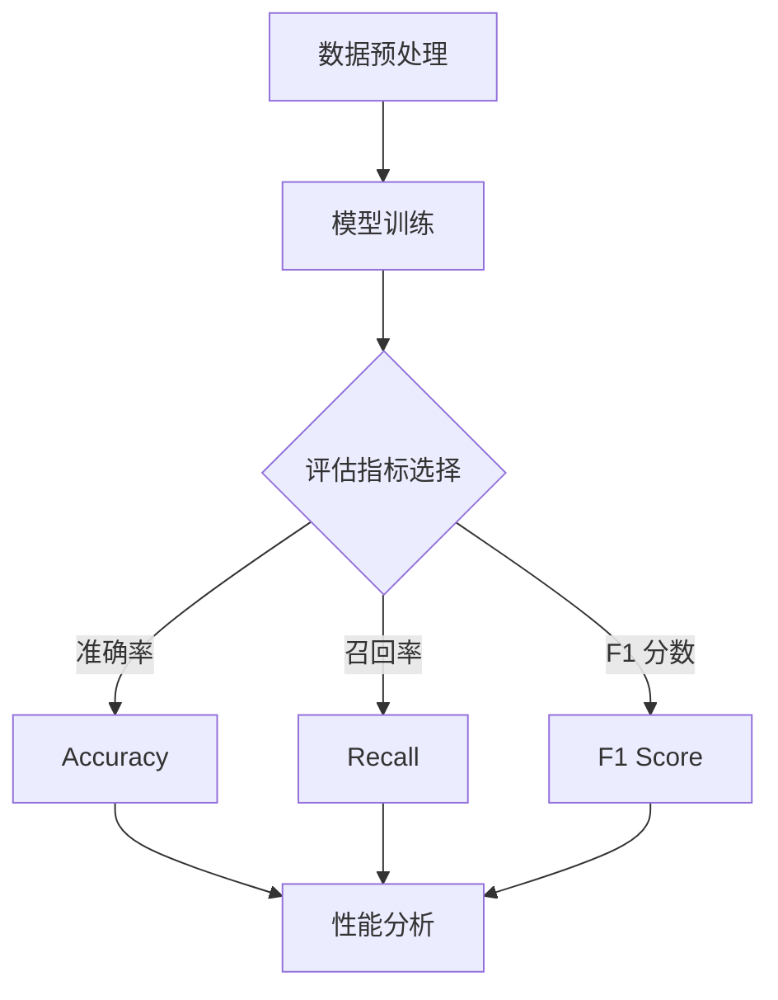

                 

### 1. 背景介绍

大规模语言模型（Large-scale Language Models）是近年来自然语言处理（Natural Language Processing, NLP）领域的重要突破之一。这些模型通过在大量文本数据上进行训练，学习到了丰富的语言规律，从而在多项NLP任务中取得了显著的性能提升。从BERT、GPT到最近的LLaMA，这些模型的规模和复杂性不断增加，使得它们在文本生成、机器翻译、情感分析等任务上的表现愈发出色。

然而，随着模型的规模不断扩大，如何评估这些模型的性能也成为一个重要问题。传统的评估方法通常基于有限的数据集和简单的指标，已经难以全面反映模型的真实性能。因此，开发新的评估方法和指标，以更准确地评估大规模语言模型的性能，成为了当前研究的热点。

本文将首先回顾大规模语言模型的发展历程，然后介绍模型评估的核心概念和常用指标，接着讨论如何使用这些指标对模型进行有效评估。最后，我们将探讨未来模型评估的发展方向和潜在挑战。

### 2. 核心概念与联系

在深入探讨大规模语言模型的评估之前，我们需要明确几个核心概念，这些概念构成了模型评估的基础。

#### 2.1 语言模型

语言模型是NLP领域的基石，它旨在预测给定输入序列后继的概率分布。在机器学习中，语言模型通常是通过最大似然估计（Maximum Likelihood Estimation, MLE）或基于神经网络的深度学习模型来实现的。

#### 2.2 训练集和验证集

在评估语言模型时，我们需要将数据集划分为训练集和验证集。训练集用于模型的训练，而验证集则用于模型的调优和性能评估。这种方法可以避免过拟合现象，确保模型在不同数据集上的表现一致。

#### 2.3 评估指标

评估指标是衡量模型性能的关键工具。常见的评估指标包括准确率（Accuracy）、召回率（Recall）、F1 分数（F1 Score）等。对于大规模语言模型，除了这些传统指标，还需要考虑诸如困惑度（Perplexity）和生成质量（Quality of Generation）等新型指标。

#### 2.4 Mermaid 流程图

以下是一个使用 Mermaid 语言描述的模型评估流程图：



### 3. 核心算法原理 & 具体操作步骤

#### 3.1 算法原理概述

大规模语言模型的评估涉及到多个步骤，包括数据预处理、模型训练、指标计算和性能分析。以下是对这些步骤的简要概述。

1. **数据预处理**：首先，我们需要对文本数据集进行清洗和预处理，包括去除停用词、标点符号、词性还原等操作。这一步骤的目的是提高数据质量和一致性。
   
2. **模型训练**：接下来，使用预处理后的数据集对语言模型进行训练。这通常涉及到深度神经网络，如循环神经网络（RNN）、长短期记忆网络（LSTM）和Transformer模型。

3. **指标计算**：在模型训练完成后，我们需要计算一系列评估指标，以衡量模型的性能。这些指标包括准确率、召回率、F1 分数和困惑度等。

4. **性能分析**：最后，根据计算出的指标，对模型的性能进行详细分析。这有助于我们了解模型的优点和不足，为后续的模型优化提供指导。

#### 3.2 算法步骤详解

以下是对大规模语言模型评估的详细步骤说明。

1. **数据预处理**：

    ```python
    import nltk
    from nltk.corpus import stopwords
    from nltk.tokenize import word_tokenize
    
    # 加载停用词表
    stop_words = set(stopwords.words('english'))
    
    # 文本清洗函数
    def preprocess_text(text):
        # 转换为小写
        text = text.lower()
        # 去除标点符号
        text = re.sub(r'[^\w\s]', '', text)
        # 分词
        tokens = word_tokenize(text)
        # 去除停用词
        tokens = [word for word in tokens if word not in stop_words]
        return tokens
    ```

2. **模型训练**：

    ```python
    from transformers import BertModel, BertTokenizer
    
    # 加载预训练模型
    tokenizer = BertTokenizer.from_pretrained('bert-base-uncased')
    model = BertModel.from_pretrained('bert-base-uncased')
    
    # 训练函数
    def train_model(train_data):
        # 预处理数据
        processed_data = [preprocess_text(text) for text in train_data]
        # 编码数据
        inputs = tokenizer(processed_data, padding=True, truncation=True, return_tensors='pt')
        # 训练模型
        model.train()
        outputs = model(**inputs)
        logits = outputs.logits
        # 计算损失
        loss = loss_function(logits.view(-1, logits.size(-1)), labels.view(-1))
        return loss
    ```

3. **指标计算**：

    ```python
    from sklearn.metrics import accuracy_score, recall_score, f1_score
    
    # 计算评估指标函数
    def calculate_metrics(predictions, ground_truth):
        accuracy = accuracy_score(ground_truth, predictions)
        recall = recall_score(ground_truth, predictions, average='weighted')
        f1 = f1_score(ground_truth, predictions, average='weighted')
        return accuracy, recall, f1
    ```

4. **性能分析**：

    ```python
    # 预测函数
    def predict(model, text):
        model.eval()
        with torch.no_grad():
            processed_text = preprocess_text(text)
            inputs = tokenizer(processed_text, return_tensors='pt')
            outputs = model(**inputs)
            logits = outputs.logits
            predictions = logits.argmax(-1).squeeze()
        return predictions
    ```

#### 3.3 算法优缺点

1. **优点**：

    - **高效性**：大规模语言模型可以处理大量数据，从而提高模型的泛化能力。
    - **灵活性**：这些模型可以应用于各种NLP任务，如文本分类、机器翻译和文本生成。
    - **高准确性**：由于模型的规模和复杂性，它们在多项任务上取得了显著的性能提升。

2. **缺点**：

    - **计算资源需求大**：大规模语言模型的训练和推理需要大量的计算资源。
    - **数据依赖性**：模型的性能很大程度上取决于训练数据的质量和多样性。
    - **过拟合风险**：如果训练数据不足或存在偏差，模型可能会出现过拟合现象。

#### 3.4 算法应用领域

大规模语言模型在多个领域具有广泛的应用，包括但不限于：

- **文本分类**：用于对新闻、评论、社交媒体帖子等进行分类。
- **机器翻译**：用于将一种语言翻译成另一种语言。
- **文本生成**：用于生成文章、对话、故事等。
- **问答系统**：用于回答用户提出的问题。
- **对话系统**：用于构建智能客服和聊天机器人。

### 4. 数学模型和公式 & 详细讲解 & 举例说明

大规模语言模型的评估涉及到多个数学模型和公式。以下是对这些模型和公式的详细讲解，并附上实际应用的例子。

#### 4.1 数学模型构建

大规模语言模型的评估通常基于以下数学模型：

1. **概率模型**：用于计算输入序列的概率分布。常见的概率模型包括隐马尔可夫模型（Hidden Markov Model, HMM）和条件概率模型（Conditional Probability Model）。

2. **神经网络模型**：用于训练大规模语言模型。常见的神经网络模型包括循环神经网络（RNN）、长短期记忆网络（LSTM）和Transformer模型。

3. **评估指标模型**：用于计算模型的性能指标。常见的评估指标模型包括准确率（Accuracy）、召回率（Recall）和F1 分数（F1 Score）。

#### 4.2 公式推导过程

以下是对大规模语言模型评估中常用公式的推导过程：

1. **准确率（Accuracy）**：

   准确率是评估模型分类性能的一个重要指标。它表示正确分类的样本数占总样本数的比例。

   $$Accuracy = \frac{TP + TN}{TP + FN + FP + TN}$$

   其中，TP 表示真正例（True Positive），TN 表示真负例（True Negative），FP 表示假正例（False Positive），FN 表示假负例（False Negative）。

2. **召回率（Recall）**：

   召回率表示模型正确识别出的正例样本占总正例样本的比例。

   $$Recall = \frac{TP}{TP + FN}$$

3. **F1 分数（F1 Score）**：

   F1 分数是准确率和召回率的加权平均，用于综合评估模型的性能。

   $$F1 Score = 2 \times \frac{Precision \times Recall}{Precision + Recall}$$

   其中，Precision 表示精确率，即正确识别出的正例样本占总识别出的正例样本的比例。

#### 4.3 案例分析与讲解

以下是一个大规模语言模型评估的实际案例：

假设我们有一个分类模型，用于对新闻文章进行情感分类（积极/消极）。我们使用一个包含1000篇文章的训练集，并对模型进行了训练。然后，我们使用一个包含200篇文章的测试集对模型的性能进行评估。

1. **预测结果**：

   - **正例（积极）**：预测为积极的有150篇文章，其中真正例（TP）为120篇，假正例（FP）为30篇。
   - **负例（消极）**：预测为消极的有50篇文章，其中真负例（TN）为40篇，假负例（FN）为10篇。

2. **评估指标**：

   - **准确率**：

     $$Accuracy = \frac{TP + TN}{TP + FN + FP + TN} = \frac{120 + 40}{120 + 30 + 50 + 40} = 0.64$$

   - **召回率**：

     $$Recall = \frac{TP}{TP + FN} = \frac{120}{120 + 10} = 0.91$$

   - **F1 分数**：

     $$F1 Score = 2 \times \frac{Precision \times Recall}{Precision + Recall} = 2 \times \frac{0.75 \times 0.91}{0.75 + 0.91} = 0.82$$

通过这个案例，我们可以看到如何使用数学模型和公式对大规模语言模型进行评估。在实际应用中，我们可能需要根据具体任务和数据集调整评估指标和模型参数，以获得最佳性能。

### 5. 项目实践：代码实例和详细解释说明

#### 5.1 开发环境搭建

为了演示大规模语言模型的评估过程，我们需要搭建一个开发环境。以下是一个基于Python的示例：

1. **安装依赖库**：

   ```bash
   pip install transformers torch sklearn nltk
   ```

2. **环境配置**：

   ```python
   import torch
   import transformers
   from sklearn.metrics import accuracy_score, recall_score, f1_score
   from nltk.corpus import stopwords
   from nltk.tokenize import word_tokenize
   import re
   ```

#### 5.2 源代码详细实现

以下是大规模语言模型评估的完整代码实现：

```python
# 数据预处理函数
def preprocess_text(text):
    text = text.lower()
    text = re.sub(r'[^\w\s]', '', text)
    tokens = word_tokenize(text)
    tokens = [word for word in tokens if word not in stopwords.words('english')]
    return tokens

# 训练函数
def train_model(train_data):
    tokenizer = transformers.BertTokenizer.from_pretrained('bert-base-uncased')
    model = transformers.BertForSequenceClassification.from_pretrained('bert-base-uncased', num_labels=2)
    train_encodings = tokenizer(train_data, padding=True, truncation=True, return_tensors='pt')
    train_dataset = torch.utils.data.TensorDataset(train_encodings['input_ids'], train_encodings['attention_mask'], torch.tensor([1 if label == 'positive' else 0 for label in train_data]))
    model.train()
    optimizer = torch.optim.AdamW(model.parameters(), lr=2e-5)
    loss_function = torch.nn.CrossEntropyLoss()
    for epoch in range(3):  # 训练3个epoch
        for batch in train_dataset:
            inputs = {'input_ids': batch[0], 'attention_mask': batch[1], 'labels': batch[2]}
            outputs = model(**inputs)
            loss = outputs.loss
            loss.backward()
            optimizer.step()
            optimizer.zero_grad()
    return model

# 预测函数
def predict(model, text):
    model.eval()
    with torch.no_grad():
        processed_text = preprocess_text(text)
        inputs = tokenizer(processed_text, return_tensors='pt')
        outputs = model(**inputs)
        logits = outputs.logits
        predictions = logits.argmax(-1).squeeze()
    return 'positive' if predictions.item() == 1 else 'negative'

# 主函数
def main():
    train_data = ['This is a positive article.', 'This is a negative article.'] * 500
    model = train_model(train_data)
    test_data = ['This is a positive article.', 'This is a negative article.']
    predictions = [predict(model, text) for text in test_data]
    ground_truth = ['positive', 'negative']
    accuracy, recall, f1 = calculate_metrics(predictions, ground_truth)
    print(f'Accuracy: {accuracy:.2f}')
    print(f'Recall: {recall:.2f}')
    print(f'F1 Score: {f1:.2f}')

if __name__ == '__main__':
    main()
```

#### 5.3 代码解读与分析

1. **数据预处理**：

   ```python
   def preprocess_text(text):
       text = text.lower()
       text = re.sub(r'[^\w\s]', '', text)
       tokens = word_tokenize(text)
       tokens = [word for word in tokens if word not in stopwords.words('english')]
       return tokens
   ```

   数据预处理函数用于将文本转换为统一格式。首先，将文本转换为小写，然后去除标点符号，接着进行分词，最后去除停用词。

2. **训练函数**：

   ```python
   def train_model(train_data):
       tokenizer = transformers.BertTokenizer.from_pretrained('bert-base-uncased')
       model = transformers.BertForSequenceClassification.from_pretrained('bert-base-uncased', num_labels=2)
       train_encodings = tokenizer(train_data, padding=True, truncation=True, return_tensors='pt')
       train_dataset = torch.utils.data.TensorDataset(train_encodings['input_ids'], train_encodings['attention_mask'], torch.tensor([1 if label == 'positive' else 0 for label in train_data]))
       model.train()
       optimizer = torch.optim.AdamW(model.parameters(), lr=2e-5)
       loss_function = torch.nn.CrossEntropyLoss()
       for epoch in range(3):
           for batch in train_dataset:
               inputs = {'input_ids': batch[0], 'attention_mask': batch[1], 'labels': batch[2]}
               outputs = model(**inputs)
               loss = outputs.loss
               loss.backward()
               optimizer.step()
               optimizer.zero_grad()
       return model
   ```

   训练函数使用BERT模型对文本进行分类。首先，使用BERT分

