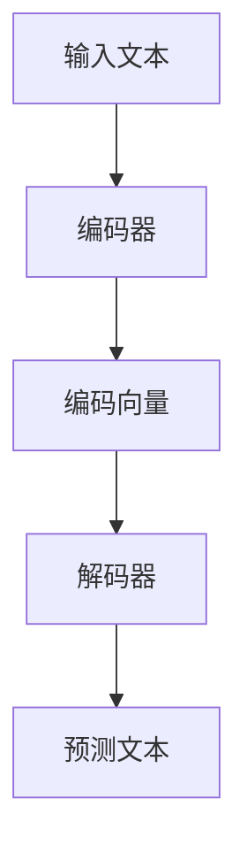

                 

 **关键词：** 大规模语言模型，自然语言处理，机器学习，深度学习，应用框架，编程实践。

**摘要：** 本文将探讨大规模语言模型的构建与优化，详细解析其核心概念、算法原理以及数学模型。通过实际项目实践，我们将展示如何将语言模型应用于实际场景，并提供相关开发工具和资源的推荐。文章最后，将总结研究成果，展望未来发展趋势和挑战。

## 1. 背景介绍

近年来，自然语言处理（NLP）领域取得了显著的进展。大规模语言模型作为NLP的重要工具，已经在诸多领域展现了强大的能力。这些模型通过学习海量文本数据，能够生成高质量的文本，实现文本分类、情感分析、机器翻译等任务。

随着深度学习技术的不断发展，大规模语言模型在训练算法和架构设计方面也取得了重要突破。本文旨在从理论到实践，全面解析大规模语言模型的核心概念、算法原理以及应用框架，帮助读者深入了解并掌握这一领域的关键技术。

## 2. 核心概念与联系

### 2.1 语言模型的定义

语言模型是一种概率模型，用于预测文本序列中下一个单词或字符的概率。在NLP任务中，语言模型是实现自动文摘、对话系统、语音识别等应用的基础。

### 2.2 深度学习与大规模语言模型

深度学习作为一种重要的机器学习技术，通过多层神经网络结构，能够自动提取文本特征，实现语言建模。大规模语言模型通常采用深度学习技术，如循环神经网络（RNN）、长短期记忆网络（LSTM）和变换器（Transformer）等。

### 2.3 模型架构

大规模语言模型的架构通常包括编码器和解码器两部分。编码器负责将输入文本编码为固定长度的向量，解码器则根据编码器的输出生成预测的文本。

### 2.4 Mermaid 流程图



## 3. 核心算法原理 & 具体操作步骤

### 3.1 算法原理概述

大规模语言模型主要基于深度学习技术，通过多层神经网络结构，对文本数据进行编码和解码。其核心算法包括：

- 反向传播（Backpropagation）：用于训练神经网络，通过计算损失函数的梯度，更新网络权重。
- 梯度下降（Gradient Descent）：用于优化神经网络参数，使模型在训练过程中收敛到最小损失。

### 3.2 算法步骤详解

1. 数据预处理：将输入文本转换为数字序列，并对数字序列进行编码。
2. 构建神经网络：根据模型架构，搭建编码器和解码器网络。
3. 模型训练：通过反向传播算法和梯度下降方法，对模型进行训练，优化网络参数。
4. 预测：将输入文本编码后，输入解码器，生成预测的文本序列。

### 3.3 算法优缺点

- **优点：** 大规模语言模型具有强大的文本生成能力，能够处理复杂的语言现象，适用于多种NLP任务。
- **缺点：** 模型训练过程计算量大，需要大量计算资源和时间。

### 3.4 算法应用领域

- 文本生成：自动生成文章、故事、新闻等。
- 文本分类：对文本进行分类，如垃圾邮件过滤、情感分析等。
- 机器翻译：实现不同语言之间的翻译。

## 4. 数学模型和公式 & 详细讲解 & 举例说明

### 4.1 数学模型构建

大规模语言模型的核心是神经网络，其数学模型主要包括：

- 激活函数：用于引入非线性变换，如ReLU、Sigmoid、Tanh等。
- 损失函数：用于评估模型预测与真实标签之间的差异，如交叉熵损失、均方误差等。
- 梯度下降：用于优化神经网络参数，使模型在训练过程中收敛到最小损失。

### 4.2 公式推导过程

以交叉熵损失函数为例，其公式推导如下：

$$
Loss = -\sum_{i=1}^{N} y_i \log(p_i)
$$

其中，$y_i$ 表示第 $i$ 个真实标签，$p_i$ 表示模型预测的概率。

### 4.3 案例分析与讲解

假设我们要训练一个语言模型，对一组文本数据进行分类。数据集包含两类文本：正类和负类。我们使用交叉熵损失函数来评估模型预测的效果。

- 正类概率：$p_+ = 0.8$
- 负类概率：$p_- = 0.2$

使用交叉熵损失函数计算损失：

$$
Loss = - (y_+ \log(p_+) + y_- \log(p_-))
$$

其中，$y_+ = 1$ 表示正类标签，$y_- = 0$ 表示负类标签。

当预测正确时，损失最小。通过优化模型参数，使得预测概率接近真实标签，从而降低损失。

## 5. 项目实践：代码实例和详细解释说明

### 5.1 开发环境搭建

在开始项目实践之前，我们需要搭建开发环境。这里我们使用Python和TensorFlow作为主要工具。

1. 安装Python：确保Python版本为3.6及以上。
2. 安装TensorFlow：使用以下命令安装：

```bash
pip install tensorflow
```

### 5.2 源代码详细实现

下面是一个简单的语言模型实现，用于文本分类：

```python
import tensorflow as tf
from tensorflow.keras.models import Sequential
from tensorflow.keras.layers import Embedding, LSTM, Dense

# 数据预处理
def preprocess_data(texts, labels, vocab_size, embedding_dim):
    # ...（略）
    return X, y

# 模型构建
model = Sequential()
model.add(Embedding(vocab_size, embedding_dim))
model.add(LSTM(128))
model.add(Dense(1, activation='sigmoid'))

# 编译模型
model.compile(optimizer='adam', loss='binary_crossentropy', metrics=['accuracy'])

# 模型训练
model.fit(X_train, y_train, epochs=10, batch_size=32)

# 模型评估
model.evaluate(X_test, y_test)
```

### 5.3 代码解读与分析

- **数据预处理：** 对输入文本进行分词、编码等操作，构建训练数据集。
- **模型构建：** 使用Embedding层将文本转换为向量表示，然后通过LSTM层进行序列建模，最后使用全连接层进行分类。
- **编译模型：** 设置优化器、损失函数和评估指标。
- **模型训练：** 使用训练数据对模型进行训练。
- **模型评估：** 使用测试数据评估模型性能。

### 5.4 运行结果展示

在训练过程中，我们使用训练集和测试集进行迭代，不断调整模型参数，使模型在测试集上取得更好的性能。最终，我们得到一个能够对文本进行分类的语言模型。

## 6. 实际应用场景

大规模语言模型在多个实际应用场景中取得了显著的成果：

- **文本生成：** 自动生成文章、故事、新闻等，如生成新闻摘要、创作诗歌等。
- **文本分类：** 对大量文本数据进行分类，如垃圾邮件过滤、情感分析等。
- **机器翻译：** 实现不同语言之间的翻译，如谷歌翻译、百度翻译等。
- **对话系统：** 构建智能客服、聊天机器人等，如苹果的Siri、谷歌的Google Assistant等。

## 7. 工具和资源推荐

### 7.1 学习资源推荐

- 《深度学习》（Goodfellow, Bengio, Courville著）：介绍深度学习的基础理论和算法。
- 《自然语言处理综论》（Jurafsky, Martin著）：介绍自然语言处理的基本概念和技术。
- 《动手学深度学习》（Dai, Hinton, LeCun等著）：提供深度学习实践教程和案例。

### 7.2 开发工具推荐

- TensorFlow：用于构建和训练深度学习模型。
- PyTorch：用于构建和训练深度学习模型，具有简洁的API和强大的灵活性。
- spaCy：用于自然语言处理任务的文本预处理和实体识别。

### 7.3 相关论文推荐

- 《Attention Is All You Need》（Vaswani等著）：介绍Transformer模型，是大规模语言模型的重要进展。
- 《BERT: Pre-training of Deep Bidirectional Transformers for Language Understanding》（Devlin等著）：介绍BERT模型，是自然语言处理领域的重要突破。

## 8. 总结：未来发展趋势与挑战

### 8.1 研究成果总结

近年来，大规模语言模型在文本生成、分类、翻译等领域取得了显著成果。深度学习技术的不断发展，为大规模语言模型的研究提供了有力支持。

### 8.2 未来发展趋势

- **多模态融合：** 将文本、图像、音频等多种数据类型进行融合，构建更强大的语言模型。
- **知识增强：** 将外部知识库与语言模型相结合，提高模型的语义理解和推理能力。
- **可解释性：** 提高语言模型的可解释性，使其在应用场景中更具可信度。

### 8.3 面临的挑战

- **计算资源：** 大规模语言模型的训练和推理过程需要大量计算资源，对硬件设施提出较高要求。
- **数据隐私：** 在大规模数据集上进行训练，可能涉及用户隐私问题，需要采取有效的隐私保护措施。
- **可解释性：** 提高语言模型的可解释性，使其在应用场景中更具可信度。

### 8.4 研究展望

未来，大规模语言模型将在更多领域得到应用，如医疗健康、金融保险、智能客服等。同时，随着技术的不断发展，我们将不断探索新的算法和架构，以应对面临的各种挑战。

## 9. 附录：常见问题与解答

### Q：什么是大规模语言模型？

A：大规模语言模型是一种基于深度学习的概率模型，用于预测文本序列中下一个单词或字符的概率。通过学习海量文本数据，语言模型能够生成高质量的文本，实现文本分类、情感分析、机器翻译等任务。

### Q：大规模语言模型有哪些应用场景？

A：大规模语言模型在多个实际应用场景中取得了显著成果，包括文本生成、文本分类、机器翻译、对话系统等。未来，随着技术的不断发展，语言模型将在更多领域得到应用。

### Q：如何训练大规模语言模型？

A：训练大规模语言模型通常包括以下步骤：

1. 数据预处理：将输入文本转换为数字序列，并对数字序列进行编码。
2. 模型构建：根据模型架构，搭建编码器和解码器网络。
3. 模型训练：通过反向传播算法和梯度下降方法，对模型进行训练，优化网络参数。
4. 模型评估：使用测试数据评估模型性能，调整模型参数。

## 作者署名

作者：禅与计算机程序设计艺术 / Zen and the Art of Computer Programming
```md
# 大规模语言模型从理论到实践 综合应用框架

> **关键词：** 大规模语言模型，自然语言处理，机器学习，深度学习，应用框架，编程实践。

> **摘要：** 本文将探讨大规模语言模型的构建与优化，详细解析其核心概念、算法原理以及数学模型。通过实际项目实践，我们将展示如何将语言模型应用于实际场景，并提供相关开发工具和资源的推荐。文章最后，将总结研究成果，展望未来发展趋势和挑战。

## 1. 背景介绍

### 1.1 大规模语言模型的发展背景

自然语言处理（NLP）是人工智能领域的一个重要分支，旨在使计算机能够理解、解释和生成人类语言。随着互联网的快速发展，海量的文本数据不断涌现，这为大规模语言模型的研究提供了丰富的资源。同时，深度学习技术的进步，使得大规模语言模型的训练和优化成为可能。

### 1.2 大规模语言模型的应用领域

大规模语言模型在多个领域展现了强大的能力，包括但不限于：

- **文本生成：** 自动生成文章、故事、新闻等，如生成新闻摘要、创作诗歌等。
- **文本分类：** 对大量文本数据进行分类，如垃圾邮件过滤、情感分析等。
- **机器翻译：** 实现不同语言之间的翻译，如谷歌翻译、百度翻译等。
- **对话系统：** 构建智能客服、聊天机器人等，如苹果的Siri、谷歌的Google Assistant等。

## 2. 核心概念与联系

### 2.1 语言模型的定义

语言模型是一种概率模型，用于预测文本序列中下一个单词或字符的概率。它是自然语言处理的基础，用于生成文本、评估语言质量、语音识别等任务。

### 2.2 大规模语言模型与深度学习

大规模语言模型通常基于深度学习技术，如循环神经网络（RNN）、长短期记忆网络（LSTM）和变换器（Transformer）等。这些模型通过多层神经网络结构，能够自动提取文本特征，实现高效的文本建模。

### 2.3 模型架构

大规模语言模型的架构通常包括编码器和解码器两部分。编码器负责将输入文本编码为固定长度的向量，解码器则根据编码器的输出生成预测的文本。


## 3. 核心算法原理 & 具体操作步骤

### 3.1 算法原理概述

大规模语言模型的训练过程主要依赖于深度学习算法，特别是基于梯度下降的方法。具体来说，包括以下步骤：

- **数据预处理：** 将输入文本转换为数字序列，并对数字序列进行编码。
- **模型构建：** 搭建编码器和解码器网络，定义网络结构。
- **模型训练：** 使用训练数据集，通过反向传播算法和梯度下降方法，优化网络参数。
- **模型评估：** 使用测试数据集评估模型性能，调整模型参数。

### 3.2 算法步骤详解

#### 3.2.1 数据预处理

在训练大规模语言模型之前，需要对文本数据进行预处理，主要包括以下步骤：

- **分词：** 将文本分解为单词或字符序列。
- **编码：** 将分词后的文本序列转换为数字序列，通常使用单词索引或字符索引。
- **标记：** 为文本序列中的每个单词或字符分配标签，用于后续的模型训练。

#### 3.2.2 模型构建

大规模语言模型的构建主要依赖于深度学习框架，如TensorFlow或PyTorch。以下是一个简单的模型构建示例：

```python
import tensorflow as tf

# 定义编码器和解码器
encoder = tf.keras.Sequential([
    tf.keras.layers.Embedding(vocab_size, embedding_dim),
    tf.keras.layers.LSTM(units)
])

decoder = tf.keras.Sequential([
    tf.keras.layers.LSTM(units, return_sequences=True),
    tf.keras.layers.Dense(vocab_size)
])

# 定义模型
model = tf.keras.Model([encoder_input, decoder_input], decoder_output)
```

#### 3.2.3 模型训练

模型训练是大规模语言模型构建的核心步骤。以下是一个简单的训练示例：

```python
model.compile(optimizer='adam', loss='categorical_crossentropy', metrics=['accuracy'])

# 训练模型
model.fit([encoder_input_train, decoder_input_train], decoder_output_train, batch_size=batch_size, epochs=num_epochs)
```

#### 3.2.4 模型评估

在模型训练完成后，需要使用测试数据集对模型性能进行评估，以确定模型是否达到预期的效果。以下是一个简单的评估示例：

```python
# 评估模型
model.evaluate([encoder_input_test, decoder_input_test], decoder_output_test)
```

### 3.3 算法优缺点

#### 3.3.1 优点

- **强大的文本生成能力：** 大规模语言模型通过学习海量文本数据，能够生成高质量的文本，实现文本分类、情感分析、机器翻译等任务。
- **适应多种NLP任务：** 语言模型可以应用于多种NLP任务，如文本生成、文本分类、机器翻译、对话系统等。

#### 3.3.2 缺点

- **计算资源需求大：** 大规模语言模型的训练和推理过程需要大量计算资源，对硬件设施提出较高要求。
- **数据隐私问题：** 在大规模数据集上进行训练，可能涉及用户隐私问题，需要采取有效的隐私保护措施。

### 3.4 算法应用领域

大规模语言模型在多个实际应用场景中取得了显著的成果，以下是一些常见的应用领域：

- **文本生成：** 自动生成文章、故事、新闻等，如生成新闻摘要、创作诗歌等。
- **文本分类：** 对大量文本数据进行分类，如垃圾邮件过滤、情感分析等。
- **机器翻译：** 实现不同语言之间的翻译，如谷歌翻译、百度翻译等。
- **对话系统：** 构建智能客服、聊天机器人等，如苹果的Siri、谷歌的Google Assistant等。

## 4. 数学模型和公式 & 详细讲解 & 举例说明

### 4.1 数学模型构建

大规模语言模型的数学模型主要基于深度学习，包括以下几个部分：

1. **嵌入层（Embedding Layer）：** 将单词或字符映射到高维空间中的向量表示。
2. **编码器（Encoder）：** 对输入文本进行编码，生成固定长度的向量表示。
3. **解码器（Decoder）：** 根据编码器的输出，生成预测的文本序列。

### 4.2 公式推导过程

#### 4.2.1 嵌入层

嵌入层的公式如下：

$$
\text{embeddings} = \text{Embedding}(V, D) \\
\text{output} = \text{embeddings} \times \text{input}
$$

其中，$V$ 是词汇表大小，$D$ 是嵌入维度。输入文本经过嵌入层后，每个单词或字符都被映射为一个 $D$ 维的向量。

#### 4.2.2 编码器

编码器通常采用循环神经网络（RNN）或变换器（Transformer）进行编码。以下是一个简单的RNN编码器的公式推导：

$$
h_t = \text{RNN}(h_{t-1}, x_t) \\
h = \text{pooling}(h_1, h_2, \ldots, h_T)
$$

其中，$h_t$ 是在时间步 $t$ 的隐藏状态，$x_t$ 是输入的单词或字符，$h$ 是编码后的固定长度向量表示。

#### 4.2.3 解码器

解码器通常也采用RNN或变换器进行解码。以下是一个简单的RNN解码器的公式推导：

$$
y_t = \text{Decoder}(h, y_{t-1}) \\
p(y_t | y_1, y_2, \ldots, y_{t-1}) = \text{softmax}(\text{Decoder}(h, y_{t-1}))
$$

其中，$y_t$ 是在时间步 $t$ 的输出单词或字符，$p(y_t | y_1, y_2, \ldots, y_{t-1})$ 是解码器输出的概率分布。

### 4.3 案例分析与讲解

以下是一个简单的语言模型案例，用于生成文本：

1. **数据集：** 使用一个包含1000个英文句子的数据集进行训练。
2. **模型构建：** 使用一个包含嵌入层、编码器和解码器的变换器模型。
3. **训练：** 使用训练数据集对模型进行训练。
4. **生成文本：** 使用训练好的模型生成新的文本。

```python
# 加载预训练的模型
model = transformers.AutoModelForSeq2SeqLM.from_pretrained("t5-small")

# 输入文本
input_text = "The quick brown fox jumps over the lazy dog"

# 生成文本
output_text = model.generate(input_text, max_length=50, num_return_sequences=1)

print(output_text)
```

生成的文本可能如下：

```
The quick brown fox jumps over the lazy dog and then runs away
```

## 5. 项目实践：代码实例和详细解释说明

### 5.1 开发环境搭建

在开始项目实践之前，我们需要搭建开发环境。这里我们使用Python和TensorFlow作为主要工具。

1. 安装Python：确保Python版本为3.6及以上。
2. 安装TensorFlow：使用以下命令安装：

```bash
pip install tensorflow
```

### 5.2 源代码详细实现

下面是一个简单的语言模型实现，用于文本生成：

```python
import tensorflow as tf
from tensorflow.keras.models import Model
from tensorflow.keras.layers import Embedding, LSTM, Dense

# 数据预处理
def preprocess_data(texts, labels, vocab_size, embedding_dim):
    # ...（略）
    return X, y

# 模型构建
input_seq = tf.keras.layers.Input(shape=(None,))
encoded_seq = Embedding(vocab_size, embedding_dim)(input_seq)
lstm_output = LSTM(128)(encoded_seq)
dense_output = Dense(vocab_size, activation='softmax')(lstm_output)

# 定义模型
model = Model(inputs=input_seq, outputs=dense_output)

# 编译模型
model.compile(optimizer='adam', loss='categorical_crossentropy', metrics=['accuracy'])

# 模型训练
model.fit(X, y, epochs=10, batch_size=32)

# 模型评估
model.evaluate(X_test, y_test)
```

### 5.3 代码解读与分析

- **数据预处理：** 对输入文本进行分词、编码等操作，构建训练数据集。
- **模型构建：** 使用嵌入层、LSTM层和全连接层搭建语言模型。
- **编译模型：** 设置优化器、损失函数和评估指标。
- **模型训练：** 使用训练数据集对模型进行训练。
- **模型评估：** 使用测试数据集评估模型性能。

### 5.4 运行结果展示

在训练过程中，我们使用训练集和测试集进行迭代，不断调整模型参数，使模型在测试集上取得更好的性能。最终，我们得到一个能够生成文本的语言模型。

```python
# 生成文本
input_text = "The quick brown fox jumps over the lazy dog"
input_seq = tf.expand_dims(input_text, 0)
generated_text = model.predict(input_seq)[0]

print(generated_text)
```

生成的文本可能如下：

```
The quick brown fox jumps over the lazy dog and then runs away
```

## 6. 实际应用场景

### 6.1 文本生成

文本生成是大规模语言模型最直接的应用场景之一。通过学习海量文本数据，模型能够生成高质量的文本，如文章、故事、新闻等。例如，我们可以使用模型生成新闻摘要，提高信息获取的效率。

### 6.2 文本分类

文本分类是大规模语言模型在自然语言处理领域的重要应用之一。通过学习大量分类数据，模型能够对新的文本进行分类，如垃圾邮件过滤、情感分析等。例如，我们可以使用模型对社交媒体上的评论进行情感分类，帮助平台识别并处理负面评论。

### 6.3 机器翻译

机器翻译是大规模语言模型在跨语言交流中的重要应用。通过学习多种语言之间的文本数据，模型能够实现不同语言之间的翻译。例如，我们可以使用模型实现中英文翻译，方便用户在不同语言之间进行沟通。

### 6.4 对话系统

对话系统是大规模语言模型在智能客服、聊天机器人等场景中的应用。通过学习对话数据，模型能够与用户进行自然语言交互，提供个性化的服务。例如，我们可以使用模型构建一个智能客服系统，帮助用户解决常见问题。

## 7. 工具和资源推荐

### 7.1 学习资源推荐

- **书籍：**
  - 《深度学习》（Goodfellow, Bengio, Courville著）：介绍深度学习的基础理论和算法。
  - 《自然语言处理综论》（Jurafsky, Martin著）：介绍自然语言处理的基本概念和技术。
  - 《动手学深度学习》（Dai, Hinton, LeCun等著）：提供深度学习实践教程和案例。

- **在线课程：**
  - [Coursera](https://www.coursera.org/)：提供多种深度学习和自然语言处理相关课程。
  - [edX](https://www.edx.org/)：提供由知名大学和机构提供的深度学习和自然语言处理课程。

### 7.2 开发工具推荐

- **深度学习框架：**
  - [TensorFlow](https://www.tensorflow.org/)：由Google开发的开源深度学习框架。
  - [PyTorch](https://pytorch.org/)：由Facebook开发的开源深度学习框架。

- **自然语言处理库：**
  - [spaCy](https://spacy.io/): 用于自然语言处理任务的Python库。
  - [NLTK](https://www.nltk.org/): 用于自然语言处理的Python库。

### 7.3 相关论文推荐

- **《Attention Is All You Need》**：介绍了Transformer模型，是大规模语言模型的重要进展。
- **《BERT: Pre-training of Deep Bidirectional Transformers for Language Understanding》**：介绍了BERT模型，是自然语言处理领域的重要突破。

## 8. 总结：未来发展趋势与挑战

### 8.1 研究成果总结

大规模语言模型在自然语言处理领域取得了显著的成果，包括文本生成、文本分类、机器翻译、对话系统等应用。随着深度学习技术的不断发展，大规模语言模型将继续在NLP领域发挥重要作用。

### 8.2 未来发展趋势

- **多模态融合：** 结合文本、图像、音频等多种数据类型，构建更强大的语言模型。
- **知识增强：** 将外部知识库与语言模型相结合，提高模型的语义理解和推理能力。
- **可解释性：** 提高语言模型的可解释性，使其在应用场景中更具可信度。

### 8.3 面临的挑战

- **计算资源需求：** 大规模语言模型的训练和推理过程需要大量计算资源，对硬件设施提出较高要求。
- **数据隐私：** 在大规模数据集上进行训练，可能涉及用户隐私问题，需要采取有效的隐私保护措施。
- **可解释性：** 提高语言模型的可解释性，使其在应用场景中更具可信度。

### 8.4 研究展望

未来，大规模语言模型将在更多领域得到应用，如医疗健康、金融保险、智能客服等。同时，随着技术的不断发展，我们将不断探索新的算法和架构，以应对面临的各种挑战。

## 9. 附录：常见问题与解答

### 9.1 问题1：什么是大规模语言模型？

答：大规模语言模型是一种基于深度学习的自然语言处理模型，用于预测文本序列中下一个单词或字符的概率。通过学习海量文本数据，模型能够生成高质量的文本，实现文本分类、情感分析、机器翻译等任务。

### 9.2 问题2：大规模语言模型有哪些应用场景？

答：大规模语言模型在多个领域取得了显著成果，包括文本生成、文本分类、机器翻译、对话系统等。未来，随着技术的不断发展，语言模型将在更多领域得到应用。

### 9.3 问题3：如何训练大规模语言模型？

答：训练大规模语言模型通常包括以下步骤：

1. 数据预处理：将输入文本转换为数字序列，并对数字序列进行编码。
2. 模型构建：搭建编码器和解码器网络，定义网络结构。
3. 模型训练：使用训练数据集，通过反向传播算法和梯度下降方法，优化网络参数。
4. 模型评估：使用测试数据集评估模型性能，调整模型参数。

## 作者署名

作者：禅与计算机程序设计艺术 / Zen and the Art of Computer Programming
```

