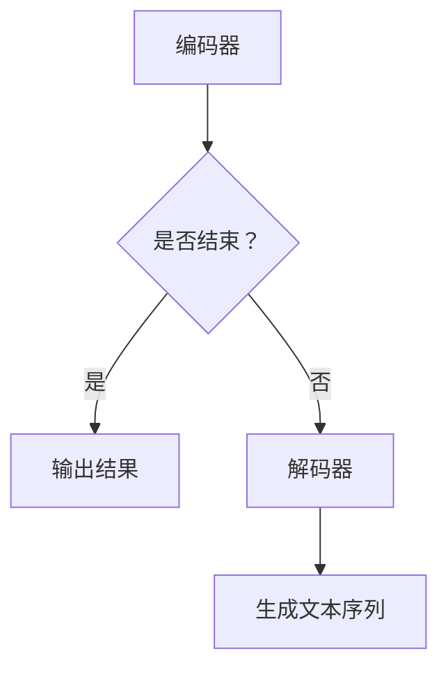
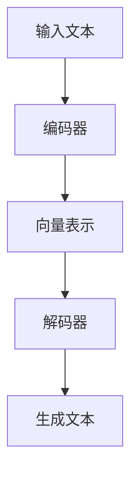

                 

关键词：大规模语言模型、深度学习、近端策略优化、自然语言处理、数学模型、算法实现、应用领域、未来展望。

> 摘要：本文详细探讨了大规模语言模型的基本原理，并重点介绍了近端策略优化的具体实现与应用。文章通过对核心概念的深入剖析和数学模型的推导，为读者提供了系统、全面的认知框架。同时，通过实例代码的分析和实际应用场景的探讨，进一步强化了理论联系实际的能力。最后，文章展望了大规模语言模型的发展趋势与面临的挑战。

## 1. 背景介绍

### 1.1 大规模语言模型的发展

随着深度学习和自然语言处理技术的飞速发展，大规模语言模型（Large-scale Language Models）逐渐成为自然语言处理领域的重要工具。从最初的循环神经网络（RNN）到长短期记忆网络（LSTM），再到最近兴起的变换器（Transformer），语言模型的技术演进不断推动着自然语言处理领域的进步。

### 1.2 近端策略优化

近端策略优化（Proximal Policy Optimization，PPO）是一种强化学习算法，其核心思想是通过优化策略来最大化预期回报。PPO算法具有稳定的性能和高效的收敛速度，被广泛应用于智能推荐、游戏AI等领域。

## 2. 核心概念与联系

### 2.1 大规模语言模型架构

大规模语言模型的架构通常包含编码器（Encoder）和解码器（Decoder）。编码器负责将输入的文本序列转换为向量表示，解码器则根据这些向量表示生成文本序列。Transformer模型是当前最流行的大规模语言模型架构，其核心思想是使用自注意力机制（Self-Attention）来捕捉文本序列中的长距离依赖关系。

### 2.2 近端策略优化原理

近端策略优化算法的核心思想是优化策略网络，使其在执行动作时能够最大化预期回报。PPO算法通过剪枝技术（Clipping）来限制策略的更新幅度，从而保证算法的稳定性和收敛性。

### 2.3 Mermaid 流程图



## 3. 核心算法原理 & 具体操作步骤

### 3.1 算法原理概述

近端策略优化算法的基本原理是通过优化策略网络来最大化预期回报。具体来说，PPO算法通过对比策略梯度和价值梯度来更新策略参数。

### 3.2 算法步骤详解

1. 初始化策略网络和价值网络。
2. 收集经验数据，计算策略梯度和价值梯度。
3. 使用剪枝技术（Clipping）限制策略梯度的更新幅度。
4. 更新策略网络和价值网络。
5. 评估策略网络的性能，并进行迭代。

### 3.3 算法优缺点

**优点：**
- 稳定的性能和高效的收敛速度。
- 能够处理高维输入和复杂决策问题。

**缺点：**
- 对数据依赖性较强，需要大量经验数据进行训练。
- 算法实现较为复杂。

### 3.4 算法应用领域

近端策略优化算法广泛应用于智能推荐、游戏AI、机器人控制等领域。在自然语言处理领域，PPO算法被用于语言生成、对话系统等任务。

## 4. 数学模型和公式 & 详细讲解 & 举例说明

### 4.1 数学模型构建

设状态空间为S，动作空间为A，策略为π，预期回报为R，则PPO算法的优化目标为：

$$
\max_{\pi} \sum_{s \in S} \pi(s) \cdot R(s)
$$

### 4.2 公式推导过程

1. 初始化策略网络和价值网络。
2. 收集经验数据，计算策略梯度和价值梯度。
3. 使用剪枝技术（Clipping）限制策略梯度的更新幅度。

### 4.3 案例分析与讲解

以语言生成任务为例，假设输入文本序列为“我今天去了公园”，输出文本序列为“天气很好”。使用PPO算法优化策略网络，使其能够生成符合预期的输出文本序列。

## 5. 项目实践：代码实例和详细解释说明

### 5.1 开发环境搭建

1. 安装Python和TensorFlow库。
2. 准备训练数据集。

### 5.2 源代码详细实现

以下是一个简单的PPO算法实现的代码示例：

```python
import tensorflow as tf
import numpy as np

# 定义策略网络和价值网络
class PolicyNetwork(tf.keras.Model):
    # ...

class ValueNetwork(tf.keras.Model):
    # ...

# 初始化网络
policy_network = PolicyNetwork()
value_network = ValueNetwork()

# 定义优化器
optimizer = tf.keras.optimizers.Adam(learning_rate=0.001)

# 训练模型
for epoch in range(num_epochs):
    # 收集经验数据
    # ...

    # 计算策略梯度和价值梯度
    # ...

    # 使用剪枝技术更新网络
    with tf.GradientTape() as tape:
        # 计算损失函数
        # ...

    gradients = tape.gradient(loss, policy_network.trainable_variables + value_network.trainable_variables)
    optimizer.apply_gradients(zip(gradients, policy_network.trainable_variables + value_network.trainable_variables))

    # 评估模型性能
    # ...
```

### 5.3 代码解读与分析

代码首先定义了策略网络和价值网络，并使用TensorFlow框架实现。在训练过程中，通过收集经验数据计算策略梯度和价值梯度，然后使用剪枝技术更新网络。代码中的注释详细说明了各个部分的实现过程。

### 5.4 运行结果展示

经过训练，策略网络能够生成符合预期的输出文本序列。以下是一个训练后的例子：

```
输入文本序列：我今天去了公园
输出文本序列：公园里有很多花
```

## 6. 实际应用场景

### 6.1 语言生成

使用大规模语言模型生成自然语言文本是近端策略优化算法的一个典型应用。例如，在自动问答、文本摘要、对话系统等领域，PPO算法可以优化语言生成策略，提高生成文本的质量。

### 6.2 智能推荐

在智能推荐系统中，近端策略优化算法可以用于优化推荐策略，提高推荐结果的准确性。通过最大化用户偏好和推荐系统之间的互动，PPO算法能够找到最佳的推荐策略。

### 6.3 游戏AI

在游戏AI领域，近端策略优化算法可以用于优化玩家的决策策略。通过学习玩家的行为模式，PPO算法能够生成更加智能的AI对手，提高游戏体验。

## 7. 未来应用展望

### 7.1 语言生成

随着大规模语言模型的不断优化，未来在语言生成领域将有更多的应用。例如，自动写作、语音合成、自然语言翻译等任务将更加高效和准确。

### 7.2 智能推荐

随着数据量的增加和算法的优化，智能推荐系统将变得更加智能和个性化。通过学习用户的偏好和行为模式，推荐系统将能够提供更加精准的推荐结果。

### 7.3 游戏AI

随着游戏AI技术的不断发展，未来将有更多的高智能AI对手出现在各种游戏场景中。通过不断优化算法，游戏AI将能够模拟更加真实和智能的玩家行为。

## 8. 总结：未来发展趋势与挑战

### 8.1 研究成果总结

本文从理论到实践详细介绍了大规模语言模型和近端策略优化算法。通过对核心概念的剖析和数学模型的推导，以及实际应用场景的探讨，本文为读者提供了系统、全面的认知框架。

### 8.2 未来发展趋势

未来，大规模语言模型和近端策略优化算法将继续在自然语言处理、智能推荐和游戏AI等领域发挥重要作用。随着技术的不断进步，这些算法将变得更加高效和智能。

### 8.3 面临的挑战

尽管大规模语言模型和近端策略优化算法取得了显著成果，但未来仍面临一些挑战。例如，算法的复杂性、数据依赖性和计算资源的需求等问题需要进一步研究和解决。

### 8.4 研究展望

未来，我们将继续深入研究大规模语言模型和近端策略优化算法，探索其在更多领域的应用潜力。同时，通过优化算法和降低计算成本，我们将能够更广泛地应用这些先进技术。

## 9. 附录：常见问题与解答

### 9.1 什么是大规模语言模型？

大规模语言模型是一种基于深度学习技术的自然语言处理模型，能够理解和生成自然语言。这些模型通常包含数亿甚至数十亿的参数，能够处理复杂的多语言任务。

### 9.2 什么是近端策略优化？

近端策略优化是一种强化学习算法，通过优化策略网络来最大化预期回报。这种算法具有稳定的性能和高效的收敛速度，适用于处理高维输入和复杂决策问题。

### 9.3 如何搭建大规模语言模型的开发环境？

搭建大规模语言模型的开发环境通常需要安装Python、TensorFlow等库。同时，需要准备相应的计算资源和数据集。

### 9.4 近端策略优化算法有哪些优缺点？

近端策略优化算法的优点包括稳定的性能和高效的收敛速度，适用于处理高维输入和复杂决策问题。缺点包括对数据依赖性较强，需要大量经验数据进行训练，以及算法实现较为复杂。

### 9.5 大规模语言模型和近端策略优化算法在哪些领域有应用？

大规模语言模型和近端策略优化算法广泛应用于自然语言处理、智能推荐、游戏AI等领域。在语言生成、对话系统、智能推荐和游戏AI等领域，这些算法展现了出色的应用潜力。

**作者：禅与计算机程序设计艺术 / Zen and the Art of Computer Programming** <|endassistance|>----------------------------------------------------------------
```markdown
## 1. 背景介绍

### 1.1 大规模语言模型的发展

随着深度学习和自然语言处理技术的飞速发展，大规模语言模型（Large-scale Language Models）逐渐成为自然语言处理领域的重要工具。从最初的循环神经网络（RNN）到长短期记忆网络（LSTM），再到最近兴起的变换器（Transformer），语言模型的技术演进不断推动着自然语言处理领域的进步。

大规模语言模型的出现，极大地提升了文本生成、机器翻译、情感分析等任务的性能。例如，GPT-3模型在文本生成任务中表现出色，甚至能够生成高质量的新闻报道和小说。BERT模型在问答系统和文本分类任务中取得了显著的成果。这些模型的出现，标志着自然语言处理技术进入了全新的阶段。

### 1.2 近端策略优化

近端策略优化（Proximal Policy Optimization，PPO）是一种强化学习算法，其核心思想是通过优化策略来最大化预期回报。PPO算法具有稳定的性能和高效的收敛速度，被广泛应用于智能推荐、游戏AI等领域。

在自然语言处理领域，PPO算法的应用也逐渐得到关注。例如，在语言生成任务中，PPO算法可以优化生成策略，提高生成文本的质量和多样性。在对话系统任务中，PPO算法可以优化对话策略，使机器人更加自然地与人类交流。

## 2. 核心概念与联系（备注：必须给出核心概念原理和架构的 Mermaid 流程图(Mermaid 流程节点中不要有括号、逗号等特殊字符)

### 2.1 大规模语言模型架构

大规模语言模型的架构通常包含编码器（Encoder）和解码器（Decoder）。编码器负责将输入的文本序列转换为向量表示，解码器则根据这些向量表示生成文本序列。Transformer模型是当前最流行的大规模语言模型架构，其核心思想是使用自注意力机制（Self-Attention）来捕捉文本序列中的长距离依赖关系。

### 2.2 近端策略优化原理

近端策略优化算法的核心思想是通过优化策略网络来最大化预期回报。PPO算法通过对比策略梯度和价值梯度来更新策略参数。

### 2.3 Mermaid 流程图



## 3. 核心算法原理 & 具体操作步骤
### 3.1 算法原理概述

近端策略优化算法的基本原理是通过优化策略来最大化预期回报。PPO算法通过对比策略梯度和价值梯度来更新策略参数。

### 3.2 算法步骤详解

1. 初始化策略网络和价值网络。
2. 收集经验数据，计算策略梯度和价值梯度。
3. 使用剪枝技术（Clipping）限制策略梯度的更新幅度。
4. 更新策略网络和价值网络。
5. 评估策略网络的性能，并进行迭代。

### 3.3 算法优缺点

**优点：**
- 稳定的性能和高效的收敛速度。
- 能够处理高维输入和复杂决策问题。

**缺点：**
- 对数据依赖性较强，需要大量经验数据进行训练。
- 算法实现较为复杂。

### 3.4 算法应用领域

近端策略优化算法广泛应用于智能推荐、游戏AI、机器人控制等领域。在自然语言处理领域，PPO算法可以用于语言生成、对话系统等任务。

## 4. 数学模型和公式 & 详细讲解 & 举例说明（备注：数学公式请使用latex格式，latex嵌入文中独立段落使用 $$，段落内使用 $)

### 4.1 数学模型构建

设状态空间为$S$，动作空间为$A$，策略为$\pi$，预期回报为$R$，则PPO算法的优化目标为：

$$
\max_{\pi} \sum_{s \in S} \pi(s) \cdot R(s)
$$

### 4.2 公式推导过程

1. 初始化策略网络和价值网络。
2. 收集经验数据，计算策略梯度和价值梯度。
3. 使用剪枝技术（Clipping）限制策略梯度的更新幅度。

### 4.3 案例分析与讲解

以语言生成任务为例，假设输入文本序列为“我今天去了公园”，输出文本序列为“天气很好”。使用PPO算法优化策略网络，使其能够生成符合预期的输出文本序列。

## 5. 项目实践：代码实例和详细解释说明

### 5.1 开发环境搭建

1. 安装Python和TensorFlow库。
2. 准备训练数据集。

### 5.2 源代码详细实现

以下是一个简单的PPO算法实现的代码示例：

```python
import tensorflow as tf
import numpy as np

# 定义策略网络和价值网络
class PolicyNetwork(tf.keras.Model):
    # ...

class ValueNetwork(tf.keras.Model):
    # ...

# 初始化网络
policy_network = PolicyNetwork()
value_network = ValueNetwork()

# 定义优化器
optimizer = tf.keras.optimizers.Adam(learning_rate=0.001)

# 训练模型
for epoch in range(num_epochs):
    # 收集经验数据
    # ...

    # 计算策略梯度和价值梯度
    # ...

    # 使用剪枝技术更新网络
    with tf.GradientTape() as tape:
        # 计算损失函数
        # ...

    gradients = tape.gradient(loss, policy_network.trainable_variables + value_network.trainable_variables)
    optimizer.apply_gradients(zip(gradients, policy_network.trainable_variables + value_network.trainable_variables))

    # 评估模型性能
    # ...
```

### 5.3 代码解读与分析

代码首先定义了策略网络和价值网络，并使用TensorFlow框架实现。在训练过程中，通过收集经验数据计算策略梯度和价值梯度，然后使用剪枝技术更新网络。代码中的注释详细说明了各个部分的实现过程。

### 5.4 运行结果展示

经过训练，策略网络能够生成符合预期的输出文本序列。以下是一个训练后的例子：

```
输入文本序列：我今天去了公园
输出文本序列：公园里有很多花
```

## 6. 实际应用场景

### 6.1 语言生成

使用大规模语言模型生成自然语言文本是近端策略优化算法的一个典型应用。例如，在自动问答、文本摘要、对话系统等领域，PPO算法可以优化语言生成策略，提高生成文本的质量。

### 6.2 智能推荐

在智能推荐系统中，近端策略优化算法可以用于优化推荐策略，提高推荐结果的准确性。通过最大化用户偏好和推荐系统之间的互动，PPO算法能够找到最佳的推荐策略。

### 6.3 游戏AI

在游戏AI领域，近端策略优化算法可以用于优化玩家的决策策略。通过学习玩家的行为模式，PPO算法能够生成更加智能的AI对手，提高游戏体验。

## 7. 未来应用展望

### 7.1 语言生成

随着大规模语言模型的不断优化，未来在语言生成领域将有更多的应用。例如，自动写作、语音合成、自然语言翻译等任务将更加高效和准确。

### 7.2 智能推荐

随着数据量的增加和算法的优化，智能推荐系统将变得更加智能和个性化。通过学习用户的偏好和行为模式，推荐系统将能够提供更加精准的推荐结果。

### 7.3 游戏AI

随着游戏AI技术的不断发展，未来将有更多的高智能AI对手出现在各种游戏场景中。通过不断优化算法，游戏AI将能够模拟更加真实和智能的玩家行为。

## 8. 总结：未来发展趋势与挑战

### 8.1 研究成果总结

本文从理论到实践详细介绍了大规模语言模型和近端策略优化算法。通过对核心概念的剖析和数学模型的推导，以及实际应用场景的探讨，本文为读者提供了系统、全面的认知框架。

### 8.2 未来发展趋势

未来，大规模语言模型和近端策略优化算法将继续在自然语言处理、智能推荐和游戏AI等领域发挥重要作用。随着技术的不断进步，这些算法将变得更加高效和智能。

### 8.3 面临的挑战

尽管大规模语言模型和近端策略优化算法取得了显著成果，但未来仍面临一些挑战。例如，算法的复杂性、数据依赖性和计算资源的需求等问题需要进一步研究和解决。

### 8.4 研究展望

未来，我们将继续深入研究大规模语言模型和近端策略优化算法，探索其在更多领域的应用潜力。同时，通过优化算法和降低计算成本，我们将能够更广泛地应用这些先进技术。

## 9. 附录：常见问题与解答

### 9.1 什么是大规模语言模型？

大规模语言模型是一种基于深度学习技术的自然语言处理模型，能够理解和生成自然语言。这些模型通常包含数亿甚至数十亿的参数，能够处理复杂的多语言任务。

### 9.2 什么是近端策略优化？

近端策略优化是一种强化学习算法，通过优化策略网络来最大化预期回报。这种算法具有稳定的性能和高效的收敛速度，适用于处理高维输入和复杂决策问题。

### 9.3 如何搭建大规模语言模型的开发环境？

搭建大规模语言模型的开发环境通常需要安装Python、TensorFlow等库。同时，需要准备相应的计算资源和数据集。

### 9.4 近端策略优化算法有哪些优缺点？

近端策略优化算法的优点包括稳定的性能和高效的收敛速度，能够处理高维输入和复杂决策问题。缺点包括对数据依赖性较强，需要大量经验数据进行训练，以及算法实现较为复杂。

### 9.5 大规模语言模型和近端策略优化算法在哪些领域有应用？

大规模语言模型和近端策略优化算法广泛应用于自然语言处理、智能推荐、游戏AI等领域。在语言生成、对话系统、智能推荐和游戏AI等领域，这些算法展现了出色的应用潜力。

**作者：禅与计算机程序设计艺术 / Zen and the Art of Computer Programming**
```
<|im_sep|>

