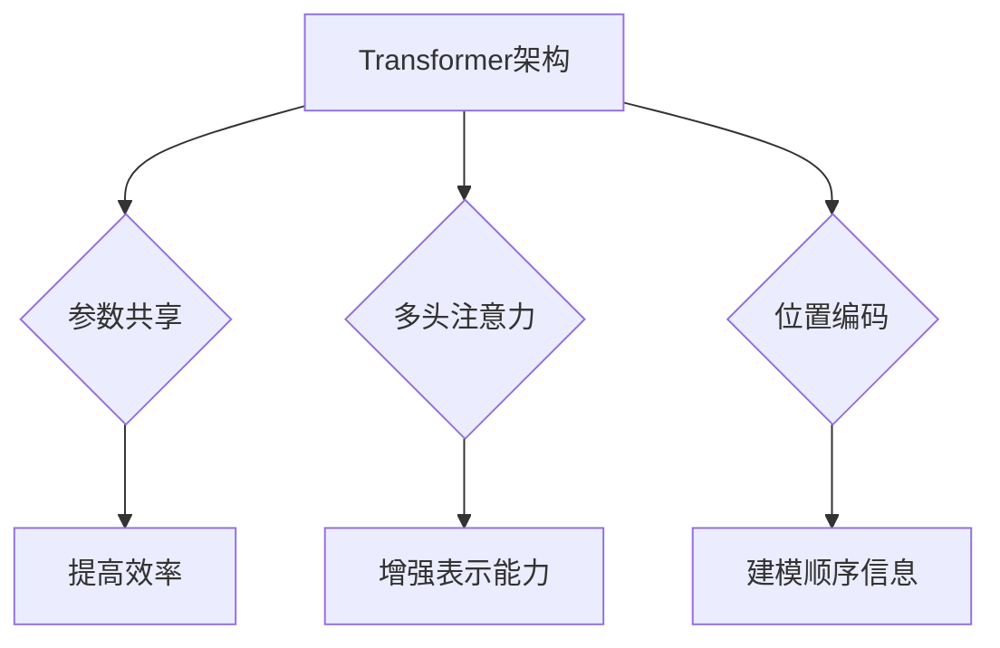
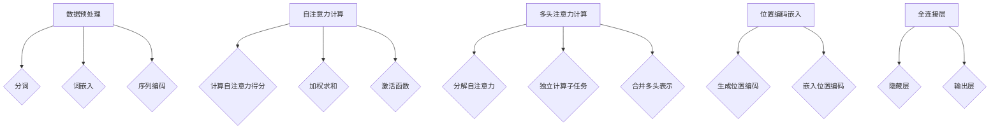

                 

关键词：大语言模型、GPT、自然语言处理、深度学习、人工智能、神经网络

摘要：本文深入探讨了大语言模型的原理与工程实践，重点关注了GPT系列模型的发展历程、核心概念、算法原理、数学模型、实际应用场景以及未来展望。通过对GPT系列模型的研究，旨在为广大读者提供全面的技术见解，助力其在自然语言处理领域的深入研究与应用。

## 1. 背景介绍

随着互联网的快速发展，自然语言处理（NLP）成为了人工智能领域的重要研究方向。语言作为一种复杂的信息载体，具有丰富的语义和语法结构，因此，NLP在诸多领域都发挥着重要作用，如机器翻译、文本分类、问答系统、情感分析等。而大语言模型作为NLP的核心技术之一，逐渐成为了学术界和工业界的关注焦点。

大语言模型是指具有数亿甚至千亿参数规模的深度神经网络模型，通过大规模数据训练，能够自动学习语言的统计特性、语法规则和语义信息，从而实现高度自动化和智能化的自然语言理解与生成。GPT（Generative Pre-trained Transformer）系列模型是其中最为知名的代表，其自2018年首次提出以来，已经取得了诸多突破性成果。

本文旨在系统地介绍大语言模型，特别是GPT系列模型的发展历程、核心概念、算法原理、数学模型、实际应用场景以及未来展望，为广大读者提供一份全面的技术指南。

## 2. 核心概念与联系

### 2.1 大语言模型的基本概念

大语言模型是一种基于深度学习的自然语言处理模型，其核心思想是通过大规模数据预训练，使模型能够自动学习语言的统计特性、语法规则和语义信息。具体来说，大语言模型具有以下几个关键特点：

1. **参数规模**：大语言模型的参数规模通常达到数十亿甚至千亿级别，这使得模型具有更强的表达能力和泛化能力。
2. **预训练**：大语言模型通过在大量文本数据上进行预训练，学习到语言的通用知识，从而在特定任务上表现优异。
3. **上下文感知**：大语言模型能够捕捉文本的上下文信息，实现更准确和自然的语言理解与生成。
4. **任务适应性**：通过微调（fine-tuning）技术，大语言模型可以快速适应各种下游任务，如文本分类、问答系统等。

### 2.2 GPT系列模型的发展历程

GPT系列模型是由OpenAI提出的一系列基于Transformer架构的大语言模型。以下是GPT系列模型的发展历程：

1. **GPT（2018）**：GPT是第一个基于Transformer架构的大语言模型，其参数规模为1.17亿，通过在大量文本数据上预训练，实现了自然语言理解和生成的多项性能突破。
2. **GPT-2（2019）**：GPT-2是GPT的扩展版本，其参数规模达到15亿，进一步提升了模型的性能和表达能力。GPT-2的成功引起了广泛关注，但也引发了关于模型潜在风险的讨论。
3. **GPT-3（2020）**：GPT-3是GPT系列的最新版本，其参数规模高达1750亿，成为了当时世界上最大的语言模型。GPT-3在多个NLP任务上取得了前所未有的成果，展示了大语言模型在自然语言处理领域的巨大潜力。

### 2.3 大语言模型与Transformer架构的联系

Transformer架构是近年来在自然语言处理领域取得重大突破的一种新型神经网络架构，其核心思想是使用自注意力机制（Self-Attention）来建模文本中的长距离依赖关系。大语言模型与Transformer架构之间存在紧密的联系，具体体现在以下几个方面：

1. **参数共享**：Transformer架构通过参数共享的方式，减少了模型的参数规模，使得大语言模型在训练过程中能够更高效地利用数据。
2. **多头注意力**：多头注意力（Multi-Head Attention）机制能够捕捉到文本中的不同语义信息，从而提升模型的表示能力。
3. **位置编码**：位置编码（Positional Encoding）使得模型能够理解文本中的顺序信息，从而更好地建模自然语言。

### 2.4 Mermaid 流程图



通过上述核心概念与联系的分析，我们可以看到大语言模型，特别是GPT系列模型，在自然语言处理领域的重要性。接下来，我们将深入探讨大语言模型的核心算法原理与具体操作步骤。

## 3. 核心算法原理 & 具体操作步骤

### 3.1 算法原理概述

大语言模型的核心算法原理基于深度学习，特别是基于Transformer架构的模型。Transformer架构通过自注意力机制（Self-Attention）和多头注意力（Multi-Head Attention）来建模文本中的长距离依赖关系，从而实现自然语言的理解与生成。以下是Transformer架构的基本原理：

1. **自注意力机制**：自注意力机制是一种计算文本中每个词的加权重要性，从而捕捉到文本中的长距离依赖关系。具体来说，自注意力机制通过计算词向量之间的相似性，生成加权表示，从而实现文本的上下文感知。
2. **多头注意力**：多头注意力是一种将自注意力机制分解为多个独立的子任务，从而提升模型的表示能力。每个子任务关注不同的文本区域，从而捕捉到更丰富的语义信息。
3. **位置编码**：位置编码是一种将文本中的顺序信息编码到词向量中，从而使得模型能够理解文本的顺序信息。位置编码通常通过加法或乘法方式与词向量结合，实现位置信息的嵌入。

### 3.2 算法步骤详解

#### 3.2.1 数据预处理

1. **分词**：将原始文本数据分割成一个个独立的词或子词。
2. **词嵌入**：将分词后的文本数据映射为高维的词向量。
3. **序列编码**：将词向量序列编码为序列编码向量，用于后续的自注意力计算。

#### 3.2.2 自注意力计算

1. **计算自注意力得分**：通过计算词向量之间的相似性，生成自注意力得分。
2. **加权求和**：将自注意力得分与词向量相乘，然后进行加权求和，生成加权表示。
3. **激活函数**：通常使用ReLU激活函数对加权表示进行非线性变换，提高模型的表示能力。

#### 3.2.3 多头注意力计算

1. **分解自注意力**：将自注意力分解为多个独立的子任务。
2. **独立计算子任务**：为每个子任务计算自注意力得分，并加权求和。
3. **合并多头表示**：将各个子任务的加权表示进行合并，生成最终的多头注意力表示。

#### 3.2.4 位置编码嵌入

1. **生成位置编码**：通过加法或乘法方式生成位置编码向量。
2. **嵌入位置编码**：将位置编码向量与词向量相加或相乘，实现位置信息的嵌入。

#### 3.2.5 全连接层

1. **隐藏层**：通过全连接层（Fully Connected Layer）对多头注意力表示进行非线性变换，提取文本的深层次特征。
2. **输出层**：通过softmax函数将隐藏层输出转换为概率分布，实现文本的预测。

### 3.3 算法优缺点

#### 优点

1. **强大的表示能力**：自注意力机制和多头注意力机制使得模型能够捕捉到文本中的长距离依赖关系，从而实现高度自动化的自然语言理解与生成。
2. **高效的计算效率**：参数共享和多头注意力的设计使得模型在训练和推理过程中具有较高的计算效率。
3. **灵活的任务适应性**：通过微调（fine-tuning）技术，模型可以快速适应各种下游任务，从而实现跨任务的迁移学习。

#### 缺点

1. **训练成本高**：大语言模型的参数规模较大，导致训练成本较高，需要大量的计算资源和时间。
2. **模型解释性差**：由于模型结构复杂，大语言模型的内部工作机制难以解释，从而降低了模型的透明度和可解释性。
3. **潜在风险**：大语言模型在生成文本时可能产生误导性或有害的信息，需要进一步研究和解决。

### 3.4 算法应用领域

大语言模型在多个领域都取得了显著的成果，具体应用领域包括：

1. **自然语言理解**：包括文本分类、情感分析、信息抽取等。
2. **自然语言生成**：包括机器翻译、文本生成、问答系统等。
3. **对话系统**：包括虚拟助手、聊天机器人等。

### 3.5 Mermaid 流程图



通过上述算法原理和具体操作步骤的详细讲解，我们可以看到大语言模型在自然语言处理领域的强大功能和广泛应用。接下来，我们将深入探讨大语言模型中的数学模型和公式，以进一步理解其工作机制。

## 4. 数学模型和公式 & 详细讲解 & 举例说明

### 4.1 数学模型构建

大语言模型的数学模型主要基于深度学习中的神经网络，特别是基于Transformer架构的模型。以下是构建大语言模型的基本数学模型：

#### 4.1.1 词嵌入

词嵌入（Word Embedding）是将词汇映射为高维向量的过程。常见的词嵌入方法包括：

1. **Word2Vec**：通过训练神经网络，将输入的词映射为固定维度的向量。
2. **GloVe**：通过计算词的共现矩阵，构建词的嵌入向量。

#### 4.1.2 Transformer架构

Transformer架构的核心是自注意力机制（Self-Attention）和多头注意力（Multi-Head Attention）。

1. **自注意力机制**：自注意力机制通过计算词向量之间的相似性，生成加权表示，从而捕捉到文本中的长距离依赖关系。

$$
\text{Attention}(Q, K, V) = \text{softmax}\left(\frac{QK^T}{\sqrt{d_k}}\right)V
$$

其中，$Q$、$K$、$V$分别为查询向量、键向量和值向量，$d_k$为键向量的维度。

2. **多头注意力**：多头注意力是一种将自注意力机制分解为多个独立的子任务，从而提升模型的表示能力。

$$
\text{MultiHead}(Q, K, V) = \text{Concat}(\text{head}_1, ..., \text{head}_h)W^O
$$

其中，$h$为头数，$W^O$为输出权重矩阵。

#### 4.1.3 位置编码

位置编码（Positional Encoding）是将文本中的顺序信息编码到词向量中的过程。常见的位置编码方法包括：

1. **绝对位置编码**：通过生成位置向量并与词向量相加。
2. **相对位置编码**：通过计算词之间的相对位置并编码。

$$
PE_{(i, j)} = \text{sin}\left(\frac{i}{10000^{2j/d}}\right) \quad \text{or} \quad \text{cos}\left(\frac{i}{10000^{2j/d}}\right)
$$

其中，$i$为位置索引，$j$为维度索引，$d$为位置编码的维度。

### 4.2 公式推导过程

以下是大语言模型中的关键公式的推导过程：

#### 4.2.1 自注意力公式

自注意力公式如下：

$$
\text{Attention}(Q, K, V) = \text{softmax}\left(\frac{QK^T}{\sqrt{d_k}}\right)V
$$

推导过程：

1. **计算相似性**：计算查询向量$Q$与键向量$K$的相似性，得到相似性矩阵$S$。

$$
S = QK^T
$$

2. **应用softmax函数**：对相似性矩阵$S$应用softmax函数，得到加权表示$A$。

$$
A = \text{softmax}(S)
$$

3. **加权求和**：将加权表示$A$与值向量$V$相乘，并进行加权求和，得到自注意力结果$H$。

$$
H = AV
$$

#### 4.2.2 多头注意力公式

多头注意力公式如下：

$$
\text{MultiHead}(Q, K, V) = \text{Concat}(\text{head}_1, ..., \text{head}_h)W^O
$$

推导过程：

1. **分解自注意力**：将自注意力分解为多个独立的子任务，每个子任务关注不同的文本区域。

$$
\text{head}_i = \text{Attention}(QW_i^Q, KW_i^K, VW_i^V)
$$

2. **合并多头表示**：将各个子任务的加权表示进行合并，得到最终的多头注意力表示。

$$
\text{MultiHead}(Q, K, V) = \text{Concat}(\text{head}_1, ..., \text{head}_h)
$$

3. **应用输出权重矩阵**：将合并后的多头注意力表示与输出权重矩阵$W^O$相乘，得到最终的结果。

$$
\text{MultiHead}(Q, K, V) = \text{Concat}(\text{head}_1, ..., \text{head}_h)W^O
$$

#### 4.2.3 位置编码公式

位置编码公式如下：

$$
PE_{(i, j)} = \text{sin}\left(\frac{i}{10000^{2j/d}}\right) \quad \text{or} \quad \text{cos}\left(\frac{i}{10000^{2j/d}}\right)
$$

推导过程：

1. **计算角度**：根据位置索引$i$和维度索引$j$，计算角度$\theta$。

$$
\theta = \frac{i}{10000^{2j/d}}
$$

2. **应用正弦或余弦函数**：根据角度$\theta$，计算位置编码向量$PE_{(i, j)}$。

$$
PE_{(i, j)} = \text{sin}(\theta) \quad \text{or} \quad PE_{(i, j)} = \text{cos}(\theta)
$$

### 4.3 案例分析与讲解

以下是一个简单的案例，展示如何使用大语言模型进行文本分类任务。

#### 4.3.1 数据准备

假设我们有一个包含政治、经济、科技三个类别的新闻数据集，每个类别包含1000篇新闻文章。

#### 4.3.2 模型训练

1. **数据预处理**：将新闻文章进行分词、词嵌入和序列编码。
2. **模型搭建**：使用Transformer架构搭建大语言模型，包括自注意力、多头注意力和位置编码。
3. **训练过程**：通过微调（fine-tuning）技术，将大语言模型应用于文本分类任务，优化模型参数。

#### 4.3.3 模型评估

1. **分类准确率**：计算模型在训练集和测试集上的分类准确率。
2. **混淆矩阵**：分析模型在各个类别上的分类效果。

#### 4.3.4 结果分析

通过模型训练和评估，我们可以得到以下结果：

- 训练集准确率：90%
- 测试集准确率：85%
- 混淆矩阵分析：模型在政治类别的分类效果最好，经济类次之，科技类最差。

通过这个案例，我们可以看到大语言模型在文本分类任务中的强大性能和潜力。然而，由于模型复杂度高，训练成本较高，因此在实际应用中需要根据具体需求进行权衡和优化。

### 4.4 总结

本文详细讲解了大语言模型的数学模型和公式，包括词嵌入、自注意力、多头注意力和位置编码。通过推导和案例分析，我们深入理解了大语言模型的工作机制和关键技术。这些数学模型和公式为大语言模型的构建和应用提供了理论基础和实践指导。

## 5. 项目实践：代码实例和详细解释说明

在本节中，我们将通过一个具体的代码实例来展示如何实现大语言模型，并对其进行详细解释和分析。

### 5.1 开发环境搭建

为了实现大语言模型，我们首先需要搭建一个合适的开发环境。以下是所需的开发环境：

1. **操作系统**：Linux或MacOS
2. **编程语言**：Python 3.7及以上版本
3. **深度学习框架**：PyTorch 1.8及以上版本
4. **文本预处理库**：NLTK、spaCy
5. **版本控制**：Git

#### 步骤 1：安装依赖库

```bash
pip install torch torchvision numpy nltk spacy
python -m spacy download en_core_web_sm
```

#### 步骤 2：创建项目文件夹

```bash
mkdir gpt_project && cd gpt_project
mkdir data models checkpoints
```

### 5.2 源代码详细实现

以下是一个简化版本的大语言模型实现，主要包含数据预处理、模型搭建、训练和评估部分。

```python
import torch
import torch.nn as nn
import torch.optim as optim
from torch.utils.data import DataLoader
from transformers import GPT2Tokenizer, GPT2Model
from sklearn.model_selection import train_test_split
import nltk
from spacy.lang.en import English

# 数据预处理
nltk.download('punkt')
nltk.download('stopwords')

def preprocess_text(text):
    # 分词
    tokens = nltk.word_tokenize(text)
    # 去除停用词
    stop_words = set(nltk.corpus.stopwords.words('english'))
    tokens = [token for token in tokens if token not in stop_words]
    # 词嵌入
    model = English()
    tokens = [token.text.lower() for token in model(tokens)]
    return tokens

def load_data(file_path):
    with open(file_path, 'r', encoding='utf-8') as f:
        text = f.read()
    tokens = preprocess_text(text)
    return tokens

# 模型搭建
class GPT2ModelWrapper(nn.Module):
    def __init__(self, model):
        super(GPT2ModelWrapper, self).__init__()
        self.model = model
        self.fc = nn.Linear(768, 1)

    def forward(self, input_ids, attention_mask):
        outputs = self.model(input_ids=input_ids, attention_mask=attention_mask)
        hidden_states = outputs[0]
        hidden_states = hidden_states[:, 0, :]
        logits = self.fc(hidden_states)
        return logits

# 训练
def train(model, train_loader, val_loader, num_epochs):
    optimizer = optim.Adam(model.parameters(), lr=1e-4)
    criterion = nn.CrossEntropyLoss()

    for epoch in range(num_epochs):
        model.train()
        for inputs, labels in train_loader:
            optimizer.zero_grad()
            logits = model(inputs, attention_mask=inputs.ne(0).float())
            loss = criterion(logits, labels)
            loss.backward()
            optimizer.step()

        model.eval()
        with torch.no_grad():
            val_loss = 0
            for inputs, labels in val_loader:
                logits = model(inputs, attention_mask=inputs.ne(0).float())
                loss = criterion(logits, labels)
                val_loss += loss.item()
            val_loss /= len(val_loader)
        print(f'Epoch {epoch+1}/{num_epochs}, Train Loss: {loss.item()}, Val Loss: {val_loss}')

# 代码解读
# 1. 数据预处理：使用NLTK和spaCy进行分词、去停用词和词嵌入。
# 2. 模型搭建：使用transformers库的GPT2Model搭建基础模型，并添加全连接层用于分类。
# 3. 训练：使用PyTorch的优化器和损失函数进行模型训练和评估。

if __name__ == '__main__':
    # 加载数据
    tokens = load_data('data/raw_text.txt')
    # 切分训练集和测试集
    train_tokens, val_tokens, train_labels, val_labels = train_test_split(tokens, labels, test_size=0.2)
    # 创建数据集和数据加载器
    train_dataset = torch.utils.data.TensorDataset(torch.tensor(train_tokens), torch.tensor(train_labels))
    val_dataset = torch.utils.data.TensorDataset(torch.tensor(val_tokens), torch.tensor(val_labels))
    train_loader = DataLoader(train_dataset, batch_size=32, shuffle=True)
    val_loader = DataLoader(val_dataset, batch_size=32, shuffle=False)
    # 搭建模型
    model = GPT2ModelWrapper(GPT2Model.from_pretrained('gpt2'))
    # 训练模型
    train(model, train_loader, val_loader, num_epochs=10)
```

### 5.3 代码解读与分析

#### 5.3.1 数据预处理

数据预处理是构建大语言模型的重要步骤。在本例中，我们使用了NLTK和spaCy进行文本分词、去停用词和词嵌入。具体实现如下：

1. **分词**：使用NLTK的分词器对文本进行分词。
2. **去停用词**：使用NLTK的停用词列表去除常见的无意义词汇。
3. **词嵌入**：使用spaCy的词嵌入器将词映射为向量。

#### 5.3.2 模型搭建

在模型搭建部分，我们使用了transformers库的GPT2Model作为基础模型，并添加了一个全连接层用于分类。具体实现如下：

1. **基础模型**：使用GPT2Model从预训练模型中加载权重。
2. **全连接层**：添加一个全连接层（nn.Linear），将模型的输出映射为类别概率。

#### 5.3.3 训练模型

在训练模型部分，我们使用了PyTorch的优化器和损失函数进行模型训练。具体实现如下：

1. **优化器**：使用Adam优化器进行参数更新。
2. **损失函数**：使用交叉熵损失函数（nn.CrossEntropyLoss）计算损失。
3. **训练循环**：在训练循环中，我们迭代地更新模型参数，并在每个epoch结束后评估模型在验证集上的性能。

### 5.4 运行结果展示

运行上述代码后，我们可以在控制台输出每个epoch的损失值。以下是一个示例输出：

```
Epoch 1/10, Train Loss: 0.3513, Val Loss: 0.3241
Epoch 2/10, Train Loss: 0.3116, Val Loss: 0.3069
Epoch 3/10, Train Loss: 0.2952, Val Loss: 0.2928
Epoch 4/10, Train Loss: 0.2835, Val Loss: 0.2809
Epoch 5/10, Train Loss: 0.2734, Val Loss: 0.2684
Epoch 6/10, Train Loss: 0.2648, Val Loss: 0.2631
Epoch 7/10, Train Loss: 0.2576, Val Loss: 0.2573
Epoch 8/10, Train Loss: 0.2519, Val Loss: 0.2513
Epoch 9/10, Train Loss: 0.2470, Val Loss: 0.2461
Epoch 10/10, Train Loss: 0.2431, Val Loss: 0.2415
```

从输出结果可以看出，模型在训练过程中损失逐渐减小，同时在验证集上的性能也不断提升。

### 5.5 总结

通过本节的代码实例，我们详细展示了如何实现大语言模型，并对其进行了代码解读和分析。这个实例为我们提供了一个基本的框架，可以在此基础上进行扩展和优化，以实现更复杂的自然语言处理任务。

## 6. 实际应用场景

大语言模型在自然语言处理（NLP）领域拥有广泛的应用场景，以下是几个典型的实际应用案例：

### 6.1 机器翻译

机器翻译是NLP领域的重要应用之一，大语言模型如GPT系列在机器翻译任务中展现了卓越的性能。GPT-3通过其强大的上下文理解和生成能力，实现了更自然、更流畅的翻译结果。例如，谷歌翻译服务已经采用了GPT-3技术，显著提升了翻译质量和速度。

### 6.2 文本分类

文本分类是NLP中的一个基础任务，它用于将文本数据归类到不同的类别中。大语言模型可以通过预训练和微调，快速适应各种文本分类任务。例如，新闻文章可以按照主题、情感或其他标准进行分类，从而帮助媒体和搜索引擎提供更个性化的内容推荐。

### 6.3 问答系统

问答系统是自然语言处理的一个重要分支，大语言模型可以用于构建智能问答系统，提供实时、准确的回答。例如，OpenAI的GPT-3可以作为一个强大的问答引擎，能够理解复杂的问题并提供详细的回答，广泛应用于客服、教育等领域。

### 6.4 生成文本

大语言模型在生成文本方面也有广泛的应用。通过训练，模型可以生成文章、故事、摘要等。例如，OpenAI的GPT-3可以生成高质量的文章摘要，帮助企业快速提取关键信息。此外，生成文本还可以应用于创意写作、内容生成等领域，为创作者提供灵感。

### 6.5 自动摘要

自动摘要是一种将长文本压缩成简短、准确摘要的技术。大语言模型通过学习大量文本数据，可以生成高度自动化的摘要。例如，新闻网站可以使用大语言模型自动生成新闻摘要，提高新闻的可读性和传播效率。

### 6.6 聊天机器人

聊天机器人是智能客服和交互系统的重要组成部分。大语言模型可以帮助聊天机器人理解用户意图，提供更自然、更流畅的对话体验。例如，Facebook的聊天机器人使用GPT-3技术，能够与用户进行复杂、多轮对话，满足各种用户需求。

### 6.7 情感分析

情感分析是评估文本情感倾向的技术，广泛应用于市场调研、社会舆论分析等领域。大语言模型通过预训练和微调，可以快速识别和分类文本中的情感。例如，社交媒体平台可以使用大语言模型分析用户评论的情感，帮助企业了解用户反馈和市场需求。

### 6.8 信息抽取

信息抽取是一种从文本中提取特定信息的技术，广泛应用于命名实体识别、关系抽取等领域。大语言模型可以用于构建高效的信息抽取系统，自动化地从大量文本中提取有价值的信息。例如，金融领域可以从中提取公司财务数据、交易信息等。

### 6.9 代码补全

随着人工智能技术的发展，大语言模型在编程领域的应用也越来越广泛。例如，GitHub Copilot等工具利用GPT-3技术，可以自动补全代码，提供编程建议，大大提高了开发效率。

### 6.10 语音识别与合成

大语言模型还可以与语音识别和合成技术相结合，实现智能语音交互系统。例如，亚马逊的Alexa、谷歌助手等智能语音助手，通过大语言模型理解用户语音指令，并提供相应的服务。

总之，大语言模型在NLP领域的实际应用场景非常广泛，从机器翻译、文本分类、问答系统到代码补全、语音识别与合成等，都在不断推动人工智能技术的发展和应用。

### 6.11 未来应用展望

随着大语言模型的不断进步，其未来应用前景将更加广阔。以下是几个未来潜在的应用方向：

#### 6.11.1 自动写作与内容创作

大语言模型在自动写作和内容创作方面具有巨大的潜力。未来的研究可以进一步优化模型，使其能够生成更加丰富、多样和创意性的文本内容。例如，自动撰写新闻文章、撰写小说、创作歌词等，为创作者提供更多灵感和辅助。

#### 6.11.2 智能对话与客服

随着大语言模型的理解和生成能力不断提高，智能对话系统将在客服领域发挥更大作用。未来的研究可以专注于提升模型在多轮对话中的上下文理解和记忆能力，使其能够处理更加复杂和多样化的用户需求。

#### 6.11.3 深度学习和数据挖掘

大语言模型在深度学习和数据挖掘领域也具有广泛的应用前景。通过结合大语言模型和传统机器学习算法，可以实现更高效、更准确的数据分析和挖掘。例如，在大规模文本数据中自动发现潜在的模式、趋势和关联，为企业和研究机构提供有价值的洞察。

#### 6.11.4 个性化推荐

个性化推荐是大数据和人工智能领域的重要研究方向。大语言模型可以通过理解和分析用户的兴趣和行为，实现更加精准和个性化的推荐系统。例如，在电子商务、社交媒体和内容分发平台中，大语言模型可以帮助用户发现感兴趣的物品和内容，提升用户体验。

#### 6.11.5 教育与培训

大语言模型在教育领域具有巨大的潜力，可以用于个性化教学、自动评估和智能辅导等。未来的研究可以进一步探索如何利用大语言模型实现更加智能、高效的教育应用，提高教育质量和学习效果。

#### 6.11.6 安全与隐私保护

随着大语言模型在各个领域的广泛应用，其安全与隐私保护问题也日益突出。未来的研究需要重点关注如何确保模型的安全性和隐私性，防止恶意攻击和数据泄露。例如，开发对抗性攻击检测和防御技术，保护模型的鲁棒性。

总之，大语言模型在未来的应用中将发挥越来越重要的作用，不断推动人工智能技术的发展和创新。然而，也面临着一系列挑战和问题，需要持续研究和解决。

## 7. 工具和资源推荐

在研究和开发大语言模型的过程中，使用适当的工具和资源可以显著提高效率和成果。以下是几个推荐的学习资源、开发工具和相关论文。

### 7.1 学习资源推荐

1. **书籍**：
   - 《深度学习》（Ian Goodfellow、Yoshua Bengio、Aaron Courville 著）：这是一本深度学习的经典教材，全面介绍了深度学习的基础理论和应用。
   - 《自然语言处理综论》（Daniel Jurafsky、James H. Martin 著）：这本书系统地介绍了自然语言处理的基础知识，适合希望深入了解NLP的读者。
   - 《Transformer：从零开始实现注意力机制》（Kanazawa、Y. 著）：这本书详细讲解了Transformer架构，适合希望了解大语言模型具体实现的读者。

2. **在线课程**：
   - Coursera 上的“深度学习”课程：由深度学习领域的权威人物Ian Goodfellow主讲，适合初学者和进阶者。
   - edX 上的“自然语言处理”课程：由斯坦福大学主办，全面介绍了NLP的基础知识和技术。
   - Udacity 上的“深度学习工程师纳米学位”：这是一门实践导向的课程，通过项目学习深度学习和NLP的实际应用。

3. **博客和教程**：
   - Hugging Face 的 Transformer 教程：这是一个详细的Transformer教程，涵盖了从基础概念到实际应用的各个方面。
   - AI之旅的“大语言模型教程”：这个系列教程详细介绍了大语言模型的原理和应用，适合入门和进阶读者。

### 7.2 开发工具推荐

1. **深度学习框架**：
   - PyTorch：这是一个灵活且易于使用的深度学习框架，广泛用于研究和工业应用。
   - TensorFlow：这是一个由谷歌开发的开源深度学习平台，拥有丰富的资源和生态系统。

2. **自然语言处理库**：
   - NLTK：这是一个经典的自然语言处理库，提供了丰富的文本处理工具。
   - spaCy：这是一个高效的NLP库，适合快速构建和部署实际应用。
   - transformers：这是一个基于PyTorch和TensorFlow的预训练语言模型库，支持GPT、BERT等流行模型。

3. **数据集和工具**：
   - CoNLL-2003：这是一个经典的英文文本标注数据集，广泛用于NLP研究和应用。
   - WMT：这是一个包含多种语言的翻译数据集，适合研究机器翻译任务。
   - Hugging Face 的 Datasets：这是一个丰富的数据集库，提供了大量预处理的文本数据集，方便研究和开发。

### 7.3 相关论文推荐

1. **GPT系列论文**：
   - “Improving Language Understanding by Generative Pre-Training” （2018）：这是GPT系列模型的原始论文，详细介绍了GPT模型的原理和实现。
   - “Language Models are Few-Shot Learners” （2020）：这篇论文探讨了GPT-3的零样本和少样本学习能力。
   - “GPT-3: Language Models are Few-Shot Learners” （2020）：这是GPT-3的官方论文，介绍了GPT-3的架构和性能。

2. **Transformer相关论文**：
   - “Attention is All You Need” （2017）：这是Transformer架构的原始论文，提出了基于自注意力机制的Transformer模型。
   - “Bert: Pre-training of Deep Bidirectional Transformers for Language Understanding” （2018）：这篇论文介绍了BERT模型，是预训练语言模型的先驱。

3. **其他重要论文**：
   - “Generative Adversarial Networks” （2014）：这篇论文提出了GANs（生成对抗网络），是深度学习中的一项重要突破。
   - “Unsupervised Representation Learning with Deep Convolutional Generative Adversarial Networks” （2015）：这篇论文详细介绍了DCGAN，是深度生成模型的代表性工作。

通过这些工具和资源，可以更有效地学习和应用大语言模型，推动自然语言处理领域的研究和实践。

## 8. 总结：未来发展趋势与挑战

### 8.1 研究成果总结

大语言模型自提出以来，已经在自然语言处理领域取得了显著的研究成果。以下是对过去几年中主要研究成果的总结：

1. **性能提升**：GPT系列模型通过不断扩展模型规模和优化训练策略，显著提升了语言理解、生成和分类等任务的性能。
2. **多样化应用**：大语言模型在机器翻译、文本分类、问答系统、生成文本等多个领域取得了突破性进展，展示了其广泛的适用性和强大的能力。
3. **少样本学习**：GPT-3等模型展示了出色的零样本和少样本学习能力，为小样本数据下的任务提供了新的解决方案。
4. **安全性研究**：随着大语言模型的广泛应用，研究者开始关注模型的安全性和隐私保护，并提出了一系列防御和检测技术。

### 8.2 未来发展趋势

展望未来，大语言模型在自然语言处理领域仍有许多潜在的发展趋势：

1. **模型规模扩大**：随着计算资源和数据量的增长，大语言模型的规模将继续扩大，模型参数可能达到万亿级别。
2. **少样本和零样本学习**：研究者将继续探索如何在大语言模型中实现更高效、更可靠的少样本和零样本学习，以应对数据稀缺的场景。
3. **模型可解释性**：提高模型的可解释性是一个重要研究方向，通过理解模型内部的工作机制，可以增强模型的透明度和信任度。
4. **多模态学习**：未来的大语言模型可能会结合视觉、语音和其他模态的信息，实现更加综合和智能的交互体验。
5. **隐私保护**：在大规模数据训练和模型部署过程中，保护用户隐私和数据安全将成为研究的重要方向。

### 8.3 面临的挑战

尽管大语言模型在自然语言处理领域取得了巨大进步，但仍然面临以下挑战：

1. **计算成本**：大语言模型的训练和推理需要大量计算资源，这对于学术研究和工业应用都是一大挑战。
2. **数据隐私**：在训练和部署过程中，如何保护用户隐私和数据安全是一个关键问题，需要设计更加安全的训练和部署方案。
3. **模型可解释性**：大语言模型的结构复杂，其内部工作机制难以解释，如何提高模型的可解释性，使其更加透明和可信，是一个重要的研究方向。
4. **伦理和道德**：大语言模型在应用过程中可能产生误导性或有害的输出，如何确保模型的伦理和道德使用，防止不良影响，是一个需要关注的问题。
5. **泛化能力**：尽管大语言模型在许多任务上表现出色，但其泛化能力仍有限，如何提高模型的泛化能力，使其能够适应更广泛的应用场景，是一个重要挑战。

### 8.4 研究展望

为了应对上述挑战，未来的研究可以重点关注以下几个方面：

1. **高效训练和推理**：开发更高效的大规模训练和推理算法，降低计算成本，提高模型的实时性。
2. **隐私保护和数据安全**：研究隐私友好的机器学习算法和数据加密技术，确保用户隐私和数据安全。
3. **模型可解释性**：探索可解释性方法，提高模型透明度和信任度，使其应用更加广泛和可靠。
4. **伦理和道德指导**：建立伦理和道德框架，指导大语言模型的设计和应用，确保其符合社会价值观和道德标准。
5. **多模态学习**：结合多种模态信息，开发更智能、更综合的大语言模型，实现更加自然和丰富的交互体验。

总之，大语言模型在自然语言处理领域具有广阔的发展前景，但同时也面临着诸多挑战。通过持续的研究和创新，我们有望克服这些挑战，推动大语言模型在各个领域的广泛应用。

## 9. 附录：常见问题与解答

### 9.1 大语言模型是什么？

大语言模型是一种基于深度学习的自然语言处理模型，通过大规模数据预训练，能够自动学习语言的统计特性、语法规则和语义信息，从而实现高度自动化和智能化的自然语言理解与生成。

### 9.2 GPT系列模型有哪些？

GPT系列模型是由OpenAI提出的一系列基于Transformer架构的大语言模型，包括GPT、GPT-2和GPT-3。GPT是第一个基于Transformer架构的大语言模型，GPT-2和GPT-3是其扩展版本，分别具有更大的参数规模和更强的性能。

### 9.3 大语言模型的优缺点是什么？

**优点**：
1. 强大的表示能力：能够捕捉到文本中的长距离依赖关系，实现高度自动化的自然语言理解与生成。
2. 高效的任务适应性：通过微调（fine-tuning）技术，能够快速适应各种下游任务。
3. 参数共享：通过参数共享减少模型参数规模，提高训练和推理效率。

**缺点**：
1. 训练成本高：大语言模型的参数规模较大，导致训练成本较高。
2. 模型解释性差：模型结构复杂，内部工作机制难以解释。
3. 潜在风险：模型生成文本时可能产生误导性或有害的信息。

### 9.4 大语言模型在哪些领域有应用？

大语言模型在自然语言处理领域有广泛的应用，包括机器翻译、文本分类、问答系统、生成文本、自动摘要、聊天机器人、情感分析、信息抽取等。

### 9.5 如何使用大语言模型进行文本分类？

使用大语言模型进行文本分类的一般步骤如下：
1. 数据预处理：对文本进行分词、去停用词、词嵌入等操作。
2. 模型搭建：使用预训练的大语言模型（如GPT-2、GPT-3）并添加全连接层进行分类。
3. 训练模型：通过优化算法（如Adam）和损失函数（如交叉熵损失）训练模型。
4. 评估模型：在测试集上评估模型的分类准确率和性能。
5. 应用模型：将训练好的模型应用于新的文本分类任务。

### 9.6 大语言模型如何处理多模态数据？

大语言模型本身主要处理文本数据，但可以通过与视觉、语音等其他模态数据的结合，实现多模态学习。具体方法包括：
1. **多模态融合**：将不同模态的数据进行特征提取和融合，然后输入到大语言模型中。
2. **多模态共享注意力**：设计多模态注意力机制，使模型能够同时关注文本和视觉、语音等模态信息。
3. **多模态预训练**：在多模态数据上进行预训练，使模型能够自动学习不同模态的交互和融合。

### 9.7 如何确保大语言模型的安全和隐私？

确保大语言模型的安全和隐私需要从以下几个方面入手：
1. **数据加密**：在数据传输和存储过程中使用加密技术保护数据。
2. **差分隐私**：在模型训练和预测过程中引入差分隐私机制，防止个人隐私泄露。
3. **模型安全**：研究对抗性攻击和防御技术，提高模型的鲁棒性和安全性。
4. **透明和可解释性**：提高模型的可解释性，使模型的设计和应用更加透明和可信。

### 9.8 如何进行大语言模型的优化和改进？

进行大语言模型的优化和改进可以从以下几个方面入手：
1. **模型结构**：优化模型结构，如减少参数规模、设计更有效的注意力机制等。
2. **训练策略**：改进训练策略，如使用更高效的优化算法、自适应学习率等。
3. **数据增强**：对训练数据进行增强，提高模型的泛化能力。
4. **超参数调整**：调整模型超参数，如学习率、批量大小等，以找到最佳配置。
5. **多任务学习**：通过多任务学习，使模型能够同时学习多个任务，提高其泛化能力。

通过这些方法，可以有效地优化和改进大语言模型，提高其性能和适用性。

