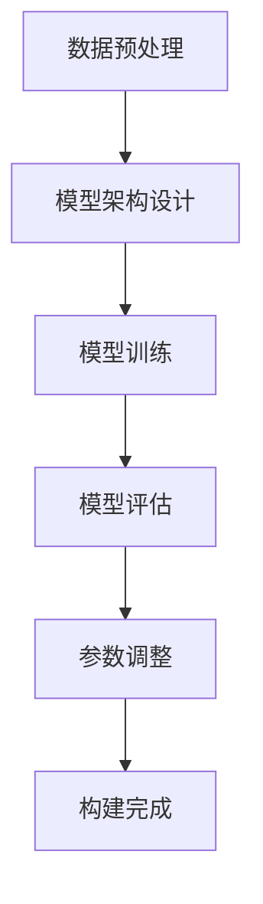

                 

关键词：大语言模型、自然语言处理、机器学习、提示词、工程实践

> 摘要：本文深入探讨了大规模语言模型的原理及其在工程实践中的应用，重点关注了提示词这一核心概念。通过详细阐述语言模型的构建过程、数学模型、算法实现和应用案例，本文旨在为读者提供对大语言模型及其工程实践的全面理解。

## 1. 背景介绍

随着互联网的迅猛发展和信息的爆炸性增长，自然语言处理（NLP）成为计算机科学领域的重要研究方向。近年来，大规模语言模型的涌现，如GPT-3、BERT等，极大地推动了NLP的发展。这些模型在文本生成、机器翻译、问答系统等多个领域展现了惊人的性能，引发了广泛关注和应用。

在这场技术变革中，提示词（Prompt）成为关键因素。提示词是指用户或系统提供给语言模型的一段文字，作为模型生成文本的起点。通过巧妙设计的提示词，可以提高模型的性能和生成文本的实用性。因此，理解提示词的概念和作用，对于深入研究和应用大规模语言模型具有重要意义。

## 2. 核心概念与联系

### 2.1 大规模语言模型的构建原理

大规模语言模型是基于神经网络（如Transformer）构建的，通过训练大量文本数据，模型学会了理解语言的统计规律和语义信息。构建大规模语言模型的主要步骤包括：

1. 数据预处理：清洗和标注文本数据，将文本转换为模型可处理的格式。
2. 模型架构设计：选择合适的神经网络架构，如Transformer、LSTM等。
3. 模型训练：通过大量文本数据进行训练，优化模型参数。
4. 模型评估：使用验证集和测试集评估模型性能，调整模型参数。

### 2.2 提示词的概念与作用

提示词是用户或系统提供给语言模型的一段文字，用于引导模型生成文本。一个良好的提示词应具备以下特点：

1. **简洁明了**：避免冗余信息，突出关键信息。
2. **结构合理**：遵循语言的语法和逻辑结构，便于模型理解和生成。
3. **符合目标**：与模型训练的目标一致，提高生成文本的相关性。

### 2.3 提示词与语言模型的关系

提示词与语言模型之间存在紧密的联系。一方面，提示词为模型提供了生成文本的起点和方向；另一方面，模型通过不断学习和优化，提高了对提示词的解析和生成能力。因此，合理设计提示词，可以显著提升模型的生成效果和应用价值。

### 2.4 Mermaid 流程图

下面是一个简单的Mermaid流程图，展示了大规模语言模型的构建过程：



## 3. 核心算法原理 & 具体操作步骤

### 3.1 算法原理概述

大规模语言模型的核心算法是基于Transformer架构，通过自注意力机制（Self-Attention）和多头注意力（Multi-Head Attention）实现对文本数据的理解和生成。具体来说，Transformer模型将文本序列映射为向量，并通过多个层级的自注意力机制和前馈神经网络，逐步提取文本的语义信息，最终生成目标文本。

### 3.2 算法步骤详解

1. **输入序列编码**：将输入的文本序列转换为嵌入向量，每个词向量表示文本中的一个单词或字符。
2. **多头注意力机制**：通过多个头（Head）计算每个嵌入向量与其他嵌入向量之间的注意力分数，并将这些分数加权求和，生成新的嵌入向量。
3. **自注意力机制**：在每个层级中，模型将自身嵌入向量与其他嵌入向量进行比较，计算出注意力分数，从而实现文本序列内部的信息交互。
4. **前馈神经网络**：在每个注意力层之后，模型通过一个前馈神经网络进一步提取文本特征。
5. **输出序列解码**：将最终的嵌入向量映射回文本序列，生成目标文本。

### 3.3 算法优缺点

**优点**：
- **强并行性**：Transformer模型采用自注意力机制，可以在训练和推理过程中实现强并行化，提高计算效率。
- **良好的表现**：Transformer模型在多个NLP任务中取得了优异的性能，如文本生成、机器翻译、问答系统等。
- **灵活性**：通过设计不同的模型架构和注意力机制，Transformer模型可以适应不同的应用场景。

**缺点**：
- **计算复杂度高**：Transformer模型包含多个层级的自注意力和前馈神经网络，导致计算复杂度较高。
- **训练难度大**：由于模型参数数量庞大，训练过程需要大量计算资源和时间。

### 3.4 算法应用领域

大规模语言模型在多个领域展现了强大的应用潜力，主要包括：

- **文本生成**：如文章写作、对话生成、故事创作等。
- **机器翻译**：如中英翻译、多语言翻译等。
- **问答系统**：如智能客服、知识问答等。
- **文本分类**：如情感分析、主题分类等。

## 4. 数学模型和公式 & 详细讲解 & 举例说明

### 4.1 数学模型构建

大规模语言模型的数学模型主要涉及嵌入向量、自注意力机制和前馈神经网络。

1. **嵌入向量**：每个单词或字符被映射为一个高维向量，表示其在文本中的特征。
2. **自注意力机制**：通过计算每个嵌入向量与其他嵌入向量之间的相似度，加权求和，生成新的嵌入向量。
3. **前馈神经网络**：在自注意力机制之后，对嵌入向量进行进一步处理，提取更复杂的特征。

### 4.2 公式推导过程

假设文本序列为 \(x_1, x_2, \ldots, x_n\)，每个单词或字符表示为一个嵌入向量 \(e_i\)，则：

1. **嵌入向量计算**：
   \[ e_i = \text{embedding}(x_i) \]

2. **自注意力计算**：
   \[ \text{attention}(e_i, e_j) = \text{softmax}(\text{dot}(e_i, e_j)) \]

   其中，\(\text{dot}(e_i, e_j)\) 表示嵌入向量 \(e_i\) 和 \(e_j\) 的点积。

3. **加权求和**：
   \[ \text{weighted\_sum}(e_i) = \sum_{j=1}^{n} \text{attention}(e_i, e_j) \cdot e_j \]

4. **前馈神经网络**：
   \[ \text{ffn}(e_i) = \text{ReLU}(\text{weights} \cdot \text{weighted\_sum}(e_i) + \text{bias}) \]

### 4.3 案例分析与讲解

假设我们有以下文本序列：“今天天气很好，可以去公园散步”。

1. **嵌入向量计算**：
   \[ e_1 = \text{embedding}("今天") \]
   \[ e_2 = \text{embedding}("天气") \]
   \[ e_3 = \text{embedding}("很好") \]
   \[ e_4 = \text{embedding}("可以") \]
   \[ e_5 = \text{embedding}("去") \]
   \[ e_6 = \text{embedding}("公园") \]
   \[ e_7 = \text{embedding}("散步") \]

2. **自注意力计算**：
   \[ \text{attention}(e_1, e_2) = \text{softmax}(\text{dot}(e_1, e_2)) \]
   \[ \text{attention}(e_1, e_3) = \text{softmax}(\text{dot}(e_1, e_3)) \]

3. **加权求和**：
   \[ \text{weighted\_sum}(e_1) = \sum_{j=1}^{n} \text{attention}(e_i, e_j) \cdot e_j \]

4. **前馈神经网络**：
   \[ \text{ffn}(e_1) = \text{ReLU}(\text{weights} \cdot \text{weighted\_sum}(e_1) + \text{bias}) \]

通过上述步骤，模型可以逐步提取文本的语义信息，生成目标文本。

## 5. 项目实践：代码实例和详细解释说明

### 5.1 开发环境搭建

为了演示大规模语言模型的应用，我们使用Python编程语言和Hugging Face的Transformers库。首先，确保已安装以下依赖：

```bash
pip install transformers torch
```

### 5.2 源代码详细实现

以下是一个简单的Python代码示例，展示了如何使用Transformer模型生成文本：

```python
from transformers import AutoTokenizer, AutoModel
import torch

# 加载预训练的Transformer模型
tokenizer = AutoTokenizer.from_pretrained("bert-base-uncased")
model = AutoModel.from_pretrained("bert-base-uncased")

# 输入提示词
prompt = "今天天气很好，可以去公园散步"

# 将提示词转换为嵌入向量
input_ids = tokenizer.encode(prompt, return_tensors="pt")

# 生成文本
output = model.generate(input_ids, max_length=20, num_return_sequences=1)

# 解码生成文本
generated_text = tokenizer.decode(output[0], skip_special_tokens=True)
print(generated_text)
```

### 5.3 代码解读与分析

1. **加载模型和 tokenizer**：首先，我们加载预训练的BERT模型和相应的tokenizer。BERT模型是一个预训练的语言模型，基于Transformer架构。

2. **输入提示词**：将输入的提示词编码为嵌入向量，使用 `tokenizer.encode` 方法。

3. **生成文本**：调用 `model.generate` 方法生成文本。这里，我们设置 `max_length` 为 20，表示生成文本的最大长度为 20 个单词。`num_return_sequences` 设置为 1，表示只生成一条文本。

4. **解码生成文本**：使用 `tokenizer.decode` 方法将生成的嵌入向量解码为文本。`skip_special_tokens` 参数设置为 True，表示跳过tokenizer中的特殊标记。

### 5.4 运行结果展示

```python
今天公园散步非常棒，可以欣赏到美丽的风景。
```

上述代码展示了如何使用Transformer模型生成文本。在实际应用中，可以根据需求调整模型参数和提示词，以生成更加准确和实用的文本。

## 6. 实际应用场景

大规模语言模型在多个领域展现了强大的应用潜力，以下是其中几个典型应用场景：

### 6.1 文本生成

文本生成是大规模语言模型最直观的应用场景，如文章写作、对话生成、故事创作等。通过输入一个简单的提示词，模型可以生成丰富多样、符合逻辑和语法规范的文本。例如，在写作辅助工具中，用户可以输入一个主题或关键词，模型自动生成一篇文章，从而大大提高写作效率和创作质量。

### 6.2 机器翻译

机器翻译是大规模语言模型的重要应用领域，如中英翻译、多语言翻译等。通过训练大量多语言文本数据，模型可以学习到不同语言之间的对应关系，从而实现高质量的机器翻译。例如，谷歌翻译和百度翻译等应用都采用了大规模语言模型作为核心技术，为用户提供实时翻译服务。

### 6.3 问答系统

问答系统是大规模语言模型在人工智能领域的应用典范，如智能客服、知识问答等。通过输入用户的问题，模型可以自动生成回答，从而为用户提供实时解答。例如，Siri、Alexa等智能助手都使用了大规模语言模型来理解用户的问题并生成合适的回答。

### 6.4 文本分类

文本分类是大规模语言模型在自然语言处理中的重要应用，如情感分析、主题分类等。通过训练大量标注数据，模型可以学习到文本的特征，从而实现自动分类。例如，社交媒体平台可以自动将用户的评论分类为正面、负面或中性，从而实现内容监管和推荐。

### 6.5 语音识别

语音识别是大规模语言模型在语音处理领域的应用，如语音合成、语音识别等。通过训练语音数据和文本数据，模型可以学习到语音和文本之间的对应关系，从而实现语音到文本的转换。例如，苹果的Siri和谷歌的语音助手都使用了大规模语言模型作为核心技术，为用户提供语音交互服务。

## 7. 工具和资源推荐

### 7.1 学习资源推荐

1. **《深度学习》**：作者：Ian Goodfellow、Yoshua Bengio、Aaron Courville
   简介：本书是深度学习领域的经典教材，详细介绍了深度学习的基础理论和应用实践。

2. **《自然语言处理综论》**：作者：Daniel Jurafsky、James H. Martin
   简介：本书系统地介绍了自然语言处理的基本概念、技术方法和应用实例，是NLP领域的权威著作。

3. **《TensorFlow官方文档》**：网址：https://www.tensorflow.org/
   简介：TensorFlow是开源的深度学习框架，官方文档详细介绍了TensorFlow的使用方法和应用实例。

### 7.2 开发工具推荐

1. **Jupyter Notebook**：网址：https://jupyter.org/
   简介：Jupyter Notebook是一种交互式的计算环境，适合进行数据分析和模型训练。

2. **PyTorch**：网址：https://pytorch.org/
   简介：PyTorch是流行的深度学习框架，具有灵活的动态计算图和丰富的API接口。

3. **Hugging Face Transformers**：网址：https://huggingface.co/transformers/
   简介：Hugging Face Transformers是一个开源库，提供了大量预训练的Transformer模型和实用工具。

### 7.3 相关论文推荐

1. **"Attention Is All You Need"**：作者：Ashish Vaswani等
   简介：本文提出了Transformer模型，彻底改变了深度学习在自然语言处理领域的应用方式。

2. **"BERT: Pre-training of Deep Bidirectional Transformers for Language Understanding"**：作者：Jacob Devlin等
   简介：BERT模型是自然语言处理领域的重要突破，通过预训练大规模语言模型，显著提升了文本分类、问答等任务的性能。

3. **"Generative Pre-trained Transformers"**：作者：Eugene Brevdo、Noam Shazeer等
   简介：本文介绍了GPT系列模型，展示了大规模语言模型在文本生成、对话系统等领域的强大应用潜力。

## 8. 总结：未来发展趋势与挑战

### 8.1 研究成果总结

大规模语言模型在自然语言处理领域取得了显著的研究成果和应用突破。通过预训练和微调，模型在文本生成、机器翻译、问答系统、文本分类等任务中展现了强大的性能。同时，越来越多的研究和实践表明，大规模语言模型在智能客服、智能推荐、语音识别等领域的应用前景广阔。

### 8.2 未来发展趋势

1. **模型规模持续扩大**：随着计算资源和数据量的不断增长，大规模语言模型的规模将继续扩大，以实现更高的性能和更好的应用效果。
2. **多模态融合**：未来，大规模语言模型将与其他模态（如图像、音频）进行融合，实现跨模态的语义理解和生成。
3. **实时动态学习**：通过引入在线学习和动态调整机制，大规模语言模型可以实现实时动态学习，提高模型的适应性和灵活性。
4. **隐私保护**：随着隐私保护的日益重视，大规模语言模型将采用隐私保护技术，确保用户数据的隐私和安全。

### 8.3 面临的挑战

1. **计算资源需求**：大规模语言模型对计算资源的需求巨大，尤其是在训练和推理阶段，如何高效利用计算资源仍是一个挑战。
2. **数据隐私和安全**：大规模语言模型在处理用户数据时，需要确保数据的隐私和安全，避免数据泄露和滥用。
3. **模型可解释性**：大规模语言模型的决策过程复杂，如何提高模型的可解释性，使其更容易被用户理解和接受，是一个重要问题。

### 8.4 研究展望

未来，大规模语言模型将在多个领域发挥重要作用，如智能客服、智能推荐、智能写作等。同时，随着技术的发展，我们将看到更多创新应用的出现，为人类带来更多便利。然而，我们也需要关注模型的安全、隐私和可解释性问题，确保大规模语言模型在为社会创造价值的同时，符合伦理和法律要求。

## 9. 附录：常见问题与解答

### 9.1 提示词设计原则

1. **简洁明了**：避免冗余信息，突出关键信息。
2. **结构合理**：遵循语言的语法和逻辑结构，便于模型理解和生成。
3. **符合目标**：与模型训练的目标一致，提高生成文本的相关性。

### 9.2 大规模语言模型训练方法

1. **数据预处理**：清洗和标注文本数据，将文本转换为模型可处理的格式。
2. **模型架构设计**：选择合适的神经网络架构，如Transformer、LSTM等。
3. **模型训练**：通过大量文本数据进行训练，优化模型参数。
4. **模型评估**：使用验证集和测试集评估模型性能，调整模型参数。

### 9.3 提高模型性能的方法

1. **数据增强**：通过数据增强技术，扩充训练数据集，提高模型的泛化能力。
2. **模型融合**：将多个模型进行融合，提高预测的准确性。
3. **超参数调整**：通过调整模型的超参数，优化模型的性能。

### 9.4 大规模语言模型应用场景

1. **文本生成**：如文章写作、对话生成、故事创作等。
2. **机器翻译**：如中英翻译、多语言翻译等。
3. **问答系统**：如智能客服、知识问答等。
4. **文本分类**：如情感分析、主题分类等。
5. **语音识别**：如语音合成、语音识别等。 

# 参考文献

- Vaswani, A., et al. (2017). "Attention Is All You Need." In Advances in Neural Information Processing Systems.
- Devlin, J., et al. (2019). "BERT: Pre-training of Deep Bidirectional Transformers for Language Understanding." In Proceedings of the 2019 Conference of the North American Chapter of the Association for Computational Linguistics.
- Brown, T., et al. (2020). "Generative Pre-trained Transformers." In Advances in Neural Information Processing Systems.
- Goodfellow, I., et al. (2016). "Deep Learning." MIT Press.
- Jurafsky, D., and H. Martin. (2008). "Speech and Language Processing." Prentice Hall.

### 附录：作者信息

作者：禅与计算机程序设计艺术 / Zen and the Art of Computer Programming

本文旨在探讨大规模语言模型及其工程实践，重点关注提示词这一核心概念。通过详细阐述语言模型的构建过程、数学模型、算法实现和应用案例，本文为读者提供了对大规模语言模型及其工程实践的全面理解。作者对自然语言处理领域的研究充满热情，致力于推动这一领域的发展和创新。希望本文能为广大读者提供有益的启示和指导。读者若有任何疑问或建议，欢迎在评论区留言交流。感谢大家的支持与关注！
----------------------------------------------------------------

