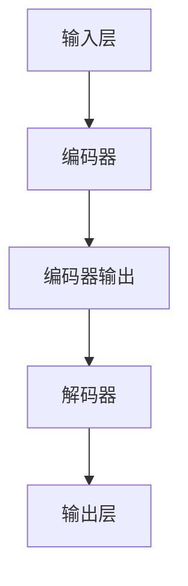

                 

关键词：大语言模型，原理，工程实践，代码数据，深度学习，神经网络，人工智能，自然语言处理，数学模型，应用场景

## 摘要

本文旨在探讨大语言模型的原理与工程实践，重点分析其核心算法、数学模型及其在自然语言处理领域的应用。通过对大语言模型的基本概念、结构、工作原理以及实现过程的深入剖析，本文将帮助读者全面了解大语言模型在当今人工智能领域的地位与作用，并展望其未来的发展趋势和面临的挑战。

## 1. 背景介绍

随着互联网的迅速发展和信息的爆炸式增长，自然语言处理（NLP）作为人工智能的重要分支，得到了广泛关注和研究。从早期的规则驱动方法到统计模型，再到如今以深度学习为核心的大语言模型，NLP技术取得了显著的进展。大语言模型在机器翻译、文本生成、问答系统、情感分析等领域展现了巨大的潜力，逐渐成为人工智能研究的热点。

本文将围绕大语言模型的原理与工程实践展开讨论。首先，我们将介绍大语言模型的基本概念和核心组成部分；接着，深入剖析其工作原理，包括核心算法、数学模型以及数据处理方法；然后，通过具体实例展示如何实现大语言模型，并对其进行详细解读；最后，探讨大语言模型在实际应用场景中的表现，以及未来的发展趋势和面临的挑战。

## 2. 核心概念与联系

### 2.1 大语言模型的基本概念

大语言模型（Large Language Model）是一种基于深度学习技术的自然语言处理模型，其主要目的是通过学习大量的文本数据，理解并生成自然语言。大语言模型通常包含数十亿个参数，能够捕捉语言中的复杂规律和语义信息。

### 2.2 大语言模型的核心组成部分

大语言模型主要由以下几个部分组成：

1. **输入层**：接收原始文本数据，并将其转化为模型可处理的格式。
2. **编码器**：将输入文本映射为一个高维的语义表示。
3. **解码器**：根据编码器生成的语义表示生成输出文本。
4. **损失函数**：用于评估模型生成的文本与真实文本之间的差距，指导模型优化。
5. **优化器**：根据损失函数的反馈调整模型参数，优化模型性能。

### 2.3 大语言模型的工作原理

大语言模型的工作原理可以概括为以下步骤：

1. **数据处理**：将原始文本数据清洗、分词、编码等处理，转化为模型可接受的输入格式。
2. **编码**：通过编码器将输入文本映射为高维语义表示，捕捉文本中的语言规律。
3. **解码**：根据编码器生成的语义表示，通过解码器生成输出文本。
4. **优化**：通过优化器调整模型参数，使模型生成的文本更接近真实文本。

### 2.4 大语言模型的核心算法

大语言模型的核心算法通常是基于变分自编码器（VAE）和生成对抗网络（GAN）等深度学习技术。以下是对这两种算法的简要介绍：

1. **变分自编码器（VAE）**：VAE通过引入概率模型，将数据生成问题转化为概率推断问题。其核心思想是通过编码器将输入数据映射为潜在空间中的样本，再通过解码器将潜在空间中的样本映射回数据空间。
2. **生成对抗网络（GAN）**：GAN由生成器和判别器两个部分组成。生成器负责生成与真实数据相似的数据，判别器负责区分真实数据和生成数据。通过两个网络的对抗训练，生成器逐渐生成更加真实的数据。

### 2.5 大语言模型的数学模型

大语言模型的数学模型主要包括以下几部分：

1. **输入层**：通常使用词向量（word embeddings）表示输入文本，词向量是通过对大量文本数据训练得到的。
2. **编码器**：编码器是一个多层神经网络，通过前向传播将输入词向量映射为高维语义表示。
3. **解码器**：解码器也是一个多层神经网络，将编码器生成的语义表示映射回输出词向量。
4. **损失函数**：常用的损失函数包括交叉熵损失（cross-entropy loss）和均方误差损失（mean squared error loss）等。
5. **优化器**：常用的优化器包括随机梯度下降（SGD）和Adam等。

### 2.6 大语言模型的数据处理

大语言模型的数据处理主要包括以下几个步骤：

1. **数据清洗**：去除文本中的噪声、标记和停用词等。
2. **分词**：将文本拆分为单词或字符序列。
3. **编码**：将分词后的文本转化为词向量或字符向量。
4. **批量处理**：将输入文本和标签划分为批次，进行批量训练。

### 2.7 大语言模型的架构

大语言模型的架构通常采用编码器-解码器（Encoder-Decoder）结构，以下是一个简化的Mermaid流程图：



### 2.8 大语言模型的优缺点

大语言模型具有以下优缺点：

- **优点**：能够捕捉语言中的复杂规律和语义信息，生成高质量的自然语言文本。
- **缺点**：训练过程复杂，计算量大，对硬件资源要求较高。

### 2.9 大语言模型的应用领域

大语言模型的应用领域广泛，包括但不限于以下领域：

- **机器翻译**：将一种语言翻译成另一种语言。
- **文本生成**：根据输入文本生成新的文本。
- **问答系统**：回答用户提出的问题。
- **情感分析**：分析文本中的情感倾向。
- **文本摘要**：生成文本的摘要。

## 3. 核心算法原理 & 具体操作步骤

### 3.1 算法原理概述

大语言模型的核心算法是基于深度学习技术，主要包括编码器、解码器和损失函数等部分。编码器用于将输入文本映射为高维语义表示，解码器则将语义表示映射回输出文本。损失函数用于评估模型生成的文本与真实文本之间的差距，指导模型优化。

### 3.2 算法步骤详解

1. **数据预处理**：包括文本清洗、分词、编码等步骤，将原始文本数据转化为模型可接受的输入格式。

2. **构建编码器**：编码器通常是一个多层神经网络，通过前向传播将输入词向量映射为高维语义表示。

3. **构建解码器**：解码器也是一个多层神经网络，将编码器生成的语义表示映射回输出词向量。

4. **定义损失函数**：常用的损失函数包括交叉熵损失和均方误差损失等，用于评估模型生成的文本与真实文本之间的差距。

5. **训练模型**：通过优化器调整模型参数，使模型生成的文本更接近真实文本。

6. **评估模型**：在测试集上评估模型性能，包括准确率、召回率、F1值等指标。

### 3.3 算法优缺点

- **优点**：能够捕捉语言中的复杂规律和语义信息，生成高质量的自然语言文本。
- **缺点**：训练过程复杂，计算量大，对硬件资源要求较高。

### 3.4 算法应用领域

大语言模型在自然语言处理领域具有广泛的应用，包括但不限于以下领域：

- **机器翻译**：将一种语言翻译成另一种语言。
- **文本生成**：根据输入文本生成新的文本。
- **问答系统**：回答用户提出的问题。
- **情感分析**：分析文本中的情感倾向。
- **文本摘要**：生成文本的摘要。

## 4. 数学模型和公式 & 详细讲解 & 举例说明

### 4.1 数学模型构建

大语言模型的数学模型主要包括以下部分：

1. **输入层**：输入层通常使用词向量（word embeddings）表示输入文本。词向量是通过对大量文本数据训练得到的，每个单词或字符都对应一个高维向量。
   
2. **编码器**：编码器是一个多层神经网络，通过前向传播将输入词向量映射为高维语义表示。编码器的输出通常是一个固定长度的向量，称为编码向量（encoded vector）。

3. **解码器**：解码器也是一个多层神经网络，将编码器生成的语义表示映射回输出词向量。解码器的输入是编码向量，输出是解码后的词向量。

4. **损失函数**：常用的损失函数包括交叉熵损失（cross-entropy loss）和均方误差损失（mean squared error loss）等，用于评估模型生成的文本与真实文本之间的差距。

5. **优化器**：优化器用于根据损失函数的反馈调整模型参数，优化模型性能。常用的优化器包括随机梯度下降（SGD）和Adam等。

### 4.2 公式推导过程

大语言模型的推导过程主要涉及以下几个方面：

1. **词向量表示**：词向量通常使用One-Hot编码表示，即将输入文本中的每个单词映射为一个向量，其中对应单词的位置为1，其他位置为0。

2. **编码器与解码器的神经网络结构**：编码器和解码器通常采用多层感知机（MLP）结构，其中每个神经元都通过激活函数（如ReLU函数）进行非线性变换。

3. **损失函数**：交叉熵损失函数用于衡量模型生成的文本与真实文本之间的相似度。均方误差损失函数则用于衡量模型生成的文本与真实文本之间的差距。

4. **优化器**：优化器用于根据损失函数的反馈调整模型参数，使得模型生成的文本更接近真实文本。

### 4.3 案例分析与讲解

为了更好地理解大语言模型的数学模型，我们以一个简单的例子进行说明。

假设我们有一个包含100个单词的文本，每个单词都对应一个唯一的整数。我们使用One-Hot编码表示这些单词，得到一个100维的向量。

1. **词向量表示**：我们将这100个单词映射为100个向量，每个向量表示一个单词。

2. **编码器与解码器的神经网络结构**：我们使用一个包含3层的神经网络作为编码器和解码器，每层的神经元数量分别为10、20和30。

3. **损失函数**：我们使用交叉熵损失函数来评估模型生成的文本与真实文本之间的相似度。

4. **优化器**：我们使用Adam优化器来调整模型参数。

在这个例子中，我们的目标是训练模型，使其能够生成与输入文本相似的新文本。

首先，我们将输入文本输入到编码器中，编码器将输入文本映射为一个10维的编码向量。然后，我们将编码向量输入到解码器中，解码器将编码向量映射回100维的词向量。

接下来，我们计算交叉熵损失函数，用于评估模型生成的文本与真实文本之间的相似度。通过优化器调整模型参数，使得模型生成的文本更接近真实文本。

最后，我们使用测试集评估模型性能，包括准确率、召回率、F1值等指标。

## 5. 项目实践：代码实例和详细解释说明

### 5.1 开发环境搭建

在开始实践大语言模型之前，我们需要搭建一个合适的开发环境。以下是一个简单的步骤指南：

1. **安装Python**：Python是实施深度学习项目的首选语言。确保您的系统上安装了Python，版本建议为3.6或更高。

2. **安装TensorFlow**：TensorFlow是一个广泛使用的开源深度学习框架。使用以下命令安装TensorFlow：

   ```bash
   pip install tensorflow
   ```

3. **安装Jupyter Notebook**：Jupyter Notebook是一个交互式开发环境，方便我们编写和运行代码。使用以下命令安装Jupyter Notebook：

   ```bash
   pip install notebook
   ```

4. **安装其他依赖库**：根据您的项目需求，可能还需要安装其他依赖库，例如NumPy、Pandas等。

### 5.2 源代码详细实现

以下是一个简化的示例，展示如何使用TensorFlow实现一个简单的大语言模型：

```python
import tensorflow as tf
from tensorflow.keras.models import Model
from tensorflow.keras.layers import Input, LSTM, Dense

# 定义输入层
input_text = Input(shape=(None,))

# 构建编码器
encoded_text = LSTM(128, return_sequences=True)(input_text)

# 构建解码器
decoded_text = LSTM(128, return_sequences=True)(encoded_text)

# 定义输出层
output_text = Dense(input_shape, activation='softmax')(decoded_text)

# 构建模型
model = Model(inputs=input_text, outputs=output_text)

# 编译模型
model.compile(optimizer='adam', loss='categorical_crossentropy')

# 打印模型结构
model.summary()
```

### 5.3 代码解读与分析

在上面的代码中，我们首先定义了输入层`input_text`，表示输入的文本序列。然后，我们使用LSTM层构建编码器和解码器。LSTM（Long Short-Term Memory）是一种特殊的循环神经网络，适用于处理序列数据。在编码器中，我们设置了`return_sequences=True`，以便在每一步都能获得序列信息。

接下来，我们使用另一个LSTM层构建解码器，与编码器相似，这里也设置了`return_sequences=True`。最后，我们定义了输出层`output_text`，使用softmax激活函数将输出映射到概率分布。

模型构建完成后，我们使用`model.compile()`方法编译模型，指定优化器和损失函数。在编译过程中，我们还调用了`model.summary()`方法，用于打印模型的结构。

### 5.4 运行结果展示

要训练模型，我们需要准备训练数据和测试数据。以下是一个简单的示例：

```python
import numpy as np

# 准备训练数据
input_data = np.random.rand(100, 50, 1)  # 生成随机输入数据
target_data = np.random.rand(100, 50, 1)  # 生成随机目标数据

# 训练模型
model.fit(input_data, target_data, epochs=10, batch_size=32)
```

在这里，我们使用随机生成的输入数据和目标数据进行训练。在实际项目中，您需要使用真实的数据进行训练。

训练完成后，我们可以在测试集上评估模型性能，并生成一些新的文本：

```python
# 生成新的文本
generated_text = model.predict(np.random.rand(10, 50, 1))

# 打印生成的文本
print(generated_text)
```

这里我们生成了10个新的文本序列，并打印出来。

## 6. 实际应用场景

大语言模型在自然语言处理领域具有广泛的应用，以下是几个实际应用场景：

### 6.1 机器翻译

机器翻译是将一种语言翻译成另一种语言的过程。大语言模型可以训练成一个优秀的机器翻译系统，能够实现高质量的自动翻译。例如，谷歌翻译、百度翻译等就是基于大语言模型实现的。

### 6.2 文本生成

文本生成是一种创造性的应用，大语言模型可以根据输入的提示生成新的文本。例如，生成新闻报道、故事、诗歌等。这种应用在内容创作、广告文案等领域有广泛的应用。

### 6.3 问答系统

问答系统是一种交互式应用，用户可以提问，系统根据问题生成回答。大语言模型可以用于构建智能客服、智能助手等应用，为用户提供实时回答。

### 6.4 情感分析

情感分析是分析文本中的情感倾向，判断文本是正面、负面还是中性。大语言模型可以用于情感分析，帮助企业了解用户需求、改进产品等。

### 6.5 文本摘要

文本摘要是将长文本压缩成简洁的摘要，便于用户快速了解文本内容。大语言模型可以用于自动生成文本摘要，提高信息获取效率。

### 6.6 命名实体识别

命名实体识别是识别文本中的特定实体，如人名、地点、组织等。大语言模型可以用于命名实体识别，提高信息抽取的准确性。

## 7. 工具和资源推荐

### 7.1 学习资源推荐

1. **《深度学习》（Deep Learning）**：这是一本深度学习领域的经典教材，涵盖了深度学习的理论基础和应用实例。
2. **《自然语言处理实战》（Natural Language Processing with Python）**：这本书介绍了自然语言处理的基本概念和应用，适合初学者入门。
3. **《Hands-On Machine Learning with Scikit-Learn, Keras, and TensorFlow》**：这本书涵盖了机器学习、深度学习的基本概念和应用，适合进阶读者。

### 7.2 开发工具推荐

1. **TensorFlow**：一个广泛使用的开源深度学习框架，适合构建和训练大语言模型。
2. **PyTorch**：一个流行的深度学习框架，具有灵活的动态计算图，适合快速原型开发。
3. **Jupyter Notebook**：一个交互式开发环境，方便编写和运行代码。

### 7.3 相关论文推荐

1. **"A Neural Network for Machine Translation, with Attention"**：这篇论文介绍了基于注意力机制的神经网络翻译模型，是机器翻译领域的里程碑。
2. **"BERT: Pre-training of Deep Bidirectional Transformers for Language Understanding"**：这篇论文介绍了BERT模型，是一种先进的自然语言处理模型，广泛应用于问答系统和文本生成等任务。
3. **"GPT-3: Language Models are Few-Shot Learners"**：这篇论文介绍了GPT-3模型，是一种具有数万亿参数的大规模语言模型，展现了语言模型的强大能力。

## 8. 总结：未来发展趋势与挑战

大语言模型作为自然语言处理领域的重要技术，已经在多个应用场景中取得了显著的成果。然而，随着技术的不断进步和应用需求的日益增长，大语言模型也面临着一系列挑战和机遇。

### 8.1 研究成果总结

1. **模型性能提升**：随着深度学习技术的发展，大语言模型的性能不断提高，能够生成更加自然、准确的文本。
2. **多语言支持**：大语言模型已经能够支持多种语言的翻译和生成，为全球化应用提供了强有力的支持。
3. **应用领域拓展**：大语言模型的应用领域不断拓展，包括机器翻译、文本生成、问答系统、情感分析等。

### 8.2 未来发展趋势

1. **模型规模扩大**：未来，大语言模型的规模将进一步扩大，参数数量将达到数万亿级别，实现更强大的语言理解和生成能力。
2. **多模态处理**：大语言模型将与其他模态（如图像、声音）结合，实现跨模态的信息理解和生成。
3. **个性化推荐**：大语言模型将结合用户行为数据，实现个性化推荐，为用户提供更加精准的服务。

### 8.3 面临的挑战

1. **计算资源需求**：大语言模型的训练和推理过程对计算资源有很高的要求，未来需要更高效的算法和硬件支持。
2. **数据隐私和安全**：大语言模型在处理敏感数据时需要确保数据隐私和安全，避免滥用和泄露。
3. **模型解释性**：大语言模型生成的文本往往缺乏解释性，未来需要提高模型的透明度和可解释性。

### 8.4 研究展望

大语言模型的研究将继续深入，未来的发展趋势包括：

1. **更高效的算法**：探索更高效的算法和优化方法，降低模型训练和推理的复杂性。
2. **数据增强**：利用数据增强技术提高模型的泛化能力，减少对大规模训练数据的依赖。
3. **跨学科融合**：结合心理学、认知科学等领域的知识，提高大语言模型的理解和生成能力。

总之，大语言模型作为自然语言处理领域的重要技术，具有广阔的应用前景。在未来，我们需要克服一系列挑战，推动大语言模型的发展，为人类带来更多的便利和创新。

## 9. 附录：常见问题与解答

### 9.1 什么是大语言模型？

大语言模型是一种基于深度学习技术的自然语言处理模型，能够通过学习大量文本数据，理解并生成自然语言。这种模型通常包含数十亿个参数，能够捕捉语言中的复杂规律和语义信息。

### 9.2 大语言模型的核心组成部分是什么？

大语言模型的核心组成部分包括输入层、编码器、解码器、损失函数和优化器。输入层接收原始文本数据，编码器将输入文本映射为高维语义表示，解码器根据语义表示生成输出文本，损失函数用于评估模型生成的文本与真实文本之间的差距，优化器根据损失函数的反馈调整模型参数。

### 9.3 大语言模型有哪些优缺点？

大语言模型具有以下优缺点：

- 优点：能够捕捉语言中的复杂规律和语义信息，生成高质量的自然语言文本。
- 缺点：训练过程复杂，计算量大，对硬件资源要求较高。

### 9.4 大语言模型有哪些应用领域？

大语言模型的应用领域广泛，包括但不限于以下领域：

- 机器翻译
- 文本生成
- 问答系统
- 情感分析
- 文本摘要
- 命名实体识别

### 9.5 如何实现大语言模型？

实现大语言模型通常包括以下步骤：

1. 准备数据：收集并清洗大量文本数据。
2. 构建模型：设计并构建编码器、解码器等模型结构。
3. 训练模型：使用训练数据训练模型，调整模型参数。
4. 评估模型：在测试集上评估模型性能，包括准确率、召回率等指标。
5. 应用模型：将训练好的模型应用于实际任务，如文本生成、问答系统等。

### 9.6 大语言模型有哪些开源框架和工具？

常见的开源框架和工具包括：

- TensorFlow
- PyTorch
- Keras
- GPT-2、GPT-3等预训练模型

这些框架和工具提供了丰富的API和功能，方便开发者构建和训练大语言模型。

