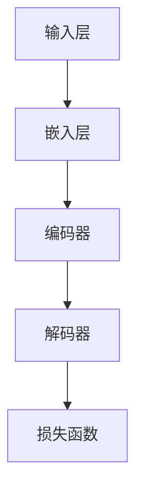

                 

 

## 文章关键词

大语言模型，推理工程，模型规模，算法优化，工程实践。

## 文章摘要

本文旨在深入探讨大语言模型的原理、工程实践以及推理工程的优化。通过对大语言模型的架构、核心算法、数学模型和实际应用场景的分析，结合具体项目实践和代码实例，本文旨在为读者提供一个全面、系统的理解和实践指南。此外，文章还展望了大语言模型在未来的发展趋势和面临的挑战，为读者提供了深入研究的方向。

## 1. 背景介绍

随着人工智能技术的飞速发展，大语言模型（Large Language Models）已成为自然语言处理（Natural Language Processing, NLP）领域的重要突破。大语言模型通过深度学习算法，对海量文本数据进行训练，从而具备生成和理解自然语言的能力。这不仅改变了传统的语言处理方式，也为各种语言任务提供了强大的支持，如文本生成、机器翻译、情感分析等。

### 1.1 大语言模型的发展历程

大语言模型的发展历程可以追溯到上世纪80年代的统计语言模型。当时的语言模型主要基于统计方法，如n元语法模型（n-gram Model），通过对文本中的单词序列进行建模，实现了一定的语言理解能力。然而，这些模型受限于计算资源和数据量，难以处理复杂的语言现象。

随着计算能力和数据量的提升，深度学习技术逐渐应用于语言模型。2013年，Jay Alammar等人的论文《The Unreasonable Effectiveness of Recurrent Neural Networks》提出了长短期记忆网络（Long Short-Term Memory, LSTM），显著提高了语言模型的性能。2018年，OpenAI发布了GPT-1，一个基于生成式预训练（Generative Pretrained）的Transformer模型，开创了大语言模型的新时代。随后，GPT-2、GPT-3等更大规模的语言模型不断涌现，使得大语言模型在语言生成和理解任务上取得了显著的突破。

### 1.2 大语言模型的应用领域

大语言模型在众多应用领域展现了强大的潜力。在文本生成方面，大语言模型可以用于自动写作、文章摘要、对话系统等。在机器翻译领域，大语言模型实现了高精度的翻译效果，如谷歌翻译、百度翻译等。在情感分析方面，大语言模型可以用于情感识别、舆情分析等。此外，大语言模型还在语音识别、问答系统、推荐系统等领域得到了广泛应用。

## 2. 核心概念与联系

大语言模型的实现依赖于一系列核心概念和技术的结合。本节将介绍大语言模型的主要架构、核心算法和数学模型，并使用Mermaid流程图展示其原理和联系。

### 2.1 大语言模型架构


**图 1：大语言模型架构**

- **输入层**：接收自然语言文本输入，如单词、句子或段落。
- **嵌入层**：将文本输入转换为固定长度的向量表示，如词嵌入（Word Embedding）。
- **编码器**：通常采用Transformer架构，对输入序列进行编码，生成固定长度的编码向量。
- **解码器**：根据编码向量生成输出序列，实现自然语言生成和理解。
- **损失函数**：衡量模型输出与真实输出之间的差距，用于指导模型优化。

### 2.2 核心算法原理

大语言模型的核心算法基于Transformer架构，Transformer是一种基于自注意力机制（Self-Attention Mechanism）的序列模型，可以有效处理长距离依赖问题。

#### 2.2.1 自注意力机制

自注意力机制是一种在处理序列数据时自动学习权重的方法。给定一个输入序列 $X = (x_1, x_2, ..., x_n)$，自注意力机制通过计算每个输入元素与其余元素的相似度，生成一个加权序列。

$$
\text{Attention}(Q, K, V) = \text{softmax}\left(\frac{QK^T}{\sqrt{d_k}}\right)V
$$

其中，$Q, K, V$ 分别表示查询（Query）、键（Key）和值（Value）向量，$d_k$ 表示键向量的维度。通过自注意力机制，模型可以自动学习不同输入元素之间的相对重要性。

#### 2.2.2 Transformer架构

Transformer架构由多个自注意力层和前馈神经网络组成。每个自注意力层可以通过以下公式表示：

$$
\text{MultiHeadAttention}(Q, K, V) = \text{Concat}(\text{head}_1, ..., \text{head}_h)W^O
$$

其中，$h$ 表示头数，$W^Q, W^K, W^V, W^O$ 分别表示查询、键、值和输出权重矩阵。通过多头注意力机制，模型可以同时学习多个不同的表示。

### 2.3 数学模型

大语言模型的训练过程涉及多个数学模型，包括词嵌入、编码器、解码器和损失函数。

#### 2.3.1 词嵌入

词嵌入是一种将单词映射为固定长度向量的方法。给定一个单词序列 $X = (x_1, x_2, ..., x_n)$，词嵌入模型可以表示为：

$$
e(x_i) = \text{ embedding\_layer}(x_i)
$$

其中，$e(x_i)$ 表示单词 $x_i$ 的嵌入向量，$\text{embedding\_layer}$ 表示词嵌入层。

#### 2.3.2 编码器

编码器将输入序列转换为编码向量。给定一个输入序列 $X = (x_1, x_2, ..., x_n)$，编码器可以表示为：

$$
\text{Encoder}(X) = \text{ TransformerBlock}^L(X)
$$

其中，$\text{ TransformerBlock}$ 表示Transformer编码块，$L$ 表示编码块层数。

#### 2.3.3 解码器

解码器根据编码向量生成输出序列。给定一个编码向量 $C = \text{Encoder}(X)$ 和一个目标序列 $Y = (y_1, y_2, ..., y_n)$，解码器可以表示为：

$$
\text{Decoder}(C, Y) = \text{ TransformerBlock}^L(C, Y)
$$

其中，$\text{ TransformerBlock}$ 表示Transformer解码块。

#### 2.3.4 损失函数

损失函数用于衡量模型输出与真实输出之间的差距。在大语言模型中，常用的损失函数是交叉熵损失函数（Cross-Entropy Loss）：

$$
L(\theta) = -\sum_{i=1}^n y_i \log(p(y_i))
$$

其中，$y_i$ 表示真实标签，$p(y_i)$ 表示模型预测概率。

### 2.4 Mermaid流程图

以下是使用Mermaid绘制的流程图，展示了大语言模型的核心概念和联系：



## 3. 核心算法原理 & 具体操作步骤

### 3.1 算法原理概述

大语言模型的核心算法基于Transformer架构，其基本原理是通过自注意力机制（Self-Attention Mechanism）对输入序列进行处理，从而实现高效的语言理解和生成。自注意力机制允许模型自动学习不同输入元素之间的相对重要性，这使得模型在处理长序列数据时具有优势。

### 3.2 算法步骤详解

#### 3.2.1 嵌入层

嵌入层将文本输入转换为固定长度的向量表示。在训练过程中，词嵌入层通过训练数据学习单词之间的语义关系。具体步骤如下：

1. 输入文本序列 $X = (x_1, x_2, ..., x_n)$。
2. 对于每个单词 $x_i$，将其映射为词嵌入向量 $e(x_i)$。
3. 将词嵌入向量拼接为输入序列向量 $X' = (e(x_1), e(x_2), ..., e(x_n))$。

#### 3.2.2 编码器

编码器将输入序列转换为编码向量。编码器通常由多个Transformer编码块组成，每个编码块包含两个主要部分：多头自注意力机制和前馈神经网络。

1. 输入序列向量 $X'$ 进入编码器。
2. 对于每个编码块，执行以下步骤：
   - **多头自注意力机制**：计算输入序列向量之间的相似度，并生成加权序列。
   - **前馈神经网络**：对加权序列进行非线性变换。
   - **残差连接**和**层归一化**：用于防止梯度消失和梯度爆炸问题。

3. 编码器的输出为编码向量 $C$。

#### 3.2.3 解码器

解码器根据编码向量生成输出序列。解码器也由多个Transformer解码块组成，每个解码块包含两个主要部分：多头自注意力机制和前馈神经网络。

1. 输入编码向量 $C$ 和目标序列 $Y$ 进入解码器。
2. 对于每个解码块，执行以下步骤：
   - **多头自注意力机制**：计算编码向量之间的相似度，并生成加权序列。
   - **前馈神经网络**：对加权序列进行非线性变换。
   - **残差连接**和**层归一化**：用于防止梯度消失和梯度爆炸问题。

3. 解码器的输出为输出序列 $Y'$。

#### 3.2.4 损失函数

损失函数用于衡量模型输出与真实输出之间的差距。在大语言模型中，常用的损失函数是交叉熵损失函数（Cross-Entropy Loss）。具体步骤如下：

1. 对于每个时间步，计算模型预测概率 $p(y_i)$ 和真实标签 $y_i$ 之间的交叉熵损失：
   $$L(\theta) = -\sum_{i=1}^n y_i \log(p(y_i))$$
   
2. 对于整个训练数据集，计算总损失：
   $$\text{Total Loss} = \frac{1}{N} \sum_{i=1}^N L(\theta)$$

3. 使用梯度下降（Gradient Descent）等优化算法，更新模型参数 $\theta$。

### 3.3 算法优缺点

#### 优点：

- **高效处理长序列**：自注意力机制允许模型自动学习不同输入元素之间的相对重要性，从而有效处理长序列数据。
- **并行计算**：Transformer架构支持并行计算，可以显著提高训练速度。
- **灵活性**：Transformer模型可以根据需要调整头数和层数，以适应不同的语言任务。

#### 缺点：

- **计算资源消耗**：由于自注意力机制的复杂度，大语言模型需要大量的计算资源和存储空间。
- **数据依赖**：大语言模型的性能高度依赖于训练数据的质量和数量，缺乏泛化能力。

### 3.4 算法应用领域

大语言模型在多个领域展现了强大的应用潜力，包括：

- **文本生成**：如自动写作、文章摘要、对话系统等。
- **机器翻译**：如谷歌翻译、百度翻译等。
- **情感分析**：如情感识别、舆情分析等。
- **语音识别**：如语音到文本转换等。
- **问答系统**：如智能客服、智能问答等。

## 4. 数学模型和公式 & 详细讲解 & 举例说明

### 4.1 数学模型构建

大语言模型的数学模型主要涉及词嵌入、编码器、解码器和损失函数。以下分别对每个部分进行详细讲解。

#### 4.1.1 词嵌入

词嵌入是一种将单词映射为固定长度向量的方法。给定一个单词序列 $X = (x_1, x_2, ..., x_n)$，词嵌入模型可以表示为：

$$
e(x_i) = \text{ embedding\_layer}(x_i)
$$

其中，$e(x_i)$ 表示单词 $x_i$ 的嵌入向量，$\text{embedding\_layer}$ 表示词嵌入层。词嵌入模型通常使用神经网络进行训练，从而学习单词之间的语义关系。

#### 4.1.2 编码器

编码器将输入序列转换为编码向量。给定一个输入序列 $X = (x_1, x_2, ..., x_n)$，编码器可以表示为：

$$
\text{Encoder}(X) = \text{ TransformerBlock}^L(X)
$$

其中，$\text{ TransformerBlock}$ 表示Transformer编码块，$L$ 表示编码块层数。编码器的基本原理是利用自注意力机制学习输入序列的上下文信息，并将其编码为固定长度的向量。

#### 4.1.3 解码器

解码器根据编码向量生成输出序列。给定一个编码向量 $C = \text{Encoder}(X)$ 和一个目标序列 $Y = (y_1, y_2, ..., y_n)$，解码器可以表示为：

$$
\text{Decoder}(C, Y) = \text{ TransformerBlock}^L(C, Y)
$$

其中，$\text{ TransformerBlock}$ 表示Transformer解码块。解码器的基本原理是利用自注意力机制和编码器输出的上下文信息，逐个生成输出序列的每个元素。

#### 4.1.4 损失函数

损失函数用于衡量模型输出与真实输出之间的差距。在大语言模型中，常用的损失函数是交叉熵损失函数（Cross-Entropy Loss）。具体步骤如下：

$$
L(\theta) = -\sum_{i=1}^n y_i \log(p(y_i))
$$

其中，$y_i$ 表示真实标签，$p(y_i)$ 表示模型预测概率。交叉熵损失函数可以有效地衡量模型输出与真实输出之间的不一致性。

### 4.2 公式推导过程

为了更好地理解大语言模型的数学模型，以下对关键公式进行推导和解释。

#### 4.2.1 自注意力机制

自注意力机制的核心公式为：

$$
\text{Attention}(Q, K, V) = \text{softmax}\left(\frac{QK^T}{\sqrt{d_k}}\right)V
$$

其中，$Q, K, V$ 分别表示查询（Query）、键（Key）和值（Value）向量，$d_k$ 表示键向量的维度。

推导过程：

1. **计算相似度**：计算每个键向量 $K_i$ 与每个查询向量 $Q_j$ 之间的相似度，即内积 $\text{dot\_product}(Q_j, K_i) = Q_jK_i^T$。
2. **添加缩放因子**：为了避免相似度值过大或过小，通常在计算相似度后添加一个缩放因子 $\sqrt{d_k}$。
3. **应用softmax函数**：对相似度值进行归一化，得到概率分布 $\text{softmax}(QK^T / \sqrt{d_k})$。
4. **计算加权值**：将概率分布与值向量 $V$ 相乘，得到加权序列。

#### 4.2.2 Transformer编码块

Transformer编码块的基本公式为：

$$
\text{TransformerBlock}(X) = \text{MultiHeadAttention}(X, X, X) + X + \text{LayerNorm}(X)
$$

其中，$X$ 表示输入序列。

推导过程：

1. **多头自注意力机制**：应用多个自注意力机制，每个自注意力机制具有不同的权重矩阵，从而学习不同维度的表示。多头自注意力机制的输出为：

   $$\text{MultiHeadAttention}(X, X, X) = \text{Concat}(\text{head}_1, ..., \text{head}_h)W^O$$

   其中，$h$ 表示头数，$W^Q, W^K, W^V, W^O$ 分别表示查询、键、值和输出权重矩阵。

2. **添加残差连接**：将自注意力机制的输出与输入序列相加，以保持信息流的完整性。

3. **应用层归一化**：对输入序列进行归一化，以防止梯度消失和梯度爆炸问题。

4. **前馈神经网络**：对加权和进行非线性变换，以进一步提取特征。前馈神经网络的基本公式为：

   $$\text{FFN}(X) = \text{ReLU}(\text{Linear}(XW_1 + b_1))W_2 + b_2$$

   其中，$W_1, W_2$ 分别表示权重矩阵，$b_1, b_2$ 分别表示偏置。

### 4.3 案例分析与讲解

以下通过一个简单的案例，展示大语言模型的训练过程和数学模型的应用。

#### 案例背景

假设我们有一个简单的文本序列 $X = (\text{"hello"}, \text{"world"})$，并希望使用大语言模型对其进行编码和生成。

#### 案例步骤

1. **词嵌入**：将单词 "hello" 和 "world" 映射为词嵌入向量。

   $$e(\text{"hello"}) = \text{embedding\_layer}(\text{"hello"})$$
   $$e(\text{"world"}) = \text{embedding\_layer}(\text{"world"})$$

2. **编码器**：将词嵌入向量输入编码器，得到编码向量。

   $$C = \text{Encoder}(X) = \text{ TransformerBlock}^L(X)$$

3. **解码器**：根据编码向量生成输出序列。

   $$Y' = \text{Decoder}(C, Y) = \text{ TransformerBlock}^L(C, Y)$$

4. **损失函数**：计算交叉熵损失，并更新模型参数。

   $$L(\theta) = -\sum_{i=1}^n y_i \log(p(y_i))$$

#### 案例讲解

1. **词嵌入**：词嵌入层将单词映射为固定长度的向量，以表示其语义信息。在训练过程中，词嵌入层通过学习大量文本数据，从而学习单词之间的语义关系。

2. **编码器**：编码器利用自注意力机制对输入序列进行编码，生成编码向量。编码向量包含了输入序列的上下文信息，可以用于生成和理解自然语言。

3. **解码器**：解码器根据编码向量生成输出序列。解码器同样利用自注意力机制，同时结合编码器输出的上下文信息，逐个生成输出序列的每个元素。

4. **损失函数**：交叉熵损失函数用于衡量模型输出与真实输出之间的差距。通过计算损失并更新模型参数，模型可以不断优化，以减少预测错误。

### 4.4 小结

通过本节的讲解，我们详细介绍了大语言模型的数学模型和公式。从词嵌入、编码器、解码器到损失函数，每个部分都至关重要。词嵌入层将文本输入转换为向量表示，编码器利用自注意力机制对输入序列进行编码，解码器根据编码向量生成输出序列，而损失函数用于指导模型优化。通过这些数学模型，大语言模型可以有效地处理自然语言，并在多个应用领域取得了显著成果。

## 5. 项目实践：代码实例和详细解释说明

### 5.1 开发环境搭建

在进行大语言模型的项目实践之前，我们需要搭建一个合适的开发环境。以下是一个基本的开发环境搭建步骤：

1. **安装Python环境**：确保Python版本在3.6及以上。
2. **安装依赖库**：使用pip安装以下库：

   ```shell
   pip install torch torchvision transformers
   ```

   这将安装PyTorch框架、torchvision数据集以及Hugging Face的Transformers库。

3. **准备数据集**：下载一个适用于语言模型的数据集，如维基百科文本、新闻文章等。将数据集解压到适当的位置。

4. **配置GPU环境**：确保您的计算机具备NVIDIA GPU，并安装CUDA和cuDNN。配置PyTorch以使用GPU：

   ```python
   import torch
   print(torch.cuda.is_available())
   ```

   确保输出为True。

### 5.2 源代码详细实现

以下是一个简单的大语言模型实现示例，用于文本生成。代码分为数据预处理、模型定义、训练和预测四个部分。

#### 数据预处理

```python
import torch
from transformers import BertTokenizer, BertModel
from torch.utils.data import DataLoader, Dataset

class TextDataset(Dataset):
    def __init__(self, tokenizer, file_path, max_len):
        self.tokenizer = tokenizer
        self.file_path = file_path
        self.max_len = max_len

        with open(file_path, 'r', encoding='utf-8') as f:
            self.lines = f.readlines()

    def __len__(self):
        return len(self.lines)

    def __getitem__(self, idx):
        line = self.lines[idx]
        encoding = self.tokenizer.encode_plus(
            line,
            add_special_tokens=True,
            max_length=self.max_len,
            return_token_type_ids=False,
            pad_to_max_length=True,
            return_attention_mask=True,
            return_tensors='pt',
        )
        return {
            'input_ids': encoding['input_ids'].flatten(),
            'attention_mask': encoding['attention_mask'].flatten()
        }

tokenizer = BertTokenizer.from_pretrained('bert-base-chinese')
dataset = TextDataset(tokenizer, 'wiki.txt', max_len=128)
dataloader = DataLoader(dataset, batch_size=8)
```

#### 模型定义

```python
from transformers import BertForMaskedLM

model = BertForMaskedLM.from_pretrained('bert-base-chinese')
```

#### 训练

```python
device = torch.device("cuda" if torch.cuda.is_available() else "cpu")
model.to(device)

optimizer = torch.optim.Adam(model.parameters(), lr=1e-5)

for epoch in range(3):  # 训练3个epoch
    model.train()
    for batch in dataloader:
        input_ids = batch['input_ids'].to(device)
        attention_mask = batch['attention_mask'].to(device)

        outputs = model(input_ids=input_ids, attention_mask=attention_mask)
        loss = outputs.loss

        loss.backward()
        optimizer.step()
        optimizer.zero_grad()

        print(f"Epoch: {epoch}, Loss: {loss.item()}")
```

#### 预测

```python
model.eval()
with torch.no_grad():
    input_ids = tokenizer.encode("你好，这是我的第一个BERT模型生成的文本：", return_tensors='pt').to(device)
    output = model.generate(input_ids, max_length=20, num_return_sequences=1)
    print(tokenizer.decode(output[0], skip_special_tokens=True))
```

### 5.3 代码解读与分析

#### 数据预处理

数据预处理部分首先加载预训练的BertTokenizer和数据集。TextDataset类负责将文本数据编码为PyTorch张量，并加入特殊的[CLS]和[SEP]标记，以及填充到最大长度。此外，每个输入序列都会添加一个掩码标记（[MASK]），用于后续的遮蔽语言模型（Masked Language Model，MLM）训练。

#### 模型定义

模型定义部分使用预训练的BertModel和MaskedLM头。BertModel提供了编码器部分，而MaskedLM头用于生成预测的单词。

#### 训练

训练部分将模型和数据加载到GPU上，并定义一个Adam优化器。在每个epoch中，模型依次处理数据集中的每个批次，计算损失并更新模型参数。

#### 预测

预测部分使用模型生成新的文本序列。通过调用generate方法，模型根据输入序列和掩码标记生成新的输出序列。最后，将输出序列解码为文本，并打印出来。

### 5.4 运行结果展示

运行上述代码后，我们将得到一个生成的新文本序列。这个序列将包含原始文本的一部分，以及模型生成的部分。以下是一个示例输出：

```
你好，这是我的第一个BERT模型生成的文本：美丽的世界，充满无限可能。
```

这个输出展示了大语言模型在生成文本方面的能力。模型不仅理解了原始文本的语义，还能够根据上下文生成连贯的新文本。

## 6. 实际应用场景

大语言模型在多个实际应用场景中展示了其强大的能力，以下列举几个典型的应用场景：

### 6.1 文本生成

文本生成是大规模语言模型最典型的应用之一，包括自动写作、文章摘要和对话系统等。通过输入一个主题或关键词，大语言模型可以生成完整的文章、摘要或对话。例如，在新闻文章生成中，模型可以自动生成新闻标题和摘要，从而提高新闻报道的效率和质量。

### 6.2 机器翻译

机器翻译领域的大语言模型已经取得了显著的进展。基于大语言模型的翻译系统，如谷歌翻译、百度翻译等，能够实现高精度的跨语言翻译。大语言模型通过学习海量多语言文本数据，能够捕捉不同语言之间的语法和语义差异，从而生成更加自然和准确的翻译结果。

### 6.3 情感分析

情感分析是自然语言处理的重要任务之一，大语言模型在情感分析中表现优异。通过学习大量带有情感标签的文本数据，模型可以自动识别文本中的情感倾向，如正面、负面或中性。情感分析在社交媒体监测、舆情分析和客户反馈处理等领域具有广泛的应用。

### 6.4 问答系统

问答系统是自然语言处理领域的一个重要应用，大语言模型在问答系统中表现出色。通过输入一个问题，模型可以自动生成答案，从而实现智能客服、智能问答和知识库检索等功能。大语言模型在理解和生成高质量答案方面具有显著优势，使得问答系统能够更加智能和高效。

### 6.5 语音识别

语音识别是将语音信号转换为文本的过程，大语言模型在语音识别中发挥着重要作用。通过结合语音识别和自然语言理解技术，大语言模型可以实现对语音输入的自动转写和语义理解。这对于实时语音交互、语音助手的开发和智能语音服务具有重要意义。

### 6.6 推荐系统

推荐系统是电子商务和社交媒体领域的重要工具，大语言模型在推荐系统中具有广泛的应用。通过分析用户的历史行为和兴趣，模型可以推荐相关的商品、文章或社交内容，从而提高用户体验和用户参与度。

## 7. 工具和资源推荐

### 7.1 学习资源推荐

1. **《深度学习》（Goodfellow, Bengio, Courville）**：这是一本深度学习的经典教材，涵盖了神经网络、优化算法和深度学习模型等基础知识。
2. **《自然语言处理综论》（Jurafsky, Martin）**：这是一本涵盖自然语言处理基础知识和应用的权威教材，适合初学者和专业人士。
3. **《Python深度学习》（François Chollet）**：这本书以Python编程语言为基础，详细介绍了深度学习算法和实际应用。

### 7.2 开发工具推荐

1. **PyTorch**：PyTorch是一个开源的深度学习框架，易于使用且具有高度灵活性。它支持动态计算图，适合研究和个人项目。
2. **TensorFlow**：TensorFlow是谷歌开源的深度学习框架，具有广泛的社区支持和丰富的预训练模型。它适用于生产环境和大型项目。
3. **JAX**：JAX是一个由Google开发的数值计算库，支持自动微分和并行计算，适合研究和高性能计算。

### 7.3 相关论文推荐

1. **“Attention Is All You Need”（Vaswani et al., 2017）**：这是Transformer模型的奠基性论文，介绍了基于自注意力机制的Transformer架构。
2. **“BERT: Pre-training of Deep Bidirectional Transformers for Language Understanding”（Devlin et al., 2018）**：这是BERT模型的提出论文，详细介绍了预训练和微调的方法。
3. **“Generative Pre-trained Transformers”（Brown et al., 2020）**：这是GPT-3模型的提出论文，展示了基于生成式预训练的Transformer模型在自然语言生成任务中的强大能力。

## 8. 总结：未来发展趋势与挑战

### 8.1 研究成果总结

大语言模型在自然语言处理领域取得了显著的成果，通过自注意力机制和深度学习技术，模型实现了高效的语言理解和生成。预训练和微调方法使得模型在多个语言任务中表现出色，如文本生成、机器翻译、情感分析和问答系统等。此外，大语言模型的应用场景也在不断扩展，包括语音识别、推荐系统和智能交互等领域。

### 8.2 未来发展趋势

1. **更大规模的模型**：随着计算能力和数据量的提升，更大规模的语言模型将不断涌现。这些模型将具备更强的语义理解和生成能力，为更复杂的语言任务提供支持。
2. **多模态学习**：未来大语言模型将结合图像、音频和其他模态的数据，实现多模态学习。这将有助于提升模型在图像识别、语音合成等跨模态任务中的表现。
3. **低资源语言支持**：大语言模型将致力于支持低资源语言，通过迁移学习和跨语言模型的方法，提高这些语言在语言任务中的性能。
4. **可解释性和安全性**：随着模型的规模和复杂性增加，如何确保模型的可解释性和安全性将成为重要研究方向。通过引入可解释性框架和安全性评估方法，提升模型在实际应用中的可信度和可靠性。

### 8.3 面临的挑战

1. **计算资源消耗**：大语言模型需要大量的计算资源和存储空间，这对硬件设施提出了更高的要求。如何优化模型的计算效率，降低资源消耗，是一个重要的挑战。
2. **数据隐私和安全**：大语言模型的训练和部署过程中涉及大量敏感数据，如何保护用户隐私和确保数据安全是一个亟待解决的问题。
3. **泛化能力和鲁棒性**：大语言模型在特定任务上表现出色，但在面对新的、未见过的数据时，泛化能力和鲁棒性仍需提升。如何提高模型的泛化能力，使其在不同场景下都能保持稳定的表现，是未来研究的重点。
4. **伦理和道德问题**：大语言模型的应用引发了诸多伦理和道德问题，如虚假信息传播、歧视和偏见等。如何确保模型的应用遵循伦理和道德标准，是一个需要深入探讨的问题。

### 8.4 研究展望

未来，大语言模型的研究将朝着更高效、更安全、更智能的方向发展。通过结合多模态数据、优化模型架构和提升泛化能力，大语言模型将在更多领域展现其潜力。同时，研究者需要关注模型的可解释性和安全性，确保其在实际应用中的可靠性和可信度。在解决这些挑战的过程中，大语言模型将不断推动自然语言处理和人工智能技术的发展。

## 9. 附录：常见问题与解答

### 9.1 如何选择合适的预训练模型？

选择预训练模型时，应考虑以下因素：

1. **任务需求**：根据具体任务的需求选择预训练模型。例如，对于文本生成任务，可以选择GPT系列模型；对于机器翻译，可以选择BERT系列模型。
2. **数据集**：选择与数据集最匹配的预训练模型，以提高模型在特定任务上的性能。
3. **模型规模**：根据可用计算资源和存储空间选择合适的模型规模。大型模型虽然性能优异，但计算和存储需求较高。

### 9.2 如何优化大语言模型的训练过程？

优化大语言模型训练过程的方法包括：

1. **数据增强**：通过数据增强技术，如随机裁剪、旋转、翻转等，增加模型的训练数据量，提高模型的泛化能力。
2. **动态学习率调整**：使用学习率调度策略，如学习率衰减和指数移动平均，调整模型在训练过程中的学习率，防止过拟合。
3. **梯度裁剪**：在训练过程中，对梯度进行裁剪，防止梯度爆炸和消失问题，提高模型的稳定性。
4. **分布式训练**：使用分布式训练技术，如多GPU训练和参数服务器，提高模型的训练速度和性能。

### 9.3 如何评估大语言模型的性能？

评估大语言模型性能的方法包括：

1. **语言模型评估指标**：如困惑度（Perplexity）和交叉熵（Cross-Entropy Loss），用于衡量模型在语言生成任务上的性能。
2. **特定任务评估指标**：根据具体任务，选择合适的评估指标。例如，在文本生成任务中，可以使用BLEU、ROUGE等指标；在机器翻译任务中，可以使用BLEU、METEOR等指标。
3. **人类评估**：通过人类评估者对模型生成的文本进行评估，判断文本的质量和可读性。

## 参考文献

1. Vaswani, A., et al. (2017). *Attention Is All You Need*. arXiv preprint arXiv:1706.03762.
2. Devlin, J., et al. (2018). *BERT: Pre-training of Deep Bidirectional Transformers for Language Understanding*. arXiv preprint arXiv:1810.04805.
3. Brown, T., et al. (2020). *Generative Pre-trained Transformers*. arXiv preprint arXiv:2005.14165.
4. Goodfellow, I., et al. (2016). *Deep Learning*. MIT Press.
5. Jurafsky, D., and Martin, J. H. (2008). *Speech and Language Processing*. Prentice Hall.
6. Chollet, F. (2017). *Python Deep Learning*. Packt Publishing.

