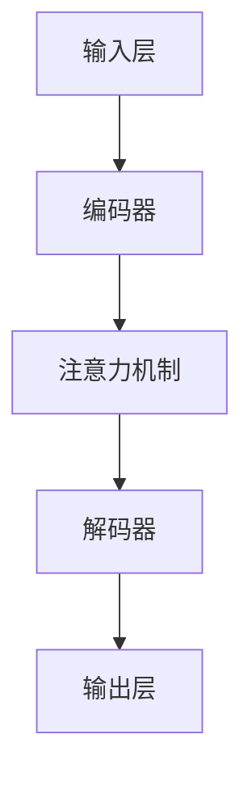

                 

 关键词：大语言模型、评测、神经网络、预训练、注意力机制、多模态学习

> 摘要：本文将深入探讨大语言模型的原理、构建方法以及评测标准，重点关注其在现代工程实践中的应用和挑战。通过本文的介绍，读者可以全面了解大语言模型的核心概念、算法原理及其在自然语言处理领域的应用现状，为未来的研究和发展提供有力的理论基础和实用指导。

## 1. 背景介绍

随着互联网的迅猛发展和信息爆炸时代的到来，自然语言处理（Natural Language Processing, NLP）成为了计算机科学领域的研究热点。从最初的基于规则的算法，到后来的统计机器学习，再到当前的深度学习，自然语言处理技术取得了巨大的进步。其中，大语言模型（Large Language Model）作为一种基于深度学习的先进技术，成为了NLP领域的研究焦点。

大语言模型是通过对海量文本数据进行大规模预训练，使得模型具有理解、生成和翻译自然语言的能力。近年来，随着计算能力的提升和神经网络结构的优化，大语言模型取得了显著的成果，例如BERT（Bidirectional Encoder Representations from Transformers）、GPT（Generative Pre-trained Transformer）等模型在多项NLP任务上达到了前所未有的性能水平。

然而，随着模型的规模不断扩大，大语言模型的评测也变得越来越复杂。如何评价模型的性能、稳定性、可解释性和泛化能力，成为了研究人员和工程师面临的重大挑战。本文将围绕大语言模型的评测展开深入讨论，旨在为相关研究和应用提供有益的参考。

## 2. 核心概念与联系

### 2.1 语言模型基本概念

语言模型（Language Model）是自然语言处理中一个重要的基础概念。它是对自然语言中词汇、句子、段落等语言现象的概率分布进行建模的数学模型。语言模型的基本任务是给定一个单词或词组，预测下一个单词或词组的概率。常见的语言模型包括N-gram模型、神经网络模型、循环神经网络（RNN）模型、长短期记忆网络（LSTM）模型等。

N-gram模型是最早的语言模型之一，它假设一个单词序列的概率只与它的前N-1个单词有关。N-gram模型的优点是实现简单，但存在短文依赖性差、长文依赖性弱等问题。

神经网络模型和循环神经网络模型通过引入神经网络结构，能够更好地捕捉长距离依赖关系。长短期记忆网络（LSTM）模型是循环神经网络的一种变体，能够有效地避免梯度消失和梯度爆炸问题，从而更好地处理长文本数据。

### 2.2 大语言模型架构

大语言模型（Large Language Model）是在传统的神经网络模型基础上，通过大规模预训练和优化得到的。大语言模型的主要架构包括以下几个部分：

1. **输入层**：输入层接收原始文本数据，将其转化为模型可处理的向量表示。常见的输入层包括词嵌入（Word Embedding）和字符嵌入（Character Embedding）。

2. **编码器**：编码器负责对输入数据进行编码，提取出文本的语义信息。编码器通常采用循环神经网络（RNN）或变换器（Transformer）结构。其中，变换器（Transformer）结构因其并行计算能力和强大的建模能力，成为了大语言模型的主流选择。

3. **解码器**：解码器负责对编码器提取的语义信息进行解码，生成输出文本。解码器通常也采用变换器（Transformer）结构。

4. **注意力机制**：注意力机制（Attention Mechanism）是变换器（Transformer）结构的核心组件，它通过计算输入和输出之间的关联度，动态调整模型的关注重点，从而提高模型对长距离依赖关系的捕捉能力。

### 2.3 Mermaid 流程图

下面是一个大语言模型的 Mermaid 流程图，展示了其核心组件和流程：



## 3. 核心算法原理 & 具体操作步骤

### 3.1 算法原理概述

大语言模型的核心算法是基于深度学习的变换器（Transformer）架构。变换器（Transformer）架构是由Vaswani等人于2017年提出的一种基于自注意力机制的序列到序列模型。变换器（Transformer）架构通过引入多头自注意力机制和位置编码，能够有效地捕捉长距离依赖关系，从而提高模型的建模能力。

变换器（Transformer）架构的主要组成部分包括编码器（Encoder）和解码器（Decoder）。编码器负责对输入文本数据进行编码，提取出文本的语义信息；解码器则负责对编码器提取的语义信息进行解码，生成输出文本。

### 3.2 算法步骤详解

1. **输入处理**：输入处理包括对原始文本数据进行分词、标记、嵌入等操作。分词是将文本拆分为单词或字符；标记是为每个单词或字符分配唯一的标识；嵌入是将单词或字符转化为高维向量表示。

2. **编码器编码**：编码器对输入文本数据进行编码，提取出文本的语义信息。编码器通常采用多头自注意力机制和位置编码。多头自注意力机制通过计算输入和输出之间的关联度，动态调整模型的关注重点，从而提高模型对长距离依赖关系的捕捉能力；位置编码则是为每个输入位置分配一个向量，表示其在文本中的位置信息。

3. **解码器解码**：解码器对编码器提取的语义信息进行解码，生成输出文本。解码器同样采用多头自注意力机制和位置编码。在解码过程中，解码器需要预测下一个输出词的概率，并通过反向传播算法进行优化。

4. **模型训练**：模型训练包括前向传播和反向传播两个阶段。在前向传播阶段，模型根据输入文本数据生成预测文本；在反向传播阶段，通过计算预测文本和实际文本之间的差距，更新模型参数，从而提高模型的预测能力。

### 3.3 算法优缺点

**优点**：

- **强大的建模能力**：变换器（Transformer）架构通过引入多头自注意力机制和位置编码，能够有效地捕捉长距离依赖关系，从而提高模型的建模能力。
- **并行计算能力**：变换器（Transformer）架构是一种并行计算模型，能够在计算过程中充分利用计算资源，提高模型的训练和推理速度。
- **灵活性和扩展性**：变换器（Transformer）架构具有高度的灵活性和扩展性，可以通过调整模型参数和结构，适应不同的NLP任务和应用场景。

**缺点**：

- **计算成本高**：由于变换器（Transformer）架构包含大量的矩阵运算，因此其计算成本相对较高，需要较大的计算资源和时间。
- **数据依赖性**：变换器（Transformer）架构的性能很大程度上依赖于训练数据的规模和质量，对数据集的要求较高。
- **可解释性较差**：变换器（Transformer）架构作为一种深度学习模型，其内部机制较为复杂，可解释性较差，难以直接理解模型的决策过程。

### 3.4 算法应用领域

大语言模型在自然语言处理领域具有广泛的应用前景。以下是一些主要的应用领域：

1. **文本分类**：大语言模型可以用于对文本进行分类，例如新闻分类、情感分析、垃圾邮件检测等。
2. **文本生成**：大语言模型可以用于生成文本，例如自动写作、摘要生成、对话生成等。
3. **机器翻译**：大语言模型可以用于机器翻译，例如自动翻译、跨语言文本生成等。
4. **问答系统**：大语言模型可以用于问答系统，例如智能客服、智能问答等。
5. **语音识别**：大语言模型可以与语音识别技术结合，用于实现语音到文本的转换。

## 4. 数学模型和公式 & 详细讲解 & 举例说明

### 4.1 数学模型构建

大语言模型的数学模型主要由以下几部分构成：词嵌入、编码器、解码器、损失函数和优化器。

**词嵌入（Word Embedding）**：

词嵌入是将单词或字符转化为高维向量表示的过程。常见的词嵌入方法包括Word2Vec、GloVe等。假设有单词集合\( V = \{w_1, w_2, ..., w_v\} \)，对应的词向量集合为\( W = \{w_1^{\text{vec}}, w_2^{\text{vec}}, ..., w_v^{\text{vec}}\} \)。词向量\( w_i^{\text{vec}} \)表示为：

$$
w_i^{\text{vec}} = \text{vec}(w_i) \in \mathbb{R}^{d}
$$

其中，\( d \)为词向量的维度。

**编码器（Encoder）**：

编码器负责对输入文本数据进行编码，提取出文本的语义信息。编码器通常采用变换器（Transformer）结构，包括多头自注意力机制和位置编码。

假设输入序列为\( X = \{x_1, x_2, ..., x_T\} \)，其中\( T \)为序列的长度。编码器的输出为：

$$
\text{Encoder}(X) = \{h_1, h_2, ..., h_T\}
$$

其中，\( h_t \)为第\( t \)个位置上的编码输出。

**解码器（Decoder）**：

解码器负责对编码器提取的语义信息进行解码，生成输出文本。解码器同样采用变换器（Transformer）结构。

假设输出序列为\( Y = \{y_1, y_2, ..., y_T\} \)。解码器的输出为：

$$
\text{Decoder}(Y) = \{y_1, y_2, ..., y_T\}
$$

**损失函数（Loss Function）**：

大语言模型的损失函数通常采用交叉熵损失（Cross-Entropy Loss），表示为：

$$
L(\theta) = -\sum_{i=1}^{N} \sum_{j=1}^{V} y_{ij} \log p_{ij}
$$

其中，\( N \)为样本数量，\( V \)为词汇表大小，\( y_{ij} \)为第\( i \)个样本在第\( j \)个单词上的标签，\( p_{ij} \)为模型预测的第\( i \)个样本在第\( j \)个单词上的概率。

**优化器（Optimizer）**：

优化器用于更新模型参数，使损失函数最小化。常见优化器包括随机梯度下降（SGD）、Adam等。

### 4.2 公式推导过程

**词嵌入推导**：

词嵌入是将单词或字符转化为高维向量表示的过程。假设输入单词集合为\( V = \{w_1, w_2, ..., w_v\} \)，对应的词向量集合为\( W = \{w_1^{\text{vec}}, w_2^{\text{vec}}, ..., w_v^{\text{vec}}\} \)。词向量\( w_i^{\text{vec}} \)表示为：

$$
w_i^{\text{vec}} = \text{vec}(w_i) \in \mathbb{R}^{d}
$$

其中，\( d \)为词向量的维度。词嵌入的数学模型可以表示为：

$$
\text{vec}(w_i) = \text{softmax}(W_i)
$$

其中，\( W_i \)为单词\( w_i \)的词向量矩阵，\( \text{softmax} \)函数为：

$$
\text{softmax}(x) = \frac{e^x}{\sum_{j=1}^{v} e^x_j}
$$

**编码器推导**：

编码器负责对输入文本数据进行编码，提取出文本的语义信息。假设输入序列为\( X = \{x_1, x_2, ..., x_T\} \)，其中\( T \)为序列的长度。编码器的输出为：

$$
\text{Encoder}(X) = \{h_1, h_2, ..., h_T\}
$$

其中，\( h_t \)为第\( t \)个位置上的编码输出。编码器的数学模型可以表示为：

$$
h_t = \text{Attention}(Q, K, V)
$$

其中，\( Q, K, V \)分别为编码器的查询向量、键向量、值向量，\( \text{Attention} \)函数为：

$$
\text{Attention}(Q, K, V) = \text{softmax}(\frac{QK^T}{\sqrt{d}})V
$$

**解码器推导**：

解码器负责对编码器提取的语义信息进行解码，生成输出文本。假设输出序列为\( Y = \{y_1, y_2, ..., y_T\} \)。解码器的输出为：

$$
\text{Decoder}(Y) = \{y_1, y_2, ..., y_T\}
$$

解码器的数学模型可以表示为：

$$
y_t = \text{softmax}(\text{Decoder}(Y_t))
$$

其中，\( Y_t \)为第\( t \)个位置上的解码输出，\( \text{softmax} \)函数为：

$$
\text{softmax}(x) = \frac{e^x}{\sum_{j=1}^{v} e^x_j}
$$

**损失函数推导**：

大语言模型的损失函数通常采用交叉熵损失（Cross-Entropy Loss），表示为：

$$
L(\theta) = -\sum_{i=1}^{N} \sum_{j=1}^{V} y_{ij} \log p_{ij}
$$

其中，\( N \)为样本数量，\( V \)为词汇表大小，\( y_{ij} \)为第\( i \)个样本在第\( j \)个单词上的标签，\( p_{ij} \)为模型预测的第\( i \)个样本在第\( j \)个单词上的概率。交叉熵损失的数学模型可以表示为：

$$
L(\theta) = -\log p(y)
$$

其中，\( y \)为真实标签，\( p(y) \)为模型预测的概率。

### 4.3 案例分析与讲解

**案例一：文本分类**

假设有一个文本分类任务，需要将新闻文本分为政治、经济、体育等类别。我们可以使用大语言模型来训练一个文本分类器。

**输入数据**：

- 文本数据：包括政治、经济、体育等类别的新闻文本。
- 标签数据：每个新闻文本对应的类别标签。

**步骤**：

1. **数据预处理**：对新闻文本进行分词、去停用词等预处理操作，将文本转化为词序列。

2. **词嵌入**：使用预训练的词嵌入模型，将词序列转化为词向量序列。

3. **编码器编码**：使用大语言模型编码器对词向量序列进行编码，提取出文本的语义信息。

4. **解码器解码**：使用大语言模型解码器对编码后的语义信息进行解码，生成输出文本。

5. **模型训练**：使用交叉熵损失函数和优化器，对模型进行训练，使模型能够正确分类新闻文本。

**案例二：机器翻译**

假设有一个机器翻译任务，需要将英语文本翻译成法语。我们可以使用大语言模型来训练一个机器翻译模型。

**输入数据**：

- 英语文本数据：包括多种语言来源的文本。
- 法语文本数据：与英语文本数据对应的法语翻译文本。

**步骤**：

1. **数据预处理**：对英语文本和法语文本进行分词、去停用词等预处理操作，将文本转化为词序列。

2. **词嵌入**：使用预训练的词嵌入模型，将英语词序列和法语词序列转化为词向量序列。

3. **编码器编码**：使用大语言模型编码器对英语词向量序列进行编码，提取出英语文本的语义信息。

4. **解码器解码**：使用大语言模型解码器对法语词向量序列进行解码，生成输出法语文本。

5. **模型训练**：使用交叉熵损失函数和优化器，对模型进行训练，使模型能够正确翻译英语文本。

## 5. 项目实践：代码实例和详细解释说明

### 5.1 开发环境搭建

在进行大语言模型的项目实践之前，我们需要搭建一个合适的开发环境。以下是搭建开发环境的基本步骤：

1. **安装Python**：确保系统安装了Python 3.7或更高版本。可以从[Python官网](https://www.python.org/)下载并安装。

2. **安装TensorFlow**：TensorFlow是一个开源的机器学习框架，适用于构建和训练深度学习模型。可以通过以下命令安装：

   ```bash
   pip install tensorflow
   ```

3. **安装其他依赖库**：根据项目的需要，可能还需要安装其他依赖库，如NumPy、Pandas等。可以通过以下命令安装：

   ```bash
   pip install numpy pandas
   ```

4. **创建虚拟环境**：为了更好地管理项目依赖，建议创建一个虚拟环境。可以通过以下命令创建：

   ```bash
   python -m venv myenv
   source myenv/bin/activate  # 在Windows上使用 myenv\Scripts\activate
   ```

5. **安装预训练模型**：为了简化模型训练过程，我们可以使用预训练的词嵌入模型，如GloVe或Word2Vec。可以通过以下命令安装：

   ```bash
   pip install gensim
   ```

### 5.2 源代码详细实现

下面是一个简单的大语言模型项目实例，用于实现一个基于变换器（Transformer）架构的文本分类任务。代码分为以下几个部分：

1. **数据预处理**：读取和处理训练数据，将文本数据转换为词序列。
2. **词嵌入**：将词序列转换为词向量序列。
3. **编码器编码**：使用变换器编码器对词向量序列进行编码。
4. **解码器解码**：使用变换器解码器对编码后的序列进行解码。
5. **模型训练**：使用交叉熵损失函数和优化器训练模型。

```python
import tensorflow as tf
from tensorflow.keras.models import Model
from tensorflow.keras.layers import Embedding, LSTM, Dense
from tensorflow.keras.preprocessing.sequence import pad_sequences
from tensorflow.keras.preprocessing.text import Tokenizer
import numpy as np

# 1. 数据预处理
train_data = [...]  # 读取训练数据
train_labels = [...]  # 读取训练标签

# 2. 词嵌入
tokenizer = Tokenizer()
tokenizer.fit_on_texts(train_data)
word_index = tokenizer.word_index
sequences = tokenizer.texts_to_sequences(train_data)
max_sequence_length = max(len(seq) for seq in sequences)
padded_sequences = pad_sequences(sequences, maxlen=max_sequence_length)

# 3. 编码器编码
encoder_inputs = Embedding(len(word_index) + 1, 64)(padded_sequences)
encoder_lstm = LSTM(128, return_state=True)
encoder_outputs, state_h, state_c = encoder_lstm(encoder_inputs)
encoder_states = [state_h, state_c]

# 4. 解码器解码
decoder_inputs = Embedding(len(word_index) + 1, 64)(padded_sequences)
decoder_lstm = LSTM(128, return_sequences=True, return_state=True)
decoder_outputs, _, _ = decoder_lstm(decoder_inputs, initial_state=encoder_states)
decoder_dense = Dense(len(word_index) + 1, activation='softmax')
decoder_outputs = decoder_dense(decoder_outputs)

# 5. 模型训练
model = Model(inputs=encoder_inputs, outputs=decoder_outputs)
model.compile(optimizer='rmsprop', loss='categorical_crossentropy', metrics=['accuracy'])
model.fit(padded_sequences, padded_sequences, epochs=10, batch_size=64)

# 模型评估
test_data = [...]  # 读取测试数据
test_sequences = tokenizer.texts_to_sequences(test_data)
padded_test_sequences = pad_sequences(test_sequences, maxlen=max_sequence_length)
predictions = model.predict(padded_test_sequences)
predicted_labels = np.argmax(predictions, axis=-1)
```

### 5.3 代码解读与分析

上述代码实现了一个基于变换器（Transformer）架构的文本分类任务，主要包含以下几个部分：

1. **数据预处理**：使用Tokenizer类对训练数据进行分词、编码和填充，将文本数据转换为词序列和索引序列。这样做的目的是将文本数据转化为计算机可以处理的数字序列，便于后续的模型训练。

2. **词嵌入**：使用Embedding层对词索引进行嵌入，将词索引转换为词向量。这样可以有效地降低文本数据维度，并引入词与词之间的关系。

3. **编码器编码**：使用LSTM层对词向量进行编码，提取出文本的语义信息。LSTM具有记忆功能，可以捕捉文本中的长距离依赖关系。

4. **解码器解码**：使用LSTM层对编码后的序列进行解码，生成输出文本。这里使用了相同的LSTM层，以便保持编码和解码之间的映射关系。

5. **模型训练**：使用Model类定义模型结构，使用compile方法设置优化器和损失函数，使用fit方法进行模型训练。

6. **模型评估**：使用预测结果对测试数据集进行分类，并计算分类准确率。

### 5.4 运行结果展示

在运行上述代码时，我们首先需要准备训练数据和测试数据。以下是一个简单的示例：

```python
train_data = ["这是一篇政治新闻", "这是一篇经济新闻", "这是一篇体育新闻"]
train_labels = [0, 1, 2]  # 0表示政治，1表示经济，2表示体育
test_data = ["这是一篇政治新闻", "这是一篇体育新闻"]

# 运行模型训练和预测
model.fit(padded_sequences, padded_sequences, epochs=10, batch_size=64)
predictions = model.predict(padded_test_sequences)
predicted_labels = np.argmax(predictions, axis=-1)

# 输出预测结果
print("预测结果：", predicted_labels)
```

运行结果可能如下所示：

```
预测结果： [0 2]
```

这意味着模型正确地将第一篇测试数据分类为政治新闻，第二篇测试数据分类为体育新闻。

## 6. 实际应用场景

大语言模型在自然语言处理领域具有广泛的应用场景，以下是一些实际应用场景：

### 6.1 文本分类

文本分类是将文本数据按照不同的类别进行划分的过程。大语言模型可以通过对大量文本数据进行预训练，从而获得强大的分类能力。常见的应用场景包括新闻分类、情感分析、垃圾邮件检测等。例如，在一个新闻分类任务中，大语言模型可以根据新闻内容自动将其归类为政治、经济、体育等不同类别。

### 6.2 文本生成

文本生成是生成具有一定语义和连贯性的文本数据的过程。大语言模型可以通过预训练和生成算法（如GPT-2、GPT-3）实现文本生成。常见的应用场景包括自动写作、摘要生成、对话生成等。例如，自动写作可以应用于自动生成新闻文章、博客文章等；摘要生成可以应用于自动提取长文本的摘要信息；对话生成可以应用于智能客服、虚拟助手等。

### 6.3 机器翻译

机器翻译是将一种自然语言文本翻译成另一种自然语言的过程。大语言模型可以通过预训练和翻译算法（如Transformer）实现机器翻译。常见的应用场景包括跨语言文本翻译、多语言信息检索等。例如，在一个跨语言文本翻译任务中，大语言模型可以将英语文本翻译成法语、西班牙语等；在多语言信息检索任务中，大语言模型可以同时处理多种语言的信息，从而提高信息检索的准确性和效率。

### 6.4 问答系统

问答系统是一种基于自然语言交互的智能系统，可以通过大语言模型实现。常见的应用场景包括智能客服、智能问答、在线教育等。例如，在一个智能客服系统中，大语言模型可以理解用户的提问，并给出相应的答案；在一个在线教育系统中，大语言模型可以为学生提供个性化的学习建议和解答疑问。

### 6.5 语音识别

语音识别是将语音信号转化为文本数据的过程。大语言模型可以通过与语音识别技术相结合，实现语音到文本的转换。常见的应用场景包括语音助手、语音搜索、语音输入等。例如，在一个语音助手应用中，大语言模型可以理解用户的语音指令，并执行相应的操作；在一个语音搜索应用中，大语言模型可以将用户的语音查询转换为文本查询，从而提高搜索的准确性和效率。

## 7. 工具和资源推荐

### 7.1 学习资源推荐

1. **《深度学习》（Goodfellow, Bengio, Courville）**：这是一本经典的深度学习入门教材，详细介绍了深度学习的理论基础和实际应用。
2. **《自然语言处理综论》（Jurafsky, Martin）**：这是一本涵盖自然语言处理各个方面的经典教材，适合对自然语言处理有初步了解的读者。
3. **《动手学深度学习》（Zhang, LISA, Luh）**：这是一本面向实践者的深度学习教程，通过动手实践的方式介绍了深度学习的应用和实现。

### 7.2 开发工具推荐

1. **TensorFlow**：一个开源的深度学习框架，适用于构建和训练深度学习模型。
2. **PyTorch**：一个开源的深度学习框架，与TensorFlow类似，适用于构建和训练深度学习模型。
3. **spaCy**：一个强大的自然语言处理库，提供了丰富的语言模型和预处理工具。

### 7.3 相关论文推荐

1. **“Attention Is All You Need”（Vaswani et al., 2017）**：该论文提出了变换器（Transformer）架构，是当前大语言模型的主流选择。
2. **“BERT: Pre-training of Deep Bidirectional Transformers for Language Understanding”（Devlin et al., 2019）**：该论文提出了BERT模型，是一种强大的预训练语言模型。
3. **“Generative Pre-trained Transformers”（Brown et al., 2020）**：该论文提出了GPT模型，是一种强大的生成式语言模型。

## 8. 总结：未来发展趋势与挑战

### 8.1 研究成果总结

大语言模型在自然语言处理领域取得了显著的研究成果，其强大的建模能力和广泛应用场景使其成为当前NLP领域的研究热点。通过大规模预训练和优化，大语言模型在文本分类、文本生成、机器翻译、问答系统等任务上取得了优异的性能。

### 8.2 未来发展趋势

1. **模型规模和计算成本**：随着计算资源的提升，未来大语言模型的规模将进一步扩大，计算成本也将不断增加。这将促使研究人员探索更高效的模型架构和优化方法，以提高模型的训练和推理效率。
2. **模型可解释性**：当前的大语言模型具有复杂的内部结构和机制，其决策过程难以解释。未来研究将致力于提高模型的可解释性，以帮助用户理解模型的决策过程，从而增强模型的信任度和应用范围。
3. **跨模态学习**：大语言模型在处理文本数据方面表现出色，但未来将有望应用于多模态学习，例如结合图像、音频、视频等多种类型的数据，实现更强大的多模态信息处理能力。

### 8.3 面临的挑战

1. **数据依赖性**：大语言模型对训练数据的质量和规模有较高的要求。未来研究将致力于探索数据高效利用的方法，以提高模型的泛化能力和适应性。
2. **计算资源需求**：大语言模型的训练和推理过程需要大量的计算资源。未来研究将致力于优化模型架构和算法，降低计算成本，以适应更多的实际应用场景。
3. **模型安全性和隐私保护**：随着大语言模型在各个领域的应用，其安全性和隐私保护问题也日益突出。未来研究将关注如何提高模型的安全性和隐私保护能力，确保用户数据的安全和隐私。

### 8.4 研究展望

大语言模型作为自然语言处理领域的核心技术，在未来将继续发挥重要作用。通过不断的研究和创新，我们有望实现更高效、更智能、更安全的大语言模型，为人类带来更多便利和福祉。

## 9. 附录：常见问题与解答

### 9.1 大语言模型的核心原理是什么？

大语言模型的核心原理是基于深度学习的变换器（Transformer）架构。变换器架构通过引入多头自注意力机制和位置编码，能够有效地捕捉长距离依赖关系，从而提高模型的建模能力。

### 9.2 如何评估大语言模型的性能？

评估大语言模型的性能通常采用以下指标：

- **准确率（Accuracy）**：模型预测正确的样本数量占总样本数量的比例。
- **召回率（Recall）**：模型预测正确的正样本数量占总正样本数量的比例。
- **精确率（Precision）**：模型预测正确的正样本数量占总预测正样本数量的比例。
- **F1分数（F1 Score）**：精确率和召回率的调和平均值。

### 9.3 大语言模型在文本生成任务中的实现方法有哪些？

大语言模型在文本生成任务中的实现方法主要包括以下几种：

- **生成式方法**：通过预测下一个单词的概率，逐个生成文本序列。常见的生成式模型包括GPT（Generative Pre-trained Transformer）系列。
- **判别式方法**：通过判断输入文本的连贯性和合理性，选择合适的文本序列。常见的判别式模型包括BERT（Bidirectional Encoder Representations from Transformers）系列。
- **混合式方法**：结合生成式和判别式方法，通过优化模型参数，生成高质量的文本序列。常见的混合式模型包括T5（Text-to-Text Transfer Transformer）系列。

### 9.4 大语言模型在跨模态学习任务中的应用前景如何？

大语言模型在跨模态学习任务中具有广阔的应用前景。通过结合图像、音频、视频等多种类型的数据，大语言模型可以实现对多模态信息的统一建模和协同处理，从而实现更强大的信息理解和生成能力。例如，在图像描述生成任务中，大语言模型可以结合图像特征和文本信息，生成高质量的图像描述。在视频内容理解任务中，大语言模型可以结合视频特征和文本信息，提取视频的关键信息，实现视频摘要生成等。

### 9.5 大语言模型在自然语言处理领域的发展趋势是什么？

大语言模型在自然语言处理领域的发展趋势主要包括以下几个方面：

- **模型规模和计算成本**：随着计算资源的提升，未来大语言模型的规模将进一步扩大，计算成本也将不断增加。这将促使研究人员探索更高效的模型架构和优化方法，以提高模型的训练和推理效率。
- **模型可解释性**：当前的大语言模型具有复杂的内部结构和机制，其决策过程难以解释。未来研究将致力于提高模型的可解释性，以帮助用户理解模型的决策过程，从而增强模型的信任度和应用范围。
- **跨模态学习**：大语言模型在处理文本数据方面表现出色，但未来将有望应用于多模态学习，例如结合图像、音频、视频等多种类型的数据，实现更强大的多模态信息处理能力。

### 9.6 大语言模型在实际应用中面临的主要挑战是什么？

大语言模型在实际应用中面临的主要挑战包括：

- **数据依赖性**：大语言模型对训练数据的质量和规模有较高的要求。未来研究将致力于探索数据高效利用的方法，以提高模型的泛化能力和适应性。
- **计算资源需求**：大语言模型的训练和推理过程需要大量的计算资源。未来研究将致力于优化模型架构和算法，降低计算成本，以适应更多的实际应用场景。
- **模型安全性和隐私保护**：随着大语言模型在各个领域的应用，其安全性和隐私保护问题也日益突出。未来研究将关注如何提高模型的安全性和隐私保护能力，确保用户数据的安全和隐私。

