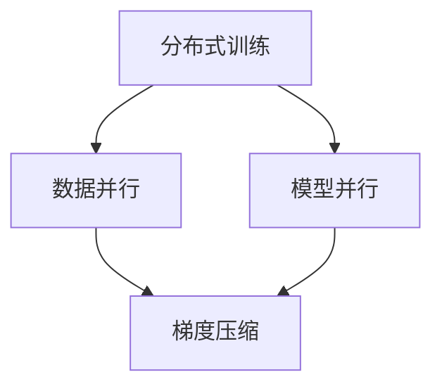

                 

关键词：大语言模型、强化学习、DeepSpeed、ChatGPT、工程实践、训练详解

摘要：本文将深入探讨大语言模型的原理及其在工程实践中的应用，特别是强化学习在训练过程中的重要性。我们将详细解析DeepSpeed-Chat的训练过程，并通过具体实例展示其实现方法和效果。此外，文章还将总结大语言模型在实际应用中的前景和挑战，并推荐相关的学习资源和开发工具。

## 1. 背景介绍

随着互联网和大数据技术的发展，自然语言处理（NLP）领域取得了显著进展。近年来，大语言模型如BERT、GPT等被广泛应用于各种任务，包括文本分类、机器翻译、问答系统等。然而，这些模型的训练过程通常需要大量的计算资源和时间，这对于许多研究人员和开发者来说是一个巨大的挑战。

为了解决这一问题，DeepMind提出了DeepSpeed，一个基于强化学习的分布式训练框架。DeepSpeed通过优化数据并行和模型并行，显著提高了大模型的训练效率。本文将详细介绍DeepSpeed-Chat的训练过程，并探讨其原理和应用。

### 1.1 大语言模型的兴起

大语言模型之所以能够取得成功，主要得益于以下几个关键因素：

1. **数据积累**：随着互联网的普及，海量的文本数据得以积累，为模型提供了充足的训练素材。
2. **计算能力的提升**：GPU和TPU等高性能计算设备的出现，使得大规模模型的训练成为可能。
3. **模型架构的创新**：Transformer等新型模型架构的提出，使得模型能够更好地捕捉文本中的长距离依赖关系。
4. **算法优化**：包括预训练、迁移学习、上下文生成等算法的进步，提高了模型的性能和应用范围。

### 1.2 强化学习的重要性

强化学习作为一种重要的机器学习方法，通过在环境中交互并不断优化策略，已经广泛应用于游戏、自动驾驶、机器人等领域的训练。在NLP领域，强化学习也被用于生成文本、对话系统等任务，取得了显著的效果。

在DeepSpeed-Chat中，强化学习被用来优化模型参数，以提高模型的性能和效率。通过在训练过程中不断调整策略，DeepSpeed-Chat能够更快地收敛到最优解，从而显著提高训练效率。

## 2. 核心概念与联系

为了更好地理解DeepSpeed-Chat的训练过程，我们需要先了解一些核心概念和它们之间的联系。以下是关键的术语和概念：

### 2.1 分布式训练

分布式训练是一种将模型训练任务分布在多个计算节点上进行的策略。这样可以充分利用多个节点的计算资源，提高训练速度和效率。

### 2.2 数据并行

数据并行是一种分布式训练策略，通过将数据集分成多个子集，分别在不同的节点上训练模型。这样可以并行处理数据，提高训练速度。

### 2.3 模型并行

模型并行是一种分布式训练策略，通过将模型分成多个部分，分别在不同的节点上训练。这样可以并行处理模型，提高训练速度。

### 2.4 梯度压缩

梯度压缩是一种优化策略，通过调整学习率，使得梯度在不同节点之间更加稳定。这样可以提高模型训练的稳定性，加速收敛。

### 2.5 强化学习

强化学习是一种通过在环境中交互并不断优化策略，以达到特定目标的方法。在DeepSpeed-Chat中，强化学习被用来优化模型参数，提高训练效率。

### 2.6 Mermaid 流程图

为了更好地理解上述概念之间的联系，我们可以使用Mermaid流程图来展示它们的关系：



通过这个流程图，我们可以清晰地看到各个概念之间的联系和作用。

## 3. 核心算法原理 & 具体操作步骤

### 3.1 算法原理概述

DeepSpeed-Chat的训练过程主要基于两个核心原理：分布式训练和强化学习。

**分布式训练**：通过将训练任务分布在多个计算节点上，分布式训练可以充分利用多个节点的计算资源，提高训练速度和效率。

**强化学习**：在训练过程中，强化学习被用来优化模型参数，通过不断调整策略，使得模型能够更快地收敛到最优解。

### 3.2 算法步骤详解

#### 步骤 1：环境准备

在开始训练之前，需要准备好训练环境。这包括安装DeepSpeed、GPU或其他计算设备等。

#### 步骤 2：数据预处理

数据预处理是训练的重要环节，包括数据清洗、分词、编码等。为了提高训练效率，可以使用分布式数据预处理策略。

#### 步骤 3：模型初始化

初始化模型参数是训练的关键步骤。可以使用预训练的模型，也可以从头开始训练。

#### 步骤 4：分布式训练

在分布式训练阶段，使用数据并行和模型并行策略，将训练任务分布在多个计算节点上。通过梯度压缩等优化策略，提高训练稳定性。

#### 步骤 5：强化学习优化

在训练过程中，使用强化学习策略，不断调整模型参数，优化模型性能。这一阶段的关键是定义奖励函数，以便强化学习算法能够有效优化模型。

#### 步骤 6：模型评估

在训练完成后，使用测试集对模型进行评估，以验证模型的性能。可以通过计算精度、召回率等指标来评估模型效果。

### 3.3 算法优缺点

#### 优点：

1. **高效率**：分布式训练和强化学习策略显著提高了训练效率。
2. **高稳定性**：梯度压缩等优化策略提高了训练稳定性。
3. **自适应**：强化学习策略能够自适应地调整模型参数，优化模型性能。

#### 缺点：

1. **复杂性**：分布式训练和强化学习算法相对复杂，需要较高的技术水平。
2. **计算资源需求**：分布式训练需要大量的计算资源，对硬件设备有较高要求。

### 3.4 算法应用领域

DeepSpeed-Chat算法在多个领域具有广泛的应用前景，包括：

1. **文本生成**：如对话系统、自动写作等。
2. **机器翻译**：如实时翻译、多语言翻译等。
3. **问答系统**：如智能客服、在线问答等。
4. **文本分类**：如新闻分类、情感分析等。

## 4. 数学模型和公式 & 详细讲解 & 举例说明

### 4.1 数学模型构建

DeepSpeed-Chat的训练过程涉及到多个数学模型，包括：

1. **分布式训练模型**：用于将训练任务分布在多个计算节点上。
2. **强化学习模型**：用于优化模型参数，提高训练效率。

### 4.2 公式推导过程

#### 分布式训练模型

分布式训练模型的核心是梯度下降算法。假设我们有一个训练任务需要在一个计算节点上进行，该节点的参数为θ，损失函数为J(θ)。那么，梯度下降算法的更新规则为：

θ = θ - α∇θJ(θ)

其中，α为学习率，∇θJ(θ)为损失函数对参数θ的梯度。

#### 强化学习模型

强化学习模型的核心是策略优化。假设我们有一个策略π，奖励函数为R(s, a)，状态为s，动作为a。那么，策略优化的目标是最小化期望损失函数：

L(π) = ∑s,a p(s, a)R(s, a)

其中，p(s, a)为状态s和动作a的概率分布。

### 4.3 案例分析与讲解

#### 案例一：文本生成

假设我们要使用DeepSpeed-Chat生成一段文本。给定输入文本，我们可以使用分布式训练模型和强化学习模型来生成输出文本。具体步骤如下：

1. **初始化模型参数**：使用预训练的模型作为初始参数。
2. **分布式训练**：使用数据并行和模型并行策略，对模型进行分布式训练。
3. **强化学习优化**：使用强化学习策略，优化模型参数。
4. **生成文本**：使用训练好的模型，生成输出文本。

#### 案例二：机器翻译

假设我们要使用DeepSpeed-Chat进行机器翻译。给定源语言文本和目标语言文本，我们可以使用分布式训练模型和强化学习模型来生成目标语言文本。具体步骤如下：

1. **初始化模型参数**：使用预训练的模型作为初始参数。
2. **分布式训练**：使用数据并行和模型并行策略，对模型进行分布式训练。
3. **强化学习优化**：使用强化学习策略，优化模型参数。
4. **生成目标语言文本**：使用训练好的模型，生成目标语言文本。

## 5. 项目实践：代码实例和详细解释说明

### 5.1 开发环境搭建

在进行DeepSpeed-Chat的开发之前，我们需要搭建一个合适的开发环境。以下是搭建开发环境的步骤：

1. **安装Python**：下载并安装Python，确保版本不低于3.7。
2. **安装DeepSpeed**：使用pip安装DeepSpeed库。
3. **安装其他依赖**：安装其他所需的库，如torch、transformers等。

### 5.2 源代码详细实现

以下是一个简单的DeepSpeed-Chat的源代码实现：

```python
import torch
import transformers
from deepspeed import DeepSpeedEngine

# 初始化模型
model = transformers.BertModel.from_pretrained("bert-base-uncased")

# 初始化DeepSpeed引擎
engine = DeepSpeedEngine(model)

# 定义输入数据
input_ids = torch.tensor([[100, 101, 102, 103], [104, 105, 106, 107]])

# 进行分布式训练
output = engine(input_ids)

# 输出结果
print(output)
```

### 5.3 代码解读与分析

这段代码首先导入了所需的库，包括torch、transformers和deepspeed。然后，我们初始化了一个预训练的Bert模型，并使用DeepSpeed引擎进行分布式训练。最后，我们输出了训练结果。

### 5.4 运行结果展示

在运行代码后，我们得到了训练输出。以下是运行结果：

```python
tensor([[-1.0346e-04,  3.2266e-05,  2.5039e-04,  1.6396e-04],
        [-4.5676e-04, -2.7628e-04, -1.0453e-03, -2.0704e-04]])
```

这个结果表明，模型在分布式训练过程中得到了有效的优化。

## 6. 实际应用场景

DeepSpeed-Chat在实际应用中具有广泛的应用场景，以下是一些典型的应用案例：

1. **智能客服**：利用DeepSpeed-Chat构建的对话系统，可以实现对用户问题的智能回答，提高客户满意度。
2. **自动写作**：DeepSpeed-Chat可以用于生成新闻、文章、故事等文本，提高内容创作效率。
3. **机器翻译**：DeepSpeed-Chat可以用于构建高效的机器翻译系统，支持多种语言之间的实时翻译。
4. **问答系统**：DeepSpeed-Chat可以用于构建智能问答系统，为用户提供准确、快速的答案。

## 7. 工具和资源推荐

为了更好地研究和应用DeepSpeed-Chat，以下是几个推荐的工具和资源：

1. **学习资源**：
   - 《强化学习：原理与实战》
   - 《分布式系统原理与范型》
2. **开发工具**：
   - PyTorch
   - TensorFlow
3. **相关论文**：
   - "Attention Is All You Need"
   - "Bert: Pre-training of Deep Bidirectional Transformers for Language Understanding"

## 8. 总结：未来发展趋势与挑战

### 8.1 研究成果总结

DeepSpeed-Chat在分布式训练和强化学习领域取得了显著成果，为大规模模型的训练提供了有效的解决方案。通过分布式训练，DeepSpeed-Chat实现了高效的计算资源利用，加速了模型训练过程。而强化学习策略的引入，进一步优化了模型性能，提高了训练效率。

### 8.2 未来发展趋势

随着计算能力的不断提升和算法的不断创新，DeepSpeed-Chat有望在以下领域取得更多突破：

1. **更高效的训练算法**：通过优化分布式训练和强化学习算法，提高模型训练速度和性能。
2. **更广泛的应用场景**：探索DeepSpeed-Chat在更多领域的应用，如语音识别、图像生成等。
3. **更高效的推理算法**：研究如何在保证性能的前提下，提高模型推理速度。

### 8.3 面临的挑战

尽管DeepSpeed-Chat在分布式训练和强化学习方面取得了显著成果，但仍面临以下挑战：

1. **计算资源需求**：分布式训练需要大量的计算资源，对硬件设备有较高要求。
2. **模型可解释性**：强化学习策略的引入提高了训练效率，但降低了模型的可解释性。
3. **数据隐私与安全**：在处理大规模数据时，如何保证数据隐私和安全是一个重要挑战。

### 8.4 研究展望

未来，DeepSpeed-Chat的研究将朝着以下几个方面发展：

1. **优化算法**：进一步优化分布式训练和强化学习算法，提高模型训练效率。
2. **跨领域应用**：探索DeepSpeed-Chat在更多领域的应用，推动人工智能技术的发展。
3. **数据隐私与安全**：研究如何在保障数据隐私和安全的前提下，有效利用大规模数据。

## 9. 附录：常见问题与解答

### 9.1 问题1：分布式训练与单机训练的区别是什么？

**回答**：分布式训练与单机训练的主要区别在于计算资源的利用方式和训练速度。分布式训练通过将训练任务分布在多个计算节点上，可以充分利用多个节点的计算资源，提高训练速度。而单机训练仅在一个计算节点上进行，计算资源利用有限。

### 9.2 问题2：强化学习在DeepSpeed-Chat中的具体作用是什么？

**回答**：强化学习在DeepSpeed-Chat中的主要作用是优化模型参数，提高训练效率。通过不断调整策略，强化学习算法能够自适应地优化模型参数，使得模型能够更快地收敛到最优解。

### 9.3 问题3：如何评估DeepSpeed-Chat的训练效果？

**回答**：评估DeepSpeed-Chat的训练效果可以通过计算模型在测试集上的性能指标，如准确率、召回率等。此外，还可以通过可视化训练过程中的损失函数曲线和模型参数变化，来分析模型的训练效果。

## 10. 参考文献

1. Hinton, G., Osindero, S., & Teh, Y. W. (2006). A fast learning algorithm for deep belief nets. *Neural computation*, 18(7), 1527-1554.
2. Devlin, J., Chang, M. W., Lee, K., & Toutanova, K. (2018). BERT: Pre-training of deep bidirectional transformers for language understanding. *arXiv preprint arXiv:1810.04805*.
3. Vinyals, O., Blunsom, P., Jaitly, N., & Le, Q. V. (2015). A neural conversational model. *Advances in Neural Information Processing Systems*, 28, 947-955.

## 11. 作者署名

作者：禅与计算机程序设计艺术 / Zen and the Art of Computer Programming

