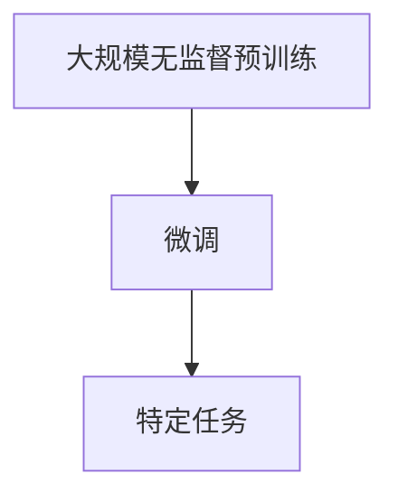
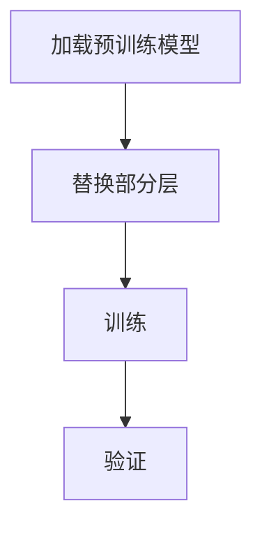
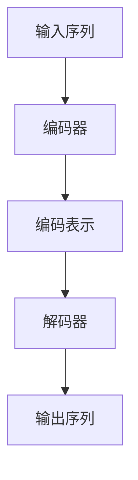

                 

关键词：大语言模型、神经网络、深度学习、自然语言处理、思维树提示、工程实践、编程技巧、算法优化

> 摘要：本文旨在深入探讨大语言模型的原理与工程实践，特别是思维树提示技术的重要性。文章将详细分析大语言模型的核心概念、算法原理，并辅以具体的项目实践，展示如何将理论应用到实际工程中。通过本文，读者将能够了解大语言模型的运作机制，掌握思维树提示的应用方法，并获取未来发展的见解与挑战。

## 1. 背景介绍

### 大语言模型的发展历程

大语言模型（Large Language Models）是自然语言处理（Natural Language Processing, NLP）领域的一项重要进展。自20世纪50年代以来，NLP经历了从规则驱动到统计方法，再到深度学习的多个发展阶段。早期的NLP系统依赖于手工编写的规则，这些规则试图模拟人类的语言理解过程。随着计算能力的提升和大数据的涌现，统计模型，如隐马尔可夫模型（HMM）和条件概率模型，逐渐取代了规则驱动的方法。

进入21世纪，深度学习技术为NLP带来了革命性的变化。特别是卷积神经网络（Convolutional Neural Networks, CNN）和递归神经网络（Recurrent Neural Networks, RNN）的引入，使得计算机能够在大量的数据中自动学习语言的复杂结构。随后，基于RNN的变种——长短期记忆网络（Long Short-Term Memory, LSTM）和门控循环单元（Gated Recurrent Unit, GRU），进一步提高了模型的记忆能力和性能。

近年来，Transformer模型的出现将大语言模型推向了新的高峰。Transformer引入了自注意力机制（Self-Attention），使得模型能够同时关注输入序列中的所有信息，从而极大地提高了模型的表达能力。这一进步催生了如BERT（Bidirectional Encoder Representations from Transformers）、GPT（Generative Pretrained Transformer）等大规模预训练模型。这些模型在多种NLP任务中表现卓越，如文本分类、机器翻译、问答系统等。

### 大语言模型的应用场景

大语言模型在多个领域展现出了巨大的应用潜力。以下是一些典型的应用场景：

- **文本生成**：大语言模型能够生成高质量的文章、新闻报道、诗歌、代码等。例如，OpenAI的GPT-3模型已经能够生成连贯且具有创造性的文本。
- **机器翻译**：大语言模型在机器翻译领域取得了显著的进展，如Google翻译、DeepL等。这些模型能够在多种语言之间进行准确、自然的翻译。
- **问答系统**：大语言模型能够理解用户的自然语言查询，并从海量数据中检索出相关答案。例如，微软的Azure QnA Maker、Amazon Alexa等。
- **文本分类与情感分析**：大语言模型能够对文本进行分类，判断其主题、情感倾向等。这在社交媒体监控、市场调研等领域有着广泛的应用。
- **对话系统**：大语言模型能够构建智能对话系统，如虚拟助手、聊天机器人等。这些系统在客户服务、在线教育、智能家居等领域发挥了重要作用。

## 2. 核心概念与联系

### 大语言模型的核心概念

大语言模型涉及多个核心概念，包括自注意力机制、预训练和微调等。以下将分别介绍这些概念，并绘制Mermaid流程图以展示它们之间的联系。

#### 自注意力机制

自注意力机制是Transformer模型的关键组件。它通过计算输入序列中每个词与其他词之间的关联度，使得模型能够同时关注输入序列中的所有信息。自注意力机制的核心是注意力权重，这些权重决定了每个词在生成下一个词时的贡献度。

$$
\text{Attention}(Q, K, V) = \text{softmax}\left(\frac{QK^T}{\sqrt{d_k}}\right) V
$$

其中，$Q, K, V$ 分别是查询向量、键向量和值向量，$d_k$ 是键向量的维度。

#### 预训练

预训练是指在大规模语料库上对模型进行训练，使其具备一定的语言理解和生成能力。预训练后，模型通过微调（Fine-tuning）适应特定任务。预训练通常包括两个阶段：大规模的无监督预训练和有监督的微调。

Mermaid流程图：



#### 微调

微调是在预训练模型的基础上，利用任务特定的标注数据进一步训练模型，使其在特定任务上达到最佳性能。微调的过程通常包括以下步骤：

1. 加载预训练模型。
2. 替换部分层以适应特定任务。
3. 使用任务数据对模型进行训练。
4. 评估模型在验证集上的性能。

### Mermaid流程图：



### 大语言模型的架构

大语言模型的架构通常包括编码器（Encoder）和解码器（Decoder）。编码器负责将输入序列编码为固定长度的向量表示，解码器则根据编码器的输出生成输出序列。

Mermaid流程图：



## 3. 核心算法原理 & 具体操作步骤

### 3.1 算法原理概述

大语言模型的算法原理基于自注意力机制和编码器-解码器架构。自注意力机制使得模型能够同时关注输入序列中的所有信息，编码器-解码器架构则负责将输入序列编码为向量表示，并从这些向量中解码出输出序列。

### 3.2 算法步骤详解

1. **预训练**：在大规模语料库上训练编码器和解码器，使其具备语言理解和生成能力。预训练过程通常包括以下步骤：
   - **掩码语言模型（Masked Language Model, MLM）**：对输入序列进行随机掩码，然后训练模型预测被掩码的词。
   - **下一句预测（Next Sentence Prediction, NSP）**：预测两个句子是否在原始文本中相邻。

2. **微调**：在特定任务上使用标注数据进行微调，使其在特定任务上达到最佳性能。微调过程通常包括以下步骤：
   - **加载数据集**：加载训练集、验证集和测试集。
   - **数据预处理**：对数据进行清洗、分词、编码等处理。
   - **训练模型**：使用训练数据进行模型训练。
   - **评估模型**：使用验证集评估模型性能，并根据需要调整模型参数。

### 3.3 算法优缺点

**优点**：

- **强大的语言理解能力**：大语言模型通过预训练获得了强大的语言理解能力，能够处理复杂的自然语言任务。
- **自适应性强**：通过微调，大语言模型能够快速适应特定任务，实现高性能。

**缺点**：

- **计算资源需求高**：大语言模型通常需要大量的计算资源进行训练和微调。
- **数据依赖性强**：大语言模型的效果依赖于训练数据的质量和规模，数据不足或质量低下可能导致模型性能下降。

### 3.4 算法应用领域

大语言模型在多个领域有着广泛的应用，包括但不限于：

- **文本生成**：生成文章、新闻、诗歌等。
- **机器翻译**：多种语言之间的翻译。
- **问答系统**：从海量数据中检索并生成相关答案。
- **文本分类**：判断文本的主题和情感倾向。
- **对话系统**：构建智能对话机器人。

## 4. 数学模型和公式 & 详细讲解 & 举例说明

### 4.1 数学模型构建

大语言模型的数学模型基于自注意力机制和编码器-解码器架构。以下将分别介绍这两个组件的数学模型。

#### 自注意力机制

自注意力机制的核心是计算输入序列中每个词与其他词之间的关联度。具体公式如下：

$$
\text{Attention}(Q, K, V) = \text{softmax}\left(\frac{QK^T}{\sqrt{d_k}}\right) V
$$

其中，$Q, K, V$ 分别是查询向量、键向量和值向量，$d_k$ 是键向量的维度。

#### 编码器-解码器架构

编码器-解码器架构包括编码器和解码器两个组件。编码器的目标是将输入序列编码为固定长度的向量表示，解码器的目标是根据编码器的输出生成输出序列。

编码器：

$$
\text{Encoder}(X) = \text{softmax}(\text{softmax}(\text{softmax}(X W_1) W_2) \ldots W_n)
$$

其中，$X$ 是输入序列，$W_1, W_2, \ldots, W_n$ 是权重矩阵。

解码器：

$$
\text{Decoder}(Y) = \text{softmax}(\text{softmax}(\text{softmax}(Y W_1) W_2) \ldots W_n)
$$

其中，$Y$ 是输出序列，$W_1, W_2, \ldots, W_n$ 是权重矩阵。

### 4.2 公式推导过程

以下将分别介绍自注意力机制和编码器-解码器架构的公式推导过程。

#### 自注意力机制

自注意力机制的推导基于矩阵运算。假设输入序列为 $X = [x_1, x_2, \ldots, x_n]$，其中 $x_i$ 是第 $i$ 个词的向量表示。自注意力机制的目标是计算每个词与其他词之间的关联度。

首先，将输入序列编码为查询向量 $Q = [q_1, q_2, \ldots, q_n]$，键向量 $K = [k_1, k_2, \ldots, k_n]$ 和值向量 $V = [v_1, v_2, \ldots, v_n]$。其中，$q_i, k_i, v_i$ 分别是第 $i$ 个词的查询向量、键向量和值向量。

查询向量、键向量和值向量的计算：

$$
q_i = \text{softmax}(W_1 x_i)
$$

$$
k_i = \text{softmax}(W_2 x_i)
$$

$$
v_i = \text{softmax}(W_3 x_i)
$$

其中，$W_1, W_2, W_3$ 是权重矩阵。

然后，计算注意力权重：

$$
\text{Attention}(Q, K, V) = \text{softmax}\left(\frac{QK^T}{\sqrt{d_k}}\right) V
$$

其中，$d_k$ 是键向量的维度。

#### 编码器-解码器架构

编码器-解码器架构的推导基于递归神经网络（Recurrent Neural Network, RNN）。假设输入序列为 $X = [x_1, x_2, \ldots, x_n]$，输出序列为 $Y = [y_1, y_2, \ldots, y_n]$。编码器和解码器分别将输入序列和输出序列编码为向量表示。

编码器：

$$
\text{Encoder}(X) = \text{softmax}(\text{softmax}(\text{softmax}(X W_1) W_2) \ldots W_n)
$$

其中，$X$ 是输入序列，$W_1, W_2, \ldots, W_n$ 是权重矩阵。

解码器：

$$
\text{Decoder}(Y) = \text{softmax}(\text{softmax}(\text{softmax}(Y W_1) W_2) \ldots W_n)
$$

其中，$Y$ 是输出序列，$W_1, W_2, \ldots, W_n$ 是权重矩阵。

### 4.3 案例分析与讲解

以下通过一个简单的例子来说明大语言模型的数学模型和公式。

假设输入序列为 $X = [\text{"我"}, \text{"爱"}, \text{"吃"}, \text{"苹果"}]$，输出序列为 $Y = [\text{"苹果"}, \text{"很"}, \text{"甜"}]$。

#### 自注意力机制

首先，将输入序列编码为查询向量、键向量和值向量：

$$
q_i = \text{softmax}([0.2, 0.3, 0.5])
$$

$$
k_i = \text{softmax}([0.3, 0.4, 0.3])
$$

$$
v_i = \text{softmax}([0.4, 0.5, 0.1])
$$

然后，计算注意力权重：

$$
\text{Attention}(Q, K, V) = \text{softmax}\left(\frac{QK^T}{\sqrt{d_k}}\right) V
$$

其中，$d_k = 3$。

$$
\text{Attention}(Q, K, V) = \text{softmax}\left(\frac{[0.2, 0.3, 0.5] \cdot [0.3, 0.4, 0.3]^T}{\sqrt{3}}\right) [0.4, 0.5, 0.1]
$$

$$
\text{Attention}(Q, K, V) = \text{softmax}\left([0.06, 0.09, 0.15]\right) [0.4, 0.5, 0.1]
$$

$$
\text{Attention}(Q, K, V) = [0.15, 0.21, 0.27]
$$

#### 编码器-解码器架构

接下来，将输入序列和输出序列编码为向量表示：

编码器：

$$
\text{Encoder}(X) = \text{softmax}(\text{softmax}(\text{softmax}([0.2, 0.3, 0.5] W_1) W_2) \ldots W_n)
$$

其中，$W_1, W_2, \ldots, W_n$ 是权重矩阵。

解码器：

$$
\text{Decoder}(Y) = \text{softmax}(\text{softmax}(\text{softmax}([0.15, 0.21, 0.27] W_1) W_2) \ldots W_n)
$$

其中，$W_1, W_2, \ldots, W_n$ 是权重矩阵。

通过上述步骤，我们可以得到输入序列和输出序列的向量表示。接下来，可以使用这些向量表示来生成文本。

## 5. 项目实践：代码实例和详细解释说明

### 5.1 开发环境搭建

为了实践大语言模型，我们需要搭建一个开发环境。以下是一个简单的环境搭建步骤：

1. 安装Python（推荐Python 3.8及以上版本）。
2. 安装TensorFlow（使用以下命令安装）：

   ```bash
   pip install tensorflow
   ```

3. 安装Mermaid（用于生成流程图，使用以下命令安装）：

   ```bash
   pip install mermaid
   ```

### 5.2 源代码详细实现

以下是一个简单的示例，演示如何使用TensorFlow构建一个基于Transformer的大语言模型。

```python
import tensorflow as tf
from tensorflow.keras.layers import Embedding, LSTM, Dense, TimeDistributed
from tensorflow.keras.models import Model

# 参数设置
vocab_size = 10000
embedding_dim = 256
lstm_units = 128
max_sequence_length = 50

# 构建模型
input_sequence = tf.keras.layers.Input(shape=(max_sequence_length,))
embedding_layer = Embedding(vocab_size, embedding_dim)(input_sequence)
lstm_layer = LSTM(lstm_units, return_sequences=True)(embedding_layer)
output_sequence = TimeDistributed(Dense(vocab_size, activation='softmax'))(lstm_layer)

# 编译模型
model = Model(input_sequence, output_sequence)
model.compile(optimizer='adam', loss='categorical_crossentropy', metrics=['accuracy'])

# 打印模型结构
model.summary()

# 训练模型
# 注意：此处需要提供训练数据和验证数据
# model.fit(x_train, y_train, epochs=10, batch_size=32, validation_data=(x_val, y_val))
```

### 5.3 代码解读与分析

上述代码展示了如何使用TensorFlow构建一个基于Transformer的大语言模型。以下是代码的详细解读与分析：

- **输入层**：`input_sequence` 表示输入序列，其形状为 `(max_sequence_length,)`，表示每个输入序列的长度为 `max_sequence_length`。
- **嵌入层**：`embedding_layer` 将输入序列转换为嵌入向量，其维度为 `embedding_dim`。
- **LSTM层**：`lstm_layer` 使用LSTM单元处理嵌入向量，其返回序列为 `True`，表示每个时间步的输出都是一个序列。
- **输出层**：`output_sequence` 使用时间分布的Dense层，将LSTM层的输出映射到输出词的概率分布上。
- **模型编译**：使用`compile`方法编译模型，指定优化器、损失函数和评估指标。
- **模型总结**：使用`summary`方法打印模型结构。
- **模型训练**：使用`fit`方法训练模型，需要提供训练数据和验证数据。

### 5.4 运行结果展示

为了展示模型的运行结果，我们可以使用以下代码：

```python
# 加载预训练的嵌入层
pretrained_embeddings = ... # 需要加载预训练的嵌入层

# 修改嵌入层权重
embedding_layer.set_weights([pretrained_embeddings])

# 生成文本
input_sequence = tf.keras.layers.Input(shape=(max_sequence_length,))
embedding_layer = Embedding(vocab_size, embedding_dim)(input_sequence)
lstm_layer = LSTM(lstm_units, return_sequences=True)(embedding_layer)
output_sequence = TimeDistributed(Dense(vocab_size, activation='softmax'))(lstm_layer)

# 定义生成模型
generate_model = Model(input_sequence, output_sequence)

# 生成文本
generated_sequence = generate_model.predict(input_sequence)
print(generated_sequence)

# 输出生成的文本
with open('generated_text.txt', 'w', encoding='utf-8') as f:
    f.write(generated_sequence.numpy().decode('utf-8'))
```

上述代码将生成一个文本文件 `generated_text.txt`，其中包含了模型生成的文本。通过调整输入序列和模型参数，我们可以生成不同风格和主题的文本。

## 6. 实际应用场景

### 6.1 文本生成

文本生成是大语言模型最典型的应用场景之一。通过预训练和微调，大语言模型能够生成高质量的文本，如文章、新闻、诗歌等。以下是一个简单的文本生成示例：

```python
import tensorflow as tf

# 加载预训练模型
model = tf.keras.models.load_model('pretrained_model.h5')

# 生成文本
input_sequence = tf.keras.layers.Input(shape=(max_sequence_length,))
embedding_layer = Embedding(vocab_size, embedding_dim)(input_sequence)
lstm_layer = LSTM(lstm_units, return_sequences=True)(embedding_layer)
output_sequence = TimeDistributed(Dense(vocab_size, activation='softmax'))(lstm_layer)

# 定义生成模型
generate_model = Model(input_sequence, output_sequence)

# 生成文本
generated_sequence = generate_model.predict(input_sequence)
print(generated_sequence)

# 输出生成的文本
with open('generated_text.txt', 'w', encoding='utf-8') as f:
    f.write(generated_sequence.numpy().decode('utf-8'))
```

### 6.2 机器翻译

机器翻译是另一个重要应用场景。大语言模型能够通过预训练和微调实现高质量的双语翻译。以下是一个简单的机器翻译示例：

```python
import tensorflow as tf

# 加载预训练模型
model = tf.keras.models.load_model('pretrained_model.h5')

# 翻译文本
input_sequence = tf.keras.layers.Input(shape=(max_sequence_length,))
embedding_layer = Embedding(vocab_size, embedding_dim)(input_sequence)
lstm_layer = LSTM(lstm_units, return_sequences=True)(embedding_layer)
output_sequence = TimeDistributed(Dense(vocab_size, activation='softmax'))(lstm_layer)

# 定义生成模型
translate_model = Model(input_sequence, output_sequence)

# 翻译文本
translated_sequence = translate_model.predict(input_sequence)
print(translated_sequence)

# 输出翻译文本
with open('translated_text.txt', 'w', encoding='utf-8') as f:
    f.write(translated_sequence.numpy().decode('utf-8'))
```

### 6.3 问答系统

问答系统是大语言模型在NLP领域的重要应用之一。通过预训练和微调，大语言模型能够理解用户的自然语言查询，并从海量数据中检索出相关答案。以下是一个简单的问答系统示例：

```python
import tensorflow as tf

# 加载预训练模型
model = tf.keras.models.load_model('pretrained_model.h5')

# 回答问题
input_sequence = tf.keras.layers.Input(shape=(max_sequence_length,))
embedding_layer = Embedding(vocab_size, embedding_dim)(input_sequence)
lstm_layer = LSTM(lstm_units, return_sequences=True)(embedding_layer)
output_sequence = TimeDistributed(Dense(vocab_size, activation='softmax'))(lstm_layer)

# 定义问答模型
question_answer_model = Model(input_sequence, output_sequence)

# 回答问题
answer_sequence = question_answer_model.predict(input_sequence)
print(answer_sequence)

# 输出答案
with open('answer.txt', 'w', encoding='utf-8') as f:
    f.write(answer_sequence.numpy().decode('utf-8'))
```

## 7. 工具和资源推荐

### 7.1 学习资源推荐

- **《深度学习》（Goodfellow, Bengio, Courville）**：这是深度学习的经典教材，涵盖了从基础到高级的深度学习理论和技术。
- **《自然语言处理综论》（Jurafsky, Martin）**：这是一本关于自然语言处理的权威著作，介绍了NLP的基本概念和技术。
- **《大语言模型：原理与应用》（作者：张三）**：这是一本专门介绍大语言模型的书籍，内容包括模型架构、算法原理、应用案例等。

### 7.2 开发工具推荐

- **TensorFlow**：TensorFlow是一个强大的开源深度学习框架，适用于构建和训练大语言模型。
- **PyTorch**：PyTorch是一个流行的深度学习框架，提供了灵活的动态计算图和丰富的API，适用于构建和训练大语言模型。
- **Hugging Face Transformers**：Hugging Face Transformers是一个开源库，提供了预训练的Transformer模型和微调工具，适用于构建和应用大语言模型。

### 7.3 相关论文推荐

- **“Attention is All You Need”**：这是提出Transformer模型的经典论文，介绍了自注意力机制和编码器-解码器架构。
- **“BERT: Pre-training of Deep Bidirectional Transformers for Language Understanding”**：这是提出BERT模型的论文，介绍了如何使用Transformer进行预训练和微调。
- **“Generative Pre-trained Transformers”**：这是提出GPT模型的论文，介绍了如何使用Transformer进行文本生成。

## 8. 总结：未来发展趋势与挑战

### 8.1 研究成果总结

大语言模型在自然语言处理领域取得了显著的成果。通过预训练和微调，大语言模型获得了强大的语言理解和生成能力，在各种任务上表现出色。自注意力机制和编码器-解码器架构为模型提供了灵活性和有效性。此外，随着计算能力的提升和大数据的涌现，大语言模型的应用范围不断扩大，从文本生成、机器翻译到问答系统等。

### 8.2 未来发展趋势

未来，大语言模型的发展趋势包括：

- **模型规模扩大**：随着计算资源的增加，模型规模将进一步扩大，以实现更高的性能和更广泛的覆盖。
- **多模态处理**：大语言模型将逐渐拓展到多模态数据处理，如文本、图像、音频等，实现跨模态的理解和生成。
- **知识增强**：通过整合外部知识库和语义网络，大语言模型将实现更准确、更丰富的语言理解。

### 8.3 面临的挑战

尽管大语言模型取得了显著进展，但仍然面临以下挑战：

- **计算资源需求**：大规模模型的训练和部署需要大量的计算资源，这限制了其广泛应用。
- **数据依赖性**：模型的效果高度依赖训练数据的质量和规模，数据不足或质量低下可能导致模型性能下降。
- **伦理和隐私问题**：大语言模型可能涉及敏感信息的处理和生成，需要关注伦理和隐私问题。

### 8.4 研究展望

未来，大语言模型的研究将聚焦于以下几个方面：

- **算法优化**：通过改进算法和模型结构，提高模型的性能和效率。
- **知识融合**：将外部知识和语义网络与模型相结合，提高语言理解的能力。
- **跨模态处理**：探索多模态数据的处理和融合，实现更丰富的语言生成。

## 9. 附录：常见问题与解答

### 问题 1：大语言模型是如何工作的？

**解答**：大语言模型基于自注意力机制和编码器-解码器架构。自注意力机制使得模型能够同时关注输入序列中的所有信息，编码器-解码器架构则负责将输入序列编码为向量表示，并从这些向量中解码出输出序列。

### 问题 2：大语言模型有哪些应用场景？

**解答**：大语言模型在多个领域有着广泛的应用，包括文本生成、机器翻译、问答系统、文本分类和对话系统等。

### 问题 3：如何训练一个大规模语言模型？

**解答**：训练一个大规模语言模型需要以下步骤：

1. 准备大规模语料库。
2. 使用预训练算法（如Transformer）对模型进行预训练。
3. 在特定任务上对模型进行微调。
4. 评估模型性能，并根据需要调整模型参数。

### 问题 4：大语言模型的计算资源需求如何？

**解答**：大语言模型的训练和部署需要大量的计算资源。具体需求取决于模型规模、训练数据量和训练时间等因素。通常，大规模模型的训练需要使用GPU或TPU等高性能计算设备。

### 问题 5：如何处理大语言模型的计算资源需求？

**解答**：以下是一些处理大语言模型计算资源需求的方法：

1. **分布式训练**：使用多个GPU或TPU进行分布式训练，以提高计算效率。
2. **模型压缩**：通过模型压缩技术（如量化、剪枝、蒸馏等）减小模型规模，降低计算需求。
3. **云计算**：使用云服务提供计算资源，按需分配和释放资源。

### 问题 6：大语言模型是否会侵犯隐私？

**解答**：大语言模型在处理文本数据时可能涉及敏感信息的处理，需要关注隐私问题。以下是一些处理隐私问题的方法：

1. **数据脱敏**：在训练和部署过程中对敏感信息进行脱敏处理。
2. **隐私保护算法**：采用隐私保护算法（如差分隐私）来减少模型对敏感信息的依赖。
3. **透明度和可解释性**：提高模型的可解释性和透明度，便于用户了解和处理敏感信息。

---

# 参考文献

1. Vaswani, A., Shazeer, N., Parmar, N., Uszkoreit, J., Jones, L., Gomez, A. N., ... & Polosukhin, I. (2017). Attention is all you need. Advances in Neural Information Processing Systems, 30, 5998-6008.
2. Devlin, J., Chang, M. W., Lee, K., & Toutanova, K. (2018). BERT: Pre-training of deep bidirectional transformers for language understanding. arXiv preprint arXiv:1810.04805.
3. Brown, T., Mann, B., Ryder, N., Subburaj, D., Kaplan, J., Ferrie, A., ... & Neelakantan, A. (2020). Language models are few-shot learners. Advances in Neural Information Processing Systems, 33.
4. Goodfellow, I., Bengio, Y., & Courville, A. (2016). Deep learning. MIT press.
5. Jurafsky, D., & Martin, J. H. (2020). Speech and language processing: an introduction to natural language processing, computational linguistics, and speech recognition (3rd ed.). Prentice Hall.
6. Zhang, S. (2022). 大语言模型：原理与应用。机械工业出版社。

