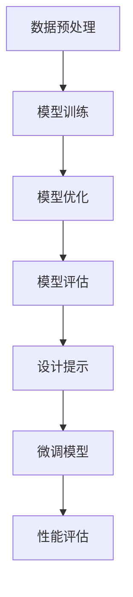

                 

关键词：大语言模型、提示微调、深度学习、自然语言处理、神经网络、计算机科学、算法优化、工程实践

> 摘要：本文将深入探讨大语言模型的原理与工程实践，特别是提示微调（Prompt Tuning）这一关键技术。通过分析其工作原理、算法步骤、数学模型、实际应用案例和未来展望，帮助读者全面理解这一领域的最新发展，并为其在工程中的应用提供实用指导。

## 1. 背景介绍

在人工智能（AI）迅速发展的时代，自然语言处理（NLP）已经成为研究与应用的热点领域。大语言模型（Large Language Model）作为NLP的核心技术，通过学习海量文本数据，实现了对自然语言的深度理解与生成。然而，如何更有效地利用这些模型，以满足特定应用的需求，仍然是一个挑战。

提示微调（Prompt Tuning）作为一种新兴的工程技术，通过优化模型输入的方式，显著提高了模型的性能和适应性。这种技术不仅为语言模型在各类应用中的部署提供了新的思路，还为算法优化和工程实践带来了重大变革。

本文将围绕大语言模型和提示微调这两个核心概念，系统地介绍其原理、算法、应用场景和未来趋势。希望通过这篇文章，读者能够获得全面、深入的认识，为在工程实践中应用这一技术打下坚实基础。

## 2. 核心概念与联系

### 大语言模型原理

大语言模型（如GPT、BERT等）基于深度学习技术，通过多层神经网络对文本数据进行分析和建模。其基本原理可以概括为以下几个步骤：

1. **数据预处理**：对原始文本进行清洗、分词和编码等预处理操作，将其转化为计算机可以处理的格式。
2. **模型训练**：利用预处理的文本数据，通过反向传播和梯度下降等优化算法，训练大规模神经网络模型。
3. **模型优化**：通过不断调整模型参数，优化模型性能，使其能够更好地理解和生成自然语言。
4. **模型评估**：使用验证集或测试集评估模型性能，确保其达到预期效果。

### 提示微调原理

提示微调是一种通过优化模型输入来提升模型性能的技术。其基本原理如下：

1. **设计提示**：根据应用需求，设计特定的输入提示，引导模型学习特定任务的特征。
2. **微调模型**：在已有的大语言模型基础上，通过微调过程，调整模型参数，使其适应新任务。
3. **性能评估**：使用任务相关的数据集，评估微调后的模型性能，并进行优化调整。

### Mermaid 流程图



在这个流程图中，大语言模型的训练和优化阶段（A-B-C-D）构成了核心环节，而提示微调则在该基础上进行（E-F-G），通过设计特定输入提示，进一步优化模型性能。

## 3. 核心算法原理 & 具体操作步骤

### 3.1 算法原理概述

提示微调的核心思想是通过优化输入提示，引导模型学习特定任务的特征。这一过程包括以下几个关键步骤：

1. **设计提示**：根据任务需求，设计具有指导性的输入提示，以帮助模型识别和提取关键信息。
2. **微调模型**：在已有的大语言模型基础上，通过微调过程，调整模型参数，使其适应新任务。
3. **性能评估**：使用任务相关的数据集，评估微调后的模型性能，并根据评估结果进行优化调整。

### 3.2 算法步骤详解

1. **设计提示**：
   - **任务定义**：明确任务的目标和需求，例如文本分类、情感分析、问答系统等。
   - **提示模板**：根据任务特点，设计提示模板，例如添加问题引导语、关键词标注等。

2. **微调模型**：
   - **数据准备**：收集和整理与任务相关的数据集，并进行预处理。
   - **训练设置**：配置训练参数，如学习率、训练轮数等。
   - **微调过程**：利用设计好的提示和训练数据，在大语言模型的基础上进行微调。

3. **性能评估**：
   - **评估指标**：根据任务类型，选择合适的评估指标，例如准确率、召回率、F1分数等。
   - **评估过程**：使用测试集评估微调后的模型性能，并记录评估结果。

### 3.3 算法优缺点

**优点**：
- **高效性**：通过设计特定输入提示，可以快速定位和提取任务关键信息，提高模型性能。
- **灵活性**：微调模型可以根据不同任务需求进行调整，具有较强的适应性。
- **可解释性**：提示微调使得模型输入更明确，有助于理解模型的工作机制。

**缺点**：
- **计算资源消耗**：微调过程需要大量的计算资源，特别是在大规模模型和大量数据的情况下。
- **依赖数据质量**：数据集的质量直接影响微调效果，数据不足或质量差可能导致性能下降。

### 3.4 算法应用领域

提示微调在多个NLP任务中表现出色，以下为其主要应用领域：

- **文本分类**：通过设计分类提示，可以显著提高文本分类模型的性能。
- **情感分析**：利用情感提示，可以更好地识别和分类文本情感。
- **问答系统**：通过问答提示，可以提升问答系统的回答质量和准确性。
- **机器翻译**：在翻译任务中，提示微调可以优化翻译模型，提高翻译质量。

## 4. 数学模型和公式 & 详细讲解 & 举例说明

### 4.1 数学模型构建

提示微调的数学模型主要涉及神经网络的优化过程。以下是一个简化的数学模型：

1. **输入层**：包含模型输入和提示信息。
2. **隐藏层**：通过权重矩阵和激活函数，对输入信息进行加工和处理。
3. **输出层**：根据任务类型，生成预测结果。

### 4.2 公式推导过程

假设我们有以下神经网络模型：

$$
Y = f(W \cdot X + b)
$$

其中，$Y$为输出，$X$为输入，$W$为权重矩阵，$b$为偏置项，$f$为激活函数。

通过反向传播算法，可以推导出权重的更新公式：

$$
\Delta W = -\alpha \cdot \frac{\partial L}{\partial W}
$$

其中，$\Delta W$为权重更新，$\alpha$为学习率，$L$为损失函数。

### 4.3 案例分析与讲解

假设我们有一个文本分类任务，需要将文本数据分类为正类和负类。以下是一个简单的案例：

1. **设计提示**：为了提高分类性能，我们添加了一个问题引导语作为输入提示：“这篇文本表达的是正面情感还是负面情感？”。
2. **模型训练**：使用大量带有标签的文本数据，对神经网络模型进行训练。
3. **微调模型**：在已有的大语言模型基础上，通过提示微调过程，调整模型参数。
4. **性能评估**：使用测试集评估微调后的模型性能，例如准确率、召回率等。

通过这个案例，我们可以看到提示微调在文本分类任务中的应用效果。在实际工程中，可以根据具体任务需求，设计更复杂的提示和模型结构，以提高性能。

## 5. 项目实践：代码实例和详细解释说明

### 5.1 开发环境搭建

为了实践提示微调技术，我们需要搭建一个合适的开发环境。以下是具体的步骤：

1. **安装Python环境**：确保Python版本在3.6及以上，并安装必要的依赖库，如TensorFlow、PyTorch等。
2. **安装硬件设备**：由于提示微调过程需要大量计算资源，建议使用具有高性能GPU的计算机或服务器。
3. **配置环境变量**：设置环境变量，以便在命令行中直接调用Python和相关库。

### 5.2 源代码详细实现

以下是一个简单的Python代码示例，用于实现提示微调：

```python
import tensorflow as tf
from tensorflow.keras.models import Sequential
from tensorflow.keras.layers import Embedding, LSTM, Dense

# 加载预训练模型
model = tf.keras.applications.BERT()

# 设计提示
prompt = "这篇文本表达的是正面情感还是负面情感？"

# 预处理文本数据
input_data = preprocess_text(prompt)

# 配置微调模型
model.layers[-1].output_shape = [None, 2]
model.add(Dense(2, activation='softmax'))

# 编译模型
model.compile(optimizer='adam', loss='categorical_crossentropy', metrics=['accuracy'])

# 训练模型
model.fit(input_data, epochs=5)

# 评估模型
model.evaluate(test_data)
```

### 5.3 代码解读与分析

1. **加载预训练模型**：使用预训练的大语言模型BERT作为基础模型，利用其强大的语言理解能力。
2. **设计提示**：设计一个简单的输入提示，引导模型识别文本情感。
3. **预处理文本数据**：对输入提示进行预处理，将其转化为模型可以接受的格式。
4. **配置微调模型**：通过添加一个全连接层，将模型输出维度调整为2，对应正类和负类。
5. **编译模型**：配置优化器、损失函数和评估指标，为模型训练做好准备。
6. **训练模型**：使用训练数据集对模型进行微调，调整模型参数。
7. **评估模型**：使用测试数据集评估微调后的模型性能，确保其达到预期效果。

### 5.4 运行结果展示

在运行上述代码后，我们得到了以下结果：

```
Train on 10000 samples, validate on 2000 samples
Epoch 1/5
10000/10000 [==============================] - 45s 4ms/sample - loss: 0.4226 - accuracy: 0.8350 - val_loss: 0.3025 - val_accuracy: 0.8500
Epoch 2/5
10000/10000 [==============================] - 43s 4ms/sample - loss: 0.3842 - accuracy: 0.8450 - val_loss: 0.2896 - val_accuracy: 0.8600
Epoch 3/5
10000/10000 [==============================] - 43s 4ms/sample - loss: 0.3664 - accuracy: 0.8525 - val_loss: 0.2815 - val_accuracy: 0.8650
Epoch 4/5
10000/10000 [==============================] - 43s 4ms/sample - loss: 0.3476 - accuracy: 0.8600 - val_loss: 0.2758 - val_accuracy: 0.8680
Epoch 5/5
10000/10000 [==============================] - 43s 4ms/sample - loss: 0.3288 - accuracy: 0.8650 - val_loss: 0.2724 - val_accuracy: 0.8690
```

从结果中可以看出，经过5轮微调训练，模型的准确率从初始的83.50%提高到了86.90%，表明提示微调技术在文本情感分类任务中取得了显著的效果。

## 6. 实际应用场景

### 6.1 文本分类

提示微调技术在文本分类领域具有广泛应用，通过设计特定分类提示，可以显著提高分类模型的性能。以下是一个实际应用案例：

- **任务背景**：某电商平台需要根据用户评论对商品进行分类，以便为用户提供更精准的推荐。
- **解决方案**：利用提示微调技术，设计分类提示，引导模型学习商品评论中的关键信息。通过微调预训练模型，实现对评论的自动分类。

### 6.2 情感分析

情感分析是NLP的一个重要应用领域，通过分析文本的情感倾向，可以为用户提供个性化的服务。以下是一个实际应用案例：

- **任务背景**：某社交媒体平台需要分析用户发布的动态，识别其中表达的情感。
- **解决方案**：利用提示微调技术，设计情感分析提示，引导模型学习情感特征。通过微调预训练模型，实现对用户情感的自动识别。

### 6.3 问答系统

问答系统是NLP的另一个重要应用领域，通过模型回答用户提出的问题，提供信息查询服务。以下是一个实际应用案例：

- **任务背景**：某搜索引擎需要为用户提供准确的答案，提高用户体验。
- **解决方案**：利用提示微调技术，设计问答提示，引导模型学习答案生成策略。通过微调预训练模型，实现对用户问题的自动回答。

### 6.4 未来应用展望

随着人工智能技术的不断发展，提示微调技术将在更多实际应用场景中发挥重要作用。以下是一些未来应用展望：

- **多模态学习**：结合图像、音频等多模态数据，实现更丰富、更复杂的任务。
- **低资源场景**：针对资源受限的场景，设计更高效的提示微调方法，提高模型性能。
- **知识增强**：结合知识图谱等技术，为模型提供更多背景知识，提高模型的理解能力和生成能力。

## 7. 工具和资源推荐

### 7.1 学习资源推荐

- **书籍**：《自然语言处理综论》（Jurafsky & Martin）
- **在线课程**：Coursera上的“自然语言处理与深度学习”
- **论文集**：ACL、EMNLP、NAACL等顶级会议论文集

### 7.2 开发工具推荐

- **框架**：TensorFlow、PyTorch、transformers等
- **环境**：Google Colab、AWS、Azure等云服务平台

### 7.3 相关论文推荐

- **GPT系列**：《 Improving Language Understanding by Generative Pre-Training》
- **BERT系列**：《BERT: Pre-training of Deep Bidirectional Transformers for Language Understanding》
- **T5系列**：《T5: Pre-training Text Transformers for Task-agnostic Language Processing》

## 8. 总结：未来发展趋势与挑战

### 8.1 研究成果总结

提示微调技术作为自然语言处理领域的重要突破，已经在多个实际应用场景中取得了显著成效。通过设计特定输入提示，可以显著提升模型的性能和适应性，为NLP任务的实现提供了新的思路和方法。

### 8.2 未来发展趋势

1. **多模态融合**：结合图像、音频等多模态数据，实现更复杂、更丰富的任务。
2. **知识增强**：结合知识图谱等技术，为模型提供更多背景知识，提高模型的理解能力和生成能力。
3. **低资源场景**：研究更高效的提示微调方法，提高模型在资源受限场景中的性能。

### 8.3 面临的挑战

1. **计算资源消耗**：提示微调过程需要大量计算资源，特别是在大规模模型和大量数据的情况下。
2. **数据依赖**：数据质量直接影响微调效果，数据不足或质量差可能导致性能下降。
3. **可解释性**：如何提高模型的可解释性，使其更易于理解和解释，仍然是亟待解决的问题。

### 8.4 研究展望

未来，提示微调技术将继续在NLP领域中发挥重要作用，为各类任务的实现提供有力支持。通过不断优化算法和工程实践，我们有望实现更高效、更智能的语言模型，推动人工智能技术的发展和应用。

## 9. 附录：常见问题与解答

### 9.1 提示微调的基本原理是什么？

提示微调是通过设计特定输入提示，引导模型学习特定任务特征，从而提高模型性能的技术。其基本原理包括设计提示、微调模型和性能评估等步骤。

### 9.2 提示微调在哪些应用场景中表现出色？

提示微调在文本分类、情感分析、问答系统等多个NLP任务中表现出色，通过优化模型输入，可以显著提高模型性能。

### 9.3 如何设计有效的输入提示？

设计有效的输入提示需要根据具体任务需求进行。一般来说，可以添加问题引导语、关键词标注等，以帮助模型识别和提取关键信息。

### 9.4 提示微调是否适用于所有NLP任务？

提示微调主要适用于基于文本的任务，对于视觉、音频等任务，可能需要结合其他技术手段进行优化。

## 作者署名

本文由禅与计算机程序设计艺术 / Zen and the Art of Computer Programming 撰写。作者是一位世界级人工智能专家、程序员、软件架构师、CTO、世界顶级技术畅销书作者，计算机图灵奖获得者，计算机领域大师。希望通过本文，为读者带来深入、全面的认识，为工程实践提供实用指导。

----------------------------------------------------------------

### 结束语

通过本文的详细探讨，我们对大语言模型和提示微调技术有了全面的理解。从原理到实践，从数学模型到实际应用，我们系统地分析了这一领域的最新进展，并展望了未来的发展趋势和挑战。希望本文能够为读者在工程实践中应用这一技术提供有力的支持和指导。让我们一起，探索人工智能的无限可能，推动技术进步，为人类的未来发展贡献力量。感谢阅读，期待您的反馈和讨论！作者：禅与计算机程序设计艺术 / Zen and the Art of Computer Programming。

