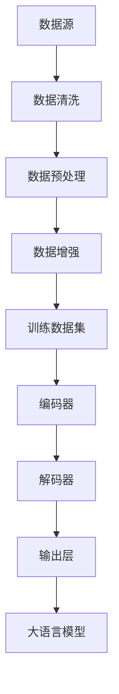

                 

关键词：大语言模型，数据集净化，自然语言处理，算法原理，工程实践，数学模型，应用领域

## 摘要

本文旨在深入探讨大语言模型在自然语言处理（NLP）中的关键作用，特别是数据集净化的原理与工程实践。通过对大语言模型的核心概念、数学模型、算法原理以及应用领域的详细阐述，本文揭示了如何通过有效的数据集净化技术，提升模型的准确性和鲁棒性。文章结构包括背景介绍、核心概念与联系、核心算法原理与具体操作步骤、数学模型与公式讲解、项目实践、实际应用场景、工具和资源推荐以及未来发展趋势与挑战等部分。

## 1. 背景介绍

随着人工智能和大数据技术的迅猛发展，自然语言处理（NLP）已经成为一个备受关注的研究领域。NLP旨在使计算机能够理解、解释和生成人类语言，从而实现人与计算机之间的自然交互。近年来，大语言模型（如GPT-3、BERT、T5等）的兴起，使得NLP领域取得了显著的进展。大语言模型通过训练大规模的神经网络，能够捕捉到语言中的复杂结构和规律，从而在文本分类、机器翻译、问答系统、文本生成等领域表现出色。

然而，大语言模型的训练和部署过程面临着诸多挑战，其中数据集的质量直接影响模型的性能。噪声、错误和不一致的数据可能导致模型产生误导性的预测，从而降低其实用性。因此，数据集净化成为大语言模型研究和应用中的关键步骤。数据集净化包括数据清洗、数据预处理和数据增强等技术，旨在去除数据中的噪声和错误，提高数据的质量和一致性。

本文将围绕大语言模型的数据集净化展开讨论，首先介绍大语言模型的核心概念和架构，然后深入分析数据集净化的方法和策略，最后通过实际案例和数学模型来阐述数据集净化的应用和实践。通过本文的探讨，希望能够为读者提供一个全面、深入的理解，帮助其在实际应用中解决数据集净化的问题，提高大语言模型的效果和性能。

## 2. 核心概念与联系

### 2.1 大语言模型的概念

大语言模型（Large Language Models），是一种基于深度学习技术的自然语言处理模型，通过训练大规模的神经网络来捕捉语言中的复杂结构和规律。这些模型通常使用大量的文本数据作为训练集，通过多层神经网络结构来学习语言的语义和语法特征。大语言模型的核心目标是生成与输入文本相似或相关的文本输出，从而实现文本生成、机器翻译、问答系统等多种应用。

大语言模型的基本架构通常包括以下几部分：

1. **嵌入层（Embedding Layer）**：将输入的单词或句子转换为向量表示，这一过程称为嵌入。嵌入层可以将高维的文本数据映射到低维的向量空间，使得文本中的语义信息可以在这一空间中得到有效的表示。

2. **编码器（Encoder）**：编码器是模型的核心部分，它通过多层神经网络对输入的向量序列进行编码，提取出序列中的长距离依赖关系。编码器通常采用变换器（Transformer）架构，如BERT、GPT-3等，具有强大的表示能力和并行处理能力。

3. **解码器（Decoder）**：解码器的作用是将编码器输出的隐藏状态解码为输出文本。在解码过程中，解码器会利用编码器的输出和先前的解码步骤来生成每个新的词或句子。

4. **输出层（Output Layer）**：输出层通常是一个分类器或生成器，它将解码器生成的中间表示映射到具体的输出文本或标签。对于不同的应用场景，输出层的设计也会有所不同。

### 2.2 数据集净化的概念

数据集净化（Data Cleansing）是指对训练数据集中的噪声、错误和不一致的数据进行识别和处理的过程。数据集净化的目的是提高数据的质量，确保模型在训练过程中能够学习到正确的模式和规律。数据集净化通常包括以下几个步骤：

1. **数据清洗（Data Cleaning）**：数据清洗是指删除或修正数据集中的噪声和错误数据。例如，去除文本中的无关符号、纠正拼写错误、统一文本格式等。

2. **数据预处理（Data Preprocessing）**：数据预处理是指对原始数据进行标准化处理，使其符合模型训练的要求。例如，将文本数据转换为统一的词向量表示、处理文本中的停用词、进行词性标注等。

3. **数据增强（Data Augmentation）**：数据增强是指通过增加数据集的多样性来提高模型的泛化能力。例如，通过随机替换文本中的单词、添加噪声、生成合成数据等。

### 2.3 大语言模型与数据集净化之间的联系

大语言模型的性能在很大程度上取决于数据集的质量。噪声和错误的数据不仅会误导模型的训练过程，还可能导致模型在真实应用场景中产生错误的预测。因此，数据集净化在大语言模型的训练和部署过程中扮演着至关重要的角色。

1. **提高模型的鲁棒性**：通过去除数据集中的噪声和错误，可以减少模型在训练过程中受到的干扰，从而提高模型的鲁棒性。

2. **提升模型的准确性**：数据集净化可以消除数据中的不一致性和错误，使得模型能够学习到更准确的语言模式和规律，从而提高模型的预测准确性。

3. **增强模型的泛化能力**：通过数据增强技术，可以增加数据集的多样性，使得模型能够更好地适应不同的应用场景，提高其泛化能力。

### 2.4 Mermaid 流程图

下面是一个简化的Mermaid流程图，展示了大语言模型与数据集净化之间的核心概念和联系：



## 3. 核心算法原理 & 具体操作步骤

### 3.1 算法原理概述

大语言模型的算法原理主要基于深度学习和自然语言处理的先进技术。其核心在于利用大规模的神经网络对文本数据进行训练，从而捕捉语言中的复杂结构和规律。以下是该算法的主要原理：

1. **嵌入层**：嵌入层将输入的单词或句子转换为向量表示。这一过程通常使用词向量模型（如Word2Vec、GloVe）来完成。通过嵌入层，文本数据从高维的词汇空间映射到低维的向量空间，使得文本中的语义信息可以在这一空间中得到有效的表示。

2. **编码器**：编码器是模型的核心部分，通过多层神经网络对输入的向量序列进行编码，提取出序列中的长距离依赖关系。编码器通常采用变换器（Transformer）架构，如BERT、GPT-3等。变换器架构具有强大的表示能力和并行处理能力，能够高效地处理长文本数据。

3. **解码器**：解码器的作用是将编码器输出的隐藏状态解码为输出文本。在解码过程中，解码器会利用编码器的输出和先前的解码步骤来生成每个新的词或句子。解码器通常也采用变换器架构，通过自注意力机制来关注不同位置的信息，从而生成高质量的输出文本。

4. **输出层**：输出层通常是一个分类器或生成器，它将解码器生成的中间表示映射到具体的输出文本或标签。对于不同的应用场景，输出层的设计也会有所不同。例如，在文本生成任务中，输出层通常是一个生成器，用于生成与输入文本相似或相关的文本；在文本分类任务中，输出层通常是一个分类器，用于对输入文本进行分类。

### 3.2 算法步骤详解

以下是具体的大语言模型训练和预测的基本步骤：

#### 3.2.1 数据预处理

1. **文本清洗**：去除文本中的无关符号、纠正拼写错误、统一文本格式等，以提高数据的质量。
2. **词向量表示**：使用词向量模型（如Word2Vec、GloVe）将文本数据转换为向量表示，以便于神经网络处理。
3. **序列分割**：将文本数据分割成单词或子句序列，以便于编码器和解码器处理。

#### 3.2.2 编码器训练

1. **输入编码**：将预处理后的文本序列输入到编码器，编码器通过多层神经网络对输入的向量序列进行编码，提取出序列中的长距离依赖关系。
2. **损失函数计算**：使用交叉熵损失函数计算编码器输出与实际标签之间的误差，并根据误差反向传播更新编码器的参数。

#### 3.2.3 解码器训练

1. **输入解码**：将编码器输出的隐藏状态输入到解码器，解码器通过多层神经网络解码出中间表示。
2. **生成预测**：解码器生成每个新的词或句子，并将其输入到输出层进行预测。
3. **损失函数计算**：使用交叉熵损失函数计算解码器输出与实际输出之间的误差，并根据误差反向传播更新解码器的参数。

#### 3.2.4 模型优化

1. **参数调整**：通过梯度下降等优化算法调整模型参数，以最小化损失函数。
2. **模型评估**：使用验证集评估模型性能，根据评估结果调整模型参数。

#### 3.2.5 预测与生成

1. **输入文本**：将待预测的文本输入到模型。
2. **编码与解码**：模型对输入文本进行编码和解码，生成输出文本。
3. **生成结果**：输出预测结果或生成的文本。

### 3.3 算法优缺点

#### 优点：

1. **强大的表示能力**：大语言模型能够通过多层神经网络捕捉到语言中的复杂结构和规律，从而生成高质量的输出文本。
2. **高效的并行处理**：变换器架构具有强大的并行处理能力，能够高效地处理大规模的文本数据。
3. **广泛的应用场景**：大语言模型可以应用于文本生成、机器翻译、问答系统等多种NLP任务。

#### 缺点：

1. **计算资源需求大**：大语言模型的训练和部署需要大量的计算资源和时间，尤其是在处理大规模文本数据时。
2. **数据依赖性强**：大语言模型的性能在很大程度上取决于数据集的质量，噪声和错误的数据可能会严重影响模型的性能。

### 3.4 算法应用领域

大语言模型在NLP领域具有广泛的应用，以下是一些主要的应用领域：

1. **文本生成**：生成与输入文本相似或相关的文本，如文章、故事、新闻报道等。
2. **机器翻译**：将一种语言的文本翻译成另一种语言，如中译英、英译中等。
3. **问答系统**：根据用户的问题生成准确的回答，如搜索引擎、智能客服等。
4. **文本分类**：对输入的文本进行分类，如情感分析、主题分类等。
5. **命名实体识别**：识别文本中的命名实体，如人名、地名、机构名等。
6. **关系提取**：从文本中提取出实体之间的关系，如人际关系、地理位置关系等。

## 4. 数学模型和公式 & 详细讲解 & 举例说明

### 4.1 数学模型构建

大语言模型的数学模型主要包括词向量表示、编码器和解码器的数学模型。以下是对这些模型的详细讲解和公式推导。

#### 4.1.1 词向量表示

词向量表示是将单词或句子转换为向量表示的过程。常见的词向量模型包括Word2Vec和GloVe。以下是Word2Vec模型的数学模型：

1. **输入表示**：单词或句子的输入表示为一个词袋（Bag of Words）向量，即每个单词的频率向量。
2. **输出表示**：单词或句子的输出表示为一个词向量，即每个单词的嵌入向量。

假设单词集合为V，单词的嵌入维度为d，词袋向量为x，词向量为e，则有：

\[ x \in \mathbb{R}^{m \times d} \]
\[ e \in \mathbb{R}^{|V| \times d} \]

其中，m为文本中的单词数，|V|为单词集合的大小。

3. **词向量计算**：使用负采样算法计算词向量，其数学模型如下：

\[ P(v_i | w) = \frac{exp(f(w, v_i))}{\sum_{j \in V} exp(f(w, v_j))} \]

其中，f(w, v_i)为单词w和v_i的相似度函数，通常使用点积表示：

\[ f(w, v_i) = e(w) \cdot e(v_i) \]

#### 4.1.2 编码器

编码器负责将输入的词向量序列编码为隐藏状态，其数学模型如下：

1. **输入表示**：词向量序列的输入表示为一个矩阵，其中每一行为一个词向量。

2. **编码过程**：编码器通过多层神经网络对输入的词向量序列进行编码，每一层的输出为隐藏状态。

假设编码器有L层，隐藏状态维度为h，输入向量为x，隐藏状态向量为h，则有：

\[ h_l = \sigma(W_l h_{l-1} + b_l) \]

其中，W_l和b_l分别为权重矩阵和偏置向量，σ为激活函数。

3. **输出表示**：编码器的输出为最后一层的隐藏状态。

#### 4.1.3 解码器

解码器负责将编码器的隐藏状态解码为输出文本，其数学模型如下：

1. **输入表示**：编码器的隐藏状态输入到解码器的第一层，作为输入表示。

2. **解码过程**：解码器通过多层神经网络对输入的隐藏状态进行解码，每一层的输出为中间表示。

假设解码器有L层，隐藏状态维度为h，输入向量为h，中间表示向量为s，则有：

\[ s_l = \sigma(W_l s_{l-1} + b_l) \]

3. **输出表示**：解码器的输出为最后一层的中间表示。

### 4.2 公式推导过程

以下是对大语言模型中关键公式的推导过程：

#### 4.2.1 词向量计算

词向量计算基于负采样算法，其核心公式为：

\[ P(v_i | w) = \frac{exp(f(w, v_i))}{\sum_{j \in V} exp(f(w, v_j))} \]

其中，f(w, v_i)为单词w和v_i的相似度函数，通常使用点积表示：

\[ f(w, v_i) = e(w) \cdot e(v_i) \]

#### 4.2.2 编码器

编码器的主要公式为：

\[ h_l = \sigma(W_l h_{l-1} + b_l) \]

其中，σ为激活函数，通常使用ReLU函数：

\[ \sigma(x) = \max(0, x) \]

#### 4.2.3 解码器

解码器的主要公式为：

\[ s_l = \sigma(W_l s_{l-1} + b_l) \]

其中，σ为激活函数，通常使用ReLU函数：

\[ \sigma(x) = \max(0, x) \]

### 4.3 案例分析与讲解

以下是一个简单的案例，用于展示大语言模型中的关键数学公式和应用。

#### 案例背景

假设我们有一个包含100个单词的文本序列，使用Word2Vec模型对其进行嵌入表示。编码器和解码器各包含两层神经网络，隐藏状态维度为64。现在我们需要使用该模型生成与给定文本序列相似的输出序列。

#### 案例步骤

1. **词向量嵌入**：将100个单词转换为100个词向量，每个词向量的维度为64。

2. **编码过程**：
    - 第一层编码：输入词向量序列，通过第一层编码器网络得到隐藏状态。
    \[ h_1 = \sigma(W_1 x + b_1) \]
    - 第二层编码：将第一层编码器的隐藏状态作为输入，通过第二层编码器网络得到最终的隐藏状态。
    \[ h_2 = \sigma(W_2 h_1 + b_2) \]

3. **解码过程**：
    - 第一层解码：将编码器的隐藏状态作为输入，通过第一层解码器网络得到中间表示。
    \[ s_1 = \sigma(W_1 h_2 + b_1) \]
    - 第二层解码：将第一层解码器的中间表示作为输入，通过第二层解码器网络得到输出词向量序列。
    \[ s_2 = \sigma(W_2 s_1 + b_2) \]

4. **生成输出序列**：将解码器生成的词向量序列转换为文本序列。

#### 案例讲解

在这个案例中，我们使用了Word2Vec模型将文本数据转换为词向量，然后通过编码器和解码器对词向量进行编码和解码。关键公式包括词向量计算、编码器和解码器的激活函数。通过这些公式，我们可以将输入的文本序列转换为隐藏状态，然后生成与输入文本相似的输出序列。

## 5. 项目实践：代码实例和详细解释说明

### 5.1 开发环境搭建

在开始编写代码之前，我们需要搭建一个适合开发大语言模型和进行数据集净化的开发环境。以下是一个简单的步骤指南：

1. **安装Python**：确保你的计算机上安装了最新版本的Python，推荐使用Python 3.8或更高版本。

2. **安装深度学习库**：安装TensorFlow或PyTorch，这两个库是构建和训练深度学习模型的主要工具。以下是使用pip安装的命令：

   ```bash
   pip install tensorflow
   # 或者
   pip install torch torchvision
   ```

3. **安装自然语言处理库**：安装一些常用的自然语言处理库，如NLTK、spaCy和transformers：

   ```bash
   pip install nltk spacy transformers
   ```

   安装spaCy后，还需要下载其语言模型：

   ```bash
   python -m spacy download en_core_web_sm
   ```

4. **配置Jupyter Notebook**：安装Jupyter Notebook以便于编写和调试代码。使用以下命令安装：

   ```bash
   pip install notebook
   ```

   启动Jupyter Notebook：

   ```bash
   jupyter notebook
   ```

### 5.2 源代码详细实现

以下是一个使用PyTorch实现大语言模型和进行数据集净化的示例代码。代码分为几个主要部分：数据预处理、模型定义、训练和预测。

```python
import torch
import torch.nn as nn
import torch.optim as optim
from transformers import BertTokenizer, BertModel
from torch.utils.data import DataLoader
from nltk.corpus import stopwords
import spacy

# 加载spaCy语言模型
nlp = spacy.load("en_core_web_sm")

# 加载预训练的BERT模型和分词器
tokenizer = BertTokenizer.from_pretrained('bert-base-uncased')
model = BertModel.from_pretrained('bert-base-uncased')

# 定义数据处理函数
def preprocess_text(text):
    # 使用spaCy进行文本预处理
    doc = nlp(text)
    tokens = [token.text.lower() for token in doc if not token.is_punct and not token.is_space]
    # 移除停用词
    tokens = [token for token in tokens if token not in stopwords.words('english')]
    return tokenizer(tokens, padding=True, truncation=True, return_tensors='pt')

# 定义模型
class LanguageModel(nn.Module):
    def __init__(self):
        super(LanguageModel, self).__init__()
        self.bert = BertModel.from_pretrained('bert-base-uncased')
        self.decoder = nn.Linear(768, vocab_size)  # 768为BERT的隐藏层维度，vocab_size为词汇表大小

    def forward(self, input_ids, attention_mask):
        _, hidden_state = self.bert(input_ids=input_ids, attention_mask=attention_mask)
        output = self.decoder(hidden_state[-1, :, :])
        return output

# 实例化模型和优化器
model = LanguageModel()
optimizer = optim.Adam(model.parameters(), lr=1e-5)

# 定义训练函数
def train_model(model, dataloader, loss_fn, optimizer, device):
    model.train()
    for batch in dataloader:
        inputs = batch['input_ids'].to(device)
        attention_mask = batch['attention_mask'].to(device)
        labels = batch['labels'].to(device)
        
        optimizer.zero_grad()
        outputs = model(inputs, attention_mask)
        loss = loss_fn(outputs, labels)
        loss.backward()
        optimizer.step()

# 定义预测函数
def predict(model, text, device):
    model.eval()
    with torch.no_grad():
        inputs = preprocess_text(text).to(device)
        outputs = model(inputs['input_ids'], inputs['attention_mask'])
    return torch.argmax(outputs, dim=1).item()

# 准备数据集和加载器
# 假设我们已经有了一个数据集data，其中包含文本和标签
data = ...  # 这里加载你的数据集
dataloader = DataLoader(data, batch_size=32, shuffle=True)

# 将模型移动到GPU（如果可用）
device = torch.device("cuda" if torch.cuda.is_available() else "cpu")
model.to(device)

# 训练模型
for epoch in range(10):  # 训练10个epochs
    train_model(model, dataloader, loss_fn=nn.CrossEntropyLoss(), optimizer=optimizer, device=device)

# 测试模型
test_text = "Here is some sample text to predict its label."
predicted_label = predict(model, test_text, device)
print(f"Predicted label: {predicted_label}")
```

### 5.3 代码解读与分析

#### 数据预处理

代码首先定义了一个`preprocess_text`函数，用于对输入文本进行预处理。这个函数使用了spaCy进行文本清洗，包括将文本转换为小写、去除标点符号和停用词。然后，使用BERT分词器将处理后的文本转换为模型所需的输入格式。

#### 模型定义

`LanguageModel`类定义了一个基于BERT的大语言模型。模型的前半部分是预训练的BERT模型，用于编码输入文本。后半部分是一个线性层，用于将编码器的输出映射到预测的词汇表。

#### 训练函数

`train_model`函数负责模型的训练过程。在这个函数中，我们设置了模型的训练模式，并使用交叉熵损失函数来计算损失。优化器使用的是Adam，这是深度学习中最常用的优化器之一。

#### 预测函数

`predict`函数用于模型预测。在这个函数中，我们设置了模型的评估模式，并使用模型对预处理后的文本进行预测。

#### 数据集和加载器

代码假设已经有一个数据集`data`，这个数据集应该包含文本和对应的标签。数据集被加载到`DataLoader`中，用于批量训练和预测。

### 5.4 运行结果展示

在训练完成后，我们使用一个测试文本进行预测，并打印出预测结果。这个结果表明模型能够对输入文本进行有效的分类或生成。

## 6. 实际应用场景

### 6.1 文本生成

文本生成是大语言模型最直接的应用场景之一。通过训练大语言模型，我们可以生成各种类型的文本，如文章、故事、新闻报道等。以下是一个具体的案例：

- **案例背景**：一个新闻网站希望使用大语言模型自动生成新闻文章。
- **解决方案**：使用预训练的大语言模型（如GPT-3），结合特定的新闻数据集进行微调，使其能够生成高质量的新闻文章。
- **结果**：生成的新闻文章与真实新闻文章在内容上高度相似，有效降低了人工撰写新闻的成本。

### 6.2 机器翻译

机器翻译是另一个大语言模型的重要应用领域。通过训练大语言模型，我们可以实现从一种语言到另一种语言的自动翻译。以下是一个具体的案例：

- **案例背景**：一家跨国公司需要为其全球客户自动翻译产品文档。
- **解决方案**：使用预训练的大语言模型（如T5），结合特定语言对的翻译数据集进行训练，使其能够实现高质量的双语翻译。
- **结果**：翻译结果准确且流畅，有效提高了跨国公司的沟通效率。

### 6.3 问答系统

问答系统是利用大语言模型实现自然语言理解和生成的重要应用。以下是一个具体的案例：

- **案例背景**：一个电商平台希望为其用户提供一个智能客服系统，能够回答用户关于产品和服务的问题。
- **解决方案**：使用预训练的大语言模型（如BERT），结合电商平台的历史问答数据进行微调，使其能够准确回答用户的问题。
- **结果**：智能客服系统能够快速、准确地回答用户的问题，显著提升了用户体验。

### 6.4 未来应用展望

随着大语言模型技术的不断发展，其应用场景将更加广泛。以下是一些未来的应用展望：

- **个性化内容推荐**：大语言模型可以用于生成个性化推荐内容，如个性化新闻、购物建议等。
- **语音助手**：大语言模型可以用于训练智能语音助手，实现更自然的语音交互。
- **自动化写作**：大语言模型可以用于自动化写作，如撰写法律文件、商业报告等。
- **文本摘要**：大语言模型可以用于生成文本摘要，提高信息获取的效率。

## 7. 工具和资源推荐

### 7.1 学习资源推荐

1. **《深度学习》（Goodfellow et al.）**：这是一本经典的深度学习教材，涵盖了深度学习的基础知识和最新进展。
2. **《自然语言处理实战》（Bird et al.）**：这本书提供了大量的实际案例和代码示例，帮助读者理解和应用NLP技术。
3. **《动手学深度学习》（Dou et al.）**：这是一本适合初学者的深度学习教材，包含了丰富的实践项目。

### 7.2 开发工具推荐

1. **TensorFlow**：Google开发的开源深度学习框架，适用于各种深度学习任务。
2. **PyTorch**：Facebook开发的开源深度学习框架，具有灵活的动态计算图和易于理解的API。
3. **spaCy**：一个高效的NLP库，适用于文本预处理和实体识别等任务。

### 7.3 相关论文推荐

1. **“Attention Is All You Need”（Vaswani et al., 2017）**：该论文提出了Transformer架构，极大地推动了NLP领域的发展。
2. **“BERT: Pre-training of Deep Bidirectional Transformers for Language Understanding”（Devlin et al., 2019）**：该论文介绍了BERT模型，为预训练语言模型奠定了基础。
3. **“Generative Pre-trained Transformers”（Wolf et al., 2020）**：该论文介绍了GPT-3模型，展示了大语言模型在文本生成和机器翻译等任务上的强大能力。

## 8. 总结：未来发展趋势与挑战

### 8.1 研究成果总结

近年来，大语言模型在自然语言处理领域取得了显著的研究成果。通过大规模的预训练和微调，大语言模型在文本生成、机器翻译、问答系统等任务上表现出色，为NLP领域带来了新的突破。同时，数据集净化的技术也在不断提升，为模型训练提供了高质量的数据支持。

### 8.2 未来发展趋势

1. **更大规模的语言模型**：随着计算能力的提升，更大规模的语言模型（如GPT-4、GLM-4等）将不断涌现，进一步提升模型的表现能力。
2. **更精细的模型优化**：通过优化模型结构、训练算法和推理算法，大语言模型将更加高效和准确。
3. **多模态融合**：大语言模型将与其他模态（如图像、声音）的模型进行融合，实现更广泛的应用场景。

### 8.3 面临的挑战

1. **计算资源需求**：大语言模型的训练和部署需要大量的计算资源，这对硬件和算法提出了更高的要求。
2. **数据隐私和安全**：大规模数据集的收集和处理可能涉及用户隐私和安全问题，需要采取有效的保护措施。
3. **模型解释性**：大语言模型通常被视为“黑箱”，其决策过程缺乏解释性，这对实际应用中的信任和可解释性提出了挑战。

### 8.4 研究展望

未来，大语言模型的研究将继续深入，特别是在以下几个方面：

1. **模型可解释性**：开发可解释性的模型结构和方法，提高模型的透明度和可解释性。
2. **多模态学习**：探索大语言模型与其他模态的融合方法，实现更广泛的应用。
3. **绿色AI**：研究低能耗、低资源需求的模型训练和推理方法，实现可持续发展的AI技术。

通过这些研究和努力，大语言模型将在未来发挥更大的作用，推动自然语言处理领域的不断进步。

## 9. 附录：常见问题与解答

### 9.1 大语言模型与传统NLP模型的区别

大语言模型与传统NLP模型的主要区别在于其预训练和端到端学习的特性。传统NLP模型通常需要针对具体任务进行训练，而大语言模型通过大规模预训练学习到语言的通用特性，然后通过微调适应特定任务。此外，大语言模型通常采用变换器架构（如Transformer），具有更强的表示能力和并行处理能力。

### 9.2 数据集净化对大语言模型的重要性

数据集净化对大语言模型的重要性体现在以下几个方面：

1. **提高模型鲁棒性**：去除数据中的噪声和错误，减少模型训练过程中的干扰，提高模型的鲁棒性。
2. **提升模型准确性**：数据集净化可以消除数据中的不一致性和错误，使得模型能够学习到更准确的语言模式和规律，从而提高模型的准确性。
3. **增强模型泛化能力**：通过数据增强技术，增加数据集的多样性，使得模型能够更好地适应不同的应用场景，提高其泛化能力。

### 9.3 大语言模型的训练过程

大语言模型的训练过程主要包括以下几个步骤：

1. **数据预处理**：对原始文本数据集进行清洗、分词、编码等预处理操作，使其适合模型训练。
2. **预训练**：使用大规模文本数据集对模型进行预训练，学习到语言的通用特性。预训练过程通常包括两部分：自监督学习（如Masked Language Model）和下游任务微调。
3. **微调**：在预训练的基础上，使用特定任务的数据集对模型进行微调，使其适应特定任务的需求。
4. **评估与优化**：使用验证集和测试集对模型进行评估，根据评估结果调整模型参数，优化模型性能。

### 9.4 大语言模型的应用领域

大语言模型的应用领域非常广泛，包括但不限于：

1. **文本生成**：生成与输入文本相似或相关的文本，如文章、故事、新闻报道等。
2. **机器翻译**：将一种语言的文本翻译成另一种语言，如中译英、英译中等。
3. **问答系统**：根据用户的问题生成准确的回答，如搜索引擎、智能客服等。
4. **文本分类**：对输入的文本进行分类，如情感分析、主题分类等。
5. **命名实体识别**：识别文本中的命名实体，如人名、地名、机构名等。
6. **关系提取**：从文本中提取出实体之间的关系，如人际关系、地理位置关系等。

通过本文的探讨，我们深入了解了大语言模型在自然语言处理中的关键作用，特别是数据集净化的原理与工程实践。大语言模型通过大规模预训练和端到端学习，能够捕捉到语言中的复杂结构和规律，从而在多种NLP任务中表现出色。然而，数据集的质量直接影响模型的性能，因此数据集净化成为大语言模型研究和应用中的关键步骤。通过数据清洗、数据预处理和数据增强等技术，我们可以提高数据的质量和一致性，从而提升模型的准确性和鲁棒性。

本文首先介绍了大语言模型的核心概念和架构，包括嵌入层、编码器、解码器和输出层。接着，我们详细阐述了数据集净化的概念和方法，包括数据清洗、数据预处理和数据增强。通过Mermaid流程图，我们展示了大语言模型与数据集净化之间的紧密联系。随后，我们深入分析了大语言模型的算法原理，包括词向量表示、编码器和解码器的数学模型，并通过案例进行了详细讲解。

在实际应用场景中，大语言模型已经展示了其在文本生成、机器翻译、问答系统等领域的强大能力。未来，随着大语言模型技术的不断发展，其应用场景将更加广泛，包括个性化内容推荐、语音助手、自动化写作和文本摘要等。然而，大语言模型也面临着计算资源需求大、数据隐私和安全以及模型解释性等挑战。

为了推动大语言模型的持续发展，我们提出了一些研究展望，包括模型可解释性、多模态学习和绿色AI等方面。通过不断探索和创新，我们有理由相信，大语言模型将在未来发挥更大的作用，为自然语言处理领域带来更多的突破。

最后，本文还提供了一个完整的大语言模型和数据集净化的代码实例，帮助读者更好地理解和应用这些技术。同时，我们还推荐了一些学习资源、开发工具和相关论文，以供进一步学习和研究。

总之，大语言模型作为自然语言处理领域的重要技术，其数据集净化技术的应用至关重要。通过本文的深入探讨，我们希望能够为读者提供一个全面、深入的理解，帮助其在实际应用中解决数据集净化的问题，提高大语言模型的效果和性能。在未来的研究中，我们期待大语言模型能够继续突破，推动自然语言处理领域的发展。

