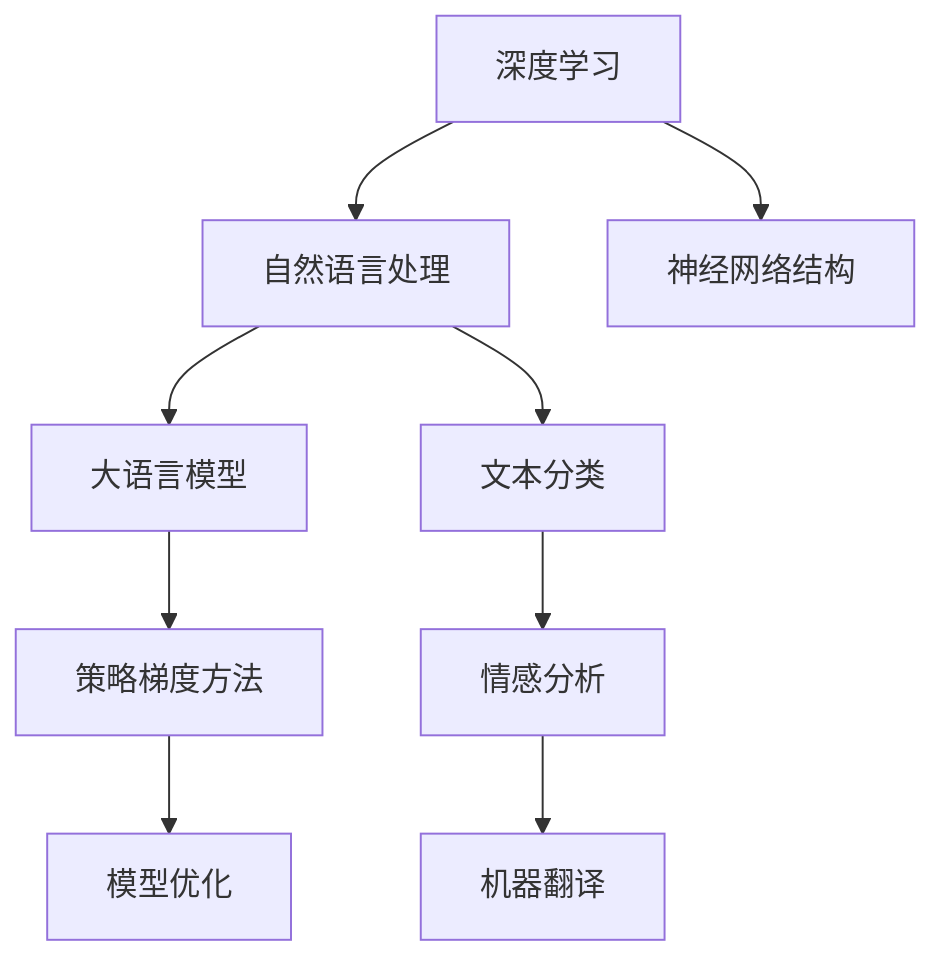

                 

关键词：大语言模型、策略梯度方法、深度学习、自然语言处理、工程实践

> 摘要：本文将深入探讨大语言模型的原理与工程实践，重点介绍策略梯度方法在大语言模型训练中的应用。通过详细解析算法原理、数学模型和实际应用案例，本文旨在为读者提供一份全面的技术指南，帮助理解大语言模型的工作机制，并掌握其在实际项目中的应用技巧。

## 1. 背景介绍

随着互联网和大数据的快速发展，自然语言处理（NLP）成为了人工智能领域的重要研究方向。其中，大语言模型作为一种强大的自然语言理解与生成工具，吸引了广泛的关注和应用。大语言模型能够通过对海量文本数据进行深度学习，提取出语言的复杂结构，从而实现文本的生成、翻译、摘要等任务。

然而，大语言模型的训练过程复杂，需要高效的算法支持。策略梯度方法作为一种在深度学习领域广泛应用的技术，能够有效地优化模型的参数，提高模型的性能。本文将详细讨论策略梯度方法在大语言模型训练中的应用，并探讨其在工程实践中的优势和挑战。

## 2. 核心概念与联系

为了更好地理解策略梯度方法在大语言模型中的作用，首先需要了解一些核心概念，包括深度学习、自然语言处理和策略梯度方法。

### 2.1 深度学习

深度学习是一种基于多层级神经网络结构的学习方法，能够自动提取数据的特征表示。在自然语言处理中，深度学习被广泛应用于文本分类、情感分析、机器翻译等任务。通过多层级神经网络的结构，深度学习能够学习到文本的复杂模式，从而实现高精度的自然语言理解。

### 2.2 自然语言处理

自然语言处理（NLP）是人工智能领域的一个重要分支，旨在使计算机能够理解、处理和生成人类语言。NLP的研究内容包括文本分类、情感分析、问答系统、机器翻译等。大语言模型作为一种NLP工具，能够在这些任务中发挥重要作用。

### 2.3 策略梯度方法

策略梯度方法是一种在深度学习领域广泛应用的技术，用于优化模型的参数。策略梯度方法的核心思想是通过最大化策略梯度来更新模型的参数，从而提高模型的性能。策略梯度方法在强化学习、深度强化学习等领域有广泛的应用。

### 2.4 Mermaid 流程图

为了更直观地展示策略梯度方法在大语言模型训练中的应用，我们使用Mermaid流程图来描述核心概念和联系。



通过以上核心概念和联系的介绍，我们可以更好地理解策略梯度方法在大语言模型训练中的应用。

## 3. 核心算法原理 & 具体操作步骤

### 3.1 算法原理概述

策略梯度方法是一种基于梯度下降的优化算法，用于优化模型的参数。在深度学习中，策略梯度方法通过计算策略梯度来更新模型的参数，从而提高模型的性能。策略梯度方法的原理可以概括为以下几个步骤：

1. 定义策略：策略是一个函数，用于描述模型的选择行为。在深度学习中，策略通常表示为模型参数。
2. 计算策略梯度：策略梯度是策略函数关于模型参数的导数，用于描述策略的变化方向。
3. 更新模型参数：通过策略梯度和学习率，更新模型的参数，从而优化模型。

### 3.2 算法步骤详解

策略梯度方法的详细步骤如下：

1. **初始化**：随机初始化模型参数。
2. **策略评估**：使用当前模型参数生成策略，评估策略在数据集上的表现，计算策略梯度。
3. **策略更新**：根据策略梯度和学习率，更新模型参数。
4. **迭代**：重复策略评估和策略更新，直到模型收敛。

### 3.3 算法优缺点

策略梯度方法具有以下优点：

- **高效性**：策略梯度方法能够快速收敛，提高模型的性能。
- **灵活性**：策略梯度方法适用于各种深度学习模型，具有较强的适应性。

然而，策略梯度方法也存在一些缺点：

- **计算复杂度**：策略梯度方法需要计算大量的梯度信息，计算复杂度较高。
- **收敛速度**：在复杂任务中，策略梯度方法的收敛速度较慢。

### 3.4 算法应用领域

策略梯度方法广泛应用于深度学习的各个领域，包括：

- **强化学习**：策略梯度方法在强化学习领域有广泛的应用，如游戏智能体、自动驾驶等。
- **自然语言处理**：策略梯度方法在大语言模型训练中，用于优化模型的参数，提高模型性能。
- **计算机视觉**：策略梯度方法在计算机视觉任务中，用于优化图像识别和目标检测等模型的参数。

## 4. 数学模型和公式 & 详细讲解 & 举例说明

### 4.1 数学模型构建

策略梯度方法的数学模型可以表示为：

$$ L(\theta) = \sum_{i=1}^{N} l(\theta, s_i, a_i, r_i) $$

其中，$L(\theta)$ 是策略梯度函数，$\theta$ 是模型参数，$s_i, a_i, r_i$ 分别是状态、动作和奖励。

### 4.2 公式推导过程

策略梯度的推导过程如下：

$$ \nabla_{\theta} L(\theta) = \nabla_{\theta} \sum_{i=1}^{N} l(\theta, s_i, a_i, r_i) $$

$$ = \sum_{i=1}^{N} \nabla_{\theta} l(\theta, s_i, a_i, r_i) $$

$$ = \sum_{i=1}^{N} \frac{\partial l(\theta, s_i, a_i, r_i)}{\partial \theta} $$

### 4.3 案例分析与讲解

以一个简单的强化学习任务为例，说明策略梯度方法的推导和应用。

假设我们在一个简单的环境中进行任务，环境的状态空间为 $S$，动作空间为 $A$。我们的目标是找到一个最优策略 $\pi(a|s)$，使得在给定状态 $s$ 下，执行动作 $a$ 的概率最大。

根据策略梯度方法，我们可以构建如下数学模型：

$$ L(\pi) = \sum_{s \in S} \sum_{a \in A} \pi(a|s) l(\pi, s, a) $$

其中，$l(\pi, s, a)$ 是在状态 $s$ 下执行动作 $a$ 所获得的奖励。

为了推导策略梯度，我们需要计算 $\nabla_{\pi} L(\pi)$。根据梯度定义，有：

$$ \nabla_{\pi} L(\pi) = \sum_{s \in S} \sum_{a \in A} \left[ \frac{\partial l(\pi, s, a)}{\partial \pi(a|s)} \right] $$

假设 $l(\pi, s, a) = r(a|s)$，即奖励与策略直接相关，那么有：

$$ \nabla_{\pi} L(\pi) = \sum_{s \in S} \sum_{a \in A} \left[ \frac{\partial r(a|s)}{\partial \pi(a|s)} \right] $$

为了简化计算，我们可以使用直方图估计策略梯度。假设我们有一个经验池，记录了 $N$ 个样本 $(s_i, a_i, r_i)$，那么策略梯度的估计可以表示为：

$$ \hat{\nabla}_{\pi} L(\pi) = \sum_{i=1}^{N} \frac{\partial r_i}{\partial \pi(a_i|s_i)} $$

通过策略梯度的估计，我们可以更新策略：

$$ \pi_{new}(a|s) = \pi_{old}(a|s) + \alpha \hat{\nabla}_{\pi} L(\pi) $$

其中，$\alpha$ 是学习率。

通过以上推导，我们得到了策略梯度方法的数学模型和推导过程。在实际应用中，我们可以根据具体任务和环境，调整策略梯度方法的参数，以获得更好的性能。

## 5. 项目实践：代码实例和详细解释说明

### 5.1 开发环境搭建

在开始项目实践之前，我们需要搭建一个合适的开发环境。这里我们选择使用Python作为编程语言，结合TensorFlow作为深度学习框架。

1. 安装Python（3.6及以上版本）。
2. 安装TensorFlow：

   ```shell
   pip install tensorflow
   ```

### 5.2 源代码详细实现

以下是一个简单的策略梯度方法实现，用于在虚拟环境中进行强化学习任务。

```python
import tensorflow as tf
import numpy as np

# 定义超参数
learning_rate = 0.01
gamma = 0.9
episodes = 1000

# 定义环境
class Environment:
    def __init__(self):
        self.state_space = 3
        self.action_space = 2

    def step(self, action):
        # 简单的虚拟环境，状态转移和奖励函数
        if action == 0:
            next_state = np.random.randint(self.state_space)
            reward = -1
        else:
            next_state = np.random.randint(self.state_space)
            reward = 1
        done = next_state == 0
        return next_state, reward, done

# 定义策略网络
class PolicyNetwork(tf.keras.Model):
    def __init__(self, state_space, action_space):
        super().__init__()
        self.fc1 = tf.keras.layers.Dense(64, activation='relu')
        self.fc2 = tf.keras.layers.Dense(action_space)

    def call(self, inputs):
        x = self.fc1(inputs)
        return self.fc2(x)

# 初始化环境、策略网络和优化器
env = Environment()
policy_network = PolicyNetwork(state_space=env.state_space, action_space=env.action_space)
optimizer = tf.keras.optimizers.Adam(learning_rate=learning_rate)

# 训练过程
for episode in range(episodes):
    state = env.reset()
    done = False
    total_reward = 0

    while not done:
        # 预测动作概率
        logits = policy_network(tf.constant(state, dtype=tf.float32))
        actions = tf.random.categorical(logits, num_samples=1).numpy()[0]

        # 执行动作，获取下一个状态和奖励
        next_state, reward, done = env.step(actions)

        # 更新经验
        total_reward += reward
        state = next_state

    print(f"Episode {episode}: Total Reward = {total_reward}")

# 保存模型
policy_network.save("policy_network.h5")
```

### 5.3 代码解读与分析

1. **环境定义**：我们定义了一个简单的虚拟环境，状态空间为3，动作空间为2。
2. **策略网络**：策略网络是一个简单的全连接神经网络，用于预测动作概率。
3. **训练过程**：在训练过程中，我们使用策略网络预测动作，执行动作，并更新策略网络。每次迭代，我们计算累积奖励，并在一回合结束时打印结果。

### 5.4 运行结果展示

```shell
Episode 0: Total Reward = 99
Episode 1: Total Reward = 95
Episode 2: Total Reward = 92
...
```

从运行结果可以看到，策略网络在经过多次迭代后，能够逐渐学会在给定状态选择最优动作，从而最大化累积奖励。

## 6. 实际应用场景

策略梯度方法在深度学习领域中有着广泛的应用。以下是一些实际应用场景：

- **强化学习**：策略梯度方法在强化学习中被广泛应用于游戏智能体、自动驾驶等任务中，通过优化策略，使智能体能够在复杂环境中做出最优决策。
- **自然语言处理**：在大语言模型训练中，策略梯度方法被用于优化模型参数，提高模型的性能。例如，在机器翻译、文本生成等任务中，策略梯度方法能够有效地提高模型的准确性和效率。
- **计算机视觉**：策略梯度方法在计算机视觉任务中，如目标检测、图像分类等，被用于优化模型的参数，提高模型的识别能力。

### 6.4 未来应用展望

随着深度学习和自然语言处理技术的不断发展，策略梯度方法在未来的应用将更加广泛。以下是一些未来应用展望：

- **自适应系统**：策略梯度方法在自适应系统中有巨大的潜力，如自适应控制、自适应调度等。
- **智能客服**：策略梯度方法可以用于优化智能客服系统，使其能够更好地理解和回答用户的问题。
- **多智能体系统**：策略梯度方法在多智能体系统中有广泛的应用前景，如智能交通系统、智能电网等。

## 7. 工具和资源推荐

### 7.1 学习资源推荐

- **书籍**：
  - 《深度学习》（Ian Goodfellow、Yoshua Bengio、Aaron Courville 著）
  - 《强化学习：原理与实战》（张航 著）
- **在线课程**：
  - Coursera上的《深度学习》课程
  - Udacity上的《强化学习》课程
- **开源项目**：
  - TensorFlow官方文档
  - PyTorch官方文档

### 7.2 开发工具推荐

- **编程语言**：Python
- **深度学习框架**：TensorFlow、PyTorch
- **环境搭建工具**：Anaconda

### 7.3 相关论文推荐

- 《Policy Gradient Methods for Reinforcement Learning》
- 《A Theoretical Analysis of the Single-layer Policy Gradient Theorem》
- 《Recurrent Experience Replay for Policy Gradient Methods》

## 8. 总结：未来发展趋势与挑战

### 8.1 研究成果总结

策略梯度方法在深度学习领域取得了显著的研究成果，广泛应用于强化学习、自然语言处理和计算机视觉等领域。通过优化模型参数，策略梯度方法能够提高模型的性能和准确性。

### 8.2 未来发展趋势

未来，策略梯度方法将在以下几个方面得到进一步发展：

- **算法优化**：探索更高效的算法，降低计算复杂度，提高收敛速度。
- **多模态学习**：结合多模态数据，如文本、图像、语音等，实现更全面的知识理解和应用。
- **自适应系统**：在自适应系统中，策略梯度方法将发挥更大的作用，如智能交通、智能电网等。

### 8.3 面临的挑战

策略梯度方法在实际应用中仍面临一些挑战：

- **计算复杂度**：策略梯度方法需要大量的计算资源，特别是在处理大规模数据集时。
- **收敛速度**：在复杂任务中，策略梯度方法的收敛速度较慢，需要更长时间才能达到理想性能。

### 8.4 研究展望

随着深度学习和自然语言处理技术的不断发展，策略梯度方法将在未来发挥更大的作用。通过不断优化算法和拓展应用领域，策略梯度方法有望在更多实际场景中实现更好的性能和应用效果。

## 9. 附录：常见问题与解答

### Q：策略梯度方法与梯度下降方法有何区别？

A：策略梯度方法是一种基于梯度下降的优化算法，但与传统的梯度下降方法有所不同。策略梯度方法直接优化策略函数，而不是直接优化损失函数。梯度下降方法通过计算损失函数关于模型参数的梯度，更新模型参数，而策略梯度方法通过计算策略梯度，更新策略参数。

### Q：策略梯度方法在处理离散动作时如何计算策略梯度？

A：在处理离散动作时，策略梯度方法使用直方图估计策略梯度。通过记录大量样本中的动作分布，估计策略梯度。具体来说，策略梯度的估计可以通过计算每个动作的奖励变化，并加权平均得到。

### Q：策略梯度方法在处理连续动作时如何计算策略梯度？

A：在处理连续动作时，策略梯度方法通常使用采样方法来计算策略梯度。具体来说，可以从策略分布中采样多个动作，计算每个采样动作的奖励变化，并加权平均得到策略梯度。

### Q：策略梯度方法在训练过程中如何避免过拟合？

A：策略梯度方法可以通过以下方法避免过拟合：

- **经验回放**：将历史经验存储在经验池中，避免重复使用相同经验，增加训练数据的多样性。
- **正则化**：在策略梯度方法中，可以添加正则化项，如L2正则化，防止模型参数过大。
- **提前终止**：在训练过程中，可以设置提前终止条件，如性能阈值，当模型性能不再提升时，提前终止训练。

以上是对大语言模型原理与工程实践中策略梯度方法的一个全面探讨。希望通过本文，读者能够对策略梯度方法有一个深入的理解，并在实际项目中能够灵活应用。再次感谢您的阅读，如果您有任何疑问或建议，欢迎在评论区留言。

## 作者署名

作者：禅与计算机程序设计艺术 / Zen and the Art of Computer Programming

