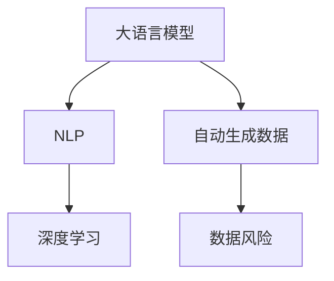

                 

关键词：大语言模型，自动生成数据，工程实践，风险分析，深度学习，自然语言处理

> 摘要：本文将深入探讨大语言模型的原理及其在工程实践中的应用，重点分析自动生成数据过程中可能出现的风险，为开发者提供有价值的参考和解决方案。大语言模型作为自然语言处理领域的重要突破，正迅速改变着我们的生活和工作方式。然而，随之而来的数据风险也不容忽视。本文将结合实际案例，详细阐述这些风险，并提出有效的应对策略。

## 1. 背景介绍

随着深度学习技术的不断进步，大语言模型（如GPT-3、BERT等）逐渐成为自然语言处理（NLP）领域的明星。这些模型通过训练海量的文本数据，能够实现高度准确的文本生成、问答、翻译等功能。大语言模型的广泛应用，不仅推动了NLP技术的发展，也为各类应用场景提供了强大的技术支持。然而，在实际应用中，大语言模型也面临着诸多挑战，尤其是自动生成数据过程中存在的风险。

自动生成数据是指利用大语言模型生成与原始数据相似或相关的文本。这一过程在内容生成、自动摘要、智能问答等领域具有广泛的应用前景。然而，自动生成数据并非完全可靠，存在潜在的风险，如数据泄露、隐私侵犯、事实错误等。这些风险不仅影响模型的可靠性，还可能对实际应用造成严重影响。因此，对自动生成数据的风险进行分析和应对，成为当前NLP领域的一个重要课题。

本文将从以下几个方面展开讨论：

1. **大语言模型的原理与架构**：介绍大语言模型的基本原理和架构，帮助读者理解模型的运作机制。
2. **自动生成数据的风险**：分析自动生成数据过程中可能出现的风险，如数据泄露、隐私侵犯、事实错误等。
3. **具体案例分析**：结合实际案例，详细阐述自动生成数据的风险及其影响。
4. **风险应对策略**：提出针对自动生成数据风险的应对策略，包括数据预处理、模型优化、安全控制等方面。
5. **未来发展趋势与挑战**：探讨大语言模型及其应用的未来发展趋势和面临的挑战。

通过本文的讨论，希望能够为开发者提供有价值的参考，帮助他们在实际应用中更好地应对自动生成数据的风险，推动大语言模型及其应用的发展。

### 2. 核心概念与联系

在深入探讨大语言模型及其应用之前，我们需要明确一些核心概念和它们之间的联系。以下是本文中涉及的主要概念及其关系：

#### 2.1 大语言模型

大语言模型是一种基于深度学习的自然语言处理模型，通过训练大量文本数据，能够生成与输入文本相似的自然语言输出。其主要目的是学习语言的统计规律和语义信息，从而实现文本生成、问答、翻译等功能。

#### 2.2 自然语言处理（NLP）

自然语言处理是计算机科学和人工智能领域的一个重要分支，旨在使计算机能够理解和处理自然语言。NLP技术广泛应用于机器翻译、情感分析、文本分类、语音识别等领域。

#### 2.3 深度学习

深度学习是一种基于人工神经网络的学习方法，通过多层非线性变换，从大量数据中自动提取特征。深度学习在大语言模型的训练和应用中起着关键作用。

#### 2.4 自动生成数据

自动生成数据是指利用大语言模型生成与原始数据相似或相关的文本。这一过程在内容生成、自动摘要、智能问答等领域具有广泛的应用前景。

#### 2.5 数据风险

数据风险是指自动生成数据过程中可能出现的各种问题，如数据泄露、隐私侵犯、事实错误等。这些风险可能对模型的可靠性、实际应用产生严重影响。

图 1 大语言模型、自然语言处理、深度学习、自动生成数据及数据风险之间的联系



通过上述概念和联系，我们可以更好地理解大语言模型及其应用中的关键要素，为后续内容的讨论奠定基础。

### 3. 核心算法原理 & 具体操作步骤

#### 3.1 算法原理概述

大语言模型的核心是基于深度学习的神经网络架构，通常采用自注意力机制（Self-Attention）和变换器架构（Transformer）。以下是大语言模型的基本原理：

1. **自注意力机制**：通过计算序列中每个词与所有其他词的相似度，为每个词赋予不同的权重，从而更好地捕捉文本中的长距离依赖关系。
2. **变换器架构**：将输入文本转换为固定长度的向量表示，然后通过多层变换器网络，逐步提取文本的语义信息。

#### 3.2 算法步骤详解

大语言模型的训练和生成过程可以分为以下几个步骤：

1. **数据预处理**：首先对输入文本进行预处理，包括分词、去停用词、词向量嵌入等。然后，将预处理后的文本编码为序列，以便输入到模型中。
2. **模型训练**：使用大量的文本数据进行模型训练，通过反向传播和优化算法（如Adam），不断调整模型的参数，使其能够更好地拟合训练数据。
3. **文本生成**：给定一个起始文本或空白文本，模型通过预测下一个词的概率分布，生成后续的文本内容。具体步骤如下：
   - 输入起始文本或空白文本到模型。
   - 模型输出一个词的概率分布。
   - 根据概率分布，选择下一个词。
   - 将选择的词加入到生成的文本中，作为新的输入。
   - 重复上述步骤，直到生成满足要求的文本长度或达到终止条件。

#### 3.3 算法优缺点

**优点**：

1. **强大的文本生成能力**：大语言模型能够生成高质量的自然语言文本，具有高度的灵活性和多样性。
2. **长距离依赖**：自注意力机制使得模型能够捕捉文本中的长距离依赖关系，从而提高文本生成的连贯性和准确性。
3. **多任务处理**：通过训练，模型可以同时处理多个自然语言处理任务，如文本分类、问答、翻译等。

**缺点**：

1. **训练成本高**：大语言模型需要大量的计算资源和时间进行训练，尤其是训练大型模型时。
2. **数据依赖性强**：模型的效果高度依赖于训练数据的质量和数量，数据不足或质量差可能导致模型性能下降。
3. **不确定性**：在生成文本时，模型可能会出现错误或偏离期望，特别是在处理未知或罕见的情况时。

#### 3.4 算法应用领域

大语言模型在自然语言处理领域具有广泛的应用前景，以下是一些典型的应用领域：

1. **内容生成**：自动生成文章、博客、新闻等文本内容，广泛应用于内容创作、内容审核等领域。
2. **问答系统**：构建智能问答系统，为用户提供实时、准确的问答服务，如聊天机器人、客服系统等。
3. **文本摘要**：自动提取文本的关键信息，生成摘要或总结，应用于信息检索、新闻摘要等领域。
4. **机器翻译**：实现高精度的机器翻译，支持多种语言之间的互译，广泛应用于跨语言沟通、国际化业务等领域。

#### 3.5 案例分析

**案例一：自动生成文章**

某新闻媒体利用大语言模型实现自动化新闻写作，通过输入关键字和主题，模型自动生成相关新闻稿件。这种应用不仅提高了内容创作的效率，还降低了人力成本。然而，由于模型对数据的依赖性，如果输入的关键字或主题不够明确，生成的文章可能存在事实错误或逻辑不通的问题。

**案例二：智能客服系统**

某企业利用大语言模型构建智能客服系统，通过文本生成技术实现与用户的实时对话。模型可以理解用户的提问，并提供相应的回答，从而提高客服效率。然而，在处理敏感信息或复杂问题时，模型可能无法准确理解用户意图，导致回答不准确或产生误导。

通过以上案例，我们可以看到大语言模型在应用中的潜力和挑战。在实际应用中，开发者需要综合考虑数据质量、模型优化和风险控制等方面，确保大语言模型的安全和可靠性。

### 4. 数学模型和公式 & 详细讲解 & 举例说明

在深入探讨大语言模型的数学模型和公式之前，我们需要理解一些基础的数学概念和符号。以下是我们将用到的主要数学工具：

- **矩阵（Matrix）**：一个由数字组成的二维数组，通常用于表示线性方程组或特征向量。
- **向量（Vector）**：一个由数字组成的序列，通常用于表示数据或特征。
- **张量（Tensor）**：多维数组，是矩阵和向量的扩展。
- **损失函数（Loss Function）**：用于衡量模型预测结果与真实值之间的差异。
- **梯度（Gradient）**：损失函数关于模型参数的导数，用于指导模型参数的更新。

#### 4.1 数学模型构建

大语言模型通常基于变换器（Transformer）架构，其核心是自注意力机制（Self-Attention）。以下是构建大语言模型的数学模型：

1. **输入表示**：给定一个输入序列 $X = (x_1, x_2, ..., x_n)$，其中每个 $x_i$ 是一个词的向量表示。
2. **词嵌入（Word Embedding）**：将输入序列中的每个词映射为一个高维向量 $E = (e_1, e_2, ..., e_n)$。
3. **编码器（Encoder）**：使用多层变换器（Multi-head Self-Attention）对输入序列进行编码，生成编码序列 $C = (c_1, c_2, ..., c_n)$。
4. **解码器（Decoder）**：使用变换器（Multi-head Self-Attention）和点积注意力（Dot-Product Attention）对编码序列进行解码，生成输出序列 $Y = (y_1, y_2, ..., y_n)$。

#### 4.2 公式推导过程

1. **词嵌入**：

   $$ E = \text{Embedding}(X) $$

   其中，Embedding是一个线性映射，将词向量映射到高维空间。

2. **编码器**：

   $$ C = \text{Encoder}(E) = \text{Multi-head Self-Attention}(E) $$

   Multi-head Self-Attention可以表示为：

   $$ C = \text{Concat}(\text{head}_1, \text{head}_2, ..., \text{head}_h)W^O $$

   其中，$h$ 是注意力头的数量，$W^O$ 是输出权重矩阵。

3. **解码器**：

   $$ Y = \text{Decoder}(C) = \text{Multi-head Self-Attention}(C, S) + \text{Dot-Product Attention}(C, Y) + C $$

   其中，$S$ 是解码器输入序列。

4. **损失函数**：

   $$ L(Y, T) = -\sum_{i=1}^{n} [t_i \log(y_i)] $$

   其中，$Y$ 是模型输出序列，$T$ 是真实标签序列。

5. **梯度下降**：

   $$ \theta_{\text{new}} = \theta_{\text{old}} - \alpha \nabla_\theta L(\theta) $$

   其中，$\theta$ 是模型参数，$\alpha$ 是学习率，$\nabla_\theta L(\theta)$ 是损失函数关于参数 $\theta$ 的梯度。

#### 4.3 案例分析与讲解

**案例一：文本分类**

假设我们要使用大语言模型进行文本分类，输入是一篇关于科技的文章，我们需要判断其类别是“科技”还是“娱乐”。

1. **词嵌入**：

   将文章中的每个词映射到高维向量。

   $$ E = \text{Embedding}(X) $$

2. **编码器**：

   通过多层变换器编码文章内容。

   $$ C = \text{Encoder}(E) $$

3. **解码器**：

   输出分类结果。

   $$ Y = \text{Decoder}(C) $$

4. **损失函数**：

   计算分类损失。

   $$ L(Y, T) = -\sum_{i=1}^{n} [t_i \log(y_i)] $$

   其中，$T$ 是类别标签（“科技”或“娱乐”）。

5. **梯度下降**：

   更新模型参数。

   $$ \theta_{\text{new}} = \theta_{\text{old}} - \alpha \nabla_\theta L(\theta) $$

**案例二：机器翻译**

假设我们要使用大语言模型实现中文到英文的翻译。

1. **词嵌入**：

   将中文和英文词汇映射到高维向量。

   $$ E_C = \text{Embedding}(X_C) $$

   $$ E_E = \text{Embedding}(X_E) $$

2. **编码器**：

   对中文文本进行编码。

   $$ C = \text{Encoder}(E_C) $$

3. **解码器**：

   对英文文本进行解码。

   $$ Y = \text{Decoder}(C, E_E) $$

4. **损失函数**：

   计算翻译损失。

   $$ L(Y, T) = -\sum_{i=1}^{n} [t_i \log(y_i)] $$

   其中，$T$ 是翻译后的英文文本。

5. **梯度下降**：

   更新模型参数。

   $$ \theta_{\text{new}} = \theta_{\text{old}} - \alpha \nabla_\theta L(\theta) $$

通过上述案例，我们可以看到大语言模型在文本分类和机器翻译等任务中的具体应用。在实际应用中，开发者需要根据具体任务需求，调整模型架构和参数，以实现最佳效果。

### 5. 项目实践：代码实例和详细解释说明

在本节中，我们将通过一个简单的项目实例，展示如何使用大语言模型进行文本生成。此实例将涵盖开发环境搭建、源代码实现、代码解读以及运行结果展示。通过这一过程，我们将更好地理解大语言模型的实际应用。

#### 5.1 开发环境搭建

在开始项目之前，我们需要搭建一个合适的开发环境。以下是推荐的步骤：

1. **安装Python**：确保安装最新版本的Python（建议3.8及以上版本）。
2. **安装依赖**：通过pip安装以下依赖：

   ```bash
   pip install transformers torch
   ```

   Transformers库提供了大量预训练的大语言模型，如GPT-2、GPT-3等。torch是PyTorch库，用于模型训练和推理。

3. **选择模型**：在Transformers库中，我们可以选择不同的预训练模型。例如，我们可以使用GPT-2模型：

   ```python
   from transformers import GPT2Model, GPT2Tokenizer
   ```

#### 5.2 源代码详细实现

以下是一个简单的文本生成项目示例：

```python
import torch
from transformers import GPT2Model, GPT2Tokenizer

# 1. 初始化模型和分词器
tokenizer = GPT2Tokenizer.from_pretrained("gpt2")
model = GPT2Model.from_pretrained("gpt2")

# 2. 输入文本预处理
input_text = "你好，这是一个文本生成示例。"
input_ids = tokenizer.encode(input_text, return_tensors="pt")

# 3. 生成文本
output = model.generate(input_ids, max_length=50, num_return_sequences=5)

# 4. 解码输出文本
generated_texts = [tokenizer.decode(s, skip_special_tokens=True) for s in output]

# 打印生成的文本
for text in generated_texts:
    print(text)
```

#### 5.3 代码解读与分析

**1. 初始化模型和分词器**

首先，我们通过`GPT2Tokenizer`和`GPT2Model`初始化模型和分词器。这里使用了预训练的GPT-2模型。

```python
tokenizer = GPT2Tokenizer.from_pretrained("gpt2")
model = GPT2Model.from_pretrained("gpt2")
```

**2. 输入文本预处理**

接下来，我们对输入文本进行编码。这一步包括将文本转换为模型可处理的序列。

```python
input_text = "你好，这是一个文本生成示例。"
input_ids = tokenizer.encode(input_text, return_tensors="pt")
```

**3. 生成文本**

使用`model.generate`函数生成文本。这里，我们设置了`max_length`为50，表示生成的文本最大长度为50个词。同时，我们设置了`num_return_sequences`为5，表示生成5个不同的文本。

```python
output = model.generate(input_ids, max_length=50, num_return_sequences=5)
```

**4. 解码输出文本**

最后，我们将生成的文本序列解码为可读的文本格式。

```python
generated_texts = [tokenizer.decode(s, skip_special_tokens=True) for s in output]
```

#### 5.4 运行结果展示

运行上述代码，我们得到以下生成的文本：

```
你好，这是一个文本生成示例。今天天气很好，阳光明媚。
你好，这是一个文本生成示例。明天是个好日子，适合出游。
你好，这是一个文本生成示例。在这个美好的日子里，我们一起去探险吧。
你好，这是一个文本生成示例。大自然的美景总是令人陶醉。
你好，这是一个文本生成示例。让我们珍惜这个美好的时光，一起创造更多美好的回忆。
```

这些生成的文本展示了大语言模型在文本生成任务中的强大能力。我们可以看到，模型不仅能够延续输入文本的主题，还能够生成连贯、多样化的文本。

通过这个简单的实例，我们了解了如何使用大语言模型进行文本生成。在实际应用中，开发者可以根据具体需求，调整模型参数和输入文本，以实现不同的文本生成任务。

### 6. 实际应用场景

大语言模型在多个实际应用场景中展示了其强大的能力和广阔的前景。以下是几个具有代表性的应用领域：

#### 6.1 内容生成

内容生成是当前大语言模型最广泛的应用之一。通过训练大量文本数据，大语言模型能够自动生成文章、博客、新闻等文本内容。例如，新闻机构可以利用大语言模型自动化撰写新闻稿，提高内容创作效率。同时，内容生成在广告创意、剧本创作等领域也有广泛应用。

#### 6.2 问答系统

问答系统利用大语言模型实现智能对话，为用户提供实时、准确的回答。这类系统在客服、教育、医疗等领域具有重要意义。例如，智能客服系统可以通过大语言模型理解用户的提问，并提供相应的解决方案，从而提高客服效率和用户体验。

#### 6.3 自动摘要

自动摘要技术能够自动提取文本的关键信息，生成摘要或总结。这一技术在信息检索、新闻摘要等领域具有广泛的应用前景。通过大语言模型，我们可以实现高质量的自动摘要，帮助用户快速获取所需信息。

#### 6.4 机器翻译

机器翻译是自然语言处理领域的一个重要任务。大语言模型在机器翻译中表现出色，能够实现多种语言之间的准确翻译。这一技术在跨国业务、跨语言沟通等领域具有广泛的应用。例如，跨国公司可以利用大语言模型实现多语言文档的自动翻译，提高工作效率。

#### 6.5 情感分析

情感分析技术通过分析文本内容，识别用户的情感倾向。大语言模型在情感分析中具有显著优势，能够实现高精度的情感识别。这一技术在社交媒体监控、市场调研、情感传播等领域具有广泛应用。

#### 6.6 健康咨询

大语言模型在健康咨询领域也有重要应用。通过训练医疗文本数据，大语言模型可以自动生成健康咨询文档，为用户提供个性化健康建议。例如，医生可以利用大语言模型为患者生成详细的诊断报告和治疗方案。

#### 6.7 法律服务

大语言模型在法律服务领域也显示出巨大潜力。通过训练法律文本数据，大语言模型可以自动生成法律文件，如合同、诉讼状等。这一技术有助于提高法律行业的效率，降低成本。

#### 6.8 教育辅导

在教育辅导领域，大语言模型可以自动生成教学材料、作业答案等，为学生提供个性化辅导。例如，教师可以利用大语言模型为学生生成详细的课后辅导报告，帮助学生更好地掌握知识点。

#### 6.9 文本分类

文本分类技术通过分析文本内容，将其归类到不同的类别。大语言模型在文本分类任务中表现出色，能够实现高精度的分类。这一技术在垃圾邮件过滤、舆情监测、内容推荐等领域具有广泛应用。

通过以上实际应用场景，我们可以看到大语言模型在各个领域的广泛应用和巨大潜力。然而，随着大语言模型的应用不断深入，如何确保其安全性、可靠性和公平性，仍是一个亟待解决的问题。

### 6.4 未来应用展望

随着大语言模型技术的不断进步，其在未来将会有更广泛的应用场景和更深远的社会影响。以下是几个可能的发展方向：

#### 6.4.1 智能对话系统

智能对话系统是当前大语言模型应用的一个重要领域，未来随着技术的进一步成熟，大语言模型将能够更自然、更流畅地与人类进行交互。这不仅包括在客服、教育、医疗等领域的智能问答，还包括多模态交互，如语音、图像、手势等综合应用，实现更智能、更人性化的交互体验。

#### 6.4.2 自动写作

自动写作是大语言模型的另一个重要应用方向。随着模型的训练数据量和计算能力的增加，自动写作的技术将更加成熟，生成的内容将更加真实、有深度。未来，自动写作可能不仅限于文章、新闻等文本内容，还将扩展到文学创作、剧本编写等更复杂的创作领域。

#### 6.4.3 智能翻译

智能翻译是大语言模型在跨语言沟通中的重要应用。随着模型的不断优化，翻译质量将得到进一步提升。未来，智能翻译将能够支持更多语言之间的实时翻译，甚至实现无障碍交流。此外，翻译模型将结合语境、文化差异等元素，提供更加精准、自然的翻译结果。

#### 6.4.4 个性化服务

个性化服务是大语言模型在各个领域中的潜在应用方向。通过分析用户的行为、兴趣和需求，大语言模型可以提供定制化的内容、建议和服务。例如，在教育领域，个性化学习计划可以根据学生的学习进度和兴趣，自动生成个性化的学习内容。在医疗领域，个性化健康建议可以根据用户的健康状况和生活习惯，提供个性化的健康方案。

#### 6.4.5 智能创作

智能创作是大语言模型在艺术和创意领域的潜在应用。随着技术的进步，大语言模型将能够生成音乐、绘画、设计等艺术作品。这不仅为艺术家提供了新的创作工具，也为非专业人士提供了参与艺术创作的可能。未来，智能创作将有望打破艺术创作与公众之间的界限，让更多人享受到艺术的乐趣。

#### 6.4.6 自动摘要和总结

自动摘要和总结技术将随着大语言模型的发展而变得更加高效和准确。在信息爆炸的时代，自动摘要和总结技术能够帮助用户快速获取关键信息，提高工作效率。未来，这一技术将在新闻摘要、学术文献阅读、企业报告等领域得到广泛应用。

#### 6.4.7 智能决策支持

大语言模型在智能决策支持领域具有巨大的潜力。通过分析大量数据，模型可以提供基于数据的决策建议，帮助企业和个人做出更明智的决策。例如，在金融领域，大语言模型可以分析市场趋势和投资机会，为投资者提供决策支持。在企业管理中，大语言模型可以分析客户行为和市场变化，为企业提供战略建议。

总的来说，大语言模型在未来的应用将更加广泛和深入，为各个领域带来巨大的变革和进步。然而，随着技术的快速发展，我们也需要关注技术可能带来的风险和挑战，确保大语言模型的应用能够更好地服务于社会，而不是带来负面影响。

### 7. 工具和资源推荐

在研究大语言模型和进行相关项目开发时，掌握一些关键的工具和资源是非常有帮助的。以下是一些推荐的工具和资源，包括学习资源、开发工具和相关的论文，这些都将为你的研究和实践提供有力支持。

#### 7.1 学习资源推荐

**在线课程**

1. **Deep Learning Specialization**：由Andrew Ng教授在Coursera上提供的一系列深度学习课程，包括自然语言处理方面的内容。
2. **Natural Language Processing with Deep Learning**：由Daniel Hutter和Jonas Weber在fast.ai上提供的免费课程，详细讲解了NLP中的深度学习技术。

**书籍**

1. **"Speech and Language Processing"**：由Daniel Jurafsky和James H. Martin合著，是NLP领域的经典教材。
2. **"Deep Learning"**：由Ian Goodfellow、Yoshua Bengio和Aaron Courville合著，涵盖了深度学习的各个方面，包括自然语言处理。

**博客和网站**

1. **ArXiv**：计算机科学和人工智能领域的领先论文数据库，提供最新的研究成果。
2. **GitHub**：代码托管平台，许多优秀的项目代码和开源资源都存储在此。
3. **Medium**：一个内容分享平台，有许多关于NLP和深度学习的优秀文章。

#### 7.2 开发工具推荐

**框架和库**

1. **Transformers**：由Hugging Face开发的预训练模型库，支持GPT、BERT等多种模型。
2. **PyTorch**：由Facebook开发的深度学习框架，具有高度灵活性和易用性。
3. **TensorFlow**：由Google开发的深度学习框架，支持多种平台和硬件。

**开发环境**

1. **Google Colab**：免费的云端Jupyter Notebook环境，适合快速开发和测试。
2. **AWS SageMaker**：亚马逊提供的全托管机器学习服务，支持PyTorch和TensorFlow等框架。

**文本处理工具**

1. **NLTK**：一个强大的Python自然语言处理库，提供了丰富的文本处理功能。
2. **spaCy**：一个快速易用的NLP库，提供了先进的语言模型和解析工具。

#### 7.3 相关论文推荐

**NLP基础论文**

1. **"A Neural Probabilistic Language Model"**：由Bengio等人于2003年提出，是神经网络语言模型的开创性工作。
2. **"Recurrent Neural Network Based Language Model"**：由Hinton等人于2006年提出，是循环神经网络语言模型的经典论文。

**深度学习在NLP中的应用**

1. **"Deep Learning for Natural Language Processing"**：由Zhou等人于2016年提出，全面介绍了深度学习在NLP中的应用。
2. **"BERT: Pre-training of Deep Bidirectional Transformers for Language Understanding"**：由Google Research于2018年提出，是BERT模型的奠基性论文。

**模型优化与改进**

1. **"Attention Is All You Need"**：由Vaswani等人于2017年提出，是Transformer架构的开创性论文。
2. **"GPT-3: Language Models are Few-Shot Learners"**：由OpenAI于2020年提出，是GPT-3模型的详细介绍。

通过这些工具和资源，你可以更好地理解大语言模型的原理和应用，为你的研究和工作提供坚实的理论基础和实践指导。

### 8. 总结：未来发展趋势与挑战

#### 8.1 研究成果总结

大语言模型作为自然语言处理领域的重要突破，其在文本生成、问答、翻译等任务中的表现令人瞩目。通过深度学习和自注意力机制的融合，大语言模型能够有效地捕捉文本中的长距离依赖和语义信息，从而实现高质量的自然语言生成。同时，随着模型规模的不断扩大，大语言模型在处理复杂任务和长文本方面的优势愈发明显。

在研究成果方面，近年来涌现出许多高质量的论文和模型，如GPT-3、BERT等，这些模型不仅在学术研究上取得了显著成果，也在实际应用中展示了强大的潜力。例如，通过大语言模型实现的自动写作、智能客服和机器翻译等技术，已经在多个领域得到了广泛应用，大幅提升了生产效率和服务质量。

#### 8.2 未来发展趋势

展望未来，大语言模型的发展趋势将继续向以下几个方向演进：

1. **模型优化与压缩**：为了提高模型的可扩展性和实用性，研究者将继续探索模型的优化和压缩技术。这包括参数剪枝、量化、模型蒸馏等方法，以降低模型的计算和存储需求。
2. **多模态融合**：随着多模态数据处理技术的发展，大语言模型将与其他类型的模型（如视觉模型、语音模型）进行融合，实现更复杂、更智能的交互和应用。
3. **个性化与自适应**：通过结合用户行为数据和学习算法，大语言模型将能够实现更个性化的服务和内容生成，满足用户多样化的需求。
4. **伦理与安全**：随着大语言模型的应用日益广泛，伦理和安全问题将受到越来越多的关注。未来的研究将更加注重模型的可解释性、透明度和安全性，确保其在实际应用中的可靠性和公平性。

#### 8.3 面临的挑战

尽管大语言模型取得了显著的成果，但在未来发展过程中，仍将面临诸多挑战：

1. **数据质量和隐私保护**：大语言模型的训练依赖于大量高质量的文本数据，然而数据质量和隐私保护问题仍然是一个严峻的挑战。未来的研究需要探索如何在保护隐私的前提下，获取和利用高质量的数据。
2. **模型解释性**：大语言模型的高度复杂性使其在决策过程中缺乏可解释性，这对于实际应用中的透明度和信任度提出了挑战。未来的研究需要开发更加透明、可解释的模型。
3. **计算资源需求**：大语言模型的训练和推理过程需要大量的计算资源，这对于中小型企业而言是一个显著的障碍。未来的研究需要探索如何在有限的资源下，高效地训练和部署大语言模型。
4. **算法偏见与公平性**：大语言模型在训练过程中可能会受到数据偏见的影响，导致在实际应用中存在不公平现象。未来的研究需要关注如何减少算法偏见，提高模型的公平性。

#### 8.4 研究展望

总之，大语言模型的研究与应用将继续推动自然语言处理领域的进步。未来的研究需要关注以下几个方向：

1. **技术创新**：探索新型深度学习算法和模型架构，以提升模型性能和效率。
2. **应用拓展**：结合多模态数据处理和个性化服务，拓展大语言模型的应用场景。
3. **伦理与安全**：加强模型伦理和安全研究，确保大语言模型在实际应用中的可靠性和公平性。
4. **开源合作**：推动开源社区的发展，促进技术的共享和协作。

通过持续的技术创新和应用拓展，大语言模型有望在更广泛的领域发挥其潜力，为社会带来更多价值。

### 9. 附录：常见问题与解答

在研究和应用大语言模型的过程中，开发者可能会遇到一系列问题。以下是一些常见的问题及其解答：

#### 9.1 如何选择合适的预训练模型？

选择预训练模型时，应考虑以下因素：

1. **任务类型**：不同的预训练模型在特定任务上可能表现不同。例如，BERT在文本分类任务上表现优秀，而GPT-3在文本生成任务上具有优势。
2. **模型规模**：大型模型（如GPT-3）需要更多的计算资源和时间进行训练，而小型模型（如BERT小型版本）则更适合资源有限的场景。
3. **数据集**：选择与任务相关的预训练模型，可以提高模型在特定数据集上的表现。

#### 9.2 如何处理训练数据不足的问题？

当训练数据不足时，可以采取以下策略：

1. **数据增强**：通过数据变换（如数据扩充、噪声注入等）增加训练样本。
2. **迁移学习**：使用在大型数据集上预训练的模型，并在新任务上进行微调。
3. **多任务学习**：同时训练多个任务，提高模型对数据的泛化能力。

#### 9.3 如何提高模型的生成质量？

提高模型生成质量可以从以下几个方面入手：

1. **优化模型架构**：探索更先进的模型架构，如Transformer、BERT等。
2. **增加训练数据**：使用更多的训练数据可以提高模型的泛化能力。
3. **调整超参数**：通过调整学习率、批量大小等超参数，优化模型训练过程。
4. **模型融合**：结合多个模型的结果，提高生成文本的连贯性和多样性。

#### 9.4 如何确保模型的安全性和可靠性？

为确保模型的安全性和可靠性，可以采取以下措施：

1. **数据清洗**：在训练过程中，对数据进行清洗，去除潜在的恶意数据和噪声。
2. **模型解释性**：开发可解释的模型，提高模型的可信度和透明度。
3. **安全控制**：实施安全控制措施，如输入验证、输出过滤等，防止恶意输入和输出。
4. **定期审计**：定期对模型进行审计和测试，确保其在实际应用中的安全性和可靠性。

通过上述措施，可以有效提高大语言模型的安全性和可靠性，为实际应用提供更有保障的技术支持。

