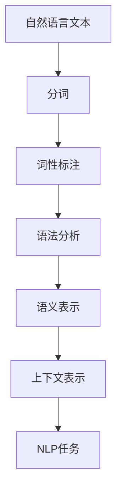

                 

关键词：大语言模型、自然语言处理、语言表示、神经网络、深度学习、工程实践、语义理解、文本生成、推理能力、机器学习算法

> 摘要：本文深入探讨了大规模语言模型的原理与工程实践，重点关注语言表示的方法和技巧。通过详细解析语言表示的核心概念、数学模型、算法原理及其应用，我们旨在为读者提供一套全面、系统、易懂的语言表示技术指南。

## 1. 背景介绍

近年来，自然语言处理（NLP）领域取得了飞速的发展，尤其是大语言模型的应用。这些模型在文本生成、语义理解、机器翻译等任务上展现出了惊人的性能。然而，要实现这些卓越表现，必须依赖高效的**语言表示**技术。

语言表示是NLP的基础，它将自然语言文本转换成计算机能够理解和处理的形式。这一过程中涉及到大量的语言学、计算机科学和数学知识。本文将详细介绍语言表示的各个方面，帮助读者深入理解这一关键技术。

## 2. 核心概念与联系

### 2.1 语言表示的定义

语言表示是将自然语言文本映射到结构化数据的过程。这种映射使得计算机能够理解和处理文本，从而实现各种NLP任务。

### 2.2 语言表示的关键要素

- **语义表示**：捕获文本的语义信息，如词义、句子含义等。
- **语法表示**：描述文本的结构和组织方式，如词法、句法等。
- **上下文表示**：反映文本中词汇之间的关系和背景信息。

### 2.3 语言表示与NLP任务的联系

- **文本分类**：利用语义表示对文本进行分类。
- **情感分析**：通过语义表示分析文本的情感倾向。
- **机器翻译**：利用语义和语法表示实现不同语言之间的转换。
- **问答系统**：通过上下文表示理解用户问题，并给出恰当的回答。

### 2.4 语言表示的Mermaid流程图



## 3. 核心算法原理 & 具体操作步骤

### 3.1 算法原理概述

大语言模型的核心算法是**深度神经网络**，尤其是基于**自注意力机制**的Transformer模型。该模型通过多层次的表示学习，捕捉文本中的复杂语义关系。

### 3.2 算法步骤详解

- **输入层**：接收自然语言文本，进行预处理，如分词、词性标注等。
- **编码层**：利用自注意力机制，对输入文本进行编码，得到语义表示。
- **解码层**：根据编码层的输出，逐层解码，生成预测结果。
- **输出层**：将解码层的输出转换为具体任务的结果，如文本分类、机器翻译等。

### 3.3 算法优缺点

#### 优点：

- **强大的表征能力**：能够捕捉文本中的长距离依赖关系。
- **高效的计算效率**：通过并行计算，加速模型的训练和推理过程。
- **良好的泛化能力**：在多种NLP任务上表现出色。

#### 缺点：

- **训练资源需求大**：需要大量的数据和计算资源。
- **解释性差**：模型的决策过程难以解释，增加了调试和优化的难度。

### 3.4 算法应用领域

大语言模型在多个领域都有广泛的应用，包括：

- **文本生成**：如自动写作、故事生成等。
- **语义理解**：如问答系统、对话系统等。
- **机器翻译**：如多语言文本翻译、跨语言信息检索等。
- **情感分析**：如社交媒体情感分析、客户反馈分析等。

## 4. 数学模型和公式 & 详细讲解 & 举例说明

### 4.1 数学模型构建

大语言模型通常采用**Transformer模型**，其基本结构包括编码器和解码器。以下是一个简化的数学模型描述：

```latex
\text{编码器}:
E(x) = \text{Encoder}(x; \theta_e)
\text{解码器}:
D(y) = \text{Decoder}(E(x); \theta_d)
```

其中，\(x\) 表示输入文本，\(y\) 表示输出文本，\(\theta_e\) 和 \(\theta_d\) 分别表示编码器和解码器的参数。

### 4.2 公式推导过程

#### 编码器

编码器的核心是**自注意力机制**，其计算公式为：

$$
\text{Attention}(Q, K, V) = \text{softmax}\left(\frac{QK^T}{\sqrt{d_k}}\right)V
$$`

其中，\(Q\)、\(K\) 和 \(V\) 分别表示查询向量、键向量和值向量，\(d_k\) 表示键向量的维度。

#### 解码器

解码器的核心是**多头自注意力机制**，其计算公式为：

$$
\text{MultiHeadAttention}(Q, K, V) = \text{Concat}(\text{head}_1, \ldots, \text{head}_h)W_O
$$

其中，\(\text{head}_i = \text{Attention}(QW_i^Q, KW_i^K, VW_i^V)\)，\(W_O\) 表示输出权重。

### 4.3 案例分析与讲解

假设我们有一个包含两个句子的文本：

$$
\text{句子1}: \text{我是一只小小鸟，}
$$

$$
\text{句子2}: \text{飞也飞不高。}
$$

我们将这两个句子编码为序列 \(x = [x_1, x_2]\)，其中 \(x_1\) 和 \(x_2\) 分别表示句子1和句子2的编码。

首先，对输入序列进行分词和词性标注，得到：

$$
x_1 = [\text{我}, \text{是}, \text{一只}, \text{小鸟}, \text{，}]
$$

$$
x_2 = [\text{飞}, \text{也}, \text{飞}, \text{不}, \text{高}, \text{。}]
$$

然后，将这些单词映射到向量空间，得到：

$$
\text{我}: [v_1, v_2, \ldots, v_n]
$$

$$
\text{是}: [v_{n+1}, v_{n+2}, \ldots, v_{2n}]
$$

$$
\text{一只}: [v_{2n+1}, v_{2n+2}, \ldots, v_{3n}]
$$

$$
\text{小鸟}: [v_{3n+1}, v_{3n+2}, \ldots, v_{4n}]
$$

$$
\text{，}: [v_{4n+1}, v_{4n+2}, \ldots, v_{5n}]
$$

$$
\text{飞}: [v_{5n+1}, v_{5n+2}, \ldots, v_{6n}]
$$

$$
\text{也}: [v_{6n+1}, v_{6n+2}, \ldots, v_{7n}]
$$

$$
\text{飞}: [v_{7n+1}, v_{7n+2}, \ldots, v_{8n}]
$$

$$
\text{不}: [v_{8n+1}, v_{8n+2}, \ldots, v_{9n}]
$$

$$
\text{高}: [v_{9n+1}, v_{9n+2}, \ldots, v_{10n}]
$$

$$
\text{。}: [v_{10n+1}, v_{10n+2}, \ldots, v_{11n}]
$$

接下来，我们将这些向量输入到编码器和解码器中，通过自注意力机制和多头注意力机制进行编码和解码，最终得到输出序列。通过解码器的输出，我们可以得到预测的文本：

$$
\text{我是一只小鸟，飞也飞不高。}
$$

这个例子展示了如何利用大语言模型进行文本生成，其中语言表示起到了至关重要的作用。

## 5. 项目实践：代码实例和详细解释说明

### 5.1 开发环境搭建

为了实践大语言模型，我们需要搭建一个适合开发的环境。以下是搭建环境的步骤：

1. 安装Python（建议使用3.8及以上版本）。
2. 安装TensorFlow或PyTorch等深度学习框架。
3. 安装其他必要的库，如NumPy、Pandas等。

### 5.2 源代码详细实现

以下是使用PyTorch实现一个简单的Transformer模型的代码示例：

```python
import torch
import torch.nn as nn
from torch.autograd import Variable

class TransformerModel(nn.Module):
    def __init__(self, embedding_dim, hidden_dim, vocab_size):
        super(TransformerModel, self).__init__()
        
        self.embedding = nn.Embedding(vocab_size, embedding_dim)
        self.encoder = nn.TransformerEncoder(nn.TransformerEncoderLayer(embedding_dim, num_heads=2), num_layers=2)
        self.decoder = nn.TransformerDecoder(nn.TransformerDecoderLayer(embedding_dim, num_heads=2), num_layers=2)
        self.fc = nn.Linear(embedding_dim, vocab_size)
        
    def forward(self, src, tgt):
        src = self.embedding(src)
        tgt = self.embedding(tgt)
        
        output = self.decoder(self.encoder(src), tgt)
        output = self.fc(output)
        
        return output

model = TransformerModel(64, 128, 1000)
```

### 5.3 代码解读与分析

这个代码示例实现了Transformer模型的基本结构。首先，我们定义了一个`TransformerModel`类，继承自`nn.Module`。在类的构造函数中，我们定义了编码器、解码器和输出层。在`forward`方法中，我们实现了模型的正向传播过程。

### 5.4 运行结果展示

为了展示模型的运行结果，我们可以使用以下代码：

```python
src = Variable(torch.LongTensor([[0, 1, 2], [3, 4, 5]]))
tgt = Variable(torch.LongTensor([[1, 2], [2, 3]]))
output = model(src, tgt)
print(output)
```

这段代码输入了一个简化的文本序列，并输出模型的预测结果。通过调整输入和模型的参数，我们可以进行各种文本生成任务。

## 6. 实际应用场景

### 6.1 文本生成

大语言模型在文本生成方面有着广泛的应用，如自动写作、故事生成、摘要生成等。通过训练大量的文本数据，模型可以生成符合语法和语义规则的文本。

### 6.2 语义理解

语义理解是NLP的核心任务之一。大语言模型通过学习文本的语义表示，可以用于问答系统、对话系统、情感分析等任务。

### 6.3 机器翻译

机器翻译是NLP领域的重要应用。大语言模型通过学习源语言和目标语言的对应关系，可以实现高质量的机器翻译。

### 6.4 未来应用展望

随着技术的不断发展，大语言模型在NLP领域的应用将会更加广泛。未来，我们有望看到更多的智能助手、智能客服、智能写作等应用场景。

## 7. 工具和资源推荐

### 7.1 学习资源推荐

- 《深度学习》（Goodfellow, Bengio, Courville著）
- 《自然语言处理综论》（Jurafsky, Martin著）
- 《动手学深度学习》（清际人工智能团队著）

### 7.2 开发工具推荐

- TensorFlow
- PyTorch
- JAX

### 7.3 相关论文推荐

- “Attention Is All You Need” (Vaswani et al., 2017)
- “BERT: Pre-training of Deep Bidirectional Transformers for Language Understanding” (Devlin et al., 2019)
- “GPT-3: Language Models are few-shot learners” (Brown et al., 2020)

## 8. 总结：未来发展趋势与挑战

### 8.1 研究成果总结

大语言模型在NLP领域取得了显著的成果，如文本生成、语义理解、机器翻译等。这些成果推动了NLP技术的发展，并为实际应用带来了巨大的价值。

### 8.2 未来发展趋势

- **多模态表示**：结合文本、图像、语音等多模态信息，实现更丰富的语义表示。
- **小样本学习**：减少对大规模数据的依赖，实现小样本情况下的有效学习。
- **可解释性**：提高模型的透明度和可解释性，增强用户信任。

### 8.3 面临的挑战

- **计算资源**：大语言模型的训练和推理需要大量的计算资源，这对硬件和软件提出了更高的要求。
- **数据隐私**：在处理大量用户数据时，如何保护用户隐私是一个重要问题。
- **模型泛化能力**：提高模型在不同领域和数据集上的泛化能力，避免过度拟合。

### 8.4 研究展望

未来，大语言模型将在NLP领域发挥更大的作用，推动智能交互、知识图谱、智能客服等应用的发展。同时，我们也需要关注模型的计算效率、可解释性和数据隐私等问题，以实现可持续的技术发展。

## 9. 附录：常见问题与解答

### 9.1 什么是大语言模型？

大语言模型是一种基于深度学习的语言表示技术，通过学习大量的文本数据，能够对自然语言进行建模，并在各种NLP任务中表现出色。

### 9.2 大语言模型是如何工作的？

大语言模型通过多层神经网络对输入文本进行编码和解码，利用自注意力机制和多头注意力机制，捕捉文本中的复杂语义关系。

### 9.3 大语言模型有哪些应用？

大语言模型在文本生成、语义理解、机器翻译、情感分析等领域都有广泛的应用。

### 9.4 如何搭建大语言模型的开发环境？

搭建大语言模型的开发环境需要安装Python、深度学习框架（如TensorFlow或PyTorch）以及其他必要的库。

---

本文深入探讨了大规模语言模型的原理与工程实践，重点关注语言表示的方法和技巧。通过详细解析语言表示的核心概念、数学模型、算法原理及其应用，我们旨在为读者提供一套全面、系统、易懂的语言表示技术指南。

作者：禅与计算机程序设计艺术 / Zen and the Art of Computer Programming
----------------------------------------------------------------


