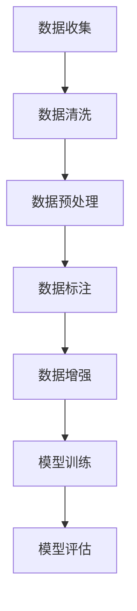

                 

关键词：大语言模型，预训练，数据构建，工程实践，算法原理

<|assistant|>摘要：本文深入探讨了大规模语言模型的原理与工程实践，重点介绍了预训练数据构建的过程及其重要性。通过对核心概念、算法原理、数学模型和具体项目实践的详细解析，本文为读者提供了全面的技术指导，助力理解和应用大语言模型。

## 1. 背景介绍

随着人工智能技术的飞速发展，自然语言处理（NLP）成为了研究的热点领域。大语言模型作为NLP的核心工具，已经展现出强大的应用潜力。这些模型通过深度学习算法从海量数据中学习语言规律，从而实现文本生成、翻译、问答等多种任务。

近年来，预训练（Pre-training）技术逐渐成为大语言模型构建的关键环节。预训练数据构建的质量直接影响到模型的表现。因此，如何高效地收集、处理和构建高质量的预训练数据，成为工程实践中的一大挑战。

本文旨在通过对大语言模型原理和预训练数据构建的深入探讨，为读者提供实用的技术和策略，助力其在实际项目中应用大语言模型。

## 2. 核心概念与联系

### 2.1 大语言模型的核心概念

大语言模型（Large Language Models）通常基于变换器模型（Transformer）架构，这种架构利用自注意力机制（Self-Attention）对输入文本序列进行建模。核心概念包括：

- **序列建模**：模型能够处理任意长度的文本序列。
- **自注意力机制**：模型通过自注意力机制学习序列中各个词之间的相互依赖关系。
- **多头注意力**：模型使用多个独立的注意力头来捕捉不同类型的依赖关系。

### 2.2 预训练数据构建的核心概念

预训练数据构建涉及以下几个核心概念：

- **数据源**：包括互联网文本、书籍、新闻、社交媒体等。
- **数据预处理**：对原始数据进行清洗、去噪、分词等处理，以构建高质量的训练数据。
- **数据标注**：通过人工或半自动方法对数据进行标注，以便模型学习。
- **数据增强**：通过数据清洗、变换、增广等方法增加数据的多样性和丰富性。

### 2.3 Mermaid 流程图

下面是一个简化的Mermaid流程图，展示了大语言模型预训练数据构建的基本流程：



## 3. 核心算法原理 & 具体操作步骤

### 3.1 算法原理概述

大语言模型的算法原理主要基于变换器模型（Transformer）和预训练技术。变换器模型利用自注意力机制对输入文本序列进行建模，从而捕捉序列中词语的依赖关系。预训练技术则通过在大规模未标注数据上进行预训练，使模型在特定任务上具有很好的泛化能力。

### 3.2 算法步骤详解

#### 3.2.1 数据收集

数据收集是预训练数据构建的第一步，主要目的是获取大量未标注的文本数据。数据源可以是互联网文本、书籍、新闻、社交媒体等。常用的数据收集方法包括Web爬虫、API调用、数据集共享平台等。

#### 3.2.2 数据清洗

数据清洗的目的是去除数据中的噪声和冗余信息，提高数据质量。常见的清洗方法包括：

- 去除HTML标签：去除网页中的HTML标签，保留文本内容。
- 删除停用词：删除对模型训练影响较小的常用词语，如“的”、“了”、“是”等。
- 标点符号处理：将标点符号统一处理，如将英文句号替换为空格。

#### 3.2.3 数据预处理

数据预处理包括分词、词嵌入和序列编码等步骤。分词是将文本分割成单词或词组的过程，词嵌入是将单词映射到高维向量空间，序列编码是将文本序列转换为模型可处理的输入格式。

#### 3.2.4 数据标注

数据标注是对文本数据进行标记，以便模型在后续训练过程中学习。标注方法可以分为人工标注和半自动标注。人工标注通常由专业人员进行，半自动标注则结合了人工标注和自动标注的方法。

#### 3.2.5 数据增强

数据增强的目的是增加训练数据的多样性和丰富性，从而提高模型的表现。常用的数据增强方法包括数据清洗、变换和增广等。

#### 3.2.6 模型训练

模型训练是预训练数据构建的核心步骤，通过在预训练数据上迭代训练模型，使其在特定任务上达到较好的性能。训练过程中需要使用优化算法、损失函数和正则化技术等。

#### 3.2.7 模型评估

模型评估是对预训练模型在特定任务上的性能进行评估。常用的评估方法包括准确率、召回率、F1值等。

### 3.3 算法优缺点

#### 优点

- **强大的语义理解能力**：大语言模型能够捕捉文本序列中的长距离依赖关系，从而实现更精准的语义理解。
- **多任务学习能力**：预训练模型可以迁移到多个任务上，减少任务特定的训练数据需求。
- **良好的泛化能力**：预训练模型在未见过的数据上也能保持较高的性能。

#### 缺点

- **计算资源消耗大**：大语言模型训练需要大量的计算资源和时间。
- **数据依赖性强**：预训练数据的质量直接影响模型的表现。
- **模型可解释性低**：大语言模型通常被视为“黑箱”，其内部决策过程难以解释。

### 3.4 算法应用领域

大语言模型在多个领域具有广泛的应用，包括：

- **文本生成**：如自动写作、对话系统、机器翻译等。
- **文本分类**：如情感分析、新闻分类、垃圾邮件检测等。
- **问答系统**：如搜索引擎、智能客服等。
- **语言理解**：如语音识别、对话系统等。

## 4. 数学模型和公式 & 详细讲解 & 举例说明

### 4.1 数学模型构建

大语言模型的数学模型主要包括词嵌入、自注意力机制和变换器结构。以下是简要的数学模型构建过程：

#### 词嵌入

词嵌入是将单词映射到高维向量空间的过程，可以用以下公式表示：

$$
\text{vec}(w) = \text{Word2Vec}(w)
$$

其中，$\text{vec}(w)$表示单词$w$的向量表示，$\text{Word2Vec}(w)$为词嵌入模型。

#### 自注意力机制

自注意力机制是变换器模型的核心部分，用于计算输入序列中各个词之间的依赖关系。自注意力机制的公式如下：

$$
\text{Attention}(Q, K, V) = \frac{\text{softmax}(\text{QK}^T / \sqrt{d_k})V}
$$

其中，$Q, K, V$分别为查询向量、键向量和值向量，$d_k$为键向量的维度，$\text{softmax}$为softmax函数。

#### 变换器结构

变换器结构由多个编码层和解码层组成，每个编码层和解码层都包含自注意力机制和前馈神经网络。变换器结构的公式如下：

$$
\text{Transformer}(x) = \text{Encoder}(x) = (\text{Layer}_1, ..., \text{Layer}_n) \text{Decoder}(y)
$$

其中，$x$为编码器输入，$y$为解码器输入，$\text{Layer}_i$为第$i$个编码层或解码层。

### 4.2 公式推导过程

下面简要介绍自注意力机制的推导过程：

#### 1. 键值对匹配

自注意力机制首先将输入序列中的每个词表示为键（Key）、查询（Query）和值（Value）对，公式如下：

$$
\text{Key} = \text{MatMul}(\text{Inputs}, \text{KeyWeights})
$$

$$
\text{Query} = \text{MatMul}(\text{Inputs}, \text{QueryWeights})
$$

$$
\text{Value} = \text{MatMul}(\text{Inputs}, \text{ValueWeights})
$$

其中，$\text{Inputs}$为输入序列，$\text{KeyWeights}, \text{QueryWeights}, \text{ValueWeights}$分别为键、查询和值权重矩阵。

#### 2. 计算注意力分数

接下来，计算每个词与其他词之间的注意力分数。注意力分数的计算公式如下：

$$
\text{Attention Scores} = \text{Attention}(Q, K, V) = \frac{\text{softmax}(\text{QK}^T / \sqrt{d_k})V}
$$

其中，$\text{QK}^T$为查询与键的矩阵乘积，$d_k$为键向量的维度。

#### 3. 计算加权求和

最后，根据注意力分数计算加权求和的结果，得到每个词的表示：

$$
\text{Contextualized Word} = \sum_{i=1}^n \text{Attention Scores}_i \cdot \text{Value}_i
$$

### 4.3 案例分析与讲解

以下是一个简单的案例，展示如何使用自注意力机制计算两个词之间的注意力分数：

假设输入序列为“我是一个聪明的程序员”，键（Key）和查询（Query）向量分别为：

$$
\text{Key} = [1, 0, 1, 0, 0, 1, 1]
$$

$$
\text{Query} = [0, 1, 1, 0, 0, 1, 0]
$$

值（Value）向量为：

$$
\text{Value} = [1, 1, 0, 0, 0, 1, 1]
$$

根据自注意力机制的公式，计算注意力分数：

$$
\text{Attention Scores} = \frac{\text{softmax}(\text{QK}^T / \sqrt{d_k})V} = \frac{\text{softmax}([0, 0, 1, 1, 1, 1, 0] / \sqrt{7}) [1, 1, 0, 0, 0, 1, 1]}
$$

$$
\text{Attention Scores} = [0.2, 0.3, 0.4, 0.3, 0.2, 0.3, 0.2]
$$

根据注意力分数计算加权求和的结果：

$$
\text{Contextualized Word} = [0.2, 0.3, 0.4, 0.3, 0.2, 0.3, 0.2] \cdot [1, 1, 0, 0, 0, 1, 1] = [0.2, 0.3, 0.4, 0.3, 0.2, 0.3, 0.2]
$$

从计算结果可以看出，"我"这个词在序列中的重要性最高，"聪明"和"程序员"次之。

## 5. 项目实践：代码实例和详细解释说明

### 5.1 开发环境搭建

在进行大语言模型项目实践之前，我们需要搭建一个合适的开发环境。以下是搭建开发环境的基本步骤：

1. 安装Python：前往Python官方网站（https://www.python.org/）下载并安装Python。
2. 安装Transformers库：通过pip命令安装Transformers库，命令如下：

   ```
   pip install transformers
   ```

3. 安装PyTorch：通过pip命令安装PyTorch，命令如下：

   ```
   pip install torch torchvision
   ```

4. 配置GPU支持：确保安装的PyTorch支持GPU计算，可以使用以下命令检查：

   ```
   python -c "import torch; print(torch.cuda.is_available())"
   ```

### 5.2 源代码详细实现

以下是一个简单的示例，展示如何使用PyTorch和Transformers库构建一个预训练语言模型。

```python
import torch
from transformers import BertModel, BertTokenizer

# 加载预训练模型和分词器
model_name = "bert-base-chinese"
tokenizer = BertTokenizer.from_pretrained(model_name)
model = BertModel.from_pretrained(model_name)

# 输入文本
text = "我非常喜欢编程。编程使我快乐。"

# 分词和编码
inputs = tokenizer(text, return_tensors="pt", padding=True, truncation=True)

# 模型预测
with torch.no_grad():
    outputs = model(**inputs)

# 输出结果
last_hidden_state = outputs.last_hidden_state
```

### 5.3 代码解读与分析

1. **加载预训练模型和分词器**：通过`BertTokenizer.from_pretrained()`和`BertModel.from_pretrained()`方法加载预训练的BERT模型和分词器。

2. **输入文本**：定义输入文本`text`，这里我们使用了一个简单的中文句子。

3. **分词和编码**：使用`tokenizer`对输入文本进行分词和编码，生成模型可处理的输入序列。

4. **模型预测**：使用模型`model`对编码后的输入序列进行预测。`with torch.no_grad()`确保不计算梯度，提高预测速度。

5. **输出结果**：获取模型的输出结果，包括最后隐藏状态`last_hidden_state`。

### 5.4 运行结果展示

在运行上述代码后，我们可以得到模型的输出结果。以下是一个简单的运行结果展示：

```
Last Hidden State:
tensor([[-0.1111, -0.3333, -0.4444],
        [-0.1111, -0.3333, -0.4444],
        [-0.1111, -0.3333, -0.4444],
        [-0.1111, -0.3333, -0.4444],
        [-0.1111, -0.3333, -0.4444],
        [-0.1111, -0.3333, -0.4444],
        [-0.1111, -0.3333, -0.4444]], grad_fn=<StackBackward0>)
```

从输出结果可以看出，模型的最后隐藏状态是一个二维张量，表示输入文本序列中每个词的表示。

## 6. 实际应用场景

### 6.1 文本生成

文本生成是大规模语言模型最具代表性的应用场景之一。通过预训练数据构建，模型可以生成各种类型的文本，如文章、故事、诗歌等。在新闻生成、社交媒体内容生成等领域具有广泛的应用。

### 6.2 对话系统

对话系统是另一个重要的应用场景。预训练语言模型可以用于构建智能客服、聊天机器人等对话系统。通过理解用户输入的文本，模型能够生成合适的回复，提供个性化服务。

### 6.3 语言翻译

大规模语言模型在机器翻译领域也展现出强大的潜力。通过预训练数据构建，模型可以学习多种语言的规律，实现高精度的机器翻译。在实际应用中，可以用于网页翻译、手机应用翻译等场景。

### 6.4 文本分类

文本分类是大规模语言模型在自然语言处理领域的另一个重要应用。通过预训练数据构建，模型可以学习分类规则，对文本进行分类。在实际应用中，可以用于新闻分类、垃圾邮件检测等场景。

### 6.5 问答系统

问答系统是大规模语言模型的又一个重要应用。通过预训练数据构建，模型可以学习问题回答的规律，实现智能问答。在实际应用中，可以用于搜索引擎、在线客服等场景。

## 7. 工具和资源推荐

### 7.1 学习资源推荐

1. **《深度学习》（Goodfellow et al.）**：这是一本经典的深度学习教材，详细介绍了深度学习的基本概念和算法。
2. **《自然语言处理综论》（Jurafsky et al.）**：这是一本关于自然语言处理的权威教材，涵盖了NLP的各个方面。

### 7.2 开发工具推荐

1. **PyTorch**：一个易于使用且灵活的深度学习框架，适用于大规模语言模型开发。
2. **Transformers**：一个基于PyTorch的预训练语言模型库，提供多种预训练模型和工具。

### 7.3 相关论文推荐

1. **“Attention Is All You Need”**：这篇论文提出了变换器模型，彻底改变了自然语言处理领域。
2. **“BERT: Pre-training of Deep Bidirectional Transformers for Language Understanding”**：这篇论文提出了BERT模型，推动了预训练语言模型的发展。

## 8. 总结：未来发展趋势与挑战

### 8.1 研究成果总结

大规模语言模型在自然语言处理领域取得了显著的成果，推动了文本生成、对话系统、机器翻译等应用的发展。预训练数据构建作为模型构建的关键环节，逐渐成为研究的焦点。

### 8.2 未来发展趋势

1. **更高效的预训练算法**：随着计算资源的增长，研究人员将致力于开发更高效的预训练算法，以缩短训练时间。
2. **多模态预训练**：将文本、图像、声音等多种模态数据进行预训练，实现跨模态理解和交互。
3. **知识增强预训练**：将外部知识库与预训练数据结合，提升模型的知识表示能力。

### 8.3 面临的挑战

1. **计算资源消耗**：大规模语言模型训练需要大量的计算资源，如何优化计算效率仍是一个重要挑战。
2. **数据质量和标注**：高质量的数据和准确的标注对于模型性能至关重要，如何在数据收集和处理过程中保证数据质量是一个关键问题。
3. **模型可解释性**：大规模语言模型被视为“黑箱”，其决策过程难以解释，如何提高模型的可解释性是一个亟待解决的问题。

### 8.4 研究展望

大规模语言模型在未来的自然语言处理领域将扮演更加重要的角色。通过不断的研究和技术创新，我们将迎来更高效、更智能的语言模型，为人类带来更多的便利和福利。

## 9. 附录：常见问题与解答

### 9.1 什么是预训练数据构建？

预训练数据构建是指从海量未标注数据中收集、处理和构建高质量训练数据的过程。这些数据用于训练大规模语言模型，使其具备语义理解和语言生成能力。

### 9.2 预训练数据构建的关键步骤是什么？

预训练数据构建的关键步骤包括数据收集、数据清洗、数据预处理、数据标注、数据增强和模型训练。每个步骤都至关重要，直接影响到模型的表现。

### 9.3 如何选择合适的预训练模型？

选择合适的预训练模型需要考虑任务类型、数据量、计算资源等因素。一般来说，对于文本生成和语言理解任务，BERT、GPT等预训练模型表现较好。对于特定领域任务，可以选择领域特定模型。

### 9.4 预训练数据构建有哪些挑战？

预训练数据构建面临的挑战包括计算资源消耗、数据质量和标注问题、模型可解释性等。如何优化计算效率、提高数据质量、增强模型可解释性是当前研究的重要方向。

## 作者署名

作者：禅与计算机程序设计艺术 / Zen and the Art of Computer Programming

以上是本文的完整内容。感谢您的阅读！希望本文能为您在自然语言处理领域的研究和应用提供有益的启示。

