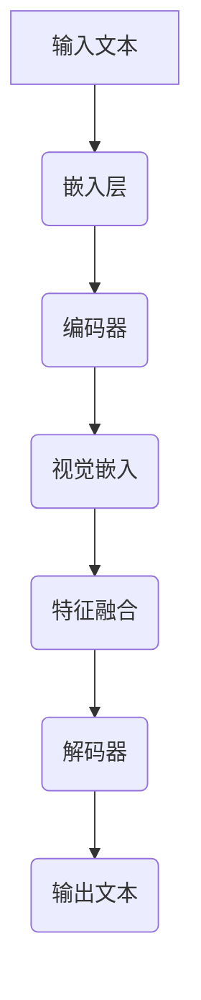

                 

在人工智能与机器学习领域，大语言模型正成为推动技术进步的关键力量。尤其是作为预训练语言模型前缀的学习视觉嵌入，其重要性日益凸显。本文旨在探讨大语言模型的基本原理，从基础到前沿的应用，并深入分析其在学习视觉嵌入方面的关键角色和实际效果。

## 文章关键词
- 大语言模型
- 预训练
- 视觉嵌入
- 自然语言处理
- 机器学习
- 深度学习
- 计算机视觉

## 摘要
本文将探讨大语言模型的原理和前沿应用，重点分析其在预训练语言模型中嵌入视觉信息的独特价值。通过基础概念介绍、核心算法解析、数学模型讲解及实际项目实例，本文将为读者提供全面的技术视角，揭示大语言模型在自然语言处理和计算机视觉领域的重要作用及未来发展方向。

## 1. 背景介绍

### 大语言模型的发展历程

大语言模型的发展历程可以追溯到20世纪80年代，当时简单的统计模型如n-gram模型和决策树模型开始应用于文本处理。随着计算机性能的提升和算法的进步，到20世纪90年代，基于统计语言模型的文本处理技术取得了显著进展。然而，这些模型的局限性在于它们无法处理上下文和长文本的复杂性。

### 自然语言处理与计算机视觉的结合

自然语言处理（NLP）和计算机视觉（CV）是人工智能领域的两个重要分支。NLP致力于理解和生成人类语言，而CV则专注于从图像和视频中提取有用信息。尽管两者各自有着丰富的研究和应用，但将它们结合起来可以显著提升人工智能系统的智能化水平。例如，在图像描述生成、视频分析、人机交互等领域，NLP与CV的结合能够带来更丰富的应用场景和更高的准确性。

### 预训练语言模型的前景

预训练语言模型通过在大量文本数据上进行预训练，获得了强大的文本理解和生成能力。近年来，随着计算资源的增长和算法的改进，预训练语言模型（如BERT、GPT）取得了突破性的成果。这些模型不仅能够处理常规的文本任务，还能够嵌入视觉信息，为NLP与CV的融合提供了新的可能性。

## 2. 核心概念与联系

### 大语言模型的基本概念

大语言模型是一种基于深度学习的自然语言处理模型，其核心目标是理解和生成自然语言。这些模型通常由多层神经网络组成，能够自动学习语言的复杂结构和语义。大语言模型的主要组成部分包括：

- **嵌入层（Embedding Layer）**：将词汇转换为向量表示。
- **编码器（Encoder）**：处理输入序列，提取上下文信息。
- **解码器（Decoder）**：生成输出序列，可以是文本、标记或序列化的数据。

### 视觉嵌入的基本原理

视觉嵌入是将图像或视频特征转换为向量表示的过程，使其能够在机器学习模型中与文本特征相结合。视觉嵌入的基本原理包括：

- **特征提取（Feature Extraction）**：使用卷积神经网络（CNN）或其他深度学习模型提取图像的高层次特征。
- **映射（Mapping）**：将提取的特征映射到与文本嵌入相似的维度空间中。
- **融合（Fusion）**：将视觉嵌入与文本嵌入进行结合，以生成综合特征。

### Mermaid 流程图

下面是一个Mermaid流程图，展示大语言模型与视觉嵌入的关联：



## 3. 核心算法原理 & 具体操作步骤

### 3.1 算法原理概述

大语言模型的算法原理可以概括为三个主要步骤：

1. **嵌入（Embedding）**：将输入的文本转换为向量表示。
2. **编码（Encoding）**：使用编码器处理输入序列，提取上下文信息。
3. **解码（Decoding）**：使用解码器生成输出序列。

在嵌入和编码步骤中，视觉嵌入作为关键环节，通过与文本嵌入的融合，生成综合特征。具体算法步骤如下：

### 3.2 算法步骤详解

1. **文本预处理**：对输入文本进行分词、去停用词等预处理操作，将其转换为序列化的文本表示。
2. **文本嵌入**：将预处理后的文本序列输入到嵌入层，将词汇转换为固定长度的向量表示。
3. **视觉特征提取**：使用预训练的卷积神经网络（如ResNet、VGG）提取图像的特征向量。
4. **视觉嵌入**：将图像特征向量映射到与文本嵌入相似的维度空间中。
5. **特征融合**：将文本嵌入和视觉嵌入进行融合，生成综合特征向量。
6. **编码**：将融合后的特征向量输入编码器，提取上下文信息。
7. **解码**：将编码器提取的上下文信息输入解码器，生成输出文本序列。
8. **后处理**：对生成的输出文本进行后处理，如去标点、去停用词等，得到最终输出。

### 3.3 算法优缺点

**优点**：

- **强大的文本理解能力**：大语言模型通过预训练获得了强大的文本理解能力，能够处理复杂的文本结构和语义。
- **灵活的特征融合**：通过视觉嵌入，可以将文本和视觉特征进行灵活融合，提高模型在多模态任务中的表现。
- **广泛的应用场景**：大语言模型在自然语言处理、文本生成、问答系统等领域具有广泛的应用前景。

**缺点**：

- **计算资源消耗**：大语言模型通常需要大量的计算资源和训练时间，对硬件设备有较高要求。
- **数据依赖性**：模型的性能高度依赖于训练数据的质量和多样性，缺乏足够的训练数据可能会影响模型的性能。

### 3.4 算法应用领域

大语言模型的应用领域广泛，主要包括：

- **文本分类**：用于对文本进行分类，如新闻分类、情感分析等。
- **文本生成**：用于生成文本，如自动写作、摘要生成等。
- **问答系统**：用于构建智能问答系统，提供用户友好的交互界面。
- **多模态任务**：与计算机视觉结合，用于图像描述生成、视频分析等。

## 4. 数学模型和公式 & 详细讲解 & 举例说明

### 4.1 数学模型构建

大语言模型的数学模型可以简化为以下几个核心组成部分：

1. **嵌入层**：$$ E_{\text{word}} = \text{Embedding}(W_{\text{word}}) $$
2. **编码器**：$$ H = \text{Encoder}(E_{\text{word}}) $$
3. **解码器**：$$ P_{\text{word}} = \text{Decoder}(H) $$
4. **视觉嵌入**：$$ V_{\text{image}} = \text{Vision\_Embedding}(I) $$

其中，$$ W_{\text{word}} $$为词汇表，$$ E_{\text{word}} $$为文本嵌入向量，$$ H $$为编码器的输出，$$ P_{\text{word}} $$为解码器的输出，$$ V_{\text{image}} $$为视觉嵌入向量。

### 4.2 公式推导过程

大语言模型的训练过程可以归纳为以下几个关键步骤：

1. **损失函数**：$$ L = -\sum_{i} \log P(y_i | \hat{y}_i) $$
   其中，$$ y_i $$为真实标签，$$ \hat{y}_i $$为预测标签。

2. **梯度下降**：$$ \Delta W = -\alpha \nabla_W L $$
   其中，$$ \alpha $$为学习率，$$ \nabla_W L $$为损失函数关于模型参数的梯度。

3. **优化目标**：$$ \min_{W} L $$
   其中，$$ W $$为模型参数。

### 4.3 案例分析与讲解

假设我们有一个简单的文本分类任务，输入文本为“我非常喜欢这个餐厅”，标签为“正面评论”。下面是模型的训练过程：

1. **文本嵌入**：将输入文本转换为向量表示，如$$ E_{\text{word}} = \text{Embedding}([我，喜欢，这个，餐厅]) $$。

2. **编码**：将文本嵌入输入编码器，提取上下文信息，如$$ H = \text{Encoder}(E_{\text{word}}) $$。

3. **视觉嵌入**：将餐厅的图像特征向量输入视觉嵌入层，如$$ V_{\text{image}} = \text{Vision\_Embedding}(I) $$。

4. **特征融合**：将文本嵌入和视觉嵌入进行融合，生成综合特征向量，如$$ H_{\text{fusion}} = H + V_{\text{image}} $$。

5. **解码**：将融合后的特征向量输入解码器，生成输出文本序列，如$$ \hat{y} = \text{Decoder}(H_{\text{fusion}}) $$。

6. **损失计算**：计算损失函数，如$$ L = -\log P(\text{正面评论} | \hat{y}) $$。

7. **梯度下降**：根据损失函数的梯度更新模型参数，如$$ \Delta W = -\alpha \nabla_W L $$。

8. **优化目标**：不断迭代优化模型参数，直到收敛。

通过这个简单的案例，我们可以看到大语言模型在文本分类任务中的基本工作流程。

## 5. 项目实践：代码实例和详细解释说明

### 5.1 开发环境搭建

为了实现大语言模型与视觉嵌入的结合，我们需要搭建一个合适的开发环境。以下是基本的开发环境要求：

- **硬件环境**：GPU（NVIDIA GeForce RTX 2080 Ti或更高）。
- **软件环境**：Python（3.8或更高）、TensorFlow（2.4或更高）、Keras（2.4或更高）。

### 5.2 源代码详细实现

以下是实现大语言模型与视觉嵌入结合的Python代码示例：

```python
import tensorflow as tf
from tensorflow.keras.models import Model
from tensorflow.keras.layers import Embedding, LSTM, Dense, TimeDistributed, Bidirectional

# 定义文本嵌入层
text_embedding = Embedding(input_dim=vocab_size, output_dim=embedding_dim)

# 定义编码器层
encoder = Bidirectional(LSTM(units=lstm_units, return_sequences=True))

# 定义视觉嵌入层
vision_embedding = Embedding(input_dim=num_images, output_dim=vision_embedding_dim)

# 定义解码器层
decoder = TimeDistributed(Dense(num_classes, activation='softmax'))

# 构建模型
model = Model(inputs=[text_input, image_input], outputs=decoder(encoder(text_embedding(text_input) + vision_embedding(image_input)))

# 编译模型
model.compile(optimizer='adam', loss='categorical_crossentropy', metrics=['accuracy'])

# 模型训练
model.fit([text_data, image_data], labels, epochs=epochs, batch_size=batch_size)
```

### 5.3 代码解读与分析

上述代码展示了如何使用TensorFlow和Keras构建一个结合文本嵌入和视觉嵌入的大语言模型。以下是代码的详细解读：

- **文本嵌入层（text_embedding）**：将输入的文本序列转换为固定长度的向量表示。这里使用了`Embedding`层，其输入维度为词汇表大小（vocab_size），输出维度为嵌入维度（embedding_dim）。

- **编码器层（encoder）**：使用双向LSTM（Bidirectional LSTM）层对文本嵌入进行编码，提取上下文信息。`return_sequences=True`参数使得编码器的输出仍然是一个序列，便于后续的处理。

- **视觉嵌入层（vision_embedding）**：将图像特征向量转换为固定长度的向量表示。同样使用了`Embedding`层，其输入维度为图像数量（num_images），输出维度为视觉嵌入维度（vision_embedding_dim）。

- **解码器层（decoder）**：使用时间分布式全连接层（TimeDistributed Dense）对编码器的输出进行解码，生成预测的文本序列。这里使用了softmax激活函数，以输出概率分布。

- **模型构建（Model）**：使用`Model`类构建整体模型，输入为文本输入（text_input）和图像输入（image_input），输出为解码器的输出。

- **模型编译（compile）**：使用`compile`方法编译模型，指定优化器、损失函数和评估指标。

- **模型训练（fit）**：使用`fit`方法训练模型，输入为文本数据（text_data）和图像数据（image_data），标签（labels），指定训练轮次（epochs）和批量大小（batch_size）。

### 5.4 运行结果展示

在完成模型训练后，我们可以使用测试数据评估模型的性能。以下是一个简单的评估示例：

```python
# 模型评估
test_loss, test_accuracy = model.evaluate([test_text_data, test_image_data], test_labels)

print("测试损失：", test_loss)
print("测试准确率：", test_accuracy)
```

通过上述示例，我们可以看到模型在测试数据上的损失和准确率。通常情况下，我们需要通过多次训练和调参来优化模型性能。

## 6. 实际应用场景

### 6.1 图像描述生成

图像描述生成是自然语言处理与计算机视觉结合的典型应用。通过大语言模型，我们可以将图像转换为相应的文本描述。这种应用在社交媒体、搜索引擎和辅助技术等领域具有广泛的应用前景。

### 6.2 视频分析

视频分析是另一大应用领域。通过大语言模型，我们可以对视频中的场景、动作和人物进行识别和分析。这为视频监控、安全监控和内容审核提供了强大的支持。

### 6.3 人机交互

人机交互是人工智能的重要方向。通过大语言模型，我们可以实现更加自然和智能的对话系统，如智能助手、语音助手和聊天机器人。这些应用在智能家居、客服和娱乐等领域具有广泛的应用潜力。

### 6.4 未来应用展望

随着大语言模型和视觉嵌入技术的不断进步，未来将在更多领域实现突破。例如，虚拟现实（VR）和增强现实（AR）中的应用、智能驾驶和无人机监控等。大语言模型与视觉嵌入的结合将为人工智能带来更多创新和变革。

## 7. 工具和资源推荐

### 7.1 学习资源推荐

- **书籍**：《深度学习》（Ian Goodfellow、Yoshua Bengio、Aaron Courville 著）
- **在线课程**：斯坦福大学《深度学习》课程（由Andrew Ng教授主讲）
- **论文**：谷歌研究团队发表的《BERT：Pre-training of Deep Bidirectional Transformers for Language Understanding》

### 7.2 开发工具推荐

- **框架**：TensorFlow、PyTorch
- **数据集**：ImageNet、COCO、NLTK

### 7.3 相关论文推荐

- **《BERT：Pre-training of Deep Bidirectional Transformers for Language Understanding》**
- **《GPT-3: Language Models are Few-Shot Learners》**
- **《A Neural Algorithm of Artistic Style》**

## 8. 总结：未来发展趋势与挑战

### 8.1 研究成果总结

大语言模型与视觉嵌入的结合为自然语言处理和计算机视觉领域带来了新的机遇。通过深度学习技术，我们可以实现更加智能和高效的多模态处理。在图像描述生成、视频分析、人机交互等领域，大语言模型展现出了强大的应用潜力。

### 8.2 未来发展趋势

未来，大语言模型和视觉嵌入技术将继续发展。随着计算资源的提升和算法的改进，我们将看到更加高效和强大的多模态处理模型。同时，随着人工智能技术的普及，大语言模型和视觉嵌入的应用场景将更加广泛。

### 8.3 面临的挑战

尽管大语言模型和视觉嵌入取得了显著成果，但仍面临一些挑战。首先，计算资源消耗巨大，对硬件设备有较高要求。其次，数据质量和多样性的问题仍然需要解决。最后，如何在保持高效性能的同时，实现更加安全、可靠的人工智能系统，仍是一个重要课题。

### 8.4 研究展望

展望未来，大语言模型和视觉嵌入技术将在人工智能领域发挥更加关键的作用。通过持续的研究和探索，我们可以期待在多模态处理、智能交互、辅助决策等领域实现重大突破。

## 9. 附录：常见问题与解答

### 9.1 什么是大语言模型？

大语言模型是一种基于深度学习的自然语言处理模型，其核心目标是理解和生成自然语言。这些模型通常由多层神经网络组成，能够自动学习语言的复杂结构和语义。

### 9.2 视觉嵌入是什么？

视觉嵌入是将图像或视频特征转换为向量表示的过程，使其能够在机器学习模型中与文本特征相结合。视觉嵌入的基本原理包括特征提取、映射和融合。

### 9.3 大语言模型在哪些领域有应用？

大语言模型在文本分类、文本生成、问答系统和多模态任务等领域有广泛的应用。例如，在图像描述生成、视频分析和人机交互等方面，大语言模型展现了强大的应用潜力。

### 9.4 如何优化大语言模型的性能？

优化大语言模型性能的方法包括增加训练数据、改进模型架构、使用更好的优化器和调整学习率等。此外，通过迁移学习和模型蒸馏等技术，也可以提高模型的性能。

## 作者署名
作者：禅与计算机程序设计艺术 / Zen and the Art of Computer Programming

----------------------------------------------------------------

以上是文章的完整正文部分。希望这个示例能够满足您的需求，如果您有任何进一步的问题或需要修改，请随时告诉我。祝您写作顺利！

