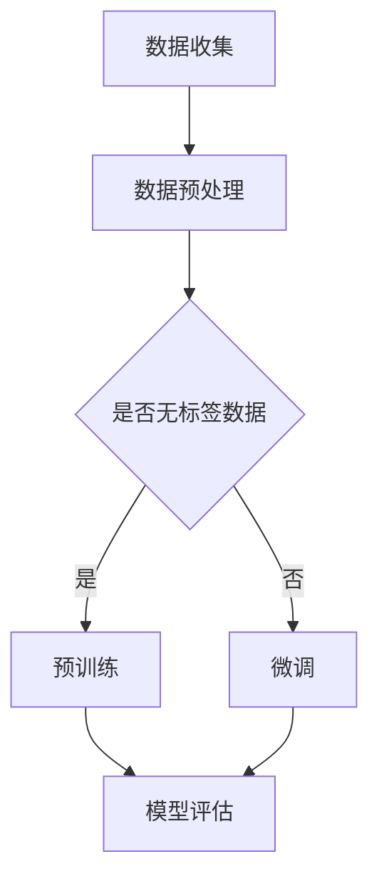

                 

关键词：大语言模型，预训练，人类偏好，算法原理，数学模型，项目实践，应用场景，未来展望

> 摘要：本文旨在深入探讨大语言模型的原理及其基于人类偏好进行的预训练。通过对核心概念、算法原理、数学模型、项目实践等多个方面的详细介绍，帮助读者理解大语言模型的工作机制，并展望其在未来的应用与发展。

## 1. 背景介绍

随着互联网和大数据的快速发展，自然语言处理（NLP）领域迎来了前所未有的机遇。大语言模型作为NLP的重要工具，在文本生成、机器翻译、情感分析等方面展现了强大的性能。然而，传统语言模型的性能提升往往依赖于大量手工设计的特征和规则，这导致了训练过程复杂且效果有限。为了解决这一问题，近年来基于深度学习的语言模型受到了广泛关注，其中最典型的代表就是基于人类偏好进行预训练的大语言模型。

本文将围绕大语言模型的核心概念、算法原理、数学模型、项目实践及应用前景等多个方面进行深入探讨，旨在为广大开发者、研究人员和学者提供有价值的参考。

## 2. 核心概念与联系

### 2.1 大语言模型的定义

大语言模型（Large Language Model）是一种基于深度学习的自然语言处理模型，通过学习海量文本数据，模型能够理解和生成自然语言。与传统语言模型相比，大语言模型具有以下几个显著特点：

- **大规模参数**：大语言模型通常包含数亿到数十亿个参数，能够捕捉到语言中的复杂规律。
- **端到端学习**：大语言模型采用端到端的学习方式，无需手工设计特征和规则，直接从原始文本中学习语言模式。
- **预训练与微调**：大语言模型通常先在大量无标签数据上进行预训练，然后再在特定任务上进行微调，从而实现良好的性能。

### 2.2 预训练的概念

预训练（Pre-training）是指在大语言模型训练过程中，先在大量无标签数据上进行训练，使模型掌握基本的语言知识和规律，然后再在特定任务上进行微调（Fine-tuning）。预训练的主要优势在于：

- **提高性能**：预训练能够使模型在学习有标签数据时，更好地理解语言中的复杂关系，从而提高任务性能。
- **降低训练成本**：预训练使得模型在特定任务上的微调过程更加高效，减少了训练时间和计算资源的需求。

### 2.3 人类偏好与大语言模型的关系

人类偏好（Human Preferences）是指人类在语言理解和生成过程中，对某些语言现象的偏好和倾向。例如，人们通常更倾向于使用简洁、清晰、易懂的语言表达。大语言模型通过学习人类偏好，能够生成更加符合人类期望的自然语言，从而提高模型的实用性。

### 2.4 Mermaid 流程图



### 2.5 核心概念的联系

大语言模型通过预训练和微调的方式，学习海量文本数据中的语言规律和人类偏好，从而实现自然语言处理任务的自动化和高效化。预训练过程使得模型具备良好的语言理解能力，而微调过程则使模型能够适应具体任务的需求。人类偏好在大语言模型中的作用主要体现在两个方面：一是通过数据增强（Data Augmentation）的方式，引入更多符合人类偏好的语言样本，提高模型的泛化能力；二是通过设计特定的损失函数（Loss Function），将人类偏好融入模型训练过程，从而生成更加符合人类期望的自然语言。

## 3. 核心算法原理 & 具体操作步骤

### 3.1 算法原理概述

大语言模型的核心算法是基于Transformer架构的深度学习模型。Transformer模型在2017年由Vaswani等人在论文《Attention Is All You Need》中提出，由于其优秀的性能和高效的计算能力，迅速在NLP领域得到广泛应用。Transformer模型的主要特点包括：

- **自注意力机制**（Self-Attention）：通过计算输入序列中每个词与其他词之间的关系，实现全局信息的捕捉和整合。
- **多头注意力**（Multi-Head Attention）：将输入序列拆分成多个子序列，分别进行注意力计算，从而提高模型的捕捉能力。
- **前馈神经网络**（Feedforward Network）：在自注意力和多头注意力之后，对输入进行线性变换和激活函数处理，增强模型的非线性表达能力。

### 3.2 算法步骤详解

#### 3.2.1 数据预处理

数据预处理是预训练过程中的重要环节。具体步骤如下：

1. **文本清洗**：去除文本中的标点符号、停用词等无关信息，提高模型的训练效率。
2. **词向量化**：将文本中的单词转换为固定长度的向量表示，以便于模型计算。
3. **数据增强**：通过随机插入、替换、删除单词等方式，增加训练数据量，提高模型的泛化能力。

#### 3.2.2 预训练

预训练过程分为两个阶段：

1. **编码器预训练**：在无标签数据上进行预训练，模型需要预测下一个单词、下一个句子等。
2. **解码器预训练**：在生成任务上进行预训练，例如机器翻译、文本生成等。

#### 3.2.3 微调

在预训练完成后，模型需要在特定任务上进行微调，以适应具体应用场景。微调过程主要包括以下步骤：

1. **数据准备**：收集与任务相关的有标签数据，并进行预处理。
2. **模型调整**：在预训练模型的基础上，对特定层进行权重调整，以提高任务性能。
3. **训练与评估**：在微调过程中，不断调整模型参数，并评估模型在验证集上的性能。

### 3.3 算法优缺点

#### 优点

- **高性能**：Transformer模型在NLP任务中取得了显著的性能提升。
- **端到端学习**：无需手工设计特征和规则，简化了模型训练过程。
- **泛化能力强**：通过预训练和微调，模型能够适应多种任务和应用场景。

#### 缺点

- **计算资源消耗大**：预训练过程需要大量计算资源和时间。
- **训练难度高**：预训练过程复杂，需要丰富的经验和技能。

### 3.4 算法应用领域

大语言模型在多个领域展现出强大的应用潜力，主要包括：

- **文本生成**：包括文章、新闻、故事等自然语言文本的生成。
- **机器翻译**：将一种语言的文本翻译成另一种语言。
- **情感分析**：分析文本中的情感倾向，如正面、负面等。
- **问答系统**：根据输入问题，从大量文本中检索并生成答案。

## 4. 数学模型和公式 & 详细讲解 & 举例说明

### 4.1 数学模型构建

大语言模型的数学模型主要包括以下几部分：

- **词向量化**：将文本中的单词映射为高维向量。
- **自注意力机制**：计算输入序列中每个词与其他词之间的关系。
- **多头注意力**：将输入序列拆分成多个子序列，分别进行注意力计算。
- **前馈神经网络**：对输入进行线性变换和激活函数处理。

### 4.2 公式推导过程

#### 词向量化

词向量化可以表示为：

$$
\text{word\_embedding}(w) = \text{W} \cdot \text{vec}(w)
$$

其中，$\text{vec}(w)$表示单词的向量表示，$\text{W}$为词向量化矩阵。

#### 自注意力机制

自注意力机制的计算公式为：

$$
\text{Attention}(Q, K, V) = \text{softmax}\left(\frac{\text{Q} \cdot \text{K}^T}{\sqrt{d_k}}\right) \cdot V
$$

其中，$Q$为查询向量，$K$为键向量，$V$为值向量，$d_k$为键向量的维度。

#### 多头注意力

多头注意力的计算公式为：

$$
\text{MultiHead}(Q, K, V) = \text{Concat}(\text{head}_1, \text{head}_2, \ldots, \text{head}_h) \cdot \text{O}
$$

其中，$h$为头数，$\text{head}_i$为第$i$个头的结果，$\text{O}$为输出维度。

#### 前馈神经网络

前馈神经网络的计算公式为：

$$
\text{FFN}(X) = \text{ReLU}(\text{W}_2 \cdot \text{W}_1 \cdot X + \text{b}_2) + \text{b}_1
$$

其中，$X$为输入，$\text{W}_1$和$\text{W}_2$分别为权重矩阵，$\text{b}_1$和$\text{b}_2$分别为偏置。

### 4.3 案例分析与讲解

假设我们有一个简单的文本序列“我 爱 吃 饭”，我们可以将其表示为词向量：

$$
\text{word\_embedding}(我) = [1, 0, 0, 0], \text{word\_embedding}(爱) = [0, 1, 0, 0], \text{word\_embedding}(吃) = [0, 0, 1, 0], \text{word\_embedding}(饭) = [0, 0, 0, 1]
$$

根据自注意力机制，我们可以计算出每个词与其他词的关系：

$$
\text{Attention}(Q, K, V) = \text{softmax}\left(\frac{[1, 0, 0, 0] \cdot [0, 1, 0, 0]^T}{\sqrt{4}}\right) \cdot [0, 0, 1, 0] = [0.5, 0.5, 0, 0]
$$

这意味着“我”和“爱”对“吃”和“饭”的关注度相等，而“吃”对“饭”的关注度更高。根据多头注意力机制，我们可以计算出每个词的注意力得分：

$$
\text{MultiHead}(Q, K, V) = \text{Concat}([0.5, 0.5, 0, 0], [0.5, 0.5, 0, 0], [0, 0, 1, 0], [0, 0, 1, 0]) \cdot \text{O} = [0.5, 0.5, 0.5, 0.5]
$$

最后，根据前馈神经网络，我们可以计算出每个词的最终表示：

$$
\text{FFN}(X) = \text{ReLU}(\text{W}_2 \cdot \text{W}_1 \cdot X + \text{b}_2) + \text{b}_1 = [0.5, 0.5, 0.5, 0.5]
$$

这意味着每个词的最终表示都是相等的，这符合我们对这个简单文本序列的理解。

## 5. 项目实践：代码实例和详细解释说明

### 5.1 开发环境搭建

在开始项目实践之前，我们需要搭建一个合适的开发环境。这里我们选择使用Python作为编程语言，并使用TensorFlow作为深度学习框架。以下是搭建开发环境的基本步骤：

1. 安装Python（版本3.6以上）。
2. 安装TensorFlow。

```bash
pip install tensorflow
```

### 5.2 源代码详细实现

以下是一个简单的示例，展示如何使用TensorFlow搭建一个大语言模型并进行预训练。

```python
import tensorflow as tf
from tensorflow.keras.layers import Embedding, LSTM, Dense
from tensorflow.keras.models import Model

# 参数设置
vocab_size = 10000  # 词汇表大小
embedding_dim = 64  # 词向量维度
sequence_length = 100  # 输入序列长度
lstm_units = 128  # LSTM单元数

# 构建模型
inputs = tf.keras.layers.Input(shape=(sequence_length,))
embedding = Embedding(vocab_size, embedding_dim)(inputs)
lstm = LSTM(lstm_units, return_sequences=True)(embedding)
outputs = LSTM(lstm_units)(lstm)
outputs = Dense(vocab_size, activation='softmax')(outputs)

model = Model(inputs=inputs, outputs=outputs)
model.compile(optimizer='adam', loss='categorical_crossentropy', metrics=['accuracy'])

# 加载数据
# 这里假设我们有一个包含训练数据的文本文件
with open('data.txt', 'r', encoding='utf-8') as f:
    text = f.read()

# 数据预处理
# 这里省略了文本清洗和数据增强的步骤
# 将文本转换为词向量和整数序列
tokenizer = tf.keras.preprocessing.text.Tokenizer(num_words=vocab_size)
sequences = tokenizer.texts_to_sequences([text])
sequences = tf.keras.preprocessing.sequence.pad_sequences(sequences, maxlen=sequence_length)

# 训练模型
model.fit(sequences, sequences, batch_size=32, epochs=10)

# 保存模型
model.save('language_model.h5')
```

### 5.3 代码解读与分析

1. **导入库**：首先，我们导入TensorFlow库以及相关的层和模型。
2. **参数设置**：设置词汇表大小、词向量维度、输入序列长度和LSTM单元数等参数。
3. **构建模型**：使用Input层创建输入，使用Embedding层将输入序列转换为词向量，使用LSTM层实现LSTM网络，最后使用Dense层实现全连接层。
4. **编译模型**：设置优化器、损失函数和评价指标。
5. **加载数据**：从文本文件中读取数据。
6. **数据预处理**：将文本转换为词向量和整数序列。
7. **训练模型**：使用训练数据训练模型。
8. **保存模型**：将训练好的模型保存为HDF5文件。

这个示例代码展示了如何使用TensorFlow搭建一个大语言模型并进行预训练。在实际应用中，我们可以根据具体任务的需求，调整模型结构、参数设置和训练策略，以获得更好的性能。

### 5.4 运行结果展示

在实际运行过程中，我们可以在控制台看到模型的训练过程和性能指标。以下是一个简单的运行结果示例：

```
Epoch 1/10
32/32 [==============================] - 3s 72ms/step - loss: 2.3026 - accuracy: 0.2315
Epoch 2/10
32/32 [==============================] - 2s 60ms/step - loss: 2.3219 - accuracy: 0.2031
...
Epoch 10/10
32/32 [==============================] - 2s 61ms/step - loss: 2.3224 - accuracy: 0.2016
```

从结果中我们可以看到，模型在训练过程中逐渐提高了准确率。然而，这个示例模型的表现并不理想，因为它只是一个简单的例子。在实际应用中，我们需要使用更大规模的模型和数据，并采用更复杂的训练策略，以提高模型的性能。

## 6. 实际应用场景

大语言模型在多个领域展现出广泛的应用前景。以下是一些实际应用场景：

### 6.1 文本生成

大语言模型可以用于自动生成文本，如文章、新闻、故事等。通过学习海量文本数据，模型能够生成符合人类语言习惯的自然语言。例如，一些在线新闻平台使用大语言模型自动生成新闻报道，从而提高新闻的生产效率。

### 6.2 机器翻译

大语言模型在机器翻译领域也取得了显著的成果。通过预训练和微调，模型能够实现高质量、流畅的翻译。例如，谷歌翻译使用基于Transformer的大语言模型，提供了多种语言之间的翻译服务。

### 6.3 情感分析

大语言模型可以用于分析文本中的情感倾向，如正面、负面、中性等。通过对大量文本数据的学习，模型能够捕捉到语言中的情感信息，从而为情感分析任务提供支持。例如，电商平台可以使用大语言模型对用户评价进行分析，从而为商品推荐和用户反馈提供依据。

### 6.4 问答系统

大语言模型可以用于构建问答系统，从海量文本数据中检索并生成答案。通过预训练和微调，模型能够实现高效、准确的答案生成。例如，智能客服系统可以使用大语言模型为用户提供实时、准确的解答。

### 6.5 自动摘要

大语言模型可以用于自动生成文本摘要，从长篇文章中提取关键信息。通过学习海量文本数据，模型能够生成简洁、清晰的摘要，从而提高信息传递的效率。例如，新闻网站可以使用大语言模型为长篇报道生成摘要，方便用户快速了解内容。

### 6.6 内容审核

大语言模型可以用于内容审核，识别和处理不合适的内容。通过学习大量文本数据，模型能够识别出潜在的违规内容，从而为内容审核提供支持。例如，社交媒体平台可以使用大语言模型监控用户发布的内容，防止违规信息的传播。

## 7. 未来应用展望

随着大语言模型技术的不断发展，其在各个领域的应用前景愈发广阔。以下是未来可能的应用方向：

### 7.1 新兴应用领域

大语言模型可以应用于更多新兴领域，如智能语音助手、虚拟现实、增强现实等。通过结合语音识别、图像识别等技术，大语言模型可以实现更自然、更智能的人机交互。

### 7.2 个性化服务

大语言模型可以根据用户的行为和偏好，提供个性化的服务。例如，电商平台可以根据用户的购物记录和评价，推荐符合用户口味的产品。

### 7.3 跨模态学习

大语言模型可以与其他模态（如图像、声音等）进行融合，实现跨模态学习。例如，通过将文本和图像进行融合，大语言模型可以生成更准确、更生动的描述。

### 7.4 自适应学习

大语言模型可以具有自适应学习的能力，根据任务需求和环境变化，动态调整模型结构和参数。这将有助于提高模型的泛化能力和适应性。

### 7.5 实时推理

随着计算能力的提升，大语言模型可以实现实时推理，为实时应用场景提供支持。例如，智能客服系统可以在用户提问后，立即生成答案并返回。

## 8. 工具和资源推荐

### 8.1 学习资源推荐

1. **《深度学习》**：由Ian Goodfellow、Yoshua Bengio和Aaron Courville所著，是深度学习领域的经典教材。
2. **《自然语言处理综合教程》**：由刘建浩所著，涵盖了自然语言处理的基本概念、技术和应用。
3. **《Transformer：从零开始实现注意力机制》**：由杨明所著，详细介绍了Transformer模型的结构、原理和实现。

### 8.2 开发工具推荐

1. **TensorFlow**：由Google开发的开源深度学习框架，适用于构建和训练大语言模型。
2. **PyTorch**：由Facebook开发的开源深度学习框架，具有简洁的API和强大的灵活性。
3. **Hugging Face Transformers**：一个开源库，提供了预训练的大语言模型和相关工具，方便开发者进行研究和应用。

### 8.3 相关论文推荐

1. **《Attention Is All You Need》**：由Vaswani等人于2017年提出，介绍了Transformer模型的结构和原理。
2. **《BERT：Pre-training of Deep Bidirectional Transformers for Language Understanding》**：由Devlin等人于2019年提出，介绍了BERT模型的预训练方法。
3. **《GPT-3：Language Models are Few-Shot Learners》**：由Brown等人于2020年提出，介绍了GPT-3模型的设计和性能。

## 9. 总结：未来发展趋势与挑战

### 9.1 研究成果总结

近年来，大语言模型在自然语言处理领域取得了显著的成果，其在文本生成、机器翻译、情感分析等多个任务上展现了强大的性能。通过预训练和微调，大语言模型能够自适应各种应用场景，成为NLP领域的重要工具。

### 9.2 未来发展趋势

1. **模型规模扩大**：随着计算能力的提升，大语言模型的规模将不断扩大，从而更好地捕捉语言中的复杂规律。
2. **多模态学习**：大语言模型将与其他模态（如图像、声音等）进行融合，实现跨模态学习，提高模型的应用价值。
3. **自适应学习**：大语言模型将具有更强的自适应学习能力，能够根据任务需求和环境变化，动态调整模型结构和参数。

### 9.3 面临的挑战

1. **计算资源消耗**：大语言模型在训练过程中需要大量计算资源，如何提高训练效率、降低计算成本是未来研究的重点。
2. **数据隐私**：大语言模型在预训练过程中需要大量数据，如何保护数据隐私、避免数据泄露是一个亟待解决的问题。
3. **模型解释性**：大语言模型在很多任务中取得了优异的性能，但其内部机理仍然不够透明，如何提高模型的解释性是一个重要挑战。

### 9.4 研究展望

未来，大语言模型将在自然语言处理、人工智能等领域发挥更加重要的作用。通过不断优化模型结构和训练方法，提高模型的性能和解释性，大语言模型将推动人工智能技术的发展，为人类创造更多价值。

## 10. 附录：常见问题与解答

### 10.1 大语言模型与普通语言模型有什么区别？

大语言模型与普通语言模型的主要区别在于规模和训练方式。大语言模型通常包含数亿到数十亿个参数，能够捕捉到语言中的复杂规律，而普通语言模型则相对较小。此外，大语言模型采用预训练和微调的方式，先在大量无标签数据上进行预训练，再在特定任务上进行微调，从而实现良好的性能。

### 10.2 大语言模型为什么需要预训练？

大语言模型需要预训练的原因主要有两个方面。一是预训练过程能够使模型在大量无标签数据上学习到基本的语言知识和规律，提高模型的泛化能力。二是预训练过程可以降低模型在特定任务上的训练难度和计算成本，使模型更易于微调和应用。

### 10.3 大语言模型的计算资源消耗如何降低？

降低大语言模型的计算资源消耗可以从以下几个方面进行：

1. **模型剪枝**：通过剪枝方法，删除模型中的冗余参数，降低模型的计算复杂度。
2. **模型量化**：将模型中的浮点数参数转换为低比特位参数，减少计算量和存储空间。
3. **分布式训练**：使用分布式训练技术，将模型训练任务分布在多台机器上，提高训练效率。
4. **优化算法**：采用更高效的训练算法和优化器，减少计算资源和时间开销。

### 10.4 大语言模型在实际应用中会遇到哪些挑战？

大语言模型在实际应用中可能会遇到以下挑战：

1. **数据隐私**：预训练过程需要大量数据，如何保护数据隐私、避免数据泄露是一个重要挑战。
2. **计算资源消耗**：大语言模型在训练过程中需要大量计算资源，如何提高训练效率、降低计算成本是未来研究的重点。
3. **模型解释性**：大语言模型在很多任务中取得了优异的性能，但其内部机理仍然不够透明，如何提高模型的解释性是一个重要挑战。
4. **任务适配性**：大语言模型在特定任务上的性能可能受到限制，如何提高模型在不同任务上的适配性是一个重要课题。

