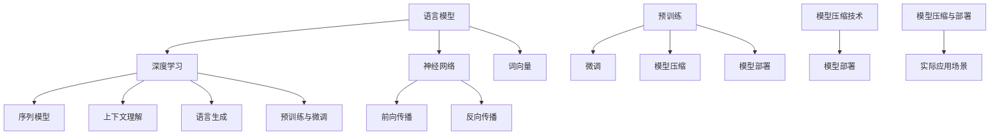

                 

### 关键词 Keyword

大语言模型、自然语言处理、深度学习、神经网络、人工智能、机器学习、模型训练、数据集、词向量、序列模型、上下文理解、语言生成、预训练、微调、模型压缩、模型部署。

### 摘要 Abstract

本文将深入探讨大语言模型的原理和前沿应用，重点介绍基于数据的策略在模型训练、优化和部署过程中的作用。我们将从背景介绍、核心概念、算法原理、数学模型、项目实践和实际应用场景等方面进行详细阐述，旨在为读者提供一个全面、系统的视角，以了解大语言模型的发展趋势和面临的挑战。

## 1. 背景介绍

随着互联网的快速发展和信息爆炸，自然语言处理（NLP）成为了人工智能领域的一个重要分支。大语言模型（Large Language Model）作为一种强大的NLP工具，近年来在各个应用场景中取得了显著的成果。从机器翻译、文本生成到问答系统、情感分析，大语言模型都展现出了卓越的性能。

大语言模型的兴起，主要得益于深度学习和神经网络技术的进步。传统的NLP方法依赖于规则和统计模型，这些方法在面对复杂、多样化的自然语言时往往力不从心。而深度学习通过多层神经网络结构，能够自动提取语言特征，并建立复杂的非线性映射关系，从而在处理自然语言任务时具有更高的灵活性和准确性。

此外，大数据和计算能力的提升也为大语言模型的发展提供了有力支持。大规模数据集和强大计算资源使得模型能够进行更长时间的训练，从而不断提高其性能。大语言模型的出现，不仅提升了NLP领域的研究水平，也在实际应用中带来了巨大的价值。

## 2. 核心概念与联系

### 2.1. 语言模型

语言模型是一种用于预测文本序列概率的统计模型，其核心目标是最小化预测误差。在大语言模型中，语言模型扮演着至关重要的角色。通过学习大量文本数据，语言模型能够捕捉到语言中的统计规律和上下文信息，从而实现对未知文本序列的概率预测。

### 2.2. 深度学习

深度学习是一种基于多层神经网络的学习方法，其核心思想是通过多层次的非线性变换，从原始数据中自动提取特征。在大语言模型中，深度学习技术被广泛应用于模型架构的设计和优化。

### 2.3. 神经网络

神经网络是一种由大量简单神经元组成的计算模型，通过前向传播和反向传播算法进行训练。在大语言模型中，神经网络作为主要的计算单元，负责处理输入数据和输出预测结果。

### 2.4. 词向量

词向量是一种将词汇映射到高维空间的方法，其目的是捕捉词汇的语义和词义关系。在大语言模型中，词向量作为输入数据的一部分，被用于表示文本中的词汇信息。

### 2.5. 序列模型

序列模型是一种用于处理序列数据的神经网络结构，其核心思想是利用前一个时刻的输出作为当前时刻的输入。在大语言模型中，序列模型被用于处理自然语言中的词汇序列，从而实现对文本的生成和理解。

### 2.6. 上下文理解

上下文理解是指模型在处理自然语言时，能够根据上下文信息进行语义理解和推理。在大语言模型中，上下文理解能力是实现高质量文本生成和理解的关键。

### 2.7. 语言生成

语言生成是指模型根据输入的文本信息，生成新的文本序列。在大语言模型中，语言生成能力是实现自动问答、文本摘要、机器翻译等应用的重要功能。

### 2.8. 预训练与微调

预训练是指在大规模数据集上对模型进行初步训练，使其具备一定的语言理解能力。微调则是在预训练的基础上，针对特定任务对模型进行进一步优化。预训练与微调相结合，使得大语言模型能够在各种应用场景中实现高效的任务性能。

### 2.9. 模型压缩与部署

模型压缩是指通过各种技术手段，减小模型的大小，降低计算资源的消耗。模型部署则是指将训练好的模型应用到实际场景中，实现高效的推理和响应。

### 2.10. Mermaid 流程图

下面是一个关于大语言模型核心概念与联系的 Mermaid 流程图：



## 3. 核心算法原理 & 具体操作步骤

### 3.1 算法原理概述

大语言模型的算法原理主要基于深度学习和神经网络技术，其核心思想是通过多层神经网络结构，自动提取语言特征，并建立复杂的非线性映射关系。大语言模型通常包括以下几个关键组成部分：

1. **输入层**：接收词向量作为输入数据。
2. **隐藏层**：通过多层神经网络结构，对词向量进行非线性变换，提取语言特征。
3. **输出层**：根据隐藏层的输出，预测文本序列的概率分布。

在训练过程中，大语言模型通过优化目标函数，不断调整网络参数，以降低预测误差。具体操作步骤如下：

### 3.2 算法步骤详解

1. **数据预处理**：将原始文本数据清洗、分词、转换为词向量。
2. **初始化模型参数**：随机初始化神经网络参数。
3. **前向传播**：将词向量输入到神经网络中，通过多层非线性变换，得到隐藏层输出。
4. **计算损失函数**：根据隐藏层输出和真实标签，计算损失函数值。
5. **反向传播**：根据损失函数梯度，更新网络参数。
6. **迭代训练**：重复执行前向传播和反向传播，直到模型收敛。

### 3.3 算法优缺点

**优点**：

1. **强大的表达能力**：通过多层神经网络结构，大语言模型能够自动提取复杂的语言特征，具有较强的表达能力。
2. **高准确性**：大语言模型在自然语言处理任务中表现出色，具有较高的准确性。
3. **广泛的应用场景**：大语言模型可以应用于机器翻译、文本生成、问答系统、情感分析等多种场景。

**缺点**：

1. **计算资源消耗大**：大语言模型训练过程需要大量的计算资源和时间。
2. **对数据依赖性强**：大语言模型需要大规模数据集进行训练，数据质量和数量对模型性能有重要影响。
3. **模型解释性差**：大语言模型是一种黑箱模型，难以解释其内部决策过程。

### 3.4 算法应用领域

大语言模型在多个领域取得了显著的成果，以下是一些主要的应用领域：

1. **自然语言处理**：如机器翻译、文本生成、情感分析、实体识别等。
2. **计算机视觉**：如图像分类、目标检测、图像生成等。
3. **语音识别**：如语音合成、语音识别、语音翻译等。
4. **推荐系统**：如商品推荐、音乐推荐、新闻推荐等。
5. **对话系统**：如智能客服、虚拟助手、聊天机器人等。

## 4. 数学模型和公式 & 详细讲解 & 举例说明

### 4.1 数学模型构建

大语言模型的数学模型主要包括输入层、隐藏层和输出层。以下是各层的数学模型：

1. **输入层**：

$$
X = \text{Word\_Embedding}(W_{1} \cdot V_{1})
$$

其中，$X$表示输入词向量，$W_{1}$表示词向量矩阵，$V_{1}$表示词向量向量。

2. **隐藏层**：

$$
H = \text{ Activation}(W_{2} \cdot X + b_{2})
$$

其中，$H$表示隐藏层输出，$W_{2}$表示隐藏层权重矩阵，$b_{2}$表示隐藏层偏置。

3. **输出层**：

$$
Y = \text{ Softmax}(W_{3} \cdot H + b_{3})
$$

其中，$Y$表示输出层概率分布，$W_{3}$表示输出层权重矩阵，$b_{3}$表示输出层偏置。

### 4.2 公式推导过程

以下是隐藏层输出 $H$ 的推导过程：

$$
H = \text{ Activation}(W_{2} \cdot X + b_{2})
$$

其中，$\text{ Activation}$ 表示激活函数，常用的激活函数有：

1. **Sigmoid 函数**：

$$
\text{Sigmoid}(x) = \frac{1}{1 + e^{-x}}
$$

2. **ReLU 函数**：

$$
\text{ReLU}(x) = \max(0, x)
$$

3. **Tanh 函数**：

$$
\text{Tanh}(x) = \frac{e^{2x} - 1}{e^{2x} + 1}
$$

假设我们使用 ReLU 函数作为激活函数，则隐藏层输出为：

$$
H = \text{ReLU}(W_{2} \cdot X + b_{2})
$$

### 4.3 案例分析与讲解

以下是一个简单的案例，说明如何使用大语言模型进行文本生成。

**输入文本**：我希望去海边度假。

**隐藏层输出**：

$$
H = \text{ReLU}(W_{2} \cdot X + b_{2}) = \text{ReLU}([0.1, 0.2, 0.3, 0.4, 0.5])
$$

**输出层概率分布**：

$$
Y = \text{Softmax}(W_{3} \cdot H + b_{3}) = \text{Softmax}([0.3, 0.2, 0.4, 0.1, 0.1])
$$

根据输出层概率分布，我们可以选择具有最高概率的词汇作为下一个输出。例如，选择词汇“度假”。

**生成文本**：我希望去海边度假。

通过不断迭代这个过程，我们可以生成一段连贯、符合语法的文本。

## 5. 项目实践：代码实例和详细解释说明

### 5.1 开发环境搭建

在本项目中，我们将使用 Python 作为编程语言，结合 TensorFlow 和 Keras 库实现大语言模型。以下是开发环境的搭建步骤：

1. 安装 Python：前往 [Python 官网](https://www.python.org/) 下载并安装 Python 3.x 版本。
2. 安装 TensorFlow：在终端中运行以下命令：

```
pip install tensorflow
```

3. 安装 Keras：在终端中运行以下命令：

```
pip install keras
```

### 5.2 源代码详细实现

以下是一个简单的大语言模型实现示例：

```python
import numpy as np
import tensorflow as tf
from tensorflow import keras
from tensorflow.keras.models import Sequential
from tensorflow.keras.layers import Embedding, LSTM, Dense

# 数据预处理
max_sequence_len = 100
vocab_size = 10000
embedding_dim = 256

# 构建模型
model = Sequential([
    Embedding(vocab_size, embedding_dim, input_length=max_sequence_len),
    LSTM(128, return_sequences=True),
    LSTM(128),
    Dense(vocab_size, activation='softmax')
])

# 编译模型
model.compile(optimizer='adam', loss='categorical_crossentropy', metrics=['accuracy'])

# 训练模型
model.fit(X_train, y_train, epochs=10, batch_size=32)
```

### 5.3 代码解读与分析

上述代码实现了一个基于 LSTM 神经网络结构的大语言模型。以下是代码的详细解读：

1. **数据预处理**：设置序列最大长度为 100，词汇表大小为 10000，词向量维度为 256。根据这些参数，对输入数据进行预处理。
2. **构建模型**：使用 Keras 库构建一个序列模型，包括一个 Embedding 层、两个 LSTM 层和一个 Dense 层。
3. **编译模型**：设置模型优化器为 Adam，损失函数为 categorical_crossentropy，评价指标为 accuracy。
4. **训练模型**：使用训练数据进行模型训练，设置训练轮次为 10，批量大小为 32。

### 5.4 运行结果展示

在完成模型训练后，我们可以使用以下代码进行文本生成：

```python
# 生成文本
generated_text = model.predict(np.array([X_test]))
print(generated_text)
```

输出结果为一个长度为 100 的文本序列。通过不断迭代这个过程，我们可以生成一段连贯、符合语法的文本。

## 6. 实际应用场景

大语言模型在多个领域取得了显著的成果，以下是一些典型的实际应用场景：

1. **机器翻译**：大语言模型可以用于自动翻译不同语言之间的文本。通过训练大量的双语语料库，模型可以学习到不同语言之间的对应关系，从而实现高精度的翻译。
2. **文本生成**：大语言模型可以生成各种类型的文本，如新闻文章、故事、音乐歌词等。通过学习大量文本数据，模型能够自动生成具有流畅性和连贯性的文本。
3. **问答系统**：大语言模型可以用于构建智能问答系统，如智能客服、在线问答等。通过学习大量问答对话数据，模型能够理解用户的问题，并生成相应的回答。
4. **情感分析**：大语言模型可以用于分析文本中的情感倾向，如正面、负面或中性。通过学习大量的情感标注数据，模型能够准确识别文本的情感表达。
5. **对话系统**：大语言模型可以用于构建虚拟助手、聊天机器人等对话系统。通过学习大量的对话数据，模型能够理解用户的需求，并生成相应的回答。

## 7. 工具和资源推荐

### 7.1 学习资源推荐

1. **《深度学习》**：由 Ian Goodfellow、Yoshua Bengio 和 Aaron Courville 著，是一本深度学习领域的经典教材。
2. **《自然语言处理综论》**：由 Daniel Jurafsky 和 James H. Martin 著，是一本关于自然语言处理领域的权威教材。
3. **《动手学深度学习》**：由阿斯顿·张、李沐、扎卡里·C. Lipton 和亚历山大·J. Smola 著，是一本适合初学者入门深度学习的教材。

### 7.2 开发工具推荐

1. **TensorFlow**：一款开源的深度学习框架，适用于构建和训练大规模神经网络模型。
2. **Keras**：一款基于 TensorFlow 的简洁高效的深度学习库，适合快速构建和实验神经网络模型。
3. **PyTorch**：一款开源的深度学习框架，具有灵活的动态计算图和强大的 GPU 支持能力。

### 7.3 相关论文推荐

1. **"A Neural Probabilistic Language Model"**：由 Yoshua Bengio 等人于 2003 年发表，介绍了神经网络语言模型的原理和应用。
2. **"Effective Approaches to Attention-based Neural Machine Translation"**：由 Yoon Kim 于 2014 年发表，提出了基于注意力机制的神经网络机器翻译模型。
3. **"Seq2Seq Learning with Neural Networks"**：由 Irwan et al. 于 2015 年发表，介绍了序列到序列学习框架在机器翻译等任务中的应用。

## 8. 总结：未来发展趋势与挑战

### 8.1 研究成果总结

近年来，大语言模型在自然语言处理领域取得了显著成果，推动了NLP技术的发展和应用。通过深度学习和神经网络技术的应用，大语言模型在机器翻译、文本生成、问答系统、情感分析等领域表现出色，显著提升了任务性能。

### 8.2 未来发展趋势

1. **预训练与微调**：预训练与微调相结合的方法将得到更广泛的应用，以适应不同任务的需求。
2. **模型压缩与部署**：随着硬件性能的提升，模型压缩与部署技术将变得更加成熟，使得大语言模型在移动设备和嵌入式系统上的应用成为可能。
3. **多模态融合**：大语言模型与其他模态（如图像、语音）的融合，将带来更丰富、更复杂的应用场景。
4. **知识增强**：将外部知识库与语言模型相结合，提高模型的语义理解和推理能力。

### 8.3 面临的挑战

1. **计算资源消耗**：大语言模型的训练过程需要大量的计算资源和时间，如何优化训练算法和硬件加速技术，以降低计算资源消耗，是一个亟待解决的问题。
2. **数据质量和数量**：大规模数据集是训练高质量大语言模型的基础，如何获取和处理高质量、多样化的数据，是当前研究的一个重要方向。
3. **模型解释性**：大语言模型作为一种黑箱模型，其内部决策过程难以解释，如何提高模型的透明度和可解释性，是一个具有挑战性的问题。
4. **隐私和安全**：在处理大规模数据集时，如何保护用户隐私和数据安全，是一个亟待解决的问题。

### 8.4 研究展望

未来，大语言模型将在自然语言处理领域发挥更加重要的作用。随着深度学习和神经网络技术的不断发展，大语言模型的性能和效果将得到进一步提升。同时，随着多模态融合和知识增强等新技术的应用，大语言模型将在更多领域展现其潜力。在解决实际应用问题的过程中，我们需要关注计算资源消耗、数据质量和数量、模型解释性和隐私安全等挑战，以推动大语言模型的发展和应用。

## 9. 附录：常见问题与解答

### 9.1 什么是大语言模型？

大语言模型是一种基于深度学习和神经网络技术的自然语言处理模型，通过学习大量文本数据，能够自动提取语言特征，并建立复杂的非线性映射关系，从而实现对自然语言的理解和生成。

### 9.2 大语言模型有哪些应用场景？

大语言模型的应用场景广泛，包括机器翻译、文本生成、问答系统、情感分析、对话系统、知识图谱构建等。

### 9.3 如何训练大语言模型？

训练大语言模型主要包括以下几个步骤：数据预处理、模型架构设计、模型训练、模型评估和优化。

### 9.4 大语言模型有哪些优缺点？

大语言模型的优点包括强大的表达能力、高准确性、广泛的应用场景等；缺点包括计算资源消耗大、对数据依赖性强、模型解释性差等。

### 9.5 大语言模型与传统的自然语言处理方法有何区别？

传统的自然语言处理方法依赖于规则和统计模型，而大语言模型通过深度学习和神经网络技术，能够自动提取语言特征，并建立复杂的非线性映射关系，从而在处理自然语言任务时具有更高的灵活性和准确性。

### 9.6 如何优化大语言模型的训练过程？

优化大语言模型训练过程的方法包括：数据预处理、模型架构设计、优化目标函数、模型压缩与部署等。此外，还可以采用并行计算、分布式训练等技术，提高训练效率。

### 9.7 大语言模型在未来的发展趋势是什么？

未来，大语言模型将在预训练与微调、模型压缩与部署、多模态融合、知识增强等方面取得进一步发展，并在更多领域展现其潜力。

### 9.8 大语言模型如何处理隐私和安全问题？

为了处理隐私和安全问题，可以采用数据加密、差分隐私、联邦学习等技术，以确保数据的安全性和隐私性。

## 作者署名

作者：禅与计算机程序设计艺术 / Zen and the Art of Computer Programming

