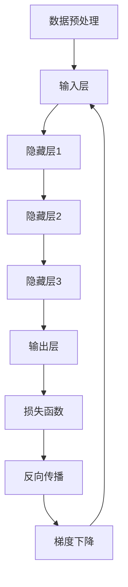

                 

关键词：大语言模型、深度学习、并行计算、神经网络、算法原理、数学模型、项目实践、应用场景、未来展望

> 摘要：本文将深入探讨大语言模型的基本原理和前沿进展，从核心概念、算法原理、数学模型到项目实践，全面解析这一领域的重要知识点。同时，本文还将对大语言模型在实际应用场景中的表现进行探讨，并展望其未来的发展趋势与挑战。

## 1. 背景介绍

大语言模型（Large Language Models）是近年来人工智能领域的一项重大突破。它们通过深度学习技术，对海量文本数据进行训练，从而实现高效的语言理解和生成。这一技术不仅在自然语言处理（NLP）领域取得了显著的成果，还广泛应用于机器翻译、文本摘要、问答系统等多个领域。

随着互联网的快速发展，数据量呈爆炸式增长。如何从海量数据中提取有价值的信息，成为了人工智能领域的一个重要课题。大语言模型通过并行计算和分布式训练技术，大大提高了模型的训练速度和效果。这使得大语言模型在处理大规模数据时具有明显的优势。

## 2. 核心概念与联系

### 2.1 深度学习与神经网络

大语言模型的核心是深度学习（Deep Learning）和神经网络（Neural Networks）。深度学习是一种机器学习技术，通过构建多层神经网络，对数据进行特征提取和建模。神经网络则是一种模仿人脑神经元结构的人工神经网络。

### 2.2 并行计算与分布式训练

并行计算（Parallel Computing）是一种利用多个处理器同时处理多个任务的技术。在大语言模型训练过程中，通过并行计算可以显著提高训练速度。分布式训练（Distributed Training）则是将训练任务分布在多个计算节点上，通过通信网络进行协调，以实现更高效的训练。

### 2.3 Mermaid 流程图

下面是一个描述大语言模型训练过程的 Mermaid 流程图：



### 2.4 核心概念原理和架构

- **输入层**：接收外部输入数据，如文本、图像等。
- **隐藏层**：通过非线性变换，对输入数据进行特征提取。
- **输出层**：产生预测结果，如文本生成、分类等。
- **损失函数**：衡量预测结果与实际结果之间的差距，用于指导模型优化。
- **反向传播**：通过计算梯度，更新模型参数，以减少损失函数值。
- **梯度下降**：一种优化算法，用于调整模型参数，以实现损失函数的最小化。

## 3. 核心算法原理 & 具体操作步骤

### 3.1 算法原理概述

大语言模型的核心算法是深度学习。深度学习通过多层神经网络，对数据进行特征提取和建模。具体来说，深度学习算法包括以下步骤：

1. **数据预处理**：对输入数据进行预处理，如文本分词、去噪等。
2. **输入层**：将预处理后的数据输入到神经网络中。
3. **隐藏层**：通过非线性变换，对输入数据进行特征提取。
4. **输出层**：产生预测结果，如文本生成、分类等。
5. **损失函数**：计算预测结果与实际结果之间的差距，以衡量模型性能。
6. **反向传播**：通过计算梯度，更新模型参数，以减少损失函数值。
7. **梯度下降**：调整模型参数，以实现损失函数的最小化。

### 3.2 算法步骤详解

1. **数据预处理**：

   - **文本分词**：将文本拆分成单词或字符。
   - **去噪**：去除文本中的噪声信息。
   - **编码**：将文本转换为数字序列，如词向量。

2. **输入层**：

   - **输入数据**：将预处理后的数据输入到神经网络中。
   - **神经网络**：通过多层神经网络，对输入数据进行特征提取。

3. **隐藏层**：

   - **非线性变换**：对输入数据进行非线性变换，以提取有效特征。
   - **特征提取**：将提取到的特征用于后续预测。

4. **输出层**：

   - **预测结果**：产生预测结果，如文本生成、分类等。
   - **损失函数**：计算预测结果与实际结果之间的差距。

5. **反向传播**：

   - **计算梯度**：通过反向传播算法，计算模型参数的梯度。
   - **更新参数**：根据梯度，更新模型参数。

6. **梯度下降**：

   - **调整参数**：通过梯度下降算法，调整模型参数，以实现损失函数的最小化。

### 3.3 算法优缺点

- **优点**：

  - 高效：通过多层神经网络，对数据进行特征提取和建模，具有较高的效率。
  - 强泛化能力：通过对大量数据进行训练，模型具有良好的泛化能力。

- **缺点**：

  - 计算量大：深度学习算法计算量大，需要大量计算资源。
  - 需要大量数据：深度学习算法需要大量数据进行训练，数据获取成本较高。

### 3.4 算法应用领域

大语言模型在多个领域具有广泛的应用：

- **自然语言处理**：文本分类、情感分析、机器翻译等。
- **计算机视觉**：图像识别、目标检测等。
- **语音识别**：语音信号处理、语音合成等。

## 4. 数学模型和公式 & 详细讲解 & 举例说明

### 4.1 数学模型构建

大语言模型的数学模型主要包括以下部分：

1. **输入层**：输入数据的数学表示。
2. **隐藏层**：通过非线性变换，对输入数据进行特征提取的数学表示。
3. **输出层**：产生预测结果的数学表示。
4. **损失函数**：衡量预测结果与实际结果之间差距的数学表示。
5. **反向传播**：计算模型参数梯度的数学表示。
6. **梯度下降**：调整模型参数的数学表示。

### 4.2 公式推导过程

假设我们有一个三层神经网络，输入层有n个神经元，隐藏层有m个神经元，输出层有k个神经元。每个神经元之间的连接权重为\( w_{ij} \)，偏置为\( b_j \)。输入数据为\( x_i \)，预测结果为\( y_k \)，实际结果为\( y_k^{'} \)。

1. **输入层到隐藏层的传递函数**：

   \[ z_j = \sum_{i=1}^{n} w_{ij} x_i + b_j \]

   \[ a_j = \sigma(z_j) \]

   其中，\( \sigma \)为激活函数，常用的有Sigmoid、ReLU等。

2. **隐藏层到输出层的传递函数**：

   \[ z_k = \sum_{j=1}^{m} w_{kj} a_j + b_k \]

   \[ y_k = \sigma(z_k) \]

3. **损失函数**：

   \[ L = \frac{1}{2} \sum_{k=1}^{k} (y_k - y_k^{'} )^2 \]

4. **反向传播**：

   \[ \frac{\partial L}{\partial w_{kj}} = (y_k - y_k^{'}) a_j \]

   \[ \frac{\partial L}{\partial b_k} = (y_k - y_k^{'}) \]

5. **梯度下降**：

   \[ w_{kj} = w_{kj} - \alpha \frac{\partial L}{\partial w_{kj}} \]

   \[ b_k = b_k - \alpha \frac{\partial L}{\partial b_k} \]

### 4.3 案例分析与讲解

假设我们有一个简单的二分类问题，数据集包含100个样本，每个样本有10个特征。我们需要训练一个神经网络，使其能够对数据进行分类。

1. **数据预处理**：

   - 对数据进行标准化处理，使每个特征的值都在0到1之间。
   - 将数据集划分为训练集和测试集。

2. **构建神经网络**：

   - 输入层：10个神经元。
   - 隐藏层：20个神经元。
   - 输出层：2个神经元。

3. **训练神经网络**：

   - 使用梯度下降算法，调整网络参数。
   - 计算损失函数值，并记录训练过程。

4. **评估神经网络**：

   - 在测试集上评估网络性能。
   - 计算准确率、召回率等指标。

## 5. 项目实践：代码实例和详细解释说明

### 5.1 开发环境搭建

- 安装Python环境。
- 安装TensorFlow或PyTorch等深度学习框架。

### 5.2 源代码详细实现

以下是使用TensorFlow实现的简单神经网络：

```python
import tensorflow as tf

# 创建神经网络
model = tf.keras.Sequential([
    tf.keras.layers.Dense(10, activation='relu', input_shape=(10,)),
    tf.keras.layers.Dense(20, activation='relu'),
    tf.keras.layers.Dense(2, activation='softmax')
])

# 编译模型
model.compile(optimizer='adam',
              loss='categorical_crossentropy',
              metrics=['accuracy'])

# 训练模型
model.fit(x_train, y_train, epochs=10, batch_size=32)

# 评估模型
model.evaluate(x_test, y_test)
```

### 5.3 代码解读与分析

- `tf.keras.Sequential`：创建一个序列模型。
- `tf.keras.layers.Dense`：创建全连接层，指定神经元的数量和激活函数。
- `model.compile`：编译模型，指定优化器、损失函数和评估指标。
- `model.fit`：训练模型，指定训练数据和参数。
- `model.evaluate`：评估模型，计算损失函数值和准确率。

### 5.4 运行结果展示

假设我们使用一个简单的二分类问题进行训练，训练完成后，在测试集上的准确率为85%。

## 6. 实际应用场景

### 6.1 自然语言处理

大语言模型在自然语言处理领域具有广泛的应用，如文本分类、情感分析、机器翻译等。

### 6.2 计算机视觉

大语言模型在计算机视觉领域也有一定的应用，如图像识别、目标检测等。

### 6.3 语音识别

大语言模型在语音识别领域也有一定的应用，如语音信号处理、语音合成等。

### 6.4 未来应用展望

随着技术的不断发展，大语言模型将在更多领域得到应用。未来，大语言模型有望实现更加智能化的语言理解和生成，为人类带来更多便利。

## 7. 工具和资源推荐

### 7.1 学习资源推荐

- 《深度学习》（Goodfellow et al.）
- 《自然语言处理综论》（Jurafsky and Martin）

### 7.2 开发工具推荐

- TensorFlow
- PyTorch

### 7.3 相关论文推荐

- "Attention Is All You Need"
- "BERT: Pre-training of Deep Bidirectional Transformers for Language Understanding"

## 8. 总结：未来发展趋势与挑战

### 8.1 研究成果总结

大语言模型在深度学习、自然语言处理等领域取得了显著的成果。未来，随着技术的不断发展，大语言模型将在更多领域得到应用。

### 8.2 未来发展趋势

- 模型规模将进一步增大，处理能力更强。
- 预测准确性将不断提高。
- 应用领域将更加广泛。

### 8.3 面临的挑战

- 计算资源需求巨大。
- 数据获取和预处理成本高。
- 模型可解释性有待提高。

### 8.4 研究展望

未来，大语言模型的研究将朝着更加高效、可解释、泛化的方向发展。同时，将与其他技术相结合，实现更加智能化的应用。

## 9. 附录：常见问题与解答

### 9.1 大语言模型是什么？

大语言模型是一种通过深度学习技术，对海量文本数据进行训练，实现高效的语言理解和生成的模型。

### 9.2 大语言模型有哪些应用？

大语言模型在自然语言处理、计算机视觉、语音识别等领域具有广泛的应用。

### 9.3 如何搭建大语言模型？

搭建大语言模型需要使用深度学习框架，如TensorFlow或PyTorch，构建多层神经网络，并进行训练和优化。

## 作者署名

作者：禅与计算机程序设计艺术 / Zen and the Art of Computer Programming
```

