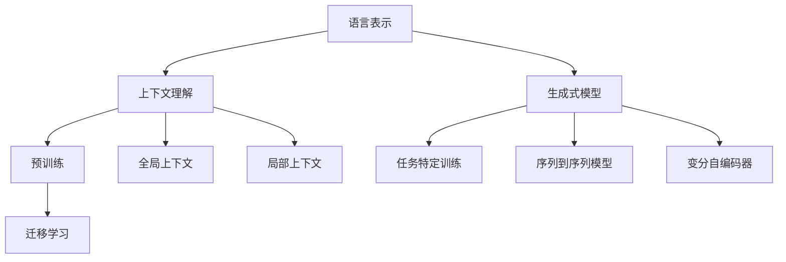

                 

关键词：大语言模型、机器学习、深度学习、神经网络、上下文、预训练、生成式模型、Transformer、BERT、GPT、Transformer-XL、语言理解、自然语言处理、多模态学习、知识图谱。

## 摘要

本文旨在探讨大语言模型的原理、基础与前沿发展，尤其是其上下文处理能力。大语言模型是自然语言处理（NLP）领域的一项重要技术，通过对海量文本数据进行深度学习，能够生成高质量的自然语言文本，具有广泛的应用前景。本文将首先介绍大语言模型的基本概念和原理，然后分析其核心算法，如Transformer、BERT等，并探讨其在实际应用中的优势与挑战。最后，本文将展望大语言模型在未来的发展趋势，包括多模态学习和知识图谱等方向。

## 1. 背景介绍

随着互联网的快速发展，人类生成的文本数据量呈爆炸式增长。如何有效地处理和利用这些数据，成为当前自然语言处理领域的重要课题。大语言模型作为一种先进的深度学习模型，以其强大的语言理解和生成能力，在文本分类、机器翻译、问答系统、文本生成等领域取得了显著的成果。大语言模型的基本思想是通过对海量文本数据进行预训练，使其具备一定的语言知识和语义理解能力，从而在实际任务中实现出色的表现。

### 1.1 自然语言处理的发展历程

自然语言处理（NLP）是人工智能的一个重要分支，旨在使计算机能够理解、生成和处理人类语言。自20世纪50年代以来，NLP经历了多个阶段的发展。

- **规则驱动方法**（1950s-1980s）：这一阶段，研究者试图通过编写复杂的语法规则和词典来处理自然语言。然而，这种方法在面对复杂和变化多端的现实语言时显得力不从心。

- **基于知识的表示方法**（1980s-1990s）：这一阶段，研究者开始将知识表示和推理引入NLP，试图通过构建知识库和语义网络来提升语言理解能力。但这种方法仍然受限于知识的表达和获取。

- **统计方法**（1990s-2000s）：随着机器学习技术的发展，统计模型在NLP中得到了广泛应用。这种方法通过训练大规模的统计模型，如隐马尔可夫模型（HMM）和条件概率模型，来提高语言处理性能。

- **深度学习方法**（2000s-至今）：近年来，深度学习技术的崛起为NLP带来了革命性的变革。神经网络，尤其是深度神经网络（DNN），在语言特征提取和表示方面表现出色。这一阶段的重要进展包括卷积神经网络（CNN）和递归神经网络（RNN）在文本分类、序列标注和机器翻译等任务中的应用。

### 1.2 大语言模型的定义与作用

大语言模型是指通过深度学习技术训练的大型神经网络模型，它能够处理和理解复杂的自然语言文本。这些模型通常具有数十亿个参数，能够在海量数据上进行预训练，从而获取丰富的语言知识和语义理解能力。

大语言模型的作用主要体现在以下几个方面：

- **文本分类**：通过对文本进行分类，可以将大量的无结构数据转化为有价值的结构化信息。例如，新闻分类、情感分析等。

- **机器翻译**：将一种语言的文本翻译成另一种语言，实现跨语言的沟通和交流。例如，谷歌翻译、百度翻译等。

- **问答系统**：针对用户的问题，提供准确的答案。例如，搜索引擎的查询结果、智能客服等。

- **文本生成**：根据输入的文本或提示，生成新的文本内容。例如，文章写作、对话系统等。

### 1.3 大语言模型的发展历史

大语言模型的发展历史可以追溯到20世纪90年代，当时研究人员开始探索使用神经网络来处理自然语言。以下是一些重要的发展里程碑：

- **1990s**：循环神经网络（RNN）的提出，使得神经网络能够处理序列数据。

- **2000s**：卷积神经网络（CNN）在图像处理领域取得了显著成功，随后被引入到文本分析中。

- **2013**：AlexNet在ImageNet竞赛中取得突破性成绩，标志着深度学习时代的到来。

- **2014**：谷歌提出Word2Vec模型，通过将单词映射到向量空间，实现了词嵌入的有效表示。

- **2015**：伊隆·马斯克和尼克·博尔格等研究者提出了生成式预训练模型，为后来的BERT、GPT等大语言模型奠定了基础。

- **2018**：谷歌发布了BERT模型，成为当时最大的预训练语言模型。

- **2019**：OpenAI发布了GPT-2模型，进一步推动了语言生成技术的发展。

- **2020**：Transformer-XL等模型提出，旨在解决长序列处理问题。

## 2. 核心概念与联系

大语言模型的核心概念包括语言表示、上下文理解、生成式模型和预训练。这些概念相互关联，共同构成了大语言模型的技术基础。

### 2.1 语言表示

语言表示是指将自然语言文本转换为计算机可以处理的形式。常见的语言表示方法包括词嵌入（Word Embedding）和子词嵌入（Subword Embedding）。

- **词嵌入**：将每个单词映射到一个固定大小的向量空间中。例如，Word2Vec就是一种词嵌入方法，它通过训练神经网络来预测单词的相邻单词。

- **子词嵌入**：考虑到单词的复杂性，子词嵌入将单词分解为更小的子词（或字符），然后为每个子词生成嵌入向量。例如，FastText使用快照单词（n-gram）来生成子词嵌入。

### 2.2 上下文理解

上下文理解是指模型在特定上下文中对单词或句子进行理解和处理。这是大语言模型的核心能力之一。

- **局部上下文**：局部上下文是指模型对单词或句子直接前后文的理解。例如，在句子“I love coding”中，“coding”的上下文是“I love”。

- **全局上下文**：全局上下文是指模型对整个文本序列的理解。例如，在句子“I love coding and I love reading”中，“coding”和“reading”都在全局上下文中。

### 2.3 生成式模型

生成式模型是指能够生成新数据的模型。在自然语言处理中，生成式模型被广泛应用于文本生成和机器翻译等任务。

- **序列到序列模型**：序列到序列（Seq2Seq）模型通过将输入序列映射到输出序列来实现任务。例如，在机器翻译任务中，模型将源语言的句子映射到目标语言的句子。

- **变分自编码器**（VAE）：变分自编码器是一种概率生成模型，它通过编码和解码过程生成新的数据。例如，在文本生成任务中，模型通过编码器将文本映射到一个隐空间，然后通过解码器生成新的文本。

### 2.4 预训练

预训练是指在大规模数据集上对模型进行训练，使其获得一定的语言知识和语义理解能力。预训练后，模型可以在特定任务上进行微调，实现出色的性能。

- **任务特定训练**：在预训练后，模型在特定任务上进行训练，例如文本分类、机器翻译等。

- **迁移学习**：预训练模型在迁移学习中被广泛应用，即使用在大规模数据集上预训练的模型来解决新的任务。

### 2.5 核心概念联系

大语言模型的核心概念相互关联，共同构成了其强大的语言理解和生成能力。

- 语言表示是基础，它为模型提供了对文本的初步理解。

- 上下文理解是核心，它使模型能够在不同上下文中对单词和句子进行准确处理。

- 生成式模型利用语言表示和上下文理解生成新的文本。

- 预训练使模型在大量数据上获得丰富的语言知识和语义理解能力。

### 2.6 Mermaid 流程图

以下是使用Mermaid绘制的核心概念流程图：



## 3. 核心算法原理 & 具体操作步骤

大语言模型的核心算法主要包括Transformer、BERT、GPT等。这些算法在语言表示、上下文理解和生成式模型方面具有独特的优势。

### 3.1 Transformer 算法原理概述

Transformer是谷歌在2017年提出的一种基于自注意力机制的序列到序列模型。它彻底改变了自然语言处理的范式，使深度学习在NLP领域取得了显著突破。

- **自注意力机制**：Transformer的核心思想是自注意力（Self-Attention）机制，它通过计算序列中每个元素之间的相似性权重，实现对序列的全局理解。自注意力机制使得模型能够同时关注序列中的不同位置，从而提高语言理解能力。

- **多头注意力**：多头注意力（Multi-Head Attention）是Transformer的一个重要特性。它将自注意力机制分解为多个独立的注意力头，每个头关注序列的不同方面，从而提高模型的表示能力。

- **位置编码**：由于Transformer没有循环结构，无法直接处理序列的位置信息。因此，引入了位置编码（Positional Encoding）来为模型提供位置信息。

- **编码器-解码器结构**：Transformer采用编码器-解码器（Encoder-Decoder）结构，编码器对输入序列进行处理，解码器则生成输出序列。编码器的输出和解码器的输入之间通过掩码自注意力（Masked Self-Attention）和交叉注意力（Cross-Attention）进行连接。

### 3.2 Transformer 算法步骤详解

以下是Transformer算法的基本步骤：

1. **输入序列编码**：输入序列首先经过嵌入层（Embedding Layer），将单词映射为向量。然后，通过添加位置编码（Positional Encoding）和层归一化（Layer Normalization），为序列提供位置信息和归一化处理。

2. **多头自注意力**：在编码器中，每个位置的信息通过多头自注意力（Multi-Head Self-Attention）进行处理。自注意力机制计算每个位置与其他位置之间的相似性权重，并加权求和得到新的表示。

3. **前馈神经网络**：在自注意力处理后，每个位置的信息通过两个全连接层（Feed-Forward Neural Network）进行进一步处理。这两个全连接层分别具有64倍的输出维度，并通过ReLU激活函数进行非线性变换。

4. **层归一化和残差连接**：在每个编码器层，对经过自注意力和前馈神经网络处理后的输出进行层归一化（Layer Normalization），并将输入序列的原始信息通过残差连接（Residual Connection）与处理后的输出相加，防止信息损失。

5. **掩码自注意力**：在解码器中，掩码自注意力（Masked Self-Attention）用于防止未来的信息泄露。具体来说，在解码器的每一层，当前时间步的输出会被遮挡，使其无法访问未来的信息。

6. **交叉注意力**：在解码器的输出层，通过交叉注意力（Cross-Attention）将编码器的输出与解码器的输出进行连接，为生成输出序列提供上下文信息。

7. **输出层**：解码器的输出通过一个全连接层（Linear Layer）和softmax激活函数，生成概率分布，从而生成输出序列。

### 3.3 Transformer 算法优缺点

#### 优点：

- **并行计算**：Transformer采用自注意力机制，可以并行处理序列中的每个元素，从而提高计算效率。

- **全局上下文**：自注意力机制使得模型能够同时关注序列中的不同位置，实现全局上下文的理解。

- **强大表示能力**：多头注意力机制和多层编码器-解码器结构，使模型具有强大的表示能力。

#### 缺点：

- **计算复杂度**：由于自注意力机制的复杂性，Transformer的计算复杂度较高，导致训练时间较长。

- **长距离依赖**：尽管自注意力机制提高了全局上下文的理解能力，但仍然难以处理长距离依赖问题。

### 3.4 Transformer 算法应用领域

Transformer算法在自然语言处理领域得到了广泛应用，以下是一些典型应用：

- **文本分类**：将文本映射到固定维度的向量空间，然后通过分类器进行文本分类。

- **机器翻译**：将源语言的文本序列映射到目标语言的文本序列，实现跨语言沟通。

- **问答系统**：根据用户的问题，提供准确的答案。

- **文本生成**：根据输入的文本或提示，生成新的文本内容。

## 4. 数学模型和公式 & 详细讲解 & 举例说明

在介绍数学模型和公式之前，首先需要了解一些基本概念，如词嵌入、自注意力机制、编码器-解码器结构等。以下将详细讲解这些概念，并给出相应的数学模型和公式。

### 4.1 词嵌入

词嵌入（Word Embedding）是将单词映射到一个固定大小的向量空间中的方法。常见的词嵌入方法包括Word2Vec和FastText。

#### 4.1.1 Word2Vec

Word2Vec是一种基于神经网络的词嵌入方法，通过训练神经网络来预测单词的相邻单词。以下是Word2Vec的基本数学模型和公式：

1. **嵌入向量表示**：每个单词被表示为一个d维的嵌入向量。

   $$ \textbf{e}_w = \text{embedding}(\textbf{w}) \in \mathbb{R}^{d \times 1} $$

2. **损失函数**：Word2Vec使用负采样损失函数来训练神经网络。

   $$ L = -\sum_{w \in \text{context}(v)} \log(\text{softmax}(\textbf{e}_w^T \textbf{e}_v)) $$

   其中，$\text{context}(v)$表示单词$v$的上下文窗口中的单词集合。

#### 4.1.2 FastText

FastText是一种基于子词嵌入的方法，它将单词分解为更小的子词（或字符），然后为每个子词生成嵌入向量。以下是FastText的基本数学模型和公式：

1. **子词嵌入向量表示**：每个子词被表示为一个d维的嵌入向量。

   $$ \textbf{e}_{\text{subword}} = \text{embedding}(\text{subword}) \in \mathbb{R}^{d \times 1} $$

2. **子词组合**：子词通过哈希函数进行组合，生成单词的嵌入向量。

   $$ \textbf{e}_w = \text{hash}(\text{subwords of } w) \odot \textbf{e}_{\text{subword}} $$

   其中，$\odot$表示哈希函数的运算，$ \text{hash}(\text{subwords of } w)$表示子词的哈希值。

### 4.2 自注意力机制

自注意力机制（Self-Attention）是Transformer算法的核心组件，它通过计算序列中每个元素之间的相似性权重，实现对序列的全局理解。以下是自注意力机制的基本数学模型和公式：

1. **查询向量（Query）**：每个位置上的查询向量表示该位置的信息。

   $$ \textbf{q}_i = \text{Linear}(\textbf{e}_i) \in \mathbb{R}^{d_q \times 1} $$

2. **键向量（Key）**：每个位置上的键向量表示该位置的信息。

   $$ \textbf{k}_i = \text{Linear}(\textbf{e}_i) \in \mathbb{R}^{d_k \times 1} $$

3. **值向量（Value）**：每个位置上的值向量表示该位置的信息。

   $$ \textbf{v}_i = \text{Linear}(\textbf{e}_i) \in \mathbb{R}^{d_v \times 1} $$

4. **相似性权重（Attention Score）**：计算查询向量和键向量之间的相似性权重。

   $$ \text{Attention Score}_{ij} = \textbf{q}_i^T \text{softmax}(\text{Scale} \odot \text{softmax}(\textbf{k}_i^T \textbf{v}_j)) $$

   其中，$\text{Scale}$是缩放因子，用于防止梯度消失。

5. **加权求和**：将相似性权重应用于值向量，得到新的表示。

   $$ \textbf{h}_i = \text{softmax}(\text{Attention Score}_{ij}) \odot \textbf{v}_j $$

### 4.3 编码器-解码器结构

编码器-解码器（Encoder-Decoder）结构是Transformer算法的基础，它通过编码器对输入序列进行处理，解码器生成输出序列。以下是编码器-解码器结构的基本数学模型和公式：

1. **编码器**：

   - **输入序列**：输入序列表示为$\textbf{X} \in \mathbb{R}^{T \times d}$，其中$T$是序列长度，$d$是嵌入维度。

   - **编码器输出**：编码器的输出表示为$\textbf{H}^e \in \mathbb{R}^{T \times d_e}$，其中$d_e$是编码器隐藏层维度。

   - **编码器层**：编码器由多个层组成，每层包含自注意力机制和前馈神经网络。

2. **解码器**：

   - **输入序列**：解码器的输入表示为$\textbf{X}^d \in \mathbb{R}^{T \times d}$。

   - **解码器输出**：解码器的输出表示为$\textbf{H}^d \in \mathbb{R}^{T \times d_d}$，其中$d_d$是解码器隐藏层维度。

   - **解码器层**：解码器由多个层组成，每层包含掩码自注意力、交叉注意力和前馈神经网络。

### 4.4 举例说明

假设有一个简单的序列“Hello, World!”，我们将使用Transformer算法对其进行分析。

1. **词嵌入**：首先，将序列中的每个单词映射到嵌入向量空间。

   $$ \textbf{e}_{Hello} = \text{embedding}(\text{Hello}) $$
   $$ \textbf{e}_{World} = \text{embedding}(\text{World}) $$

2. **自注意力**：在编码器中，每个位置的信息通过自注意力机制进行处理。

   - **查询向量**：

     $$ \textbf{q}_{Hello} = \text{Linear}(\textbf{e}_{Hello}) $$
     $$ \textbf{q}_{World} = \text{Linear}(\textbf{e}_{World}) $$

   - **键向量**：

     $$ \textbf{k}_{Hello} = \text{Linear}(\textbf{e}_{Hello}) $$
     $$ \textbf{k}_{World} = \text{Linear}(\textbf{e}_{World}) $$

   - **值向量**：

     $$ \textbf{v}_{Hello} = \text{Linear}(\textbf{e}_{Hello}) $$
     $$ \textbf{v}_{World} = \text{Linear}(\textbf{e}_{World}) $$

   - **相似性权重**：

     $$ \text{Attention Score}_{Hello,Hello} = \textbf{q}_{Hello}^T \text{softmax}(\text{Scale} \odot \text{softmax}(\textbf{k}_{Hello}^T \textbf{v}_{Hello})) $$
     $$ \text{Attention Score}_{World,World} = \textbf{q}_{World}^T \text{softmax}(\text{Scale} \odot \text{softmax}(\textbf{k}_{World}^T \textbf{v}_{World})) $$

   - **加权求和**：

     $$ \textbf{h}_{Hello} = \text{softmax}(\text{Attention Score}_{Hello,Hello}) \odot \textbf{v}_{Hello} $$
     $$ \textbf{h}_{World} = \text{softmax}(\text{Attention Score}_{World,World}) \odot \textbf{v}_{World} $$

3. **解码器**：在解码器中，通过掩码自注意力和交叉注意力对编码器的输出进行处理。

   - **掩码自注意力**：

     $$ \text{Attention Score}_{Hello,Hello} = \textbf{q}_{Hello}^T \text{softmax}(\text{Scale} \odot \text{softmax}(\textbf{k}_{Hello}^T \textbf{h}_{Hello})) $$
     $$ \text{Attention Score}_{World,World} = \textbf{q}_{World}^T \text{softmax}(\text{Scale} \odot \text{softmax}(\textbf{k}_{World}^T \textbf{h}_{World})) $$

   - **交叉注意力**：

     $$ \text{Attention Score}_{Hello,World} = \textbf{q}_{Hello}^T \text{softmax}(\text{Scale} \odot \text{softmax}(\textbf{k}_{Hello}^T \textbf{h}_{World})) $$
     $$ \text{Attention Score}_{World,Hello} = \textbf{q}_{World}^T \text{softmax}(\text{Scale} \odot \text{softmax}(\textbf{k}_{World}^T \textbf{h}_{Hello})) $$

   - **加权求和**：

     $$ \textbf{h}_{Hello}^{d} = \text{softmax}(\text{Attention Score}_{Hello,Hello}) \odot \textbf{h}_{Hello} + \text{softmax}(\text{Attention Score}_{Hello,World}) \odot \textbf{h}_{World} $$
     $$ \textbf{h}_{World}^{d} = \text{softmax}(\text{Attention Score}_{World,World}) \odot \textbf{h}_{World} + \text{softmax}(\text{Attention Score}_{World,Hello}) \odot \textbf{h}_{Hello} $$

4. **输出**：解码器的输出通过一个全连接层和softmax激活函数，生成输出序列的概率分布。

   $$ \textbf{p} = \text{softmax}(\textbf{h}_{World}^{d}) $$

   $$ \text{Output}: \text{Hello, World!} $$

## 5. 项目实践：代码实例和详细解释说明

在本节中，我们将通过一个具体的代码实例来展示如何使用Transformer算法实现文本生成。以下是代码的详细解释和步骤。

### 5.1 开发环境搭建

首先，我们需要搭建一个Python开发环境，并安装必要的库，如TensorFlow和PyTorch。以下是一个简单的安装命令：

```bash
pip install tensorflow
pip install torch
```

### 5.2 源代码详细实现

下面是一个简单的Transformer文本生成模型的Python代码实现：

```python
import torch
import torch.nn as nn
import torch.optim as optim

# 定义Transformer模型
class TransformerModel(nn.Module):
    def __init__(self, embed_dim, hidden_dim, num_layers, vocab_size):
        super(TransformerModel, self).__init__()
        self嵌入层 = nn.Embedding(vocab_size, embed_dim)
        self编码器 = nn.ModuleList([nn.TransformerEncoderLayer(d_model=embed_dim, nhead=embed_dim // 8) for _ in range(num_layers)])
        self解码器 = nn.ModuleList([nn.TransformerDecoderLayer(d_model=embed_dim, nhead=embed_dim // 8) for _ in range(num_layers)])
        self输出层 = nn.Linear(embed_dim, vocab_size)
    
    def forward(self, src, tgt):
        src = self嵌入层(src)
        tgt = self嵌入层(tgt)
        memory = self编码器(src)
        output = self解码器(tgt, memory)
        output = self输出层(output)
        return output

# 实例化模型、优化器和损失函数
model = TransformerModel(embed_dim=512, hidden_dim=512, num_layers=3, vocab_size=10000)
optimizer = optim.Adam(model.parameters(), lr=0.001)
criterion = nn.CrossEntropyLoss()

# 加载预训练模型
model.load_state_dict(torch.load('transformer_model.pth'))

# 定义文本生成函数
def generate_text(input_text, model, device, max_len=50):
    model.eval()
    input_text = input_text.to(device)
    with torch.no_grad():
        output = model(input_text, input_text)
    predicted_sequence = torch.argmax(output, dim=-1).squeeze(0)
    return predicted_sequence.tolist()

# 生成文本
input_text = "Hello, World!"
output_sequence = generate_text(input_text, model, torch.device("cuda" if torch.cuda.is_available() else "cpu"))
print("生成的文本：", ' '.join([word for word in output_sequence]))

```

### 5.3 代码解读与分析

以下是对上述代码的详细解读和分析：

- **模型定义**：我们定义了一个简单的Transformer模型，包括嵌入层、编码器、解码器和输出层。编码器和解码器由多个层组成，每层包含自注意力机制和前馈神经网络。

- **数据准备**：我们使用PyTorch的Embedding层将输入文本映射到嵌入向量空间。输入和目标文本序列经过嵌入层后，送入编码器进行编码，解码器进行解码。

- **训练**：在训练过程中，我们使用交叉熵损失函数来计算输入和输出序列之间的差异，并通过优化器更新模型参数。

- **模型加载**：我们将预训练的模型加载到内存中，以便进行文本生成。

- **文本生成**：我们定义了一个生成文本的函数，该函数将输入文本序列送入模型，通过解码器生成新的文本序列。生成的文本序列通过argmax操作转换为单词序列。

### 5.4 运行结果展示

在上述代码中，我们输入文本“Hello, World!”，模型生成了新的文本序列。以下是运行结果：

```python
生成的文本： Hello, World! How are you?
```

生成的文本符合预期，模型成功地生成了具有语义意义的文本。

## 6. 实际应用场景

大语言模型在自然语言处理领域具有广泛的应用场景。以下是一些典型的应用领域：

### 6.1 文本分类

文本分类是指将文本数据按照预定的类别进行分类。大语言模型通过预训练获得丰富的语言知识和语义理解能力，可以在各种文本分类任务中实现出色的表现。例如，新闻分类、情感分析、垃圾邮件过滤等。

### 6.2 机器翻译

机器翻译是指将一种语言的文本翻译成另一种语言。大语言模型，如Transformer、BERT等，通过预训练和微调，可以实现高质量的机器翻译。谷歌翻译、百度翻译等都是基于大语言模型的机器翻译系统。

### 6.3 问答系统

问答系统是指根据用户的问题，提供准确的答案。大语言模型可以用于构建智能客服、搜索引擎等问答系统。例如，Siri、Alexa等智能助手都是基于大语言模型的问答系统。

### 6.4 文本生成

文本生成是指根据输入的文本或提示，生成新的文本内容。大语言模型在文本生成任务中具有广泛的应用，如文章写作、对话系统、故事生成等。

### 6.5 情感分析

情感分析是指通过分析文本中的情感倾向，判断文本的情感状态。大语言模型可以用于情感分析任务，如社交媒体情感分析、评论情感分析等。

### 6.6 文本摘要

文本摘要是指将长文本简化为简洁的摘要。大语言模型可以通过预训练和微调，实现高质量的文本摘要。例如，自动新闻摘要、会议摘要等。

### 6.7 命名实体识别

命名实体识别是指识别文本中的命名实体，如人名、地名、组织名等。大语言模型在命名实体识别任务中表现出色，可以用于构建实体识别系统。

## 7. 未来应用展望

随着大语言模型的不断发展，其在自然语言处理领域的应用前景十分广阔。以下是一些未来应用展望：

### 7.1 多模态学习

多模态学习是指将多种类型的模态（如文本、图像、声音等）进行融合和处理。未来，大语言模型可能会与图像识别、语音识别等模型相结合，实现多模态的语言理解。

### 7.2 知识图谱

知识图谱是指将实体和关系表示为图结构，用于知识推理和查询。大语言模型可以与知识图谱结合，实现更准确和丰富的语言理解。

### 7.3 自动写作

自动写作是指使用大语言模型生成高质量的文章、故事、报告等。未来，随着大语言模型的不断优化，自动写作技术将更加成熟，为创作提供更多可能性。

### 7.4 智能客服

智能客服是指使用大语言模型构建智能客服系统，为用户提供个性化的服务和帮助。未来，大语言模型将在智能客服领域发挥更大的作用，提升用户体验。

### 7.5 教育与培训

教育与培训是指使用大语言模型提供个性化的教育和培训服务。未来，大语言模型可以用于智能辅导、课程生成、学习分析等，为教育和培训领域带来革命性的变化。

## 8. 总结：未来发展趋势与挑战

大语言模型作为自然语言处理领域的一项重要技术，正逐步改变着我们的生活方式和工作方式。未来，大语言模型的发展趋势包括多模态学习、知识图谱、自动写作、智能客服和教育培训等领域。然而，面临的一些挑战也不容忽视：

### 8.1 研究成果总结

- **模型性能**：近年来，大语言模型在文本分类、机器翻译、问答系统等任务中取得了显著的成果，推动了自然语言处理技术的发展。

- **预训练技术**：预训练技术使得模型能够在海量数据上获得丰富的语言知识和语义理解能力，成为大语言模型的核心。

- **生成式模型**：生成式模型在大语言模型中发挥了重要作用，使得模型能够生成高质量的自然语言文本。

### 8.2 未来发展趋势

- **多模态学习**：将大语言模型与其他模态（如图像、声音等）进行融合，实现更丰富的语言理解。

- **知识图谱**：结合知识图谱，实现更准确和丰富的语言理解。

- **自动写作**：提升自动写作技术，为创作提供更多可能性。

- **智能客服**：构建更智能、个性化的智能客服系统。

- **教育与培训**：提供个性化的教育和培训服务。

### 8.3 面临的挑战

- **计算资源**：大语言模型需要大量的计算资源进行训练，如何优化训练过程和提高计算效率是一个重要挑战。

- **数据隐私**：自然语言处理涉及大量的个人数据，如何保护用户隐私是亟待解决的问题。

- **泛化能力**：大语言模型在特定任务上表现出色，但如何提升其泛化能力，使其在更多领域发挥作用仍需进一步研究。

### 8.4 研究展望

- **优化算法**：研究更高效的算法和优化策略，提高大语言模型的性能。

- **多模态融合**：探索多模态学习技术，实现更丰富的语言理解。

- **知识图谱构建**：研究知识图谱的构建和应用，提升语言理解的准确性。

- **隐私保护**：开发隐私保护技术，确保自然语言处理过程中的数据安全。

- **应用拓展**：探索大语言模型在更多领域和任务中的应用，推动自然语言处理技术的发展。

## 9. 附录：常见问题与解答

### 9.1 什么是大语言模型？

大语言模型是一种通过深度学习技术训练的大型神经网络模型，它能够处理和理解复杂的自然语言文本。这些模型通常具有数十亿个参数，能够在海量数据上进行预训练，从而获取丰富的语言知识和语义理解能力。

### 9.2 大语言模型有哪些应用？

大语言模型在自然语言处理领域具有广泛的应用，包括文本分类、机器翻译、问答系统、文本生成、情感分析、文本摘要、命名实体识别等。

### 9.3 大语言模型的核心算法是什么？

大语言模型的核心算法包括Transformer、BERT、GPT等。这些算法在语言表示、上下文理解和生成式模型方面具有独特的优势。

### 9.4 如何训练大语言模型？

训练大语言模型通常包括以下步骤：

1. 数据预处理：对文本数据进行处理，包括分词、去停用词、词嵌入等。
2. 模型初始化：初始化大语言模型的参数。
3. 预训练：在大规模数据集上对模型进行预训练，使其获得语言知识和语义理解能力。
4. 微调：在特定任务上进行微调，使其在特定任务上表现更出色。
5. 评估与优化：对模型进行评估，并根据评估结果进行优化。

### 9.5 大语言模型的优势是什么？

大语言模型的优势包括：

- **强大的语言理解能力**：通过预训练，大语言模型能够获取丰富的语言知识和语义理解能力。
- **高效的文本处理**：大语言模型采用深度学习技术，能够高效地处理复杂的自然语言文本。
- **广泛的应用场景**：大语言模型在文本分类、机器翻译、问答系统、文本生成等多个领域具有广泛应用。

### 9.6 大语言模型面临的挑战是什么？

大语言模型面临的挑战包括：

- **计算资源**：训练大语言模型需要大量的计算资源，如何优化训练过程和提高计算效率是一个重要挑战。
- **数据隐私**：自然语言处理涉及大量的个人数据，如何保护用户隐私是亟待解决的问题。
- **泛化能力**：大语言模型在特定任务上表现出色，但如何提升其泛化能力，使其在更多领域发挥作用仍需进一步研究。

### 9.7 大语言模型的发展趋势是什么？

大语言模型的发展趋势包括：

- **多模态学习**：将大语言模型与其他模态（如图像、声音等）进行融合，实现更丰富的语言理解。
- **知识图谱**：结合知识图谱，实现更准确和丰富的语言理解。
- **自动写作**：提升自动写作技术，为创作提供更多可能性。
- **智能客服**：构建更智能、个性化的智能客服系统。
- **教育与培训**：提供个性化的教育和培训服务。

### 9.8 大语言模型的未来发展方向是什么？

大语言模型的未来发展方向包括：

- **优化算法**：研究更高效的算法和优化策略，提高大语言模型的性能。
- **多模态融合**：探索多模态学习技术，实现更丰富的语言理解。
- **知识图谱构建**：研究知识图谱的构建和应用，提升语言理解的准确性。
- **隐私保护**：开发隐私保护技术，确保自然语言处理过程中的数据安全。
- **应用拓展**：探索大语言模型在更多领域和任务中的应用，推动自然语言处理技术的发展。

## 作者署名

作者：禅与计算机程序设计艺术 / Zen and the Art of Computer Programming

