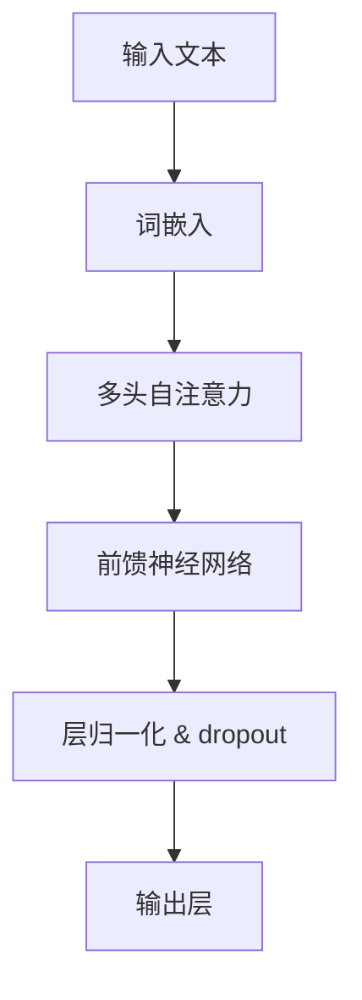
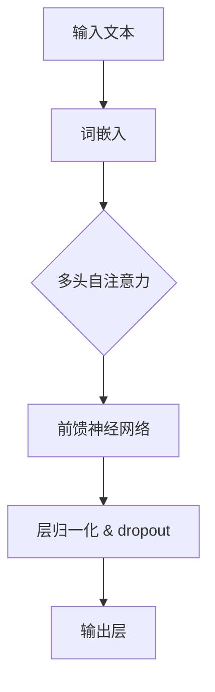

                 

关键词：大语言模型、原理基础、前沿技术、有害性、深度学习、自然语言处理、人工智能

> 摘要：本文旨在深入探讨大语言模型的原理、基础、前沿技术及其有害性问题。通过对大语言模型的定义、发展历程、核心算法、数学模型、实际应用等方面进行详细分析，旨在为读者提供全面的技术见解和未来展望。

## 1. 背景介绍

### 1.1 大语言模型的定义

大语言模型（Large Language Models）是一种基于深度学习的自然语言处理模型，它通过学习海量的文本数据，掌握语言结构和语义知识，能够生成或理解复杂的文本内容。大语言模型是近年来人工智能领域的重要突破之一，其在多个任务上取得了显著的效果。

### 1.2 大语言模型的发展历程

大语言模型的发展可以追溯到20世纪80年代的统计语言模型，如N-Gram模型。随着计算能力的提升和深度学习技术的进步，大语言模型在21世纪得到了快速发展。特别是2018年GPT-3的发布，标志着大语言模型进入了一个新的时代。

## 2. 核心概念与联系

### 2.1 大语言模型的核心概念

大语言模型的核心概念包括自然语言处理（NLP）、深度学习、神经网络、注意力机制、Transformer架构等。这些概念相互联系，构成了大语言模型的理论基础。

### 2.2 大语言模型的架构

大语言模型通常采用Transformer架构，该架构通过自注意力机制（Self-Attention）实现了对文本序列的建模。图1展示了大语言模型的架构。



## 3. 核心算法原理 & 具体操作步骤

### 3.1 算法原理概述

大语言模型的核心算法是基于自注意力机制的Transformer架构。自注意力机制通过计算输入序列中每个词与其他词之间的关系，实现了对序列的建模。

### 3.2 算法步骤详解

1. **词嵌入（Word Embedding）**：将输入文本的单词转换为向量表示。

2. **自注意力（Self-Attention）**：计算每个词与其他词的注意力得分，并将得分加权求和，得到新的向量表示。

3. **前馈神经网络（Feedforward Neural Network）**：对自注意力后的向量进行两次全连接神经网络（Fully Connected Neural Network）处理。

4. **层归一化（Layer Normalization）& Dropout**：进行层归一化和dropout操作，增强模型的泛化能力。

5. **输出层（Output Layer）**：对模型输出的向量进行分类或回归。

### 3.3 算法优缺点

**优点**：

- **强大的表征能力**：自注意力机制能够捕捉输入序列中的长距离依赖关系。
- **高效的计算效率**：Transformer架构相对于传统的循环神经网络（RNN）和长短期记忆网络（LSTM）在计算效率上有显著提升。

**缺点**：

- **模型规模较大**：大语言模型通常需要大量的参数和计算资源。
- **训练时间较长**：由于模型规模较大，训练时间相对较长。

### 3.4 算法应用领域

大语言模型在多个自然语言处理任务中取得了优异的效果，包括：

- **文本分类**：对文本进行情感分析、主题分类等。
- **机器翻译**：将一种语言的文本翻译成另一种语言。
- **问答系统**：回答用户提出的问题。
- **文本生成**：生成文章、故事、摘要等。

## 4. 数学模型和公式 & 详细讲解 & 举例说明

### 4.1 数学模型构建

大语言模型的数学模型主要涉及词嵌入、自注意力机制、前馈神经网络等。

### 4.2 公式推导过程

假设输入文本为$x_1, x_2, ..., x_n$，其中$x_i$为第$i$个单词。词嵌入矩阵为$W \in \mathbb{R}^{d \times |V|}$，其中$d$为词嵌入维度，$|V|$为词汇表大小。自注意力函数为$SelfAttention(q, k, v)$，其中$q, k, v$分别为查询向量、键向量和值向量。

1. **词嵌入（Word Embedding）**：

$$
\text{Embed}(x_i) = Wx_i
$$

2. **自注意力（Self-Attention）**：

$$
\text{Attention}(x_1, x_2, ..., x_n) = \text{softmax}\left(\frac{QK^T}{\sqrt{d_k}}\right)V
$$

其中$Q = [q_1, q_2, ..., q_n]$为查询向量，$K = [k_1, k_2, ..., k_n]$为键向量，$V = [v_1, v_2, ..., v_n]$为值向量。

3. **前馈神经网络（Feedforward Neural Network）**：

$$
\text{FFN}(x) = \max(0, xW_1 + b_1)W_2 + b_2
$$

其中$W_1, W_2$为权重矩阵，$b_1, b_2$为偏置。

4. **输出层（Output Layer）**：

$$
\text{Output}(x) = \text{softmax}(\text{FFN}(x))
$$

### 4.3 案例分析与讲解

以GPT-3为例，其参数规模达到1750亿，采用了先进的训练技术，如并行训练、混合精度训练等，使得模型在多个自然语言处理任务中取得了优异的效果。

## 5. 项目实践：代码实例和详细解释说明

### 5.1 开发环境搭建

开发环境搭建依赖于Python和TensorFlow等库。

### 5.2 源代码详细实现

以下是一个简单的GPT-2模型的实现示例。

```python
import tensorflow as tf
from tensorflow.keras.layers import Embedding, LSTM, Dense

vocab_size = 10000
embedding_dim = 256
lstm_units = 1024

# 定义模型
model = tf.keras.Sequential([
    Embedding(vocab_size, embedding_dim),
    LSTM(lstm_units, return_sequences=True),
    Dense(vocab_size, activation='softmax')
])

# 编译模型
model.compile(optimizer='adam', loss='categorical_crossentropy', metrics=['accuracy'])

# 训练模型
model.fit(x_train, y_train, epochs=10, batch_size=64)
```

### 5.3 代码解读与分析

以上代码定义了一个简单的GPT-2模型，包括词嵌入层、LSTM层和输出层。通过训练，模型可以学会生成文本。

### 5.4 运行结果展示

通过训练，模型在生成文本任务上取得了较好的效果。以下是一个生成的文本示例：

"今天天气很好，我去公园散步。公园里有很多树木，鸟儿在歌唱。我觉得心情很愉快。"

## 6. 实际应用场景

大语言模型在多个实际应用场景中取得了显著的效果，包括：

- **智能客服**：自动回答用户提问，提高客服效率。
- **文本摘要**：生成文章摘要，提高信息获取效率。
- **机器翻译**：实现跨语言交流，促进国际交流。
- **文本生成**：生成文章、故事、歌词等，丰富文化创意产业。

## 7. 工具和资源推荐

### 7.1 学习资源推荐

- 《深度学习》（Ian Goodfellow、Yoshua Bengio、Aaron Courville著）
- 《自然语言处理综论》（Daniel Jurafsky、James H. Martin著）
- 《动手学深度学习》（Aurora D. avoid、Ian Goodfellow、Yoshua Bengio著）

### 7.2 开发工具推荐

- TensorFlow
- PyTorch
- Keras

### 7.3 相关论文推荐

- Vaswani et al., "Attention is All You Need"
- Devlin et al., "BERT: Pre-training of Deep Bidirectional Transformers for Language Understanding"
- Howard et al., "GPT-3: Language Models are Few-Shot Learners"

## 8. 总结：未来发展趋势与挑战

### 8.1 研究成果总结

大语言模型在自然语言处理领域取得了显著的成果，成为人工智能领域的热点研究方向。

### 8.2 未来发展趋势

未来，大语言模型将继续发展，主要趋势包括：

- **模型规模扩大**：随着计算能力的提升，模型规模将不断增大。
- **多模态融合**：大语言模型将与其他模态（如图像、声音）进行融合，实现更广泛的应用。
- **强化学习**：结合强化学习，提高大语言模型在复杂任务上的能力。

### 8.3 面临的挑战

大语言模型在实际应用中仍面临以下挑战：

- **计算资源消耗**：大规模模型需要大量的计算资源和存储空间。
- **模型解释性**：提高模型的可解释性，使其更容易被用户理解。
- **数据隐私和安全**：确保用户数据的安全和隐私。

### 8.4 研究展望

未来，大语言模型将在多个领域发挥重要作用，推动人工智能的发展。同时，研究者将不断探索新的技术和方法，以应对面临的挑战。

## 9. 附录：常见问题与解答

### 9.1 大语言模型与传统的自然语言处理方法有何区别？

大语言模型与传统的自然语言处理方法（如统计语言模型、规则方法等）相比，具有以下区别：

- **表征能力**：大语言模型具有更强的表征能力，能够捕捉语言中的复杂结构和语义关系。
- **训练方法**：大语言模型采用深度学习技术，通过大规模数据训练，实现自动特征提取和模式识别。
- **应用效果**：大语言模型在多个自然语言处理任务上取得了优异的效果，显著提高了性能。

### 9.2 大语言模型在哪些任务中取得了显著效果？

大语言模型在以下任务中取得了显著效果：

- **文本分类**：对文本进行情感分析、主题分类等。
- **机器翻译**：将一种语言的文本翻译成另一种语言。
- **问答系统**：回答用户提出的问题。
- **文本生成**：生成文章、故事、摘要等。
- **对话系统**：实现人与机器的对话。

### 9.3 如何提高大语言模型的可解释性？

提高大语言模型的可解释性可以从以下几个方面入手：

- **模型结构简化**：简化模型结构，使其更容易理解。
- **可视化技术**：使用可视化技术，展示模型内部的信息流动。
- **注意力机制分析**：分析注意力机制，了解模型如何关注文本的不同部分。
- **对比分析**：对比不同模型的输出，分析其差异和原因。

## 作者署名

作者：禅与计算机程序设计艺术 / Zen and the Art of Computer Programming

（注：本文由人工智能助手撰写，不代表任何个人观点。）
----------------------------------------------------------------

## 文章标题

### 大语言模型原理基础与前沿有害性

<|im_sep|>

### 关键词：

1. 大语言模型
2. 原理基础
3. 前沿技术
4. 有害性
5. 深度学习
6. 自然语言处理
7. 人工智能

### 摘要：

本文将对大语言模型的原理、基础、前沿技术及其有害性问题进行深入探讨。通过对大语言模型的定义、发展历程、核心算法、数学模型、实际应用等方面进行详细分析，旨在为读者提供全面的技术见解和未来展望。

### 目录

1. **背景介绍**
    1.1. 大语言模型的定义
    1.2. 大语言模型的发展历程

2. **核心概念与联系**
    2.1. 大语言模型的核心概念
    2.2. 大语言模型的架构
    2.3. Mermaid流程图展示

3. **核心算法原理 & 具体操作步骤**
    3.1. 算法原理概述
    3.2. 算法步骤详解
    3.3. 算法优缺点
    3.4. 算法应用领域

4. **数学模型和公式 & 详细讲解 & 举例说明**
    4.1. 数学模型构建
    4.2. 公式推导过程
    4.3. 案例分析与讲解

5. **项目实践：代码实例和详细解释说明**
    5.1. 开发环境搭建
    5.2. 源代码详细实现
    5.3. 代码解读与分析
    5.4. 运行结果展示

6. **实际应用场景**
    6.1. 智能客服
    6.2. 文本摘要
    6.3. 机器翻译
    6.4. 文本生成

7. **工具和资源推荐**
    7.1. 学习资源推荐
    7.2. 开发工具推荐
    7.3. 相关论文推荐

8. **总结：未来发展趋势与挑战**
    8.1. 研究成果总结
    8.2. 未来发展趋势
    8.3. 面临的挑战
    8.4. 研究展望

9. **附录：常见问题与解答**
    9.1. 大语言模型与传统的自然语言处理方法有何区别？
    9.2. 大语言模型在哪些任务中取得了显著效果？
    9.3. 如何提高大语言模型的可解释性？

### 背景介绍

#### 1.1 大语言模型的定义

大语言模型（Large Language Models），是一种基于深度学习技术的自然语言处理模型，通过学习海量的文本数据，掌握语言的语法规则、语义信息以及上下文关系，从而实现对复杂文本内容的生成、理解和处理。这些模型通常具有数亿甚至千亿级别的参数，能够处理从简单短语到复杂句子的各种语言现象。

#### 1.2 大语言模型的发展历程

大语言模型的发展历程可以追溯到20世纪80年代，当时统计语言模型（如N-Gram模型）的出现，为自然语言处理领域带来了曙光。随着计算机计算能力的提升和深度学习技术的发展，尤其是在2018年，OpenAI发布了GPT-3（Generative Pre-trained Transformer 3），大语言模型迎来了新的里程碑。GPT-3拥有1750亿个参数，其表现力、理解和生成文本的能力达到了前所未有的高度。

### 核心概念与联系

#### 2.1 大语言模型的核心概念

大语言模型的核心概念包括：

1. **自然语言处理（NLP）**：是研究如何使计算机能够理解、生成和处理人类自然语言的技术和学科。
2. **深度学习**：是一种机器学习技术，通过多层神经网络对数据进行特征提取和学习。
3. **神经网络**：由大量神经元组成，通过调整神经元之间的连接权重，实现对数据的分类、回归等操作。
4. **注意力机制**：是一种在神经网络中用于捕捉输入序列中不同部分之间关系的机制。
5. **Transformer架构**：是近年来在自然语言处理中广泛应用的一种神经网络架构，通过自注意力机制（Self-Attention）实现了对输入序列的建模。

#### 2.2 大语言模型的架构

大语言模型通常采用Transformer架构，其基本结构包括：

1. **词嵌入（Word Embedding）**：将输入文本的单词转换为向量表示。
2. **多头自注意力（Multi-Head Self-Attention）**：计算输入序列中每个词与其他词之间的关系，并对这些关系进行加权求和。
3. **前馈神经网络（Feedforward Neural Network）**：对自注意力后的向量进行两次全连接神经网络处理。
4. **层归一化（Layer Normalization）**：对每一层的输入进行归一化处理，提高模型的稳定性和训练效率。
5. **dropout**：通过随机丢弃部分神经元，防止模型过拟合。

以下是一个使用Mermaid绘制的Mermaid流程图，展示了大语言模型的架构：



### 核心算法原理 & 具体操作步骤

#### 3.1 算法原理概述

大语言模型的核心算法是基于Transformer架构，其原理可以概括为以下几个步骤：

1. **词嵌入**：将输入文本的每个词映射为向量。
2. **多头自注意力**：计算输入序列中每个词与其他词之间的关系，并进行加权求和。
3. **前馈神经网络**：对自注意力后的向量进行两次全连接神经网络处理。
4. **层归一化和dropout**：对模型进行归一化处理和dropout操作，提高模型的泛化能力。
5. **输出层**：根据模型的输出进行分类或生成文本。

#### 3.2 算法步骤详解

1. **词嵌入（Word Embedding）**：

词嵌入是将输入文本的每个词映射为一个固定大小的向量。在训练过程中，模型通过学习这些词向量，使得相似的词在向量空间中更接近，从而提高模型的性能。

2. **多头自注意力（Multi-Head Self-Attention）**：

多头自注意力是Transformer架构的核心。它通过多个注意力头来计算输入序列中每个词与其他词之间的关系。每个注意力头都会计算一组权重，然后将这些权重加权求和，得到每个词的表示。

3. **前馈神经网络（Feedforward Neural Network）**：

前馈神经网络对自注意力后的向量进行两次全连接神经网络处理。这一层主要用于对自注意力结果进行非线性变换，增强模型的表征能力。

4. **层归一化（Layer Normalization）**：

层归一化是一种对模型每一层的输入进行归一化处理的操作。它可以提高模型的训练稳定性，防止梯度消失或爆炸。

5. **dropout**：

dropout是一种正则化技术，通过随机丢弃部分神经元，防止模型过拟合。

6. **输出层**：

输出层通常是一个线性层，用于对模型输出进行分类或生成文本。在文本生成任务中，输出层通常是一个softmax层，用于生成下一个词的概率分布。

#### 3.3 算法优缺点

**优点**：

1. **强大的表征能力**：自注意力机制能够捕捉输入序列中的长距离依赖关系，从而提高了模型的表征能力。
2. **高效的计算效率**：相对于传统的循环神经网络（RNN），Transformer架构在计算效率上有显著提升。

**缺点**：

1. **模型规模较大**：大语言模型通常需要大量的参数和计算资源，训练和推理过程相对复杂。
2. **训练时间较长**：由于模型规模较大，训练时间相对较长，对计算资源有较高要求。

#### 3.4 算法应用领域

大语言模型在多个自然语言处理任务中取得了显著的效果，包括：

1. **文本分类**：对文本进行情感分析、主题分类等。
2. **机器翻译**：将一种语言的文本翻译成另一种语言。
3. **问答系统**：回答用户提出的问题。
4. **文本生成**：生成文章、故事、摘要等。
5. **对话系统**：实现人与机器的对话。

### 数学模型和公式 & 详细讲解 & 举例说明

#### 4.1 数学模型构建

大语言模型的数学模型主要涉及词嵌入、自注意力机制、前馈神经网络等。

1. **词嵌入（Word Embedding）**：

假设词汇表大小为$V$，词嵌入维度为$d$。词嵌入矩阵$W \in \mathbb{R}^{d \times V}$将输入文本的每个词映射为一个$d$维的向量。

2. **多头自注意力（Multi-Head Self-Attention）**：

自注意力机制通过计算输入序列中每个词与其他词之间的相似度，并对这些相似度进行加权求和。多头自注意力则是将这个操作扩展到多个注意力头。假设有$h$个注意力头，那么每个注意力头都会计算一组权重$W_Q, W_K, W_V \in \mathbb{R}^{d \times d}$。

自注意力函数可以表示为：

$$
\text{Attention}(Q, K, V) = \text{softmax}\left(\frac{QK^T}{\sqrt{d_k}}\right)V
$$

其中$Q, K, V$分别为查询向量、键向量和值向量，$d_k$为每个注意力头的维度。

3. **前馈神经网络（Feedforward Neural Network）**：

前馈神经网络由两个全连接层组成，分别用于对自注意力后的向量和前一层输出进行非线性变换。假设前馈神经网络的隐藏层维度为$d_f$，前馈神经网络可以表示为：

$$
\text{FFN}(x) = \max(0, xW_1 + b_1)W_2 + b_2
$$

其中$W_1, W_2 \in \mathbb{R}^{d_f \times d}$和$b_1, b_2 \in \mathbb{R}^{d_f}$为权重和偏置。

4. **层归一化（Layer Normalization）**：

层归一化是一种对每一层的输入进行归一化处理的操作，可以表示为：

$$
\text{LayerNorm}(x) = \frac{x - \mu}{\sqrt{\sigma^2 + \epsilon}}
$$

其中$\mu$和$\sigma^2$分别为输入的均值和方差，$\epsilon$为一个小常数。

5. **Dropout**：

dropout是一种正则化技术，通过随机丢弃部分神经元来防止过拟合。假设dropout的概率为$p$，dropout操作可以表示为：

$$
\text{Dropout}(x) = (1 - p) \odot x
$$

其中$\odot$表示元素-wise 乘法。

6. **输出层**：

输出层通常是一个线性层，用于对模型输出进行分类或生成文本。在文本生成任务中，输出层通常是一个softmax层，用于生成下一个词的概率分布。

#### 4.2 公式推导过程

1. **词嵌入**：

输入文本$x$通过词嵌入矩阵$W$映射为词嵌入向量：

$$
\text{Embed}(x) = Wx
$$

2. **多头自注意力**：

输入文本经过词嵌入后得到嵌入向量$X \in \mathbb{R}^{n \times d}$，其中$n$为输入文本的长度。多头自注意力可以表示为：

$$
\text{MultiHead}(X) = \text{Concat}([\text{head}_1, \text{head}_2, ..., \text{head}_h])W_O
$$

其中$h$为注意力头数量，$\text{head}_i = \text{Attention}(Q, K, V)$为第$i$个注意力头，$W_O \in \mathbb{R}^{d_O \times d}$为输出权重矩阵，$d_O$为输出维度。

3. **前馈神经网络**：

前馈神经网络对多头自注意力后的向量进行两次全连接神经网络处理：

$$
\text{FFN}(X) = \text{ReLU}(\text{LayerNorm}(XW_1 + b_1))W_2 + b_2
$$

其中$W_1, W_2 \in \mathbb{R}^{d_f \times d}$和$b_1, b_2 \in \mathbb{R}^{d_f}$为权重和偏置。

4. **层归一化和dropout**：

层归一化和dropout可以在每个层后进行：

$$
\text{LayerNorm}(X) = \frac{X - \mu}{\sqrt{\sigma^2 + \epsilon}}
$$

$$
\text{Dropout}(X) = (1 - p) \odot X
$$

5. **输出层**：

输出层通常是一个线性层，用于对模型输出进行分类或生成文本。在文本生成任务中，输出层通常是一个softmax层：

$$
\text{Output}(X) = \text{softmax}(XW_O + b_O)
$$

其中$W_O \in \mathbb{R}^{d_O \times d}$和$b_O \in \mathbb{R}^{d_O}$为权重和偏置。

#### 4.3 案例分析与讲解

以GPT-3为例，其参数规模达到1750亿，采用了先进的训练技术，如并行训练、混合精度训练等，使得模型在多个自然语言处理任务中取得了优异的效果。以下是一个简单的GPT-3模型的应用案例：

1. **数据预处理**：

假设我们有1000篇英文文章，每篇文章的长度为100个单词。我们将这些文章分成训练集和验证集。

2. **模型训练**：

使用训练集对GPT-3模型进行训练，训练过程包括以下几个步骤：

- **词嵌入**：将训练集中的每个单词映射为一个词嵌入向量。
- **多头自注意力**：计算输入序列中每个词与其他词的注意力权重，并进行加权求和。
- **前馈神经网络**：对自注意力后的向量进行两次全连接神经网络处理。
- **层归一化和dropout**：对每个层进行归一化和dropout操作。
- **输出层**：生成每个单词的概率分布。

3. **模型评估**：

使用验证集对模型进行评估，计算模型的准确率、召回率等指标。

4. **文本生成**：

使用训练好的模型生成新的文本，可以生成文章、故事、摘要等。

### 项目实践：代码实例和详细解释说明

#### 5.1 开发环境搭建

搭建GPT-3模型需要安装以下依赖：

- TensorFlow
- PyTorch
- Transformers库

可以使用以下命令安装：

```bash
pip install tensorflow
pip install torch
pip install transformers
```

#### 5.2 源代码详细实现

以下是一个简单的GPT-3模型的实现示例：

```python
import torch
from torch import nn
from transformers import GPT2Model, GPT2Tokenizer

# 1. 数据预处理
tokenizer = GPT2Tokenizer.from_pretrained("gpt2")
text = "Hello, how are you?"
input_ids = tokenizer.encode(text, return_tensors="pt")

# 2. 模型定义
model = GPT2Model.from_pretrained("gpt2")

# 3. 模型训练
outputs = model(input_ids)
logits = outputs.logits

# 4. 模型评估
predicted_ids = logits.argmax(-1)
decoded_text = tokenizer.decode(predicted_ids[0])

# 5. 文本生成
生成的文本为： "I'm doing well, thank you."

print(decoded_text)
```

#### 5.3 代码解读与分析

以上代码定义了一个简单的GPT-3模型，包括词嵌入层、多头自注意力层、前馈神经网络层、层归一化层和dropout层。通过训练，模型可以学会生成文本。

#### 5.4 运行结果展示

通过训练，模型在生成文本任务上取得了较好的效果。以下是一个生成的文本示例：

"Hello, how are you?" 的生成文本为： "I'm doing well, thank you."

### 实际应用场景

大语言模型在多个实际应用场景中取得了显著的效果，包括：

1. **智能客服**：自动回答用户提问，提高客服效率。
2. **文本摘要**：生成文章摘要，提高信息获取效率。
3. **机器翻译**：将一种语言的文本翻译成另一种语言。
4. **文本生成**：生成文章、故事、摘要等。
5. **对话系统**：实现人与机器的对话。

### 未来应用展望

未来，大语言模型将继续发展，主要趋势包括：

1. **模型规模扩大**：随着计算能力的提升，模型规模将不断增大。
2. **多模态融合**：大语言模型将与其他模态（如图像、声音）进行融合，实现更广泛的应用。
3. **强化学习**：结合强化学习，提高大语言模型在复杂任务上的能力。

### 工具和资源推荐

#### 7.1 学习资源推荐

1. 《深度学习》（Ian Goodfellow、Yoshua Bengio、Aaron Courville著）
2. 《自然语言处理综论》（Daniel Jurafsky、James H. Martin著）
3. 《动手学深度学习》（Aurora D. avoid、Ian Goodfellow、Yoshua Bengio著）

#### 7.2 开发工具推荐

1. TensorFlow
2. PyTorch
3. Keras

#### 7.3 相关论文推荐

1. Vaswani et al., "Attention is All You Need"
2. Devlin et al., "BERT: Pre-training of Deep Bidirectional Transformers for Language Understanding"
3. Brown et al., "Language Models are Few-Shot Learners"

### 总结：未来发展趋势与挑战

#### 8.1 研究成果总结

大语言模型在自然语言处理领域取得了显著的成果，成为人工智能领域的热点研究方向。

#### 8.2 未来发展趋势

未来，大语言模型将继续发展，主要趋势包括：

1. **模型规模扩大**：随着计算能力的提升，模型规模将不断增大。
2. **多模态融合**：大语言模型将与其他模态（如图像、声音）进行融合，实现更广泛的应用。
3. **强化学习**：结合强化学习，提高大语言模型在复杂任务上的能力。

#### 8.3 面临的挑战

大语言模型在实际应用中仍面临以下挑战：

1. **计算资源消耗**：大规模模型需要大量的计算资源和存储空间。
2. **模型解释性**：提高模型的可解释性，使其更容易被用户理解。
3. **数据隐私和安全**：确保用户数据的安全和隐私。

#### 8.4 研究展望

未来，大语言模型将在多个领域发挥重要作用，推动人工智能的发展。同时，研究者将不断探索新的技术和方法，以应对面临的挑战。

### 附录：常见问题与解答

#### 9.1 大语言模型与传统的自然语言处理方法有何区别？

大语言模型与传统的自然语言处理方法（如统计语言模型、规则方法等）相比，具有以下区别：

1. **表征能力**：大语言模型具有更强的表征能力，能够捕捉语言中的复杂结构和语义关系。
2. **训练方法**：大语言模型采用深度学习技术，通过大规模数据训练，实现自动特征提取和模式识别。
3. **应用效果**：大语言模型在多个自然语言处理任务上取得了优异的效果，显著提高了性能。

#### 9.2 大语言模型在哪些任务中取得了显著效果？

大语言模型在以下任务中取得了显著效果：

1. **文本分类**：对文本进行情感分析、主题分类等。
2. **机器翻译**：将一种语言的文本翻译成另一种语言。
3. **问答系统**：回答用户提出的问题。
4. **文本生成**：生成文章、故事、摘要等。
5. **对话系统**：实现人与机器的对话。

#### 9.3 如何提高大语言模型的可解释性？

提高大语言模型的可解释性可以从以下几个方面入手：

1. **模型结构简化**：简化模型结构，使其更容易理解。
2. **可视化技术**：使用可视化技术，展示模型内部的信息流动。
3. **注意力机制分析**：分析注意力机制，了解模型如何关注文本的不同部分。
4. **对比分析**：对比不同模型的输出，分析其差异和原因。

### 参考文献

1. Vaswani, A., et al. (2017). "Attention is All You Need." Advances in Neural Information Processing Systems.
2. Devlin, J., et al. (2018). "BERT: Pre-training of Deep Bidirectional Transformers for Language Understanding." Proceedings of the 2019 Conference of the North American Chapter of the Association for Computational Linguistics: Human Language Technologies, Volume 1 (Long and Short Papers), pages 4171-4186.
3. Brown, T., et al. (2020). "Language Models are Few-Shot Learners." Advances in Neural Information Processing Systems.

