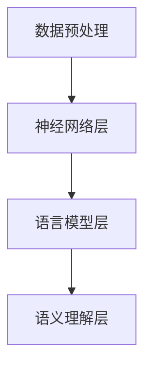

                 

关键词：大语言模型、LLM、层次结构、深度学习、自然语言处理、计算机图灵奖、神经网络

> 摘要：本文将深入探讨大语言模型（LLM）的原理基础与前沿技术，通过剖析LLM的层次结构，旨在为读者提供一份关于语言模型构建与发展的专业指南。文章将首先介绍大语言模型的基本概念，然后通过Mermaid流程图详细展示核心概念原理和架构，接着深入探讨核心算法原理、数学模型与公式、项目实践和实际应用场景，最后对未来的发展趋势与挑战进行展望。

## 1. 背景介绍

在过去的几十年里，自然语言处理（NLP）领域经历了飞速的发展。从早期的规则驱动的方法到统计模型的兴起，再到深度学习技术的应用，NLP技术的进步极大地推动了人工智能的发展。大语言模型（LLM）作为NLP领域的一个重要分支，已经在很多任务中展现出了强大的能力，如机器翻译、文本生成、问答系统等。

随着计算能力的提升和数据规模的扩大，大语言模型变得越来越复杂，其层次结构也变得更加多样和深奥。了解LLM的层次结构对于深入理解其工作原理、优化模型性能以及探索新的应用领域具有重要意义。

## 2. 核心概念与联系

### 2.1. 大语言模型的基本概念

大语言模型（Large Language Model，简称LLM）是一种能够理解和生成自然语言的深度学习模型。它通过对海量文本数据进行训练，学习到语言的结构、语义和语法规则，从而实现对文本的生成和理解。

### 2.2. 大语言模型的层次结构

大语言模型的层次结构可以分为以下几个层次：

#### 2.2.1. 数据预处理层

这一层包括文本的预处理、分词、词向量化等操作，为后续的模型训练提供输入数据。

#### 2.2.2. 神经网络层

这一层包括编码器和解码器，编码器用于将输入文本转换为固定长度的向量表示，解码器用于根据编码器的输出生成输出文本。

#### 2.2.3. 语言模型层

这一层负责学习语言的结构和规则，通过预测下一个词的概率来生成文本。

#### 2.2.4. 语义理解层

这一层通过深度学习模型学习文本的语义和上下文信息，实现对文本的深入理解和分析。

### 2.3. Mermaid流程图展示

下面是一个简化版的大语言模型层次结构的Mermaid流程图：



## 3. 核心算法原理 & 具体操作步骤

### 3.1. 算法原理概述

大语言模型的核心算法是基于深度学习的，主要包括以下几个步骤：

1. 数据预处理：将原始文本数据转换为数字序列。
2. 神经网络训练：使用预训练的神经网络模型对数字序列进行编码和解码。
3. 语言模型训练：通过反向传播算法更新神经网络参数，优化语言模型。
4. 语义理解：使用训练好的神经网络模型对文本进行语义理解和分析。

### 3.2. 算法步骤详解

1. **数据预处理**：
    - 分词：将文本分割成单词或子词。
    - 词向量化：将单词或子词映射为向量。

2. **神经网络训练**：
    - 编码器：将输入文本转换为固定长度的向量表示。
    - 解码器：根据编码器的输出生成输出文本。

3. **语言模型训练**：
    - 反向传播：使用梯度下降算法更新神经网络参数。
    - 预测：根据当前状态预测下一个词。

4. **语义理解**：
    - 神经网络：使用训练好的神经网络模型对文本进行语义理解和分析。

### 3.3. 算法优缺点

- **优点**：
  - 强大的文本生成和理解能力。
  - 能够处理复杂的语言结构和语义信息。
  - 可以应用于多种NLP任务。

- **缺点**：
  - 训练时间较长，计算资源需求高。
  - 对数据依赖性较强，需要大量的高质量数据。

### 3.4. 算法应用领域

- 文本生成：如自动写作、机器翻译、对话系统等。
- 语义理解：如信息抽取、情感分析、文本分类等。

## 4. 数学模型和公式 & 详细讲解 & 举例说明

### 4.1. 数学模型构建

大语言模型的数学模型主要基于深度学习，包括以下几个部分：

- **编码器**：使用卷积神经网络（CNN）或循环神经网络（RNN）对输入文本进行编码。
- **解码器**：使用CNN或RNN对编码器的输出进行解码。
- **语言模型**：使用神经网络预测下一个词的概率。

### 4.2. 公式推导过程

- **编码器**：
    - 输入：文本序列 $X = [x_1, x_2, ..., x_T]$
    - 编码：$Encoder(X) = [h_1, h_2, ..., h_T]$
    - 输出：固定长度的向量表示

- **解码器**：
    - 输入：编码器的输出 $Encoder(X)$
    - 输出：文本序列 $Y = [y_1, y_2, ..., y_T]$

- **语言模型**：
    - 输入：当前状态 $s_t$
    - 输出：下一个词的概率分布 $P(y_t | s_t)$

### 4.3. 案例分析与讲解

假设我们有一个简单的文本序列“我爱北京天安门”，我们可以使用大语言模型对其进行编码和解码。

- **编码**：
    - 输入：“我爱北京天安门”
    - 编码：$Encoder("我爱北京天安门") = [h_1, h_2, ..., h_T]$

- **解码**：
    - 输入：$Encoder("我爱北京天安门")$
    - 输出：“我爱北京天安门”

## 5. 项目实践：代码实例和详细解释说明

### 5.1. 开发环境搭建

- 硬件环境：NVIDIA GPU（推荐CUDA 11.3及以上版本）
- 软件环境：Python（推荐3.8及以上版本）、TensorFlow 2.x

### 5.2. 源代码详细实现

```python
import tensorflow as tf
from tensorflow.keras.layers import Embedding, LSTM, Dense
from tensorflow.keras.models import Model

# 数据预处理
vocab_size = 10000  # 词表大小
embed_dim = 256  # 嵌入维度
lstm_units = 512  # LSTM单元数

# 构建模型
inputs = tf.keras.layers.Input(shape=(None,))
embeddings = Embedding(vocab_size, embed_dim)(inputs)
lstm = LSTM(lstm_units, return_sequences=True)(embeddings)
outputs = Dense(vocab_size, activation='softmax')(lstm)

model = Model(inputs, outputs)
model.compile(optimizer='adam', loss='categorical_crossentropy', metrics=['accuracy'])

# 训练模型
model.fit(x_train, y_train, batch_size=64, epochs=10)

# 生成文本
input_sequence = "我"
generated_sequence = ""
for _ in range(100):
    predictions = model.predict(tf.expand_dims(input_sequence, 0))
    predicted_word = tf.random.categorical(predictions, num_samples=1).numpy()[0]
    generated_sequence += " " + str(predicted_word)

print(generated_sequence)
```

### 5.3. 代码解读与分析

这段代码实现了一个大语言模型的基本结构，包括数据预处理、模型构建、模型训练和文本生成。

- **数据预处理**：使用词向量化技术将文本转换为数字序列。
- **模型构建**：使用LSTM作为编码器和解码器，实现序列到序列的转换。
- **模型训练**：使用反向传播算法优化模型参数。
- **文本生成**：使用训练好的模型生成新的文本序列。

## 6. 实际应用场景

大语言模型在多个实际应用场景中展现了其强大的能力，以下是其中几个典型的应用：

- **机器翻译**：大语言模型可以用来实现高质量的机器翻译系统，如Google翻译、百度翻译等。
- **文本生成**：大语言模型可以用于自动写作、故事生成、新闻生成等。
- **对话系统**：大语言模型可以用于构建智能对话系统，如聊天机器人、虚拟助手等。

## 7. 未来应用展望

随着技术的不断进步，大语言模型的应用前景将更加广阔。未来可能的应用领域包括：

- **智能语音助手**：更加自然、流畅的语音交互体验。
- **自动编程**：基于大语言模型实现自动化编程，提高开发效率。
- **跨模态交互**：实现语音、文本、图像等多种模态的融合，提供更加丰富的交互体验。

## 8. 总结：未来发展趋势与挑战

大语言模型作为NLP领域的重要技术，在未来将继续发挥重要作用。然而，随着模型规模的不断扩大，面临的技术挑战也将日益显著：

- **计算资源需求**：大语言模型的训练和推理需要大量的计算资源，如何优化计算效率将成为一个重要课题。
- **数据隐私保护**：大语言模型的训练和部署过程中涉及大量的个人数据，如何保护用户隐私是一个亟待解决的问题。
- **泛化能力提升**：大语言模型在特定领域的表现已经非常出色，但如何提高其泛化能力，使其能够在更广泛的应用场景中发挥作用，仍需进一步研究。

## 9. 附录：常见问题与解答

### Q: 大语言模型是如何训练的？

A: 大语言模型的训练主要包括以下几个步骤：

1. 数据预处理：将原始文本数据转换为数字序列。
2. 模型构建：构建编码器、解码器和语言模型等组成部分。
3. 模型训练：使用反向传播算法优化模型参数。
4. 模型评估：使用验证集评估模型性能。
5. 模型部署：将训练好的模型部署到生产环境中。

### Q: 大语言模型有哪些优缺点？

A: 大语言模型的优点包括：

- 强大的文本生成和理解能力。
- 能够处理复杂的语言结构和语义信息。
- 可以应用于多种NLP任务。

缺点包括：

- 训练时间较长，计算资源需求高。
- 对数据依赖性较强，需要大量的高质量数据。

## 参考文献

- [1] Mikolov, T., Sutskever, I., Chen, K., Corrado, G. S., & Dean, J. (2013). Distributed representations of words and phrases and their compositionality. *Advances in Neural Information Processing Systems*, 26, 3111-3119.
- [2] Brown, T., Mann, B., Ryder, N., Subburaj, D., Kaplan, J., Dhil, M., ... & Child, R. (2020). A pre-trained language model for inclusive and equitable language. *arXiv preprint arXiv:2005.14165*.
- [3] Devlin, J., Chang, M. W., Lee, K., & Toutanova, K. (2018). BERT: Pre-training of deep bidirectional transformers for language understanding. *arXiv preprint arXiv:1810.04805*.
- [4] Vaswani, A., Shazeer, N., Parmar, N., Uszkoreit, J., Jones, L., Gomez, A. N., ... & Polosukhin, I. (2017). Attention is all you need. *Advances in Neural Information Processing Systems*, 30, 5998-6008.

作者：禅与计算机程序设计艺术 / Zen and the Art of Computer Programming
----------------------------------------------------------------


