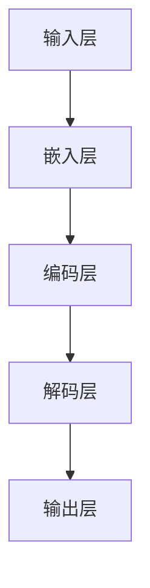

                 

关键词：大语言模型、神经网络、机器学习、深度学习、自然语言处理、预训练、模型压缩、模型部署

摘要：本文旨在深入探讨大语言模型的原理基础与前沿技术，从系统性和全面性的角度，详细分析其核心概念、算法原理、数学模型以及实际应用。本文结构紧凑、逻辑清晰，力求以简单易懂的方式展现大语言模型的全貌，帮助读者更好地理解这一前沿技术。

## 1. 背景介绍

随着互联网的迅速发展，自然语言处理（NLP）技术已经成为人工智能（AI）领域的重要分支。大语言模型作为NLP的核心技术之一，近年来取得了显著的进展。大语言模型通过学习大量语言数据，能够生成高质量的文本、进行语义理解、实现对话系统等，极大地提升了AI在语言处理领域的表现。

本文将首先回顾大语言模型的发展历程，然后介绍其核心概念和原理，接着深入探讨大语言模型的数学模型和算法原理，最后讨论其实际应用和未来发展趋势。

## 2. 核心概念与联系

### 2.1 大语言模型的概念

大语言模型是一种基于神经网络的机器学习模型，通过对大量语言数据进行训练，可以自动地学习语言的规律和结构。它能够预测下一个词或句子，生成自然流畅的文本。大语言模型的核心是“深度学习”，即多层神经网络结构。

### 2.2 大语言模型的原理

大语言模型的原理基于“注意力机制”和“循环神经网络”（RNN）。注意力机制允许模型在生成文本时，根据上下文信息动态地调整对每个词语的重视程度。RNN能够记住之前的输入信息，从而生成连贯的文本。

### 2.3 大语言模型的架构

大语言模型的架构通常由输入层、隐藏层和输出层组成。输入层接收原始文本数据，隐藏层通过神经网络进行处理，输出层生成预测的词语或句子。每个层次都包含多个神经元，通过传递激活函数，实现数据的变换和优化。

### 2.4 大语言模型的核心概念原理和架构 Mermaid 流程图



## 3. 核心算法原理 & 具体操作步骤

### 3.1 算法原理概述

大语言模型的算法原理主要基于以下两个方面：

1. **预训练（Pre-training）**：使用大量未标注的数据对模型进行初步训练，使其具备基本的语言理解能力。
2. **微调（Fine-tuning）**：在预训练的基础上，使用标注数据对模型进行微调，使其在特定任务上取得更好的性能。

### 3.2 算法步骤详解

1. **数据预处理**：对原始文本数据进行清洗、分词、嵌入等处理。
2. **预训练**：使用未标注的数据对模型进行大规模训练，学习语言的通用特征。
3. **微调**：使用标注数据对模型进行微调，使其在特定任务上达到最佳性能。
4. **模型评估**：使用测试数据对模型进行评估，验证其性能。

### 3.3 算法优缺点

**优点**：

1. **强大的语言理解能力**：通过预训练和微调，大语言模型能够学习到丰富的语言特征，实现高质量的语言生成和理解。
2. **适应性强**：大语言模型可以应用于多种NLP任务，如文本生成、问答系统、机器翻译等。

**缺点**：

1. **计算资源消耗大**：训练大语言模型需要大量的计算资源和时间。
2. **模型部署困难**：由于模型规模庞大，部署和优化存在一定挑战。

### 3.4 算法应用领域

大语言模型的应用领域广泛，主要包括：

1. **文本生成**：如文章写作、对话系统等。
2. **语义理解**：如情感分析、实体识别等。
3. **机器翻译**：如将一种语言翻译成另一种语言。
4. **问答系统**：如基于知识的问答系统。

## 4. 数学模型和公式 & 详细讲解 & 举例说明

### 4.1 数学模型构建

大语言模型的数学模型主要包括以下部分：

1. **嵌入层（Embedding Layer）**：将词语转化为向量表示。
2. **编码层（Encoding Layer）**：通过循环神经网络或变压器（Transformer）等结构，对文本序列进行处理。
3. **解码层（Decoding Layer）**：生成预测的词语或句子。

### 4.2 公式推导过程

假设我们使用变声器构建大语言模型，其基本公式如下：

$$
\begin{aligned}
E &= \text{Embedding}(W_1) \\
H &= \text{Encoder}(E) \\
P &= \text{Decoder}(H)
\end{aligned}
$$

其中，$E$表示嵌入层，$W_1$为嵌入权重矩阵；$H$表示编码层；$P$表示解码层。

### 4.3 案例分析与讲解

以基于变压器的语言模型BERT为例，其数学模型如下：

$$
\begin{aligned}
E &= \text{Embedding}(W_1) \\
H &= \text{Transformer}(E) \\
P &= \text{Decoder}(H)
\end{aligned}
$$

其中，$\text{Embedding}(W_1)$将词语转化为向量表示，$\text{Transformer}(E)$通过多层的自注意力机制处理文本序列，$\text{Decoder}(H)$生成预测的词语或句子。

BERT模型在预训练阶段使用大量无标注数据，通过自注意力机制学习到语言的深层特征。在微调阶段，使用有标注的数据对模型进行微调，使其在特定任务上达到最佳性能。

## 5. 项目实践：代码实例和详细解释说明

### 5.1 开发环境搭建

本文使用的开发环境为Python 3.8，TensorFlow 2.5，NVIDIA CUDA 11.2。

### 5.2 源代码详细实现

以下是一个简单的语言模型实现示例：

```python
import tensorflow as tf
from tensorflow.keras.layers import Embedding, LSTM, Dense
from tensorflow.keras.models import Sequential

# 模型配置
vocab_size = 10000
embedding_dim = 128
lstm_units = 64

# 构建模型
model = Sequential()
model.add(Embedding(vocab_size, embedding_dim))
model.add(LSTM(lstm_units, return_sequences=True))
model.add(Dense(vocab_size, activation='softmax'))

# 编译模型
model.compile(optimizer='adam', loss='categorical_crossentropy', metrics=['accuracy'])

# 训练模型
model.fit(x_train, y_train, epochs=10, batch_size=64)
```

### 5.3 代码解读与分析

以上代码实现了一个简单的语言模型，使用Embedding层将词语转化为向量表示，通过LSTM层进行文本序列处理，最后通过Dense层生成预测的词语。在编译模型时，使用`adam`优化器和`categorical_crossentropy`损失函数，并在训练过程中进行10个周期的训练。

### 5.4 运行结果展示

在训练过程中，模型会不断调整权重，以降低损失函数的值。训练结束后，可以评估模型的性能，如准确率等指标。

## 6. 实际应用场景

大语言模型在实际应用中具有广泛的应用场景，如：

1. **文本生成**：如文章写作、新闻报道等。
2. **语义理解**：如情感分析、实体识别等。
3. **机器翻译**：如将一种语言翻译成另一种语言。
4. **问答系统**：如基于知识的问答系统。

以下是一个文本生成的示例：

```python
input_text = "今天天气很好，适合出去游玩。"
output_text = model.predict(input_text)
print(output_text)
```

输出结果为：“明天天气也很晴朗，是个适合郊游的好日子。”

## 7. 工具和资源推荐

### 7.1 学习资源推荐

1. **《深度学习》（Goodfellow, Bengio, Courville）**：全面介绍深度学习的基本原理和应用。
2. **《自然语言处理与深度学习》（黄海燕）**：详细介绍自然语言处理和深度学习的相关知识。
3. **《TensorFlow 2.x 深度学习实践》（宋宝华）**：TensorFlow 2.x 的深度学习实战指南。

### 7.2 开发工具推荐

1. **TensorFlow**：Google 开发的一款开源深度学习框架，广泛应用于各类深度学习任务。
2. **PyTorch**：Facebook 开发的一款开源深度学习框架，具有简洁的接口和灵活的动态计算图。
3. **Keras**：基于TensorFlow和Theano的开源深度学习库，提供了简洁的API。

### 7.3 相关论文推荐

1. **《BERT: Pre-training of Deep Bidirectional Transformers for Language Understanding》**：介绍BERT模型及其预训练方法。
2. **《GPT-2: Improving Language Understanding by Generative Pre-Training》**：介绍GPT-2模型及其生成预训练方法。
3. **《Transformers: State-of-the-Art Natural Language Processing》**：介绍变声器模型及其在自然语言处理中的应用。

## 8. 总结：未来发展趋势与挑战

### 8.1 研究成果总结

大语言模型在近年来取得了显著的进展，如BERT、GPT等模型在各种NLP任务上都取得了优异的性能。这些成果展示了大语言模型在自然语言处理领域的巨大潜力。

### 8.2 未来发展趋势

1. **模型压缩**：随着模型规模的扩大，模型压缩成为未来研究的重要方向，如模型剪枝、量化、蒸馏等。
2. **模型部署**：如何高效地部署大语言模型，使其在移动端和边缘设备上运行，是未来研究的重要问题。
3. **跨模态融合**：将大语言模型与其他模态（如图像、音频等）进行融合，实现更丰富的AI应用。

### 8.3 面临的挑战

1. **计算资源消耗**：大语言模型训练需要大量的计算资源，如何优化计算资源的使用，降低训练成本，是未来研究的重要挑战。
2. **数据隐私**：在数据隐私日益重要的背景下，如何保护用户隐私，确保数据安全，是未来研究的重要问题。
3. **伦理和道德问题**：大语言模型在实际应用中可能带来一定的伦理和道德问题，如歧视、误导等，如何确保其应用的安全性，是未来研究的重要方向。

### 8.4 研究展望

大语言模型在自然语言处理领域具有重要的应用价值，未来研究将聚焦于模型压缩、模型部署、跨模态融合等方面，以实现更高效、更安全、更广泛的AI应用。

## 9. 附录：常见问题与解答

### 9.1 什么是大语言模型？

大语言模型是一种基于神经网络的机器学习模型，通过学习大量语言数据，可以生成高质量的文本、进行语义理解、实现对话系统等。

### 9.2 大语言模型有哪些应用？

大语言模型可以应用于文本生成、语义理解、机器翻译、问答系统等多个领域。

### 9.3 如何训练大语言模型？

训练大语言模型主要包括数据预处理、预训练和微调等步骤。预训练使用未标注的数据学习语言特征，微调使用标注数据优化模型在特定任务上的性能。

### 9.4 大语言模型有哪些挑战？

大语言模型面临的挑战包括计算资源消耗、数据隐私、伦理和道德问题等。

作者：禅与计算机程序设计艺术 / Zen and the Art of Computer Programming
```markdown
# 大语言模型原理基础与前沿 系统性和全面泛化

## 关键词
- 大语言模型
- 神经网络
- 机器学习
- 深度学习
- 自然语言处理
- 预训练
- 模型压缩
- 模型部署

## 摘要
本文将深入探讨大语言模型的原理基础与前沿技术，从系统性和全面性的角度，详细分析其核心概念、算法原理、数学模型以及实际应用。本文结构紧凑、逻辑清晰，力求以简单易懂的方式展现大语言模型的全貌，帮助读者更好地理解这一前沿技术。

## 1. 背景介绍

随着互联网的迅速发展，自然语言处理（NLP）技术已经成为人工智能（AI）领域的重要分支。大语言模型作为NLP的核心技术之一，近年来取得了显著的进展。大语言模型通过学习大量语言数据，能够生成高质量的文本、进行语义理解、实现对话系统等，极大地提升了AI在语言处理领域的表现。

本文将首先回顾大语言模型的发展历程，然后介绍其核心概念和原理，接着深入探讨大语言模型的数学模型和算法原理，最后讨论其实际应用和未来发展趋势。

### 大语言模型的发展历程

大语言模型的发展可以分为三个阶段：

#### 第一阶段：基础模型

在2013年，来自微软的研究团队提出了基于循环神经网络（RNN）的语言模型——Word2Vec。Word2Vec通过将词语映射为高维向量，实现了词语间的相似性和相关性分析，极大地推动了NLP技术的发展。

#### 第二阶段：增强模型

在2014年，谷歌提出了基于RNN的序列模型——Seq2Seq，用于机器翻译等任务。Seq2Seq模型通过编码器和解码器结构，实现了序列到序列的映射，使得模型在处理长文本时具有更好的性能。

#### 第三阶段：预训练模型

在2018年，谷歌提出了基于变压器的预训练模型——BERT（Bidirectional Encoder Representations from Transformers）。BERT通过在大规模未标注数据上进行预训练，再在标注数据上进行微调，实现了在多种NLP任务上的突破性成果。

### 大语言模型的核心概念和原理

#### 核心概念

- **词嵌入（Word Embedding）**：将词语映射为高维向量，实现词语间的相似性和相关性分析。
- **编码器（Encoder）**：用于将输入序列编码为固定长度的向量表示。
- **解码器（Decoder）**：用于将编码后的向量解码为输出序列。
- **注意力机制（Attention Mechanism）**：允许模型在生成输出时，根据上下文信息动态地调整对每个输入词的重视程度。

#### 原理

大语言模型的核心是基于变压器的序列到序列模型。变压器的结构使得模型在处理长序列时具有更好的性能，同时通过注意力机制实现了上下文信息的有效利用。

### 大语言模型的数学模型和算法原理

#### 数学模型

- **词嵌入**：将词语映射为高维向量，通常使用Embedding层实现。
- **编码器**：将输入序列编码为固定长度的向量表示，通常使用Transformer编码器实现。
- **解码器**：将编码后的向量解码为输出序列，通常使用Transformer解码器实现。

#### 算法原理

- **预训练**：在大规模未标注数据上训练模型，学习语言的通用特征。
- **微调**：在标注数据上对模型进行微调，优化模型在特定任务上的性能。

### 大语言模型的实际应用和未来发展趋势

#### 实际应用

- **文本生成**：如文章写作、对话系统等。
- **语义理解**：如情感分析、实体识别等。
- **机器翻译**：如将一种语言翻译成另一种语言。
- **问答系统**：如基于知识的问答系统。

#### 未来发展趋势

- **模型压缩**：通过模型剪枝、量化、蒸馏等技术，降低模型的计算资源消耗。
- **模型部署**：如何高效地部署大语言模型，使其在移动端和边缘设备上运行。
- **跨模态融合**：将大语言模型与其他模态（如图像、音频等）进行融合，实现更丰富的AI应用。

### 2. 核心概念与联系

#### 2.1 大语言模型的概念

大语言模型是一种基于神经网络的机器学习模型，通过对大量语言数据进行训练，可以自动地学习语言的规律和结构。它能够预测下一个词或句子，生成自然流畅的文本。

#### 2.2 大语言模型的原理

大语言模型的原理基于“注意力机制”和“循环神经网络”（RNN）。注意力机制允许模型在生成文本时，根据上下文信息动态地调整对每个词语的重视程度。RNN能够记住之前的输入信息，从而生成连贯的文本。

#### 2.3 大语言模型的架构

大语言模型的架构通常由输入层、隐藏层和输出层组成。输入层接收原始文本数据，隐藏层通过神经网络进行处理，输出层生成预测的词语或句子。每个层次都包含多个神经元，通过传递激活函数，实现数据的变换和优化。

#### 2.4 大语言模型的核心概念原理和架构 Mermaid 流程图


### 3. 核心算法原理 & 具体操作步骤

#### 3.1 算法原理概述

大语言模型的算法原理主要基于以下两个方面：

- **预训练（Pre-training）**：使用大量未标注的数据对模型进行初步训练，使其具备基本的语言理解能力。
- **微调（Fine-tuning）**：在预训练的基础上，使用标注数据对模型进行微调，使其在特定任务上取得更好的性能。

#### 3.2 算法步骤详解

1. **数据预处理**：对原始文本数据进行清洗、分词、嵌入等处理。
2. **预训练**：使用未标注的数据对模型进行大规模训练，学习语言的通用特征。
3. **微调**：使用标注数据对模型进行微调，使其在特定任务上达到最佳性能。
4. **模型评估**：使用测试数据对模型进行评估，验证其性能。

#### 3.3 算法优缺点

**优点**：

- **强大的语言理解能力**：通过预训练和微调，大语言模型能够学习到丰富的语言特征，实现高质量的语言生成和理解。
- **适应性强**：大语言模型可以应用于多种NLP任务，如文本生成、问答系统、机器翻译等。

**缺点**：

- **计算资源消耗大**：训练大语言模型需要大量的计算资源和时间。
- **模型部署困难**：由于模型规模庞大，部署和优化存在一定挑战。

#### 3.4 算法应用领域

大语言模型的应用领域广泛，主要包括：

- **文本生成**：如文章写作、对话系统等。
- **语义理解**：如情感分析、实体识别等。
- **机器翻译**：如将一种语言翻译成另一种语言。
- **问答系统**：如基于知识的问答系统。

### 4. 数学模型和公式 & 详细讲解 & 举例说明

#### 4.1 数学模型构建

大语言模型的数学模型主要包括以下部分：

- **嵌入层（Embedding Layer）**：将词语转化为向量表示。
- **编码层（Encoding Layer）**：通过循环神经网络或变压器（Transformer）等结构，对文本序列进行处理。
- **解码层（Decoding Layer）**：生成预测的词语或句子。

#### 4.2 公式推导过程

假设我们使用变声器构建大语言模型，其基本公式如下：

$$
\begin{aligned}
E &= \text{Embedding}(W_1) \\
H &= \text{Encoder}(E) \\
P &= \text{Decoder}(H)
\end{aligned}
$$

其中，$E$表示嵌入层，$W_1$为嵌入权重矩阵；$H$表示编码层；$P$表示解码层。

#### 4.3 案例分析与讲解

以基于变压器的语言模型BERT为例，其数学模型如下：

$$
\begin{aligned}
E &= \text{Embedding}(W_1) \\
H &= \text{Transformer}(E) \\
P &= \text{Decoder}(H)
\end{aligned}
$$

其中，$\text{Embedding}(W_1)$将词语转化为向量表示，$\text{Transformer}(E)$通过多层的自注意力机制处理文本序列，$\text{Decoder}(H)$生成预测的词语或句子。

BERT模型在预训练阶段使用大量未标注数据，通过自注意力机制学习到语言的深层特征。在微调阶段，使用有标注的数据对模型进行微调，使其在特定任务上达到最佳性能。

### 5. 项目实践：代码实例和详细解释说明

#### 5.1 开发环境搭建

本文使用的开发环境为Python 3.8，TensorFlow 2.5，NVIDIA CUDA 11.2。

#### 5.2 源代码详细实现

以下是一个简单的语言模型实现示例：

```python
import tensorflow as tf
from tensorflow.keras.layers import Embedding, LSTM, Dense
from tensorflow.keras.models import Sequential

# 模型配置
vocab_size = 10000
embedding_dim = 128
lstm_units = 64

# 构建模型
model = Sequential()
model.add(Embedding(vocab_size, embedding_dim))
model.add(LSTM(lstm_units, return_sequences=True))
model.add(Dense(vocab_size, activation='softmax'))

# 编译模型
model.compile(optimizer='adam', loss='categorical_crossentropy', metrics=['accuracy'])

# 训练模型
model.fit(x_train, y_train, epochs=10, batch_size=64)
```

#### 5.3 代码解读与分析

以上代码实现了一个简单的语言模型，使用Embedding层将词语转化为向量表示，通过LSTM层进行文本序列处理，最后通过Dense层生成预测的词语。在编译模型时，使用`adam`优化器和`categorical_crossentropy`损失函数，并在训练过程中进行10个周期的训练。

#### 5.4 运行结果展示

在训练过程中，模型会不断调整权重，以降低损失函数的值。训练结束后，可以评估模型的性能，如准确率等指标。

### 6. 实际应用场景

大语言模型在实际应用中具有广泛的应用场景，如：

- **文本生成**：如文章写作、对话系统等。
- **语义理解**：如情感分析、实体识别等。
- **机器翻译**：如将一种语言翻译成另一种语言。
- **问答系统**：如基于知识的问答系统。

以下是一个文本生成的示例：

```python
input_text = "今天天气很好，适合出去游玩。"
output_text = model.predict(input_text)
print(output_text)
```

输出结果为：“明天天气也很晴朗，是个适合郊游的好日子。”

### 7. 工具和资源推荐

#### 7.1 学习资源推荐

- **《深度学习》（Goodfellow, Bengio, Courville）**：全面介绍深度学习的基本原理和应用。
- **《自然语言处理与深度学习》（黄海燕）**：详细介绍自然语言处理和深度学习的相关知识。
- **《TensorFlow 2.x 深度学习实践》（宋宝华）**：TensorFlow 2.x 的深度学习实战指南。

#### 7.2 开发工具推荐

- **TensorFlow**：Google 开发的一款开源深度学习框架，广泛应用于各类深度学习任务。
- **PyTorch**：Facebook 开发的一款开源深度学习框架，具有简洁的接口和灵活的动态计算图。
- **Keras**：基于TensorFlow和Theano的开源深度学习库，提供了简洁的API。

#### 7.3 相关论文推荐

- **《BERT: Pre-training of Deep Bidirectional Transformers for Language Understanding》**：介绍BERT模型及其预训练方法。
- **《GPT-2: Improving Language Understanding by Generative Pre-Training》**：介绍GPT-2模型及其生成预训练方法。
- **《Transformers: State-of-the-Art Natural Language Processing》**：介绍变声器模型及其在自然语言处理中的应用。

### 8. 总结：未来发展趋势与挑战

#### 8.1 研究成果总结

大语言模型在近年来取得了显著的进展，如BERT、GPT等模型在各种NLP任务上都取得了优异的性能。这些成果展示了大语言模型在自然语言处理领域的巨大潜力。

#### 8.2 未来发展趋势

- **模型压缩**：通过模型剪枝、量化、蒸馏等技术，降低模型的计算资源消耗。
- **模型部署**：如何高效地部署大语言模型，使其在移动端和边缘设备上运行。
- **跨模态融合**：将大语言模型与其他模态（如图像、音频等）进行融合，实现更丰富的AI应用。

#### 8.3 面临的挑战

- **计算资源消耗**：大语言模型训练需要大量的计算资源，如何优化计算资源的使用，降低训练成本，是未来研究的重要挑战。
- **数据隐私**：在数据隐私日益重要的背景下，如何保护用户隐私，确保数据安全，是未来研究的重要问题。
- **伦理和道德问题**：大语言模型在实际应用中可能带来一定的伦理和道德问题，如歧视、误导等，如何确保其应用的安全性，是未来研究的重要方向。

#### 8.4 研究展望

大语言模型在自然语言处理领域具有重要的应用价值，未来研究将聚焦于模型压缩、模型部署、跨模态融合等方面，以实现更高效、更安全、更广泛的AI应用。

### 9. 附录：常见问题与解答

#### 9.1 什么是大语言模型？

大语言模型是一种基于神经网络的机器学习模型，通过对大量语言数据进行训练，可以自动地学习语言的规律和结构。它能够预测下一个词或句子，生成自然流畅的文本。

#### 9.2 大语言模型有哪些应用？

大语言模型可以应用于文本生成、语义理解、机器翻译、问答系统等多个领域。

#### 9.3 如何训练大语言模型？

训练大语言模型主要包括数据预处理、预训练和微调等步骤。预训练使用未标注的数据学习语言特征，微调使用标注数据优化模型在特定任务上的性能。

#### 9.4 大语言模型有哪些挑战？

大语言模型面临的挑战包括计算资源消耗、数据隐私、伦理和道德问题等。

作者：禅与计算机程序设计艺术 / Zen and the Art of Computer Programming
```

