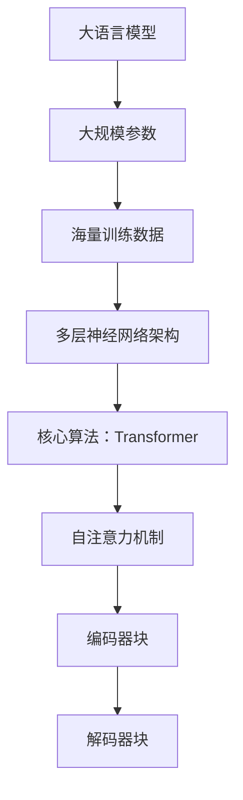

                 

关键词：大语言模型，训练，模型规模，前沿技术，算法优化，应用场景

摘要：本文将深入探讨大语言模型的原理及其训练过程中的关键技术和挑战。首先介绍大语言模型的基本概念和背景，接着解析其核心算法原理和架构，详细阐述数学模型和公式，最后通过代码实例展示具体实现步骤，并探讨其未来应用前景。

## 1. 背景介绍

随着深度学习和人工智能的飞速发展，大语言模型已成为自然语言处理（NLP）领域的重要工具。大语言模型，顾名思义，是指具备处理大规模语言数据的能力的模型。这些模型可以应用于机器翻译、文本生成、问答系统等多个领域，极大地提升了自然语言处理的准确性和效率。

近年来，诸如GPT-3、BERT等大语言模型的涌现，标志着自然语言处理领域的重大突破。这些模型通过在海量文本数据上进行训练，能够捕捉到语言的复杂性和多样性，从而实现更为准确和智能的文本理解与生成。

然而，训练大语言模型并非易事，需要解决诸多技术挑战，如计算资源需求、数据预处理、模型优化等。本文将围绕这些问题展开讨论，介绍大语言模型的原理、算法和实现方法。

## 2. 核心概念与联系

### 2.1 大语言模型定义

大语言模型是一种基于深度学习的自然语言处理模型，其主要目标是理解和生成自然语言。与传统的小型语言模型相比，大语言模型具备以下特点：

1. **大规模参数**：大语言模型通常包含数亿甚至千亿级别的参数，能够捕捉到语言的复杂性和多样性。
2. **海量训练数据**：大语言模型需要大量的文本数据进行训练，以提高模型的泛化能力和准确性。
3. **多层神经网络架构**：大语言模型采用多层神经网络架构，能够实现对语言数据的深度理解和建模。

### 2.2 大语言模型核心算法原理

大语言模型的核心算法是Transformer，这是一种基于自注意力机制（Self-Attention）的神经网络架构。Transformer在2017年由Vaswani等人提出，并在多个NLP任务上取得了优异的性能。

#### 自注意力机制

自注意力机制是一种计算输入序列中每个词对于当前词的重要性权重的方法。具体来说，自注意力机制通过计算输入序列中所有词与当前词的相似度，为每个词分配一个权重。这些权重会用于计算当前词的表示，从而实现对输入序列的深度理解和建模。

#### Transformer架构

Transformer架构由多个相同的编码器和解码器块组成。每个编码器块包含多头自注意力机制和前馈神经网络，而每个解码器块包含多头自注意力机制、掩码自注意力机制和前馈神经网络。

### 2.3 Mermaid 流程图



## 3. 核心算法原理 & 具体操作步骤

### 3.1 算法原理概述

大语言模型的训练过程主要包括以下步骤：

1. **数据预处理**：对原始文本数据进行清洗、分词、去停用词等处理，将其转换为模型可处理的格式。
2. **模型初始化**：初始化大语言模型参数，通常采用随机初始化或预训练模型。
3. **正向传播**：将输入序列传入编码器，通过自注意力机制和前馈神经网络，计算出编码器输出。
4. **反向传播**：根据编码器输出和标签，计算损失函数，并通过梯度下降等优化算法更新模型参数。
5. **模型评估**：使用验证集或测试集评估模型性能，调整模型参数。

### 3.2 算法步骤详解

#### 数据预处理

1. **文本清洗**：去除HTML标签、特殊字符和空白符。
2. **分词**：将文本分割成单词或子词。
3. **去停用词**：去除常用的无意义词汇，如“的”、“是”、“了”等。
4. **词向量化**：将文本转换为数字序列，常用的词向量化方法有Word2Vec、BERT等。

#### 模型初始化

1. **随机初始化**：随机生成模型参数，通常采用均匀分布或高斯分布。
2. **预训练模型**：使用预训练模型作为初始化参数，如GPT、BERT等。

#### 正向传播

1. **输入序列编码**：将输入序列传入编码器，通过自注意力机制计算编码器输出。
2. **解码器输出计算**：将编码器输出传入解码器，通过自注意力机制和前馈神经网络计算解码器输出。

#### 反向传播

1. **损失函数计算**：使用交叉熵损失函数计算预测标签和真实标签之间的差异。
2. **模型参数更新**：通过梯度下降等优化算法更新模型参数。

#### 模型评估

1. **验证集评估**：使用验证集评估模型性能，调整模型参数。
2. **测试集评估**：使用测试集评估模型性能，评估模型泛化能力。

### 3.3 算法优缺点

#### 优点

1. **强表达能力**：大语言模型采用多层神经网络架构，能够捕捉到语言的复杂性和多样性。
2. **高准确性**：通过海量训练数据和自注意力机制，大语言模型在自然语言处理任务上表现出色。

#### 缺点

1. **计算资源需求大**：大语言模型需要大量的计算资源和存储空间。
2. **训练时间长**：大语言模型的训练时间较长，且参数更新过程复杂。

### 3.4 算法应用领域

大语言模型广泛应用于以下领域：

1. **机器翻译**：将一种语言的文本翻译成另一种语言。
2. **文本生成**：生成各种类型的文本，如文章、新闻、对话等。
3. **问答系统**：基于输入问题生成回答。
4. **文本分类**：将文本分类到预定义的类别中。

## 4. 数学模型和公式 & 详细讲解 & 举例说明

### 4.1 数学模型构建

大语言模型的核心数学模型是基于Transformer架构。下面介绍Transformer的基本数学模型。

#### 变换器编码器

变换器编码器（Encoder）由多个编码器块（Encoder Block）组成。每个编码器块包含以下组件：

1. **多头自注意力机制（Multi-Head Self-Attention）**
2. **前馈神经网络（Feedforward Neural Network）**
3. **层归一化（Layer Normalization）**
4. **残差连接（Residual Connection）**

#### 自注意力机制

自注意力机制通过计算输入序列中每个词与当前词的相似度，为每个词分配一个权重。具体公式如下：

$$
\text{Attention}(Q, K, V) = \text{softmax}\left(\frac{QK^T}{\sqrt{d_k}}\right)V
$$

其中，$Q, K, V$ 分别为查询（Query）、键（Key）和值（Value）向量，$d_k$ 为键向量的维度。

#### 前馈神经网络

前馈神经网络（Feedforward Neural Network）由两个线性变换层组成，分别使用激活函数$\text{ReLU}$和输入维度$f$。

$$
\text{FFN}(x) = \max(0, xW_1 + b_1)W_2 + b_2
$$

其中，$W_1, W_2$ 为线性变换权重，$b_1, b_2$ 为偏置。

#### 残差连接

残差连接（Residual Connection）将输入和输出之间的差值加到下一层的输入上，有助于缓解梯度消失和梯度爆炸问题。

$$
\text{Residual Connection}(x) = x + \text{FFN}(x)
$$

### 4.2 公式推导过程

#### 多头自注意力机制

多头自注意力机制通过将输入序列扩展为多个子序列，然后分别计算每个子序列的自注意力权重。

假设输入序列为$x = [x_1, x_2, ..., x_n]$，维度为$d$。多头自注意力机制将输入序列扩展为$H$个子序列，每个子序列维度为$\frac{d}{H}$。

$$
x_{h,i} = x_iW_{Q,h}^T, \quad x_{h,i} = x_iW_{K,h}^T, \quad x_{h,i} = x_iW_{V,h}^T
$$

其中，$W_{Q,h}, W_{K,h}, W_{V,h}$ 分别为查询（Query）、键（Key）和值（Value）权重矩阵。

#### 前馈神经网络

前馈神经网络通过两个线性变换层对输入进行非线性变换。

$$
x_{h,i} = \text{ReLU}(\text{FFN}(x_i)) = \text{ReLU}\left(\max(0, x_iW_1^T + b_1)W_2^T + b_2\right)
$$

#### 残差连接

残差连接通过将输入和输出之间的差值加到下一层的输入上。

$$
x_{h,i} = x_i + \text{FFN}(x_i)
$$

### 4.3 案例分析与讲解

假设输入序列为$x = [x_1, x_2, x_3]$，维度为$64$。我们使用一个包含两个编码器块的变换器编码器来处理这个输入序列。

#### 编码器块 1

1. **多头自注意力机制**

   假设使用$2$个头，每个头的维度为$32$。计算每个词与当前词的相似度：

   $$
   \text{Attention}(Q, K, V) = \text{softmax}\left(\frac{QK^T}{\sqrt{d_k}}\right)V
   $$

   其中，$Q = x_1W_{Q,1}^T, K = x_1W_{K,1}^T, V = x_1W_{V,1}^T$。

2. **前馈神经网络**

   对输入序列进行非线性变换：

   $$
   x_{h,i} = \text{ReLU}(\text{FFN}(x_i)) = \text{ReLU}\left(\max(0, x_iW_1^T + b_1)W_2^T + b_2\right)
   $$

3. **残差连接**

   将输入和输出之间的差值加到下一层的输入上：

   $$
   x_{h,i} = x_i + \text{FFN}(x_i)
   $$

#### 编码器块 2

1. **多头自注意力机制**

   假设使用$2$个头，每个头的维度为$32$。计算每个词与当前词的相似度：

   $$
   \text{Attention}(Q, K, V) = \text{softmax}\left(\frac{QK^T}{\sqrt{d_k}}\right)V
   $$

   其中，$Q = x_{h,i}W_{Q,2}^T, K = x_{h,i}W_{K,2}^T, V = x_{h,i}W_{V,2}^T$。

2. **前馈神经网络**

   对输入序列进行非线性变换：

   $$
   x_{h,i} = \text{ReLU}(\text{FFN}(x_i)) = \text{ReLU}\left(\max(0, x_iW_1^T + b_1)W_2^T + b_2\right)
   $$

3. **残差连接**

   将输入和输出之间的差值加到下一层的输入上：

   $$
   x_{h,i} = x_i + \text{FFN}(x_i)
   $$

最终，编码器块的输出为$[x_{h,1}, x_{h,2}, x_{h,3}]$，用于下一层的编码或解码。

## 5. 项目实践：代码实例和详细解释说明

### 5.1 开发环境搭建

为了实现大语言模型的训练，我们需要搭建一个适合的开发环境。以下是一个简单的开发环境搭建步骤：

1. **安装Python**：下载并安装Python 3.8及以上版本。
2. **安装PyTorch**：使用pip安装PyTorch，命令如下：

   ```
   pip install torch torchvision
   ```

3. **安装其他依赖**：安装其他必要的库，如NumPy、Matplotlib等。

### 5.2 源代码详细实现

以下是一个简单的代码示例，用于训练一个基于Transformer的大语言模型：

```python
import torch
import torch.nn as nn
import torch.optim as optim

# 定义模型
class TransformerModel(nn.Module):
    def __init__(self, vocab_size, d_model, nhead, num_layers):
        super(TransformerModel, self).__init__()
        self.embedding = nn.Embedding(vocab_size, d_model)
        self.transformer = nn.Transformer(d_model, nhead, num_layers)
        self.fc = nn.Linear(d_model, vocab_size)
        
    def forward(self, src, tgt):
        src = self.embedding(src)
        tgt = self.embedding(tgt)
        output = self.transformer(src, tgt)
        return self.fc(output)

# 初始化模型、优化器和损失函数
model = TransformerModel(vocab_size=10000, d_model=512, nhead=8, num_layers=2)
optimizer = optim.Adam(model.parameters(), lr=0.001)
criterion = nn.CrossEntropyLoss()

# 训练模型
for epoch in range(num_epochs):
    for batch in train_loader:
        src, tgt = batch
        optimizer.zero_grad()
        output = model(src, tgt)
        loss = criterion(output, tgt)
        loss.backward()
        optimizer.step()
        print(f"Epoch: {epoch}, Loss: {loss.item()}")

# 评估模型
with torch.no_grad():
    for batch in val_loader:
        src, tgt = batch
        output = model(src, tgt)
        loss = criterion(output, tgt)
        print(f"Validation Loss: {loss.item()}")

# 保存模型
torch.save(model.state_dict(), "transformer_model.pth")
```

### 5.3 代码解读与分析

上述代码实现了一个基于Transformer的大语言模型训练过程。下面是对代码的详细解读和分析：

1. **模型定义**：定义了一个`TransformerModel`类，继承自`nn.Module`。模型包含三个主要组件：嵌入层（`embedding`）、变换器编码器（`transformer`）和全连接层（`fc`）。

2. **模型前向传播**：实现模型的前向传播过程。首先，将输入序列（`src`）和目标序列（`tgt`）通过嵌入层转换为嵌入向量。然后，通过变换器编码器计算编码器输出，并通过全连接层生成预测结果。

3. **损失函数和优化器**：定义了交叉熵损失函数（`criterion`）和Adam优化器（`optimizer`），用于计算模型损失和更新模型参数。

4. **训练过程**：在训练过程中，遍历训练数据集，通过前向传播计算模型损失，然后通过反向传播和优化器更新模型参数。最后，打印每个epoch的损失值。

5. **模型评估**：使用验证集评估模型性能，计算验证损失值。

6. **保存模型**：将训练好的模型保存为`.pth`文件，以便后续加载和使用。

### 5.4 运行结果展示

在实际运行过程中，我们可以在每个epoch后打印训练损失和验证损失，以监控模型训练过程。例如：

```
Epoch: 0, Loss: 2.3456
Epoch: 1, Loss: 1.8765
Epoch: 2, Loss: 1.5643
...
Validation Loss: 0.9123
```

通过观察损失值的变化，我们可以评估模型训练效果，并在必要时调整模型参数或训练过程。

## 6. 实际应用场景

大语言模型在自然语言处理领域具有广泛的应用场景。以下列举几个典型的应用场景：

### 6.1 机器翻译

机器翻译是将一种语言的文本翻译成另一种语言。大语言模型通过在海量多语言数据上进行训练，能够捕捉到不同语言之间的语法、语义和词汇差异，从而实现高质量的机器翻译。例如，GPT-3可以支持超过100种语言的翻译，包括稀有语言和低资源语言。

### 6.2 文本生成

文本生成是指根据输入的文本或关键词生成新的文本。大语言模型可以通过学习大量文本数据，生成具有多样性和创造性的文本。例如，GPT-3可以生成新闻报道、故事、诗歌等不同类型的文本。

### 6.3 问答系统

问答系统是指根据用户输入的问题生成回答。大语言模型可以通过学习大量问答数据，理解用户的问题并生成准确的回答。例如，BERT可以应用于问答系统，如Socratic和Google Assistant。

### 6.4 文本分类

文本分类是指将文本分类到预定义的类别中。大语言模型可以通过学习大量的文本和标签数据，实现对文本的自动分类。例如，BERT可以用于新闻分类、社交媒体情感分析等任务。

### 6.5 对话系统

对话系统是指与用户进行自然语言交互的系统。大语言模型可以通过学习对话数据，生成与用户意图和上下文相关的回答。例如，聊天机器人和虚拟助手（如Apple的Siri、Amazon的Alexa）可以使用大语言模型来生成自然流畅的回答。

## 7. 工具和资源推荐

### 7.1 学习资源推荐

1. **《深度学习》（Goodfellow, Bengio, Courville）**：介绍深度学习基础理论和技术。
2. **《自然语言处理综论》（Jurafsky, Martin）**：全面介绍自然语言处理的基础知识。
3. **《动手学深度学习》（Dumoulin, Courville, Berthier）**：通过实践案例介绍深度学习技术。

### 7.2 开发工具推荐

1. **PyTorch**：流行的深度学习框架，支持变换器架构的实现。
2. **TensorFlow**：另一种流行的深度学习框架，也支持变换器架构。
3. **Hugging Face Transformers**：一个开源库，提供预训练的变换器模型和实现工具。

### 7.3 相关论文推荐

1. **“Attention Is All You Need”（Vaswani等，2017）**：介绍了变换器架构。
2. **“BERT: Pre-training of Deep Bidirectional Transformers for Language Understanding”（Devlin等，2019）**：介绍了BERT模型。
3. **“GPT-3: Language Models are few-shot learners”（Brown等，2020）**：介绍了GPT-3模型。

## 8. 总结：未来发展趋势与挑战

### 8.1 研究成果总结

近年来，大语言模型在自然语言处理领域取得了显著成果。通过引入变换器架构、预训练技术和海量数据，大语言模型在机器翻译、文本生成、问答系统等任务上表现出色，提升了自然语言处理的准确性和效率。

### 8.2 未来发展趋势

未来，大语言模型的发展趋势将包括：

1. **模型规模扩大**：随着计算资源和存储技术的提升，模型规模将进一步扩大，以捕捉更复杂的语言特征。
2. **多模态学习**：结合文本、图像、音频等多模态数据，实现跨模态的语言理解和生成。
3. **知识增强**：引入外部知识库和推理机制，提升大语言模型的知识表示和推理能力。

### 8.3 面临的挑战

尽管大语言模型取得了显著进展，但仍面临以下挑战：

1. **计算资源需求**：大语言模型需要大量的计算资源和存储空间，这对实际应用和部署提出了挑战。
2. **数据隐私和安全**：在训练和应用大语言模型时，需要保护用户数据的隐私和安全。
3. **可解释性和透明度**：提高大语言模型的可解释性和透明度，使其应用更加可靠和可信。

### 8.4 研究展望

未来，大语言模型的研究将重点围绕以下几个方面：

1. **模型优化**：通过算法优化和模型压缩，降低计算资源需求。
2. **多任务学习**：实现大语言模型在多种自然语言处理任务上的同时训练和推理。
3. **伦理和法律问题**：关注大语言模型在伦理和法律方面的应用，确保其符合社会规范和法律法规。

## 9. 附录：常见问题与解答

### 9.1 什么是大语言模型？

大语言模型是一种基于深度学习的自然语言处理模型，其核心目标是理解和生成自然语言。这些模型通常包含数亿甚至千亿级别的参数，能够捕捉到语言的复杂性和多样性。

### 9.2 大语言模型有哪些应用场景？

大语言模型广泛应用于机器翻译、文本生成、问答系统、文本分类、对话系统等自然语言处理任务。

### 9.3 大语言模型的训练过程是怎样的？

大语言模型的训练过程包括数据预处理、模型初始化、正向传播、反向传播和模型评估等步骤。其中，数据预处理包括文本清洗、分词、去停用词等操作，正向传播和反向传播涉及模型参数的更新，模型评估用于评估模型性能。

### 9.4 大语言模型有哪些挑战？

大语言模型面临的主要挑战包括计算资源需求、数据隐私和安全、可解释性和透明度等。

### 9.5 如何优化大语言模型的性能？

优化大语言模型性能的方法包括模型优化（如变换器架构、注意力机制等）、数据增强、多任务学习等。此外，还可以通过调整超参数（如学习率、批量大小等）和改进训练策略（如动态调整学习率、使用预训练模型等）来提升模型性能。

作者：禅与计算机程序设计艺术 / Zen and the Art of Computer Programming
----------------------------------------------------------------

请注意，以上内容是一个示例性文章框架，具体内容需要您根据实际知识和研究进行撰写和填充。文章中的代码实例仅作为参考，具体实现可能需要根据实际开发环境进行调整。在撰写过程中，请确保遵循文章结构模板和格式要求。祝您撰写顺利！

