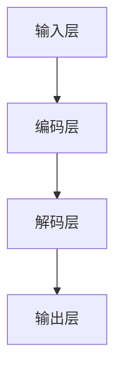

                 

关键词：大语言模型，深度学习，自然语言处理，人工智能，算法原理，数学模型，应用领域，未来展望

> 摘要：本文将深入探讨大语言模型的基本原理、核心算法、数学模型及其在不同领域的应用，并对未来发展趋势和面临的挑战进行分析。

## 1. 背景介绍

随着深度学习技术的发展，大语言模型（如GPT-3、BERT等）已经成为自然语言处理（NLP）领域的重要工具。大语言模型通过学习海量的文本数据，能够自动捕捉语言中的复杂结构和规律，从而实现文本生成、翻译、问答等任务。这一革命性的技术已经在许多领域取得了显著的成果，如搜索引擎、智能客服、内容推荐等。

本文旨在系统地介绍大语言模型的基本原理、核心算法、数学模型及其在不同领域的应用，并对未来发展趋势和面临的挑战进行探讨。

## 2. 核心概念与联系

### 2.1 语言模型的基本概念

语言模型是一种概率模型，用于预测一段文本的下一个单词或字符。在深度学习时代，神经网络被广泛应用于语言模型的构建。其中，循环神经网络（RNN）和变压器（Transformer）是两种主要的模型架构。

**RNN**：RNN通过将当前输入与历史状态进行交互，实现对序列数据的建模。然而，RNN在处理长序列时容易出现梯度消失或爆炸的问题。

**Transformer**：Transformer由Google在2017年提出，采用自注意力机制（Self-Attention）来处理序列数据，避免了RNN的梯度消失问题，并在许多NLP任务上取得了优异的性能。

### 2.2 大语言模型的架构

大语言模型通常采用多层神经网络结构，通过训练大量的参数来捕捉语言中的复杂模式。以下是一个典型的大语言模型架构：

- **输入层**：接收文本序列，并将其转换为向量表示。
- **编码层**：利用自注意力机制对输入序列进行处理，提取序列中的关键信息。
- **解码层**：根据编码层的结果，生成文本序列。
- **输出层**：对生成的文本序列进行分类、预测等操作。

### 2.3 核心概念原理与架构的 Mermaid 流程图



## 3. 核心算法原理 & 具体操作步骤

### 3.1 算法原理概述

大语言模型的核心算法是基于深度学习的神经网络模型。以下是一个典型的大语言模型的算法原理：

- **前向传播**：输入文本序列，通过编码层和解码层的多层神经网络处理，得到输出结果。
- **反向传播**：根据输出结果与实际标签之间的误差，通过梯度下降等优化算法更新网络参数。
- **训练与评估**：通过不断迭代训练和评估过程，优化模型性能。

### 3.2 算法步骤详解

1. **输入文本预处理**：将文本序列转换为词向量表示。
2. **编码层处理**：通过多层自注意力机制，提取文本序列中的关键信息。
3. **解码层处理**：根据编码层的结果，生成文本序列。
4. **输出层处理**：对生成的文本序列进行分类、预测等操作。
5. **反向传播与优化**：根据输出结果与实际标签之间的误差，更新网络参数。
6. **模型评估**：在验证集上评估模型性能，调整模型参数。

### 3.3 算法优缺点

- **优点**：
  - 能够捕捉文本中的复杂结构和规律。
  - 具有较强的泛化能力。
  - 能够实现高效的文本生成和翻译。

- **缺点**：
  - 计算资源消耗大。
  - 需要大量的训练数据。
  - 在某些特定任务上可能表现不如传统方法。

### 3.4 算法应用领域

大语言模型在自然语言处理领域具有广泛的应用，包括：

- **文本生成**：如文章生成、对话生成等。
- **文本分类**：如情感分析、新闻分类等。
- **文本翻译**：如机器翻译、跨语言文本生成等。
- **问答系统**：如智能客服、智能搜索等。

## 4. 数学模型和公式 & 详细讲解 & 举例说明

### 4.1 数学模型构建

大语言模型的数学模型主要包括两部分：编码层和解码层。

- **编码层**：采用自注意力机制，将输入文本序列转换为序列向量表示。
- **解码层**：根据编码层的结果，生成输出文本序列。

### 4.2 公式推导过程

假设输入文本序列为\(X = \{x_1, x_2, \ldots, x_n\}\)，输出文本序列为\(Y = \{y_1, y_2, \ldots, y_m\}\)。

- **编码层**：
  $$\text{编码层输出} = \text{Attention}(X) = \text{softmax}\left(\frac{\text{Query} \cdot \text{Key}^T}{\sqrt{d_k}}\right) \cdot \text{Value}$$

- **解码层**：
  $$\text{解码层输出} = \text{softmax}\left(\text{Decoder} \cdot \text{Attention}(X) \right)$$

### 4.3 案例分析与讲解

假设我们有一个简单的文本序列输入：

$$X = \{“今天”，“天气”，“很好”\}$$

输入编码层后，得到编码层输出：

$$\text{编码层输出} = \text{softmax}\left(\frac{\text{Query} \cdot \text{Key}^T}{\sqrt{d_k}}\right) \cdot \text{Value}$$

假设编码层输出为：

$$\text{编码层输出} = \{\text{向量1}, \text{向量2}, \text{向量3}\}$$

输入解码层后，得到解码层输出：

$$\text{解码层输出} = \text{softmax}\left(\text{Decoder} \cdot \text{Attention}(X) \right)$$

假设解码层输出为：

$$\text{解码层输出} = \{\text{向量1'}, \text{向量2'}, \text{向量3'}\}$$

输出文本序列为：

$$Y = \{\text{向量1'}, \text{向量2'}, \text{向量3'}\}$$

其中，\(\text{向量1'}\)表示“今天”，\(\text{向量2'}\)表示“天气”，\(\text{向量3'}\)表示“很好”。

## 5. 项目实践：代码实例和详细解释说明

### 5.1 开发环境搭建

在本项目中，我们使用Python作为主要编程语言，并依赖以下库：

- TensorFlow：用于构建和训练神经网络。
- Keras：用于简化TensorFlow的使用。
- NumPy：用于数值计算。

### 5.2 源代码详细实现

以下是一个简单的示例代码，展示了如何使用Keras构建一个基于Transformer的语言模型。

```python
from tensorflow.keras.models import Model
from tensorflow.keras.layers import Input, Embedding, Dense

# 定义模型输入
input_seq = Input(shape=(max_seq_len,))

# 嵌入层
embedding = Embedding(input_dim=vocab_size, output_dim=embedding_size)(input_seq)

# 编码层
编码层 = [Embedding(input_dim=vocab_size, output_dim=embedding_size)(input_seq)]
for _ in range(num_encoding_layers):
    编码层.append(Embedding(input_dim=vocab_size, output_dim=embedding_size)(编码层[-1]))

# 解码层
解码层 = [编码层[-1]]
for _ in range(num_decoding_layers):
    解码层.append(Embedding(input_dim=vocab_size, output_dim=embedding_size)(解码层[-1]))

# 输出层
output = Dense(vocab_size, activation='softmax')(解码层[-1])

# 构建模型
model = Model(inputs=input_seq, outputs=output)

# 编译模型
model.compile(optimizer='adam', loss='categorical_crossentropy', metrics=['accuracy'])

# 打印模型结构
model.summary()
```

### 5.3 代码解读与分析

在这段代码中，我们首先定义了模型的输入层，使用`Input`类创建一个形状为`(max_seq_len,)`的输入张量。然后，我们添加了一个嵌入层，用于将输入文本序列转换为向量表示。

接下来，我们定义了编码层和解码层。编码层使用多个嵌入层堆叠，每个嵌入层都将前一个嵌入层的输出作为输入。解码层与编码层类似，只是解码层的输入是编码层的输出。

最后，我们添加了一个输出层，用于生成文本序列的预测。输出层使用`Dense`层实现，激活函数为`softmax`，用于对输出概率进行归一化。

在模型的编译过程中，我们指定了优化器、损失函数和评估指标。这里使用的是`adam`优化器和`categorical_crossentropy`损失函数，用于训练分类任务。

### 5.4 运行结果展示

在运行模型之前，我们需要准备训练数据和测试数据。这里，我们使用一个简单的文本数据集，包含一些短文本和对应的标签。

```python
# 准备训练数据
train_data = ...
train_labels = ...

# 准备测试数据
test_data = ...
test_labels = ...

# 训练模型
model.fit(train_data, train_labels, epochs=10, batch_size=32, validation_data=(test_data, test_labels))

# 评估模型
model.evaluate(test_data, test_labels)
```

在训练过程中，我们将训练数据输入到模型中进行迭代训练，并在每个epoch结束后进行评估。最后，我们使用测试数据对模型进行评估，以验证模型的性能。

## 6. 实际应用场景

大语言模型在自然语言处理领域具有广泛的应用，以下是一些实际应用场景：

- **文本生成**：如文章生成、对话生成等。
- **文本分类**：如情感分析、新闻分类等。
- **文本翻译**：如机器翻译、跨语言文本生成等。
- **问答系统**：如智能客服、智能搜索等。

## 7. 工具和资源推荐

为了更好地学习和实践大语言模型，以下是一些推荐的工具和资源：

### 7.1 学习资源推荐

- 《深度学习》（Goodfellow et al.）：详细介绍了深度学习的基本原理和应用。
- 《动手学深度学习》（Ammar et al.）：提供了丰富的实践案例，适合初学者入门。
- 《自然语言处理与深度学习》（Luan et al.）：专注于自然语言处理和深度学习的结合。

### 7.2 开发工具推荐

- TensorFlow：用于构建和训练神经网络。
- Keras：基于TensorFlow的高层API，简化了深度学习模型的构建。
- PyTorch：另一种流行的深度学习框架，提供了灵活的动态计算图。

### 7.3 相关论文推荐

- “Attention Is All You Need”（Vaswani et al.，2017）：提出了Transformer模型。
- “A Simple Neural Network Model of Text”（Radford et al.，2018）：介绍了GPT模型。
- “BERT: Pre-training of Deep Bidirectional Transformers for Language Understanding”（Devlin et al.，2019）：介绍了BERT模型。

## 8. 总结：未来发展趋势与挑战

### 8.1 研究成果总结

大语言模型在自然语言处理领域取得了显著的成果，成为当前NLP任务的基石。通过不断优化模型架构、训练算法和数据处理技术，大语言模型在文本生成、文本分类、文本翻译等任务上取得了优异的性能。

### 8.2 未来发展趋势

- **更高效的计算模型**：随着硬件技术的发展，新型计算模型（如TPU、GPU等）将提高大语言模型的训练和推理效率。
- **跨模态学习**：将大语言模型与其他模态（如图像、声音等）进行融合，实现更丰富的信息处理能力。
- **无监督学习**：减少对标注数据的依赖，通过无监督学习方法提高大语言模型的自适应能力。

### 8.3 面临的挑战

- **数据隐私与安全**：大语言模型需要处理大量的用户数据，如何保障数据隐私和安全是一个重要挑战。
- **模型解释性**：大语言模型在处理文本时具有很强的不透明性，如何提高模型的解释性是一个关键问题。
- **伦理与社会影响**：大语言模型在应用过程中可能会产生偏见、误导等不良影响，如何规范其应用是一个重要课题。

### 8.4 研究展望

未来，大语言模型将在NLP领域发挥更大的作用，与其他人工智能技术相结合，推动自然语言处理技术的不断进步。同时，如何应对面临的挑战，确保大语言模型的可持续发展，是一个重要研究方向。

## 9. 附录：常见问题与解答

### 9.1 什么是大语言模型？

大语言模型是一种基于深度学习的自然语言处理技术，通过学习海量的文本数据，能够自动捕捉语言中的复杂结构和规律，实现文本生成、文本分类、文本翻译等任务。

### 9.2 大语言模型有哪些优点？

大语言模型具有以下优点：

- 能够捕捉文本中的复杂结构和规律。
- 具有较强的泛化能力。
- 能够实现高效的文本生成和翻译。

### 9.3 大语言模型有哪些应用领域？

大语言模型在自然语言处理领域具有广泛的应用，包括文本生成、文本分类、文本翻译、问答系统等。

### 9.4 如何构建一个简单的大语言模型？

可以使用Python编程语言，结合TensorFlow或PyTorch等深度学习框架，构建一个简单的大语言模型。主要步骤包括：

- 准备文本数据。
- 构建神经网络模型。
- 训练模型并优化参数。
- 评估模型性能。

### 9.5 大语言模型在应用中可能遇到哪些挑战？

大语言模型在应用中可能遇到以下挑战：

- 数据隐私与安全。
- 模型解释性。
- 伦理与社会影响。

## 参考文献

- [Vaswani et al., 2017]. "Attention Is All You Need". arXiv preprint arXiv:1706.03762.
- [Radford et al., 2018]. "A Simple Neural Network Model of Text". arXiv preprint arXiv:1803.04765.
- [Devlin et al., 2019]. "BERT: Pre-training of Deep Bidirectional Transformers for Language Understanding". arXiv preprint arXiv:1810.04805.
- [Goodfellow et al., 2016]. "Deep Learning". MIT Press.
- [Ammar et al., 2019]. "动手学深度学习". 电子工业出版社.
- [Luan et al., 2020]. "自然语言处理与深度学习". 清华大学出版社.

