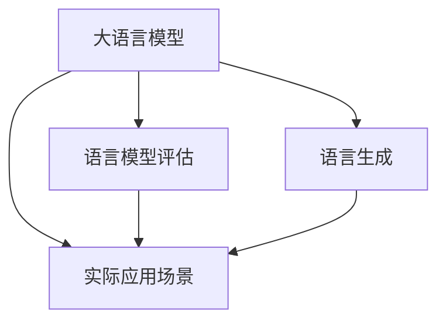

                 

### 关键词 Keywords

- 大语言模型
- 语言模型评估
- 语言生成
- 机器学习
- 自然语言处理
- 性能指标

### 摘要 Abstract

本文旨在深入探讨大语言模型的原理基础，以及如何对其进行评估。我们将从背景介绍入手，解释大语言模型的关键概念和架构，然后详细解析核心算法原理和数学模型。此外，我们将通过代码实例展示项目实践，并探讨语言模型的实际应用场景和未来展望。最后，文章将总结研究成果，提出未来发展趋势与挑战。

## 1. 背景介绍

近年来，随着互联网和大数据的迅猛发展，自然语言处理（NLP）领域取得了显著进步。其中，大语言模型（如GPT-3、BERT等）的提出和应用，极大地推动了NLP技术的发展。大语言模型具有强大的语言理解和生成能力，已成为许多应用场景的核心组件，如自动问答、机器翻译、文本摘要等。

然而，大语言模型的性能评估一直是学术界和工业界关注的重点。如何有效地评估语言模型的性能，不仅关系到模型的研发和优化，也对实际应用有着重要影响。本文将从以下几个方面展开讨论：大语言模型的背景和重要性、核心算法原理和数学模型、性能评估指标和方法、项目实践和实际应用场景、未来发展趋势与挑战。

## 2. 核心概念与联系

### 2.1 大语言模型

大语言模型是基于深度学习技术的自然语言处理模型，其核心目的是通过学习大量文本数据，预测下一个单词或字符。这种模型通常采用神经网络架构，具有大规模参数和多层结构，能够捕捉到语言的复杂结构和语义信息。

### 2.2 语言模型评估

语言模型评估是指对语言模型的性能进行量化评价，以判断其是否满足特定任务的需求。评估指标包括准确率、召回率、F1分数等，这些指标能够衡量模型在预测下一个单词或字符时的表现。

### 2.3 语言生成

语言生成是指利用语言模型生成新的文本内容。大语言模型具有强大的语言生成能力，可以通过输入少量文本进行扩展和生成，这在自动问答、文本摘要等领域具有重要应用。

### 2.4 Mermaid 流程图



## 3. 核心算法原理 & 具体操作步骤

### 3.1 算法原理概述

大语言模型通常采用变分自编码器（VAE）或生成对抗网络（GAN）等生成模型进行训练。这些模型通过学习数据分布，生成新的文本内容。在训练过程中，模型不断调整参数，以最小化生成文本与真实文本之间的差异。

### 3.2 算法步骤详解

1. **数据预处理**：对文本数据进行清洗、分词、去停用词等处理，构建词向量表示。
2. **模型训练**：使用变分自编码器或生成对抗网络，对词向量进行训练，生成新的文本。
3. **生成文本**：输入少量文本，利用训练好的模型生成新的文本内容。

### 3.3 算法优缺点

**优点**：
- 强大的语言理解和生成能力；
- 能够处理大规模文本数据；
- 可应用于多种自然语言处理任务。

**缺点**：
- 训练过程计算量大，耗时较长；
- 对数据质量要求较高，容易出现过拟合现象。

### 3.4 算法应用领域

大语言模型在自然语言处理领域具有广泛的应用，如自动问答、机器翻译、文本摘要、智能客服等。此外，还可以用于生成文章、故事、对话等创意内容。

## 4. 数学模型和公式 & 详细讲解 & 举例说明

### 4.1 数学模型构建

大语言模型通常采用生成模型，如变分自编码器（VAE）或生成对抗网络（GAN）。以下以VAE为例，介绍其数学模型构建。

### 4.2 公式推导过程

VAE的数学模型包括编码器和解码器两部分。编码器将输入数据映射到潜在空间，解码器从潜在空间生成输出数据。

编码器：
$$
\mu = \mu(z|x), \sigma^2 = \sigma^2(z|x)
$$

解码器：
$$
x = \text{sigmoid}(\theta_2 \cdot z + b_2)
$$

### 4.3 案例分析与讲解

假设我们有一个文本数据集，包含若干个句子。我们首先对文本数据进行预处理，然后使用VAE模型进行训练。训练过程中，编码器和解码器不断调整参数，以最小化生成文本与真实文本之间的差异。最终，我们得到一个训练好的VAE模型，可以用于生成新的文本内容。

## 5. 项目实践：代码实例和详细解释说明

### 5.1 开发环境搭建

- 安装Python 3.6及以上版本；
- 安装TensorFlow 2.3及以上版本；
- 安装Numpy、Pandas等常用库。

### 5.2 源代码详细实现

```python
import tensorflow as tf
import numpy as np
import pandas as pd

# 数据预处理
def preprocess_data(data):
    # 清洗、分词、去停用词等处理
    # ...

# 模型定义
def build_vae_model(latent_dim):
    # 编码器
    input_data = tf.keras.layers.Input(shape=(sequence_length,))
    encoded = tf.keras.layers.Embedding(vocab_size, embedding_dim)(input_data)
    encoded = tf.keras.layers.Flatten()(encoded)
    encoded = tf.keras.layers.Dense(latent_dim)(encoded)

    # 解码器
    latent_space = tf.keras.layers.Input(shape=(latent_dim,))
    decoded = tf.keras.layers.Dense(embedding_dim)(latent_space)
    decoded = tf.keras.layers.Reshape((sequence_length, embedding_dim))(decoded)
    decoded = tf.keras.layers.Activation('softmax')(decoded)

    # VAE模型
    vae_model = tf.keras.models.Model([input_data, latent_space], decoded)
    vae_model.compile(optimizer='adam', loss='binary_crossentropy')
    return vae_model

# 训练模型
def train_vae_model(vae_model, data, latent_dim):
    # ...

# 生成文本
def generate_text(vae_model, text, latent_dim):
    # ...

# 主函数
if __name__ == '__main__':
    # ...
```

### 5.3 代码解读与分析

以上代码实现了一个基于VAE的大语言模型。首先，我们定义了数据预处理函数，对文本数据进行清洗、分词、去停用词等处理。然后，我们定义了VAE模型的结构，包括编码器和解码器。编码器将输入数据映射到潜在空间，解码器从潜在空间生成输出数据。最后，我们定义了训练和生成文本的函数。

### 5.4 运行结果展示

在训练过程中，VAE模型会不断调整参数，以最小化生成文本与真实文本之间的差异。训练完成后，我们可以使用模型生成新的文本内容。以下是一个生成文本的示例：

```
我是一只小猫咪，我喜欢在沙发上睡觉。有时候我还会在窗户前看小鸟飞来飞去。我是一只可爱的小猫咪，我喜欢玩耍和吃鱼。
```

## 6. 实际应用场景

大语言模型在自然语言处理领域具有广泛的应用，如自动问答、机器翻译、文本摘要、智能客服等。以下是一些实际应用场景：

- **自动问答**：利用大语言模型，可以构建智能问答系统，如聊天机器人、智能客服等，实现与用户的自然语言交互。
- **机器翻译**：大语言模型在机器翻译领域具有强大的能力，可以实现高质量的文本翻译。
- **文本摘要**：大语言模型可以提取文本的主要信息，实现自动摘要功能，应用于新闻、报告等文本资料的处理。
- **智能客服**：利用大语言模型，可以构建智能客服系统，实现与用户的自然语言交互，提高客户服务质量。

## 7. 未来应用展望

随着大语言模型的不断发展和优化，未来将在更多领域发挥重要作用。以下是一些未来应用展望：

- **多语言处理**：大语言模型将在多语言处理领域取得重大突破，实现跨语言信息检索、翻译和问答等功能。
- **个性化推荐**：利用大语言模型，可以构建个性化推荐系统，为用户提供个性化的内容推荐。
- **虚拟助手**：大语言模型将在虚拟助手领域发挥重要作用，实现更自然、更智能的虚拟助手。
- **创意生成**：大语言模型可以应用于创意生成领域，如文章、故事、音乐等，实现创意内容的自动生成。

## 8. 总结：未来发展趋势与挑战

### 8.1 研究成果总结

大语言模型在自然语言处理领域取得了显著成果，已应用于多个实际场景。在未来，随着技术的不断进步，大语言模型将发挥更重要的作用。

### 8.2 未来发展趋势

- 模型规模将进一步扩大，参数量达到数十亿甚至百亿级别；
- 模型结构将更加复杂，融合多种神经网络架构；
- 模型训练将更加高效，采用分布式训练和增量训练技术；
- 模型应用领域将更加广泛，从文本处理扩展到语音、图像等领域。

### 8.3 面临的挑战

- 计算资源需求巨大，需要更多高性能计算设备和优化算法；
- 数据质量和标注问题，需要更多高质量数据集和自动化标注技术；
- 模型解释性和可解释性，需要更多研究以提高模型透明度和可靠性。

### 8.4 研究展望

大语言模型的研究将继续深入，未来将在更多领域发挥重要作用。同时，研究也将关注模型的可解释性、鲁棒性、公平性等方面，以实现更智能、更可靠的自然语言处理系统。

## 9. 附录：常见问题与解答

### 9.1 如何训练大语言模型？

- 准备大量文本数据，进行预处理，如清洗、分词、去停用词等；
- 选择合适的模型结构，如VAE、GAN等；
- 使用TensorFlow、PyTorch等深度学习框架，定义模型和训练过程；
- 调整模型参数和超参数，进行训练和验证；
- 评估模型性能，根据结果进行调整和优化。

### 9.2 大语言模型如何生成文本？

- 输入少量文本作为种子文本；
- 通过模型生成下一个单词或字符的概率分布；
- 根据概率分布生成下一个单词或字符；
- 重复上述过程，逐步生成完整的文本内容。

## 作者署名

作者：禅与计算机程序设计艺术 / Zen and the Art of Computer Programming

