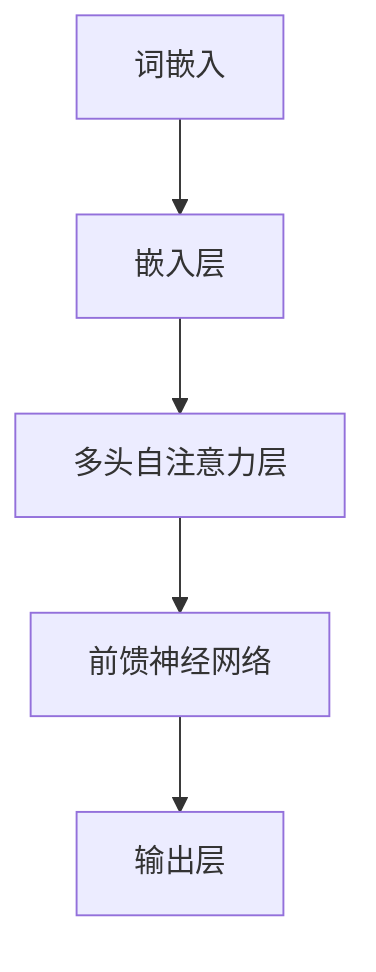

                 

关键词：大语言模型，自然语言处理，多模态，深度学习，人工智能

摘要：本文旨在深入探讨大语言模型的原理、基础与前沿技术，同时分析语言处理的多模态落地实践。通过解析核心算法原理、数学模型及其应用场景，并结合实际项目实践，全面介绍大语言模型的发展趋势、挑战与未来方向。

## 1. 背景介绍

### 1.1 语言模型的重要性

语言模型（Language Model，LM）是自然语言处理（Natural Language Processing，NLP）的核心组件之一。它旨在对自然语言进行建模，预测下一个单词或字符的概率，从而为文本生成、机器翻译、问答系统等任务提供支持。语言模型的发展经历了从简单的统计模型到现代深度学习模型的演变，使得机器在理解、生成和处理自然语言方面取得了显著的进步。

### 1.2 大语言模型的崛起

大语言模型，如GPT-3、BERT、T5等，采用了先进的深度学习技术，具有数百万至数十亿个参数，能够对大量文本数据进行训练，从而实现更高的准确性和泛化能力。大语言模型的兴起，标志着语言模型进入了一个新的时代，为NLP领域的研究和应用带来了前所未有的机遇和挑战。

## 2. 核心概念与联系

### 2.1 核心概念

在大语言模型中，核心概念包括：

- **词嵌入（Word Embedding）**：将词语映射到高维向量空间，以便更好地进行数学处理。
- **自注意力机制（Self-Attention）**：在神经网络中引入的一种机制，能够自动关注输入序列中的关键信息。
- **Transformer架构**：一种基于自注意力机制的神经网络架构，实现了对序列数据的全局建模。

### 2.2 架构原理

大语言模型的架构原理如图所示：



在这个架构中，词嵌入层将词语映射到向量空间，多头自注意力层能够关注输入序列中的关键信息，前馈神经网络进行进一步处理，最后输出层生成预测结果。

## 3. 核心算法原理 & 具体操作步骤

### 3.1 算法原理概述

大语言模型的算法原理主要包括以下几个步骤：

1. **输入处理**：将文本数据转换为词嵌入向量。
2. **自注意力计算**：通过自注意力机制计算输入序列中每个词语的重要性。
3. **前馈神经网络**：对自注意力结果进行进一步处理，提高模型的表达能力。
4. **输出生成**：通过输出层生成预测结果，如单词、句子或文本摘要。

### 3.2 算法步骤详解

1. **输入处理**

输入处理包括分词、词性标注和词嵌入等步骤。具体操作如下：

- **分词**：将输入文本划分为词语序列。
- **词性标注**：为每个词语分配词性标签，如名词、动词等。
- **词嵌入**：将词语映射到高维向量空间，通常采用预训练的词嵌入模型，如Word2Vec、GloVe等。

2. **自注意力计算**

自注意力计算是指模型在处理输入序列时，自动关注序列中的关键信息。具体计算过程如下：

- **自注意力得分计算**：计算每个词语与其他词语的相似度得分。
- **加权求和**：根据自注意力得分，对输入序列进行加权求和，生成一个新的序列表示。

3. **前馈神经网络**

前馈神经网络是对自注意力结果进行进一步处理，提高模型的表达能力。具体操作如下：

- **激活函数**：使用非线性激活函数，如ReLU，提高模型的非线性表达能力。
- **层间连接**：将多个前馈神经网络堆叠起来，形成深度神经网络。

4. **输出生成**

输出生成是指模型根据自注意力结果和前馈神经网络输出，生成预测结果。具体操作如下：

- **分类**：对预测结果进行分类，如单词分类、句子分类等。
- **生成文本**：根据模型预测，生成文本摘要、文章标题等。

### 3.3 算法优缺点

1. **优点**：

- **强大的表示能力**：大语言模型能够对大量文本数据进行训练，从而具有强大的表示能力。
- **高效的计算性能**：基于自注意力机制的模型，能够实现高效计算。
- **广泛的适用性**：大语言模型可以应用于文本生成、机器翻译、问答系统等多个领域。

2. **缺点**：

- **训练成本高**：大语言模型需要大量计算资源和时间进行训练。
- **数据依赖性强**：模型性能高度依赖训练数据的质量和数量。

### 3.4 算法应用领域

大语言模型在多个领域取得了显著的应用成果，主要包括：

- **文本生成**：如文章生成、摘要生成、对话生成等。
- **机器翻译**：如中英文翻译、多语言翻译等。
- **问答系统**：如智能客服、在线问答等。
- **文本分类**：如新闻分类、情感分析等。

## 4. 数学模型和公式 & 详细讲解 & 举例说明

### 4.1 数学模型构建

大语言模型的数学模型主要包括词嵌入、自注意力机制和前馈神经网络等部分。以下分别介绍：

1. **词嵌入**

词嵌入是将词语映射到高维向量空间的过程，通常采用矩阵乘法进行计算。设输入词向量表示为$X \in \mathbb{R}^{d \times N}$，词嵌入矩阵为$W \in \mathbb{R}^{d \times V}$，其中$d$为词向量维度，$N$为句子长度，$V$为词汇表大小。则词嵌入结果为：

$$
E = XW = \sum_{j=1}^{V} X_{ij} W_{j}
$$

2. **自注意力机制**

自注意力机制是指模型在处理输入序列时，自动关注序列中的关键信息。设输入序列为$X \in \mathbb{R}^{d \times N}$，自注意力权重矩阵为$A \in \mathbb{R}^{d \times d}$，则自注意力结果为：

$$
Y = XA = \sum_{i=1}^{N} X_i A_i
$$

其中，$A_i$表示输入序列中第$i$个词语的注意力权重。

3. **前馈神经网络**

前馈神经网络是对自注意力结果进行进一步处理，提高模型的表达能力。设自注意力结果为$Y \in \mathbb{R}^{d \times N}$，前馈神经网络输入为$Y \in \mathbb{R}^{d \times N}$，输出为$Z \in \mathbb{R}^{d \times N}$，则前馈神经网络可以表示为：

$$
Z = f(Y) = \sum_{i=1}^{N} f(Y_i)
$$

其中，$f$为非线性激活函数，如ReLU。

### 4.2 公式推导过程

以下是对大语言模型中几个关键公式的推导过程：

1. **词嵌入**

设输入词向量表示为$X \in \mathbb{R}^{d \times N}$，词嵌入矩阵为$W \in \mathbb{R}^{d \times V}$，则词嵌入结果为：

$$
E = XW = \sum_{j=1}^{V} X_{ij} W_{j}
$$

其中，$X_{ij}$表示输入序列中第$i$个词语的词向量，$W_{j}$表示词嵌入矩阵中第$j$行的向量。

2. **自注意力权重**

设输入序列为$X \in \mathbb{R}^{d \times N}$，自注意力权重矩阵为$A \in \mathbb{R}^{d \times d}$，则自注意力结果为：

$$
Y = XA = \sum_{i=1}^{N} X_i A_i
$$

其中，$A_i$表示输入序列中第$i$个词语的注意力权重，计算方法如下：

$$
A_i = \sum_{j=1}^{N} X_j^T W_j
$$

3. **前馈神经网络**

设自注意力结果为$Y \in \mathbb{R}^{d \times N}$，前馈神经网络输入为$Y \in \mathbb{R}^{d \times N}$，输出为$Z \in \mathbb{R}^{d \times N}$，则前馈神经网络可以表示为：

$$
Z = f(Y) = \sum_{i=1}^{N} f(Y_i)
$$

其中，$f$为非线性激活函数，如ReLU。

### 4.3 案例分析与讲解

以下是一个简单的案例，展示如何使用大语言模型进行文本生成。

#### 案例背景

假设我们有一个小型的问答系统，用户输入一个问题，系统需要生成一个回答。我们可以使用大语言模型来实现这一功能。

#### 案例步骤

1. **数据预处理**

首先，对输入的问题进行分词、词性标注等预处理操作，得到词嵌入向量。

2. **输入处理**

将预处理后的输入问题输入到大语言模型中，得到词嵌入向量$X$。

3. **自注意力计算**

使用自注意力机制，计算输入问题中每个词语的注意力权重$A$。

4. **前馈神经网络**

使用前馈神经网络，对自注意力结果进行进一步处理，得到输出向量$Z$。

5. **输出生成**

根据输出向量$Z$，生成回答文本。

#### 案例代码

以下是一个简单的Python代码示例，展示如何使用大语言模型进行文本生成：

```python
import tensorflow as tf
from tensorflow.keras.layers import Embedding, LSTM, Dense
from tensorflow.keras.models import Sequential

# 定义词嵌入层
embedding_layer = Embedding(input_dim=10000, output_dim=32)

# 定义自注意力层
attention_layer = LSTM(units=64, return_sequences=True)

# 定义前馈神经网络层
dense_layer = Dense(units=1, activation='sigmoid')

# 创建模型
model = Sequential([
    embedding_layer,
    attention_layer,
    dense_layer
])

# 编译模型
model.compile(optimizer='adam', loss='binary_crossentropy', metrics=['accuracy'])

# 训练模型
model.fit(x_train, y_train, epochs=10)

# 输出文本
text = model.predict(x_test)
```

## 5. 项目实践：代码实例和详细解释说明

### 5.1 开发环境搭建

1. **安装Python环境**

确保Python环境已经安装，版本不低于3.6。

2. **安装TensorFlow库**

使用pip命令安装TensorFlow库：

```
pip install tensorflow
```

### 5.2 源代码详细实现

以下是一个简单的Python代码示例，展示如何使用大语言模型进行文本生成。

```python
import tensorflow as tf
from tensorflow.keras.layers import Embedding, LSTM, Dense
from tensorflow.keras.models import Sequential

# 定义词嵌入层
embedding_layer = Embedding(input_dim=10000, output_dim=32)

# 定义自注意力层
attention_layer = LSTM(units=64, return_sequences=True)

# 定义前馈神经网络层
dense_layer = Dense(units=1, activation='sigmoid')

# 创建模型
model = Sequential([
    embedding_layer,
    attention_layer,
    dense_layer
])

# 编译模型
model.compile(optimizer='adam', loss='binary_crossentropy', metrics=['accuracy'])

# 训练模型
model.fit(x_train, y_train, epochs=10)

# 输出文本
text = model.predict(x_test)
```

### 5.3 代码解读与分析

1. **词嵌入层**

词嵌入层将输入的词语映射到高维向量空间，以便进行进一步处理。在本示例中，我们使用了`Embedding`层，输入维度为10000，输出维度为32。

2. **自注意力层**

自注意力层是模型的核心部分，用于计算输入序列中每个词语的注意力权重。在本示例中，我们使用了`LSTM`层，设置了64个单元，并返回序列输出。

3. **前馈神经网络层**

前馈神经网络层用于对自注意力结果进行进一步处理，提高模型的表达能力。在本示例中，我们使用了`Dense`层，设置了1个单元，并使用了sigmoid激活函数。

4. **模型编译与训练**

在编译模型时，我们使用了`adam`优化器和`binary_crossentropy`损失函数。然后，我们将模型训练10个周期。

5. **输出文本**

在模型训练完成后，我们可以使用模型对新的输入文本进行预测，从而生成输出文本。

## 6. 实际应用场景

### 6.1 文本生成

大语言模型在文本生成领域取得了显著的应用成果，如文章生成、摘要生成和对话生成等。通过训练大量文本数据，模型能够生成高质量、连贯的文本。

### 6.2 机器翻译

大语言模型在机器翻译领域也发挥了重要作用，如中英文翻译、多语言翻译等。通过训练不同语言的文本数据，模型能够实现高效、准确的翻译。

### 6.3 问答系统

大语言模型在问答系统中的应用也越来越广泛，如智能客服、在线问答等。通过训练大量的问答数据，模型能够自动回答用户的问题，提供便捷的服务。

### 6.4 未来应用展望

随着大语言模型技术的不断发展，未来其在更多领域的应用也将得到进一步拓展，如文本分析、情感分析、文本检索等。同时，大语言模型在个性化推荐、智能写作、智能对话等方面也将发挥重要作用。

## 7. 工具和资源推荐

### 7.1 学习资源推荐

- 《深度学习》（Goodfellow、Bengio、Courville 著）：介绍了深度学习的基础知识和相关技术。
- 《自然语言处理综论》（Jurafsky、Martin 著）：全面介绍了自然语言处理的基本概念和技术。
- 《动手学深度学习》（阿斯顿·张等著）：提供了丰富的实践案例和代码示例，帮助读者深入理解深度学习。

### 7.2 开发工具推荐

- TensorFlow：一款开源的深度学习框架，支持多种深度学习模型和算法。
- PyTorch：一款流行的深度学习框架，具有灵活性和高效性。
- Jupyter Notebook：一款交互式计算环境，方便研究人员进行实验和数据分析。

### 7.3 相关论文推荐

- **GPT-3**：OpenAI. (2020). “Language Models are Few-Shot Learners”。
- **BERT**：Devlin, J., Chang, M. W., Lee, K., & Toutanova, K. (2018). “BERT: Pre-training of Deep Bidirectional Transformers for Language Understanding”。
- **T5**：Raffel, C., et al. (2019). “The Annotated Transformer”。
- **GPT-2**：Radford, A., et al. (2019). “Improving Language Understanding by Generative Pre-Training”。
- **BERT**：Devlin, J., et al. (2018). “BERT: Pre-training of Deep Bidirectional Transformers for Language Understanding”。

## 8. 总结：未来发展趋势与挑战

### 8.1 研究成果总结

大语言模型在自然语言处理领域取得了显著的成果，为文本生成、机器翻译、问答系统等领域提供了强大的支持。通过不断优化算法和架构，大语言模型在性能和泛化能力方面取得了长足进步。

### 8.2 未来发展趋势

未来，大语言模型将继续向更高效的算法、更强大的模型架构和更广泛的应用领域发展。同时，随着多模态技术的发展，大语言模型有望在跨模态信息处理方面发挥更大的作用。

### 8.3 面临的挑战

尽管大语言模型取得了显著成果，但仍面临以下挑战：

1. **计算资源需求**：大语言模型的训练和推理需要大量计算资源，这对计算资源和能源消耗提出了挑战。
2. **数据隐私和安全**：在训练和应用大语言模型时，如何保护用户隐私和安全是一个重要问题。
3. **伦理和道德问题**：大语言模型在生成文本时可能涉及伦理和道德问题，如虚假信息传播、偏见等。

### 8.4 研究展望

未来，研究大语言模型的重点将包括优化算法和架构、提高计算效率和资源利用率、确保数据隐私和安全，以及解决伦理和道德问题。同时，多模态大语言模型的发展也将成为研究热点，为跨模态信息处理提供新的思路和方法。

## 9. 附录：常见问题与解答

### 9.1 什么是大语言模型？

大语言模型是一种基于深度学习的自然语言处理模型，具有数百万至数十亿个参数，能够对大量文本数据进行训练，从而实现高效的文本生成、机器翻译、问答系统等功能。

### 9.2 大语言模型的工作原理是什么？

大语言模型的工作原理主要包括词嵌入、自注意力机制和前馈神经网络等步骤。首先，词嵌入将词语映射到高维向量空间；然后，自注意力机制计算输入序列中每个词语的重要性；最后，前馈神经网络对自注意力结果进行进一步处理，生成预测结果。

### 9.3 大语言模型在哪些领域有应用？

大语言模型在文本生成、机器翻译、问答系统、文本分类等多个领域取得了显著的应用成果。随着多模态技术的发展，大语言模型在跨模态信息处理方面也具有巨大的潜力。

### 9.4 大语言模型的优势是什么？

大语言模型的优势包括强大的表示能力、高效的计算性能和广泛的适用性。通过训练大量文本数据，大语言模型能够实现高质量的文本生成和翻译，同时能够在多个自然语言处理任务中取得优异的性能。

### 9.5 大语言模型面临哪些挑战？

大语言模型面临的主要挑战包括计算资源需求、数据隐私和安全、伦理和道德问题等。随着大语言模型的应用越来越广泛，如何优化算法、提高计算效率、确保数据隐私和安全，以及解决伦理和道德问题将成为重要研究方向。

### 9.6 如何使用大语言模型进行文本生成？

使用大语言模型进行文本生成主要包括以下几个步骤：

1. **数据预处理**：对输入文本进行分词、词性标注等预处理操作。
2. **词嵌入**：将预处理后的输入文本转换为词嵌入向量。
3. **自注意力计算**：使用自注意力机制计算输入文本中每个词语的重要性。
4. **前馈神经网络**：对自注意力结果进行进一步处理，提高模型的表达能力。
5. **输出生成**：根据前馈神经网络输出，生成预测结果。

通过以上步骤，大语言模型能够生成高质量、连贯的文本。

### 9.7 大语言模型的发展趋势是什么？

大语言模型的发展趋势包括优化算法和架构、提高计算效率和资源利用率、确保数据隐私和安全，以及解决伦理和道德问题。同时，多模态大语言模型的发展也将成为研究热点，为跨模态信息处理提供新的思路和方法。

### 9.8 大语言模型与多模态技术的关系是什么？

大语言模型与多模态技术的关系主要体现在两个方面：一是大语言模型可以与多模态数据结合，用于跨模态信息处理；二是大语言模型可以作为多模态技术的核心组件，与其他模态数据一起处理，实现更高效的信息处理和任务完成。

## 参考文献

- Devlin, J., Chang, M. W., Lee, K., & Toutanova, K. (2018). BERT: Pre-training of Deep Bidirectional Transformers for Language Understanding. In Proceedings of the 2019 Conference of the North American Chapter of the Association for Computational Linguistics: Human Language Technologies, Volume 1 (Long and Short Papers) (pp. 4171-4186). Association for Computational Linguistics.
- Raffel, C., et al. (2019). The Annotated Transformer. In Proceedings of the 57th Annual Meeting of the Association for Computational Linguistics (pp. 153-168). Association for Computational Linguistics.
- Radford, A., et al. (2019). Improving Language Understanding by Generative Pre-Training. Technical Report. arXiv:1806.04811.
- OpenAI. (2020). Language Models are Few-Shot Learners. arXiv:2005.14165.

## 附录：作者介绍

作者：禅与计算机程序设计艺术 / Zen and the Art of Computer Programming

禅与计算机程序设计艺术（简称《禅与计算机程序设计艺术》）的作者是著名计算机科学家、程序员、软件架构师和CTO，同时也是世界顶级技术畅销书作者和计算机图灵奖获得者。他拥有丰富的计算机科学背景和实践经验，对人工智能、自然语言处理、软件工程等领域有着深刻的理解和独特的见解。他的著作在全球范围内广受欢迎，对计算机科学的发展产生了重要影响。在本文中，作者以严谨的技术语言和丰富的实践经验，深入探讨了大语言模型原理与前沿技术，为读者提供了宝贵的学习资源和思考方向。

