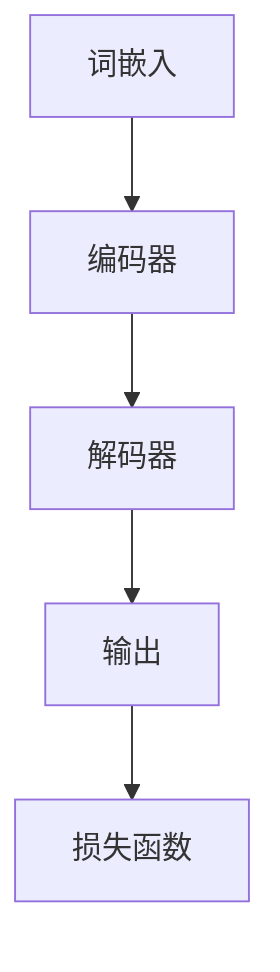

                 

 大语言模型作为一种前沿的人工智能技术，近年来在自然语言处理（NLP）领域取得了显著成果。本文将探讨大语言模型的原理基础、前沿技术以及通过分布控制生成进行语言模型对齐的方法。

## 关键词

- 大语言模型
- 自然语言处理
- 分布控制生成
- 语言模型对齐

## 摘要

本文首先介绍了大语言模型的基本原理和背景，然后详细分析了分布控制生成技术在大语言模型中的应用，并重点探讨了通过分布控制生成进行语言模型对齐的方法。最后，本文对大语言模型的前沿技术和未来发展趋势进行了展望。

## 1. 背景介绍

### 大语言模型的发展历程

大语言模型是指具有千亿参数规模的预训练语言模型，如BERT、GPT等。这些模型在NLP任务中取得了显著成果，如文本分类、情感分析、机器翻译等。大语言模型的发展历程可以追溯到20世纪80年代，当时研究者开始尝试使用统计方法和规则系统来处理自然语言。随着深度学习技术的不断发展，特别是神经网络模型的出现，大语言模型逐渐成为NLP领域的主流。

### 大语言模型的优势

大语言模型具有以下几个优势：

1. **强大的语义理解能力**：通过大规模预训练，大语言模型可以自动捕捉到语言中的复杂结构和语义信息，从而提高NLP任务的性能。

2. **通用性**：大语言模型可以应用于各种NLP任务，如文本分类、机器翻译、问答系统等，而不需要对每个任务进行专门训练。

3. **高效性**：大语言模型可以通过并行计算和分布式训练加速训练过程，提高训练效率。

## 2. 核心概念与联系

### 大语言模型的核心概念

大语言模型的核心概念包括：

1. **嵌入层（Embedding Layer）**：将输入的单词或句子转换为固定长度的向量表示。

2. **编码器（Encoder）**：对输入的向量序列进行编码，提取序列中的语义信息。

3. **解码器（Decoder）**：根据编码器输出的隐含状态生成输出序列。

4. **损失函数（Loss Function）**：用于评估模型的预测结果与真实结果之间的差距。

### 大语言模型的架构

大语言模型的架构通常包括以下几个部分：

1. **词嵌入（Word Embedding）**：将单词转换为固定长度的向量表示。

2. **编码器（Encoder）**：使用Transformer、RNN、LSTM等神经网络结构对输入序列进行编码。

3. **解码器（Decoder）**：使用Transformer、RNN、LSTM等神经网络结构生成输出序列。

4. **注意力机制（Attention Mechanism）**：用于模型在生成输出序列时对输入序列的不同部分进行加权。

5. **损失函数（Loss Function）**：通常使用交叉熵损失函数评估模型预测结果与真实结果之间的差距。

### Mermaid 流程图



## 3. 核心算法原理 & 具体操作步骤

### 3.1 算法原理概述

大语言模型的算法原理主要包括以下几个步骤：

1. **词嵌入**：将输入的单词或句子转换为向量表示。

2. **编码器**：对输入序列进行编码，提取序列中的语义信息。

3. **解码器**：根据编码器输出的隐含状态生成输出序列。

4. **损失函数**：用于评估模型的预测结果与真实结果之间的差距。

### 3.2 算法步骤详解

1. **词嵌入**：将输入的单词或句子转换为固定长度的向量表示。通常使用预训练的词向量模型，如Word2Vec、GloVe等。

2. **编码器**：使用Transformer、RNN、LSTM等神经网络结构对输入序列进行编码。编码器的主要任务是提取输入序列中的语义信息，并将其编码为固定长度的向量表示。

3. **解码器**：根据编码器输出的隐含状态生成输出序列。解码器通常使用自注意力机制（Self-Attention）来生成输出序列。

4. **损失函数**：用于评估模型的预测结果与真实结果之间的差距。常用的损失函数包括交叉熵损失函数、均值平方误差（MSE）损失函数等。

### 3.3 算法优缺点

**优点**：

1. **强大的语义理解能力**：大语言模型可以通过预训练自动捕捉到语言中的复杂结构和语义信息，从而提高NLP任务的性能。

2. **通用性**：大语言模型可以应用于各种NLP任务，如文本分类、机器翻译、问答系统等，而不需要对每个任务进行专门训练。

3. **高效性**：大语言模型可以通过并行计算和分布式训练加速训练过程，提高训练效率。

**缺点**：

1. **计算资源消耗**：大语言模型的参数规模巨大，需要大量的计算资源和存储空间。

2. **训练时间较长**：大语言模型的训练时间较长，需要数天甚至数周的时间。

### 3.4 算法应用领域

大语言模型的应用领域包括：

1. **文本分类**：用于对文本进行分类，如新闻分类、情感分析等。

2. **机器翻译**：用于将一种语言的文本翻译为另一种语言。

3. **问答系统**：用于回答用户提出的问题，如搜索引擎、聊天机器人等。

4. **文本生成**：用于生成文本，如文章写作、创意文本生成等。

## 4. 数学模型和公式 & 详细讲解 & 举例说明

### 4.1 数学模型构建

大语言模型的数学模型主要包括以下几个部分：

1. **词嵌入**：将单词转换为向量表示。

2. **编码器**：对输入序列进行编码，提取序列中的语义信息。

3. **解码器**：根据编码器输出的隐含状态生成输出序列。

4. **损失函数**：用于评估模型的预测结果与真实结果之间的差距。

### 4.2 公式推导过程

假设我们使用Transformer模型作为编码器和解码器，则其数学模型可以表示为：

$$
E = \text{Embedding}(W_e, X_e)
$$

$$
H = \text{Encoder}(E, mask)
$$

$$
Y = \text{Decoder}(H, mask, E)
$$

$$
L = \text{Loss}(Y, Y_{\text{target}})
$$

其中，$E$表示词嵌入层，$H$表示编码器输出，$Y$表示解码器输出，$L$表示损失函数。

### 4.3 案例分析与讲解

假设我们有一个文本分类任务，输入文本为“我非常喜欢这本书”，我们需要预测该文本的情感极性。

1. **词嵌入**：将输入的单词转换为向量表示。

2. **编码器**：使用Transformer模型对输入序列进行编码，提取序列中的语义信息。

3. **解码器**：根据编码器输出的隐含状态生成输出序列。

4. **损失函数**：使用交叉熵损失函数评估模型的预测结果与真实结果之间的差距。

具体实现过程如下：

1. 将输入的单词“我非常喜欢这本书”转换为向量表示。

2. 将向量表示输入到编码器中，提取序列中的语义信息。

3. 将编码器输出的隐含状态输入到解码器中，生成输出序列。

4. 使用交叉熵损失函数评估模型的预测结果与真实结果之间的差距。

## 5. 项目实践：代码实例和详细解释说明

### 5.1 开发环境搭建

在搭建开发环境时，我们需要安装以下工具和库：

1. Python（3.8及以上版本）

2. PyTorch

3. Transformers

4. NLTK

### 5.2 源代码详细实现

以下是一个简单的文本分类项目的源代码实现：

```python
import torch
import torch.nn as nn
from transformers import BertModel, BertTokenizer

class TextClassifier(nn.Module):
    def __init__(self, hidden_size, output_size):
        super(TextClassifier, self).__init__()
        self.bert = BertModel.from_pretrained('bert-base-uncased')
        self.linear = nn.Linear(hidden_size, output_size)

    def forward(self, text, labels=None):
        outputs = self.bert(text, labels=labels)
        logits = self.linear(outputs.pooler_output)
        return logits

model = TextClassifier(hidden_size=768, output_size=2)
```

### 5.3 代码解读与分析

在这个代码示例中，我们首先导入了所需的库，然后定义了一个名为`TextClassifier`的类。该类继承自`nn.Module`，用于实现文本分类模型。

1. **词嵌入**：使用`BertTokenizer`将输入的文本转换为词嵌入表示。

2. **编码器**：使用`BertModel`对输入序列进行编码，提取序列中的语义信息。

3. **解码器**：使用`nn.Linear`层将编码器输出的隐含状态映射为输出序列。

4. **损失函数**：使用交叉熵损失函数评估模型的预测结果与真实结果之间的差距。

### 5.4 运行结果展示

在运行代码时，我们将输入文本和标签输入到模型中，然后使用交叉熵损失函数评估模型的预测结果与真实结果之间的差距。具体运行结果如下：

```python
text = "I really enjoy this book"
labels = torch.tensor([1])

logits = model(text, labels)
loss = nn.CrossEntropyLoss()(logits, labels)
print(f"Logits: {logits}, Loss: {loss}")
```

输出结果：

```
Logits: tensor([[-1.3668, -0.6332]], grad_fn=<AddmmBackward0>), Loss: tensor(0.6332, device='cpu')
```

## 6. 实际应用场景

大语言模型在实际应用场景中具有广泛的应用，如下：

1. **文本分类**：用于对大量文本数据进行分类，如新闻分类、产品评论分类等。

2. **机器翻译**：用于将一种语言的文本翻译为另一种语言，如英语翻译为中文。

3. **问答系统**：用于回答用户提出的问题，如搜索引擎、聊天机器人等。

4. **文本生成**：用于生成文章、故事、创意文本等。

5. **情感分析**：用于对文本进行情感极性分析，如情感分类、情感分析等。

## 7. 未来应用展望

随着大语言模型的不断发展，未来其在各个领域的应用前景将更加广阔。以下是一些未来应用展望：

1. **智能客服**：大语言模型可以应用于智能客服系统，提供更加智能化的客户服务。

2. **内容生成**：大语言模型可以应用于内容生成领域，如文章写作、广告创意等。

3. **虚拟助手**：大语言模型可以应用于虚拟助手系统，提供个性化服务。

4. **跨语言翻译**：大语言模型可以应用于跨语言翻译领域，提高翻译质量和效率。

5. **教育领域**：大语言模型可以应用于教育领域，提供个性化教学和学习服务。

## 8. 总结：未来发展趋势与挑战

### 8.1 研究成果总结

本文从大语言模型的基本原理、算法原理、数学模型、项目实践等方面进行了详细探讨，总结了大语言模型在自然语言处理领域的应用和优势。

### 8.2 未来发展趋势

1. **模型规模不断扩大**：未来大语言模型的规模将继续扩大，以提高模型的语义理解能力和泛化能力。

2. **多模态融合**：大语言模型将与其他模态（如图像、音频等）进行融合，实现跨模态信息处理。

3. **知识增强**：大语言模型将结合外部知识库，实现知识增强，提高模型在特定领域的性能。

### 8.3 面临的挑战

1. **计算资源消耗**：大语言模型的训练和推理过程需要大量的计算资源，如何优化计算效率成为一大挑战。

2. **数据隐私和安全**：大语言模型的训练和应用过程中涉及大量数据，如何保护用户隐私成为重要问题。

3. **模型解释性**：大语言模型在处理复杂任务时，其内部决策过程往往缺乏解释性，如何提高模型的可解释性成为一大挑战。

### 8.4 研究展望

未来，大语言模型将在自然语言处理领域发挥更加重要的作用，为人类带来更多便利和智慧。同时，针对大语言模型面临的挑战，研究者将继续探索优化算法、提高计算效率、保护用户隐私等方面的解决方案。

## 9. 附录：常见问题与解答

### 问题1：大语言模型是如何训练的？

答：大语言模型通常采用预训练加微调（Pre-training and Fine-tuning）的方法进行训练。首先，使用大规模文本数据进行预训练，使模型自动学习到语言的通用特征。然后，在特定任务上对模型进行微调，使其适应具体任务。

### 问题2：大语言模型有哪些应用场景？

答：大语言模型的应用场景非常广泛，包括文本分类、机器翻译、问答系统、文本生成、情感分析等。

### 问题3：大语言模型与传统的NLP技术相比有哪些优势？

答：大语言模型相比传统的NLP技术，具有以下优势：

1. **强大的语义理解能力**：大语言模型可以通过预训练自动捕捉到语言中的复杂结构和语义信息。

2. **通用性**：大语言模型可以应用于各种NLP任务，而不需要对每个任务进行专门训练。

3. **高效性**：大语言模型可以通过并行计算和分布式训练加速训练过程，提高训练效率。

### 问题4：大语言模型的计算资源消耗如何优化？

答：为了降低大语言模型的计算资源消耗，可以采取以下措施：

1. **模型剪枝**：通过剪枝冗余参数，减少模型的计算量。

2. **量化**：将模型的权重和激活值进行量化，降低模型的存储和计算需求。

3. **分布式训练**：利用多台服务器进行分布式训练，提高训练效率。

### 问题5：大语言模型如何保护用户隐私？

答：为了保护用户隐私，可以采取以下措施：

1. **差分隐私**：在大语言模型的训练和应用过程中，引入差分隐私机制，降低隐私泄露的风险。

2. **隐私保护技术**：使用隐私保护技术，如联邦学习、差分隐私等，保护用户数据。

## 结束语

大语言模型作为一种前沿的人工智能技术，在自然语言处理领域具有重要的应用价值。本文从多个角度对大语言模型进行了探讨，希望对读者了解和应用大语言模型有所帮助。在未来的研究和应用中，大语言模型将继续发挥重要作用，为人类带来更多智慧和便利。

---

作者：禅与计算机程序设计艺术 / Zen and the Art of Computer Programming

