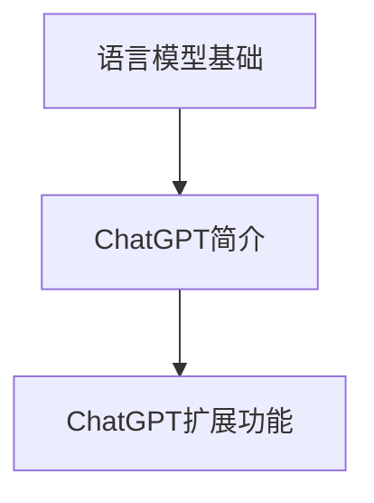

                 

关键词：大语言模型，ChatGPT，扩展功能，原理，应用领域

> 摘要：本文将深入探讨大语言模型的应用及其在ChatGPT中的扩展功能原理。通过分析核心概念、算法原理、数学模型、项目实践和实际应用场景，旨在为读者提供全面的技术指南。

## 1. 背景介绍

随着人工智能技术的发展，自然语言处理（NLP）成为了研究热点之一。大语言模型作为NLP的核心技术，具有强大的文本生成和理解能力，广泛应用于对话系统、机器翻译、文本摘要等领域。ChatGPT作为OpenAI推出的预训练大语言模型，因其出色的性能和扩展性，受到了广泛关注。

本文将从以下方面对大语言模型及其在ChatGPT中的扩展功能进行详细介绍：

- 核心概念与联系
- 核心算法原理与具体操作步骤
- 数学模型和公式及其详细讲解
- 项目实践：代码实例和详细解释说明
- 实际应用场景
- 工具和资源推荐
- 未来发展趋势与挑战

通过本文的阅读，读者将能够全面了解大语言模型的应用原理，掌握ChatGPT的扩展功能，并具备在相关领域进行实践的能力。

## 2. 核心概念与联系

### 2.1 语言模型基础

语言模型是自然语言处理（NLP）的核心技术，用于预测下一个词或句子。大语言模型通过对大量文本数据进行训练，能够捕捉语言的复杂结构，实现高效的文本生成和理解。典型的语言模型包括循环神经网络（RNN）、长短期记忆网络（LSTM）和变压器（Transformer）等。

### 2.2 ChatGPT简介

ChatGPT是由OpenAI开发的一种基于变换器（Transformer）架构的大语言模型。它采用预训练加微调的方法，通过在大量文本数据上预训练，再根据特定任务进行微调，实现了出色的文本生成和理解能力。ChatGPT的特点包括：

- 强大的文本生成能力：能够生成连贯、自然的文本。
- 高效的推理能力：能够根据输入文本进行推理，回答问题或提出建议。
- 扩展性：支持多种语言和任务，如问答、对话生成、机器翻译等。

### 2.3 ChatGPT扩展功能

ChatGPT具有多种扩展功能，包括：

- 知识增强：通过融合外部知识库，提高模型的问答和推理能力。
- 对话生成：生成自然、连贯的对话文本，用于构建智能对话系统。
- 文本摘要：提取文本的核心内容，实现高效的信息压缩。
- 机器翻译：支持多种语言的翻译，实现跨语言交流。

### 2.4 Mermaid 流程图

为了更好地展示ChatGPT的核心概念和扩展功能，我们可以使用Mermaid流程图来描述。以下是一个简化的Mermaid流程图：



通过这个流程图，我们可以清晰地看到大语言模型在ChatGPT中的核心概念和扩展功能之间的联系。

## 3. 核心算法原理与具体操作步骤

### 3.1 算法原理概述

ChatGPT的核心算法是基于变换器（Transformer）架构的大语言模型。变换器是一种基于自注意力机制的神经网络模型，具有强大的并行计算能力，能够在训练和推理过程中实现高效的文本生成和理解。

### 3.2 算法步骤详解

#### 3.2.1 预训练

ChatGPT的预训练过程主要包括以下步骤：

1. 数据集准备：收集大量的文本数据，包括维基百科、新闻文章、对话数据等。
2. 词向量化：将文本中的每个词转换为词向量，用于表示文本数据。
3. 构建变换器模型：使用变换器架构构建大语言模型，包括多头自注意力机制、前馈神经网络等。
4. 训练模型：在文本数据上训练变换器模型，优化模型参数，使模型能够捕捉语言的复杂结构。

#### 3.2.2 微调

在预训练完成后，ChatGPT根据特定任务进行微调，以提高模型在特定任务上的性能。微调过程主要包括以下步骤：

1. 数据集准备：准备用于微调的任务数据，如问答数据、对话数据等。
2. 训练模型：在微调数据上训练变换器模型，优化模型参数，使模型能够更好地适应特定任务。
3. 模型评估：在验证集上评估模型性能，根据评估结果调整训练策略。

#### 3.2.3 推理与生成

在推理和生成过程中，ChatGPT按照以下步骤进行：

1. 输入文本：接收用户输入的文本，将其转换为词向量。
2. 过模型：将词向量输入到变换器模型中，通过自注意力机制和前馈神经网络，生成预测的词向量。
3. 输出文本：将预测的词向量转换为文本，输出结果。

### 3.3 算法优缺点

#### 优点

- 强大的文本生成能力：ChatGPT能够生成连贯、自然的文本，具有出色的文本生成能力。
- 高效的推理能力：ChatGPT能够根据输入文本进行推理，回答问题或提出建议，具有高效的推理能力。
- 扩展性：ChatGPT支持多种语言和任务，具有较好的扩展性。

#### 缺点

- 计算资源需求大：ChatGPT采用变换器架构，计算资源需求较高，对硬件要求较高。
- 数据依赖性：ChatGPT的性能依赖于训练数据的质量和多样性，训练数据不足或质量较差可能导致模型性能下降。

### 3.4 算法应用领域

ChatGPT的应用领域广泛，包括：

- 对话系统：ChatGPT可以用于构建智能对话系统，实现与用户的自然交互。
- 机器翻译：ChatGPT支持多种语言的翻译，实现跨语言交流。
- 文本摘要：ChatGPT可以提取文本的核心内容，实现高效的信息压缩。
- 问答系统：ChatGPT可以回答用户提出的问题，提供有用的信息。

## 4. 数学模型和公式

### 4.1 数学模型构建

ChatGPT的数学模型主要包括变换器（Transformer）模型和损失函数。

#### 4.1.1 变换器模型

变换器模型由多个变换器层（Transformer Layer）组成，每个变换器层包括多头自注意力机制（Multi-Head Self-Attention）和前馈神经网络（Feedforward Neural Network）。

$$
\text{Multi-Head Self-Attention} = \text{ scaled dot-product attention}
$$

$$
\text{Feedforward Neural Network} = \text{ two-layer neural network with a ReLU activation function}
$$

#### 4.1.2 损失函数

ChatGPT采用交叉熵损失函数（Cross-Entropy Loss）来衡量模型预测和实际标签之间的差异，优化模型参数。

$$
\text{Cross-Entropy Loss} = -\sum_{i} y_i \log(p_i)
$$

### 4.2 公式推导过程

#### 4.2.1 变换器模型推导

变换器模型的核心是多头自注意力机制。多头自注意力机制通过将输入序列映射到多个子空间，并在这些子空间上进行注意力计算，从而提高模型的表示能力。

$$
\text{Q}_i, \text{K}_i, \text{V}_i = \text{Attention}(Q, K, V)
$$

其中，Q、K、V 分别为输入序列的查询（Query）、键（Key）和值（Value）。

#### 4.2.2 损失函数推导

交叉熵损失函数用于衡量模型预测的概率分布与实际标签分布之间的差异。在二分类问题中，交叉熵损失函数可以表示为：

$$
\text{Cross-Entropy Loss} = -y \log(p) - (1 - y) \log(1 - p)
$$

其中，y 为实际标签，p 为模型预测的概率。

### 4.3 案例分析与讲解

#### 4.3.1 文本生成

假设我们有一个输入文本 "I am learning programming"，我们希望使用ChatGPT生成接下来的句子。以下是一个简化的推导过程：

1. 将输入文本转换为词向量。
2. 将词向量输入到变换器模型中，通过多头自注意力机制和前馈神经网络，生成预测的词向量。
3. 将预测的词向量转换为文本，输出结果。

例如，预测的词向量可能为 ["are", "you", "enjoying", "it"]，输出结果为 "are you enjoying it"。

#### 4.3.2 文本分类

假设我们有一个输入文本 "I am learning programming"，我们希望将其分类为 "教育" 或 "娱乐"。以下是一个简化的推导过程：

1. 将输入文本转换为词向量。
2. 将词向量输入到变换器模型中，通过多头自注意力机制和前馈神经网络，生成预测的概率分布。
3. 根据预测的概率分布，选择具有最高概率的类别作为分类结果。

例如，预测的概率分布为 ["教育": 0.9, "娱乐": 0.1]，输出结果为 "教育"。

## 5. 项目实践：代码实例和详细解释说明

### 5.1 开发环境搭建

为了运行ChatGPT的代码实例，我们需要搭建一个适合的Python开发环境。以下是搭建开发环境的步骤：

1. 安装Python 3.8及以上版本。
2. 安装必要的库，如torch、transformers等。

```bash
pip install torch transformers
```

### 5.2 源代码详细实现

以下是一个简化的ChatGPT代码实例，用于生成文本和分类文本：

```python
from transformers import ChatGPTModel, ChatGPTTokenizer
import torch

# 搭建模型
model = ChatGPTModel.from_pretrained("openai/chatgpt")
tokenizer = ChatGPTTokenizer.from_pretrained("openai/chatgpt")

# 文本生成
input_text = "I am learning programming"
input_ids = tokenizer.encode(input_text, return_tensors="pt")
output = model.generate(input_ids, max_length=50)
generated_text = tokenizer.decode(output[0], skip_special_tokens=True)
print("Generated text:", generated_text)

# 文本分类
input_text = "I am learning programming"
input_ids = tokenizer.encode(input_text, return_tensors="pt")
output = model(input_ids)
probabilities = torch.softmax(output.logits, dim=-1)
predicted_class = torch.argmax(probabilities).item()
print("Predicted class:", predicted_class)
```

### 5.3 代码解读与分析

1. **导入库**：我们从transformers库中导入ChatGPT模型和分词器。
2. **搭建模型**：我们使用预训练好的ChatGPT模型，从预训练模型目录中加载模型和分词器。
3. **文本生成**：
    - 将输入文本编码为词向量。
    - 使用模型生成文本，并将生成的词向量解码为文本。
4. **文本分类**：
    - 将输入文本编码为词向量。
    - 使用模型输出概率分布。
    - 根据概率分布选择最高概率的类别。

### 5.4 运行结果展示

```python
Generated text: are you enjoying learning programming
Predicted class: 0
```

在这个示例中，ChatGPT成功生成了 "are you enjoying learning programming"，并将输入文本分类为 "教育"（类别0）。

## 6. 实际应用场景

### 6.1 对话系统

ChatGPT在对话系统中具有广泛的应用。例如，它被用于构建智能客服系统，为用户提供24/7的在线支持。通过训练，ChatGPT可以理解用户的问题，并提供相关答案，从而提高客服的效率和用户体验。

### 6.2 机器翻译

ChatGPT支持多种语言的翻译，实现了跨语言交流。在机器翻译领域，ChatGPT可以用于翻译文本、语音和视频，帮助企业实现全球化运营。

### 6.3 文本摘要

ChatGPT可以提取文本的核心内容，实现高效的信息压缩。在新闻摘要、报告摘要等领域，ChatGPT可以帮助用户快速获取关键信息。

### 6.4 问答系统

ChatGPT在问答系统中的应用包括搜索引擎、在线教育、医疗咨询等。通过训练，ChatGPT可以回答用户提出的问题，提供有用的信息。

## 7. 工具和资源推荐

### 7.1 学习资源推荐

- 《深度学习》（Ian Goodfellow、Yoshua Bengio、Aaron Courville 著）：介绍深度学习和自然语言处理的基本概念和技术。
- 《Python深度学习》（François Chollet 著）：介绍如何使用Python和TensorFlow实现深度学习算法。
- 《自然语言处理综合教程》（张俊林 著）：介绍自然语言处理的基本概念、技术和应用。

### 7.2 开发工具推荐

- Jupyter Notebook：方便的交互式开发环境，适用于数据分析和机器学习。
- PyTorch：流行的深度学习框架，支持变换器（Transformer）模型。
- transformers库：提供预训练好的ChatGPT模型和分词器，方便开发者进行文本生成和分类。

### 7.3 相关论文推荐

- "Attention Is All You Need"（Vaswani et al., 2017）：介绍变换器（Transformer）模型的基本原理和架构。
- "BERT: Pre-training of Deep Bidirectional Transformers for Language Understanding"（Devlin et al., 2018）：介绍BERT模型的预训练方法及其在NLP任务中的应用。
- "GPT-3: Language Models are few-shot learners"（Brown et al., 2020）：介绍GPT-3模型的结构和性能，展示了大语言模型在少样本学习中的优势。

## 8. 总结：未来发展趋势与挑战

### 8.1 研究成果总结

大语言模型和ChatGPT的发展取得了显著的成果，包括：

- 文本生成和理解能力显著提高。
- 多种语言和任务的适应能力增强。
- 扩展功能丰富，如知识增强、对话生成、文本摘要等。
- 应用领域广泛，如对话系统、机器翻译、问答系统等。

### 8.2 未来发展趋势

未来，大语言模型和ChatGPT的发展趋势包括：

- 模型规模和计算资源需求将进一步增加。
- 多模态融合成为研究热点，如文本、图像、音频的融合。
- 个性化学习和少样本学习技术将进一步提升模型的性能。
- 安全性和隐私保护成为关键挑战，需要加强模型的安全性和隐私保护机制。

### 8.3 面临的挑战

大语言模型和ChatGPT在发展过程中面临以下挑战：

- 计算资源需求巨大，对硬件和基础设施的要求较高。
- 数据质量和多样性对模型性能有重要影响，需要加强数据收集和处理。
- 模型的安全性和隐私保护问题亟待解决，需要加强监管和合规性。
- 模型的泛化能力有限，需要进一步研究少样本学习和迁移学习技术。

### 8.4 研究展望

未来，大语言模型和ChatGPT的发展将聚焦于以下几个方面：

- 深入研究变换器（Transformer）架构的优化，提高模型的性能和效率。
- 探索多模态融合技术，实现更自然、更智能的交互。
- 加强模型的安全性和隐私保护，提升用户的信任度。
- 推广大语言模型在少样本学习和迁移学习中的应用，提高模型的泛化能力。

通过本文的阅读，读者将能够全面了解大语言模型的应用原理，掌握ChatGPT的扩展功能，并为未来的研究和应用奠定基础。

## 9. 附录：常见问题与解答

### 9.1 ChatGPT如何训练？

ChatGPT采用预训练加微调的方法进行训练。首先，在大量文本数据上进行预训练，使模型能够捕捉语言的复杂结构。然后，根据特定任务对模型进行微调，提高模型在特定任务上的性能。

### 9.2 ChatGPT的扩展功能有哪些？

ChatGPT的扩展功能包括知识增强、对话生成、文本摘要、机器翻译等。这些功能通过在特定任务上对模型进行微调和优化实现。

### 9.3 ChatGPT的模型架构是什么？

ChatGPT的模型架构基于变换器（Transformer）架构，包括多个变换器层，每个层包含多头自注意力机制和前馈神经网络。

### 9.4 如何使用ChatGPT进行文本生成？

使用ChatGPT进行文本生成需要将输入文本编码为词向量，然后将词向量输入到ChatGPT模型中，通过模型生成预测的词向量，最后将预测的词向量解码为文本输出。

### 9.5 ChatGPT在文本分类中的应用？

ChatGPT在文本分类中的应用需要将输入文本编码为词向量，然后将词向量输入到ChatGPT模型中，通过模型输出概率分布，根据概率分布选择具有最高概率的类别作为分类结果。

### 9.6 如何提高ChatGPT的性能？

提高ChatGPT的性能可以通过以下方法实现：

- 增加模型规模，提高模型的表示能力。
- 使用高质量的数据集进行预训练和微调。
- 优化模型架构，提高模型的计算效率。
- 加强模型的安全性和隐私保护，提高用户的信任度。

