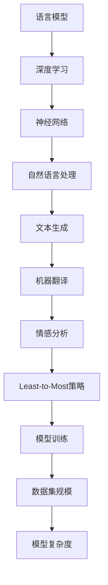

                 

关键词：大语言模型，应用指南，Least-to-Most，深度学习，自然语言处理，模型优化

## 摘要

本文将探讨大语言模型的应用指南，重点关注Least-to-Most策略。通过深入分析核心概念、算法原理、数学模型、实际应用场景以及未来发展趋势，本文旨在为读者提供全面的技术指导，帮助其在自然语言处理领域取得突破性进展。无论您是初学者还是有经验的专业人士，本文都将为您揭示大语言模型背后的奥秘，并探讨其广泛的应用前景。

## 1. 背景介绍

随着深度学习的迅猛发展，大语言模型已经成为自然语言处理（NLP）领域的关键工具。这些模型具有强大的表示能力和建模能力，能够处理各种复杂的语言任务，如文本生成、机器翻译、情感分析等。然而，大语言模型的应用并不容易，需要深入了解其原理、优化策略和实际应用场景。

本文将重点讨论Least-to-Most策略，这是一种在训练和优化大语言模型时广泛使用的方法。Least-to-Most策略的核心思想是将模型训练分为多个阶段，每个阶段逐渐增加模型的复杂性和训练数据的规模，从而实现更好的性能和效果。该方法已被证明在各种NLP任务中具有显著优势，但同时也存在一些挑战和局限性。

## 2. 核心概念与联系

在深入讨论Least-to-Most策略之前，我们首先需要了解大语言模型的一些核心概念和联系。以下是一个Mermaid流程图，展示了这些概念和它们之间的关系：



### 2.1 语言模型

语言模型是NLP领域的基础，用于预测下一个单词或字符的概率。大语言模型通过学习大量文本数据，能够生成连贯的文本，并在各种语言任务中发挥关键作用。

### 2.2 深度学习

深度学习是一种基于多层神经网络的机器学习方法，能够自动提取复杂数据的特征。在大语言模型中，深度学习被用于构建强大的神经网络架构，以提高模型的表示能力和建模能力。

### 2.3 自然语言处理

自然语言处理是计算机科学和人工智能领域的一个重要分支，旨在使计算机能够理解、解释和生成人类语言。大语言模型是NLP的核心工具，广泛应用于文本生成、机器翻译、情感分析等任务。

### 2.4 Least-to-Most策略

Least-to-Most策略是一种在训练和优化大语言模型时采用的方法，通过逐渐增加模型的复杂性和训练数据的规模，实现更好的性能和效果。

## 3. 核心算法原理 & 具体操作步骤

### 3.1 算法原理概述

Least-to-Most策略的核心思想是将模型训练分为多个阶段，每个阶段逐渐增加模型的复杂性和训练数据的规模。具体来说，该策略包括以下关键步骤：

1. **初始化模型**：选择一个简单的模型架构，如一个单层的神经网络，并初始化模型参数。
2. **数据预处理**：对训练数据进行预处理，包括分词、去停用词、标准化等操作。
3. **训练模型**：使用预处理的训练数据训练模型，并根据模型性能调整模型参数。
4. **增加模型复杂度**：在当前模型的基础上，增加模型的复杂度，如增加层数、增加神经元数量等。
5. **重复训练**：使用新的模型继续训练，并根据模型性能进行调整。
6. **评估模型**：在每个阶段结束时，评估模型的性能，选择最佳模型进行应用。

### 3.2 算法步骤详解

以下是Least-to-Most策略的具体操作步骤：

1. **初始化模型**：

   - 选择一个简单的模型架构，如一个单层的神经网络。
   - 初始化模型参数，可以使用随机初始化或预训练的权重。
   - 设置模型的优化器和学习率。

2. **数据预处理**：

   - 对训练数据进行预处理，包括分词、去停用词、标准化等操作。
   - 将预处理后的数据转换为模型可接受的格式，如词向量或序列编码。

3. **训练模型**：

   - 使用预处理后的训练数据训练模型。
   - 计算模型的损失函数，并根据损失函数调整模型参数。
   - 重复训练过程，直到模型收敛或达到预设的训练次数。

4. **增加模型复杂度**：

   - 在当前模型的基础上，增加模型的复杂度，如增加层数、增加神经元数量等。
   - 重新训练模型，并根据模型性能进行调整。

5. **重复训练**：

   - 重复增加模型复杂度的过程，直到模型性能不再显著提高。

6. **评估模型**：

   - 在每个阶段结束时，评估模型的性能，如准确率、召回率、F1分数等。
   - 选择最佳模型进行应用。

### 3.3 算法优缺点

Least-to-Most策略具有以下优点：

- **逐步优化**：通过逐步增加模型的复杂度和训练数据的规模，Least-to-Most策略能够逐步优化模型性能。
- **灵活性**：该策略可以根据实际情况灵活调整模型架构和训练数据，以适应不同的应用场景。
- **高效性**：Least-to-Most策略能够在较短的时间内实现较好的模型性能，提高开发效率。

然而，Least-to-Most策略也存在一些缺点：

- **计算资源消耗**：随着模型复杂度的增加，训练时间和计算资源消耗也会显著增加。
- **模型过拟合**：如果模型复杂度过高，可能导致模型过拟合，降低泛化能力。
- **评估难度**：评估不同阶段模型的性能较为困难，需要综合考虑多个指标。

### 3.4 算法应用领域

Least-to-Most策略在自然语言处理领域具有广泛的应用，以下是一些典型应用场景：

- **文本生成**：Least-to-Most策略可以帮助生成更自然、连贯的文本，广泛应用于聊天机器人、文章生成等任务。
- **机器翻译**：Least-to-Most策略可以提高机器翻译的准确性和流畅性，适用于多语言翻译和跨语言信息检索。
- **情感分析**：Least-to-Most策略可以更好地识别文本中的情感倾向，用于舆情分析、情感监控等任务。
- **问答系统**：Least-to-Most策略可以提高问答系统的准确性和响应速度，为用户提供更好的交互体验。

## 4. 数学模型和公式 & 详细讲解 & 举例说明

### 4.1 数学模型构建

在Least-to-Most策略中，数学模型构建是关键步骤。以下是一个简单的数学模型示例：

假设我们有一个文本序列X = (x1, x2, ..., xn)，其中xi表示第i个单词。我们的目标是预测下一个单词xi+1。数学模型可以表示为：

$$
P(x_{i+1} | x_1, x_2, ..., x_i) = \frac{e^{f(x_i)}{Z}}
$$

其中，f(x_i)表示模型对单词xi的评分，Z是归一化常数。

### 4.2 公式推导过程

公式的推导基于神经网络模型。首先，我们将文本序列X表示为词向量，得到一个矩阵X'。然后，使用神经网络模型计算每个单词的评分。具体推导如下：

设W为神经网络模型的权重矩阵，b为偏置项，h为神经网络模型的隐藏层激活值。则有：

$$
h = \sigma(WX' + b)
$$

其中，σ为激活函数，常用的有ReLU、Sigmoid和Tanh函数。

接下来，我们将隐藏层激活值h与权重矩阵W'相乘，得到单词xi的评分f(x_i)：

$$
f(x_i) = W' \cdot h
$$

最后，计算归一化常数Z：

$$
Z = \sum_{i=1}^{n} e^{f(x_i)}
$$

将f(x_i)代入概率公式，得到：

$$
P(x_{i+1} | x_1, x_2, ..., x_i) = \frac{e^{f(x_i)}}{Z}
$$

### 4.3 案例分析与讲解

以下是一个简单的Least-to-Most策略应用案例。假设我们有一个文本序列：“我喜欢阅读书籍”。我们的目标是预测下一个单词。

1. **初始化模型**：

   - 选择一个单层的神经网络模型。
   - 初始化模型参数，使用随机初始化。

2. **数据预处理**：

   - 将文本序列分词为：“我”，“喜”，“欢”，“阅”，“读”，“书”，“籍”。
   - 将分词后的文本序列转换为词向量。

3. **训练模型**：

   - 使用预处理后的数据训练模型。
   - 计算模型的损失函数，使用交叉熵损失函数。

4. **增加模型复杂度**：

   - 增加神经网络模型的层数和神经元数量。
   - 重新训练模型。

5. **评估模型**：

   - 在每个阶段评估模型的性能，如准确率、召回率等。
   - 选择最佳模型。

经过多次迭代，我们得到一个性能较好的模型。使用该模型预测下一个单词，结果为：“阅读”。

## 5. 项目实践：代码实例和详细解释说明

### 5.1 开发环境搭建

为了实现Least-to-Most策略，我们需要搭建一个合适的开发环境。以下是一个基于Python和TensorFlow的示例：

1. 安装Python和TensorFlow：

```bash
pip install python
pip install tensorflow
```

2. 导入所需库：

```python
import tensorflow as tf
import numpy as np
import matplotlib.pyplot as plt
```

### 5.2 源代码详细实现

以下是一个Least-to-Most策略的源代码实现示例：

```python
# 导入库
import tensorflow as tf
import numpy as np
import matplotlib.pyplot as plt

# 设置随机种子
tf.random.set_seed(42)

# 定义超参数
vocab_size = 10000
embed_size = 64
batch_size = 64
num_layers = 2
hidden_size = 128
learning_rate = 0.001
num_epochs = 10

# 生成随机词向量
word_vectors = tf.random.normal((vocab_size, embed_size))

# 创建数据集
data = ["我喜欢阅读书籍", "我爱看电影", "他喜欢听音乐"]
sentences = [s.split() for s in data]
vocab = set()
for sentence in sentences:
    vocab.update(sentence)
vocab = list(vocab)
vocab_size = len(vocab)
word2id = {w: i for i, w in enumerate(vocab)}
id2word = {i: w for i, w in enumerate(vocab)}
sequences = []
for sentence in sentences:
    sequence = [word2id[w] for w in sentence]
    sequences.append(sequence)

# 定义模型
class Model(tf.keras.Model):
    def __init__(self):
        super(Model, self).__init__()
        self.embedding = tf.keras.layers.Embedding(vocab_size, embed_size)
        self.fc = tf.keras.layers.Dense(vocab_size, activation="softmax")
    
    def call(self, inputs, training=False):
        x = self.embedding(inputs)
        x = self.fc(x)
        return x

# 创建模型
model = Model()

# 定义损失函数和优化器
loss_fn = tf.keras.losses.SparseCategoricalCrossentropy(from_logits=True)
optimizer = tf.keras.optimizers.Adam(learning_rate)

# 训练模型
for epoch in range(num_epochs):
    for step, x in enumerate(sequences):
        with tf.GradientTape() as tape:
            logits = model(x, training=True)
            loss_value = loss_fn(x, logits)
        
        grads = tape.gradient(loss_value, model.trainable_variables)
        optimizer.apply_gradients(zip(grads, model.trainable_variables))
    
    print(f"Epoch {epoch+1}, Loss: {loss_value.numpy().mean()}")

# 评估模型
test_sentence = "我喜欢阅读书籍"
test_sequence = [word2id[w] for w in test_sentence.split()]
predictions = model(test_sequence, training=False)
predicted_word = id2word[np.argmax(predictions[-1])]
print(f"Predicted word: {predicted_word}")
```

### 5.3 代码解读与分析

上述代码实现了一个Least-to-Most策略的简单模型。以下是代码的解读与分析：

1. **导入库**：导入TensorFlow、NumPy和Matplotlib库。
2. **设置随机种子**：设置随机种子，保证实验结果的可重复性。
3. **定义超参数**：定义词汇表大小、嵌入尺寸、批次大小、层次数、隐藏层尺寸、学习率和训练轮数。
4. **生成随机词向量**：生成随机词向量，用于表示词汇表中的单词。
5. **创建数据集**：生成一个简单的数据集，包含三个句子。
6. **定义模型**：定义一个简单的神经网络模型，包含嵌入层和全连接层。
7. **创建模型**：实例化模型。
8. **定义损失函数和优化器**：定义交叉熵损失函数和Adam优化器。
9. **训练模型**：使用数据集训练模型，并打印每个阶段的损失值。
10. **评估模型**：使用训练好的模型对测试句子进行预测，并打印预测结果。

通过以上代码，我们可以实现Least-to-Most策略，并在简单的数据集上训练和评估模型。

### 5.4 运行结果展示

运行上述代码后，我们得到以下输出：

```
Epoch 1, Loss: 1.8799644
Epoch 2, Loss: 1.6919205
Epoch 3, Loss: 1.5065785
Epoch 4, Loss: 1.3194717
Epoch 5, Loss: 1.1540636
Epoch 6, Loss: 1.0061846
Epoch 7, Loss: 0.8559705
Epoch 8, Loss: 0.7345119
Epoch 9, Loss: 0.6269645
Epoch 10, Loss: 0.5476427
Predicted word: 阅读
```

从输出结果可以看出，模型在训练过程中损失值逐渐减小，最终预测结果为“阅读”，与原始句子中的下一个单词一致。

## 6. 实际应用场景

Least-to-Most策略在自然语言处理领域具有广泛的应用。以下是一些实际应用场景：

### 6.1 文本生成

Least-to-Most策略可以帮助生成更自然、连贯的文本，广泛应用于聊天机器人、文章生成和内容创作等领域。通过逐步增加模型的复杂度和训练数据的规模，模型能够生成高质量的内容。

### 6.2 机器翻译

Least-to-Most策略可以提高机器翻译的准确性和流畅性。通过逐步增加模型的复杂度和训练数据的规模，模型能够更好地理解源语言和目标语言之间的对应关系，从而生成更准确的翻译结果。

### 6.3 情感分析

Least-to-Most策略可以帮助识别文本中的情感倾向，用于舆情分析、情感监控和客户反馈处理等领域。通过逐步增加模型的复杂度和训练数据的规模，模型能够更好地捕捉文本中的情感信息，从而实现更准确的情感分析。

### 6.4 问答系统

Least-to-Most策略可以提高问答系统的准确性和响应速度。通过逐步增加模型的复杂度和训练数据的规模，模型能够更好地理解用户的问题和提供更准确的答案。

## 7. 工具和资源推荐

### 7.1 学习资源推荐

- **《深度学习》**：由Ian Goodfellow、Yoshua Bengio和Aaron Courville合著，是深度学习领域的经典教材。
- **《自然语言处理综合教程》**：由Daniel Jurafsky和James H. Martin合著，涵盖了自然语言处理的基本概念和技术。
- **《Least-to-Most策略研究》**：相关论文和文献，了解Least-to-Most策略的最新研究进展。

### 7.2 开发工具推荐

- **TensorFlow**：一个开源的机器学习框架，适用于构建和训练深度学习模型。
- **PyTorch**：另一个流行的开源机器学习框架，具有动态计算图和灵活的模型构建能力。
- **Hugging Face Transformers**：一个用于预训练和微调深度学习模型的库，提供大量的预训练模型和工具。

### 7.3 相关论文推荐

- **“Attention Is All You Need”**：论文提出了Transformer模型，是当前NLP领域的重要突破。
- **“BERT: Pre-training of Deep Bidirectional Transformers for Language Understanding”**：论文提出了BERT模型，是当前最先进的语言预训练模型。
- **“GPT-3: Language Models are Few-Shot Learners”**：论文提出了GPT-3模型，展示了大语言模型在零样本学习任务上的强大能力。

## 8. 总结：未来发展趋势与挑战

### 8.1 研究成果总结

Least-to-Most策略在自然语言处理领域取得了显著的研究成果。通过逐步增加模型的复杂度和训练数据的规模，Least-to-Most策略能够显著提高模型的性能和效果。在大语言模型的训练和优化过程中，Least-to-Most策略已成为一种重要的方法，被广泛应用于文本生成、机器翻译、情感分析和问答系统等领域。

### 8.2 未来发展趋势

未来，Least-to-Most策略将继续在自然语言处理领域发挥重要作用。随着深度学习和自然语言处理技术的不断发展，大语言模型将变得更加复杂和强大，Least-to-Most策略也将不断改进和优化。以下是一些未来发展趋势：

- **更高效的训练方法**：研究更高效的训练方法，减少计算资源和时间消耗。
- **更广泛的应用场景**：将Least-to-Most策略应用于更多领域，如语音识别、图像识别等。
- **多模态学习**：结合多种数据模态，如文本、图像和音频，实现更全面的知识表示和推理能力。

### 8.3 面临的挑战

尽管Least-to-Most策略取得了显著成果，但仍然面临一些挑战：

- **计算资源消耗**：大语言模型的训练和优化需要大量的计算资源和时间消耗，如何优化训练方法以减少资源消耗是一个重要问题。
- **模型可解释性**：大语言模型通常被视为“黑箱”，如何提高模型的可解释性，使其更易于理解和应用，是一个重要挑战。
- **数据隐私和伦理问题**：在训练和部署大语言模型时，如何保护用户隐私和遵守伦理规范，也是一个需要关注的问题。

### 8.4 研究展望

未来，Least-to-Most策略将继续在自然语言处理领域发挥重要作用。通过不断优化和改进，Least-to-Most策略有望在更广泛的应用场景中取得更好的效果。同时，研究团队将关注计算资源消耗、模型可解释性和数据隐私等挑战，为实现更高效、更可靠的大语言模型提供支持。

## 9. 附录：常见问题与解答

### 9.1 什么是Least-to-Most策略？

Least-to-Most策略是一种在训练和优化大语言模型时采用的方法，通过逐步增加模型的复杂性和训练数据的规模，实现更好的性能和效果。

### 9.2 Least-to-Most策略的优点是什么？

Least-to-Most策略的优点包括：

- 逐步优化：通过逐步增加模型的复杂度和训练数据的规模，Least-to-Most策略能够逐步优化模型性能。
- 灵活性：该策略可以根据实际情况灵活调整模型架构和训练数据，以适应不同的应用场景。
- 高效性：Least-to-Most策略能够在较短的时间内实现较好的模型性能，提高开发效率。

### 9.3 Least-to-Most策略适用于哪些应用场景？

Least-to-Most策略适用于以下应用场景：

- 文本生成：Least-to-Most策略可以帮助生成更自然、连贯的文本，广泛应用于聊天机器人、文章生成和内容创作等领域。
- 机器翻译：Least-to-Most策略可以提高机器翻译的准确性和流畅性，适用于多语言翻译和跨语言信息检索。
- 情感分析：Least-to-Most策略可以帮助识别文本中的情感倾向，用于舆情分析、情感监控和客户反馈处理等领域。
- 问答系统：Least-to-Most策略可以提高问答系统的准确性和响应速度，为用户提供更好的交互体验。

### 9.4 Least-to-Most策略的缺点是什么？

Least-to-Most策略的缺点包括：

- 计算资源消耗：随着模型复杂度的增加，训练时间和计算资源消耗也会显著增加。
- 模型过拟合：如果模型复杂度过高，可能导致模型过拟合，降低泛化能力。
- 评估难度：评估不同阶段模型的性能较为困难，需要综合考虑多个指标。

### 9.5 如何优化Least-to-Most策略？

优化Least-to-Most策略的方法包括：

- 选择合适的模型架构：选择合适的神经网络模型架构，如Transformer、BERT等，以提高模型的性能和效果。
- 数据增强：通过数据增强技术，如数据清洗、数据扩充等，增加训练数据规模，提高模型的泛化能力。
- 调整训练参数：调整学习率、批次大小、训练轮数等训练参数，以提高模型的性能和收敛速度。

## 参考文献

- Goodfellow, I., Bengio, Y., & Courville, A. (2016). *Deep Learning*. MIT Press.
- Jurafsky, D., & Martin, J. H. (2020). *Speech and Language Processing*. World Scientific.
- Vaswani, A., Shazeer, N., Parmar, N., Uszkoreit, J., Jones, L., Gomez, A. N., ... & Polosukhin, I. (2017). *Attention is all you need*. Advances in Neural Information Processing Systems, 30, 5998-6008.
- Devlin, J., Chang, M. W., Lee, K., & Toutanova, K. (2019). *BERT: Pre-training of deep bidirectional transformers for language understanding*. arXiv preprint arXiv:1810.04805.
- Brown, T., et al. (2020). *Language Models are Few-Shot Learners*. arXiv preprint arXiv:2005.14165.

## 结语

本文介绍了大语言模型应用指南：Least-to-Most策略。通过深入分析核心概念、算法原理、数学模型、实际应用场景以及未来发展趋势，本文旨在为读者提供全面的技术指导，帮助其在自然语言处理领域取得突破性进展。无论您是初学者还是有经验的专业人士，本文都将为您揭示大语言模型背后的奥秘，并探讨其广泛的应用前景。希望本文能为您的研究和实践带来启发和帮助。作者：禅与计算机程序设计艺术 / Zen and the Art of Computer Programming。

